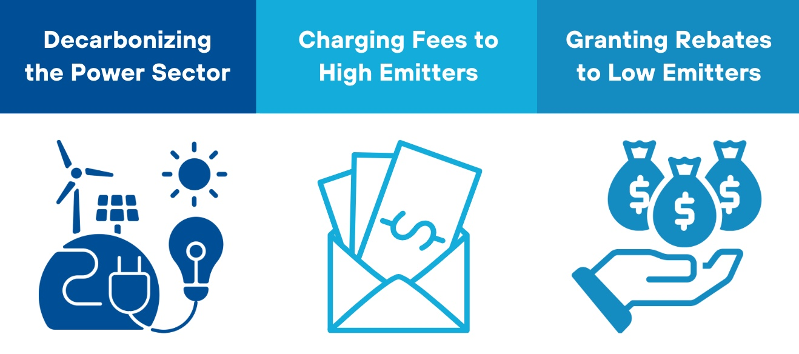
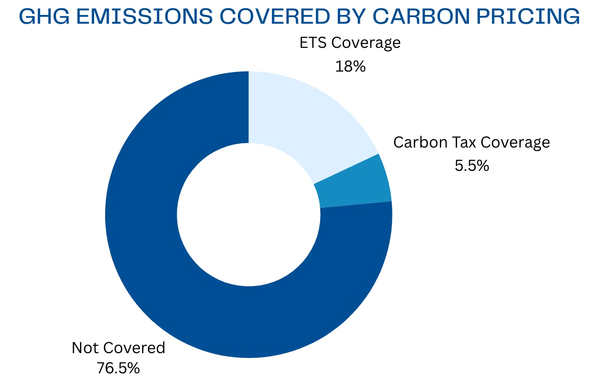

**Proposal Overview**

This proposal presents a strategy for decarbonizing the power sector using a **feebate approach.** The proposed system, which imposes **fees on high-emission activities** and **rebates for low-emission alternatives**, is an alternative to carbon taxes in sectors where coal use is prevalent, particularly electricity generation. Feebates offer a dynamic, politically feasible mechanism that incentivizes early transition without imposing across-the-board price hikes that could discourage low-carbon energy use in the long term. By combining multiple feebates, the system can mimic the effects of a consumption-based carbon tax, but with fewer political disruptions.

Feebates are **revenue-neutral**, unlike carbon taxes, which raise revenue. However, the paper suggests combining feebates in coal-dependent sectors with **revenue-raising taxes** on other fuels or transitioning the feebate system into a carbon tax over time, allowing for a gradual, more transformative shift toward decarbonization.

**Key Issues to be Addressed**

***THE POWER SECTOR:*** Electricity generation is a key sector of the economy that produces significant emissions. Electrification is the principal means by which the other sectors, notably including cars, trucks, and heating/cooling of buildings, can reduce their emissions in deep decarbonization scenarios. The power sector, once it is reduced in emissions intensity, can act as an energy vector for the other sectors that currently use fossil fuels directly.   

***AN ALTERNATIVE TO CARBON TAX:*** Carbon taxes have been implemented in only a few countries, and most carbon prices remain well below the \$40-80/tCO2 range required by 2020 to meet the 2°C temperature target, as recommended by the High-Level Commission on Carbon Pricing (Stiglitz & Stern, 2017). Frequently, major industries or fuels are exempted or subject to reduced rates due to concerns that rising fuel prices from a carbon tax could increase costs for industrial firms competing in international markets.

Imposing a carbon tax across all sectors, including coal, is justified not only due to coal’s significant climate impact but also because of its contribution to local air pollution (Parry et al., 2015). A sufficiently high carbon tax could lead to substantial emissions reductions. However, the resulting increase in coal prices would impose considerable transitional costs and could trigger strong political resistance from coal producers, industrial users, and the general public.

Because a carbon tax is inherently tied to the carbon content per unit of fuel, the tax’s politically and economically feasible level is often constrained, particularly in coal-dependent sectors.

Source: [World Bank (2023)](https://openknowledge.worldbank.org/server/api/core/bitstreams/f34bc312-dd6c-4add-ba80-069b5ac20d36/content)

**Stakeholders**

***Government/ Policymakers:*** Policymakers are able to ease the transition to a low-carbon economy by creating a system that functions like a gradually increasing carbon tax. This avoids the need for repeated political battles that would arise with each proposed hike in a traditional carbon tax.

***Financial Institutions:*** These institutions may provide financing or technical support for the policy, especially for clean energy projects or capacity-building efforts tied to the feebate system.

***Power Sector Companies:*** Fossil fuel-based power producers face costs incentives to close down power plants while renewable energy firms gain dominance.

***Consumers:*** Energy consumers experience changes in electricity prices, leading to increased demand for renewable energy options.

**Implementation**

1.  ***‘Grandfathered’ Approach:*** In this variant, owners of high-carbon assets like coal power stations receive a higher subsidy per MWh produced for a limited time, compensating for capital losses from stranded assets. This recycling of revenues within specific fuel types (coal, gas, oil) ensures no net tax burden for the sector while incentivizing a shift from coal to renewables. After a few years, all producers would receive the same subsidy per MWh.

2.  ***Incentivizing Dispatchable Electricity**:* Another option is to adjust subsidies based on the ability to dispatch electricity, providing stronger incentives for renewable energy projects with storage. This approach ties subsidies to short-run marginal costs, ensuring a reliable energy supply, and applies storage and demand response incentives to energy consumption as well.

3.  ***Bringing Forward Subsidies**:* Governments could advance Output-Based Rebates (OBR) subsidies to encourage faster coal phase-outs. For example, "cash-on-delivery" subsidies could be provided for renewable energy projects with storage, replicating the OBR scheme and stimulating demand. These efforts could also attract support from international financial institutions.

4.  ***Tax Burden Mitigation**:* Feebates could be designed to recycle tax revenues within the electricity sector. For example, taxes on coal used in power plants could be refunded to producers based on their output, incentivizing faster transitions to renewables. This approach would spread transitional costs between electricity consumers and slower coal generators, depending on the pace of the phase-out.
