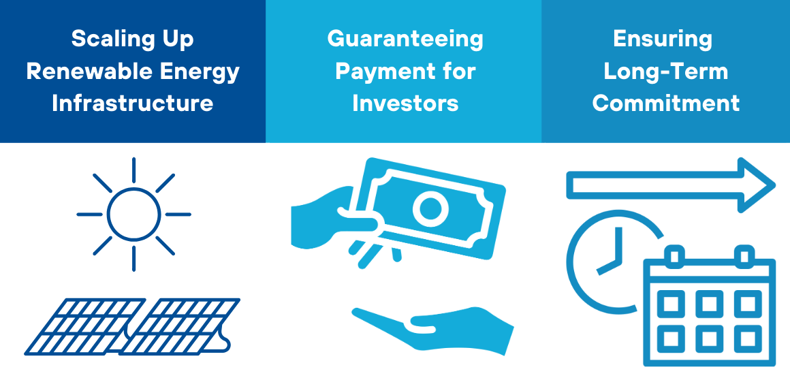
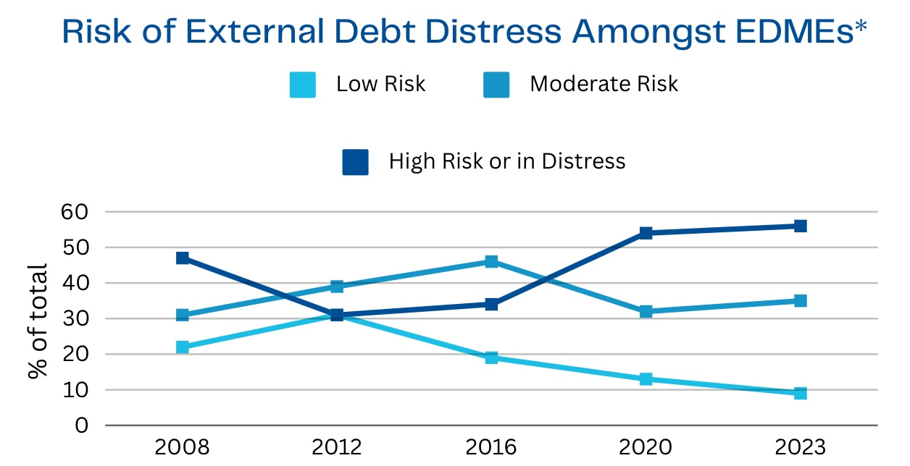

## Proposal Overview

This proposal for a Solar Payments Intermediary and Finance Agency (SPIFA) outlines the creation of a SECI (Solar Energy Corporation of India)-type institution tailored for developing countries, particularly Small Island Developing States (SIDS), to drive investment in renewable energy infrastructure. The core idea is that to enforce climate policy and attract long-term investment, a stable pricing structure and lasting commitments are essential.

An intermediary institution would manage price agreements for investors, enabling countries with limited financial capacity to secure funding. In cases where financial markets are underdeveloped, like in SIDS, SPIFA would organize project finance structures that offer low-cost financing for renewable energy infrastructure. Once projects are built, they could generate high returns, allowing countries to refinance at lower costs, pay off initial debts, and support sustained infrastructure development.

## Key Issues to be Addressed

**LOW CREDIT-WORTHINESS:** Many low-capacity countries face challenges in accessing international financing due to their low credit-worthiness, which is often linked to political instability, economic vulnerabilities, and weak financial systems.

**DEBT BURDEN:** Many low-capacity countries are already facing high levels of debt, which limits their ability to borrow further without exacerbating their fiscal crisis. Adding debt for renewable energy development could increase their financial vulnerability. Therefore, solutions need to ensure that new renewable energy projects do not increase the debt burden, instead offering mechanisms like the pay-as-you-go model that distribute costs over time, rather than requiring significant upfront borrowing.

**SCALING RENEWABLE ENERGY PROJECTS:** Scaling renewable energy in these countries is critical to reducing dependency on imported fossil fuels and achieving climate goals, but it requires significant capital investment, technology transfer, and infrastructure development. The challenge is to create financing models that allow low-capacity countries to deploy renewable energy systems at scale, while managing financial risks and ensuring the projects are viable in the long term.

## Core Components

### Renewable Energy (RE) Contract Intermediary Agency

This would be managed by the Multilateral Investment Guarantee Agency (MIGA) and act as an intermediary for renewable energy contracts. It would increase investment certainty by guaranteeing revenue for renewable energy projects, much like the Solar Energy Corporation of India (SECI) does for solar projects in India. This global facility would secure payments for renewable energy projects through mechanisms such as capacity tariff auctions and Contracts for Difference, providing a reliable financial structure for climate policy commitments.

### Two-Stage Project Finance Model

Managed by either MIGA or the International Finance Corporation (IFC), this model would support low-capacity countries. It would begin with equity and loan financing, followed by the issuance of bonds secured by guaranteed future cash flows from renewable energy projects. Pension funds could also invest in these securitized cash flows, providing long-term, stable financing for green projects.

### Energy Contracts for Debt-Distressed Countries

This function would provide financial services to countries in debt distress, such as SIDS, using a ‘pay-as-you-go’ energy service contract. This model ensures that these countries can develop net-zero energy systems without increasing their debt burden. By transitioning to cleaner and more stable energy sources, these countries could reduce their reliance on expensive imported fossil fuels, lowering both costs and fiscal risks. The preferred creditor arrangement of the World Bank Group (WBG) would protect investors from losses, ensuring that delays in payments are managed without affecting the financial stability of the projects.
