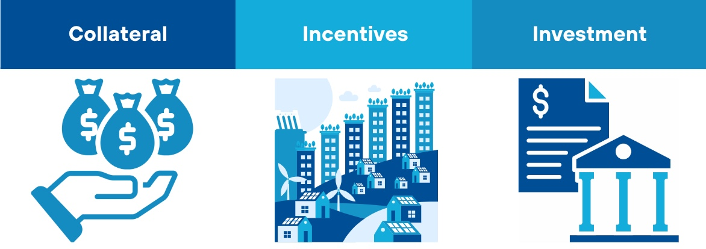
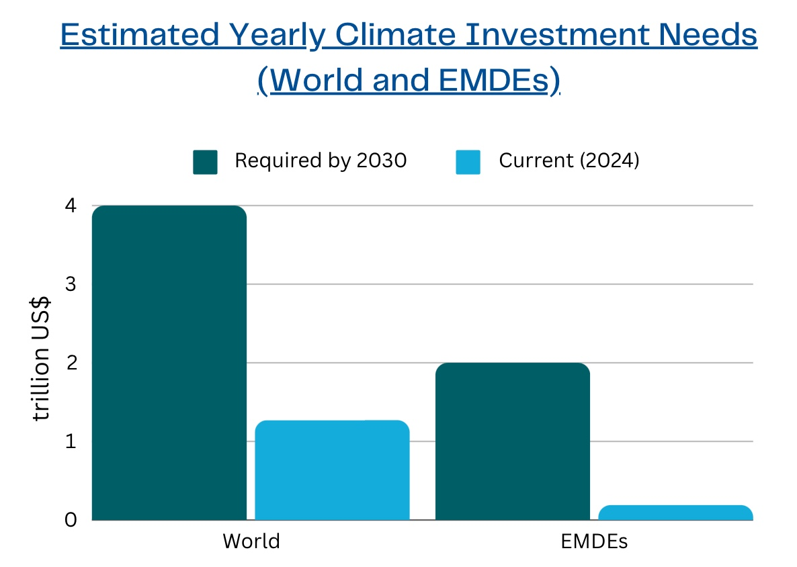
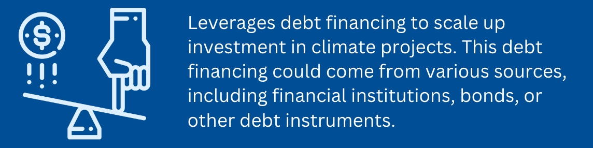
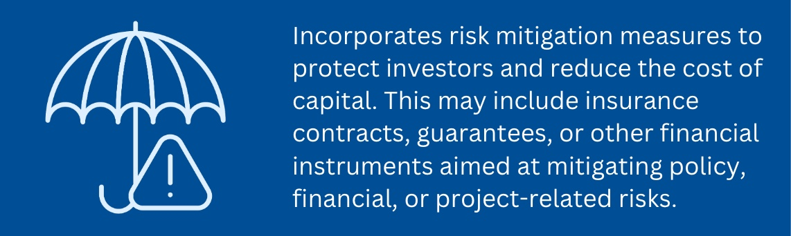
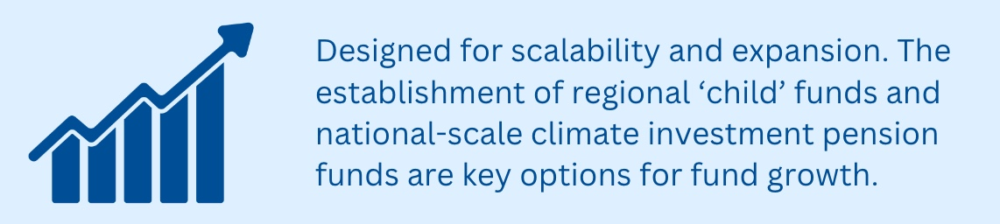
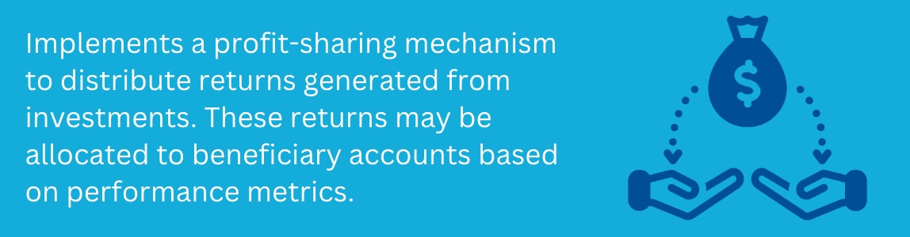
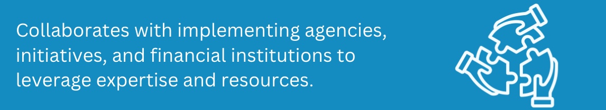

**Proposal Overview**

The **Climate Incentives Trust (CIT)** proposal aims to expand global public funding for climate mitigation before 2050 and increase funding for loss and damage protection afterward. The proposed mechanism provides **insurance** against climate risks in exchange for sovereign commitments, **invests** in early-stage renewable energy projects, and **incentivizes** countries to reduce emissions.

The trust, funded by donor countries and managed by the World Bank Group, establishes nationally allocated beneficiary accounts designed to mitigate long-term fiscal risks and attract additional private investment. By lowering borrowing costs and leveraging national accounts as collateral, the CIT supports global climate goals while protecting countries from future climate-related financial burdens. The CIT's beneficiary accounts are structured to allocate funds to specific populations or projects within each country, rewarding progress on climate policies. Should any policy actions be reversed, the funds could be partially reclaimed to reinforce accountability.

**Key Issues to be Addressed**

***INCENTIVES FOR CLIMATE ACTION:*** Achieving global net-zero emissions necessitates coordinated national policy actions and increased investments in clean energy. Developing countries often grapple with the challenge of prioritizing development goals, which can sideline critical climate initiatives.

***FINANCIAL SCALE:*** Ideally, any national government or municipality aiming for a swift transition to net zero (by 2050 or sooner) but struggling to attract significant private investment or access low-cost financing, should receive financial support from the World Bank or associated institutions. However, the availability of such funding remains limited.

***RISK REDUCTION:*** To foster investment in green projects within developing countries, equity capital is essential to absorb risks that may deter investors, such as policy reversals or fluctuations in foreign exchange rates.

Sources: [Climate Policy Initiative (2023](https://www.climatepolicyinitiative.org/publication/global-landscape-of-climate-finance-2023/)); [IMF (2023)](https://www.imf.org/en/Blogs/Articles/2023/11/27/world-needs-more-policy-ambition-private-funds-and-innovation-to-meet-climate-goals)

**Stakeholders**

***Participant/ Recipient Countries:*** Emerging markets and developing economies facing difficulties in accessing affordable debt financing for their renewable energy transitions, as well as for research and innovation aimed at reducing GHG emissions. These countries receive risk protection to boost investment flows in the near term and can use national-scale accounts as collateral for borrowing related to climate change mitigation and adaptation. Post-2050, these countries will be the primary beneficiaries of the fund.

***World Bank Group:*** The WBG manages the trust in accordance with its Trust Fund Policy (2021), ensuring both financial returns and meaningful climate impact.

***Donors:*** Wealthy donor countries provide the initial funding for the trust. Donors also hold voting shares, giving them decision-making power within the trust.

***Investors:*** Private investors are allowed to contribute to the trust but are required to pay a percentage of their investment returns as a fee. By de-risking investments in the early stages of projects in developing countries, the trust encourages greater private sector investment.

**Implementation**

