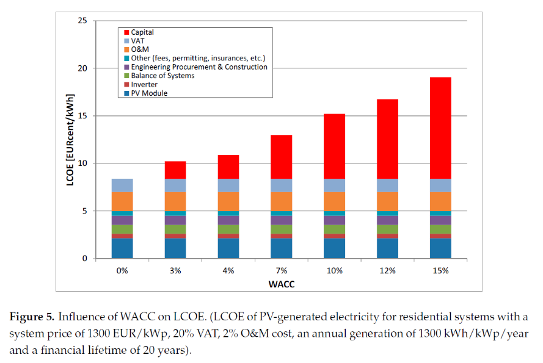
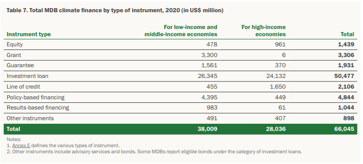
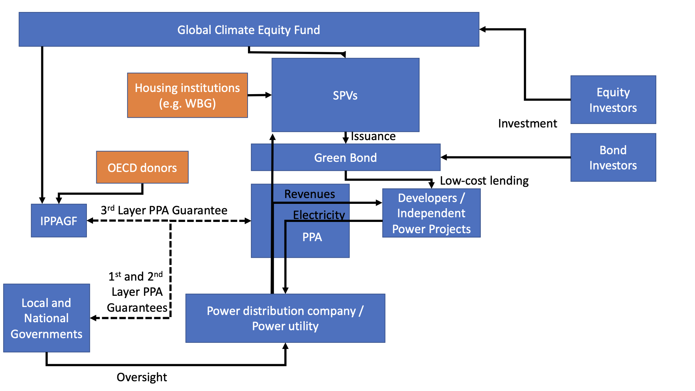

**Proposal for a Global Solar Economy Financing System**

*September 2023*

*Stephen Stretton, Nils Zimmermann, Pablo Salas, Claudio Forner*

**Abstract**

This proposal introduces a financing model to accelerate the deployment of solar power and other renewable energy (RE) projects in developing countries by leveraging an international de-risking mechanism combined with a global public equity fund. The proposed structure aims to reduce financing costs for RE infrastructure by securitizing Power Purchase Agreements (PPAs) through ‘International Power Purchase Agreement Guarantor Facilities’, which are backed by governments and managed by multilateral financial institutions. Paired with a ‘Global Solar Economy Equity Fund’, this model attracts risk-averse investors, such as pension funds and sovereign wealth funds, while incentivizing countries to act early through profit-sharing mechanisms.

# **Executive Summary**

**Challenges:** At least a trillion dollars a year in clean energy infrastructure finance must flow into emerging and developing economies if the goals of providing universal access to modern energy (SDG 7) and climate stability (SDG 13) are to be achieved. This will require mobilizing very large volumes of private investment capital. Unfortunately, many private investors have been reluctant to invest in EMDEs because of perceived country risk. Moreover, EMDEs need low-cost energy, but the levelized cost of clean energy depends heavily on the weighted average cost of capital (WACC), and WACC tends to be high in EMDEs, again due to foreign exchange and country risks. A recent study by IRENA [(“The Cost of Financing for Renewable Power” 2023)](https://paperpile.com/c/f4vGg4/10Hhk) found WACCs from as little as 1.1% (Germany) to above 10% (PV in Ukraine). Overall, weighted capital costs in mature developed markets -- at 4.4% to 5.4% -- are considerably lower than in emerging markets, with the Middle East and Africa being as high as 8.2%. The challenge, therefore, is to mobilize large volumes of *very low-cost* capital for clean energy infrastructure development in EMDEs despite these risks. This will require internationally-organized financial de-risking mechanisms.

We address further challenges in this proposal. There are other aspects of needed scale: we need large-scale risk absorbing capital (equity) for financing global public goods, ‘first mover incentives’ so that those act rapidly achieve the greatest benefits; and standardization and commodification of investments in clean energy early-stage equity investments. Scale is achieved via profitability and high leverage, implying very high cost-effectiveness for impact donor-investors.

There have also been calls for international finance to adopt an ‘originate and distribute’ model, reducing the use of balance sheets and instead financing via low-risk bonds that can be distributed to local and national pension funds. Finally, there have been concerns that existing derisking proposals might constitute ‘privatised gain, socialised risk’. Here the goal is to socialise some benefit of derisking and cheap financing operations via profit sharing to participating countries.

**Proposal:** We outline how derisking tools, including securitization of power purchase agreements (PPAs) through special purpose vehicles called **“International Power Purchase Agreement Guarantor Facilities”** backed by participating governments and managed by multilateral public financial institutions, could be combined with a dedicated **“Global Solar Economy Equity Fund”** to bring in risk-absorbing for renewable energy infrastructure build-out in emerging and developing economies. Since countries would absorb much of the risk in the proposed structure, they would also share in the profits, providing incentives for early action.

Such structures will enable risk-averse investors (e.g., pension funds, sovereign wealth funds) to participate in the clean energy transition in developing countries, and developing countries to access capital for their clean energy infrastructure build-out at a low weighted average cost of capital.

Because electrification of energy systems will play the key role in achieving net-zero carbon emissions by 2050, and low-cost solar and wind power is expected to deliver a large portion of electricity world-wide by mid-century (for example in the [*IEA Net-Zero Emissions trajectory*](https://iea.blob.core.windows.net/assets/deebef5d-0c34-4539-9d0c-10b13d840027/NetZeroby2050-ARoadmapfortheGlobalEnergySector_CORR.pdf), about one third of total primary energy supply in 2050 [(IEA 2021b)](https://paperpile.com/c/f4vGg4/nRES) ), we have given the top-line name **“Solar Economy Financing System”** to our proposal, even though other technologies will, of course, also play important roles.

While it might seem that the proposals require a high level of financial sophistication, especially for low-capacity countries, one option is to develop the whole suite of financial solutions in a simple ‘pay as you go’ model for countries. An SOE in a small island state which currently imports oil for oil-powered electricity generation could be offered a lower ‘all in one’ deal for a deal paying a certain (slowly declining) price for electricity generated by solar, adopting a ‘pay as you go’ model. This would have the advantage of a low risk, declining contractual obligation, rather than formal debt.

**What Is Novel or Innovative in the Proposal?**

- First, we believe that the financial structure detailed below can reduce renewable energy development debt financing costs to levels comparable to those on developed country renewable projects.

- Second, we propose a hybrid Global Solar Economy Equity Fund, with investments from small investors and donor governments as well as institutional investors such as pension funds, that will earn and distribute profits to investors, but reinvest at least half of net income.

- Third, we think a fully scalable financial model is available that does not involve weighing down the balance sheets of any institution.

In our model, a) project development financing is off the balance sheet of energy companies, b) project financing is also off the balance sheets of financial institutions, c) financing does not significantly use up MDB lending space, and d) renewable energy finance does not increase developing country government liabilities.

**Potential**: The proposal involves an implicit ‘scaling dynamics’ that mobilizes an additional source of loss absorbing capital: equity+insurance funds. We believe this approach to have a high potential to scale rapidly in the RE sector, which is nearly half of total mitigation investment needs.

#  

# **Introduction: Context and Problem**

According to a June 2023 joint report by IEA and IFC, “[*Scaling Up Private Finance for Clean Energy in Emerging and Developing Economies*](https://www.iea.org/news/iea-ifc-joint-report-calls-for-ramping-up-clean-energy-investments-in-emerging-and-developing-economies),” to meet rising energy needs and put the world on track to reach the global Paris Agreement target of net-zero emissions by 2050, capital spending on clean energy in emerging markets and developing economies (EMDEs) must more than triple, from USD \$770 bn in 2022 to USD \$2.8 trillion annually by the early 2030s. The bulk of this investment needs to be private [(IEA 2021a)](https://paperpile.com/c/f4vGg4/Yl3U).

A critical component to the transition is the cost of capital felt by projects in developing countries. The cost of capital is generally lower in developed countries than developing countries, reflecting higher sovereign borrowing costs which tend to be passed on to developing countries. A higher cost of capital affects renewable energy severely, slowing down the transition. For example, this paper [*(Ameli et al. 2021)*](https://paperpile.com/c/f4vGg4/Zg8Y) argues that “policy interventions lowering WACC values for low-carbon and high-carbon technologies by 2050 would allow Africa to reach net-zero emissions approximately 10 years earlier than when the cost of capital reduction is not considered”.

There is thus an urgent need to scale up low cost private capital to close the financing gap in EMDEs (where climate mitigation action is needed the most), given that EMDEs have limited fiscal space, and international institutions such as the World Bank have limited capacity for lending (and for loan guarantees). As the IEA-IFC report notes, “mobilizing private finance to support the clean energy transition will require the expansion of existing and the launching of new financial instruments, as well as innovations in establishing efficient platforms and partnerships.” This brief proposes a specific approach in that vein.

Solar power is expected to play an increasingly central role in the clean energy transition. In autumn 2020, during the release of the IEA’s flagship annual World Energy Outlook, IEA Executive Director Fatih Birol said: “Solar is the new king of the global electricity markets.” Comprehensive electrification of energy systems is crucial to achieving net-zero by 2050, and low-cost solar PV will play the central role in power generation in most of the world (some techno-economic studies project that solar PV will provide 70% or more of humanity’s primary energy by 2050 on the strength of being the lowest-cost power generation technology). This is why we have a particular focus on solar power project finance in this brief - and why we’ve named our proposal “Solar Economy Financing System.”

Private financial institutions have large quantities of finance available for low-risk investments. But they are currently not participating in the low-carbon energy transition in EMDEs at the scale climate and clean energy policy targets would require, due to risk perceptions and various institutional barriers. Studies[^1] have shown that new renewable generation outcompetes fossil-fueled alternatives in many cases in terms of levelized cost of energy (LCOE), but important *financial* (rather than economic) barriers remain that impede renewable energy investments in EMDEs. A key factor is that the capital costs of renewable energy projects are heavily front-loaded, and interest rates paid by project developers tend to be much higher in EMDEs than in developed economies. In other words, the cost of capital is a critical constraint on meeting the required scale of renewable energy investments in developing countries.

Figure 1: influence of WACC on LCOE of PV-generated systems with a system price of 1300EUR/kWp, 20% VAT, 2% O&M cost, an annual generation of 1300kWh/kWp/year, and a financial lifetime of 20 years. Source: [*Jäger-Waldau (2017), Snapshot of Photovoltaics*](https://www.mdpi.com/2071-1050/9/5/783)

While MDBs have been working with governments and financial institutions to test innovative green/climate financial instruments, the majority[^2] of MDBs’ climate financing is carried out through direct lending. More focus is required on how MDB finance could be leveraged to reduce the risks of green investments faced by private investors. The following sections propose one way to do that - comprehensively, globally, and on the enormous scale required.

Figure 2: Total MDB climate finance by type of instrument, 2020 (in US\$ million). Source: [*Joint 2020 Joint Report on MDBs’ Climate Finance*](https://thedocs.worldbank.org/en/doc/9234bfc633439d0172f6a6eb8df1b881-0020012021/original/2020-Joint-MDB-report-on-climate-finance-Report-final-web.pdf)

# **How the Scheme Works**

There are three components to the proposed scheme:

- WB Guarantees to those countries that conduct renewable auctions

- Special Purpose Vehicles (SPVs) for issuing de-risked green bonds backed by the guaranteed revenues;

- A global equity fund, which co-invests in the early stages of project construction and takes profit through refinancing both of the debt and equity components

These components are covered in detail in the next sections.

Three components not covered here but could be developed at a later date include:

1.  Accessing both global and domestic financing through derisking (i.e., once the risk is concentrated away from the deb component, it becomes easy to offer green deposits (green money market funds) as well as de-risked green bonds to access global financing

2.  Wrapping up the financial components offshore (perhaps initially in the IFC) in a simple ‘pay as you go’ model for clean energy, so that countries are not exposed to risk (FX, interest rates etc.) and have contractual certainty (e.g. they pay 6c/kwh for clean energy this year, 5.9c/kWh next year, and so on)

3.  Providing standardized pre-approved pre-connected sites for renewable development (see appendix for more information on this).

#  

# **Details of the Scheme Components**

## **Guarantees for Solar Power Project Revenue Risks**

[*PPAs are agreements to purchase power*](https://ppp.worldbank.org/public-private-partnership/sector/energy/energy-power-agreements/power-purchase-agreements) from a power station – i.e., in the context of the Solar Economy Financing System, a solar PV farm or a hybrid solar + wind + energy storage park. PPAs guarantee the price paid per MWh by the grid operator (usually a State-Owned Enterprise, SOE) to an Independent Power Producer (IPP) over a long time horizon - often 10, 15, or even 25 years. Power purchase agreements are commonly used in electricity systems where the grid operator is a state-owned enterprise and power project developers are private companies (“independent power producers,” IPPs). Here we refer to PPAs to also include Feed in Tarrifs (FITs) and any other mechanisms for guaranteeing the price paid for revenues from projects.

PPAs are [*often assigned through auctions*](https://www.sciencedirect.com/science/article/pii/S0973082621000272). Auctions should align with [*best practices*](https://www.usaid.gov/sites/default/files/2022-05/USAID_SURE_Designing-Renewable-Energy-Auctions-Policymakers-Guide.pdf); among other things, they should be open to a wide range of participants.

In our proposed scheme, participating developing countries would scale up the number of PPA auctions, which have [*played a key role in recent years*](https://gjia.georgetown.edu/2020/02/24/part-i-how-auctions-helped-solar/) in achieving ever-lower solar power prices.

In the following sub-sections, we describe some of the key risks faced by investors in renewable energy projects in EMDEs, and strategies for mitigating those risks. The Solar Economy Financing System would employ standardized tools for mitigating these risks, available to participating project developers (and their investors) in participating countries.

**2.1 Risk of Non-Payment or Tardy Payment by Electricity Off-Takers**

A further financial risk to solar power or hybrid renewable energy generators is the risk of non-payment or late payment by off-takers (buyers of electricity from IPP projects). This has been a [*chronic problem in India*](https://cea.nic.in/wp-content/uploads/f___ca/2020/10/D_754_1603265813247.pdf), where, in several states, state-owned electricity distribution companies (Discoms) frequently get in arrears in their payments to power generators (Gencoms). The Indian government has, in consequence, set up a number of “[*payment security mechanisms*](https://www.ceew.in/cef/masterclass/explains/how-payment-security-mechanism-works)” to help the Gencoms. This section leans on India’s experience and generalizes the lessons learned.

To address this class of risk using a standard mechanism applicable across many EMDEs, qualifying PPAs could be provided with triple-backed payment guarantees, so that power producers enjoy greatly reduced exposure to risks of non-payment or late payment by their clients (i.e., electricity buyers - which in many cases are state-owned transmission companies).

Guarantees that PPA payment stream terms will be honored could be offered directly by national, state, or regional governments through mechanisms similar to those employed by the Indian government. However, while PPA payment guarantees should be offered by governments as a condition of participation in the Solar Economy Financing System, we propose that the management of the process of implementing these guarantees should be achieved through an international PPA payment guarantee facility. Let’s give this hypothetical entity a placeholder name: “**International PPA Guarantor Facility,” IPPAGF**.[^3]

The details of this facility are described in an appendix; the idea is similar to the process in India (Solar Energy Corporation of India, SECI).

There are two other risks that we mention here for completeness.

**2.2 Forex Risks**

Forex risks are a problem if there is a mismatch between the currency of the PPA guarantee and the financing currency. The easy way to reduce these risks is to either denominate PPAs in USD (or the hard currency that is financing the project); or to denominate in local currency. In both cases, similar structures to what is proposed here are needed. There is also the case where there *is* a mismatch. In that case FX risk needs to be considered. We deal with this in an appendix.

**2.3 Risks to the guarantor from guaranteed prices that are too high**

Another financial risk (borne by electricity off-takers) relates to the long-term secular decline in the cost of solar panels and wind turbines, due to learning effects and economies of scale. In that context, PPAs should avoid locking in tariffs for too long a time-frame. Tariffs should be set at a rate high enough, over a sufficient time-frame, to ensure an IPP solar power or hybrid renewable energy project returns the project development costs to investors, without generating unearned rents. Accordingly, PPA tariffs could be structured to decline over time (e.g. linearly over a ten- to twenty-year time horizon), and/or have a sunset clause, with payments per MWh after a specified date based on an international index of average solar PV costs for new PV project construction.

The problem is in the context of an overall power system where the marginal cost of power is declining, having price guarantees in that system might be hard to stomach since new investments could be achieved for less. This problem is solved by real terms declines in PPAs (for example a fixed in nominal terms PPA in a weak currency, which would decline in real terms). I suggest pay ay more in the early years (in real terms) so that the future electricity market is not 'underwater'. This issue is important if any PPAs are issued in strong currency: in that case it's important that they are time-limited or decline in real terms.

More information about the guarantees is available in an appendix.

##  

## **Special Purpose Vehicles for Issuing De-risked Green Bonds**

**In this section, we outline a novel mechanism for de-risking operating EMDE renewable energy projects: Securitization of debt repayment revenue flows from good quality PPAs/Power Offtake Agreements, with a three-layer guarantee structure to ensure power producers get paid on time for electricity generated.**

Each special purpose vehicle, which we will call an **SEFS-SPV (Solar Economy Financing System Special Purpose Vehicle)**, would be housed within an existing international financial institution, e.g. the World Bank’s IFC, or African Development Bank, or DEG (a development banking unit of Germany’s KfW), or Proparco, the private-sector development banking subsidiary of France’s AFD Group. Commercial/investmebt banks could also be interested. The primary purpose of such a green-bond-issuing SPV would be to raise money at very low interest rates from risk-averse investors, and lend money at very low interest rates to independent power producers (making enough of a spread on the average difference between the bond rate and the lending rate to cover operating expenses and projected losses from non-performing loans made to RE power project developers).

**The key innovation in this SPV would be that once a participating power project whose revenues are assured by a qualifying PPA is operational, it will qualify for low-interest refinancing through the SEFS-SPV.**

The core idea is that the SEFS-SPV would lend money to only to companies whose business model is to operate already completed, operational solar power projects (or other existing RE power generating assets). It would not expose itself to new-project development risks.

The new-project development phase would be co-financed by the Global Solar Economy Equity Fund (described in Section 4 below) or by some other early-stage project development financier.

In many cases, companies that develop greenfield renewable energy projects (i.e. obtain the necessary land, money, and permits and physically build them) sell the projects to operating companies, take the money, and use it to develop the next greenfield project. The Global Solar Economy Equity Fund described in section 4 below will have the mission of supporting such developers, by providing risk capital in exchange for equity shares.

In contrast, the SEFS-SPV, by limiting its activities to helping power generation plant operating companies to finance the acquisition of already-built, already-operational solar power parks (or other renewable energy power generating parks) from project developers, will have a much lower-risk portfolio of assets (when compared to a lender that finances the much higher-risk new-project development phase of solar or wind farms). This, in combination with first-loss guarantees made on behalf of the SEFS-SPV by a consortium of OECD and EMDE sovereigns, is why bonds issued by a SEFS-SPV will carry very low interest rates

**A portion of the off-takers’ PPA-contracted payments for electricity received from the power generating company would go directly to the SPV, rather than to the power provider.** The amount that would go directly from the off-taker to the SPV would be the amount needed to cover interest and principal repayments for the debt component of the power project’s financing.

One helpful consequence of this arrangement is to reduce the overall likelihood of the SPV getting saddled with non-performing debt, by removing IPPs’ ability (and temptation) to allocate financial operating losses to their project finance lender (the SPV) if they run into cash flow problems. This will encourage IPPs to practice disciplined cash flow management.

Another helpful aspect of this arrangement is that the SEFS-SPV will be a much larger and more financially powerful entity than any of the participating IPPs. If and when off-takers (i.e. electricity distribution companies (Discoms) or corporate industrial clients who are contractually bound to IPPs via PPAs) get into arrears on PPA payments, they will swiftly find themselves dealing with highly professional specialized debt collectors sent from the SEFS-SPV (whether these are SPV employees or contracted agents) who are very well connected to relevant regional government agencies. SEFS-SPV agents will work with Discoms and regional governments to analyze problems and help Discoms (and the regulatory and technical agencies supervising them) adopt reforms and best practices designed to mitigate the issues that tend to lead to late-payment or non-payment problems on the off-taker side.

**In effect, the debt-servicing component of the payment stream specified under the PPA would be ‘securitized’. The SEFS-SPV would package the repayments coming in from many PPA income streams into securities issued into the market (i.e., green de-risked bonds).** Each SEFS-SPV (there could be more than one such SPV, e.g. one in each major global region) would be managed by an international financial institution (for example, an MDB or other DFI or a global investment bank). Any losses incurred by a SEFS-SPV due to non-performing PPAs would be covered, in the end, by the Global Solar Economy Equity Fund, i.e. the buffer fund described in section 4 below. In addition, AAA-rated institutions (e.g., a sovereign and/or a group of OECD sovereigns, or agents backed by these sovereigns) would also guarantee the SPV(s) against any losses, adding another layer of de-risking.

The goal of the SPVs would be to borrow money from institutional investors at rates as close as possible to the rates enjoyed by the safest sovereigns (e.g., Germany, USA, Switzerland). To minimize forex risk, the currency mix of the bonds issued would match those of its participating PPAs.

##  

## **Global Solar Economy Equity Fund: A mechanism for absorbing early-stage project development risk and residual guarantor risk, and socializing the gains from refinancing**

Here we propose a Global Solar Economy Equity Fund (GSEEF) to participate in scaling up renewable energy by providing power project developers with *project development risk equity funding,* i.e. GSEEF will serve as an equity co-investor, a provider of risk capital to co-finance the relatively high-risk early project development phase of IPP power generation development projects.

From the point of view of private companies whose business model is development of new solar parks or other RE projects in EMDEs, recruiting GSEEF as a co-investor in RE project development ventures will be highly desirable: it will tend to reduce the cost of debt capital extended to the project developer, and should also smooth the path of land acquisition and permitting. The reason is that GSEEF will be a very large fund, giving it the resources to increase its stake in a project if need be (should an otherwise good project hit delays or unexpected costs during the development phase). Moreover, GSEEF’s participation in a development project will be contingent on GSEEF due-diligence staff’s assessment that the project being invested in (and the project development company itself) are credible. This will reassure lenders (e.g. commercial banks), leading to lower-interest loan terms.

GSEEF will co-finance the development of new solar power parks (or other qualifying RE projects) and once a project has been built, fully permitted, and grid-connected, GSEEF can either retain its shares so as to collect a portion of net PPA income during the solar park’s operating life, or sell some or all of its shares in the newly operational solar park to operating companies (companies that may, in many cases, be debt-financed by the SEFS-SPV as described in section 3 above). GSEEF can then take the money gained from the sale of those shares and invest it in the next project development, thus recycling project development funds. Alternatively, if GSEEF retains its ownership stake in a project into the operating (PPA revenue-generating) phase, GSEEF could recycle the attendant income stream by co-investing in additional new solar park development projects.

GSEEF will be a key part of overall RE project finance derisking within the Solar Economy Financing System. The investors in GSEEF could be a) governments, b) pension funds c) funds that sell on the shares to retail investors in developing countries. Because GSEEF would own shares in a growing (and in due course very large) portfolio of PPA-secured renewable energy generating assets, it would enjoy an increasingly large flow of net income.

### **Profit Sharing Provisions**

The fund could feature *profit-sharing provisions.* In early years, to speed the pace of new solar park development, GSEEF could re-invest all of its net income and disburse none of its profits as dividends. In later years, some portion (say 25%) of net profits from the fund could be allocated directly to the adult citizens of participating countries on a per capita basis, i.e., a universal solar energy dividend income, as a reward for their country participating in the scheme. Another (say) 25% could be paid out to investors as dividends.

The remaining 50% of net income from PPA energy sales could continue to be reinvested, until some future year (e.g. 2050) in which participating countries had achieved a per capita clean energy target corresponding to a high average level of energy prosperity (e.g. 45 MWh per person per year). After that target has been achieved, a larger percentage of profits could be disbursed rather than re-invested (e.g. 80% of net income could be disbursed, rather than 50%), half to adult citizens on a per capita basis and half to equity investors. In this way, developing country populations would in effect be beneficiaries of a sort of supplementary pension fund, based on sales of electricity from participating clean power generation assets.

In each renewable energy development project that qualifies and is approved for participation in SEFS, the project developer would be issued relatively low-cost debt finance for the development phase (perhaps 70% of project development costs would be debt-financed, and 30% equity-investment-financed). The loan could come from a bank or development finance institution affiliated with SEFS (but not from the SEFS-SPV, which will not participate in any new project development - SEFS-SPV will only lend for purposes of refinancing already-operational solar and RE parks, as detailed in section 3).

In exchange for this privilege, the project developer would agree to allow the Global Solar Economy Equity Fund to either participate as an investor (and equity co-owner) during the project development phase, or be given an option to purchase, at a pre-agreed price, a share of the company that will own and operate the solar park once development phase is complete and the power project is operational.

The advantage of the latter option is that the Global Solar Economy Equity Fund would not be exposed to any construction risk. So, for example, imagine a solar PV park project requiring \$1.0 million, 80% of which is financed with a de-risked loan from the SPV, and the remaining 20% with \$200k in equity investment funding. In the construction phase, this \$200k is supplied by the private project developer as risk capital. In exchange for the privilege of low-cost borrowing of the \$800k debt component, the project developer is required to issue an option to the Global Solar Economy Equity Fund that gives it the right to purchase 15% of the solar park’s equity shares for \$150k on completion of the project’s development phase. Should those shares be worth more than \$150k, as is likely given low funding costs, the equity fund would profit.

We expect that this new model would, in the early years of its deployment, lead to a higher level of profitability for the investors, both the private component and the Global Solar Economy Equity Fund component, than in later years. This is advantageous because high levels of profitability will stimulate interest both in solar projects and in the Global Solar Economy Equity Fund itself. Given the massive scale-up needed, early profitability is desirable; it will help accelerate the global clean energy transition. Over time, investors in potential solar plant would compete by bidding lower rates for the PPAs, reducing profit rates and lowering the auctioned cost of solar PPAs.

#  **Summary of Advantages**

In summary we propose that we organise solar projects into the following scheme:

- Co-investment in the early stages of standardized projects

- Guarantees of auctioned power purchase agreements

- Securitization of the revenue once built, combined with sale of the project equity stakes

- Wrapping up the entire financial infrastructure in standardized deals (slowly declining price per kwh) for developing countries with low financial capacity.

The scheme achieves several important objectives:

- It reduces the cost of capital on renewable energy development while enhancing its profitability

- It scales up scarce risk equity

- It creates the basis for a global public Global Solar Economy Equity Fund that participates in projects and recycles scarce funds

- It opens out renewable energy projects to be the revenue backing of green sovereign-rated bonds

- It does these things cost-effectively with efficient risk management.

# **Appendices**

## **Appendix 1: Diagram Describing the Scheme**

## 

##  

## **Appendix 2: Details of the Guarantor Facility**

This section describes the mechanics of the guarantee facility.

Temporary loans could be made to IPPs by that facility to cover any temporary arrears on Power Purchase Agreement tariff payments owed to solar park operators by SOE electricity off-takers (Discoms, in Indian terminology). Alternatively, the facility could simply pay IPPs the outstanding amounts owed to them by a Discom in arrears, in exchange for acquiring the IPP’s financial claim on the Discom, with a late fee added to the bill that the Discom will in due course have to pay.

In addition to compensating power generators when off-takers are late with payments, to ensure the generators do not suffer cash-flow problems due to their clients being in arrears, IPPAGF would also cover non-payment of amounts owed under PPAs, which could arise if e.g. a power distribution company goes bankrupt, or refuses to pay the contractually agreed amounts. In such cases, IPPAGF would first pay out IPPs (power generators) the amounts owed them, and then turn to government guarantors to recover the money.

IPPAGF could in turn be backed by OECD donor countries. Its day-to-day operations costs could be funded by modest surcharges per MWh on power produced by participating power producers (IPPs), but these surcharges would not encompass payouts to power producers to compensate them for off-takers’ non-payment or for forex losses. IPPAGF would in effect act as an insurance fund against non-payment or late payment by electricity buyers within the IPPAGF-administered PPA system, but the insurance fees would not be built into PPA tariffs. Instead, a three-layered system of backers would provide the insurance coverage.

Recapitulating: The facility (IPPAGF) would pay IPPs the amounts owed by non-paying or late-paying transmission grid operator SOEs (i.e. Discoms) or other parties who have PPA contracts with the IPPs (Gencoms). To recover the money disbursed to IPPs, IPPAGF would (in the first instance) attempt to recover the money from the Discoms that are in arrears to participating IPPs (plus a penalty fee for lateness). If that proves impossible within a contractually specified time-frame, then, in the second instance, IPPAGF would claim payment from the relevant regional or national government (provided that government has agreed in advance to participate in the guarantee system).

A third layer of recourse would round out the triple-layered PPA payment guarantee system and remove any remaining risk to participating solar power generators. The proposed third-layer mechanism, called the Global Solar Economy Equity Fund, is described in section 4, further below. It would be the final guarantor of PPA payment streams; it would be called on to compensate IPPAGF for its outlays of money to IPPs (Gencoms) if (and only if) neither the SOE (Discom) nor the host government were willing or able to pay out the amount owed to the IPPAGF in consequence to IPPAGF having compensated an IPP for non-payment or late payment of electricity delivered to off-takers as per the PPA.

## 

## **Appendix 3: Useful Complimentary Scheme: A Network of Pre-approved solar projects**

**This section suggests that pre-approved locations for RE projects could be useful to facilitate rapid project construction**

**Land for solar and hybrid renewable energy project development must be allocated at low cost and with minimal administrative burden.** Developing country governments participating in the proposed Solar Economy Financing System would set aside land and grid connections for new solar PV parks or hybrid wind, solar, and energy storage system parks.

**In some cases, land could be allocated at or near newly retired coal power stations, so as to make use of their grid connections** - an approach [*Gireesh Shrimali*](https://www.smithschool.ox.ac.uk/person/dr-gireesh-shrimali), head of Transition Finance Research at Oxford University’s Sustainable Finance Group terms “coal plant repurposing”[^4] and that he and his colleagues have shown can provide large net financial benefits, e.g. in a study of repurposing old coal plants in [*Tamil Nadu*](https://climateriskhorizons.com/research/TN_Repurposing.pdf).[^5]

New large-scale renewable energy projects could connect directly to the grid in such locations, replacing coal power with dispatchable renewable power. Electricity price and delivery terms could be specified under new PPAs, or under re-negotiated and re-allocated PPAs that previously had been based on coal power. As an additional benefit, siting new renewable energy projects near existing or recently retired coal- or gas-fired power stations could **enable “just transition” initiatives in the form of employment opportunities for displaced coal-sector workers.**

Additional solar or hybrid renewable energy project options include community solar parks developed in tandem with new connections to the broader grid, and/or microgrid connections to local homes and businesses, and/or local electric vehicle charging points.

## **Appendix 4: Numerical Example with Notional Numbers Explaining the Scheme**

In general, we would expect that the effect of derisking would be a combination of a) reduction in contracted renewable auctioned tariff price and b) increased profit. We would expect some combination of both effects: i.e., an increase in profitability *and* a reduction in contracted price in some combination. We show both cases below.

  ------------------------------------------------------------------------------------------- ------------------------ ------------------------ ------------------------
                                                                                              **PV**                   **PV**                   **PV**

                                                                                              Without Derisking        With Derisking           With Derisking

                                                                                                                       Increase Profit          Reduce Power Price

  Asset                                                                                       Solar PV Utility Scale   Solar PV Utility Scale   Solar PV Utility Scale

  Size                                                                                        1MW                      1MW                      1MW

  Capital cost \$/MW                                                                          \$1,000,000              \$1,000,000              \$1,000,000

  Lifetime                                                                                    25                       25                       25

  Capacity %                                                                                  20%                      20%                      20%

  Power Produced Per Year                                                                     1752                     1752                     1752

                                                                                                                                                

  **Debt Interest Rates Assumptions**                                                                                                           

  *Developed*                                                                                 *7.5%*                   *2.5%*                   *2.5%*

  *Middle Income*                                                                             *10%*                    *5%*                     *5%*

  ***Lower Middle Income (LMIC)***                                                            ***12.5%***              ***7.5%***               ***7.5%***

  *Conflict/very poor*                                                                        *15%*                    *10%*                    *10%*

                                                                                                                                                

  *Derisking Assumptions*                                                                                                                       

  Private Debt Interest Rate (LMIC)                                                           **12.5%**                **12.5%**                **12.5%**

  Reduction due to guarantees of PPA                                                                                   -2%                      -2%

  Reduction in risk due to securitization of PPA through SPV and creation of the green bond                            -2%                      -2%

  Reduction in risk due to political risk guarantees                                                                   -1%                      -1%

  Final debt interest rate                                                                    **12.5%**                **7.5%**                 **7.5%**
  ------------------------------------------------------------------------------------------- ------------------------ ------------------------ ------------------------

Let’s now make some assumptions on the debt interest rate and how derisking could reduce this. The consequences are as follows for the financial characteristics of the project. As we can see, if we assume that the project has the same PPA (a strong assumption for sure), the project with derisking would be much more profitable than before. Rather than pass this on in reduced energy costs, we believe that some of this should help scale up a shared equity fund that is the final loss-absorber for any long-term risks. Once the fund has done its work, the profits would be shared with the people of developing countries through village-level infrastructure provision or per person payments at the end of the fund’s life (20 years in the future). It’s important to stress that the scheme is likely to produce a mixture of the second and third outcomes: some reduction in the cost of renewables and some increase in profitability.

+:--------------------------------+:-------------------------+:--------------------------------+:---------------------------------------------+
| *Power Pricing Assumption*      |                          |                                 |                                              |
+---------------------------------+--------------------------+---------------------------------+----------------------------------------------+
| Power Price USD/MWh             | \$ 74                    | \$ 74                           | \$ 51                                        |
+---------------------------------+--------------------------+---------------------------------+----------------------------------------------+
| Power Price USD/kWh             | \$ 0.07                  | \$ 0.07                         | \$ 0.05                                      |
+---------------------------------+--------------------------+---------------------------------+----------------------------------------------+
| **Revenues**                    | **\$ 130,000**           | **\$ 130,000**                  | **\$ 90,000**                                |
+---------------------------------+--------------------------+---------------------------------+----------------------------------------------+
| Proportion of Debt              | 80%                      | 80%                             | 80%                                          |
+---------------------------------+--------------------------+---------------------------------+----------------------------------------------+
| Proportion of Equity            | 20%                      | 20%                             | 20%                                          |
+---------------------------------+--------------------------+---------------------------------+----------------------------------------------+
| *Intervention approcach*        | **PV without Derisking** | **PV**                          | **PV**                                       |
|                                 |                          |                                 |                                              |
|                                 |                          | **with Derisking:**             | **with Derisking: for Reduced Solar Tariff** |
|                                 |                          |                                 |                                              |
|                                 |                          | **for Increased Profitability** |                                              |
+---------------------------------+--------------------------+---------------------------------+----------------------------------------------+
| Debt Interest Rate              | 12.5%                    | 7.5%                            | 7.5%                                         |
+---------------------------------+--------------------------+---------------------------------+----------------------------------------------+
| Equity Required Return          | 15%                      | 15%                             | 15%                                          |
+---------------------------------+--------------------------+---------------------------------+----------------------------------------------+
| Cost of Capital                 | 13%                      | 9%                              | 9%                                           |
+---------------------------------+--------------------------+---------------------------------+----------------------------------------------+
| Required Revenues               | \$ 130,000               | \$ 90,000                       | \$ 90,000                                    |
+---------------------------------+--------------------------+---------------------------------+----------------------------------------------+
| Price-Earnings ratio            | 6.7                      | 6.7                             | 6.7                                          |
+---------------------------------+--------------------------+---------------------------------+----------------------------------------------+
| Revenues                        | \$ 130,000               | \$ 130,000                      | \$ 90,000                                    |
+---------------------------------+--------------------------+---------------------------------+----------------------------------------------+
| Interest Costs per Year         | \$ 100,000               | \$ 60,000                       | \$ 60,000                                    |
+---------------------------------+--------------------------+---------------------------------+----------------------------------------------+
| Profit per year                 | \$ 30,000                | \$ 70,000                       | \$ 30,000                                    |
+---------------------------------+--------------------------+---------------------------------+----------------------------------------------+
| RRR                             | \$ 30,000                | \$ 30,000                       | \$ 30,000                                    |
+---------------------------------+--------------------------+---------------------------------+----------------------------------------------+
| Supernormal return              | \$ -                     | \$ 40,000                       | \$ 0                                         |
+---------------------------------+--------------------------+---------------------------------+----------------------------------------------+
| Initial Equity Investment       | \$ 200,000               | \$ 200,000                      | \$ 200,000                                   |
+---------------------------------+--------------------------+---------------------------------+----------------------------------------------+
| Equity Stake after appreciation | \$ 200,000               | \$ 466,667                      | \$ 200,002                                   |
+---------------------------------+--------------------------+---------------------------------+----------------------------------------------+
| **Equity Appreciation**         | **0%**                   | **133%**                        | **0%**                                       |
+---------------------------------+--------------------------+---------------------------------+----------------------------------------------+
| **Reduction in Power Tariff**   | **0%**                   | **0%**                          | **-31%**                                     |
+---------------------------------+--------------------------+---------------------------------+----------------------------------------------+

## **References**

> [IEA. 2021a. “Financing Clean Energy Transitions in Emerging and Developing Economies.” IEA.](http://paperpile.com/b/f4vGg4/Yl3U) <https://iea.blob.core.windows.net/assets/6756ccd2-0772-4ffd-85e4-b73428ff9c72/FinancingCleanEnergyTransitionsinEMDEs_WorldEnergyInvestment2021SpecialReport.pdf>[.](http://paperpile.com/b/f4vGg4/Yl3U)
>
> [———. 2021b. “Net Zero by 2050 A Roadmap for the Global Energy Sector.” International Energy Agency.](http://paperpile.com/b/f4vGg4/nRES) <https://www.iea.org/reports/net-zero-by-2050>[.](http://paperpile.com/b/f4vGg4/nRES)
>
> [“The Cost of Financing for Renewable Power.” 2023. IRENA.](http://paperpile.com/b/f4vGg4/10Hhk) <https://www.irena.org/Publications/2023/May/The-cost-of-financing-for-renewable-power>

[^1]: World Economic Forum (2020), [*Race to zero: this graphics shows the rapidly falling cost of renewables*](https://www.weforum.org/agenda/2020/11/cost-renewable-energy-falling-race-to-zero-emissions/)

[^2]: 2020 [*Joint Report*](https://reliefweb.int/report/world/2020-joint-report-multilateral-development-banks-climate-finance) on MDBs’ Climate Finance

[^3]: Note: This name and acronym are merely placeholders, internal to this document.

[^4]: Jindal and Shrimali (2022). [*Cost–benefit analysis of coal plant repurposing in developing countries: A case study of India*](https://www.sciencedirect.com/science/article/abs/pii/S0301421522001367). *Energy Policy,* May 2022.

[^5]: Gireesh Shrimali (2022). Financial Benefits of Repurposing Tamil Nadu’s Old Coal Plants. *Climate Risk Horizons,* May 2022.
