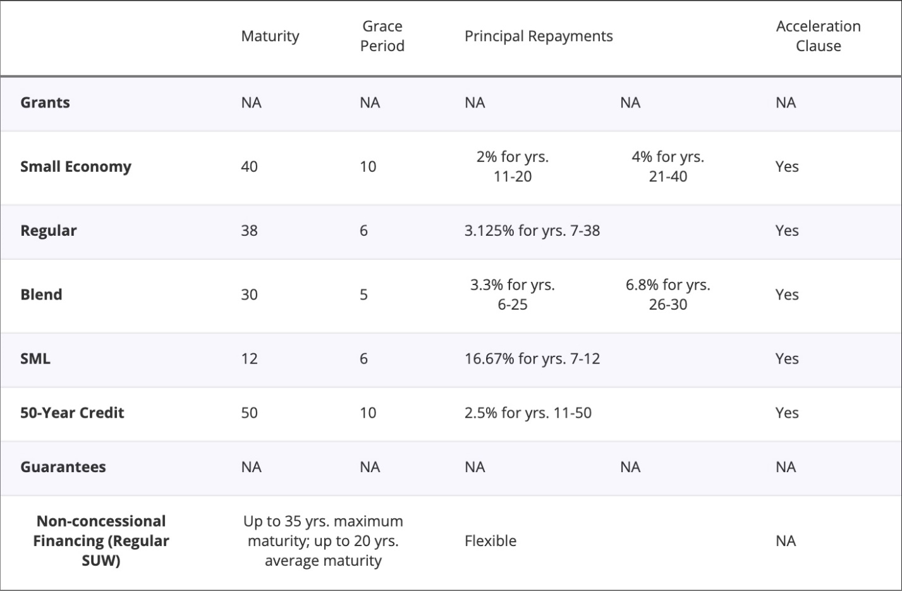

*Split on 17 September 2026. Part (i) became section 3.4 of 2.1; part (ii) became 2.4. Kept unchanged.*

**A Solar Economy Financing System**

Stephen Stretton, Jasper Zimmermann

World Bank, Washington D.C.

**Abstract**

The global clean energy transition requires an estimated \$4 trillion annually, with over \$1 trillion needed in emerging markets and developing economies. However, the high cost of capital in these regions poses a significant barrier to scaling up clean energy finance. This paper proposes a dual-structured solution to address this challenge, combining multi-tiered debt guarantees and regional clean energy equity funds. The guarantee structures would de-risk green bonds, enabling low-cost financing, while equity funds would absorb risks and catalyze additional investment. Together, these mechanisms aim to mobilize large-scale, financially sustainable clean energy investments, aligned with the World Bank's efforts to accelerate energy transitions in developing countries.

**Introduction to the Challenge**

The financing needs for the global clean energy transition are immense. According to the International Energy Agency, approximately \$4 trillion per year is required, with over \$1 trillion annually needed in emerging markets and developing economies (IEA, 2021). Without concessional financing or de-risking instruments, governments and businesses in developing countries face significantly higher interest rates compared to those in OECD countries. Additionally, clean energy financing demands are compounded by the need to retire fossil fuel-based assets, such as coal-fired power plants, earlier than anticipated and replace them with renewable energy, storage, and transmission infrastructure—leading to stranded assets. To meet the scale of financing required in developing countries, clean energy finance must be low-cost, comparable to World Bank (IBRD) intergovernmental lending rates.

[**World Bank IDA Terms (Effective as of July 1, 2024)**](https://treasury.worldbank.org/en/about/unit/treasury/ida-financial-products/lending-rates-and-fees)

The World Bank Group (WBG) plays a critical role in addressing this challenge, as outlined in its April 2023 report, *Scaling Up to Phase Down: Financing Energy Transitions in the Power Sector.* The WBG is uniquely positioned to enable low-cost financing and incentivize climate and energy-related policy action in developing countries. By collaborating with other multilateral development banks (MDBs), the WBG can help mobilize sustainable, low-cost debt using carefully designed de-risking instruments, which are essential for scaling clean energy investments.

To support these efforts, we propose a solution that complements the World Bank Development Committee's initiative to dramatically scale up policy financing. This structure could be applied to clean energy project financing or, with adjustments, to development policy financing. Risk-absorbing equity funds would enable the scale-up of lending, and risk-absorbing structures are essential to ensuring low-cost debt financing remains financially sustainable. For clean energy supply chain development in high-risk countries, loan guarantees can also be effectively deployed to mitigate political risks.

This brief expands on ideas explored in “[Scaling Up to Phase Down: Financing Energy Transitions in the Power Sector](https://openknowledge.worldbank.org/server/api/core/bitstreams/d0c0c6a2-f331-4bb9-b9d1-638d1f039e7d/content),” a report published in April 2023 by the Energy and Extractives Global Practice of the World Bank Group (WBG). As highlighted in the report, the World Bank Group plays a critical role in scaling up clean energy finance in developing countries by enabling low-cost financing and incentivizing climate- and energy-related policy action (WB, 2023). In collaboration with other multilateral development banks (MDBs), the WBG can help mobilize financially sustainable, low-cost debt using carefully designed de-risking instruments.

(further details can be found [*here*](https://drive.google.com/drive/folders/1W1aAQto_UZKZqbVb0dFPrGsSRB3k1M8C)).

**Summary of Proposed Solution**

We offer a policy solution for the challenge of scaling up finance for clean energy supply deployment in developing countries. The solution has two main elements:

(i) Multi-tiered in-depth guarantee structures for debt instruments (e.g. green bonds) issued by regional or national clean energy system development authorities to raise money for development of major clean energy system components in developing countries – e.g. new high-capacity transmission lines, EV charging networks, or regional solar PV equipment production factories.

    a.  We propose up to three loss-absorbing tiers. If the first tier is unable to absorb losses incurred by the green bondholders, the second tier would be liable to absorb those losses; if the second tier is also unable to absorb the losses, the third tier would do so. The first tier would be the host government of a given region – specifically the level of government principally responsible for energy system regulation (e.g. in India, an Indian federal state, or the national government of Mozambique). The second tier would be the national government, in cases where federal states or provinces are the main locus of energy system regulation (e.g. in India’s case, the Indian federal government). The third tier would be a special purpose vehicle (SPV) backed by donors, such as a consortium of wealthy OECD member governments, or a multi-donor trust fund managed by the WBG. The net result of this in-depth multi-tiered risk-absorbing bond guarantee system would be that these green bonds would be rated AAA.

    b.  Guarantees would be offered only to nations or regions which agree to implement a negotiated set of reforms intended to create stable business environments for clean energy project developers (e.g. standardized power purchase agreements, PPAs), and to adopt a phase-out schedule for major fossil-fuels-burning infrastructure such as coal-fired power stations.

    c.  Crucially, in-depth multi-tier guarantee structures for de-risking green bonds could enable low-cost debt financing in local currency, and when needed, also in international hard currencies.

(ii) Regional clean energy equity funds would be set up. These would have two distinct roles:

     a.  Each equity fund would function as the initial investor in the development phase of new clean energy projects (e.g. solar, wind, and/or battery farms). The participation of the clean energy equity funds, linked to the WBG, would be expected to crowd-in additional investment. Therefore, co-investment would be opened for public and/or private entities, domestic and/or international investors.

     b.  It would also serve as the core equity investor and hence the first-loss-absorbing de-risking instrument for specially designated investment funds focused on buying and holding portfolios of operational clean energy assets in developing countries, in effect insuring lenders to these investment funds against losses by means of risk-absorbing equity, thereby enabling nearly risk-free, low-cost debt financing for these cleantech asset-holding companies.

These regional investment funds would be required to be well-supervised, with stakeholders from multilateral development banks and from highly credible regional and global asset management institutions. They would be held to high standards of transparency, accountability, and due diligence in their investment decisions.

Regional equity funds, as envisaged here, would act as co-investors in the pre-operational (project development) phase of new clean energy projects.  They would also absorb risks by acting as a cross-guarantor to holding companies that own portfolios of operating clean energy generation, storage, and transmission assets. 

Such equity funds could be set up in each world region, in collaboration with regional development banks. Investors in such equity funds could be diverse; they could include governments, institutional investors (e.g. pension, insurance, union, and sovereign wealth funds), and also small retail investors.  The investors could cut across regions – e.g., they could include investments by governments of rich developed countries on behalf of less-developed regions.  

Once such an equity fund is in place, it enables leverage – i.e. cheaper debt financing (from both domestic and international finance sources) could be made available to the equity fund, and hence indirectly to the entities the fund loans money to, such as companies that develop new solar power projects before selling them on to operating companies, and or entities the equity fund invests in, such as holding companies that own operating solar farms. This allows an opportunity creating a bank deposit equivalent for ‘green bonds’ even in those countries without local currency capital markets. These equity funds can provide what is sorely needed: an injection of additional equity on the scale needed for the clean energy transition, enabling less-developed countries (or the business operating in them) to leverage the heroic amounts of low-cost debt that will be required to achieve SDG 7: “Ensure access to affordable, reliable, sustainable and modern energy for all”.  

The regional equity funds would function as a multiplier to the effective scale of lending the World Bank and other development banks can provide for the clean energy build-out. And because developing-country investors could participate, there is no real limit on the potentially available equity capitalisation. 

**Complementarity with the WBG Evolution Roadmap**

The proposed solution complements and builds on the ideas outlined in WBG’s “Scaling Up to Phase Down” report and on some of the ideas presented in the WBG Evolution Roadmap. Firstly, the equity funds could work together with the proposed World Bank Group IFC Warehouse-Enabled Securitization Platform (WESP),[^1] which will use an ‘originate-to-distribute’ lending model to unlock institutional capital for development finance. The regional clean energy equity funds could use WESP as part of their exit strategy, facilitating balance sheet recycling. Secondly, the solution could be linked to (or work in close coordination with) the multi-donor replenishable trust fund for private sector concessionality[^2] suggested in the Evolution Roadmap. Thirdly, the proposed solution reflects the Roadmap intention of developing co-financing funds for IBRD countries, with private capital providers co-lending to/co-investing into projects that are prepared and financed by the WBG on blended finance terms.[^3] And finally, the clean energy equity funds could be piloted as part of the proposed Global Priority Programs or GPPs.[^4]

**References**

IEA (2021), [Financing clean energy transitions in emerging and developing economies](https://www.iea.org/reports/financing-clean-energy-transitions-in-emerging-and-developing-economies), IEA, Paris, License: CC BY 4.0

World Bank (2023). Scaling Up to Phase Down: Financing energy transitions in the power sector. WBG Report No. AUS0003306.

[^1]: Ibid., section 38(vi).

[^2]: Ibid., section 38(x).

[^3]: Ibid., section 38(v).

[^4]: Ibid., section 38(iii).
