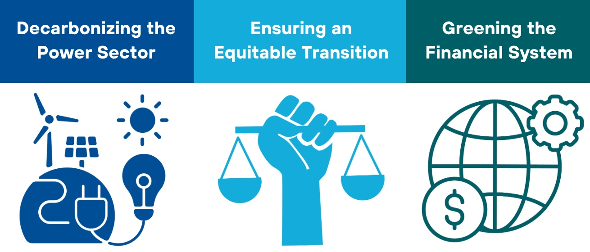
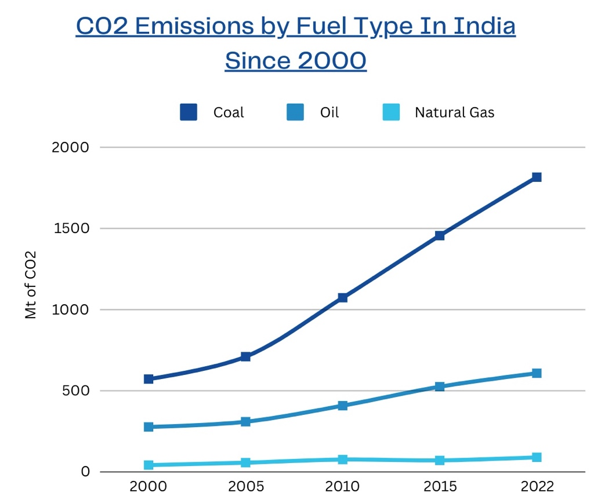

**Proposal Overview**

India’s ambitious climate policy targets aim for a scale-up of renewable energy, a significant reduction in carbon intensity by 2030, and net zero emissions by 2070 ([NDC, 2022](https://unfccc.int/sites/default/files/NDC/2022-08/India%20Updated%20First%20Nationally%20Determined%20Contrib.pdf)). Achieving these goals requires reforms in power markets, carbon pricing, and the financial sector to support a rapid exit from coal and boost the renewable energy transition.

This paper emphasizes the need for socio-economic justice in the transition, focusing on concessional financing for coal power site repurposing and worker retraining. This paper proposes a feebate system to incentivize power producers to decarbonize while keeping electricity prices stable. Additionally, we suggest greening India’s financial system by enhancing climate risk management and redirecting capital toward low-carbon solutions. India’s role as a global clean energy leader is crucial, and accelerating the green transition could deliver strategic economic benefits, including access to international markets and leadership in cleantech supply chains.

**Key Issues to be Addressed**

***COAL AND THE POWER SECTOR:*** The power sector plays an outsized role both in current emissions and in achieving future national prosperity by means of a highly electrified economy powered by cheap and abundant renewable energy. India's electricity demand is expected to triple by 2045 ([Barbar et al., 2021](https://www.nature.com/articles/s41597-021-00951-6)).

72% of total CO2 emissions from fuel combustion in India come from coal ([IEA, 2022](https://www.iea.org/countries/india/emissions)). India’s coal sector suffers from severe inefficiencies and underutilization, with just 1% of available capacity in active operation ([Global Energy Monitor, 2022](https://globalenergymonitor.org/wp-content/uploads/2022/10/India-Briefing-FORMATTED.pdf)). With 99 new coal mine projects under development as of 2022 (Ibid), it is essential for India to transition to clean, renewable energy to meet its current and future energy needs.\

Source: [IEA (2022)](https://www.iea.org/countries/india/emissions)

***INEQUALITY AND POVERTY:*** India grapples with extreme inequality and high poverty rates. [Oxfam](https://www.oxfam.org/en/india-extreme-inequality-numbers) (2022) reports that a minimum wage worker in rural India would need 941 years to earn the equivalent of what the highest-paid executive at a leading Indian garment company makes in just one year. In 2023, 9% of the employed population lived on less than \$2.15 per day in purchasing power parity ([ADB](https://www.adb.org/where-we-work/india/poverty), 2024).

The expansion of coal extraction has reinforced community reliance on predominantly informal, coal-based livelihoods ([Oskarsson et al.](https://www.sciencedirect.com/science/article/pii/S2214790X24000352), 2024). To facilitate a ‘just transition,’ India must focus on providing coal-sector workers and minimum wage earners with opportunities to participate in the emerging clean energy economy.

***FINANCING THE TRANSITION:*** India may need to invest approximately half a trillion dollars in its clean energy sector by 2030, translating to over \$65 billion annually. This amount exceeds the \$226 billion estimated under the Indian government's current plan, which envisions reaching an installed capacity of 450 GW of renewable energy and anticipates investments of \$20-30 billion per year, depending on the starting year. Moreover, a high cost of capital remains a significant barrier to the financial viability for RE projects.

In 2023, India's government debt reached 81.59% of its GDP [(RBI, 2024](https://www.rbi.org.in)). Balancing debt repayments with the need to finance this transition will be challenging and will require careful policy design.

**Key Stakeholders**

***Government/ Policymakers:***

Central & State Government: Responsible for national energy policy, regulations, and funding initiatives.

Ministry of Power: Oversees electricity generation and distribution.

Ministry of Coal: Manages the coal sector and its transition to renewable energy

***Financial Institutions:***

Public Sector Banks: Provide funding for energy projects and are involved in financing energy initiatives.

International Financial Institutions: Such as the World Bank and Asian Development Bank, which support financing and technical assistance for clean energy projects.

***Power Sector Companies:***

State-owned Enterprises: Such as Coal India Ltd. and NTPC Ltd. (National Thermal Power Corporation), which dominate the coal and power generation sectors.

Private Sector Energy Firms: Including major players in renewable energy like ReNew Power and Adani Green Energy, which are crucial for transitioning to clean energy sources.

***Local Communities and Workers:*** Coal Miners and coal-dependent communities are directly impacted by the transition and require support for reskilling and economic opportunities in the renewable sector.

***Consumers:*** Residential and commercial consumers’ demand for energy influences energy policy and market dynamics.

**Proposed Power Sector Reforms**

1.  ***A Carbon Feebate System***

A 'feebate' mechanism can incentivize power producers to decarbonize by setting a high carbon price on coal-fired power generation:

- Rather than passing the cost onto consumers, the collected fees would be rebated to power producers based on their total electricity generation.

- Companies that decarbonize faster would receive more in rebates than they paid in carbon fees, creating a powerful financial incentive to shift from coal to renewable energy.

This system could drive a rapid coal exit while maintaining stable power prices, especially with supportive financing and regulatory measures for renewable projects.

2.  ***Ensuring Financial Viability of Distribution Companies***

A critical reform would involve adjusting power prices to a level that ensures the financial stability of distribution companies (Discoms). By doing so, the risk to investors in new clean energy projects would be reduced, encouraging greater private investment in the emerging renewable energy sector.

3.  ***Transforming Power Purchase Agreements (PPAs)***

Reforming legacy coal power purchase agreements is crucial to enable a smoother transition to clean energy. Coal PPAs should be transformed into equivalent financial contracts that can be satisfied by renewable energy sources, such as solar-plus-storage. This will allow energy producers to transition away from coal while meeting their contractual obligations.

4.  ***Avoiding New Investment in Coal and Closing Inefficient Plants***

Retiring underused and inefficient coal power plants to cut costs and improve the financial viability of state-owned enterprises (SOEs), including distribution companies. Where a coal asset is stranded (e.g., when a possible new solar plant has a lower total cost than the variable cost of existing coal), money can be saved by replacing the coal unit with solar. The grid connection of underused and inefficient old coal power stations can be a valuable asset for new renewables, especially where there is sufficient land for new utility-scale solar plants with storage to be built.

An intermediate national coal consumption target at approximately the level of current domestic coal production would minimize pollution, unnecessary investment, macro-prudential risks, and probable stranded asset costs.

**Greening the Financial System**

1.  ***Create a roadmap for greening the financial system, within the Long-Term Low-Carbon Development Strategy. Address questions like:***

    a.  *How critical is the overall exposure of the Indian financial sector to climate-related risks? *

    b.  *How to build a regulatory framework that can prevent the banking sector from financial instability due to the spread of climate-related risks within the sector? *

    c.  *How to structure incentives to accelerate the redirection of financial flows towards the low-carbon transition?*

2.  ***Develop a climate-related regulatory framework for the banking sector:***

    a.  Generate appropriate and comparable data on financial institutions’ exposure to climate-related risks. Through disclosure requirements, the supervisor must be able to collect relevant data at the most granular level possible.

    b.  Implement global risk assessments and establish stress-test scenarios. This risk assessment analysis should be conducted using appropriate scenarios based on vulnerabilities identified within the national financial system.

    c.  Develop a tailor-made regulatory framework based on the key risks and vulnerabilities identified in the sector.

3.  ***Establish an attractive legal and financial framework to help stimulate the development of green capital markets, including setting up a comprehensive taxonomy.***

4.  ***Mobilize public financial institutions as pilot actors for the implementation of a strategy for greening the financial system***. This could involve:

    a.  Anchoring climate action in the mandate and core objectives of these institutions. 

    b.  The setting of ambitious and consensual climate objectives for each institution according to their sector of intervention, their means and the importance of the sector in which they operate for the transition. 

    c.  Adopting a dedicated climate-oriented regulatory framework for these institutions (disclosure requirements, quantitative reporting on climate risks and impacts, mainstreaming of climate considerations into all key internal processes, etc). 

5.  **Broaden the range of financial instruments available to sustainably finance the renewable energy sector by mitigating risks that could hinder project performance.**

    a.  Many of these risks can be managed through **government intervention**. For instance, state or regional governments could pre-assemble land and make it available for hybrid solar PV and wind power development projects.

    b.  Additionally, de-risking operating-phase financing could involve a third-party financing agency guaranteeing PPAs.
