**Abstract**

India’s ambitious climate policy targets aim to scale up renewable energy, reduce carbon intensity, and achieve net-zero emissions by 2070. Reaching these goals necessitates comprehensive reforms in power markets, carbon pricing, and financial systems to accelerate the transition away from coal and bolster renewable energy adoption. This paper emphasizes the importance of socio-economic justice, advocating for concessional financing to support coal power site repurposing and worker retraining. To incentivize decarbonization while maintaining stable electricity prices, we propose a feebate system targeting power producers based on their emissions intensity. Additionally, greening India’s financial sector by enhancing climate risk management and redirecting capital toward low-carbon investments is crucial. As a potential global leader in clean energy, accelerating India’s green transition could yield significant strategic economic benefits, including greater access to international markets and leadership in cleantech supply chains.

**Contents**

[**Executive Summary** [3](#executive-summary)](#executive-summary)

[**Introduction** [7](#introduction)](#introduction)

[**Meeting India’s Climate Policy Goals** [8](#meeting-indias-climate-policy-goals)](#meeting-indias-climate-policy-goals)

[**Macroeconomic Challenges and the Green Transition** [10](#macroeconomic-challenges-and-the-green-transition)](#macroeconomic-challenges-and-the-green-transition)

[**A Just and Politically Feasible Transition?** [14](#a-just-and-politically-feasible-transition)](#a-just-and-politically-feasible-transition)

[**India’s Power Sector: Scenarios and Technologies** [17](#indias-power-sector-scenarios-and-technologies)](#indias-power-sector-scenarios-and-technologies)

[**1.** **Scaling Up RE: Existing Context** [17](#scaling-up-re-existing-context)](#scaling-up-re-existing-context)

[**Scaling Up RE: A Cost-Effective Accelerated Net Zero 2050 Scenario** [22](#scaling-up-re-a-cost-effective-accelerated-net-zero-2050-scenario)](#scaling-up-re-a-cost-effective-accelerated-net-zero-2050-scenario)

[**2.** **Power System Economic Reliability & Scaling Up Storage** [25](#power-system-economic-reliability-scaling-up-storage)](#power-system-economic-reliability-scaling-up-storage)

[**India’s Power Sector: Markets and Policy** [29](#indias-power-sector-markets-and-policy)](#indias-power-sector-markets-and-policy)

[**1.** **Carbon Pricing and Carbon Markets** [29](#carbon-pricing-and-carbon-markets)](#carbon-pricing-and-carbon-markets)

[**Switching from Coal to RE with Storage: Market Reform in the Power Sector** [32](#switching-from-coal-to-re-with-storage-market-reform-in-the-power-sector)](#switching-from-coal-to-re-with-storage-market-reform-in-the-power-sector)

[**1. India’s Power Market Structure** [32](#indias-power-market-structure)](#indias-power-market-structure)

[**Phasing Down Coal: PPA Reform is Critical** [37](#phasing-down-coal-ppa-reform-is-critical)](#phasing-down-coal-ppa-reform-is-critical)

[**Application of World Bank/IMF’s CPAT (Climate Policy Assessment Tool) to explore ‘green growth’ policy scenarios as part of a Public Finance Review for India** [38](#application-of-world-bankimfs-cpat-climate-policy-assessment-tool-to-explore-green-growth-policy-scenarios-as-part-of-a-public-finance-review-for-india)](#application-of-world-bankimfs-cpat-climate-policy-assessment-tool-to-explore-green-growth-policy-scenarios-as-part-of-a-public-finance-review-for-india)

[**Phasing Down Coal, Scaling Up Renewables: Characteristics of a Technically and Financially Feasible Just Transition** [41](#phasing-down-coal-scaling-up-renewables-characteristics-of-a-technically-and-financially-feasible-just-transition)](#phasing-down-coal-scaling-up-renewables-characteristics-of-a-technically-and-financially-feasible-just-transition)

[**1. Defining a comprehensive roadmap for financial sector transition** [52](#defining-a-comprehensive-roadmap-for-financial-sector-transition)](#defining-a-comprehensive-roadmap-for-financial-sector-transition)

[**Carbon Markets in India** [70](#carbon-markets-in-india)](#carbon-markets-in-india)

[**Could India Accelerate GDP Growth by Accelerating the Transition to Net Zero?** [75](#could-india-accelerate-gdp-growth-by-accelerating-the-transition-to-net-zero)](#could-india-accelerate-gdp-growth-by-accelerating-the-transition-to-net-zero)

[**Conclusions** [85](#conclusions)](#conclusions)

[**Appendix 1: Scenarios and Results** [91](#appendix-1-scenarios-and-results)](#appendix-1-scenarios-and-results)

[**Priority 1: CPAT ‘micro’ – specific policy ideas and their impact** [91](#priority-1-cpat-micro-specific-policy-ideas-and-their-impact)](#priority-1-cpat-micro-specific-policy-ideas-and-their-impact)

[Appendix 2: Lok Sabha Recommendations [108](#appendix-2-lok-sabha-recommendations)](#appendix-2-lok-sabha-recommendations)

[Appendix 3: Relevant Indian Institutions [110](#appendix-3-relevant-indian-institutions)](#appendix-3-relevant-indian-institutions)

[Bibliography [116](#bibliography)](#bibliography)

# **Executive Summary**

India has ambitious climate policy goals for the scale-up of renewable energy, reduction in the carbon intensity of the economy, and net zero emissions by 2070. Achieving these targets requires policy and market reforms, including financial mechanisms designed in the spirit of ‘greening the financial system,’ to enable a rapid scale-up of renewable energy and a timely exit from coal. A stronger green signal could mobilize a political and economic window for India to emerge as a globally leading cleantech power by 2030.

The power sector plays an outsized role both in current emissions – coal power stations alone produce half of all energy related CO2 emissions – and in achieving future national prosperity by means of a highly electrified economy powered by cheap and abundant renewable energy. In this paper, we focus on reforms to power markets, carbon pricing, and the financial sector as vital components of green development.

The economics of decarbonization have transformed in recent years. Renewable energy – solar and wind power – is now routinely cheaper in levelized cost per MWh terms than electricity from new coal power stations. Recent analyses have shown that renewable power is now often also cheaper than the variable cost per MWh of electricity generated from legacy coal power stations. However, this price does not include the additional cost of energy storage capacity. Peak demand occurs in the evening, when sunshine is absent. Complementary quantities of energy storage capacity must therefore be built alongside solar and wind farms so that dispatchable power can be delivered to meet demand at any hour of the day. Solar-plus-storage appears to be economic from a macro perspective, but a carbon price or additional power sector reforms will be needed for solar-plus-storage to be favored under regulated market conditions.

The transition away from the fossil-fueled present into a clean energy dominated future must be socio-economically just if it is to be politico-economically feasible. This means giving workers in fossil energy sectors easily accessible options for taking on new roles in the cleantech economy without having to endure periods of unemployment or existential uncertainty during the transition.

In India, the ‘just transition’ must especially focus on providing coal-sector workers opportunities to participate in the new clean energy economy. A way of achieving this that minimizes disruption and uncertainty to these workers’ lives and to the economies of coal-dependent regions could be to set up a system of concessional financing for co-purposing and repurposing of existing coal power sites by adding hybrid renewable energy and energy storage capacity to those sites, enabling them to continue to generate dispatchable power to meet their power purchase agreements while burning less coal. A transition toolkit must be designed for such co- and repurposing projects, encompassing financial, regulatory, and worker retraining components. Some demonstration projects could be implemented to test, improve, and showcase the toolkit.

We outline several power sector policy reforms that are consistent with these aims:

- One reform would raise power prices by the amount needed to ensure the financial viability of Distribution companies (Discoms), thereby reducing risks to investors in new clean energy projects.

- Another reform would transform legacy coal power purchase agreements (PPAs) to equivalent financial contracts satisfiable by any power source, including solar-plus-storage.

- A third powerful reform would incentivize companies to transition their power generation asset portfolios from coal power to renewable power through a ‘feebate’ mechanism in which a high carbon price per ton is set, but instead of being passed through to electricity consumers, the carbon fees collected are rebated back to power producers annually in a zero-sum game that rewards the cleanest power producers at the expense of the dirtiest.

In a carbon feebate system, over the course of a year, all coal-fired power station operators would pay into a carbon fee pool in proportion to their carbon emissions; at the end of the year, all the money paid in would be paid back out to the same companies, albeit not in the same amounts as they paid in. Instead, the payouts would be shared out (rebated) to the pool's members in proportion to the total amount of electricity each generated during that year (counted as a percentage of the total electricity generated by all the companies in the pool taken together).

This feebate system generates an incentive for each company in the carbon fee pool to try to generate more power while burning less coal, i.e. to decarbonize its generation profile faster than other companies in the pool, to gain more money in rebates than it paid in as carbon fees. Such a feebate system could spark a rapid exit from coal and concomitant rapid ramp-up of clean power in a way consistent with a ‘just transition,’ without causing any increase in power prices – especially if low-cost project development financing terms, land leases, and supportive regulatory environments are made available to companies willing to build new wind and solar power capacity.

Beyond this, we suggest options for greening the Indian financial system, including the adoption of a comprehensive and more binding climate-protective regulatory framework for banking activities. We propose strengthening disclosure requirements and mainstreaming climate-related risks management systems as standard operating procedure for all financial actors, in line with the public consultation launched by the Reserve Bank of India in 2022. We assess how capital markets and public financial institutions can play a leading role in redirecting more financial flows towards the low-carbon transition. The paper ends by exploring potential impacts of several additional policies that could further accelerate the greening of the financial sector.

The Government of India’s global leadership mission in clean energy and climate policy was demonstrated when in founded ISA, the International Solar Alliance, in 2015-16. As the world’s largest country by population and a nation with an increasingly strong engineering capacity, India has a crucial role to play.

Complying with the UNFCCC’s Paris Agreement will require all countries, including India, to adopt more rapid transition plans to nearly-net-zero than the pace anticipated under India's 2070 target. Fortunately, recent techno-economic analyses suggest that with renewables becoming cheaper than fossil energy, a faster cleantech transition to nearly-net-zero by 2040 (perhaps even sooner) will likely result in cheaper energy and faster GDP growth than a slower transition by 2050 or 2070, in India and in most other countries. Nationally and globally, financial, macroeconomic, and environmental incentives are increasingly aligned in favor of a rapid transition to net zero.

For India, the environmental incentives for a full and rapid transition to clean energy are powerful. The country is highly exposed to climate impacts – deadly heatwaves, monsoon changes, and coastal city inundation from sea level rise. India is directly exposed to the consequences and benefits or costs of its own climate policies, both in terms of its domestic decarbonization actions and the effectiveness of its global leadership role in spurring a cleantech transition.

India also faces severe particulate air pollution, especially in the northern cities. Air quality in many of India’s major cities ranks as among the world’s worst. Rapid decarbonization would reduce the health damage caused by the burning of fossil fuels and consequent pollution.

In a relatively closed economy, a scale-up of green energy is closely linked to development of domestic cleantech supply chains. In addition to domestic considerations, it will be important for India to have access to the European market, especially for iron and steel, in the context of the new European CBAM tariff system (carbon border adjustment mechanism). An accelerated green transition offers a potential strategic economic benefit for India, as it could become a leader in rapidly developing export markets such as green transportation technologies, electric batteries, heat pumps, synthetic fuels and chemicals produced using renewable energy and green hydrogen, green metals (e.g. pig iron), and solar photovoltaics. There is a window of opportunity for India to achieve substantial global market share in several green supply chains by being among the first countries to invest in a rapid scaling-up of these sectors.

## **Introduction**

India has, in recent years, emerged as a Global South leader on climate policy. At COP-26 in Glasgow in late 2021, Prime Minister Modi's government set ambitious targets for reducing the carbon intensity of the Indian economy, including reaching net zero CO2 emissions by 2070 and ramping up renewable energy production. India has also indicated a willingness to lead on the international stage, for example at the G20. India has made substantial progress in ramping up renewable energy and has recently announced a carbon market. And in 2015-16, India led the creation of the [*International Solar Alliance*](https://isolaralliance.org) to foster the rapid global expansion of solar power.

This paper explores policies in the financial and power sectors that could support India's intended reduction in the carbon emissions intensity of its economy. This focus is driven by three significant challenges India must face: the coal-dependence of its power generation sector; the imperative to develop a macroeconomically beneficial and smooth transition to a prosperous clean energy powered future; and the need to ensure that the transition is socioeconomically just and politically feasible.

India is heavily dependent on fossil fuels, especially coal. Coal-fired power stations generate half of India’s energy-related CO2 emissions, and in addition play a very significant role in the air pollution that blights much of India.

The macroeconomic transition pathway should be consistent with macroeconomic stability; the green energy transition should be managed in an "orderly" manner. Specific risks in the financial sector include the possibility of stranded assets, due either to climate policy or economic factors.

The decarbonization pathway should also be just, avoiding increased social inequities, and it should be politically realistic: it must address the issue of rent-seeking and consider the political power of connected lobbies, including the coal industry.

The plan of this article is as follows. In the introductory sections, we contextualize India’s plan for the green transition by considering India’s climate policy goals, the macroeconomic situation, and the importance of a just and politically feasible transition. Next, we consider the power sector’s role in decarbonization, assessing the investment needs of a more ambitious least-cost approach to net-zero decarbonization by 2050. We then highlight the importance of more energy storage for ensuring reliable and economic grid use, and in connected to that we discuss power purchase agreement reform in the power sector. We also briefly report the results of using a recently developed World Bank and IMF – developed model, “Climate Policy Assessment Tool” (CPAT) to assess several policy scenarios, including application of a modest carbon tax (rising gradually from \$10 in 2024 to \$50 per ton by 2030), implementation of a feebate scheme to the power sector, and provision of concessional financing (-5% compared to the normal rate of interest, assumed to be 13% in India) for solar and wind power projects, in addition to phase-out of fossil fuel subsidies over the time-span 2024-30. This application of CPAT was carried out in the context of contributing to a World Bank Public Finance Review (PFR) for India.

Next, we focus on ways of greening India’s financial system. We consider green capital requirements and derisked green bonds. The final sections conclude the paper by giving a summary of policy recommendations and suggestions for future work.

## **Meeting India’s Climate Policy Goals**

India’s cumulative contribution to global carbon emissions since the beginning of the industrial revolution 250 years ago has been relatively small, at 4 percent of the worldwide total, [*compared to*](https://www.carbonbrief.org/analysis-which-countries-are-historically-responsible-for-climate-change) the USA's 20%, China's 11%, Russia's 7%, Brazil's 5%, Indonesia's 4%, Germany's 4%, and the UK's 3% shares (not including Britain's colonies) (Evans, 2021). In 2019, India ranked third after China and the USA in CO~2~ emissions. However, its scale of emissions, 2.9 billion tons of CO~2~ per annum, was far smaller than that of China at 10.6 billion tons of CO~2~ and of the United States at 5 billion tons of CO~2~ per annum.

These numbers suggest that pushing India to reduce carbon emissions – while Chinese and US carbon emissions continue apace – would fail a fairness test if doing so would damage India's efforts to improve the nation's total productivity and standard of living. However, as discussed further below, *there may be no such trade-off*. A shift away from fossil fuels (including a shift away from oil imports and a planned ramp-down of coal-fired power during the 2030s) may help, rather than harm, Indians' standard of living and improve India's core macroeconomic indicators.

At the UNFCCC COP-26 meeting in Glasgow in late 2021, Indian Prime Minister Narendra Modi declared a five-part commitment – which he termed *panchamrita* – for India's progress toward clean energy:

- India will achieve 500 Gigawatts (GW) of non-fossil energy capacity by 2030, of which 450 GW will be renewable energy (compared to [*165 GW of RE as of October 2022, of which 105 GW are wind and solar*](https://www.ibef.org/industry/renewable-energy));

- India will supply 50% of its electricity from renewable sources by 2030 (currently hydro supplies 10%; wind, solar, and other RE 12%)

- India will reduce its projected carbon emissions by one billion tons by 2030;[^1]

- India will reduce the carbon intensity of its economy by 45 percent by 2030;

- India will achieve net zero CO~2~ emissions by 2070.

Also notable is India’s “[*Life*](https://www.niti.gov.in/life)” (Lifestyle for Environment) program, which emphasizes environmentally friendly personal behaviors and promotes the concept of the “circular” economy.

The renewables targets and the vital role of power generation in India’s emissions profile (coal generation generates [*nearly* **half**](https://www.brookings.edu/research/the-case-for-us-cooperation-with-india-on-a-just-transition-away-from-coal/) of total Indian energy-related CO2 emissions) lead us to combine a focus on the financial system with a sectoral deep-dive into the power sector in this text.

**In this paper, we supplement the *panchamrita* scenario with a more ambitious medium-term strategy aimed at an economically favorable decarbonization of the Indian economy by 2050 or perhaps even 2045 or 2040.**

Lower carbon emissions will lower climate risk: India is currently the third largest annual emitter of CO~2~ emissions from fossil fuels, and given rapid increases in total energy demand, alongside Europe's push to decarbonize its economy, India will likely be the second largest emitter by 2040, barring a significant shift towards cleaner energy systems before then.

There is also a connection to debates on changing the rules according to which MDBs provide financing to reward countries that make contributions to global public goods. India is systemically critical in this respect.

## **Macroeconomic Challenges and the Green Transition**

There is currently a multi-aspect crisis in the world economy, including public debt hangovers from the Covid turmoil and considerable supply shocks to food and energy caused by the Ukraine war. In India, public debt stands at around [*200 trillion Rupees*](https://www.statista.com/statistics/1013562/india-government-net-debt/#:~:text=The%20government's%20net%20debt%20was,rupees%20in%20fiscal%20year%202020.) (Statista, 2022) in 2022 (or about 2.8 trillion USD, approximately [*90%*](https://tradingeconomics.com/india/government-debt-to-gdp) of India’s GDP (Trading Economics, 2021)). India’s external debt is roughly *[\$620 bill](https://www.orfonline.org/expert-speak/indias-current-external-debt-is-under-control/#:~:text=India's%20external%20debt%20to%20GDP,in%20the%20economy%20also%20increases)ion (Abhijit Mukhopadhyay, 2022)*. India is affected by the global supply shock caused by the Ukraine war. India’s inflation rate reached [*7.4%*](https://tradingeconomics.com/india/inflation-cpi) (Trading Economics, 2022) in September 2022, which is relatively moderate in international comparison. India’s ten-year sovereign bonds yield around 7.5%.

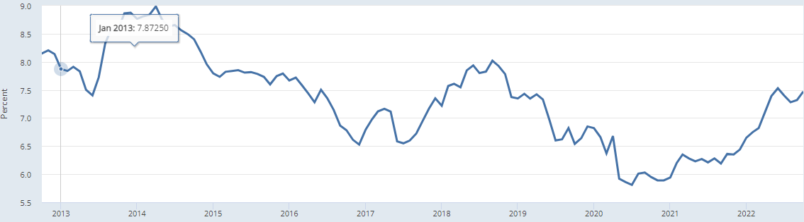

*Figure 1: 10-year Indian sovereign bond yield. Source FRED from OECD.*

Similarly, the IEA estimates the economy-wide cost of capital at around 8% in 2020.

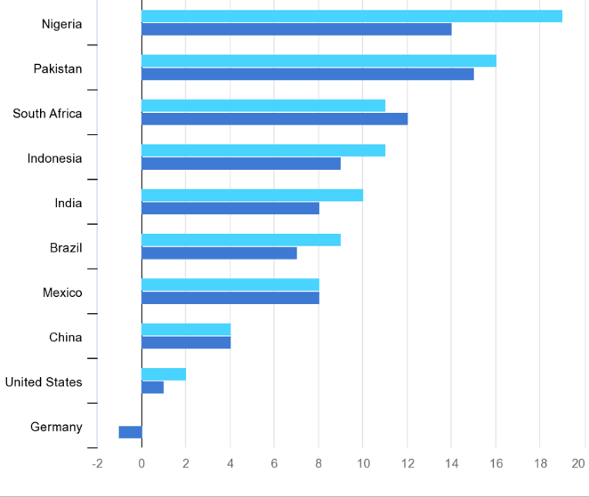

This macroeconomic context significantly constrains the policy response to climate change in terms of policies that would increase the public debt, and makes policies that increase fossil fuel prices more difficult than usual.

India will also [*likely be affected by the CBAM*](https://www2.deloitte.com/nl/nl/pages/tax/articles/eu-carbon-border-adjustment-mechanism-cbam.html) (Carbon Border Adjustment Mechanism) to be implemented by the European Union (EU) (Deloitte, 2022). CBAM “aims to prevent ‘carbon leakage’ by subjecting the import of certain groups of products from 3rd party \[non-EU\] countries to a carbon levy linked to the carbon price payable under the EU Emissions Trading System (ETS) when the same goods are produced within the EU.” The implementation of CBAM begins with a transitional period starting in January 2023.

India appears significantly exposed to CBAM. Indian exports to the EU of base metals (including aluminum, iron, and steel, all covered by CBAM) approximated 10% of total Indian exports in 2020.^2^ There is a risk that CBAM could impact these important Indian sectors. According to the CBAM impact assessment conducted by the European Commission, India was the eighth-largest exporter of iron and steel and the twelfth-largest exporter of aluminum to the EU in 2019.

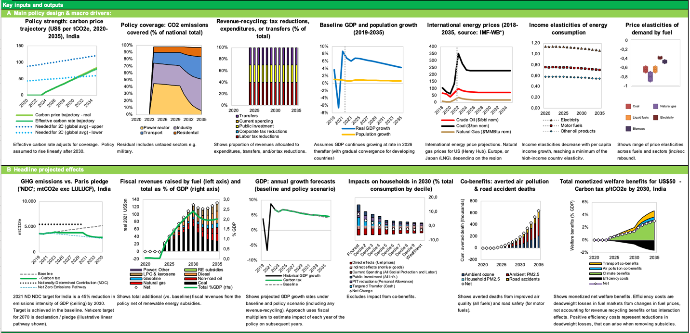

*Figure 3: Countries most affected by CBAM. Source: resource trade.earth, Chatham House, [*Energy Monitor*](https://www.energymonitor.ai/policy/carbon-markets/india-gets-ready-to-launch-a-national-carbon-market)*

A detailed analysis (Magacho et al., 2022) indicates that India is moderately impacted, with Iron and Steel the most significant sector by far. India is the fifth largest country in terms of absolute potential CBAM revenues and 25^th^ relative to the size of its exports, with the vast majority coming from the Iron and Steel sector. It seems then that India will be affected by CBAM and must prepare for it. India may be well advised to prepare by reaping the benefits of its internal carbon market in the Iron and Steel sector.

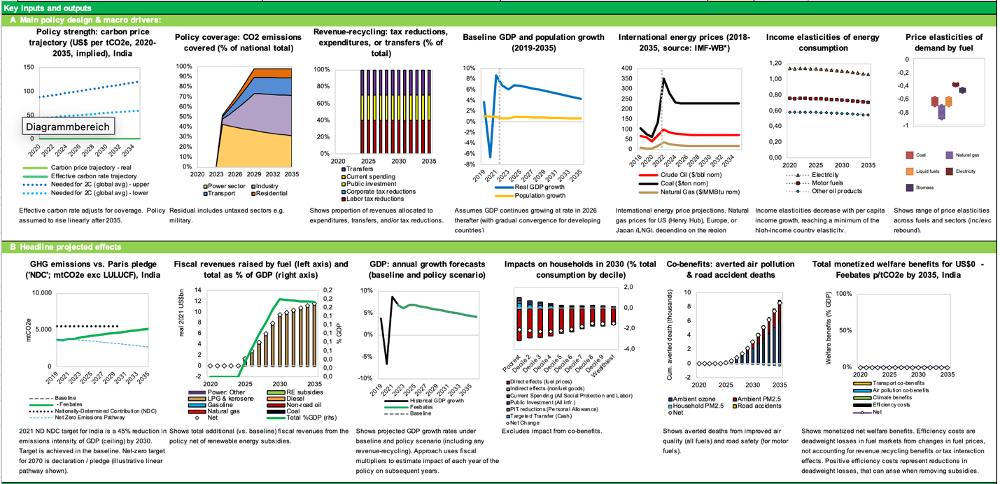

*Figure 4: EU CBAM revenues from \$60/tCO2 carbon price in USD million and as a proportion of total exports from the country concerned. Source: Magacho et al. (2022).*

**Green Supply Chain Risks**

A recent [*IEA*](https://www.iea.org/reports/the-role-of-critical-minerals-in-clean-energy-transitions/executive-summary) report assessed the threat of critical mineral shortages in relation to the green transition. Global lithium demand is expected to be 40 times 2020 levels by 2040, and graphite, cobalt and nickel around 20-25 times.

A [*CSEP report*](https://csep.org/wp-content/uploads/2021/12/Critical-Minerals-for-Green-Technologies-1.pdf) analyzed the critical minerals risk in India by economic importance and supply availability. The Summary of Key Findings on page 25 of that report states that:

> *“There will be an increase in the demand for several critical minerals as India transitions towards renewable power generation and electric vehicles. The move to renewable energy would require increasing quantities of various minerals, including copper, manganese, zinc, and indium. Likewise, the move to electric vehicles would require increasing quantities of various minerals, including copper, lithium, cobalt, and rare earth elements. However, India does not have reserves of nickel, cobalt, molybdenum, rare earths, neodymium and indium, and the needs for copper and silver are higher than India’s current reserves. The critical minerals assessment results suggest that niobium, lithium, and strontium have relatively high economic importance, adjusted by their substitutability possibilities and GVA multipliers. Additionally, most minerals have some degree of substitutability, except for niobium and silver, for which no good substitutes have been found. The supply risk is relatively high for yttrium and scandium (heavy rare earths), followed by niobium and silicon. However, India does not have the recycling capacity for most minerals except aluminum, copper and steel.”*

### **Macroeconomic Benefits**

Set against these macroeconomic challenges are the following benefits of the green transition.

1.  **Improved Balance of Trade and Geo-Economic Security**

Shifting away from fossil fuels will enhance India's national energy security as all sectors (including transport) electrify, given that India is a large net importer of oil, gas, and coal. Replacing these imports with domestically produced clean energy supplies will [*improve India's balance-of-trade*](https://www.ceew.in/press-releases/india-could-save-over-inr-1-lakh-crore-annually-crude-oil-imports-increased-ev) (CEEW, 2020) and reduce India's vulnerability to oil and gas price shocks.  

2.  **Improved Position of Some State-Owned Enterprises in the Energy Sector**

An appropriately managed transition to a clean-energy future could place state-owned enterprises, some of which are currently in chronic financial difficulty, in a better long-term financial position, by [*reducing costs*](https://www.sciencedirect.com/science/article/abs/pii/S030626192200112X). Benefits are likely to include closure of unprofitable coal power stations and coal mines and [*refinancing of sunk costs*](https://www.sciencedirect.com/science/article/abs/pii/S0301421520300641) embodied in the ‘fixed’ part of legacy coal tariff agreements. Rationalizing India’s future coal plans could discourage wasteful new investment in coal mines.

There are also [*costs and risks to companies in the coal power supply chain*](https://iopscience.iop.org/article/10.1088/1748-9326/aca036/meta), including risks to Indian Railways given its dependence on coal transit revenues, and costs in the form of investments needed for a [*‘just transition’ to prevent deprivation in coal-dependent areas*](https://iopscience.iop.org/article/10.1088/1748-9326/ac5194/meta).

3.  **Reduction of Stranded Asset Risks**

Fossil-fueled assets such as coal-powered power stations face significant 'stranded asset’ risks from two separate routes:

a)  First, [*solar power is estimated to be already cheaper than the variable cost of many coal-fired power stations*](https://www.sciencedirect.com/science/article/abs/pii/S0301421520300641) in the system . The cost of solar power is likely to decline further over the medium term, in all regions, including [*India*](https://www.nature.com/articles/s41467-022-33048-8) and [*China*](https://www.pnas.org/doi/10.1073/pnas.2103471118).

b)  Second, climate change policy might make coal power stations uneconomic even earlier. These concerns lead to issues of systemic financial risks in the Indian financial system as well as problems for state-owned enterprises.

It may be that the ‘economic’ replacement of coal with renewables (complemented by appropriate amounts of energy storage capacity to enable dispatchable power) is likely to be the primary driver of stranded asset risk to the coal sector, which may be more favorable from a financial sustainability perspective. We will discuss possible policy approaches later in this paper, including the possibility of co-purposing and [*repurposing coal-fired power stations*](https://www.sciencedirect.com/science/article/abs/pii/S0301421522001367), shifting existing sites toward renewables whilst [*retaining coal power capacity for load-balancing*](https://www.sciencedirect.com/science/article/abs/pii/S0301421520307722).

## **A Just and Politically Feasible Transition?**

We can picture the flow of energy through the global energy metaphorically, in our mind’s eye, as a physical flow of water rushing through a pipe of flexible dimensions. Huge volumes of coal, of natural gas, of electrons, and of dollars and yen, euro and lira and peso, every single day. We can represent each different kind of flow as a liquid of a particular colour: red represents stocks and flows of debt, black represents stocks and flows of credit deposits, orange represents stocks and flows of tons of finished steel, tan represents stocks and flows of wheat, and so on. Stocks of a measurable quantity in the model can be represented by large accumulations of standing water in differently sized swimming pools; flows, by the dimensions of flows of water, as though through a transparent pipe, the diameter of which varies over time. A systems model of the material, energy, and financial economies can be visualized in this way.

There are many millions of people involved at every level and step of this

Ethically, economically, and pragmatically, it is necessary to provide on-ramps onto the green energy superhighway to nudge stakeholders to take off-ramps from the fossil fuel superhighway and that people involved in the fossil energy production supply chain and its derivative sectors

A core requirement for any country to move forward successfully from a fossil- to clean energy-based economy is to overcome resistance from stakeholders in the existing system – by ensuring they have an attractive, easy, and seamless path into a new role in the cleantech economy.

### **Benefits from the Perspective of Just Transition**

Multiple benefits could arise from an accelerated shift from fossil to clean energy in energy-supply and key energy-using sectors, including:

1.  **Consumer Justice: Affordable Energy Abundance**

As *[this joint Wärtsilä/LUT report](https://www.wartsila.com/docs/default-source/power-plants-documents/downloads/white-papers/asia-australia-middle-east/a-100-renewable-power-system-across-india-by-2050-whitepaper.pdf), 2021 (Wartsila, 2021)* (among many others) shows: India's future will feature abundant, affordable clean energy, given India's vast solar energy potential and declining solar PV equipment costs and good wind resources in some parts of the country.

2.  **The Social Aspect: Cleaner Air, Better Public Health**

As an *[IEA report](https://iea.blob.core.windows.net/assets/e4945633-ab7c-45cc-8e3a-aa74dd3de962/AirQualityandClimatePolicyIntegrationinIndia-Frameworkstodeliverco-benefits.pdf) (IEA, 2021)* shows, the benefits of ramping down coal-fired power will include cleaner air, lower particulate pollution, and better population health as coal- and gas-fired power plants are ramped down and renewable power is ramped up, and combustion engine-powered vehicles are replaced with electric vehicles. Currently, 32 of the world's 40 most polluted large cities are in India, [*according to IQAir*](https://www.iqair.com/in-en/world-most-polluted-cities) (IQ Air, 2021).

3.  **Regional Aspects: Domestic Cleantech Industrial Development**

The development of a sizeable domestic cleantech manufacturing and deployment sector will benefit India economically, as emphasized in a [*NITI Aayog/RMI India report*](https://www.niti.gov.in/sites/default/files/2020-06/India_Green_Stimulus_Report_NITI_VF_June_29.pdf). Indian industry can be promoted through learning-by-doing – i.e., domestically generated demand can sometimes allow ‘catch up’ or even ‘leap ahead’ in technological development.

Moreover, a growing export market potential for fossil-free commodities (e.g., green steel, green ammonia) and equipment (e.g., electric vehicles) will arise as demand for cleantech solutions and fossil-free commodities rises in advanced and emerging economies. Such green development benefits could be crucial to the ‘green transition’.

# **India’s Power Sector: Scenarios and Technologies**

## **Scaling Up RE: Existing Context**

India’s electricity sector is the most important sector in terms of national carbon emissions and is widely recognized to be the key to decarbonization of other sectors through electrification.

70% of India's electricity generation and 44% of total primary energy supply currently come from burning coal in coal-fired power stations, according to the [*IEA Energy Outlook for India*](https://www.iea.org/reports/india-energy-outlook-2021) (IEA, 2021). Coal power stations' emissions constitute about half of total energy-related CO2 emissions.

Under current plans, India will massively ramp up non-fossil power generation capacity by 2030 but will not ramp down coal-fired power. If global climate goals are to be met, this must change, in India as in other countries - in China, USA, Europe and elsewhere - that are currently still burning large amounts of coal. There is already too much carbon in the atmosphere, with multiple climate system non-linearities (i.e. self-reinforcing phase shifts in several climate system elements, e.g. ice mass loss from Greenland and West Antarctica, methane and CO2 release from thawing permafrost, North Atlantic thermohaline circulation disruption, mass die-off of tropical coral reefs, Amazon rainforest cover loss, etc.) already at risk of getting triggered at global annual average surface air temperatures of 1.0-1.5C above the pre-industrial era average, as a [*new analysis published in* **Science**](https://www.science.org/doi/10.1126/science.abn7950) in September 2022 has shown (we are currently at ca. 1.2C). This means that ramping up clean energy won’t be enough; coal, gas, and oil combustion must concurrently be ramped down.

The global shift to a low-carbon-emissions economy will entail the electrification of nearly all sectors of the economy: transport, heating/cooling, industrial production, commodities and chemicals production (green steel, green aluminum, green ammonia, etc.), and agricultural machinery. The power sector is thus crucial because it provides the energy source for other sectors in a decarbonized future. Electricity will provide nearly the entirety of the future energy supply in a decarbonized economy.

To meet India’s climate goals, the dominance of coal in India’s power generation profile must be left behind. India will have to embark on a dramatic scale-up of renewable energy power generation instead – especially because India’s electricity consumption is set to multiply with a growing population and GDP in coming years and decades.

### **India's Growing Electricity Demand**

India's electricity demand is [*expected to triple*](https://www.nature.com/articles/s41597-021-00951-6) (Barbar et al., 2021) from ca. 1500 TWh in 2022 to nearly 4500 TWh by 2045, as high GDP growth continues and electric vehicles, air conditioning, and other electric appliances become much more common (Barbar et al. 2021). To avoid an explosion in India's carbon emissions, as well as reduce ongoing harm from particulate air pollution, it is crucial that the growth in India's energy consumption be "green" rather than "brown," in terms of both energy supply and energy demand technologies. The sooner coal is ramped down, the lower India’s cumulative carbon emissions will be.

### **India's Climate Policy Commitments and Electricity Supply Realities**

The Indian government recognizes the importance of shifting to clean energy to reduce India's future climate impact as the country develops. To reiterate its power sector-related policies:

- India will achieve 500 GW of non-fossil energy capacity by 2030, of which 450 GW will be renewable energy

- India will supply 50 per cent of its electricity from renewable energy by 2030

India’s current power system and future plans are laid out in the [*Draft Electricity Plan.*](https://cea.nic.in/wp-content/uploads/irp/2022/09/DRAFT_NATIONAL_ELECTRICITY_PLAN_9_SEP_2022_2-1.pdf) As of February 2022, India had *[236 GW of fossil-fueled](https://powermin.gov.in/en/content/power-sector-glance-all-india)* (Government of India Ministry of Power, 2022) generation capacity installed, including 204 GW hard coal, 6.6 GW lignite, 25 GW gas, and 0.5 GW diesel ​(Government of India 2022)​.  [*India had 151.4 GW*](https://www.investindia.gov.in/sector/renewable-energy) (Manohar, 2022), of renewable energy power generation capacity installed as of December 2021, of which 47 GW was large hydro, 5 GW small hydro, 11 GW from biomass, 40 GW wind, and 49 GW solar power.

Phasing up renewables and phasing down coal are of course also vital to India’s overall emissions targets. Although India has committed to strongly expanding renewable energy during the 2020s, it also plans to continue to expand coal-fired power generation. In other words, India's current plan is to ramp up green energy, but not to ramp down fossil energy (not in the coming decade, at any rate).  

India’s coal fleet is the third largest globally and is the backbone of its electricity supply. The coal fleet supplied about 70% of India's total electricity in 2021, down from 78% in 2018–2019. As of 2021, India’s total coal power generation capacity in operation was 208 GW, accounting for nearly 9.5% of global coal power generating capacity and 55% of India's total installed power generating capacity.   

### **Investment Requirements to 2030: The Scale of the Challenge**

According to *[Climate Action Tracker](https://climateactiontracker.org/countries/india/) 2021 (Climate Action Tracker, 2021)*: "Based on current coal expansion plans, India’s coal capacity would increase from current levels of over 200 GW to almost 266 GW by 2029-2030, with 35 GW expected to come online in the next five years: an increase of 17.5% in coal capacity. India’s coal-fired power plant pipeline is the second largest in the world and is one of the few to have increased since 2015. A recent move to increase domestic coal production has opened coal mining to private investors, risking a fossil fuel lock-in as well as harm to areas of ecological significance. To get on a 1.5°C emissions pathway, it is important for India to phase out old, high-capacity power plants of lower efficiency and higher emissions and stop any new coal capacity additions."

The installed capacity of renewable power and planned electricity generation capacity by 2030 is expressed in the following table.

  -------------------------------------------------------------------------------------------------------------------------------------------------------------
  Energy Type            Target (GW) to be achieved by December 2022   Achievement (GW) as of November 30, 2021   Expected Installed Capacity (GW) in 2029-30
  ---------------------- --------------------------------------------- ------------------------------------------ ---------------------------------------------
  Solar                  100                                           48.6                                       280

  Wind                   60                                            40.0                                       140

  Biomass                10                                            10.6                                       10

  Small Hydro            5                                             4.8                                        5

  *Subtotal*             ***175***                                     ***104***                                  ***435***

  Hydro                                                                                                           71

  Coal                                                                                                            267

  Gas                                                                                                             25

  Nuclear                                                                                                         19

  *Total*                                                                                                         ***817***

  Battery Storage (4h)                                                                                            27 GW/108 GWh
  -------------------------------------------------------------------------------------------------------------------------------------------------------------

*Table 1: Installed RE in India and Planned electricity generation capacity by 2030 in India. Source: MNRE 21st Report to Lok Sabha Standing Committee on Energy, Jan. 2022*

By November 2021, India’s government had a target of 450 GW installed renewable electricity capacity by 2030 (of which 280 GW solar and 140 GW wind), plus 50 GW peak other clean energy sources, totaling 500 GW as announced by PM Modi at COP26.

As of December 2022, India already had about [*173 GW*](https://www.livemint.com/news/india/renewable-energy-sector-to-attract-25-billion-in-investments-in-2023-11671705814989.html) of clean energy capacity based on non-fossil fuels, including 62 GW of solar, 42 GW of wind, 10 GW of biomass, 5 GW of small hydro, 47 GW of large hydro, and 7 GW of nuclear power.

According to India's Ministry of New and Renewable Energy (MNRE) in the [*21^st^* *Report to the Standing Committee on Energy*](https://www.eparlib.nic.in/handle/123456789/835464?view_type=browse) *(Lok Sabha Secretariat, 2022)*, on being asked for estimates of funds required to have 450 GW installed RE capacity by 2030, the Ministry reported: "Based on certain assumptions, a total additional investment of Rs 1,700,000 crore \[USD \$224.4 billion\] is envisaged, which would include associated transmission cost. Considering cost trends, the cost/MW may range from Rs 3.5-4 crore \[\$0.432 to \$0.493 million\], while the rest would be for associated transmission & battery/storage facilities required."

IREDA, the [*Indian Renewable Energy Development Agency Ltd*](https://www.ireda.in/home) , (IREDA, 2022) (a state-owned enterprise), gave the Standing Committee the following estimate of how investment would likely break down. According to agency estimates, including those of CEA ([*Central Electricity Authority*](https://cea.nic.in/?lang=en) (Central Electricity Authority, 2022), a unit of the India Ministry of Power), the likely capacity *addition* by 2030 of renewable energy and energy storage are as follows (keeping in mind that ca. 167 GW RE have already been installed as of December 2022):

+----------------------+------------------------+------------------------+---------------------+-----------------------------+---------------------------------+
| Technology           | Capacity Addition (GW) | Cost per MW (Rs Crore) | Cost per GW (USD m) | Total investment (Rs Crore) | Total investment (USD billions) |
+======================+=======================:+=======================:+====================:+============================:+================================:+
| Solar                | 240                    | 3.25                   | 429                 | 780,000                     | 103                             |
+----------------------+------------------------+------------------------+---------------------+-----------------------------+---------------------------------+
| Wind                 | 100                    | 5.5                    | 726                 | 550,000                     | 73                              |
+----------------------+------------------------+------------------------+---------------------+-----------------------------+---------------------------------+
| Transmission         | 340                    | 0.6                    | 79                  | 204,000                     | 27                              |
+----------------------+------------------------+------------------------+---------------------+-----------------------------+---------------------------------+
| Pumped hydro         | 10                     | 5                      | 660                 | 50,000                      | 7                               |
+----------------------+------------------------+------------------------+---------------------+-----------------------------+---------------------------------+
| Battery (w/o BOS^3^) | 108 (GWh)              | 11,250 (Rs / kWh)      | \$148.5 per kWh     | 121,500                     | 16                              |
+----------------------+------------------------+------------------------+---------------------+-----------------------------+---------------------------------+
| Total                                                                                        | 1,705,500                   | 225                             |
+----------------------------------------------------------------------------------------------+-----------------------------+---------------------------------+

*Table 2: Financial requirements of needed investment. Source: MNRE 21st Report to Lok Sabha Standing Committee on Energy, Jan. 2022*

In this section we consider only the investment needed for power generation. To consider only the LUT’s least-cost scenarios, we are now in the ballpark of half a trillion dollars (\$477 bn) in RE investment (solar \$349bn, wind \$80bn, storage \$49bn) between now and 2030 according to the LUT integrated scenario’s RE build-out capacity estimate – and that scenario does not include additional RE energy supply and demand for purposes like "greening" steel- and aluminum-making, ammonia production, or agriculture.

In short, India may require half a trillion dollars for investment in its clean energy sector by the year 2030 (\>\$65 bn per year), perhaps more, rather than the \$226 bn (\$20-30bn per year, depending on start year assumptions) estimated under the Indian government's current plan to reach installed capacity of 450 GW renewable energy (and 50 GW additional non-fossil electricity, including 19 GW nuclear power).

### **Opportunities Arising from Decarbonization and Carbon Pricing in the Indian Power Sector**

Compared to other economic sectors, the power sector has the greatest opportunity for emissions reduction at a low cost, both in India and globally (IPCC, 2022). There are economic opportunities for accelerating the green energy transition, including by introducing some form of carbon pricing.

- Recent solar power tariffs arrived at in PPA auctions have in some cases been less than the variable cost of much of India’s coal generation fleet.^5^ Replacing coal with solar could save money.

- Coal has local externalities, including particulate air pollution, that impose health costs on the Indian population. These externalities are not currently properly priced.

- India has recently made strong moves to build local photovoltaic and battery equipment manufacturing industries. Substitution of coal with solar power will help scale up these industries.

- Recently, coal shortages have been preventing some coal plants from generating power at full capacity.

- India imports substantial quantities of coal. Reducing coal consumption could reduce outflows of hard currency.

## **Scaling Up RE: A Cost-Effective Accelerated Net Zero 2050 Scenario**

### **The Need for Clean Energy**

In this section, we consider an accelerated scenario for India’s decarbonization. This scenario is based on a *[least-cost energy supply pathway scenario to 2050](https://www.sciencedirect.com/science/article/pii/S2352152X17304334#bib0115) (Gulagi et al., 2018)*. By 2050, much larger amounts of renewable energy will have been installed in India (compared to 2030): "The combination of solar photovoltaics (PV) and battery storage evolves as the low-cost backbone of Indian energy supply, resulting in 3.2–4.3 TW of installed PV capacities, depending on the applied scenario in 2050." The study's "integrated scenario" includes an energy system that supplies electricity for power-to-gas applications for both energy storage and non-energy industrial gas supply (power-to-X) as well as seawater desalination. The study assumes 1417 TWh Indian electricity demand in 2020, rising to 2286 TWh in 2030 and 5952 TWh in 2050.

As noted in a previous section, India requires an accelerated decarbonization pathway (compared to that currently planned by the Indian government) for three main reasons:

- First, from a climate stability point-of-view, it isn’t enough to add renewable energy to the existing power supply – it is also necessary to shut down coal-fired power plants already in operation, in India and worldwide, because the world is already well past any “safe enough” level of atmospheric carbon, as revealed in a [*major review article*](https://www.science.org/doi/10.1126/science.abn7950) published in September 2022 of global climate system “tipping points” entitled “Exceeding 1.5°C global warming could trigger multiple climate tipping points” (Armstrong McKay et al. 2022). The article notes that several major climate system elements could already “tip” between 1.0 and 1.5°C (the world is already at ca. 1.2°C and likely to exceed 1.5°C well before 2050). Given that India has the third largest coal-power fleet in the world, even though it has much lower cumulative historical emissions than China, USA, or Europe, it will be necessary to ramp down coal in India as well as in those regions.

- Second, an accelerated decarbonization pathway that ramps up clean electricity while ramping down coal will help India reduce particulate air pollution, to which coal-burning is a significant contributor.

- Third, an accelerated clean energy pathway will speed the growth of India’s economy and industries of the future: e-vehicles, green hydrogen, low-carbon steel and other materials, helping India achieve access to key export markets like Europe. India will need an accelerated decarbonization to improve the competitiveness of its products in Europe given the [*European Union’s new carbon border tariff*](https://www.weforum.org/agenda/2022/12/cbam-the-new-eu-decarbonization-incentive-and-what-you-need-to-know/), the Carbon Border Adjustment Mechanism, [*CBAM*](https://www.consilium.europa.eu/en/press/press-releases/2022/12/13/eu-climate-action-provisional-agreement-reached-on-carbon-border-adjustment-mechanism-cbam/).

For the year 2030, LUT's "integrated scenario" calculates 863 GW solar PV, 150 GW wind, 38 GW hydropower, 36 GW biogas power plants, 131 GW gas turbines, and 141 GW coal power. Compare this to the Lok Sabha report's projected capacity in 2030 of 280 GW solar, 140 GW wind.

+----------------------+-------------------+---------------------------------------+
| Energy Type          | Capacity GW 2030\ | Capacity GW\                          |
|                      | MNRE Report (a)   | LUT scenario 2030 (l) and 2050 (r)    |
+======================+===================+===================+===================+
| Solar                | 280               | 863               | 4307              |
+----------------------+-------------------+-------------------+-------------------+
| Wind                 | 140               | 150               | 185               |
+----------------------+-------------------+-------------------+-------------------+
| Biomass              | 10                | 56                | 59                |
+----------------------+-------------------+-------------------+-------------------+
| Small Hydro          | 5                 |                   |                   |
+----------------------+-------------------+-------------------+-------------------+
| Hydro                | 71                | 38                | 39                |
+----------------------+-------------------+-------------------+-------------------+
| Coal                 | 267               | 141               | 95                |
+----------------------+-------------------+-------------------+-------------------+
| Gas                  | 25                | 131               | 125               |
+----------------------+-------------------+-------------------+-------------------+
| Nuclear              | 19                | 6                 | 4                 |
+----------------------+-------------------+-------------------+-------------------+
| Total                | 817               | 1385              | 4814              |
+----------------------+-------------------+-------------------+-------------------+
| Battery Storage (4h) | 27 GW/108 GWh     | 955 GWh           | 8193 GWh          |
+----------------------+-------------------+-------------------+-------------------+

*Table 3: Alternative scenarios for VRE investments. Source: (a) MNRE 21st Report to Lok Sabha Standing Committee on Energy, Jan. 2022 (b) [*Gulagi et al.*](https://www.sciencedirect.com/science/article/pii/S2352152X17304334#tbl0005) 2018*

Comparing the Ministry of New and Renewable Energy's numbers for 2030 as reported to the Lok Sabha to the LUT study’s "integrated scenario" numbers, we see big differences. The most marked differences are that:

- Total power generation capacity in 2030 in the LUT scenario is 1.7x that of the MNRE scenario.

- Solar power generation capacity in 2030 in the LUT scenario is 3.1x that of the MNRE scenario.

- The LUT scenario proposes a much larger, faster build-out of solar PV capacity and (relatedly) battery energy storage capacity by 2030, alongside a much larger expansion of gas power capacity (for load-balancing).

- In contrast, coal and hydro power both play smaller roles in the LUT scenario compared to the MRNE scenario in 2030.

- The LUT scenario is limited to the electricity sector, and does not yet include major increases in electricity demand that could result in shifting away from fossil fuels toward clean energy produced hydrogen for Power-to-X, e.g. green steel-making or green (non-fossil-based) production of ammonia. If these sectors are also included, a techno-economic projection of clean energy demand and supply to 2030 and 2040 will be even greater than ca. 863 GW solar PV and 150 GW wind power by 2030 as in the LUT scenario above. Whatever the specific numbers, the key message is that *much larger targets* than the Indian government's 450 GW target would be appropriate in the context of the rising ambition of India's *Energiewende* – especially if coal-fired power is to be capped, or even ramped down over the remainder of this decade, as envisaged in the LUT Integrated Scenario, rather than ramped up by a further ca. 60 GW from ca. 210 GW in 2022 to 267 GW in 2030 as per the Indian government's current plan.

If we use the numbers for the LUT integrated scenario of 863 GW solar and 150 GW wind by 2030, and the Indian MNRE estimates of \$429k per MW solar and \$726k per MW wind, not including costs of additional energy storage or transmission, this suggests additional investment between 2022 and 2030 on the order of:

- \$349 billion for solar power, plus

- \$80 billion for wind power (this is net of the existing 49 GW solar and 40 GW wind that has already been installed in India by early 2022).

- The energy storage requirement would roughly triple in this scenario compared to the MNRE projection, so rather than \$16 bn some \$48 bn would have to be invested.

## **Power System Economic Reliability & Scaling Up Storage**

Two apparently contradictory things appear true: coal power stations’ capacity load factor is relatively low (ca. 55% in 2021) and is falling over time, yet there are power shortages.

To understand India’s coal power situation, in which coal plants remain operational despite decreasing capacity load factors, we must look at the daily load profile (Parray & Tongia, 2019). Peak demand is in the evening, yet solar power production occurs during the day. Until enough energy storage assets are added to the system, further investment in solar will not reduce the need for firm dispatchable power from fossil-fueled power stations. Coal power assets are still needed to meet the evening demand peak. But new solar does lessen the overall demand for coal, as shown by the following two figures, which demonstrate the daily load profile gross and net of renewables, and the consequent Electricity Exchange (EEX) power price peak in the evening.

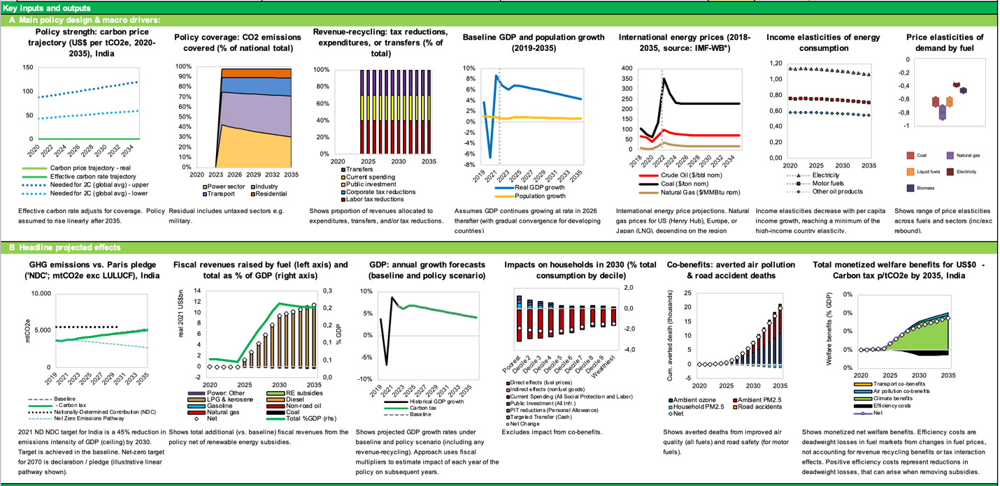

*Figure 5: All-India power demand gross and net of RE for a typical day. Soonee et al. (2019)*

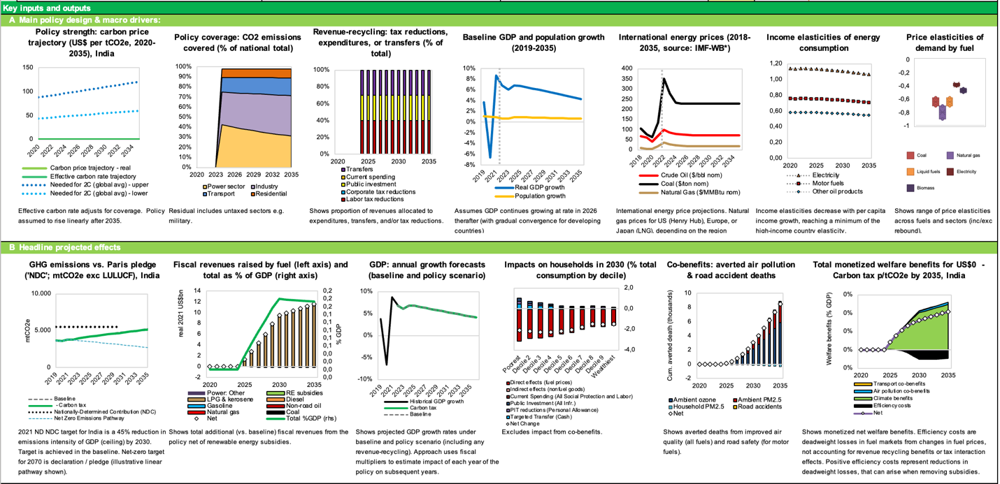

*Figure 6: Wholesale price of Power for a typical day (Sept 5th 2018) on the Indian power exchange (EEX). Source: Parray & Tongia, 2019*

In 2021 and 2022, India faced a surge of power outages in many states. Reasons for power interruptions included domestic coal supply shortages as well as high electricity demand due to high temperatures and post-Covid demand surges. Such a context is likely to recur in coming years, and provides a compelling case for adding renewables with storage. Such dispatchable renewable electricity system technologies may already be competitive with coal, but need to be scaled up more rapidly. We suggest that carbon pricing could be combined with India’s recent power market reforms to provide an additional boost to dispatchable renewable generation.

New coal additions in India have recently declined, with renewables taking up the large share of the new capacity, driven by policy and reduced costs. As just mentioned, India’s energy system faces reliability concerns, and these reliability concerns could lead to a return to coal. Rather than focus on coal, “a better focus will be peakers, storage, demand side management/demand response, load shifting etc.” (Paray & Tongia, 2019). There also needs to be a shift in analysis: “Future studies should investigate the optimal generation mix required, from the perspective of true technical economics (distinct from contractual economics).”

When a new, presumably more efficient power plant is brought onto the system, it is tempting to ascribe to it a high expected capacity factor, which means that the high capital costs are apportioned over a longer time period.

There are three major problems with common assumptions about high average capacity factors:

- Coal power stations might not be used as much as expected because they are mostly needed for supplying electricity during evening peak power demand hours, with less power needed during the daytime.

- Coal power stations, even if used as more than just peaker plants, might be in part ‘stealing’ demand that would otherwise be supplied by other coal power stations. So the net addition of load factor contributed by building a new coal power plant might be a lot smaller than the potential load factor. Presumably, more efficient new coal power plants would be used at least as much as legacy coal power stations.

- Over time, the load factor of coal plants will decline further due to further expansion of daytime solar and wind power.

Consider an example: Let’s say that a new coal power station will be used 10% of the time ‘additionally’, but will also be used instead of other coal power stations for 40% of the time, giving it a load factor now of 50%. What should be the imputed capacity factor?

From a contractual point of view, the instantaneous load factor would be 50%. However, from an economic perspective, the correct load factor is the marginal *addition* to overall usage, i.e. (Additional Power Generated)/(Possible power generated), in this case 10%.

Solar with storage would provide better economic returns. A refunded carbon tax would approximate the financial incentives needed to induce investments in solar-with-storage rather than new coal power capacity, because it would make bulk power generation cheaper for solar-with-storage than for coal.

In summary: in a situation where a new coal power plant is effectively acting as a peaker, that plant might have a low capacity factor in operational practice. From a power generation network view, the ‘marginal’ adjustment to the *aggregate* load factor achieved by adding that new coal plant is lower still. This means that in techno-economic terms, new coal power is *already uncompetitive* and unsuitable for its intended purpose.

However, although renewables-plus-storage (dispatchable renewable power) is an increasingly better alternative, and inevitably will become more so as more renewable capacity is added (further reducing the load factors of coal-power plants over time), immediate financial incentives must be put in place to induce investments in dispatchable renewable power systems. Technical solutions could include:

1.  Procuring more energy storage directly and centrally

2.  Creating specific incentives for adding energy storage capacity

3.  Putting in place a more market-oriented spot-price power system.

# **India’s Power Sector: Markets and Policy**

## **Carbon Pricing and Carbon Markets**

Reiterating the points made in a previous section, in our view, dispatchable renewable energy plus energy storage capacity (solar + storage or solar + wind + storage), here termed “RE+storage,” is arguably *already* economic from a system-wide (macro) perspective. From an individual power generation capacity addition project (micro) perspective, RE+storage may or may not yet be financially compelling in every individual case – but it almost certainly will be routinely financially attractive soon, likely well before 2030, meaning that increasing amounts of coal power will be left economically stranded ([*Worrall et al. 2018*](https://iopscience.iop.org/article/10.1088/1748-9326/aca036/meta), [*Shrimali 2020*](https://www.sciencedirect.com/science/article/abs/pii/S0301421520300641), [*Maamoun et al. 2022*](https://www.sciencedirect.com/science/article/abs/pii/S030626192200112X), [*Köberle et al. 2022*](https://iopscience.iop.org/article/10.1088/1748-9326/aca036/meta)).

However, the existing market structure and existing patterns of government intervention do not work well in terms of incentivizing investment decisions that take this emerging reality into account ([*Worrall et al. 2018*](https://www.vasudha-foundation.org/wp-content/uploads/India%E2%80%99s-stranded-assets_September-2018.pdf)). One way to remedy this might be to upgrade India’s carbon pricing mechanisms.

According to an article on India’s carbon pricing policies by [*Lou Del Bello (2022)*](https://www.energymonitor.ai/policy/carbon-markets/india-gets-ready-to-launch-a-national-carbon-market/), as of October 2022, the Indian government has [*green-lighted the creation of a national carbon market*](https://www.energymonitor.ai/policy/carbon-markets/india-gets-ready-to-launch-a-national-carbon-market/) that it hopes will be key to decarbonizing heavy industry and helping shape international carbon trading. This carbon market, which remains in a planning stage for now, will be voluntary at first, but the plan is to follow up with a roll-out of a mandatory cap-and-trade system several years down the road. The government would then set an overall emissions cap and issue a corresponding number of credits that members could trade between them.

Until now, India’s carbon pricing has been modest in scope and scale. Del Bello writes:

> *“Until 2017, \[India\] had a tax on coal production, the [*coal cess*](https://www.iisd.org/system/files/publications/stories-g20-india-en.pdf), and a [*Perform, Achieve and Trade scheme (PAT)*](https://beeindia.gov.in/sites/default/files/press_releases/Brief%252520Note%252520on%252520PAT%252520Scheme.pdf), which rewards energy-intensive industries that improve their energy efficiency. [*Renewable Energy Certificates*](https://www.waaree.com/blog/what-is-a-renewable-energy-certificate-rec-in-india) are another way for Indian businesses to earn and trade credits based on their [*renewable energy production*](https://www.energymonitor.ai/tech/renewables/weekly-data-why-hydropower-is-key-to-indias-net-zero-plans).*
>
> *Most recently, the western state of Gujarat announced it will roll out its own carbon market, based on the success of a previous cap-and-trade scheme for particulate air pollution. The latter, which covered industrial clusters in the city of Surat, has been able to reduce particulate matter emissions* [**by 24%**](https://www.youtube.com/watch?v=e8756NTSsO0&ab_channel=EPICIndia) *since its launch in 2019. The planned carbon market is expected to cover around 120 emissions sources in the state of Gujarat, including both industries and the power sector. With an estimated [*227.4 metric tonnes*](https://www.ghgplatform-india.org/economy-wide/) emitted in 2018 alone, energy is the most polluting sector in Gujarat, which ranks third among India's states for its carbon emissions.”*

As Singh Ahluwalia & Patel (2021) argued recently, carbon pricing makes solar-with-storage economically viable sooner rather than later, even on a straightforward per-MWh basis (i.e. without accounting for the different values per MWh at different times of the day).

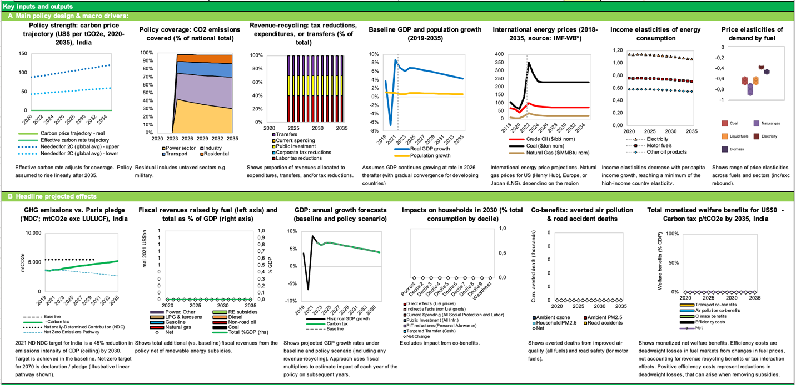

*Figure 7: How carbon pricing enables solar with storage (Singh Ahluwalia & Patel, 2021)*

To date, India has refrained from imposing explicit carbon fees on fossil fuels, though implicit carbon prices have resulted from imposition of fuel taxes. However, a voluntary carbon offset market is being introduced in 2023 that is meant to evolve into a mandatory carbon emissions cap-and-trade market system over several years.

There are also interesting possibilities for application of financial incentive systems that have worked well in other contexts to drive decarbonization. For more on that, please see Chapter 7 of this text: *Carbon Markets in India,* in particular the section on output-based rebating of carbon fees to power utility company participants in a carbon fee collection and redistribution pooled fund. In that system, companies compete to win the right to take more money from the carbon fee pool than they pay in – by ramping up clean MWh production and ramping down coal MWh production by means of increasingly renewables-focused hybrid power sites faster than other companies paying into the same carbon fee pool. Since renewable capacity is increasingly often cheaper than running coal power generation equipment, shifting from coal toward renewables capacity is not a particularly tricky task in business terms.

## **Switching from Coal to RE with Storage: Market Reform in the Power Sector**

## **India’s Power Market Structure**

The graphic below shows the structure of India’s electricity sector governance:

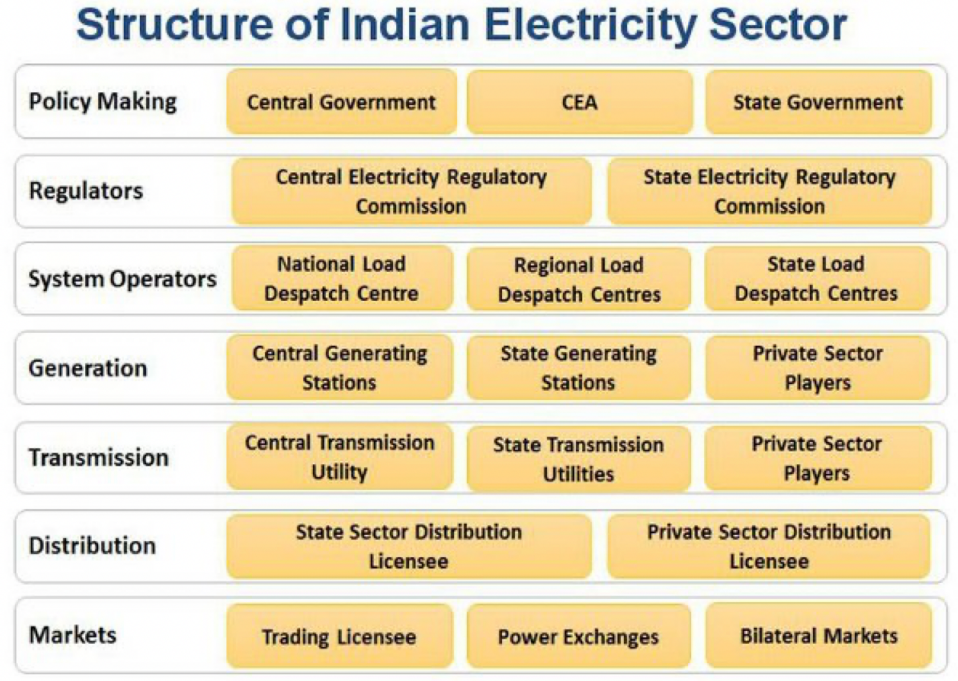

*Figure 8: The structure of the Indian Electricity Sector. Source: slide 8 [*here*](https://slideplayer.com/slide/11783975/).*

### **Distribution Companies**

India's regional electricity distribution companies are called "Discoms.” Discoms (Powell et al., 2021) are generally SOEs, though *[some are privately owned](https://www.saurenergy.com/solar-energy-news/state-owned-and-private-discoms-on-two-ends-of-the-spectrum-icra) (A. Verma, 2021)*, and reformers have proposed making a *[clearer operational and financial separation](https://www.business-standard.com/article/current-affairs/greater-operational-financial-autonomy-for-state-owned-discoms-niti-aayog-121080301086_1.html) (Business Standard, 2021)* between state governments and Discoms (see Box 1).

Box 1: Financial viability of DISCOMS is critical for the transition

India's Discoms tend to have chronic financial difficulties. They often are late in paying independent power producers, IPPs, because many [*Discoms face structural challenges*](https://ieefa.org/wp-content/uploads/2020/08/The-Curious-Case-of-Indias-Discoms_August-2020.pdf) (Vibhuti Garg & Kashish Shah, 2020) in getting paid by retail customers (especially farmers). Indian governments have struggled for years to find ways to solve this problem (M. K. Verma et al., 2020).

Chronic lateness of Discoms in paying independent power producers (IPPs) for electricity discourages investment in additional power generation capacity and increases IPPs' cost of capital (since lenders are aware of this chronic source of financial risk to RE projects).

- Because of the political-economic difficulties of [*solving Discoms’ structural problems*](https://www.fitchratings.com/research/infrastructure-project-finance/india-discom-reform-plan-to-benefit-power-gencos-in-long-term-01-02-2021) (FitchRatings, 2021), India's Union and state governments have tended to use the band-aid approach of providing frequent bailouts to pay Discoms' debts. Ujwal Discoms Assurance Yojana ([*UDAY*](https://www.uday.gov.in/home.php)) (Power Finance Corporation Limited, 2015) was launched by the Government to encourage operational and financial turnaround of State-owned Power Distribution Companies (Discoms) with an aim to reduce Aggregate Technical & Commercial (AT&C) losses to 15% by FY19. UDAY is essentially a regularized bailout vehicle that allows Indian state governments to take over debt from the Discoms they own.

- A more sustainable approach might involve charging consumers more for electricity so that Discoms don't run at a loss, and then paying out subsidies to the poorest consumers to prevent energy poverty. However, this is a difficult solution to implement from a political-economy perspective.

According to a *[GERMI report](https://www.germi.org/publications/Financing-Indias-100-GW-solar-target.pdf) (Akhilesh Magal, 2015),* "the easier interim solution would be for an intermediary agency like the Solar Energy Corporation of India (SECI) or a Central Public Sector Unit (CPSU) like the NTPC Vidyut Vikas Nigam (NVVN) to act as a power trader and repackage power to pass it on to Discoms. This would protect the interests of the investors and make the PPAs \[power purchase agreements\] far more bankable."

### **Power Purchase Agreements (PPAs)**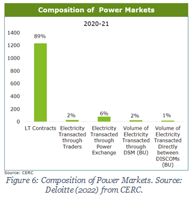

There is a legacy of Power Purchase Agreements (PPAs) between Discoms and Generators, particularly with older coal power stations. PPAs are used by Discoms to procure power from generating companies. These PPAs specify both the quantity and price of power that the power generators agree will be supplied to the Discoms over long periods of time, e.g. two decades.

In India, dispatch is determined in part by long-term PPAs. The Discoms request power from available power stations a day ahead. Over a given year, the Discoms ensure that a specific generator must deliver a pre-purchased quantity of electricity in that year.

Such PPAs can pose challenges to carbon pricing and/or environmentally optimal power dispatch. Such challenges were described in a recent study (Mo et al., 2021) that provides a review of China’s carbon pricing efforts in relation to the coal power sector.

### **Tariff Structure**

The actual rate paid to Discoms is a ‘regulated price’ with two components: First, a fixed-cost component to cover the generator’s investment costs (including provision for a return on investment). Second, a variable component, proportional to estimated variable costs. Thus, the pricing of electricity (Rs per MWh) and pre-specified quantities agreed for delivery over a given year allow investors to recover their costs reliably.

### **Power Market Reform**

When considering carbon pricing and decarbonization, the structure of the power market and the drivers of power market reform must be considered. There are three general philosophies driving power market structure and reform:

- Market pricing

- Certainty of long-term revenues to ensure a low cost of capital; and

- Incentivization of sufficient available capacity to ensure reliability.

We cover each of these drivers in turn.

#### **Market Pricing of Power Dispatch**

Market pricing in the context of the electricity system means deregulation of wholesale pricing of generation, so that prices reflect costs and scarcity. (In this case, we refer to pricing *within* the power sector – the contracts between Discoms and generators – rather than deregulation of tariffs to industrial and retail customers.)

Market pricing is intended to enhance cost efficiency and flexibility. Some form of market pricing of electricity tends to be a precondition for carbon pricing to be effective. Market pricing is attractive both because it promises more efficient use of existing generation assets, and because it allows carbon pricing to function effectively.

There are on-going reforms to the power market in India, including a planned move to a Market Based Economic Dispatch (MBED) mechanism, described in this article: *[(Creating a Vibrant Power Market)](https://powerline.net.in/2021/06/08/creating-a-vibrant-market/) (Power Line Magazine, 2021)*. Rather than scheduling power dispatch purely at the Discom level based on previously fixed PPAs, a national “merit order stack” is being prepared. A market clearing price (MCP) for each fifteen-minute time block in a day is to be determined. Original PPAs will be compensated by a mechanism called Bilateral Contract Settlement (BCS) (similar to the [*Contracts for Difference*](https://www.iea.org/policies/5731-contract-for-difference-cfd) in use in the UK).

#### **Certainty of Long-Term Revenues: PPAs and Renewable Reverse Auctions**

Traditionally, power generation assets are financed by guaranteeing the quantity and price of electricity supplied from the generator to the distribution company over many years, by means of a so-called ‘Power Purchase Agreements’ (PPA). PPAs are attractive as they can ensure sufficient investment at a reasonable financial cost – i.e., by providing certainty, they reduce the rate of return needed to ensure adequate investment volumes in power generation capacity.

Power purchase agreements (usually defined by ‘reverse auctions’) are relatively unproblematic in the case of renewables, since their place in the merit order means they run ‘anyway’ and their dispatch is not significantly affected by market prices.

PPAs for fossil generation, in contrast, are highly problematic, as they can ‘lock in’ the use of fossil fuel generating capacity that is uneconomic or environmentally damaging, even if a carbon price is applied. We will discuss the reform of legacy fossil PPAs further below.

#### **Capacity Sufficiency**

A third general concern motivating power market regulation and reform is that the lights must stay on – in other words, the regulatory structure must ensure sufficient capacity (and availability of that capacity) to guarantee adequate reliability.^10^

### **Reconciling the Reform Drives**

These three drives – for market pricing, long-term price certainty, and reliability – can come into conflict. For example, long term power purchase agreements can come into conflict with a desire to introduce market pricing. Yet there are ways to synthesize the objectives.

Forward Markets and Forward Pricing:

- Market pricing decisions are typically immediate or short-term, whereas investment decisions need some long-term certainty over prices and quantities required. The two can be linked with adequate forward markets – enabling distribution companies to buy power in advance and creating a liquid financial market in forward power prices.

Hedging Instruments, e.g., Contracts for Difference:

- Rather than a contract for physical delivery, it is possible to instead use a financial derivative that pays out the difference between the fluctuating market price and a long-term contracted price. This can stabilize the generating company’s long-term income whilst allowing short-term spot prices to influence dispatch choices. The [*UK employs Contracts for Difference*](https://www.lowcarboncontracts.uk/contracts-for-difference), implemented via a state-owned company, Low Carbon Contracts Company.

## **Phasing Down Coal: PPA Reform is Critical**

### **1. Economically Stranded!**

Phasing out coal in India would entail substantial economic and health benefits (Lim et al., 2012). However, concerns about job losses concentrated in economically disadvantaged regions, revenue losses from coal transport by the Indian Railways, and the prospect of bad loans granted to coal-fired power plants jeopardizing the financial system's stability make policymakers hesitant to curb coal use. A coal mine or power station would become a stranded asset if, under the new policy or economic situation, it ceases to be economical and needs to be closed before the end of its planned life. 22% of India’s power generation capacity has already been classified as non-performing assets, NPAs, according to [*Bais (2022)*](https://papers.ssrn.com/sol3/papers.cfm?abstract_id=4011070), valued at \$40 to 60 billion.

Stranded asset risk is potentially a risk to the banking sector. Banks finance coal generation and mining assets; if those assets are no longer economical, then there may arise non-performing assets on the balance sheets of the respective banks.

The stranded asset risk exists for two distinct reasons: first, future global or Indian climate policy could be more stringent than it is now. Second, coal might become economically stranded as it is increasingly overtaken by renewable energy. Indeed, that is already starting to happen, with new solar power cheaper than new coal power. The second, cost-related coal dynamic is arising earlier than the climate-driven phase-out of coal. This has implications for optimal policy.

### **2. PPA Reform**

Given that most coal assets have power purchase agreements (PPA) associated with them, they are still guaranteed a market. If those PPAs could be redeployed (re-assigned) from coal power delivery to renewables (including needed storage), economic stranding allows for a *cost-saving* shift from coal to renewables. Fortunately, India’s historical PPA coal tariffs have a two-part structure: a variable cost part, representing the cost of buying coal and operating the power plant, and a sunk cost part, representing principally the sunk investment cost. This structure makes planning for transition easier. We can analyze whether solar energy with necessary storage is cheaper or more expensive than legacy coal power – and save money if it is cheaper; and then, if necessary, any remaining part of the fixed-cost tariff (which represents a sunk cost) can be refinanced (see Shrimali).

Also, and importantly, contracted power can be substituted – i.e. shifted away from thermal plants and supplied, instead, by renewable power generators. As of November 2021, Ministry of Power has *[issued a scheme](https://powermin.gov.in/sites/default/files/Scheme_for_Flexibility_in_Generation_and_Scheduling_of_Thermal_Hydro_Power_Stations_through_bundling_with_Renewable_Energy_and_Storage_Power.pdf)* (Shram Shakti Bhawan & Rafi Marg, 2021) which allows for flexibility in generation and scheduling of Thermal and Hydro power stations through bundling with renewable power within the existing contracted capacity agreed in their PPAs.

# 

# **Application of World Bank/IMF’s CPAT (Climate Policy Assessment Tool) to explore ‘green growth’ policy scenarios as part of a Public Finance Review for India**

In line with a new World Bank priority entitled “Greening PFR” (Public Finance Review), in this section, we report the results of some applications of CPAT to a small number of policy scenarios: (i) application of a carbon tax (\$10 in 2024, rising to \$50 by 2030), with revenues spent 100% on public investment, plus phase-out of fossil fuel subsidies, beginning in 2024 and complete by 2030; (ii) implementation of a feebate scheme in the power sector, plus phase-out of fossil fuel subsidies, and (iii) lower-interest financing of wind and solar power projects (-5% compared to the default rate of 13%, i.e. 7.5%), plus phase-out of fossil fuel subsidies. Contrast these to scenarios (iv) and (v): (iv) has no carbon tax, no feebate, and no lower-interest financing of wind or solar projects, but does include phase-out of fossil fuel subsidies, and (v), business-as-usual, which has no carbon tax, no feebate, no lower-interest financing of wind or solar projects, and no phase-out of fossil fuel subsidies.

\[CPAT model runs have been done; results require report-formatting; they will be added to this document in this section over coming days. For screenshots of key inputs and outputs of the three scenarios, see below. NJZ – 29-Jun-23\]

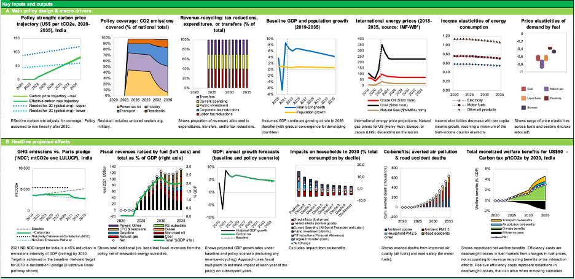

Figure: Results of CPAT scenario (engineer mode) (i): application of a carbon tax (\$10 in 2024, rising to \$50 by 2030), with revenues spent 100% on public investment, plus phase-out of fossil fuel subsidies, beginning in 2024 and complete by 2030

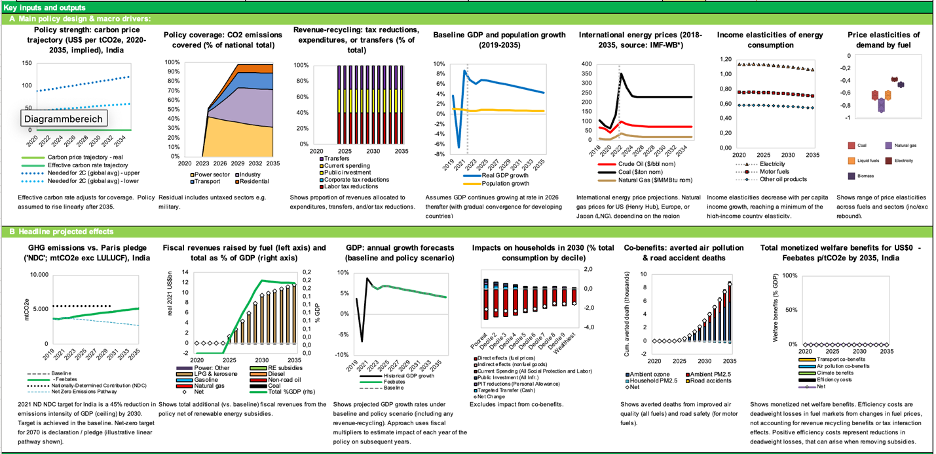

Figure: Results of CPAT scenario (engineer mode) (ii): implementation of a feebate scheme in the power sector, 2024-35, plus phase-out of fossil fuel subsidies, beginning in 2024 and complete by 2030

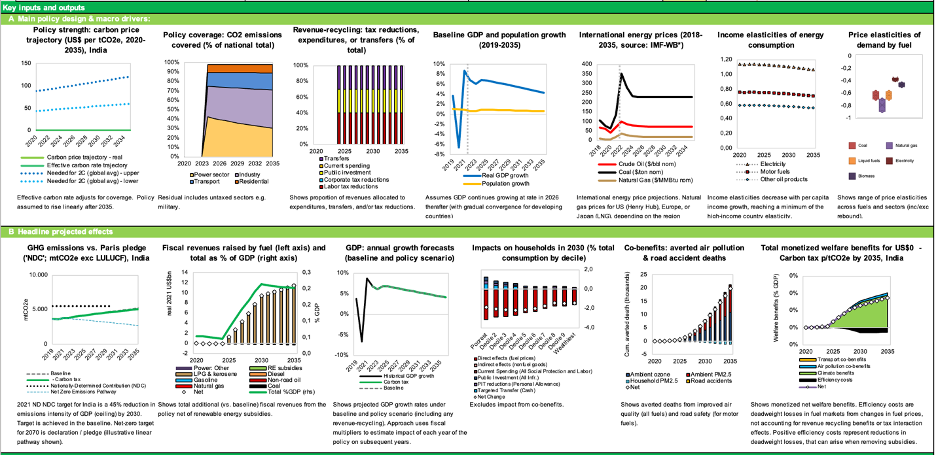

Figure: Results of CPAT scenario (engineer mode) (iii): lower-interest financing of wind and solar power projects (-5% compared to the default rate of 13%, i.e. 8.0%), plus phase-out of fossil fuel subsidies, beginning in 2024 and complete by 2030

Figure: Results of CPAT scenario (engineer mode) (iv): phase-out of fossil fuel subsidies, beginning in 2024 and complete by 2030, otherwise business-as-usual

Figure: Results of CPAT scenario (engineer mode) (iv): business-as-usual (no fossil fuel subsidy phase-out, no carbon tax)

# **Phasing Down Coal, Scaling Up Renewables: Characteristics of a Technically and Financially Feasible Just Transition**

### **Sought: Seamless employment transitions**

According to a [*Brookings institution paper*](https://www.brookings.edu/research/the-case-for-us-cooperation-with-india-on-a-just-transition-away-from-coal/), a ‘just transition’ must include the following elements:

1.  *Help workers and communities in coal communities receive support during the shift away from coal*

2.  *Support repurposing/rehabilitation of coal plants and coal mine sites for other productive activities*

3.  *Support closure of high-polluting coal plants.*

To achieve a just transition in full measure, a phasing-down of coal must be seamlessly accompanied by a ramping-up of clean energy systems, optimally via programs designed to ensure foolproof, fully funded, secure reskilling and redeployment of people who have been working in fossil fuels industries until now.

There are \~4 million direct and indirect jobs in coal mining in India. A Just Transition perspective takes the position that *the people doing those jobs deserve a seamless transition to a valued and decently paid role participating economically in one or another aspect of the new clean energy economy, with no significant gaps in their income or employment security.* This proposition expresses the core idea of a “just transition.”

In parallel, we can pragmatically note that attempts to set in motion a rapid transition from fossil to clean energy are likely to fail in almost any country because of determined resistance from fossil industry stakeholders, *unless and until* well-designed supportive government and private sector policies and measures are implemented that will provide fossil-industry stakeholders with attractive off-ramps from the fossil fuels infrastructure superhighway of money and materials flows they have until now participated in operating. These off-ramps must be connected directly to attractive on-ramps onto the new cleantech superhighway.

That is why a *supportive* transition accompanied by appropriate financial incentives as well as regulations is both just – and the only plausibly effective way of achieving the twin UN SDG goals of a rapid and comprehensive shift away from fossil fuels, whilst rapidly increasing energy abundance and prosperity at the same time.

### **The interesting question is: transition to what, exactly?**

In technical terms, a rapid global transition away from fossil and into clean energy means implementing a very fast-paced build-out of enormous volumes of new renewable power generation and energy distribution and storage capacity year on year. Because they’re already cheaper than any other way of supplying electricity in most jurisdictions and likely to get more so over coming years, these enormous volumes of kit will mostly consist of solar panels, but also plenty of wind turbines and a good amount of energy storage kit of various kinds.

In order to meet global UN SDG commitments, especially SDGs 7 (affordable, reliable, sustainable and modern energy for all) and 13 (climate action), clean energy supply equipment should be produced and deployed at speeds and scales sufficient to reliably implement universal individual and collective energy abundance worldwide before 2035, leaving no-one behind, in every region of the world.

Sums have been done showing that in technical terms, in engineering terms, such a rapid build-out is feasible. Calculations showing this have been published by LUT and Teske/DLR energy system techno-economic modelling research groups, amongst others, as described in [*Teske et al. (2021)*](https://www.mdpi.com/1996-1073/14/8/2103) and in [*Aghahosseini et al. (2023)*](https://www.sciencedirect.com/science/article/pii/S0306261922016580) and [*Gulagi et al. (2022)*](https://www.nature.com/articles/s41467-022-33048-8#Abs1) (Aghahosseini and Gulagi are both members of the LUT techno-economic modeling research group under the supervision of Prof. Christian Breyer, LUT University, Finland). Similarly, [*Lu et al. (2020)*](https://www.nature.com/articles/s41467-020-18318-7) estimate that the costs of India going to 80% renewable energy by 2040 would be lower than sticking with a coal-dominated BAU scenario. That solar PV will dominate energy systems in hot sunny countries henceforward is no longer controversial: in October 2020, International Energy Agency (IEA) executive director [*Fatih Birol declared*](https://www.pv-magazine.com/2020/10/14/solar-is-the-new-king-of-energy-markets/) during the event marking the official release of the 2020 edition of IEA’s flagship annual World Energy Outlook report that “solar is the new king of global electricity markets” – because it has already become cheaper than any other electricity generating technology and is expected to remain so permanently going forward. At the same time, [*long-duration energy storage technologies*](https://www.sciencedirect.com/science/article/pii/S1364032122001630) are evolving and declining rapidly in cost, further enhancing the viability of renewables-focused energy system deep-decarbonization pathways.

Similarly, an in-depth study of transition pathways to a fully clean energy powered future for the United States was reported in detail in “[*Electrify*](https://penguinrandomhousehighereducation.com/book/?isbn=9780262046237),” a book by [*Saul Griffith*](https://en.wikipedia.org/wiki/Saul_Griffith), co-founder and CEO of Otherlab. *Electrify* is Griffith’s book-length calculation and exploration of a claim he makes in the book's introductory chapter:

> *“While this might come as a surprise, if policymakers commit to electrifying our infrastructure at the scale required, energy costs will decrease for all Americans. This is especially true if decisionmakers accompany the project with an appropriate set of financing mechanisms that will make the electrified future affordable for everyone. We have the clean-energy solutions we need … to enjoy a clean, green, and prosperous future.”*

**Cleantech equipment will inexorably get even better and even cheaper**

There are good reasons to expect the clean energy system build-out will get easier and cheaper, not harder or more expensive, over coming years and decades, as ever better new clean energy harvesting, transformation, storage and distribution equipment is developed and deployed.

For example, consider the coming market entry in 2023 of [*sodium ion battery packs by CATL*](https://www.catl.com/en/news/665.html), a major rechargeable battery manufacturer. [*According to CATL*](https://www.catl.com/en/news/665.html):

> *“Based on a series of innovations in the chemistry system, CATL’s first generation of sodium-ion batteries has the advantages of high energy density, fast-charging capability, excellent thermal stability, great low-temperature performance, and high integration efficiency, among others. The energy density of CATL’s sodium-ion battery cell can achieve up to 160Wh/kg, and the battery can charge in 15 minutes to 80% SOC at room temperature. Moreover, in a low-temperature environment of -20°C, the sodium-ion battery has a capacity retention rate of more than 90%, and its system integration efficiency can reach more than 80%. The sodium-ion batteries’ thermal stability exceeds the national safety requirements for traction batteries. The first generation of sodium-ion batteries can be used in various transportation electrification scenarios, especially in regions with extremely low temperatures, where its outstanding advantages become obvious. Also, it can be flexibly adapted to the application needs of all scenarios in the energy storage field.”*

The emergence and iterative optimization (over the next several years) of the sodium ion battery will obviate previously widespread anxiety over whether sufficient cost-effectively accessible lithium supplies can be developed to provide enough energy storage systems for the global electric vehicle fleet, utility-scale battery peaker plants,, and home battery packs. None of these lithium supply constraint worries need be of serious concern any longer: sodium batteries are cheaper, safer, and only moderately less volumetrically efficient than lithium-ion batteries and are [*expected to become cheaper in cost per MWh*](https://www.nextbigfuture.com/2022/12/catl-will-mix-cheaper-sodium-ion-batteries-with-lithium-for-acceptable-range-evs.html). We therefore won’t need nearly as much lithium as we thought we would need, back before CATL mastered sodium ion battery engineering.

Sodium batteries’ core ingredient is Na+ rather than Li+, and a handy source of Na+ is readily available in vast quantities in the form of NaCl. [*Sodium*](https://www.britannica.com/science/sodium) is the most common alkali metal and the sixth most abundant element on Earth, [*comprising*](https://www.merriam-webster.com/dictionary/comprising) about 2.8 percent of the Earth’s crust. It occurs abundantly in [*compounds*](https://www.merriam-webster.com/dictionary/compounds), especially common [*salt*](https://www.britannica.com/science/salt)—sodium chloride (NaCl)—which forms the mineral [*halite*](https://www.britannica.com/science/halite) and [*constitutes*](https://www.merriam-webster.com/dictionary/constitutes) about 80 percent of the dissolved [*constituents*](https://www.merriam-webster.com/dictionary/constituents) of [*seawater*](https://www.britannica.com/science/seawater).

Our battery supply constraint worries can be consigned to history.

**Financial feasibility of the cleantech transition: already high, still improving**

A rapid cleantech transition is also feasible in financial terms, as increasingly evidenced by a growing number of studies outlining suitable financing mechanisms – and by successful practical implementations of a growing list of them.

It is possible to design any number of different possible financing mechanisms and pathways for a collective project to fund the rollout of a comprehensive global clean energy and materials production and distribution system. Crucially, a package of properly scaled cleantech equipment production financing mechanisms should be designed *and implemented* globally *very soon.* Financing mechanisms must be designed and scaled to fund a *rapid* scale-up of renewable energy equipment production. Cleantech equipment Gigafactories should be built in in well-selected locations in every global region with minimal further delay, at speeds and scales consistent with achieving universal clean energy abundance by 2035 or before (as foreseen in [*UN SDG 7*](https://www.un.org/en/chronicle/article/goal-7-ensure-access-affordable-reliable-sustainable-and-modern-energy-all)). There is no further reason to hesitate, and there are plenty of reasons not to.

**Estimates of the nature and quantity of the required kit**

Production equipment must be built and deployed to rapidly ramp up quantities of solar panels, wind turbines, energy storage systems, fast EV recharging station kits, renewable energy powered chemical synthesis factory equipment, and other necessary gear.

At its core, the technical nature of such a roll-out is likely to be based primarily on solar PV and wind, given the current suite of least-cost power generation technologies and careful projections of future unit cost trends (levelized cost per MWh) of various technologies (various fossil, nuclear, renewables, and energy storage types). The cleantech future is likely to rely primarily on very-large-scale roll-out of cheap solar and wind power as its real-economy foundation, accompanied by increasingly cheap and diverse energy storage options, according to IEA estimates and techno-economic models from leading energy transition modelling research groups like LUT (see e.g. [*Bogdanov et al. 2021*](https://www.sciencedirect.com/science/article/pii/S0306261920316639)), IEA World Energy Outlook, and non-government groups like [*Rewiring America*](https://www.rewiringamerica.org).

More details and illustrative calculations of the possible size and speed of a rapid transition to an energy-abundant, prosperous clean energy future in India and globally can be found in Chapter 8 (entitled “Can India accelerate GDP growth by accelerating the transition to net zero?”).

**Already working examples of cleantech Gigafab complexes can be emulated, improved on, and diversified**

We now know from detailed techno-economic modelling studies that a comprehensively fossil-fuels-free new energy and materials production system is technically, economically, and financially both feasible and desirable, and already emerging. The challenge is simply to scale the cleantech system up more quickly, while ramping down the fossil energy economy in parallel, at rates that ensure seamless provision of plentiful modern energy in every region.

To help motivate action on this, we have something even more persuasive than well-researched and carefully calculated techno-economic and financial models: we also have an increasing number of working examples of the very large core equipment production factory complexes – Gigafabs – that the world will need in order to implement universal clean energy abundance, notably the one [*Reliance Industries is presently building on 5,000 acres near Jamnagar, Gujarat*](https://www.ril.com/OurBusinesses/New-Energy.aspx).

Fossil industry workers could and should be directly, seamlessly transitioned to new roles in the clean energy economy, without being required to endure any fear of joblessness or of losing even one month’s pay during the transition. A Just Transition will require creation of well-thought-out and fully financed mechanisms to ensure that plentiful decently paid job opportunities are seamlessly available to people whose jobs are currently closely tied to fossil fuels, along with readily accessible retraining and no gap in take-home pay during any part of the transition to their new roles.

Any number of financial mechanisms and retraining programs can be designed and implemented that would provide this kind of seamless transition support. The challenge before us is to design systems that take away fears that fossil industry stakeholders have of losing their stake and being left with no way to make an income or a profit if they are required to abandon fossil fuels and turn to cleantech instead.

This means transitioning their skills repertoire, activities, and financial streams from brown to green energy supply chains. It means ensuring the right kinds of financial incentive, financing, funding, and regulatory mechanisms and rules are in place, readily available, and effective at motivating and funding individual, corporate, and regional transitions from brown to green energy and materials production and consumption systems.

**Fossil Sectors in Need of Transition Support**

Major coal-using sectors in India include brickmaking, transportation (railways and trucks), iron and steel, and power generation. State-owned enterprises focused on coal and coal power contribute \~3% of federal government revenue; states such as Jharkhand, Chhattisgarh, and Odisha receive over 5% of state government revenue from coal.^7^

Studies highlight the need for: research on international comparisons of just transition plans, stakeholder analysis, identification of opportunities for SOEs, full funding of legacy pension funds, and repurposing of existing coal generation and mining assets and lands.^8^

The fiscal revenue implications of the green transition are also significant. It will involve the transformation of coal-dependent state-owned enterprises, including electricity generation companies, Coal India Ltd. (a coal mining company), and Indian Railways Ltd. (which harvests important revenues from coal transportation).

According to a [*TERI study*](https://www.teriin.org/policy-brief/working-paper-assessing-vulnerability-coal-dependence-and-need-just-transition), “promotion and diversification of the state’s industrial establishment away from the traditional mono-industrial practice will help promote enhanced levels of economic activity and large-scale employment integration and address the missing industrial gap in the economy.” Establishing industrial parks, solar parks, and battery/energy storage parks will diversify revenue sources*.*

A [*study by CIF, the Climate Investment Funds*](https://unfccc.int/sites/default/files/resource/Inputs%20from%20Climate%20Investment%20Funds_%20India_CIF%20Case%20Study.pdf), found that:

> *“A particularly relevant aspect of India’s just transition is the geographic distribution of the energy transition. The states in India with high solar radiation, and thus significant solar power generation capacity, are in the west of the country, while the coal-rich states are predominantly in the center and east. This geographic distribution raises important implications for how local-, state-, and national-level agencies need to manage the energy transition and its impacts on particular groups and regions.”*

According to a [*TERI report published in June 2022*](https://www.teriin.org/article/coal-transitions-india-mitigating-socio-economic-fallouts), “Coal Transitions in India: Mitigating the Socio-Economic Fallouts”:

> *“If one were to exclude the bricks sector (which is mostly informal and the numbers fluctuate year on year), the number of people dependent on coal would still be around 2.5 million people. Of the 1526 sponge iron and steel units producing crude steel, 610 or 40% is situated in the four states of Odisha (12%), Jharkhand (9%), Chhattisgarh (10%), and West Bengal (9%). Of the 229 thermal power plant units (including captive), 40% are located in Uttar Pradesh (12%), Chhattisgarh (10%), Maharashtra and Madhya Pradesh (9% each). Coal is mined across eleven states in India, with four states—Chhattisgarh, Jharkhand, Odisha, and Madhya Pradesh—accounting for \~80% of the 730 million tonnes (MT) of production (CCO, 2020). These states will be the most affected in the coming decades when India transitions away from coal to meet the net zero target in 2070.*
>
> *Coal transitions are likely to have the most impact on the people in the central and eastern states of West Bengal, Jharkhand, Chhattisgarh, Odisha, and Madhya Pradesh, with some parts of Uttar Pradesh, Telangana, Maharashtra, and Andhra Pradesh. At the national level, 266 districts have at least one asset linked to the coal sector, and 135 of these 266 districts have two or more assets dependent on coal, i.e., a coal mine, thermal power plant, sponge iron plant, steel plant. At least half of all the districts in Jharkhand (15) and West Bengal (11), 30% of districts in Odisha and Chhattisgarh (9) are likely to be impacted in some form or the other due to the impending coal transitions.*
>
> *This is the real challenge that India faces today: Transitioning entire regions and districts, finding livelihood opportunities for a population the size of smaller countries, and meeting our development and climate goals. The scale and size of this transition alone makes it unprecedented in the history of coal transitions across the world.*
>
> *Characteristics endemic to the Indian market complicates this transition process further. These include the large presence of contract/off-roll labor in every sector, the socio-economic profile of the labor in the sectors, and the overall sectoral roadmaps. The share of off-roll labor accounts for at least 70% of the total labor across all sectors, reaching as high as 92% and 80% in transport and bricks, respectively.*
>
> *Official labor estimates in different sectors do not account for this labor, since they are employed by job contractors. Without their inclusion from the get-go, it is likely that they may not be beneficiaries of the transition policies and the costs of transitioning them will be discounted. The informality limits institutional support mechanisms like unions. The coal transport by road, for example, is the most vulnerable to the transition given increasing mechanization, and probably the first to be impacted, but lacks a union or other institutional mechanism to make a case for them as coal transition workers. The brick sector may not even be viewed as a coal transition sector, given the labor is employed for 6 months in a year, is migratory by nature and, therefore, there are no official records on the number of people employed in the sector or a platform for the labor to be a part of the discussion.”*

The scope of the political-economic challenge before India in achieving a just transition away from coal is bound up with the involvement of very large and powerful state-owned as well as private corporations and institutions in the coal sector, all of which have deep links into the political leadership of the states and the central government. These institutions include, among others, Coal India Ltd. and its subsidiaries, and Indian Railways Ltd (IR), which gains a substantial portion of its revenues from transporting coal. [*As of 2018*](https://www.brookings.edu/research/indian-railways-and-coal/), IR gained 44% of its freight revenues and an even larger share of its profits from transporting coal. The importance of the coal sector – which, as noted, in 2022 provided 70% of India’s total electricity supply – is further underlined by the fact that there is even a dedicated federal [*Ministry of Coal*](https://coal.nic.in/en/about-us/agencies-under-ministry).

The interests and participation of these companies and institutions must necessarily be encompassed by any realistic just-transition plan. Improving the odds of a successful transition will likely entail a “co-design” approach, in which each of the institutions centrally affected are invited to participate in developing transition strategies for themselves, in cooperation with interlinked networks of other stakeholder institutions.

According to [*Emma Blomkamp (2020)*](https://anzsog.edu.au/research-insights-and-resources/research/the-promise-of-co-design-for-public-policy/), “Co-design is underpinned by participatory design. Applied to policy, this means enabling or empowering people affected by a policy issue to contribute to its solution. As experts in their own experiences, citizens and stakeholders should be involved in designing services and policies that relate to those experiences.”

A key component of a successful just transition strategy is likely to be *repurposing* and/or *co-purposing* coal-fired power station sites – and in some cases, also coal-fields.

*Repurposing* a coal power generation site might entail, for example, discontinuing coal-burning and instead adding to the site a variety of renewable energy power generation and storage equipment, such as hybrid wind and solar power arrays, battery parks, and other energy storage capacity (e.g. highly efficient compressed CO2 energy storage systems), and synchronous condensors for load-balancing purposes. In some cases, coal-fired steam could be replaced with clean geothermal steam by means of [*enhanced geothermal steam producing wells*](https://www.energy.gov/eere/geothermal/downloads/enhanced-geothermal-system-egs-fact-sheet). Coal power sites benefit from already having transmission lines in place for delivering power to off-takers. A [*cost-benefit study by Jindal and Shrimali*](https://www.sciencedirect.com/science/article/abs/pii/S0301421522001367) (2022) found a strong economic rationale for repurposing India’s coal power sites.

*Co-purposing,* in contrast, might entail making some or all of these additions to a site, whilst also retaining the site’s steam turbines and coal-generating capacity. The power plant operators would make use of a mix of renewable power, energy storage, and coal power during the transition. The goal in this case would be to burn ever less coal, using the coal-powered generators less and relying on renewable energy whenever wind and sun conditions permit, whilst retaining the flexibility and load-balancing capacity of the site’s coal-burning power generation capacity. In this way, baseload coal power generating capacity would morph into flexible load-following capacity. According to [*Shrimali (2021)*](https://www.sciencedirect.com/science/article/abs/pii/S0301421520307722):

> *“Our analysis shows the following: first, the incremental costs for converting baseload coal plants to flexible ones would be only 5%–10% of the total costs of baseload plants in net present value terms or 8%–22% in levelized terms; second, flexible coal may be the most cost-effective flexible solution in the near-term, by a factor of approximately 4–22, when compared to lithium-ion batteries or pumped hydro.”*

A crucial point in relation to repurposing or co-purposing coal power plant sites relates to the real-world decision-making process of the coal plant owners and operators. What will be needed is a readily approachable and available financing mechanism for co-purposing and repurposing projects that is well-known to these key stakeholders, highly attractive as a financial proposition for their companies (and for the key managers and decision-makers themselves), and straightforward to apply. This suggests that the Union government should, through appropriate agencies (e.g. within the Ministry of Power or MNRE, Ministry of New and Renewable Energy), develop a standard approach to financing coal plant site repurposing and/or co-purposing projects, and actively engage coal plant owners and operators in applying it. The standard package should be financially compelling and administratively straightforward from the point-of-view of the key stakeholders.

With these techno-economic options in view, we can begin to consider policy reforms that would enable their emergence in practice. Among other measures, power market reforms and carbon pricing reforms may prove useful, as discussed in the following section.

**Financing the Green Transition**

The total amount of green finance in India (Khanna et al., 2022) (Ref, Landscape of Green Finance in India) in the latest available years (2019/20) was 3.09 trillion Rupees or \$44bn per year (Purkayastha & Jain, 2022). For comparison purposes, to reach net zero emissions by 2070, the [*IEA estimates that ”\$160 billion per year is needed,*](https://www.iea.org/commentaries/india-s-clean-energy-transition-is-rapidly-underway-benefiting-the-entire-world) (Amitabh Kant & Dr Fatih Birol, 2022) on average, across India’s energy economy between now and 2030” (Amitabh Kant & Dr Fatih Birol, 2022). Similarly, the Climate Policy Initiative (CPI) estimates that at least \$170bn per year is needed to meet the NDCs, which is about four times the current levels. However, to meet the targets announced at COP-26, which include 500GW of renewable energy, finance flows must be even higher.

Bridging this financing gap is undoubtedly on of the major challenges India will face in the coming years. This involves not only a large increase in the project pipeline, but also structural changes in the financial system. The system needs to be structured to attract, catalyze and leverage climate finance resources available in the domestic and international markets.

In this section, we describe how a comprehensive approach to greening the financial sector can contribute to finance India’s low carbon transition. India has been engaged in this approach since the mid-2010s and important reforms are currently being discussed. Such a comprehensive approach implies the involvement of all financial actors at different levels. Credit institutions (banks and non-banks institutions), both public and private, have a key role to play in mainstreaming climate finance practices. The regulation framework can also be adapted to prevent financial instability due to the spread of climate-related risks and to create an enabling environment for redirecting available financial resources towards climate investments.

## **1. Defining a comprehensive roadmap for financial sector transition**

To create the conditions for an orderly transition in the financial sector, financial actors need to adhere to a long-term vision that makes explicit the overall objectives of the transition. Indeed, a comprehensive financial sector transition roadmap could be a useful instrument for defining common objectives and clarifying the different steps of the transition. A common understanding of these objectives and how to achieve them is critical to engage all stakeholders. Maintaining stability in the financial sector requires clear communication on this roadmap so that financial actors can anticipate regulatory framework’s evolutions such as additional disclosure and prudential requirements, necessary changes in risk assessment methodologies or in commercial positioning.

Such a roadmap could be developed based on the political commitments and long-term strategies built through the updated NDC approval process. In 2022, India submitted its *Long-Term Low-Carbon Development Strategy* to the UNFCCC after revising its NDC. This long-term Strategy addresses the economic and financial impacts of transitioning to a low carbon economy (see paragraph 2.7), although if it does not prioritize the greening of India’s financial sector as a strategic goal for the low-carbon transition. However, the Strategy explicitly recognizes that “*Climate change, and policies to address it, can affect the dynamics of the economy and the financial system, thereby impacting inflation targets, affecting financial stability, and limiting the room available for conventional monetary policy*”. Some of the main factors of financial instability are mentioned, including the risk of affecting the effectiveness of monetary policy instruments and generating stranded assets in the most exposed sectors.

Although no overall objective for greening the Indian financial sector is mentioned in the *Long-Term Low-Carbon Development Strategy*, the document can be a good starting point for setting up such a multi-actors coordination process. Depending on the targeted scope and political will of the Indian authorities, such a roadmap could address the following topics (non-exhaustive list) :

- How critical is the overall exposure of the Indian financial sector to climate-related risks?

- How to build a regulatory framework that can prevent the banking sector from financial instability due to the spread of climate-related risks within the sector?

  - Disclosure requirements framework

  - Updating banking supervision processes

  - Updating risk assessment methodologies

- How to assess and minimize the risk of financial instability due to the spread of climate-related risks in the non-banking sector (securities market, insurers, pension funds, etc.)?

  - Disclosure requirements framework

  - Updating market supervision processes

  - Building an appropriate regulation framework for other financial institutions (pension funds, insurers, etc.)

- How to structure incentives to accelerate the redirection of financial flows towards the low-carbon transition?

  - Establishing new standards: Taxonomy, ESG risk management framework, etc.

  - Optimizing the role of the central bank: greening the monetary policy, macroprudential regulation, etc.

  - Structuring financial incentives for credit institutions: soft lending policies, new financial schemes, etc.[^2]

Such a roadmap would also define the roles and responsibilities of each stakeholder, including the various public authorities: the supervisor and, if separate, the central bank, the Ministry of Finance, etc. Each stakeholder may have the opportunity to develop its own action plan according to the overall roadmap guidelines (see for example t[*he European Central Bank climate agenda*](https://www.ecb.europa.eu/press/pr/date/2022/html/ecb.pr220704_annex~cb39c2dcbb.en.pdf) and its [*green finance roadmap*](https://www.ecb.europa.eu/press/pr/date/2021/html/ecb.pr210708_1_annex~f84ab35968.en.pdf)).

Several international coordination entities have already developed analytical tools, guidelines and methodologies to support their members in this work[^3]. The Financial Stability Board has published its own [*Roadmap for addressing climate-related risks*](https://www.fsb.org/wp-content/uploads/P070721-2.pdf) in which national entities can find references to all Standard Setting Bodies guidelines and best practices for climate-related risks management in the financial sector.

**2. Making the banking regulatory framework consistent with the India’s decarbonization agenda**

There are different methodologies for quantifying the banking sector’s exposure to climate-related risks. These methodologies should at least assess the direct and indirect exposures of financial actors to physical and transition risks. In the absence of any systematic disclosure requirements for Indian individual banks’ exposure to carbon-intensive sectors, it is necessary to consolidate data from different sources and consider the results cautiously. In 2022, as part of the UK PACT Program, ODI conducted a comprehensive review of available data from different sources (including Reserve Bank of India, the MoEFCC and the Ministry of Statistics and Program Implementation) to quantify the vulnerability of the Indian banking sector to transition and physical risks. To do so, ODI quantified the India banking sector sensitivity unsing different climate-related risk indicators (see Prashant Vaze, Neha Kumar, Sarah Colenbrander, Lily Burge and Nandini Sharma (2022) Identifying, managing and disclosing climate-related financial risks in India: Options for the RBI of India. ODI Report. London: ODI).

By comparing different indicators related to GHG emissions, outstanding credit dedicated to a sector and the level of firm’s indebtedness in that sector, the authors show that the Indian banking sector is mostly exposed to the transition risk through its exposure to the electricity production sector (representing 5,2% of outstanding credit and 40% of the total GHG emissions). The agricultural sector, traditionally a risky sector for financial institutions, accounts for 15% of the GHG emissions and 11,9% of outstanding credit. As for the transportation sector, the banking sector’ exposure to the agricultural sector is less concentrated. However, the agricultural sector is considered the most exposed to physical risk, which is a significant risk in absolute terms in India. Large energy-intensive sectors such as cement, iron and steel and non-ferrous metals also represent a transition risk for the financial sector, especially for financial institutions directly exposed to the most important economic players operating in these sectors.

Since the mid-2010s, the RBI has been working steadily to raise awareness of the potential impacts of climate change on the financial sector, but also on the real economy.

In April 2020, the RBI published a study in its monthly bulletin (see RBI Bulletin April 2020) detailing, with granular geographical data, the potential negative impacts of climate change on the most vulnerable Indian regions (especially massive rainfalls, floods, and heat waves). The study also documents the link between climate change and food prices and its impact on the Indian global consumer price index. The article presents a brief review of macroeconomic tools for dealing with the negative impacts of climate change on different economic sectors before focusing on the tools available to central banks.

A crucial step was taken when the RBI joined the Network of Central Banks and Supervisors for Greening the Financial Sector (NGFS) as a member in April 2021. The NGFS provides its members with best practices, guidelines, and methodologies for assessing the economic and financial consequences of climate change within the financial sector. In particular, the NGFS works on different low-carbon transition scenarios (from an ambitious net-zero emissions scenario to a business-as-usual scenario) to help financial regulators and all policymakers measure the cost of delaying the transition. In [*its statement of membership*](https://rbidocs.rbi.org.in/rdocs/content/pdfs/NGFS03112021_EN.pdf), the RBI commits to:

- *“Exploring how climate scenario exercises can be used to identify vulnerabilities in RBI supervised entities' balance sheets, business models and gaps in their capabilities for measuring and managing climate-related financial risks;*

- *lntegrating climate-related risks into financial stability monitoring;*

- *Building awareness about climate-related risks among regulated financial institutions and spreading knowledge about issues relating to climate change and methods to deal with them accordingly.”*

A few months later, in its July 2021 Financial Stability report (Issue n°23), the Reserve Bank of India (RBI) states:” *The climate change debate is on the move, its focus now on financial stability. Consequently, the need for an appropriate framework to identify, assess and manage climate-related risk has become an imperative.”* In doing so, the Reserve Bank of India explicitly recognizes the challenge of better regulating climate-related risks within the banking sector.

In practice, the development of a climate-related regulatory framework for the banking sector traditionally relies on a three-steps approach. The first step is to generate appropriate and comparable data on financial institutions’ exposure to climate-related risks. Through disclosure requirements, the supervisor must be able to collect relevant data at the most granular level possible. The second step is to implement global risk assessments and establish stress-test scenarios. This risk assessment analysis should be conducted using appropriate scenarios based on vulnerabilities identified within the national financial system. The third step is to develop a tailor-made regulatory framework based on the key risks and vulnerabilities identified in the sector. This regulatory framework is based on a comprehensive disclosure requirements policy, microprudential rules (capital requirements, concentration limits, etc.) but also on macroprudential guidance to prevent the spread of systemic risk (see for example “The macroprudential challenge of climate change”, July 2022, ECB/ESRB).

Following its work to raise awareness of climate-related risks and international commitments of the Government of India (see paragraph 1), the RBI released an important consultation paper in July 2022 entitled “Discussion Paper on Climate Risk and Sustainable Finance” (see reference). The paper is to be discussed with all stakeholders and aims to build a consensus on the architecture of a new climate-related regulatory framework for banking activities. The consultation paper presents a draft of this architecture:

- *Overview of climate related risk and its unique characteristics as applicable to REs*

- *Broad guidance for all REs to have (i) appropriate governance (ii) strategy to address climate change risks and (iii) risk management structure to effectively manage them from a micro-prudential perspective*

- *Exploring how forward-looking tools like stress testing and climate scenario analysis can be used to identify and assess vulnerabilities in REs*

- *Climate risk related financial disclosure and reporting for REs*

- *Capacity Building*

- *Voluntary Initiatives*

The consultation Paper refers to international good practices in these fields and makes proposals for binding regulatory rules. It covers the main topics of banking regulation: assessment of clients’ exposure to climate-related risks and impacts on GHG emissions of projects financed, rating methodologies, capital adequacy ratio calculation, provisioning, disclosure (with reference to the TCFD recommendations), etc. Regarding the implementation of this new regulatory framework, the paper also refers to a wide range of existing tools, including capacity building for the staff, management of climate-related risks at all levels (including governance issues), integration of climate risk into the overall risk management system, stress-tests and scenario analysis (with reference to the work of the NGFS), business continuity, etc.

The adoption of an ambitious climate regulatory framework for banking activities is a critical first step to initiate the low-carbon transition in the financial sector. In particular, the disclosure of exposure and impact data on the one hand and the implementation of coordinated risk assessment exercises on the other side are priority processes for the banking sector. The effectiveness of these processes depends critically on high-quality data available at a sufficient granular level. Financial institutions and the regulator may need to invest in the early stages of implementation of this new regulatory framework to be able to disclose high-quality data.

Due to relatively high exposure of the banking sector to certain carbon-intensive activities, it is critical for RBI to issue an appropriate set of rules to avoid an unmanageable increase in climate-related risks within the Indian financial sector. It is also widely recognized that publishing such a regulatory framework helps to send an important market signal to the domestic financial market but also to the international community. Indeed, a sustainable financial market can be considered today as a major factor of attractiveness, especially in a macroeconomic context where international financial resources will be less affordable and more expensive.

**3. Regulation of market activities: a challenge to redirect large financial flows towards low-carbon investments**

While the majority of financial flows for climate finance come from the banking system, an increasing share of local and international financial resources are flowing through capital markets as legal and financial frameworks become more appropriate (see CPI, global Landscape of climate finance/A decade of data). Capital markets allow corporates to raise larger amounts of funds in the local but also on international markets, through financial instruments that are liquid and tradable. Tapping into available domestic and international savings is critical for emerging countries like India, which enjoy comfortable credit ratings and deep, stable capital markets.

In this context, the challenge is to establish an attractive legal and financial framework to help stimulate the development of green capital markets. International investors looking for green assets are growing and can be long term partners for governments, corporate and project promoters committed to the transition to a low-carbon economy. On the other hand, project promoters, financial institutions and public sector entities are interested in diversifying their investor base by issuing green or sustainable bonds. The setup of a “green financial value chain”, ie the establishment of minimum sustainability requirements for both creditors and debtors, presents an opportunity for local and international entities attempting to develop a “holistic” commitment to the green transition.

While the India sustainable securities market is still limited (USD 10,3 billion of climate bonds were issued in the first half of 2019 according to the Economic Survey 2019-2020, Ministry of Finance), some of the key economic stakeholders in the low-carbon transition are already major issuers (for example IREDA and IRFC). Moreover, the market is growing rapidly, with USD 7 billion raised by India companies through ESG and Green bonds in 2021, compared to a limited USD 1,4 billion in 2020 and USD 4 billion in 2019 (see SEBI consultation paper). It is also important to note that the Government of India is part of this dynamic. Indeed, the Government of India has approved its [*Sovereign Green Bond Framework*](https://dea.gov.in/sites/default/files/Framework%20for%20Sovereign%20Green%20Bonds.pdf) in 2022 and intends to issue regularly on the market from 2023 onwards.

In this context, implementing an appropriate legal and financial framework for sustainable and green securities is critical to create an enabling environment for investors, corporates, and project promoters. Mainstreaming best practices within capital markets is undoubtedly one of the main pillars of an ambitious strategy to green the financial system.

The potential outcomes of such an evolution are numerous:

- For the investors (especially pension funds, long term investors, asset managers, insurance funds, etc.), be ensured that they are investing in green assets to comply with their mandate and clients' or subscribers’ requirements.

- For the debtors, to diversify their investor base and benefit from a higher number of cheap resources when available in the market.

- The setup of standardized asset classes at the national level also reduces transaction costs for debtors wishing to issue green or sustainable bonds.

- Many financial institutions’ managers also report an indirect positive impact on internal processes related to climate impact measurement and reporting, but also on integration of climate or sustainable considerations into the investment decision process.

- Finally, some economists point to the emergence of a “greenium”, i.e. a market segmentation that would benefit green investments in terms of lower cost of funding.

India is currently exploring the feasibility of establishing an ambitious regulatory framework for green and sustainable tradable assets. The Securities and Exchange Board of India (SEBI) is responsible for updating the legal framework for securities transactions in India. In a 2021 circular (reference), SEBI defines a “green debt security” as follows:

> *“Green debt security” means a debt security issued for raising funds that are to be utilised for project(s) and/or asset(s) falling under any of the following categories, subject to the conditions as may be specified by the Board from time to time:*
>
> *(i) Renewable and sustainable energy including wind, solar, bioenergy, other sources of energy which use clean technology,*
>
> *(ii) Clean transportation including mass/public transportation,*
>
> *(iii) Sustainable water management including clean and/or drinking water, water recycling,*
>
> *(iv) Climate change adaptation,*
>
> *(v) Energy efficiency including efficient and green buildings,*
>
> *(vi) Sustainable waste management including recycling, waste to energy, efficient disposal of wastage,*
>
> *(vii) Sustainable land use including sustainable forestry and agriculture, afforestation,*
>
> *(viii) Biodiversity conservation, or*
>
> *(ix) a category as may be specified by the Board, from time to time”*

This definition proposes a “positive list” of investments eligible as underlying assets for green securities. Such preliminary work to define what is a “green investment” is a crucial step for investors and debtors. It is also a key pre-requisite for the structuring of sustainable capital markets as a whole, because it lays the foundation for the efficient and transparent development of these markets.

The setting up of a comprehensive taxonomy is the second step in such a process and can be the outcome of a coordinated dialogue involving all securities market participants. Indeed, there are critical issues that should be publicly debated, as a taxonomy reveals the level of ambition and pace of the low-carbon transition that public authorities want to impel (see the reference to “other source of energy which use clean technology” in the definition of a green debt security, for example). A comprehensive taxonomy helps explain the contribution of each technology to climate mitigation and adaptation targets by documenting their contribution to a set of environmental criteria (see the [*EU Taxonomy*](https://finance.ec.europa.eu/sustainable-finance/tools-and-standards/eu-taxonomy-sustainable-activities_en) for an example). The publication of such a taxonomy in the Indian context could be a game changer for local and international investors and pave the way for the gradual alignment of major financial players with the Indian low-carbon trajectory[^4]. It can be considered as a strong political signal to the economic and financial community.

Beyond taxonomy, SEBI is committed to updating the regulatory framework for green securities and released a consultation paper on the green and blue bond framework in August 2022. Among other things, the consultation paper puts forward for discussion some important evolutions in the regulatory framework, especially adding disclosure requirements for issuers, expanding the definition of green securities by introducing the concept of blue bonds and implementing measures to reduce the cost of issuance for issuers while avoiding greenwashing. In particular, the paper proposes a range of updated rules to comply more closely with the Green Bond Principles published by the International Capital Market Assocation (ICMA), including disclosure of the list of projects refinanced by the issuer, rules for temporary use of non-allocated funds, reference to any taxonomy/standard for selected projects, disclosure of the ESG risk management system applied, optional third-party review, etc.

At the same time, SEBI has published an important discussion paper aimed at establishing a more comprehensive regulation of ESG rating providers (licensing, conditions for accreditation, standardization of rating methodologies, etc.).[^5]

The conclusion of these consultations will be critical to the development of a reliable sustainable capital market in India.

**4. Leveraging on public financial institutions to increase climate finance and promote new business models**

Public financial institutions are also key actors in the financial system. They can play a important role in the implementation of authorities’ commitments to a net zero pathway. Moreover, they are often key actors in the financing of the public investment program, especially in sectors such as infrastructure, transportation, but also in agriculture and housing for example. Public financial institutions, whether thy operate in a specific sector or have a broader mandate, can implement public finance instruments (see below) to accelerate the financing of critical investments for the transition, operate in sector underserved by other financial institutions and help mobilize domestic or international savings for development goals. Because of their unique positioning in the financial system, they can have a catalytic effect on other actors of the financial system. In particular, they can promote innovative financing tools and provide patient capital or derisking tools to attract private investors.

Several public financial institutions operate in India in different sectors and with various mandates. According to the Ministry of finance, there are more than 20 public financial institutions besides the regional rural banks[^6]. 5 specialized public banks operate as “All India Financial Institutions” and are regulated under a common framework: EXIM Bank (specialized in financing trade activities), NABARD (agricultural sector), NHB (housing sector), SIDBI (small businesses) and the recently created NaBFID[^7] (specialized in financing infrastructure and development projects). Other public sector banks have a broader mandate and operate in different part of the country[^8]. Finally, some non-bank public financial institutions provide dedicated financial solutions for critical sectors, such as industry[^9].

With such a large public financial system, mobilizing public financial institutions as pilot actors for the implementation of a strategy for greening the financial system could be a successful strategy (see papers from FICS). However, some key challenges remain to be able to effectively leverage the resources and capacities of public financial institutions:

- They should have a clearly defined mandate and act as independently as possible within that mandate. The public guidance framework should focus on strategic orientations and ensure long-term financial viability (for example, maintaining a high rating is one of the most important long-term viability factors of public financial institutions).

- They must have a solid financial position and a stable financial model over the long term (an appropriate level of capitalization is essential in this regard)

- Like all financial institutions, they must be professionally managed by a highly skilled management team.

- They should rely on a regulatory framework appropriate to their mandate.

Some of Indian public financial institutions have already launched flagship programs to promote climate investments, although these programs are still limited in volume yet. For example, the National Housing Bank has launched the “Go Green Initiative” to support green investments in housing and promote efficient buildings. SIDBI has also set up dedicated financial schemes to support the greening of SME activities. They operate mainly through concessional lending that is sometimes backed by concessional resources provided by international donors. SIDBI is also an accredited entity of the Green Climate Fund (GCF), which allows the bank to access international concessional resources.

Thanks to the pivotal role they can play in financing critical sectors for the transition, the coalition of Indian public financial institutions could be at the forefront of the financing of the low-carbon transition in India. A coordinated approach to strengthening the involvement of public finance institutions in the low-carbon agenda of the Government of India could be based on the following proposals (non-exhaustive list):

- Anchoring climate action in the mandate and core objectives of these institutions.

- The setting of ambitious and consensual climate objectives for each institution according to their sector of intervention, their means and the importance of the sector in which they operate for the transition.

- Adopting a dedicated climate-oriented regulatory framework for these institutions (disclosure requirements, quantitative reporting on climate risks and impacts, mainstreaming of climate considerations into all key internal processes, etc).

- Support the regular issuance of green or sustainable bonds by these institutions when relevant.

- Provide these financial institutions with financial resources, including concessional funding and guarantees, to finance the transition to a low-carbon economy.

- Regularly expand the “exclusion list” of these institutions to phase out certain “brown sectors” and focus on those sectors most critical sectors to the transition.

**5. A “Big push” for renewable energy financing: expanding the range of instruments available for a sustainable financing of the renewable energy sector**

India's Union Government is [*heavily involved*](https://www.ibef.org/industry/power-sector-india) (IBEF, 2022) in the Indian power generation sector, in providing finance as well as managing SOE operational companies. Several distinct State-owned Enterprises in India, e.g. [*PFC*](https://pfcindia.com/Home) (Power Finance Corporation Ltd., 2015), *[IREDA](https://www.ireda.in/home) (IREDA, 2022)*, and *[SECI](https://www.seci.co.in/) (SECI, 2011)*, are involved in financing renewable energy projects. For example, Click or tap here to enter text. *IREDA* offers (among other innovative financial products) [*partial credit guarantees*](https://www.iisd.org/credit-enhancement-instruments/institution/indian-renewable-energy-development-agency/) (IISD International Institute for Sustainable Development, 2022) to qualified wind and solar development projects.

Considering the significant amount of additional financing needed to bridge the green transition financing gap (see above), deploying a wide range of financial solutions to finance renewable energy will be a critical issue for the transition. Financial institutions and specialized State-Owned Enterprises play a key role in providing project promoters with appropriate financial solutions and investors with de-risking instruments when needed.

Indeed, a key concern of private investors in or lenders to renewable energy projects is the risk that the contractual terms, e.g. with a state-owned electricity distribution company, or Discom (see above), might not be respected (2018 publication by CPI, Jena et al., 2018). There are also localized risks such as local opposition to energy projects.

On the other hand, renewable energy project developers face risks that can hinder their projects in the development phase or make them unviable once they have been built. Risks that can degrade project performance include (among others): delays in payments to IPPs by Discoms, tariff-related issues, delays in project commissioning (e.g. regulatory delay, or delay in assembling the necessary land acquisition), financial constraints of promoters, or technology issues (e.g. difficulty in getting grid connection).

A key priority for enabling the rapid scale-up of India's RE sector while keeping energy costs as low as possible is to reduce the risks that can degrade project performance. If this is done as systematically and transparently as possible, it will reduce the risk premium lenders and investors apply to loans and investments to RE developers.

Many of these risks can be addressed by the government. For example, state or regional governments can pre-assemble land and make it available for hybrid solar PV and wind power development projects[^10]. In addition, PPA, which is a standard way to provide predictability of cash flow and reduce risk for RE projects, is a standard practice in India.

However, as of 2021, the interest rate for renewable energy projects financed by IREDA or PFC (Power Finance Corporation of India), both SOEs, was close to 10%. Such a high cost of capital remains a significant barrier to the financial viability for RE projects. **De-risking of the financial supply chain for RE projects** could reduce the levelized cost of energy (LCOE) for green power projects. Given that solar and wind power projects feature high initial capital expenditures but have low operations & maintenance costs compared to fossil-fueled power generation plants, de-risking loans to RE projects could affect the resultant price per MWh of renewable energy.

In practice, de-risking of operating-phase financing could take the form of a third-party financing agency guaranteeing the PPA. To incentivize state governments to refrain from subsequently imposing unilateral changes on PPA terms, it could be possible for Union and state governments to co-provide the PPA guarantee. This could be achieved with an instrument such as UDAY (described above).

Beyond this guarantee approach, securitization of PPA cash flows would be a novel financial instrument in the Indian context. To make these securities marketable, the key step will be for powerful institutions to provide credible guarantees that PPA terms will always be respected over the 25-year life of the PPA, come what may (i.e. even if e.g. a Discom becomes illiquid or insolvent). This is why co-guarantees by the Union and State governments for PPA terms would be useful(for other guarantee instruments, see Shrimali, 2021).

In turn, if Indian governments are to provide financial guarantees of PPAs, it will be important for PPAs to have carefully formulated standardized terms, and for the PPA price schedules to be arrived at using competitive-bid procedures to ensure system efficiency.

Another way to reduce the cost of RE project finance could be for a standardized due diligence process to be designed and set up through [multi-actor-partnership consultations](https://www.germanwatch.org/en/18474) (Schwarz, 2020) (involving Indian state electricity market regulators, electricity distribution companies, PFC, IREDA, SECI, local community representatives, and loan providers). The due diligence process developed by a consensus of these actors can be designed to carefully assesses and minimize the non-performance risk of proposed renewable energy projects in a clean infrastructure project development credit quality certification scheme. Projects pre-certified as gold-standard (lowest risk of non-performance) could then qualify for lower-interest loans. These lower-interest loans could be supplied to RE project developers by agencies like IREDA, backed if needed by concessional loans or guarantee schemes provided by international donors.

**6. Going further: how to accelerate the greening of the financial sector and create proactive incentives for the transition?**

There is a wide range of public policy instruments to accelerate the transition of the financial sector to a low-carbon pathway. From more market-based instruments to more interventionist approaches, different types of instruments are available to public authorities. Some of them require budgetary resources and others are much less costly for public finances. They can be combined to increase their effectiveness, but also with relevant fiscal and sectoral policies, so that these instruments reinforce each other and cancel out their potential negative effects. Among others, the most frequently cited instruments are related to i) supporting increased lending to green value chains, ii) greening monetary policy and iii) targeting brown asset management (including stranded assets when appropriate). In this section, we will not address the third set of instruments and will focus on the first two.

***Accelerating green lending through regulatory interventions***

Encouraging lending to green value chains, particularly renewable energy and energy efficiency projects, can be incorporated into the regulatory framework that applies to banking activities. For example, the central bank can determine voluntary or mandatory targets for financial institutions to allocate a portion of their activity to sectors that are critical to the transition. The Reserve Bank of India is already using this tool to help bridge the financing gap in some key sectors for the development of India. The Reserve Bank of India (RBI) requires banks to allocate a [*minimum percentage of their loan portfolio to certain sectors*](https://www.rbi.org.in/Scripts/NotificationUser.aspx?Id=11959&Mode=0#Renewable_Energy) (Reserve Bank of India, 2021), such as agriculture, small businesses, education, and renewables. The RBI has included renewable energy projects in its total priority sector lending requirement of 40% of banks' loan portfolio, but with some amount limitations.

Based on this existing mechanism of Priority Sector Lending, the RBI could reconfigure the instrument around climate goals. A targeted level of lending to green activities can be set up as a new common objective for all banking players. Given the ongoing work to establish a green taxonomy, the PSL could also refer to this taxonomy to qualify eligible investments. The PSL instrument could also be associated with additional requirements on carbon emission impacts for projects that are non-compliant with the taxonomy.

We simulate another instrument aiming at increase lending to green activities. Differentiating capital requirements for “green” and “brown” activities has direct effects on the cost of capital of each category of projects. The principle is to charge a higher percentage of capital for lending activities that do not meet national emission reduction goals. The preconditions for implementing such an instrument are a clear definition of “green” investments (see above about a taxonomy) and appropriate calibration of additional capital requirements for brown assets. Combined with other fiscal and sectoral policies, this instrument can have a catalytic effect on green lending (see Dafermos and Nikolaidi, 2021) while maintaining financial stability. We simulate the following hypothesis with the CLIMAFIN model:

(Mayank Aggarwal, 2022).

***Greening the monetary policy can provide effective signals to the financial markets***

Beyond the regulation framework applying to banking and non-banking actors, another set of instruments for accelerated greening of the financial sector concerns the monetary policy. The COVID-19 crisis forced central banks to implement unconventional monetary policy instruments such as asset purchase programs. These programs involve purchasing large quantities of corporate securities to contain rapidly increasing refinancing costs in the context of important market uncertainties. These asset purchases programs can be designed according to different criteria, among which the contribution of the issuer to climate objectives can play a role. The European central bank is committed to this approach, adding to this incentive the greening of the collateral framework (see ECB climate action plan). The expected result is to reduce the ECB’s exposure to climate-related risk and to send a clear market signal to corporates and financial institutions seeking access to Eurosystem liquidity facilities. The contribution of greening monetary policy to the low-carbon transition is extensively debated in the academic literature, but a growing number of central banks recognize that addressing climate change consequences on the financial sector and the real economy can be consistent with central banks’ core mandate of price stability (see for example Dirk Schoenmaker (2021) Greening monetary policy, Climate Policy, 21:4, 581-592).

# **Carbon Markets in India**

**1. Carbon Market Development**

In July 2022, a bill was introduced to the Lok Sabha to amend the Energy Conservation Act of 2001. With the passage of the amendment in August, the Indian government created the legal basis for a [*voluntary carbon credit tra*ding scheme](https://icapcarbonaction.com/en/news/india-establishes-framework-voluntary-carbon-market-and-outlines-pathway-towards-cap-and-trade). The government will issue carbon credits to businesses or other institutions that choose to register under the scheme. Members will be free to sell and buy credits to meet their individual carbon budgets.

Although the carbon market will be voluntary at first, the plan is to eventually follow up with a mandatory cap-and-trade system under which the government will set an overall emissions cap and issue a corresponding number of credits. No date has been set for when the scheme will become mandatory.

“India is planning a stabilization fund to keep prices of credits in its planned carbon market above a certain threshold, ensuring that they remain attractive for investors and that the market succeeds in cutting emissions,” according to a [*Reuters article*](https://www.reuters.com/business/sustainable-business/india-bolster-carbon-trading-market-with-stabilisation-fund-2022-12-21/) published in December 2022 based on interviews with unnamed Indian officials.

Money in the fund would be used by a market regulator to buy carbon credits if prices fall too low. Consistent investor interest in credits supported by a floor under the carbon price would be needed because sharp falls in the market could discourage industries from taking action to reduce carbon dioxide emissions. Plans envisage the market becoming fully operational in 2026, covering 37% of the country's emissions, according to slides seen by Reuters that the Power Ministry has shown to stakeholders.

According to [*Lou Del Bello in Energy Monitor (2022):*](https://www.energymonitor.ai/policy/carbon-markets/india-gets-ready-to-launch-a-national-carbon-market/)

> *“Most recently, the western state of Gujarat announced it will roll out its own carbon market, based on the success of a previous cap-and-trade scheme for particulate air pollution. The latter, which covered industrial clusters in the city of Surat, has been able to reduce particulate matter emissions* [**by 24%**](https://www.youtube.com/watch?v=e8756NTSsO0&ab_channel=EPICIndia) *since its launch in 2019. The planned carbon market is expected to cover around 120 emissions sources in the state of Gujarat, including both industries and the power sector. With an estimated [*227.4 metric tonnes*](https://www.ghgplatform-india.org/economy-wide/) emitted in 2018 alone, energy is the most polluting sector in Gujarat, which ranks third among India's states for its carbon emissions.”*

According to an Indian central government think tank connected to InvestIndia, the Strategic Investment Research Unit (SIRU):

> *“On 8th August 2022, India made revisions to its carbon credit policies to ban the export of carbon credits. A carbon credit is a permit allowing the emission of one ton of greenhouse gases per permit. They are periodically awarded to companies contributing to pollution in order to limit their emissions while allowing them to sell the extra credits to another company that needs them.*
>
> *India will ban the firms from exporting their carbon credits until the nation meets its climate goals of reducing 1 BT of carbon by 2030 and achieving net-zero by 2070. The government is planning to increase its share of green energy up to 50% from the current 42% by the end of the decade and become a net exporter of energy in the coming years.*
>
> *Shri Raj Kumar Singh, Hon’ble Cabinet Minister (Power, New & Renewable Energy) in a recent discussion said, ‘Carbon credits are not going to be exported. No question. These credits will have to be generated by domestic companies, bought by domestic companies.’”*

**2. Output-Based Allocation of Carbon Emissions Permits and Output-Based Rebating of Carbon Emissions Fees**

A key question is how permits will be allocated to providers of carbon emissions reduction projects under India’s voluntary national carbon trading scheme and, eventually, under the mandatory scheme. Details are not yet finalized. The basic approach planned under the emerging voluntary scheme, at least on an interim basis, appears to be for projects that result in avoided emissions (or in the absorption and re-sequestration of carbon previously released into the atmosphere) to be certified and offered for sale to emitters as “offsets.”

A different approach involves allocating carbon emissions permits to fossil fuels burning industries in a total amount that represents a “cap” and then retiring them gradually over time, leading to a scarcity of emissions permits that drives the price of remaining permits upward and motivates emissions avoidance.

Another interesting variation on carbon pricing and carbon emissions permitting involves *output-based rebating* (OBR) of money raised from carbon emissions fees. India has about [*285 active coal-fired power plants*](https://www.statista.com/statistics/859266/number-of-coal-power-plants-by-country/) (compared to about 1,118 in China and 225 in the US). Suppose India’s 285 power plants were charged a high virtual carbon emissions fee, e.g. \$100 per ton of CO2 emitted, in a tracking spreadsheet (i.e. the emissions penalty money would be accounted, but not actually paid out by the power plant operators). Suppose also that the amount of electricity supplied to the grid by each power plant operator was also tracked and recorded in the spreadsheet.

Now suppose that at the end of each quarter, the total amount of money raised (theoretically) from the carbon fee is refunded in its entirety to the 285 coal-plant operators, with each operator’s share of the total carbon fee revenues proportional to the amount of electricity it generated during the quarter (as a percentage of the total amount of electricity generated by all 285 power plants together). The net result would be that the most efficient power plants (those that had the highest ratio of electricity generated to coal burned) would gain more money from the total carbon fee “pot” than they had paid in, at the expense of the least efficient power plants (those that had the lowest ratio of electricity generated to coal burned). Only these amounts of net money gained or lost by each power plant operator would be contributed to the “pot” or withdrawn from the “pot” at the end of each quarter by the net losers and winners.

We can now take OBR one step further, and that’s where it becomes interesting as a policy tool for motivating a rapid shift from coal-power to clean power amongst the firms currently operating those 285 coal-fired power plants. Let’s add a rule according to which the total amount of electricity generated by the operators of the 285 power plants accounted for within the OBR scheme also encompasses electricity from newly built renewable energy sources, e.g. utility-scale hybrid solar and wind farms built for and operated by those same companies since the beginning of the OBR scheme. (Solar and wind farms that existed prior to the scheme's commencement that were merely purchased by the power plant operators would not qualify, because the goal is to motivate the construction of new, additional renewable energy capacity.)

The result will be that coal-fired power plant operators who add new solar and wind farms to their portfolios will make significant net gains from the OBR carbon fee pot, at the expense of those who don’t. A race to build new clean energy capacity will result – and at the same time, an effort to burn as little coal as possible, whilst delivering the amounts of dispatchable power each power plant operator is contractually obligated to provide under their respective power purchase agreements (PPAs) with power distribution companies (Discoms). The package will thus also incentivize the addition of energy storage systems that will enable the power plant operators to deliver dispatchable *renewable* power during peak demand periods (in the early evening).

Indian public banks could help enable this “race to the top” by offering very-low-interest standard loans to any power plant operators willing to develop such new solar and wind power projects. Moreover, Indian central and state governments could offer support to coal power plant operators who retrain, upskill, and redeploy workers already on their payroll so that they are able to work on renewable energy systems as well as coal power plant duties. In this way, the OBR system would become integral to a “just transition” from coal to renewable energy.

Note that the OBR approach need not lead to higher electricity prices, and therefore will likely encounter far less political-economic resistance than conventional carbon pricing methods. The carbon fees charged to the OBR scheme participants (here, the operators of the 285 coal-fired power plants, plus any gas- and oil-fired power plants) are refunded back to the operators in full; carbon fees are therefore not passed on to retail electricity consumers via electricity price increases. The carbon fee doesn’t raise any net revenues; it is just an accounting device for stimulating a zero-sum competition over time amongst the power plant operators to maximize their relative ratio of electricity generated to carbon emitted. The participants will have an incentive to achieve improvements in that ratio as efficiently as possible.

We recommend that a spreadsheet model of an OBR scheme be developed for India to model how it would work, using empirical data from the current power output and coal inputs of India's 285 operating coal power plants, as a first step towards mapping out an OBR scheme’s possible implementation in practice.

At present, India is planning to employ a more administrative-governance approach to reducing output from some of its coal-fired power plants, rather than a financial incentive-based competitive market mechanism such as OBR. India plans to [*reduce output from at least 81 coal power plants over the next four years,*](https://www.reuters.com/business/sustainable-business/india-plans-phase-down-least-81-coal-fired-utilities-4-years-document-2022-05-30/) according to a May 2022 Reuters report; it will replace the output with cheaper renewable electricity.

**3. Carbon Prices in India**

India does not levy an explicit carbon price. Fuel excise taxes, an implicit form of carbon pricing, cover 54.7% of emissions in 2021, unchanged since 2018. As of 2021, according to an [*OECD report*](https://www.oecd.org/tax/tax-policy/carbon-pricing-india.pdf), in total, 54.7% of GHG emissions in India are subject to a positive Net Effective Carbon Rate (ECR) in 2021, unchanged since 2018.

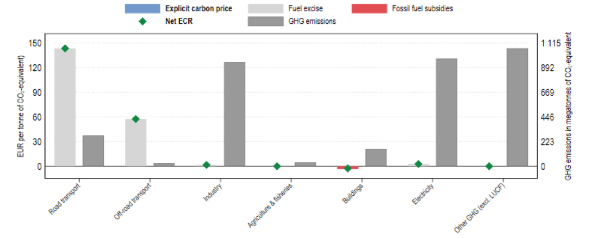

*Figure: Average effective carbon prices (left axis) and GHG emissions (right axis) by sector, 2021. Source: [*OECD report (2022)*](https://www.oecd.org/tax/tax-policy/carbon-pricing-india.pdf)*

Net effective carbon rates are highest in the road transport sector, which accounts for 8% of the country's total GHG emissions. The Net ECR is zero or negative in the buildings, agriculture & fisheries and other GHG emissions sectors. Together,these sectors account for 36.2% of GHG emissions.

India has previously implemented some carbon pricing instruments, albeit on a very limited scale. Until 2017, it had a tax on coal production, the [*coal cess*](https://www.iisd.org/system/files/publications/stories-g20-india-en.pdf), and a [*Perform, Achieve and Trade scheme (PAT)*](https://beeindia.gov.in/sites/default/files/press_releases/Brief%252520Note%252520on%252520PAT%252520Scheme.pdf), which rewards energy-intensive industries that improve their energy efficiency. [*Renewable Energy Certificates*](https://www.waaree.com/blog/what-is-a-renewable-energy-certificate-rec-in-india) are another way for Indian businesses to earn and trade credits based on their [*renewable energy production*](https://www.energymonitor.ai/tech/renewables/weekly-data-why-hydropower-is-key-to-indias-net-zero-plans).

# **Could India Accelerate GDP Growth by Accelerating the Transition to Net Zero?**

As new utility-scale solar and wind power are now cheaper than new coal and – in many cases – cheaper, even, than the variable cost per MWh of coal power, and given that electric vehicles are cheaper to operate than fossil fueled vehicles, a key question poses itself: *Would a push to shift to a fully renewable energy powered, highly electrified economy much earlier than India's current policy target date of “net zero by 2070” be macroeconomically preferable? For example, could India plan to achieve nearly-net-zero by 2050 or even 2045 or 2040, and benefit from doing so in terms of GDP growth and per capita prosperity more than it would from a slower transition of nearly-net-zero by 2070?*

This question can be explored by means of techno-economic modelling scenarios, using estimates of the future cost trajectories of the key energy supply and energy-demanding technologies as well as fossil technologies. Model scenarios can be used to test the viability of various accelerated nearly-net-zero transition pathways.

**A Rapid Transition of India to Nearly 100% Clean Energy Before 2040 is Feasible – And Cheaper Than a Slower Transition**

An intercomparison study of energy system transition pathways by [*Aghahosseini et al. (2023)*](https://www.sciencedirect.com/science/article/pii/S0306261922016580) compares IEA, Teske/DLR, and five distinct LUT transition pathways to 2050 in each of nine major global regions. One of those nine regions is SAARC, the South Asian Association for Regional Cooperation, which includes India, Pakistan, Afghanistan, Bangladesh, Bhutan, Nepal, Sri Lanka, and the Maldives.

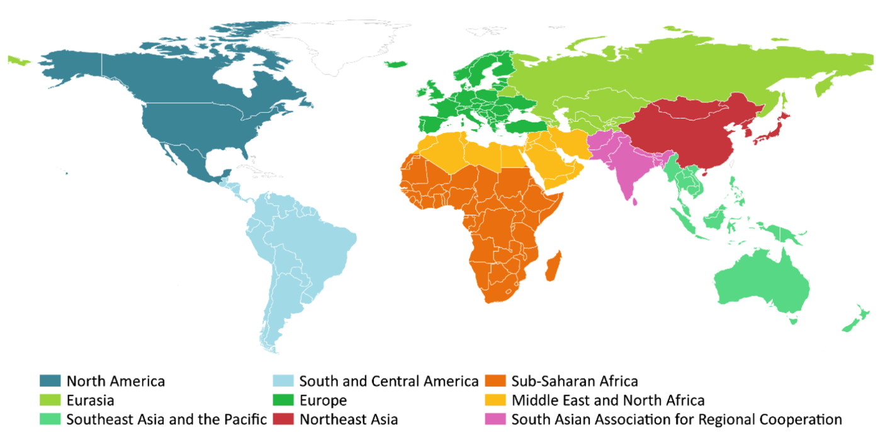

*Figure \_\_\_: The nine global regions studied (from Aghahosseini et al. 2023)*

The IEA pathway included in the intercomparison study includes continued fossil fuels use in 2050; it is the least favorable (least ambitious) in climate impact mitigation terms. The Teske/DLR and two of the LUT pathways both converge on a 100% renewable energy powered future by 2050, with Teske/LUT characterized by a somewhat broader mix of energy supplies than LUT. The five LUT pathways include the two that arrive at zero net CO2 emissions by 2050 and three additional scenarios that arrive at net zero CO2 emissions by 2040, 2035, or 2030. Remarkably, the results show that the 2030 LUT pathway – which is heavily reliant on solar power – is the least-financial-cost, most economically advantageous pathway; the Teske/DLR pathway is about 10% to 20% more expensive, depending on region; and the IEA-STEPS pathway is the most expensive financially, even as it the most damaging in climate terms.

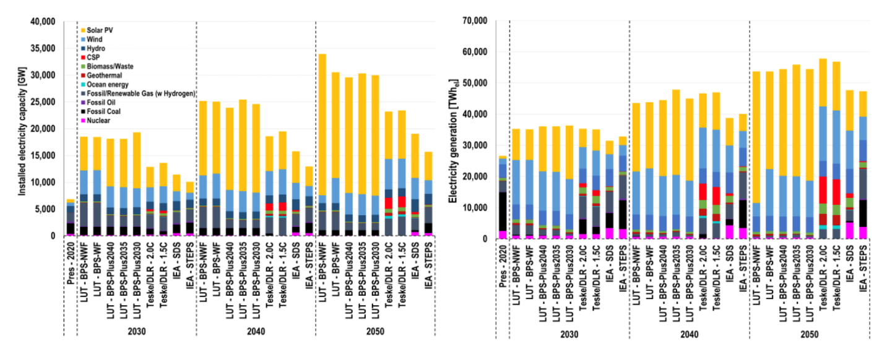

*Figure \_\_: Development of installed power capacity (left) and electricity generation (right) throughout the transition trajectory, for the selected years 2020 (present), 2030, 2040 and 2050. From Aghahosseini et al. (2023)*

Aghahosseini et al. (2023) acknowledge that a transition to net-zero by 2030 is unrealistic in political-economy terms, yet in technical and financial-economic terms, it is feasible in principle. A somewhat slower transition to nearly-net-zero by e.g. 2040 or 2045 would likely be more politically feasible, yet in technical, financial, and economic terms, there is nothing to be gained from a slower transition to net zero.

In a nutshell: now that renewable energy is cheaper than coal- or gas-fired power, and energy storage costs per MWh are dropping rapidly as new energy storage solutions come online and existing solutions are scaled up, the question of how fast to transition to nearly-net-zero is best answered with *“the faster the better”* from a financial and economic as well as climate risk mitigation point-of-view.

With the report from Aghahosseini et al. (2023), as with Saul Griffith’s US-centric study as reported in his book, Electrify, and a [*growing list*](https://ieeexplore.ieee.org/document/9837910) of techno-economic studies by various research groups exploring cost-effective pathways to a 100% clean energy powered future by 2050, we have seen in a global techno-economic scenarios intercomparison study by a leading techno-economic modelling group (based at LUT University in Finland) that a slower global or regional transition away from fossil fuels *provides no macroeconomic benefit;* on the contrary, it results in financial and economic as well as climate-risk disbenefits compared to a faster transition. With wind and solar power and energy storage equipment now cheap and increasingly cheaper than the variable cost per MWh of fossil fuelled power generation options, from a cost-optimizing point of view, the correct answer to the question of *“how fast should we transition to clean energy?”* has become, in essence, *“as fast as we can.”* This is true for all nine major world regions studied.

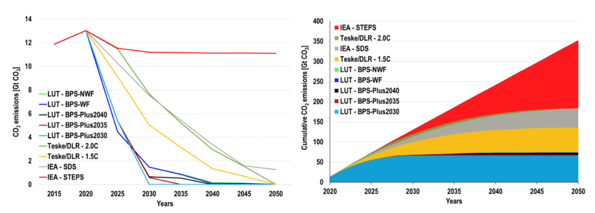

*Figure \_\_: Total annual (left) and cumulative (right) CO2 emissions estimated globally throughout the transition pathways. From Aghahosseini et al. (2023)*

These results indicate that accelerating India’s transition to net-zero or nearly-net-zero much sooner than 2070 would be economically, technologically, and financially feasible and desirable.

Obviously, the Indian government will not and should not embark on a major policy change just based on one study by a premier energy system transition research group. However, the study’s results imply that the Indian government should commission techno-economic modelling studies of rapid transitions to nearly-net-zero for an in-depth assessment of the opportunities, using several different models in a model intercomparison approach to avoid modelling bias. This could lead to an internal review of its 2070 net-zero policy goal.

The purpose of such studies would be to assess whether a much more ambitious transition to net-zero by 2050, 2045, or 2040 would be economically preferable compared to a transition by 2070, and clarify what would be required, in technological infrastructure and financial terms, to implement it over the time-horizon studied: what needs to be built by when, and how much would it cost to build it?

We might ask, for example, what would be necessary to achieve a future in which India’s carbon emissions are down to 10% of the current level by 2045 or by 2040, and in which, at the same time, per capita energy availability is on par with projected per capita energy consumption in 2045 in the European Union, taking the latter as a reasonable standard of high energy abundance and prosperity. What types and amounts of cleantech equipment would need to be built between a starting year (e.g. 2025) and a few distinct target years (e.g. 2045, 2040) for India to achieve energy prosperity parity with Europe? Would the calculated pace of infrastructure build-out be realistically achievable?

Working out the answer to these questions requires us to estimate specific technical quantities that can be understood as core national industrial strategy scenario components, such as: How many renewable energy equipment production Gigafactories like the one being built in Jamnagar, Gujarat, by Reliance Industries, would India need to have in operation by e.g. 2030 to achieve a volume of annual cleantech equipment production to enable the country to self-sufficiently produce enough solar panels, wind turbines, utility-scale battery packs, compressed CO2 energy storage capacity, electrolysis equipment for green hydrogen production, and other cleantech equipment to achieve nearly-net-zero by 2045? Or perhaps even by 2040 or 2035?

This then leads to the next question: What volume of financing would be necessary to build those Gigafactories and ramp up their annual production? How could the effective cost of capital paid by cleantech infrastructure project developers and operators be kept to a minimum, so that the money invested goes more toward producing and installing solar panels and other equipment, and less toward unnecessarily high interest payments, so that the consequent price per MWh of clean energy will be as low as possible?

In light of the climate physics reality that it is not enough merely to add renewable energy capacity – the world must also wind down fossil energy utilization to stop increasing atmospheric CO2 concentrations – we must also ask: What would be a good financial mechanism for converting legacy coal-fired power plants to clean energy production and storage facilities, as per the co-purposing / re-purposing just-transition strategy for the coal sector described in a previous section?

All these questions have been touched on in this text. Output-based rebating, as described in the section immediately above this one, could for example provide a useful answer to the last question on how to finance conversion of legacy coal power sites to hybrid power sites producing primarily renewable energy.

We recommend that further work following up on the findings in this report should include detailed comparative techno-economic transition scenarios, using the best available techno-economic modelling frameworks and tools, along with an exploration of a range of financial mechanism designs that would enable a financially efficient transition to a highly electrified, energy-abundant nearly-net-zero future for India. The purpose is to specify the financial and technological requirements and compare the economic benefits of different build-out trajectories and timelines to such a future.

**Sample Dimensioning Calculations for Core Global Solar and Wind Production Capacity Buildout Requirements**

As an initial sketch of the approximate dimensions of equipment production and concomitant investment required, we offer the following back-of-an-envelope calculations.

Let’s consider an illustrative hypothetical example of a particular global solar and wind power equipment ramp-up trajectory, to get a sense of the overall scale of the endeavor. For this scenario, we will assume that starting in some year soon, preferably not later than 2030, the world will annually produce and install 6,000 GW in solar and wind power per year. If this rate is subsequently held steady, then after ten years, the world will have produced and installed 60,000 GW in cumulative additional solar and wind capacity.

We allow ourselves a simplification enabling a rough estimate of what this amount of solar and wind capacity might deliver in MWh per person per year. Let’s assume that 85% of these additional 60,000 GW, or 51,000 GW, are solar panels, and 15%, or 9,000 GW, are wind turbines. A ten-year timeline, counting forward from the first year in which at least 6,000 GW of solar and wind power capacity are added in that single year, with an assumption that annual production levels are kept steady after that, would entail a yearly build-out rate of 5,100 GW of solar PV and 900 GW of wind turbine capacity.

For comparison, by mid 2022, just [*1,000 GW of solar panels*](https://taiyangnews.info/business/global-cumulative-pv-capacity-exceeds-1-tw/) and [*837 GW of wind power*](https://gwec.net/global-wind-report-2022/) had been *cumulatively* installed globally.

- SolarPower Europe (SPE) expects that a cumulative 2,000 GW of solar panels will have been installed globally by 2025, achieving a doubling of cumulative installed capacity in three and a half years (an average 286 GW per year, but back-loaded to perhaps 400 GW per year PV or more by 2025). [*Bloomberg estimated at the end of 2022 that about 268 GW*](https://pv-magazine-usa.com/2022/12/23/all-i-want-for-christmas-is-400-gw-of-solar-installed-in-2023/) of new solar panel capacity had been installed globally in that one year, in 2022.

- Global total cumulative installed wind power capacity by mid-2022 was about 837 GW, and wind turbines contributed about [*679 TWh in 2021*](https://ourworldindata.org/grapher/annual-change-wind?tab=table). Some 97 GW of wind turbine capacity was added globally in 2021, and about 110 GW in 2022, according to [*WWEA*](https://wwindea.org/information-2/statistics-news/).

These numbers provoke the question whether wind power production can (and should) be quickly expanded by an order of magnitude – a factor of ten – over the current annual production rate, in a rapid supply chain expansion between now and 2030, and then sustained at that expanded rate for ten years.

Likewise, can and should solar PV panel production be likewise expanded, from 268 GW in 2022 to ca. 5,100 GW per year by later this decade, a 19x expansion of annual solar PV panel production compared to 2022? Would making and installing a global cumulative total 60,000 GW of new combined solar and wind power capacity by 2040 be technically and financially both feasible and desirable? We’ll table that question for now and estimate the amount of energy this cumulative quantity of equipment would generate once it is all installed, assuming it is composed of 51,000 GW of solar PV panel and 9,000 GW of wind turbine capacity.

[*On average,*](https://www.freeingenergy.com/math/solar-pv-gwh-per-mw-power-energy-mwh-m147/) across the US, the capacity factor of solar is 24.5%. This means that solar panels will generate 24.5% of their potential output that the panels would produce assuming the sun shone perfectly brightly 24 hours a day.

1 gigawatt (GW) of solar panels might thus generate on average about 2,146 gigawatt hours (GWh) of solar energy per year. 51,000 GW of solar panels could generate about 109.45 million GWh, or 109,000 TWh in a year.

[*On average,*](https://www.usgs.gov/faqs/how-many-homes-can-average-wind-turbine-power) across the US, the capacity factor of wind turbines is 42%. This means that wind turbines will generate 42% of their potential output. 9,000 GW of wind turbines would generate about 301,000 TWh annually if we assume 3,345 GWh is produced annually per 1 GW of installed wind turbine capacity.

Together, a cumulative 51,000 GW of installed solar PV panels plus 9,000 GW of new wind turbines might thus generate about 410,000 TWh per year. Compare this to 45,000 TWh of total global electricity generated anticipated annually in 2050 in a [*2020 US EIA scenario*](https://www.eia.gov/todayinenergy/detail.php?id=42555). The 5,100 GW annual solar PV production plus 900 GW annual wind power production leads to 9x more annual energy production than that.

Let’s assume per capita commercial energy consumption of 120 GJ per person (= 33,3 MWh) by 2050, a number that [*Holechek et al. (2022)*](https://www.mdpi.com/2071-1050/14/8/4792) give as an estimate of the annual amount of commercial energy it is reasonable to expect will be required by people in “developed countries in temperate climates with high vehicle-dependency” (i.e., people in relatively wealthy countries). Let’s assume the whole world adopts an average first-world energy consuming lifestyle in that sense. If there were 10 billion people in 2050, that would mean 333,000 TWh energy consumed by the human population globally in 2050. This is not far off the 410,000 TWh estimated in the scenario outlined above (51,000 GW solar PV and 9,000 GW wind turbine total global installed capacity). With 10 billion people, the latter global cleantech infrastructure scenario would mean supplying an average of 41 MWh per person per year.

These numbers indicate that if everyone is to live a first-world lifestyle of energy prosperity and abundance, based to a large extent on cheap wind and solar power, the world will need to build factories whose total global production capacity corresponds to something on the order of 200x the dimensions of the new complex now [*being built by Reliance Industries*](https://www.ril.com/OurBusinesses/New-Energy.aspx) at Jamnagar in Gujarat state, India. In other words, we would need about 200 Gigafactories of about that size to ramp up to producing 6,000 GW per year of new renewable energy harvesting equipment, mostly in the form of solar panels and wind turbines. The Jamnagar complex is expected to soon be producing some 30 GW of solar panels per year, along with vast quantities of batteries and green hydrogen.

It is not unreasonable to imagine that if one such Gigfactory complex can be built, then so can many of them. It seems plausible that 199 more of them could be built in parallel over the next several years, at various suitable locations around the world. Could a cumulative total of 200 30 GW scale Gigafactory complexes be built and made operational by 2030? What would that entail?

It’s difficult to find convincing reasons why it wouldn’t be feasible to build those 200 Gigafactories. If we assume each Gigafab costs \$5 to \$10 billion to build, the price tag for building the production complexes might be something like \$1,000 to \$2,000 billion (one to two trillion) in total. Institutional asset managers like pension funds collectively managed more than \$103 trillion globally at the end of 2020. \$1 trillion is thus not a prohibitive figure. There is no reason to believe it would be difficult to raise \$1 to 2 trillion to finance the construction of the large regional production complexes that will necessarily be at the heart of massive cleantech equipment supply chains in each one of the world’s roughly 200 major regions, provided that suitable de-risking mechanisms are in place to attract money from institutional investors.

If we assume, for simplicity, that everyone on Earth is allocated the same energy budget per year – e.g. 41 MWh per year per person – then India, at a population of (say) 1.6 billion in a near-future world of 10 billion, after 60,000 GW of solar and wind power capacity has been installed globally, and given a goal of Indian national energy equipment production self-sufficiency, India would account for 16% of installed global clean energy capacity and 16% of total energy consumed each year, or about 9,600 GW of clean energy capacity. To build that amount of capacity in ten years of steady operation of a suite of 30 GW per annum Gigafabs, India would need to build and operate 32 Gigafab complexes in parallel, each of approximately 30 GW per annum production capacity (similar in scale to the one now being built by RIL at Jamnagar, Gujarat).

*Could India build 32 Gigafab complexes by 2030?*

**The Reliance Industries Jamnagar Gigafab Complex as a Prototype and Example to Emulate and Extend**

The Reliance Industries Gigafab in Jamnagar can be seen as a prototype of a new category of factory complex of this kind, a first-mover in an emerging global drive to build a total of about 200 Gigafabs (perhaps 32 of them in India) that each produce on average about 30 GW of renewable energy nameplate capacity annually. It seems clear that the goal of maximizing India’s development co-benefits from rapid scale-up of cheap solar power capacity implies that in India itself, many more Gigafabs should be built – and the sooner the better, since greater abundance of clean energy will directly lead to greater national productivity, prosperity, and quality of life for the people of India.

Barring factors such as supply constraints on special, rare, and necessary minerals within the new cleantech energy infrastructure, it seems plausible that this level of energy prosperity is feasible and can be achieved by building about 200 Jamnagar-scale Gigafab complexes, 32 of them in India, as quickly as possible, and operating them at full capacity for just one decade.

Further Gigafab iterations could add several other types of production lines in addition to solar panels, green hydrogen, and large, durable, and highly efficient battery packs. Indeed, Reliance Industries has already announced additional production lines for their Jamnagar Gigafab since plans for it were first presented in 2021.

Further technical iterations of a Gigafab like that of Reliance could produce still other lines of cleantech equipment in addition to the several types to be produced at Jamnagar. For example, among other things, Gigafabs could be equipped with production lines for wind turbine components, EV recharging station equipment, green ammonia, and indoor food production system components. Gigafabs could also produce components for highly energy-efficient and cost-effective new grid-scale compressed CO2 medium-term energy storage systems such as those recently introduced to the market by an Italian cleantech engineering company, [*Energy Dome*](https://energydome.com).

Mapping out regional potential population and demand patterns and developing proposals to build Gigafab complexes at about 200 well-chosen nodes around the world, in a study aimed at identifying optimal site location options for future Gigafab complexes (each scaled to be at least as big as the one near Gujarat) in India and around the world, could prove to be a key step in organizing a rapidly scalable Indian and global transition to a clean energy economy. We recommend that an inventory and map of at least 200 high-quality possible Gigafab site location options around the world be implemented by the World Bank, or perhaps 400 or 600 good options, with an intention to winnow down the list to the best 200 site locations as Gigafactory complex planning and assessment pre-feasibility studies move forward in consultation with host countries in coming years.

# **Conclusions**

### **1. Enormous Opportunities, Great Ambitions**

India faces enormous opportunities – and challenges – in shifting from a fossil-fueled to a renewable energy powered economy. This shift will bring great gains in air quality, health, trade balance, energy security, and water security. As India builds domestic cleantech equipment and commodity production supply chains, its vast workforce, generous natural endowment of solar and wind energy resources, and global web of trading partners present the country with the rich prospect of building globally leading cleantech and clean commodity export industries.

India is already an emerging-country leader on climate and clean energy policy, with a slew of domestic agencies and programs in progress, and ambitious targets in place – including the 450 GW renewable energy target for 2030, and drives to build an electric vehicle industry and an end-to-end Indian solar PV and green hydrogen supply chain, from silicon ingots to solar panels, batteries, and electrolyzers, which will culminate – eventually – in clean commodity industries producing e.g. non-fossil green ammonia, green steel, and synthetic jet fuel.

### **2. Further Raising Ambitions**

Techno-economic models suggest there is scope for even bigger ambitions and more rapid progress, perhaps upward of 1 TW of RE capacity by 2030 in a drive to comprehensively electrify the Indian economy. In transport, there are ambitious plans for building a domestic EV industry, although many policy and technology elements are still to be put in place, including buildout of a national network of fast-recharging stations.

In addition, an enormous building boom is set to unfold in real estate over the coming decade in India. It is crucial that buildings and neighborhoods are designed and built to be as “green” as possible. Much remains to be done, in policy and finance terms, for this to occur.

### **3. Meeting Challenges with Suitable Policies**

India’s Union government (GoI) is continuing to evolve policy at a robust pace. Efforts are being made to increase the scale of financing available for renewable energy projects and other green infrastructure, e.g., by scaling up the financing volume of IREDA, raising caps on the size of individual bank loans for solar projects, and establishing a new national infrastructure financing bank, NaBFID.

GoI is keenly aware of remaining frictions that continue to slow down investment in renewable energy projects and raise the cost of capital. One key friction is the off-taker counterparty risk faced by RE project developers due to the chronic structural financial problems of many state-owned Discoms. To prevent the difficulties of Discoms from continuing to slow down RE development, two strategies are available, one or both of which could be implemented:

1.  Resolve the structural financial problems of Discoms despite the political-economic difficulty of doing so. Partial or entire privatization of Discoms could be helpful here.

2.  Interpose a reliable, risk-free financial intermediary between Discoms and renewable energy power producers, e.g. a well-financed SPV affiliated with Solar Energy Corporation of India (SECI), which would guarantee timely and full compensation of RE power producers as per their PPAs and would be in a much better position than power generating companies to patiently recover those PPA outlays from Discoms or the state governments that (in most cases) own them.

### **4. Ramping Up Renewables and Storage, Ramping Down Coal**

GoI is embarking on reforms of the power market, away from inflexible PPAs toward an increased role for day-ahead markets and more flexible interpretation of the terms of existing PPAs to allow contracts for power from coal-fired generators to be delivered in dispatchable bundles of fossil and renewable energy power.

Yet although GoI has resolved to rapidly expand RE capacity in India, ultimately climate stabilization requires ramping down fossil fuels combustion, not merely ramping up renewables. Under current policy, GoI continues to plan further increases in coal-fired power generating capacity by 2030, despite the climate and air pollution downsides, despite the lower price per MWh of new renewables compared to new coal power stations and even, in many cases, compared to the variable cost of coal power, and despite the fact that capacity load factors for coal power generators are in long-term decline (they stood at just 55% in 2021, although financing terms for most coal-fired power stations often assume [*capacity load factors of ca. 85%*](https://www.iea.org/reports/projected-costs-of-generating-electricity-2020)) (International Energy Agency & OECD Nuclear Energy Agency, 2020), presenting financial risks that coal power generators will become stranded assets. The core climate and energy policy question arises: can WBG help GoI map out a win-win pathway toward prosperity, energy abundance, and simultaneous withdrawal from coal and other fossil fuels – much earlier than 2070, with key steps and defossilization milestones within the next five to ten years?

In technical terms, ramping down coal must involve ramping up energy storage as well as deploying vast quantities of renewable power generation equipment. India experiences peaks in power demand in the early evening. Until adequate amounts of energy storage are built, coal power plants will be needed to meet demand in the evenings (Parray & Tongia, 2019) – even if, during the day, wind and solar power increasingly displace coal. Unless the rate of electricity demand growth exceeds growth in total power generating capacity, this means coal power plant capacity load factors will likely continue to decline (unless many coal plants are decommissioned, leaving the remainder with higher load factors), reducing their financial viability. The solution could be moving to capacity markets rather than electricity supply markets during an interim period, even as uneconomic coal-power plants are repurposed or decommissioned.

Coal power stations invariably sit at nodal locations in the transmission grid. Just-transition concerns as well as effective re-use of existing assets suggests that coal power companies should be supported in repurposing rather than abandoning sites. For example, coal power sites could be repurposed as deep-geothermal power plants, or as wind-plus-solar-plus-storage sites.

However, technologies, procedures and financial mechanisms for repurposing coal power plants are in their infancy. WBG could help bridge the gap by convening donors to develop several dozen coal-plant repurposing projects world-wide, to explore the solution space and drive repurposing methods along their learning curves. Donor funds such as the Green Climate Fund might be suitable for this purpose.

A way of making coal plant repurposing more gradual, painless, and non-threatening to owners and operators of coal generators could be to refer to it as “co-purposing” rather than “repurposing” – with the idea being that coal power plants would not need to first shut down their coal generating capacity, but instead, would be invited to simply \*add\* energy storage capacity sufficient to enable them to operate as Peaker plants without burning coal (or not burning nearly as much of it) during the evening demand peak, whilst maintaining their coal power generating capacity.

Concessional financing packages could be offered to coal-generator companies to enable them to host energy storage farms on-site on a net financial win basis, at no real financial burden to themselves. This step might remove much of the generator companies’ resistance toward shifting away from coal and toward green energy.

### **5. Carbon Pricing**

At present, apart from a “coal cess” of Rs 400 (ca. \$5.15) per ton, India has no explicit carbon tax. In principle, carbon pricing could play a role in motivating India’s power generating sector to ramp down coal even as it rapidly scales up renewable energy. However, it is a non-trivial matter to design appropriate ways to price carbon that will meet criteria of efficiency, effectiveness, just-transition, and avoidance of regional power supply disruption, especially given the fact that most coal-fired power stations have long-term power purchase agreements (PPAs) with power distribution companies (Discoms) over timeframes of 10 to 25 years guaranteeing supply volumes and prices. These PPAs usually have two separate components: a fixed-cost component and a variable-cost component, each calculated on a cost-plus basis.

India is currently in an early stage of an on-going move toward more use of centralized day-ahead market pricing via the Indian Energy Exchange. Short-term market dispatch will favor renewables over coal power (“economic dispatch”, “merit order effect”). Within that frame, an opportunity exists to expand the role of carbon pricing. However, it must be handled carefully. GoI policy has not shown support for carbon pricing to date.

Market and carbon pricing reforms need to be very carefully tailored to the market structure, and revenues from carbon fees rebated to generators according to electricity output to ensure smooth operation and smooth transition. This “carbon feebate” approach would provide price signals to wholesale power market traders to disfavor coal power and favor non-fossil power, and power project developers to favor renewable projects over coal projects. Yet if the full amount of the carbon fee is rebated entirely to power producers or wholesale power buyers, it becomes an internal market price signal that does not increase end-user electricity prices. As such, it could avoid some of the political-economic resistance to carbon pricing.

In time, carbon pricing could reduce air pollution and carbon emissions massively, as well as reduce coal import costs.

In summary: India does not yet make much use of explicit carbon pricing. Internal wholesale power market carbon feebates, fully refunded to key players in the wholesale market, could, if carefully co-designed with stakeholders for procedural feasibility and emissions-reduction effectiveness, play a vital role in transitioning from a coal-dominated to a wind-and-solar-plus-storage dominated energy economy, including in terms of providing firm capacity for the evening power demand peak.

### **6. Derisking and Price Hedging Instruments**

Because of the chronic difficulties of many Discoms, India is finding ways to reduce counterparty risk in renewable power purchase agreements. In the new market-based dispatch structure, hedging instruments will be key, including those designed to encourage energy storage assets.

Action is needed to create financing structures that enable renewables with storage to be financed by bond sales. IREDA and (beginning Q1 2023, when it is slated to become operational) the new National Bank for Financing Infrastructure and Development, NaBFID, which has been developed with WBG support, could play key roles in this.

Secure PPAs, administered by a central government intermediary agency that guarantees contracted payments to generators, e.g. in the form of Contracts for Difference, will be very useful backing for secure lending to RE project developers, via a risk- free institution like NaBFID that can issue sovereign-backed green bonds. Such structures are ideal for the long-term refinancing of projects after the initial construction phase is over, whereas project development phase lending can be handled by experienced specialized lending windows of commercial banks or expert government agency non-bank financial institutions like IREDA.

Hedging instruments will have to be developed for standardized storage financing packages on a similar model.

### **7. Banking Sector and Capital Markets**

It is essential that the financial system be a facilitator, not a barrier, to the development of at-scale renewables. This means creating financing structures that utilize capital markets fully and make green bonds as low-risk-rated as possible. Guarantees from central government agencies such as NaBFID and IREDA and possibly first loss provisions from multinational financial institutions could be designed for this purpose.

Standardized financing instruments and expert lending windows will have to be developed for energy storage assets on a similar model, dichotomized between (i) project development phase lending and (ii) subsequent refinancing by selling low-interest securitized debt to institutional investors once the asset is developed and fully operational, freeing up balance sheets of banks or IREDA for the next development project.

This is essential, because Indian banks are likely not to have the capacity to keep adding more RE projects to their balance sheets without securitizing and on-selling these debt obligations to institutional investors. Whilst RBI’s priority sector lending scheme should be reformed to ensure adequate financing, so should capital markets be equipped to take on RE project finance for RE projects that have successfully made it past the project development stage and are in commercial operation.

### **8. Round-Up**

All this fits neatly into India's strategic objective to be a global leader in the deployment of green industries. Indeed, proper deployment of energy storage driven by market incentives and standard financing and refinancing instruments would allow existing coal power stations to be efficiently used, and some decommissioned, as well as prevent the need for any more of them to be built, reducing overall risks of stranded assets and unnecessary costs.

The foregoing policy hypotheses are non-prescriptive, and offered in the context of normal WBG practice: i.e., any advice WBG offers to India’s Ministries of Finance, Power, or New and Renewable Energy or their dependent agencies will be offered in the context of GoI and its agencies’ invitations, e.g. via consensus-building co-design workshops.

##  

## **Appendix 1: Scenarios and Results**

## **Priority 1: CPAT ‘micro’ – specific policy ideas and their impact**

A feebate structure for the power sector (with the engineer model) and for the industry sector.

- Model especially the impact on Air Pollution. And do we meet Indian objectives?

- Power Only (so we need the change in power sector emissions)

- Engineer model

- Power sector feebate

#### Methodology

We create scenarios based on CPAT for India. We implement a linear \$50 in 2028 rebated carbon tax only in the power sector, \$100 in 2028 rebated carbon tax only in the power sector (starting at \$0 in 2023). It is then compared in both cases with the same carbon tax, again just in power sector. We observe the impact on:

- Power sector CO2 emissions

- Whole economy CO2 emissions

- Electricity generation mix

- Power sector air pollution

#### Results - Power sector CO2 emissions

For both carbon tax and rebated carbon tax, a \$100 carbon tax in 2028 has more impact on the power sector CO2 emissions in the long run than a \$50 one (reduction of 15% on average). In addition, the \$50 rebated carbon tax implies a small emission reduction in the very long run (2035) while it peaks in 2028, and a \$50 non-rebated one leads to a smooth decrease of the emissions.

However in both cases, the rebated carbon tax is less impactful than a regular carbon tax (5% more emissions).

#### Results - Whole economy CO2 emissions

The results for the whole economy suggests that it exists a minimum level of carbon tax to reverse the trend of the emissions curve. For both \$50 carbon tax in 2028 (rebated and unrebated), the CO2 emissions keep increasing, up by +8% in 2035 compared to 2023.

In the case of the \$100 carbon tax in 2028 (rebated and unrebated), the emissions start declining in 2025, down by -11% in 2035 compared to 2023.

In addition, as for the case of the power sector, the regular carbon tax performs better than the rebated one in the power sector.

#### Results – Electricity generation mix

The Electricity Generation in India increases in all 4 scenarios, up by 50% on average in 2035 relatively to 2023, with an almost linear growth. Both scenarios with a \$50 carbon tax in 2028 lead to higher levels of electricity generation than the two \$100 ones.

In terms of generation mix, the main difference between the two levels of carbon tax is the share of coal: the \$100 carbon tax in 2028 (rebated and unrebated) leads to a smaller share of coal in the mix than a \$5o one.

In addition, a rebated carbon tax in the power sector also leads to a smaller share of coal in the mix. However, a \$100 carbon tax in 2028 is more efficient in reducing the share of coal than a \$50 in 2028 rebated one.

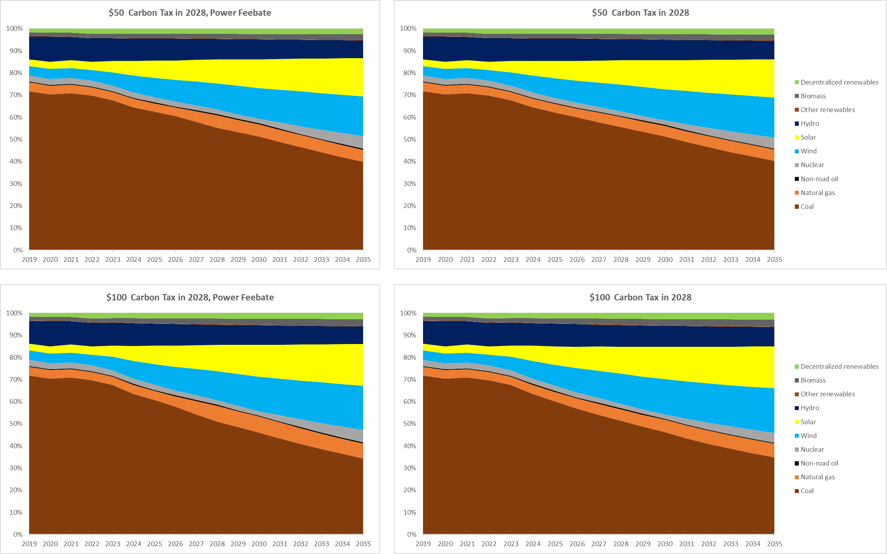

#### Results – Power sector air pollution

We observe the share of the Air Pollution Cost linked to the Indian Power Sector to the total Air Pollution Cost. This share declines in all 4 scenarios, in an almost linear form. As before, the \$100 carbon tax scenarios lead to smaller air pollution costs than the \$50 ones, and the rebated version of the carbon taxes are less efficient than the regular carbon taxes.

### Priority 2: Financial Policy 

### Green Capital Requirement – Wind & Solar

#### Methodology

We use the WACC calculator for Green Capital Requirements targeting the power sector, with 2023 as the start year.

The baseline Capital Adequacy Ratio (CAR) used is 16.5%, with a \$500M green soft loan amount at 3.5% rate. The new CAR is set to 14.5%.

The focus is made on Wind and Solar.

We then compute the new WACC and New Equilibrium Investment.

#### Results - India's Emissions Reduction Under GFSI

##### Wind 

##### Solar

#### Results - Additional Renewable Energy Generation Capacity Under GFSI

##### Wind

##### Solar

#### Results - India's 'Baseline' and 'New' Renewable Energy Total Generation Capacity Under GFSI

##### Wind

##### Solar

#### Results - India's 'Baseline' and 'New' Renewable Energy Annual Investment Under GFSI

##### Wind

##### Solar

### Green capital requirements – Coal, Natural Gas & Oil

#### Methodology

We use the WACC calculator for Green Capital Requirements targeting the power sector, with 2023 as the start year.

The baseline Capital Adequacy Ratio (CAR) used is 16.5%, with a \$500M green soft loan amount at 3.5% rate. The new CAR is set to 18.5%.

The focus is made on Coal, Natural Gas and Oil.

We then compute the new WACC and New Equilibrium Investment.

#### Results - India's Emissions Reduction Under GFSI

##### Coal

##### Natural Gas

##### Oil

#### Results - Additional Renewable Energy Generation Capacity Under GFSI

##### Coal

##### Natural Gas

##### Oil

#### Results - India's 'Baseline' and 'New' Renewable Energy Total Generation Capacity Under GFSI

##### Coal

##### Natural Gas

##### Oil

#### Results - India's 'Baseline' and 'New' Renewable Energy Annual Investment Under GFSI

##### Coal

##### Natural Gas

##### Oil

### Priority 3: CPAT ‘whole economy’- rapid decarbonization scenario

Modelling whole system decarbonization to 2045.

May need some modifications to CPAT.

### Priority 4: Power system cost analytics 

#### Methodology

We want to assess the Variable Costs of the Coal Power Plants in India. Therefore, we use the data from the Global Energy Monitor (https://globalenergymonitor.org/).

We do the preprocessing in R:

\- Filter for India

\- Keep the Heat Rates per plant and per unit (and the capacity for next computations)

\- Make a weighted average of the heat rates regarding the associated capacity

\- Sum the capacities of the units per plant

\- Sum the weighted heat rates

We extract from CPAT:

\- The retail price of coal for the power sector (Mitigation module, prices section)

\- The Variable OPEX of Coal Plants in India

Then we apply the following formula for each plant in the dataset:

*Variable Cost (USD/kWh) = Retail Price of Coal for Power (USD/Btu) \* Heat Rate (Btu/kWh) + Variable OPEX of Coal for Power (USD/kWh*)

#### Results

The average Variable Cost of Coal Power Plants in 96 USD/MWh, with a range of 75 – 112 USD/MWh. The following graphs describes the distribution of the Variable Cost of the Coal Power Plants. For visual clarity reasons we segmented the abscises axis: the share associated with a value (for ex. 85 USD/MWh) represents in fact the share of Coal Power Plants with a Variable Costs located between 85 USD/MWh (included) and 87 USD/MWh (excluded).

We can also point out that a higher share of Coal Power Plants have a Variable Cost between 97 USD/MWh and 112 USD/MWh than between 75 USD/MWh and 95 USD/MWh.

## Appendix 2: Lok Sabha Recommendations

### RE financing gap and Indian Parliament's recommendations for closing it

The Lok Sabha's Standing Committee on Energy in its [*21st Report, January 2022*](https://www.eparlib.nic.in/bitstream/123456789/835464/1/17_Energy_21.pdf) (Lok Sabha Secretariat, 2022)(Part II p. 41), "Financial constraints on renewable energy sector," made the following recommendations on the advice of the Ministry of New and Renewable Energy and leading SOEs including IREDA, PFC Ltd and REC Ltd:

> "The Committee note that India’s power sector has been experiencing transition with increasing penetration of renewable energy in the energy mix and the Country has a target to install 175 GW of renewable energy by 2022 and commitment has been made to increase the renewable energy capacity to 500 GW by 2030. The Committee have been informed by the Ministry that for our long-term commitments, an additional investment of about Rs 17 lakh crore \[Rs 17 trillion, USD \$226 billion as of 5 April 2022\] has been envisaged which would include associated transmission cost and the Country would need an **annual** investment of Rs. 1.5-2 lakh crore \[USD \$20 to \$27 billion\] in renewable energy sector against which our estimated investment for last few years have been in the range of Rs. 75,000 crore \[USD \$10 billion\] only. The Committee finds that there is a huge gap between the required and actual investment, and it will be a gargantuan task to fill this gap which requires an enabling framework to be created by the Government. Keeping in view that the overall debt requirement is large and reducing the cost of financing to the renewable energy developers is important, the Committee recommend that:
>
> i\)  The Ministry should work proactively to make available and explore innovative financing mechanisms and alternative funding avenues like Infrastructure Development Fund (IDF), Infrastructure Investment Trusts (InVITs), Alternate Investment Funds, Green/Masala Bonds, crowd funding etc. for renewable energy sector.
>
> ii\)  The Ministry may explore the possibility of prescribing Renewable Finance Obligation on the lines of Renewable Purchase Obligation for banks and financial institutions in order to make them invest a specific percentage of their investment in renewable energy sector.
>
> iii\) Since Green Banks have emerged as an innovative tool for accelerating clean energy financing globally, the Government should explore setting up of a green bank system which can address the persisting finance related challenges being faced by the renewable energy sector in the Country."

The foregoing is only the **first** of ten numbered recommendations in pp. 40-48 in the 21^st^ Report. The first, second, and tenth recommendations are particularly significant.

The **second** of the ten recommendations suggests increasing the capital base of IREDA, so that it can make more loans, given that it is required by law to maintain a CRAR (capital reserve adequacy ratio) of 15% of its loan book.

The **tenth** of the recommendations in the 21^st^ Report states:

> "10. The Committee note that the RBI has categorized renewable energy sector under priority sector lending for loans up to a limit of Rs. 30 crores. The Ministry has apprised the Committee that the loan up to a limit of Rs. 30 crores is not sufficient as it can take care of small sized renewable energy projects only and there is a need to increase this limit. Further, the Ministry has also submitted that many banks which are not conversant with renewable energy projects, may not offer even this small financial assistance and may cover their priority sector lending obligations with projects from other sectors. In view of the above, the Committee recommend that:
>
> i\)  The limit of loans for renewable energy sector under priority sector lending should be increased. The Ministry should pursue this matter with the Ministry of Finance and the Reserve Bank of India.
>
> ii\) Banks should be sensitized about the importance and benefits of renewable energy so that they do not overlook this sector in their priority sector lending."

## Appendix 3: Relevant Indian Institutions

#### Reserve Bank of India (RBI)

The Reserve Bank of India joined the Central Banks and Supervisors Network for Greening the Financial System (NGFS) in April 2021.

The Reserve Bank has included small renewable energy projects under its Priority Sector Lending (PSL) scheme in 2015, and its guidelines were further revised in 2020 to suit market conditions.

#### Securities and Exchange Board of India ([*SEBI*](https://www.sebi.gov.in/)) (SEBI, 1992) 

SEBI recently revised its sustainability and social responsibility reporting requirements for top-listed companies, starting in 2022-23. Future Environmental, Social and Governance (ESG) research will require authentic data, as well as benchmarks and alerts. In a *[consultation paper](https://www.sebi.gov.in/reports-and-statistics/reports/jan-2022/consultation-paper-on-environmental-social-and-governance-esg-rating-providers-for-securities-markets_55516.html) (SEBI \| Securities and Exchange Board of India, 2022)*, SEBI has proposed (in February 2022) to establish consistent *[regulations for ESG rating providers](https://qz.com/india/2126190/indias-market-regulator-is-looking-to-standardise-green-rating-agencies/), (Kundan Pandey, 2022)*.

#### Insurance Regulatory and Development Authority of India ([*IRDAI*](https://www.irdai.gov.in/)) (IRDAI 2013)

A *[report by Earth Security Group](https://earthsecuritygroup.com/wp-content/uploads/2016/06/ESG.IndiaInsurance.pdf) (Dr. A Didar Singh & Alejandro Litovsky, 2016)*, examines the opportunity for Indian insurance companies to invest in climate-friendly assets. According to IRDAI member TL Alamelu, IRDAI should take steps to *[nudge insurers](https://www.moneycontrol.com/news/business/economy/insurers-must-start-investing-in-green-companies-says-irdai-member-6198211.html),* (Money Control News, 2020)to invest in the green economy. This does not appear to have occurred yet. Could WB initiate a conversation with IRDAI on this point?

#### Pension Fund Regulatory and Development Authority ([*PFRDA*](https://www.pfrda.org.in/)) (PFRDA, 2014) 

The Pension Fund Regulatory and Development Authority (PFRDA) regulates the flagship Atal Pension Yojana (APY) and the National Pension System (NPS). At time of writing, we do not know of specific measures by PFRDA to encourage pension funds to buy green bonds. This may merit exploratory discussion with PFRDA and relevant advisors such as CEEW and Climate Bonds Initiative.

#### Central Electricity Regulatory Commission ([*CERC*](https://cercind.gov.in/)) (CERC, 2003) 

CERC is an agency of the Centre that looks after *[regulating the grid](https://cercind.gov.in/2022/draft_reg/Draft-IEGC-07062022.pdf) (Central Electricity Regulatory Commission New Delhi, 2022)* the operation of power markets. It will be a key player in any changes to how power is produced, bought and sold in India, as India moves more toward flexible PPAs and short-term trading on the [*Indian Electricity Exchange*](https://www.iexindia.com/Aboutus.aspx?id=Gy9kTd80D98%3D&mid=Gy9kTd80D98%3D) (IEX) (Indian Energy Exchange, 2022), a publicly traded company. CERC is also a source of data, e.g. monthly reports on the *[volume of short-term power market transactions](https://cercind.gov.in/2022/market_monitoring/MMC%20Report%20March%202022.pdf) (Central Electricity Regulatory Commission, 2022)* (i.e. contracts of duration less than one year).

#### Climate Change Finance Unit ([*CCFU*](https://dea.gov.in/divisionbranch/climate-change-finance-unit)) (Department of Economic Affairs, 2020a) in Indian Ministry of Finance

This appears to be a small [*analytical unit*](https://dea.gov.in/divisionbranch/about-us) (Department of Economic Affairs, 2020a) that provides input to India’s participation in UNFCCC negotiations on climate finance. A [*June 2020 report*](https://dea.gov.in/sites/default/files/Sub%20Committee%20Report%2019062020.pdf) (Department of Economic Affairs, 2020) entitled “Report of the Sub-Committee for the Assessment of the Financial Requirements for Implementing India’s Nationally Determined Contribution (NDC)” provides some useful information on existing financial instruments for the green transition in India as seen from the vantage point of the Ministry of Finance in mid-2020.

#### Ministry of New and Renewable Energy ([*MNRE*](https://mnre.gov.in/)) (Ministry of New & Renewable Energy, 2017) 

MNRE is a crucial Ministry for advancing India’s green energy transformation. A brief overview of its many activities and programs can be found on the *[relevant Wikipedia page](https://en.wikipedia.org/wiki/Ministry_of_New_and_Renewable_Energy), 2022* (Wikipedia, 2022).

#### Indian Renewable Energy Development Agency ([*IREDA*](https://www.ireda.in/background)) (IREDA, 2022) 

IREDA, an autonomous non-bank financial agency which operates under the aegis of the Ministry of New and Renewable Energy, is among the most important agencies for advancing India’s green energy transformation, and likely a key partner for WBG to engage with as it seeks to assist in that mission. In addition to providing loans and credit guarantees to renewable energy project developers, IREDA plays a key role in administering the Indian government’s drive to spur the development of a full *[solar PV equipment manufacturing supply chain](https://www.livemint.com/industry/energy/ireda-calls-solar-module-manufacturing-bids-under-pli-scheme-11623413952508.html), (Mint, 2021)* in India, to reduce the country’s dependence on imported solar panels (mostly from China). This is an important consideration, given that India will spend the equivalent of hundreds of billions of dollars on solar panels in coming decades. IREDA’s current limitations include the size of its capitalization. An increase is planned; however, it may be worthwhile for WBG to investigate whether it could help IREDA achieve a further, larger increase in its capitalization and hence its ability to make more and larger loans to renewable energy project developers.

#### Power Finance Corporation ([*PFC*](https://pfcindia.com/Home)) (Power Finance Corporation Ltd., 2015) and Rural Electrification Corporation ([*REC*](https://recindia.nic.in/corporate-profile)) (Rural Electrification Corporation, 1969)

[*PFC*](https://en.wikipedia.org/wiki/Power_Finance_Corporation) (Power Finance Corporation Ltd., 2015) and [*REC*](https://en.wikipedia.org/wiki/REC_Limited#Indian_Energy_Exchange_(IEX)) (Wikipedia, 2019) are leading state-owned non-bank financial corporations under the Ministry of Power, which is not to be confused with the separate Ministry of New and Renewable Energy. Both play major roles in financing India’s power generating capacity ([*most of it coal-fired*](https://ieefa.org/articles/ieefa-report-indias-pfc-financing-herd-white-elephants)) (Kashish Shah & Tim Buckley, 2020). However, PFC has recently [*also been financing renewable energy*](https://mercomindia.com/power-finance-euro-denominated-green-bond/) *(Arjun Joshi, 2021)* projects, [*as has REC*](https://www.climatebonds.net/certification/rural-electrification-corporation) (Climate Bonds Initiative, 2017). Engaging with PFC and REC will be important in mapping out an accelerated national transition to green energy. Both have recently significantly [*lowered lending rates*](https://economictimes.indiatimes.com/industry/renewables/pfc-rec-reduce-lending-rates-to-boost-renewable-energy/articleshow/88989701.cms) *(The Economic Times, 2022)* to renewable energy project developers.

#### Solar Energy Corporation of India ([*SECI*](https://www.seci.co.in/about/objectives)) 

SECI is another state-owned limited company under the aegis of the Ministry of New and Renewable Energy (MNRE). SECI has a wide range of operational and technical roles in solar power project development efforts in India. It is also used as an instrument to reduce *[off-taker risk](https://www.climatepolicyinitiative.org/publication/driving-foreign-investment-renewable-energy-india-payment-security-mechanism-address-off-taker-risk/)* (Arsalan Ali Farooquee & Gireesh Shrimali, 2016) to solar plant operators by *[running auctions](https://www.energyeconomicgrowth.org/sites/default/files/2021-09/India%20report%2019%20October%202020.pdf)* (Rustagi & Chadha, 2020) to establish reliable power purchase agreements (late or non-payment by chronically financially distressed power distribution companies, Discoms, which are a key barrier to wider and faster development of solar power plants in India). SECI may be a key player in the search for solutions to the problem of Discom counterparty risk.

#### International Solar Alliance ([*ISA*](https://isolaralliance.org/)) (International Solar Alliance ISA, 2015) 

ISA is an alliance of (to date) 121 signatories and 86 member countries, initiated by Indian PM Modi in November 2015, mostly in the hot sunny regions of the world, who are collaborating to accelerate their build-out of solar power. ISA has since 2016 had an on-going [*cooperation agreement with World Bank*](https://www.worldbank.org/en/news/press-release/2016/06/30/world-bank-india-sign-deal-to-boost-solar-globally) (The World Bank, 2016) via [*ESMAP*](https://documents1.worldbank.org/curated/en/244251575642432241/pdf/A-Sure-Path-to-Sustainable-Solar-Solar-Deployment-Guidelines.pdf) - Energy Sector Management Assistance Program (Bank Sabine Cornieti et al., 2019). Since 2018 there is also SRMI, [*Global Solar Risk Mitigation Initiative*](https://www.worldbank.org/en/news/press-release/2018/12/10/new-initiative-to-mitigate-risk-for-global-solar-scale-up), (The World Bank, 2018) which is a collaboration between [*World Bank*](https://www.worldbank.org/en/topic/energy) (The World Bank, n.d.) (Ref, ESMAP, Agence française de Développement (AFD), and ISA.

#### National Bank for Financing Infrastructure and Development (NaBFID)

India is in process of setting up (with WBG support) a Union government owned [*National Bank for Financing Infrastructure and Development*](https://prsindia.org/billtrack/the-national-bank-for-financing-infrastructure-and-development-bill-2021) (PRS Legislative Research, 2021b), NaBFID. NaBFID will begin operations in the first quarter of 2023. It will be the fifth All India Financial Institution (AIFI) alongside EXIM Bank, NABARD, NHB and SIDBI, regulated and supervised by Reserve Bank of India (RBI) under the RBI Act (1934). NaBFID will issue bonds to raise money from pension and insurance funds, and on-lend to infrastructure projects. It could become a major vehicle for increased mobilization of institutional capital to flow into infrastructure, including green infrastructure.

NaBFID is meant to provide long-term financing for infrastructure or development projects that are beyond the scope or risk profile of commercial banks. It is also intended to serve as a mechanism to deepen India’s domestic bond market. According to [*PRS India*](https://prsindia.org/billtrack/the-national-bank-for-financing-infrastructure-and-development-bill-2021) (PRS Legislative Research, 2021b) (PRS Legislative Research):

> “Central government will prescribe the sectors to be covered under the infrastructure domain.  Developmental objectives include facilitating the development of the market for bonds, loans, and derivatives for infrastructure financing.  Functions of NBFID include: (i) extending loans and advances for infrastructure projects, (ii) taking over or refinancing such existing loans, (iii) attracting investment from private sector investors and institutional investors for infrastructure projects, (iv) organising and facilitating foreign participation in infrastructure projects, (v) facilitating negotiations with various government authorities for dispute resolution in the field of infrastructure financing, and (vi) providing consultancy services in infrastructure financing… NBFID may raise money in the form of loans or otherwise both in Indian rupees and foreign currencies, or secure money by the issue and sale of various financial instruments including bonds and debentures.  NBFID may borrow money from: (i) central government, (ii) Reserve Bank of India (RBI), (iii) scheduled commercial banks, (iii) mutual funds, and (iv) multilateral institutions such as World Bank and Asian Development Bank.”

#### Private Sector: Infrastructure Investment Trusts

[*Infrastructure investment trusts*](https://www.ey.com/en_in/real-estate-hospitality-construction/reits-and-invits-could-drive-the-future-of-indian-infrastructure) which go by the acronym InvITs, and real estate investment trusts, REITs, already play a role in infrastructure development in India, and are set to rapidly expand, according to EY India (Gaurav Karnik, 2021). These kinds of corporate investment structures could be applied to financing and developing “green” infrastructure. Both InvITs for e.g. green energy projects and REITs for green real estate projects will be important. A great many new buildings will be built in India to house its expanding and increasingly prosperous population, and it will be very important for Government of India to pass regulations mandating that these buildings be built to “green” standards. SEBI (Securities and Exchange Board of India) is in charge of applying mandatory regulations to REITs and InvITs and would have a role to play in “greening” the regulations governing REITs and InVITs.

#### Private Sector: Alliance of CEO Climate Action Leaders India

At WEF (World Economic Forum) in Davos on May 2022, a new “*[Alliance of CEO Climate Action Leaders India](https://www.business-standard.com/article/international/wef-forms-indian-ceos-alliance-to-supercharge-race-to-net-zero-122052400070_1.html) (Press Trust of India, 2022)*” was announced as part of WEF’s Climate Action Platform. The members of this group may be worth sounding out as potentially significant allies in the acceleration of India’s green energy transition.

#### Private Sector: Life Insurance Company of India Ltd (LIC)

Founded in 1956, LIC is India’s largest domestic institutional investor. LIC is a largely state-owned company, though it had a [*\$2.7 billion IPO*](https://www.bloomberg.com/news/articles/2022-05-09/foreign-investors-shun-india-s-biggest-ipo-over-market-risks) (Nupur Acharya et al., 2022) in May 2022. It dominates the Indian life insurance market, with a two-thirds market share and about \$500 billion AUM (assets under management). In terms of its energy sector investments (Ref , LIC is heavily invested in Indian coal and oil assets, e.g. an 11% stake in Coal India Ltd, 10.8% in NTPC Ltd, and 10.4% stake in ONGC Ltd as of February 2022 (Srivastava, 2022) . An ESG decision by LIC to “green” its investments – or to push the “brown” companies in its portfolio to move toward greening their technologies and activities – would be welcome, and could set a trend for other institutional investors.

#### Private Sector: Reliance Industries Ltd. ([*RIL*](https://www.ril.com/)) 

In June 2021, Reliance Industries Ltd., among the largest and wealthiest corporate conglomerates in India, announced that it will make a major foray into renewable energy with a projected \$75 billion investment over the next few years. Reliance Industries will set up manufacturing facilities for new and renewable energy equipment, including solar modules, electrolyzers, energy-storage batteries, and fuel cells, in Gujarat. *[According to Business Standard](https://www.business-standard.com/article/international/wef-forms-indian-ceos-alliance-to-supercharge-race-to-net-zero-122052400070_1.html), 2022 (Press Trust of India, 2022)*:

> Under the plan, RIL will set up a Dhirubhai Ambani Green Energy Green Giga Complex, spanning 5,000 acres, in Jamnagar, Gujarat, at Rs 60,000 crore while another Rs 15,000 crore will be invested in value chains, partnerships, and future technologies, including upstream and downstream industries.... It will also set up a platform for renewable energy project finance to source long-term global capital for investment in these sectors.

RIL reportedly intends to cover the complete supply chain for solar PV, from raw silica to silicon ingot production to wafers to finished solar panels, and to eventually achieve an annual production level of ca. 20 GW solar PV by 2026. In this report, we have assumed that RIL’s Gujarat plant will eventually produce 30 GW of solar PV panels annually.

RIL’s investment and the scope of the integrated supply chain vision it set forward could be a pathbreaking and precedent-setting endeavor for India and for other countries and major corporations. The world would require ca. [*100 solar PV Gigafactories of 60 GW annual production capacity each*](https://www.dw.com/en/how-many-solar-panels-do-we-need-to-save-the-climate/a-56020809) (Nils Zimmermann, 2021), or 200 PV Gigafactories of 30 GW annual capacity each running full tilt for 10 years (about 200 Gigafactories of similar size to RIL‘s Jamnagar complex once it reaches full production scale), to supply the world with nearly all its primary energy requirements at a high level of per capita energy abundance. Sample calculations are given in more detail in Chapter 8 of this report.

## Bibliography

Abhijit Mukhopadhyay. (2022). *India’s Current External Debt is Under Control*. ORF. https://www.orfonline.org/expert-speak/indias-current-external-debt-is-under-control/

Akhilesh Magal. (2015). *Financing India’s 100 GW Solar Target*.

Amir Monahar. (2022). *Renewable Energy in India* . Invest India\| National Investment Promotion & Facilitation Agency. https://www.investindia.gov.in/sector/renewable-energy

Amitabh Kant, & Dr Fatih Birol. (2022). *India’s Clean Energy Transition*. The Times of India.

Arjun Dutt, Abhinav Soman, Kanika Chawla, Neha Kumar, Sandeep Bhattacharya, & Prashant Vaze. (2019). *A Guide on Green Bonds for Renewable Energy and Electric Transport*. https://www.ceew.in/sites/default/files/ceew-study-on-greenbonds-for-renewable-energy-and-electric-transport-india-17Jun19.pdf

Arjun Joshi. (2021). *Power Finance Corporation Issues India’s First-Ever Euro-Denominated Green Bond*. Mercom. https://mercomindia.com/power-finance-euro-denominated-green-bond/

Arsalan Ali Farooquee, & Gireesh Shrimali. (2016). *Driving Foreign Investment to Renewable Energy in India: A Payment Security Mechanism to Address Off-Taker Risk* . Climate Policy Initiative. https://www.climatepolicyinitiative.org/publication/driving-foreign-investment-renewable-energy-india-payment-security-mechanism-address-off-taker-risk/

Arunabha Ghosh, Kanika Chawla, Neeraj Kuldeep, Manu Agarwal, Anjali Jaiswal, Sameer Kwatra, Nehmat Kaur, Bhaskar Deol, & Eric Weiner. (2016). *Green Banks in India: Opportunities for Renewable Energy Market*. https://www.ceew.in/publications/greening-indias-financial-market-0

Bank Sabine Cornieti, W., Taobane, N., Thomas Barbat, N., Buchsenschutz, M., Cladière, T., Labaute, L., Rose Fulbright Benoit Denis, N., Delsaux, A., Lapierre, A., Cécile Lafforgue, C., Besrest, R., Abel, B., Verink, B., Stoeva, S., Foundation Kyle Coulam, C., Detweiler, S., Teelucksingh, S., Tubb, A., Wilson, F., … Kennedy, S. (2019). *A Sure Path to Sustainable Solar*. www.worldbank.org

Barbar, M., Mallapagada, D., Alsup, M., & Stoner, R. (2021). Scenarios of Future Indian Electricity Demand Accounting for Space Cooling and Electric Vehicle Adoption. *Scientific Data*, *8*(178), 1–11.

Bhatia, R., & Mazumdar, R. (2022). *India Plans \$3.3 Billion Sovereign Green Bond Issuance*. Bloomberg. https://www.bloomberg.com/news/articles/2022-03-15/india-said-to-plan-3-3-billion-sovereign-green-bond-issuance

Business Standard. (2021). Niti Aayog Pitches for Greater Financial Autonomy for State-Owned Discoms. *Business Standard*. https://www.business-standard.com/article/current-affairs/greater-operational-financial-autonomy-for-state-owned-discoms-niti-aayog-121080301086_1.html

CDP. (2021). *Shaping a Sustainable Financial System*. https://cdn.cdp.net/cdp-production/comfy/cms/files/files/000/005/135/original/Sustainable_financial_system_Country_Profile_India.pdf

CEEW. (2020). *India Could Save Over INR 1 lakh Crore Annually in Crude Oil Imports with Increased EV Penetration*. CEEW The Council. https://www.ceew.in/press-releases/india-could-save-over-inr-1-lakh-crore-annually-crude-oil-imports-increased-ev

Central Electricity Authority. (2022). *Indian Power Sector Performance During August, 2022*. Government of India Ministry of Power. https://cea.nic.in/?lang=en

Central Electricity Regulatory Commission. (2022). *Monthly Report on Short-term Transactions of Electricity in India*. https://cercind.gov.in/2022/market_monitoring/MMC%20Report%20March%202022.pdf

Central Electricity Regulatory Commission New Delhi. (2022). *Central Electricity Regulatory Commission New Delhi*. https://cercind.gov.in/2022/draft_reg/Draft-IEGC-07062022.pdf

CERC. (2003). *Central Electricity Regulatory Commission*. CERC. https://cercind.gov.in/index.html

Climate Action Tracker. (2021). *Overall Rating Highly Insufficient*. CAT. https://climateactiontracker.org/countries/india/

Climate Bonds Initiative. (2017). *Rural Electrification Corporation Limited* . Climate Bonds Initiative. https://www.climatebonds.net/certification/rural-electrification-corporation

Deloitte. (2022). *EU Carbon Border Adjustment Mechanism (CBAM)* . Deloitte. https://www2.deloitte.com/nl/nl/pages/tax/articles/eu-carbon-border-adjustment-mechanism-cbam.html

Department of Economic Affairs. (2020a). *Climate Change Finance Unit*. Department of Economic Affairs. https://dea.gov.in/divisionbranch/climate-change-finance-unit

Department of Economic Affairs. (2020b). *Report of the Sub-Committee for the Assessment of the Financial Requirements for Implementing India’s Nationally Determined Contribution (NDC)*.

Dr. A Didar Singh, & Alejandro Litovsky. (2016). *Indian Insurance and Sustainable Development*. https://earthsecuritygroup.com/wp-content/uploads/2016/06/ESG.IndiaInsurance.pdf

Evans, S. (2021). *Which Countries are Historically Responsible for Climate Change*. Carbon Brief. https://www.carbonbrief.org/analysis-which-countries-are-historically-responsible-for-climate-change/

FitchRatings. (2021). *India Discom Reform Plan to Benefit Power Gencos in Long Term*. FitchRatings. https://www.fitchratings.com/research/infrastructure-project-finance/india-discom-reform-plan-to-benefit-power-gencos-in-long-term-01-02-2021

Gaurav Karnik. (2021). *REITs and InvITs could Drive the Future of Indian Infrastructure*. EY India Real Estate . https://www.ey.com/en_in/real-estate-hospitality-construction/reits-and-invits-could-drive-the-future-of-indian-infrastructure

Gautam Das. (2021). *Solar Parks Get Off to a Good Start in India but Challenges Remain*. PV Magazine. https://www.pv-magazine-india.com/2021/08/09/solar-parks-get-off-to-a-good-start-in-india-but-challenges-remain/

Ghosh, A., Kanika Chawla, Anjali Jaiswal, Sameer Kwarta, Meredith Connolly, Nehmat Kaur, Bhaskar Deol, Anna Mance, Douglas Smis, Sarah Dougherty, Jeff Schub, & Rog Youngs. (2016). *How can Green Bonds Drive Clean Energy Deployment in India*. https://www.ceew.in/publications/greening-indias-financial-market

Government of India. (2008). *National Action Plan*. http://www.nicra-icar.in/nicrarevised/images/Mission%20Documents/National-Action-Plan-on-Climate-Change.pdf

Government of India Ministry of Power. (2022). *Power Sector at a Glance ALL INDIA* . Government of India Ministry of Power. https://powermin.gov.in/en/content/power-sector-glance-all-india

Gulagi, A., Bogdanov, D., & Breyer, C. (2018). The Role of Storage Technologies in Energy Transition Pathways towards Achieving a Fully Sustainable Energy System for India. *Journal of Energy Storage*, *17*, 525–539. https://doi.org/10.1016/J.EST.2017.11.012

Harsha V Rao. (2022). *Why should India Respect Sancity of Power Purchase Agreements (PPA)*. CWWE The Council. https://www.ceew.in/blogs/why-should-india-respect-sanctity-of-power-purchase-agreements-in-renewable-energy

IBEF. (2022). *Power Sector in India*. IBEF. https://www.ibef.org/industry/power-sector-india

IEA. (2021). *India Energy Outlook* . https://www.iea.org/reports/india-energy-outlook-2021

IISD International Institute for Sustainable Development. (2022). *Partial Credit Guarantee*. IISD. https://www.iisd.org/credit-enhancement-instruments/institution/indian-renewable-energy-development-agency/

Indian Energy Exchange. (2022). *Indian Energy Exchange*. Indian Energy Exchange. https://www.iexindia.com/Aboutus.aspx?id=Gy9kTd80D98%3D&mid=Gy9kTd80D98%3D

Indian Renewable Energy Development Agency Limited. (2015). *Indian Renewable Energy Development Agency Limited*. IREDA. https://www.ireda.in/background

Internal Energy Agency. (2021). *Air Quality and Climate Policy Integration in India*.

International Energy Agency, & OECD Nuclear Energy Agency. (2020). *Projected Costs of Generating Electricity*. https://www.iea.org/reports/projected-costs-of-generating-electricity-2020

International Solar Alliance ISA. (2015). *International Solar Alliance*. ISA. https://isolaralliance.org/

IPCC. (2022). *AR6 - Climate Change 2022: Mitigation of Climate Change*. https://www.ipcc.ch/report/sixth-assessment-report-working-group-3/

IQ Air. (2021). *World’s Most Polluted Cities 2017 -2021*. IQAir. https://www.iqair.com/in-en/world-most-polluted-cities

Insurance Regulatory and Development Authority of India. (2013). *IRDAI*. IRDAI . https://www.irdai.gov.in/Defaulthome.aspx?Page=H1

IREDA. (2013). *Loan Portfolio*. https://www.ireda.in/home

IREDA. (2022). *Indian Renewable Energy Development Agency Limited*. IREDA. https://www.ireda.in/background

Jena, L. P., Meattle, C., & Shrimali, G. (2018). *Getting to India’s Renewable Energy Targets: A Business Case for Institutional Investment*.

Kaavya Chandrasekaran. (2017). *Wind Auction Guidelines Set Minimum Plant Size at 25 mw*. The Economic Times. https://economictimes.indiatimes.com/industry/energy/power/wind-auction-guidelines-set-minimum-plant-size-at-25-mw/articleshow/62028203.cms?from=mdr

Karnik, G. (2021). *REITs and InvITs could drive the future of Indian infrastructure*. EY India Real Estate National Leader and Tax Partner. https://www.ey.com/en_in/real-estate-hospitality-construction/reits-and-invits-could-drive-the-future-of-indian-infrastructure

Kashish Shah, & Tim Buckley. (2020). *India’s PFC Financing a Herd of White Elephants*. https://ieefa.org/resources/ieefa-report-indias-pfc-financing-herd-white-elephants

Khanna, N., Purkayastha, D., & Shreyans Jain. (2022). *Landscape of Green Finance in India*. https://www.climatepolicyinitiative.org/wp-content/uploads/2022/08/Landscape-of-Green-Finance-in-India-2022-Full-Report.pdf

Kundan Pandey. (2022). *India’s Market Regulator is Looking to Standardise Green Rating Agencies*. QUARTZ. https://qz.com/india/2126190/indias-market-regulator-is-looking-to-standardise-green-rating-agencies

Lim, S. S., Vos, T., Flaxman, A. D., Danaei, G., Shibuya, K., Adair-Rohani, H., Amann, M., Anderson, H. R., Andrews, K. G., Aryee, M., Atkinson, C., Bacchus, L. J., Bahalim, A. N., Balakrishnan, K., Balmes, J., Barker-Collo, S., Baxter, A., Bell, M. L., Blore, J. D., … Ezzati, M. (2012). A comparative risk assessment of burden of disease and injury attributable to 67 risk factors and risk factor clusters in 21 regions, 1990–2010: a systematic analysis for the Global Burden of Disease Study 2010. *The Lancet*, *380*(9859), 2224–2260. https://doi.org/10.1016/S0140-6736(12)61766-8

Lok Sabha Secretariat, N. D. (2022). *Twenty-First Report of Standing Committee on Energy (17th Lok Sabha) on ‘Financial Constraints in Renewable Energy Sector’’ pertaining to the Ministry of New and Renewable Energy.’* https://www.eparlib.nic.in/bitstream/123456789/835464/1/17_Energy_21.pdf

Magacho, G., Espagne, É., & Godin, A. (2022). Impacts of CBAM on EU trade partners: consequences for developing countries. In *cairn-int.info* (AFD Research Papers). https://www.cairn-int.info/journal-afd-research-papers-2022-238-page-1.htm?WT.tsrc=pdf

Manu Aggarwal, & Arjun Dutt. (2018). *State of the Indian Renewable Energy Sector: Drivers, Risks, and Opportunities*. https://www.ceew.in/sites/default/files/CEEW_State_of_the_Indian_Renewable_Energy_Sector_report_31Oct18.pdf

Mayank Aggarwal. (2022). *Will pushing banks to invest in renewables help India achieve its clean energy targets?* https://scroll.in/article/1019743/will-pushing-banks-to-invest-in-renewables-help-india-achieve-its-clean-energy-targets

Ministry of New & Renewable Energy. (2017). *Ministry of New and Renewable Energy*. https://mnre.gov.in/

Mint. (2021). *IREDA Calls Solar Module Manufacturing Bids Under PLI scheme*. Mint. https://www.livemint.com/industry/energy/ireda-calls-solar-module-manufacturing-bids-under-pli-scheme-11623413952508.html

Mo, J., Zhang, W., Tu, Q., Yuan, J., Duan, H., Fan, Y., Pan, J., Zhang, J., & Meng, Z. (2021). The role of national carbon pricing in phasing out China’s coal power. *IScience*, *24*(6), 102655. https://doi.org/10.1016/j.isci.2021.102655

Money Control News. (2020). Insurers must start investing in green companies, says IRDAI member. *Money Control News*. https://www.moneycontrol.com/news/business/economy/insurers-must-start-investing-in-green-companies-says-irdai-member-6198211.html

Nils Zimmermann. (2021). *How Many Solar Panels Do We Need to Save the Climate*. Deutsche Welle. https://www.dw.com/en/how-many-solar-panels-do-we-need-to-save-the-climate/a-56020809

Nupur Acharya, Ashutosh Joshi, & Julia Fioretti. (2022). *Foreigners Make a Last Minute Dash for India’s Biggest IPO*. Bloomberg. https://www.bloomberg.com/news/articles/2022-05-09/foreign-investors-shun-india-s-biggest-ipo-over-market-risks

Parray, T. M., & Tongia, R. (2019). Understanding India’s Power Capacity. *Brookings Institution India Center*. https://www.brookings.edu/wp-content/uploads/2019/08/Understanding-Indias-Power-Capacity_F.pdf

PFRDA. (2014). *Pension Fund Regulatory and Development Authority (PFRDA)*. PFRDA. https://www.pfrda.org.in/

PIB Delhi. (2015). *Steps to Enhance Domestic Manufacturing of Solar PV cells and Modules*. https://pib.gov.in/PressReleasePage.aspx?PRID=1742795

Powell, L., Sati, A., & Tomar, K. (2021). *Discom reforms in India: Why the inefficiency narrative is inadequate*. ORF. https://www.orfonline.org/expert-speak/discom-reforms-in-india-why-the-inefficiency-narrative-is-inadequate/

Power Finance Corporation Limited. (2015). *UDAY*. Government of India . https://www.uday.gov.in/home.php

Power Finance Corporation Ltd. (2015). *Power Finance Corporation*. Power Finance Corporation Ltd. https://pfcindia.com/Home

Power Line Magazine. (2021). *Creating a Vibrant Market* . Power Line Magazine. https://powerline.net.in/2021/06/08/creating-a-vibrant-market/

Press Trust of India. (2022). WEF forms Indian CEOs’ alliance to supercharge race to “net-zero.” *Business Standard*. https://www.business-standard.com/article/international/wef-forms-indian-ceos-alliance-to-supercharge-race-to-net-zero-122052400070_1.html

PRS Legislative Research. (2021a). The National Bank for Financing Infrastructure and Development (NBFID) Bill. In *PRS Legislative Research*. https://prsindia.org/billtrack/the-national-bank-for-financing-infrastructure-and-development-bill-2021

PRS Legislative Research. (2021b). *The National Bank for Financing Infrastructure and Development (NBFID) Bill*. PRS Legislative Research. https://prsindia.org/billtrack/the-national-bank-for-financing-infrastructure-and-development-bill-2021

PRS Legislative Research. (2021c). *The National Bank for Financing Infrastructure and Development (NBFID) Bill, 2021*. PRS Legislative Research. https://prsindia.org/billtrack/the-national-bank-for-financing-infrastructure-and-development-bill-2021

Renita D’Souza. (2021). *Perspectives on a green taxonomy for India*. ORF Observer Research Foundation. https://www.orfonline.org/expert-speak/perspectives-on-a-green-taxonomy-for-india/

Reserve Bank of India. (2021). *Master Directions- Reserve Bank of India* . https://www.rbi.org.in/Scripts/NotificationUser.aspx?Id=11959&Mode=0#Renewable_Energy

Rural Electrification Corporation. (1969). *REC LTD Corporate Profile*. REC. https://recindia.nic.in/corporate-profile

Rustagi, V., & Chadha, M. (2020). *India Country Report International Experiences in Designing and Implementing Renewable Energy Auctions for sub-Saharan Africa*.

Schwarz, R. (2020). A Multi Actor Approach to Derisking Investments in Indian Solar Energy. *German Watch*.

SEBI \| Securities and Exchange Board of India. (1992). *Securities and Exchange Board of India*. SEBI. https://www.sebi.gov.in/about-sebi.html

SEBI \| Securities and Exchange Board of India. (2022). *Consultation Paper on Environmental, Social and Governance (ESG) Rating Providers for Securities Markets*. https://www.sebi.gov.in/reports-and-statistics/reports/jan-2022/consultation-paper-on-environmental-social-and-governance-esg-rating-providers-for-securities-markets_55516.html

SECI. (2011a). *Solar Energy Corporation of India Limited*. SECI. https://www.seci.co.in/about/introduction

SECI. (2011b). *Solar Energy Corporation of India Limited (SECI)*. SECI. https://www.seci.co.in/about/introduction

Shram Shakti Bhawan, & Rafi Marg. (2021). *Scheme for Flexibility in Generation and Scheduling of Thermal  Power Stations*. https://powermin.gov.in/sites/default/files/Scheme_for_Flexibility_in_Generation_and_Scheduling_of_Thermal_Hydro_Power_Stations_through_bundling_with_Renewable_Energy_and_Storage_Power.pdf

Shrimali, G. (2021). Financial Instruments to Address Renewable Energy Project Risks in India. In *Energies 2021, Vol. 14, Page 6405* (Vol. 14, Issue 19). Multidisciplinary Digital Publishing Institute. https://doi.org/10.3390/EN14196405

Singh Ahluwalia, M., & Patel, U. (2021). *Towards a Strategy for India’s Decarbonisation*.

Statista. (2022). *Government Debt India 1991-2027*. Statista. https://www.statista.com/statistics/1013562/india-government-net-debt/

The Economic Times. (2022). PFC, REC reduce lending rates to boost renewable energy. *The Economic Times*. https://mercomindia.com/power-finance-euro-denominated-green-bond/

The World Bank. (n.d.). *Energy*. The World Bank. Retrieved December 8, 2022, from https://www.worldbank.org/en/topic/energy

The World Bank. (2016). *World Bank, India Sign Deal to Boost Solar Globally*. The World Bank. https://www.worldbank.org/en/news/press-release/2016/06/30/world-bank-india-sign-deal-to-boost-solar-globally

The World Bank. (2018). *New Initiative to Mitigate Risk for Global Solar Scale-up*. The World Bank. https://www.worldbank.org/en/news/press-release/2018/12/10/new-initiative-to-mitigate-risk-for-global-solar-scale-up

Trading Economics. (2021). *India Government Debt to GDP*. Trading Economics. https://tradingeconomics.com/india/government-debt-to-gdp

Trading Economics. (2022). *India Inflation Rate*. Trading Economics . https://tradingeconomics.com/india/inflation-cpi

Verma, A. (2021). *State-Owned and Private Discoms on two Ends of the Spectrum*. Saur Energy International. https://www.saurenergy.com/solar-energy-news/state-owned-and-private-discoms-on-two-ends-of-the-spectrum-icra

Verma, M. K., Mukherjee, V., Kumar Yadav, V., & Ghosh, S. (2020). Indian power distribution sector reforms - A critical review. *Energy Policy*, *144*, 111672. https://doi.org/10.1016/j.enpol.2020.111672

Vibhuti Garg, & Kashish Shah. (2020). *How Renewable Energy Could Reduce Their Financial Distress*.

Wartsila. (2021). *A 100% Renewable Power System Across India by 2050*. https://www.wartsila.com/docs/default-source/power-plants-documents/downloads/white-papers/asia-australia-middle-east/a-100-renewable-power-system-across-india-by-2050-whitepaper.pdf

Wikipedia. (2019). *REC Limited* . Wikipedia. https://en.wikipedia.org/wiki/REC_Limited#Indian_Energy_Exchange\_(IEX)

Wikipedia. (2022). *Ministry of New and Renewable Energy* . Wikipedia. https://en.wikipedia.org/wiki/Ministry_of_New_and_Renewable_Energy

 

[^1]: This appears to be a reduction of around 3-4% in a cumulative 2021- 2030 total relative to an unobserved counterfactual. [*World Resources Institute data suggests India’s total emissions of greenhouse gases were 3.3 billion tonnes in 2018. By 2030, that figure is projected to surpass 4 billion tonnes a year*](https://worldbankgroup-my.sharepoint.com/personal/eespagne_worldbank_org/Documents/20_TtoB/India/World%20Resources%20Institute%20data%20suggests%20India%E2%80%99s%20total%20emissions%20of%20greenhouse%20gases%20were%203.3%20billion%20tonnes%20in%202018.%20By%202030,%20that%20figure%20is%20projected%20to%20surpass%204%20billion%20tonnes%20a%20year.). “Going by the current growth rate, that would mean India could be emitting between 35 and 40 billion tonnes between now and 2030. Cutting 1 billion tonnes would represent a 2.5-3% reduction in \[cumulative\] emissions \[relative to the counterfactual\] over the next nine years.”

[^2]: At the time this report has been drafted, a Task Force on Sustainable Finance have been set up by the Department of Economic Affairs, Ministry of Finance. Defining a sustainable finance roadmap was one the objectives of this Task Force. This Task force comprises regulators of the different compartments of the financial sector: the Reserve Bank of India (RBI), the Securities and Exchanges Board of India (SEBI), the Pension Fund Regulatory and Development Authority (PFRDA) and the Insurance Regulatory and Development Authority of India (IRDAI).

[^3]: The Reserve Bank of India is a member of the Task Force on Climate Risk set up by the Basel Committee on Banking Supervision, NGFS, Financial Stability Board’s Working Group on Climate Risk and Workstream on Climate Disclosures and the International Platform on Sustainable Finance.

[^4]: When this report has been drafted, the Task Force on Sustainable Finance set up by the Ministry of Finance has been tasked to establish a taxonomy of sustainable investments in India.

[^5]: (Bhatia & Mazumdar, 2022)

    On Disclosure Project has a factsheet (CDP, 2021) ([link](https://cdn.cdp.net/cdp-production/comfy/cms/files/files/000/005/135/original/Sustainable_financial_system_Country_Profile_India.pdf)*),* information on sustainable finance in India. A publication by Indian think tank CEEW (Council on Energy, Environment, and Water) in collaboration with US think tank NRDC (Natural Resources Defense Council), “[Greening India’s financial market: How green bonds can drive clean energy deployment](https://www.ceew.in/publications/greening-indias-financial-market),” (Ghosh et al., 2016) , other reports in the [same CEEW series](https://www.ceew.in/publications/greening-indias-financial-market-0) (Arunabha Ghosh et al., 2016) , and a 2019 report by CEEW in collaboration with Climate Bonds Initiative, “[Financing India’s Energy Transition:](https://www.ceew.in/sites/default/files/ceew-study-on-greenbonds-for-renewable-energy-and-electric-transport-india-17Jun19.pdf) (Arjun Dutt et al., 2019) A guide on green bonds for renewable energy and electric transport” each review green finance challenges and opportunities in India. A September 2018 CEEW report, “[State of the Indian Renewable Energy Sector: Drivers, Risks, and Opportunities](https://www.ceew.in/sites/default/files/CEEW_State_of_the_Indian_Renewable_Energy_Sector_report_31Oct18.pdf)

[^6]: Regional Rural Banks (RRBs) were set up as regional based and rural oriented\
    institutions with capital contributed by Government of India, State Government and\
    Sponsor Bank under the Regional Rural Banks Act, 1976. Source: Ministry of Finance

[^7]: India is setting up (with WBG support) a Union-government-owned [*National Bank for Financing Infrastructure and Development*](https://prsindia.org/billtrack/the-national-bank-for-financing-infrastructure-and-development-bill-2021), (PRS Legislative Research, 2021a) NaBFID. NaBFID will begin operations in the first quarter of 2023. It will be the fifth All India Financial Institution (AIFI) alongside EXIM Bank, NABARD, NHB and SIDBI, regulated and supervised by Reserve Bank of India (RBI) under the RBI Act (1934). NaBFID will issue bonds to raise money from pension and insurance funds, and on-lend to infrastructure projects. It could become a major vehicle for the increased mobilization of institutional capital to flow into infrastructure, including green infrastructure, if so directed by the Government of India (GoI).

[^8]: We can cite Bank of Baroda, Bank of India, Bank of Maharashtra, Canara Bank, Central Bank of India, Indian Bank, Indian Overseas bank, Punjab National Bank, Punjab & Sind Bank, Union Bank of India, UCO Bank, State Bank of India. Sources: [*https://financialservices.gov.in/banking-divisions/public-sector-banks*](https://financialservices.gov.in/banking-divisions/public-sector-banks)

[^9]: The most important are India Infrastructure Finance Company Ltd. (IIFCL)

    and Industrial Finance Corporation of India (IFCI).

[^10]: See for example *Gautam Das, 2021* about some of the world's largest [*"solar park" projects*](https://www.pv-magazine-india.com/2021/08/09/solar-parks-get-off-to-a-good-start-in-india-but-challenges-remain/).
