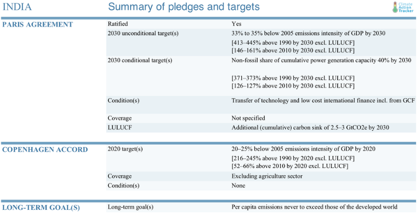
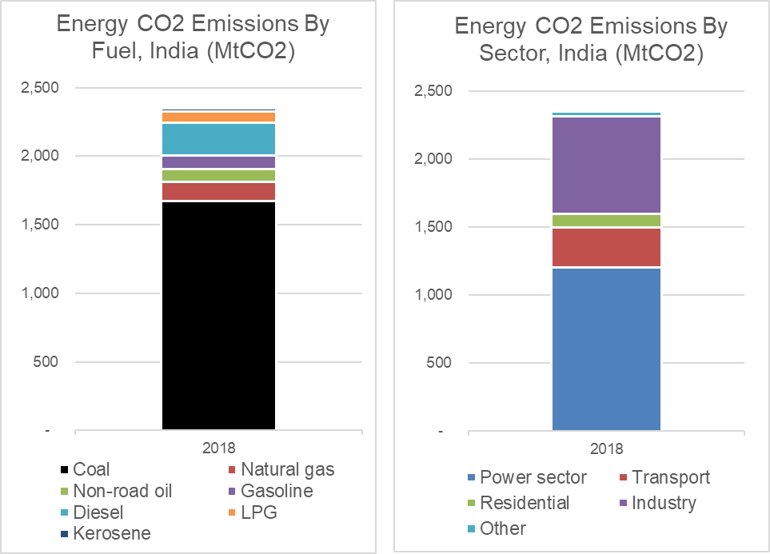
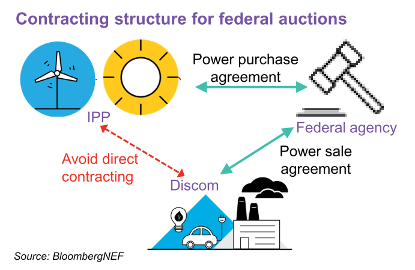

# 

Indian Macro-Fiscal-Financial Climate Policy

From Coal to Renewables: Navigating India's Macro-Fiscal Climate Shift

*Stephen Stretton*

*4th September 2023*

## **Executive Summary**

> The purpose of this note is to describe the current context of Indian national climate policy and to suggest areas of policy reform from a macro, fiscal, and financial perspective. This summary outlines our sectoral scope and the key macro-fiscal-financial policy proposals of the paper.[^1]
>
> We also briefly report the results of using a recently developed World Bank and IMF – developed model, “Climate Policy Assessment Tool” (CPAT) to assess several policy scenarios, including application of a modest carbon tax (rising gradually from \$10 in 2024 to \$50 per ton by 2030), implementation of a feebate scheme to the power sector, and provision of concessional financing (-5% compared to the normal rate of interest, assumed to be 13% in India) for solar and wind power projects, in addition to phase-out of fossil fuel subsidies over the time-span 2024-30. This application of CPAT was carried out in the context of contributing to a World Bank Public Finance Review (PFR) for India.

A key takeaway is that **India already has several market-based climate policies**, **but they need scale.** Existing instruments mimic a carbon tax and an emissions trading system, and there are also implicit carbon incentives in its intergovernmental fiscal transfer systems. The existence of these policies shows that a market-based climate policy in India is possible. Re-using existing policy mechanisms (rather than attempting to introduce new ones) can minimize political economy issues. Beyond reducing carbon, scaling up these approaches could create significant economic opportunities.

We suggest planning the green transition to **reduce the financial burden on state-owned enterprises by retiring uneconomic assets** (e.g. some coal-fired power stations) where there are cost savings in so doing. We explore some financial policy options – for example, we propose a reclassification of prudential lending limits, and enhancement of already advanced derisking schemes through securitization techniques.

India already has several public investment and financial sector tools for decarbonization, often connected to industrial policy. We outline strategies for amending these tools.

**This note focuses on fiscal and financial policies for transitioning from coal to renewables, as power generation accounts for the most significant climate issues and opportunities for the country.**[^2]

Other sectors for which India has climate and development targets include land use, buildings, transport, and industry. For land use, we refer to a recent MTI & ENB book that outlines options for reforming commodity taxes and subsidies that price carbon implicitly and the country’s system of ecological fiscal transfers.[^3] For the buildings sector, we believe residential and small commercial building solar + battery systems could be boosted further by scaling up the pay-as-you-go (PAYG) innovative business model. For the transport sector, there are politically relatively easy ways of pricing carbon (while reducing inequality) with vehicle feebate systems. India has ambitious electric vehicle targets, implying a crucial strategic opportunity for domestic battery manufacture – even more so given that batteries are likely to be needed for power grid stability purposes as well. In industry, we acknowledge the existing Perform-Achieve-Trade (PAT) system to encourage fuel efficiency.

Here we summarize the note’s main development macro-fiscal and financial reform suggestions.

**Ensure the financial sustainability of SOEs by avoiding new investment in coal mining and coal-fired generation, closing inefficient coal plants, and diversifying revenue streams:**[^4]

1.  **Consider retiring underused and inefficient coal power plants** to cut costs and improve the financial viability of state-owned enterprises (SOEs), including distribution companies. Distribution companies are already in poor financial shape. Coal assets are increasingly operating at suboptimal capacity factors given increasing renewable supply and lower than expected power demand. Also, where a coal asset is stranded (e.g., when a possible new solar plant has a lower total cost than the variable cost of existing coal), money can be saved by replacing the coal unit with solar. There are also securitization approaches to reduce the financing cost of any residual unamortized capital cost from the original coal investment.[^5]

2.  **Consider the grid connection of underused and inefficient old coal power stations to be a valuable asset** for new renewables, especially where there is sufficient land for new utility-scale solar plants with storage to be built. Ensure a just transition by offering programs to reskill and retrain workers in declining fossil industries in installing new renewable facilities.

3.  **Diversify the revenue stream of SOEs** such as Indian Railways and Coal India Limited, given their valuable landholdings, and following the example of NTPC, which has diversified into low carbon energy. Consider further increases in rail transport charges for coal to compensate for reductions in shipped coal quantity.

4.  **Reconsider new coal investments given stranded asset risk**. New coal mines are still planned. These assets are at imminent risk of being left stranded. Such investments should be urgently reconsidered. Power demand has been consistently overestimated, and existing coal plants are already underutilized. Consider federal government moratoria on new fossil investment or limits to provide certainty.

5.  **Consider an intermediate national coal consumption target at approximately the level of current domestic coal production**, meaning the phasing out of coal net imports, excluding specialized coals (and a moratorium on new coal investment, as previously suggested). Such strategic targets would create a more joined-up approach and minimize pollution, unnecessary investment, macro-prudential risks, and probable stranded asset costs.

**Prepare to capture the full economic growth benefits of the green transition**

6.  **Facilitate investment from domestic and foreign companies in green sectors** **such as batteries** **and photovoltaics at scale**. Grant land, reduce regulations, enable low-cost credit, and fund university and industrial partnerships to ensure rapid scale-up. Ensure targets for new manufacture match the exponential scale-up of solar power generation.

7.  **Develop vital strategic industries through a catch-up learning-by-doing approach**.[^6] Future renewable dominance and Indian electric vehicles targets imply the need for storage and thus a crucial strategic specialism in battery manufacture and hydrogen.

**Develop and reform existing incentives and implicit carbon pricing schemes**

8.  **Continue to price carbon implicitly** through strategies that circumvent classic political economy issues with carbon pricing, such as India’s Renewable Purchase Obligation (RPO) and Renewable Energy Certificate (REC) trading scheme, as well as the Perform-Achieve-Trade (PAT) energy efficiency scheme. **However, the REC trading system needs reform**.[^7]

9.  **Allow the future overachievement of renewables targets** by combining multiple instruments (e.g., supplement a quantity-based mechanism such as an RPO with a feebate).[^8]

10. **Consider a coal power feebate with increasing renewable allowance to scale up dispatchable renewable with storage**. This would work as a tax on coal inputs rebated per kWh produced in a fully offsetting fashion. However, over time, some portion of the original generation could be replaced by fully dispatchable solar with storage (for SOEs, this increasing percentage would be a mandated target). The tax take and thus the rebates would decline per kWh, dynamically increasing the net marginal variable cost of coal over the decade. The additional payments for solar with storage would compensate for the retired coal plant. Any new coal power plants begun after the implementation date should be made ineligible for future rebates.

11. **Deploy an increasing fraction of the rebates on a capacity rather than generation basis** through capacity auctions (to encourage coal stations to become flexible load-followers and promote battery and pumped storage).

12. Introduce enhanced **vehicle feebates**.

13. Consider reforming or augmenting PAT systems with **industrial feebates** (i.e., carbon tax with output-based-rebate).

14. **Include climate-related criteria in the distribution key for India’s intergovernmental fiscal transfer system.** India’s climate targets are made at the national level but must also be implemented at the state level. To overcome principle-agent problems, India can include climate targets (e.g., the emissions intensity of growth) in the distribution criteria of its intergovernmental fiscal transfer system. This policy has already worked well in providing incentives for reducing land-use emissions and is ripe for scale-up covering the economy overall.

**Consider lending portfolio standards in renewables and strategic green industries**

15. **Increase green portfolio lending requirements** for banks to ensure the rapid solar scale-up is financed at scale.[^9]

16. National electric vehicle targets and renewable storage needs represent a significant opportunity for Indian battery manufacture. **Introduce concessional lines of credit to stimulate early market investment** for high-priority green sectors, funded by the Indian federal government.

**Update macroprudential policy to account for asset stranding risk given rapidly changing economics of solar versus coal and given climate and air pollution considerations**

17. **Reclassify sectoral lending limits** on fossil fuel-based infrastructure and renewables into separate prudential risk categories. Tighten sectoral lending limits in sectors with stranding risk.

18. **Consider punitive capital requirements (“brown penalizing factor”) for any new fossil (mining or power generation) lending**.

**Further de-risk new lending for renewables and storage, and scale up safe green bonds**

19. **Continue and extend the successful approach of centralizing solar contracts with high-rated national renewable corporations** to reduce the payment risk from distribution companies. Back the payment guarantees with credit lines from the central bank to avoid payment delays.

20. **Continue to experiment with diverse types of renewable auctions to ensure grid diversity and stability.**

21. **Consider introducing securitization approaches for the credit risk from IPPs themselves**, meaning setting up SPVs to issue high-rated green bonds securitized by payments from PPAs. The SPVs would then be on-lend (secured by the renewable asset itself) to the IPPs. Collaborate with international financial institutions to ensure a high credit rating.

22. **Ensure eligibility of safe green bonds in central bank collateral frameworks and any asset purchases by central banks.**

23. **Experiment with options to reduce long-term risks and liabilities on Distribution companies and reduce currency risk for international investors.** Reduce long-term financial risks to distribution companies by renewable contracts denominated in USD, reducing the rate per kWh over time. Consider some international bond issuance.

**Fully scale up and promote entrepreneurial approaches to small-scale solar**

24. **Accelerate rooftop solar developments and community solar grids by supporting innovative financial models such as the pay-as-you-go (PAYG) model**. India has a substantial unmet rural and household power requirement that can be met through fin-tech energy-tech innovation.

**With its sheer size, India is a “must-win” country for global decarbonization and an enormous market for green products.** Due to its low-cost renewables and enlightened climate policy environment, India is a climate leader. **Fortunately, the ongoing green transformation is also a huge development opportunity for the country.** Climate policy reform should focus on eliminating roadblocks to this accelerating revolution in power supply and capture the development co-benefits. An accelerated shift to renewable energy can be financially beneficial and avoid exacerbating existing ‘stranded asset’ risks. If well planned, such transitions can reduce the financial stress on power distribution companies while transitioning and diversifying the revenues of SOEs such as current coal miners and Indian Railways. **Appropriate carbon pricing (including feebates and output-based rebating), financial policy, and cleantech infrastructure investment derisking, can accelerate the transition**. India’s energy future is transforming positively before our eyes.

**Introduction**

> According to a recent IEA analysis,[^10] India will account for nearly one‐quarter of global energy demand growth from 2019‐40 under currently stated policies, the most significant energy demand growth of any country. How India gets that energy is crucial for India itself and the world.

[Figure 1](#_Ref79401185) shows India’s international pledges and targets. Under the Paris agreement, the unconditional target is a 33-35% reduction in CO~2~ intensity of GDP from 2005 levels by 2030.[^11]

Coal is dominant in India, producing 70% of CO~2~ emissions in 2018, with coal-fired power plants alone generating half of Indian energy-related CO~2~ emissions.[^12]

Indian coal imports amounted to 240 million metric tons in 2019, about 20% of total coal consumption.[^13] Burning coal contributes to poor air quality in cities, especially in the north of India. Delhi was rated in 2019 as the most polluted capital city in the world.[^14] Most of this pollution is caused by fuel combustion by higher-income groups but predominantly harms lower-income groups.[^15]

The remainder of this paper is structured as follows: following this section where we characterized India’s sectoral CO~2~ emissions, we next outline existing policies and targets and then suggest policies and financing approaches for reducing emissions and capturing development co-benefits.

## 2. Application of World Bank/IMF’s CPAT (Climate Policy Assessment Tool) to explore ‘green growth’ policy scenarios as part of a Public Finance Review for India

In line with a new World Bank priority entitled “Greening PFR” (Public Finance Review), in this section, we report the results of some applications of CPAT to a small number of policy scenarios: (i) application of a carbon tax (\$10 in 2024, rising to \$50 by 2030), with revenues spent 100% on public investment, plus phase-out of fossil fuel subsidies, beginning in 2024 and complete by 2030; (ii) implementation of a feebate scheme in the power sector, plus phase-out of fossil fuel subsidies, and (iii) lower-interest financing of wind and solar power projects (-5% compared to the default rate of 12.5%, i.e. 7.5%), plus phase-out of fossil fuel subsidies. Contrast these to scenarios (iv), which has no carbon tax, no feebate, and no lower-interest financing of wind or solar projects, but does include phase-out of fossil fuel subsidies, and (v), business-as-usual, which has no carbon tax, no feebate, no lower-interest financing of wind or solar projects, and no phase-out of fossil fuel subsidies.

\[CPAT model runs have been done; results require report-formatting; they will be added to this document in this section over coming days. For screenshots of key inputs and outputs of the three scenarios, see below. NJZ – 29-Jun-23\]

Figure 7: Results of CPAT scenario (engineer mode) (iv): business-as-usual (no fossil fuel subsidy phase-out, no carbon tax)

## 3: Existing Policies

We can classify relevant policy areas into targets, pricing policies (including fossil taxation, carbon pricing, fuel price liberalization, and fossil fuel subsidies), and financial and sectoral policies.

### Overall Targets

To achieve India’s emissions goals, the government has set ambitious renewable energy (RE) goals – 175 GW of total installed renewable capacity by 2022 (including 100GW of solar power and 60 GW of wind) and 450GW of installed renewables by 2030.[^16] By 2019, total renewable capacity had reached 86 GW, with a compound annual growth rate of 22% over the last five years.[^17] Capacity additions slowed down in 2020 compared to 2019 because of the Covid epidemic but are expected to bounce back as the economy recovers. India also has ambitious targets for electric vehicle roll-out: there is a target for 30% of all new vehicles to be electric by 2030 and 100% of two-wheelers by 2026.[^18]

### Carbon Pricing Policies

India has several implicit carbon pricing policies already, which could be scaled. It introduced a “coal cess” in 2010 and has progressively raised the rate to 400 INR per tonne of coal (equating to around \$1.5/tonne CO~2~). A cess is a hypothecated tax (meaning the revenues are raised for specific purposes rather than the general budget). The Indian coal cess was originally hypothecated to a clean energy fund. However, the hypothecation was eliminated in 2016, and the coal cess is now used to fund Indian states.[^19] It should be noted that India has a reduced rate of Goods and Services Tax (GST) on coal (and coal transportation), implicitly subsidizing coal in a countervailing fashion.[^20]

India has also introduced implicit forms of carbon pricing through tradeable performance standards, a sectoral and somewhat hidden form of carbon pricing that introduces market incentives into regulations. First, the state mandates state electricity distribution companies and certain private firms to purchase renewables through a Renewable Purchase Obligation (RPO). Renewable Energy Certificates (RECs) certify the generation of a unit of renewable energy. Then, these RECs can be sold on an exchange. If a state distribution company cannot match its RPO, it buys RECs from the exchange,[^21] mimicking an emissions trading system.

India has also demonstrated its capacity to manage the poverty consequences of even more significant energy price increases. It significantly raised Liquid Petroleum Gas (LPG) prices while aiding the poor through the most extensive cash transfer program enacted for energy price reform anywhere.[^22]

### Public investments and financial interventions

Renewables are expected to be a \$600 billion investment opportunity over the next decade.[^23] There have been significant increasing returns to scale in the transition to renewables in India, meaning that achieving scale is critical to combining climate change mitigation with economic prospects.

Indian states have pursued industrial policy to achieve this scale by providing “Solar Parks” with grid connections and available land for new solar PV plants. Research supports the importance of these approaches: “The key results indicate the importance of two policies – the Renewable Purchase Obligations and Solar Parks.”[^24]

This scaling up has dramatically reduced the cost of solar photovoltaic (PV). Bloomberg has rated solar PV as cheaper than coal in India.[^25] In some cases, solar is more affordable than the *variable* costs of existing coal generation assets. There may thus be an opportunity to save money by avoiding new coal investment and replacing even existing coal assets with solar PV.[^26]

While the unit costs of renewable energy are now low, upfront investment costs remain an important hurdle, including because solar projects are usually more decentralized and thus smaller scale than coal power plants. Financial innovation could work here. Tapping large-scale financing sources can therefore be transformational. Derisking is an established technique for reducing the financial costs of renewable investment by reducing the risks to financial investors, driving down interest rates and interest payments. India is among the most sophisticated countries for renewable power auctioning (i.e., offtake agreements/power purchase agreements), further driving down prices.[^27]

Challenges remain, however. Research suggests two main risks: currency risk and credit risk on the power off-taker (as many distribution companies are in poor financial health). Government or intergovernmental guarantees on the off-taker are essential.

The poor creditworthiness of state-owned distribution companies affects their cost of capital. IPPs contracting directly with a federal agency such as Solar Energy Corp of India (SECI) have overcome this payment risk. The IPP has a contract with the SECI, and the SECI contracts with the Distribution companies, thus reducing the payment risk to the IPPs.

Other sophisticated elements include different types of auctions, some of which include storage or diversified renewable mixes.[^28]

India is equally using market instruments to develop nascent green industries, thereby minimizing the “picking winners” problem of industrial policy. An Indian government policy priority is to replace solar PV panel imports with domestic production of PV systems. This summer, it started to use auctions for this purpose. In June, the Indian Renewable Energy Development Agency invited solar module manufacturers to bid for a \$0.6 bn ‘Production Linked Incentive’ to set up solar manufacturing units in India.[^29]

## **Future Macro-fiscal and Financial Policy Priorities**

### Carbon Pricing and Transformative Feebates

The coal cess has already been a successful policy, but it sets a relatively low rate per ton of carbon. Carbon pricing and green incentives are still underused – the IMF suggests this tax gap would be as large as 7% of GDP. While these numbers are uncertain, the coal cess could undoubtedly be increased. But doing so too rapidly might have significant cost consequences for the Indian power sector and heavy industry and could cause a backlash. In other words, increasing the ‘cess’ does not exhaust the possibilities of carbon pricing and green incentives in coal-dependent sectors.

One available option is feebates. One form of a feebate is a carbon tax refunded according to output produced, known as Output-Based-Rebating (OBR). So, for example, an aluminum smelter could be taxed based on fuel inputs and subsidized based on production (of aluminum). The tax and the subsidy would be made at the same time in an offsetting fashion. The aluminum smelter has an incentive to minimize emissions (due to the fuel tax) and maximize production (due to the subsidy). Feebates are thus a political economy strategy for decarbonizing industries without making the average firm in the industry lose and without requiring net public financial support. This policy design equally avoids sharp increases in product prices or international competitiveness losses.

A similar approach could be adopted for coal power stations. The proposal builds on the experience with the coal cess and renewable portfolio standards while limiting the budget implications on consumers, industry, and state-owned enterprises. The IMF has suggested a closely related reform design.[^30]

A ‘rebated carbon tax’ could be introduced in the power generation sector, where the rebate is paid back to coal generators according to the quantity of power produced. Initially, the rebate rate would be based on the efficiency of the plant (i.e., ‘grandfathered’). Based on the average utilization rates of the original coal power stations, generators would be permitted to close down some portion of coal power stations and replace them with solar-with-storage and receive the same subsidy.

### Sectoral Policies with Financial Implications

**Avoiding Further Investments in Coal**

The priority should be to avoid additional investment in coal assets that risk becoming uneconomic (‘stranded’). India is still planning to build new coal power stations, despite the enormous growth in renewables and the falling utilization of coal plants.[^31] Coal India Ltd plans a significant expansion in its coal mining capacity, amounting to additional coal extraction of 192 million tons per year.[^32] The possible construction of coal power stations and additional coal mining is inconsistent with net-zero emissions targets and risks creating further stranded assets (given the rapidly and persistently declining costs of renewables).

**Saving Money on Existing Already-Built Potentially Stranded Investments**

Another priority is to shut down existing inefficient power coal stations.[^33] Many of the older, less efficient plants are owned and run by state-owned enterprises (SOEs). These SOEs could be directed to rationalize their stock, increasing the proportional utilization of high-efficiency plants.

Concerning privately-owned power stations, distribution companies (Distcos) enter into power contracts with Independent Power Producers (IPPs) using a dual tariff structure: one for the variable costs (including fuel) and one for the construction and fixed costs. There are two ways to save money.

First, if the coal variable cost is less than the cost of a new solar plant, the coal power station could be retired. In this case, one needs to replace the variable coal tariff with a new all-in solar tariff. The all-in-solar cost is less than the variable cost of the coal plant, so the Distco’s save money.

Second, there remains the component of the fixed tariff on the retired coal power station that is yet to be paid off. There are advantages in using a securitization procedure to save money on this component too. The remaining unamortized fixed tariff would be converted to a capitalized amount. The state would pay this off by issuing state bonds. The off-taker would then pay the state the payment that had been previously paid to the IPP until the debt is paid off. As the cost of capital for state bonds is typically lower than that demanded by an Independent Power Producer, this procedure saves overall on payments (both the overall payment and the amount per year).[^34]

Solar PV already outcompetes coal in many cases – and the technology is rapidly getting cheaper still. Lending and investment should be redirected to strategically vital new sectors such as battery manufacture.

**Indian Railways Component**

It should also be noted that revenues from transporting coal are a significant component of Indian railway revenues; those revenues cross-subsidize passenger transport.[^35] The transition should consider this dependency. For example, since coal transportation is price-inelastic, coal freight charges could increase as coal volumes fall. Both Coal India Limited and Indian Railways are significant landowners. Coal India Limited or Indian Railways lands could be developed for renewable energy generation, diversifying the companies’ revenue stream. An MIT thesis also shows that reducing the number of coal trains translates into faster passenger trains, raising firm productivity.[^36]

**Unlocking Solar Through Financial Innovation and Infrastructural Means**

Solar power generation exists on multiple levels, and each level could be developed further. Decentralized systems, e.g., micro solar on residential rooftops, can be financed innovatively. For example, pay-as-you-go (PAYG) options for providing a simple solar-based lighting system could be set up (as seen in East Africa). There is plenty of room for further development of mechanisms to encourage decentralized solar PV deployment in India.[^37]

New federal ‘solar parks’ could be introduced to complement state-owned ones, including on land owned by Indian Railways or Coal India Limited. The solar parks would be owned by these SOEs or paying rent to them.

**Capturing Development Opportunities**

The electric transportation and the power sectors’ need for storage presented an excellent opportunity to develop the Indian battery and pumped hydro industries.

Land allocation and low-cost credit can be employed to attract battery or solar companies with early order books. The government could use special solar economic zones to allow the full growth capability of new solar PV and battery industries to manifest.

### Financial Policies

**Derisking and Securitization**

One key aspect of financing renewables is accessing more comprehensive sources of financing.

We mentioned earlier the case where coal assets become stranded, and payments can be reduced by closing coal power stations and paying off the remaining unamortized value of the retired coal power stations through issuing state or federal bonds through a form of securitization.

There is another application of securitization: to reduce the credit risk on the lending of IPPs, through securitizing the PPA cashflows on utility-scale solar photovoltaic plants. AAA-rated special purpose vehicle (SPV) is set up, which issues green bonds or borrows from banks and then on-lends to the IPP in exchange for first preference on the revenues from the PPA. The creditworthiness of the SPV would be guaranteed.

The bonds issued by the Enhanced-SPV would be high-quality and low-risk and would be ideal assets for pension funds and insurance companies. They could also be collateral for repo operations or purchased by central banks. This approach fits the bill in terms of reducing interest payments and creates the possibility of large-scale finance through reduced financial risk. Continue to experiment with diverse types of renewable auctions to ensure grid diversity and stability.

Ensure eligibility of safe green bonds in central bank collateral frameworks and any asset purchases by central banks.

It may be helpful also to experiment with options to reduce long-term risks and liabilities on distribution companies and reduce currency risk for international investors. For example, long-term financial risks to distribution companies could be reduced by experimenting with declining schedules of PPA rate per kWh over time. International investors could be encouraged by contracts and bonds denominated in USD.

**Banking Sector Policies**

While India has shown exceptional growth in renewable energy, especially solar, the expected scale of future growth will increase the challenges on the financial side over the next decade. India introduced a climate change plan in 2008, but without a detailed implementation strategy: “India needs an implementable action plan comprising a strategy and policy framework to enhance the ability of the financial sector to mainstream climate action into decision-making.”[^38]

Financing problems emerge partly due to the tagging of renewable energy as a component of the power sector.[^39] “First, funding for the renewable energy sector is crowded out by the loans disbursed to conventional power projects. \[…\] Second, the Indian banking system, given its exposure to conventional energy sources, is also on the verge of reaching the loan ceiling of 15% \[of the total loan portfolio of a bank that is allowed to be allocated to energy projects\] set by the Reserve Bank of India (RBI 2015). Hence, every additional unit of bank finance becomes increasingly difficult to realize. Third, the structural issues of the power sector, in general, contaminate the financing of renewable energy in the country.”

### Ecological Fiscal Transfer System

One of the political economy barriers constraining the sustainability transition is principle-agent problems between central and subnational governments. Climate targets are set at the national level, but essential implementing decisions must be taken at the subnational level. When states follow suit, they generate an external benefit for the overall emissions of India but can face local transition costs. One instrument for the central government to ensure that subnational governments have the incentives to align with federal policy is Ecological Fiscal Transfers. This policy can be revenue-neutral and has been successfully used by India to combat deforestation but could be used more generally for its broader climate targets.

Indian states receive a significant proportion of their funding from the central government through Intergovernmental Fiscal Transfers. The distribution of these funds between states depends on a formula with many indicators. Since 2014, one of these indicators is forest coverage: when states combat deforestation, they can increase their share of national intergovernmental fiscal transfers. The forest coverage indicator has only a little weight in the overall formula, but that has been enough to improve forest conservation in the country markedly. This also reflects Brazil and Portugal’s experience, which have followed the same system and found that even a small proportion of ecological indicators within their intergovernmental fiscal transfer systems had significant environmental impacts. India could then scale this existing mechanism and include other climate indicators in the formula. That way, climate incentives can improve without needing to raise total public spending.

## **References**

Beaton, Christopher, and Richard Bridle. “Mapping India’s Energy Subsidies,” 2020.

Carpenter, Scott. “India’s Plan To Turn 200 Million Vehicles Electric In Six Years.” Forbes, 2019. https://www.forbes.com/sites/scottcarpenter/2019/12/05/can-india-turn-nearly-200-million-vehicles-electric-in-six-years/?sh=57ae648015db.

Central Electricity Authority. “Report on Optimal Generation Capacity Mix for 2029-30,” no. January (2020). http://cea.nic.in/reports/others/planning/irp/Optimal_generation_mix_report.pdf.

Gadre, Rohit, Atin Jain, Shantanu Jaiswal, Vandana Gombar, and Dario Traum. “India’s Clean Power Revolution,” 2020. https://data.bloomberglp.com/professional/sites/24/2020-06-26-Indias-Clean-Power-Revolution_Final.pdf.

Ganesan, Karthik, and Danwant Narayanaswamy. “Coal Power’s Trilemma: Variable Cost, Efficiency, and Financial Solvency.” New Delhi, 2021. https://www.ceew.in/sites/default/files/CEEW-study-on-thermal-decommissioning-coal-electricity-power-plants.pdf.

Gireesh Shrimali, Sumala Tirumalachetty, and David Nelson. “Falling Short: An Evaluation of the Indian Renewable Certificate Market,” 2012. https://climatepolicyinitiative.org/wp-content/uploads/2012/12/Falling-Short-An-Evaluation-of-the-Indian-Renewable-Certificate-Market.pdf.

Government of India, Ministry of Power. “Discussion Paper on Redesigning the Renewable Energy Certificate (REC) Mechanism,” 2021.

IEA. “India Energy Outlook 2021.” *India Energy Outlook 2021*, 2021. https://doi.org/10.1787/ec2fd78d-en.

International Renewable Energy Agency. “Pay-as-You-Go Models: Innovation Landscape Brief,” 2020. www.irena.org.

Jain, Shreyans. “Financing India’s Green Transition.” Accessed August 8, 2021. https://www.orfonline.org/research/financing-indias-green-transition-60753/.

Kalyanaraman, Anand. “All You Wanted To Know About LPG Pricing Formula.” The Hindu BusinessLine, 2020. https://www.thehindubusinessline.com/opinion/columns/slate/all-you-wanted-to-know-about-lpg-pricing-formula/article30496150.ece.

Kamboj, Puneet, and Rahul Tongia. “Indian Railways and Coal: An Unsustainable Interdependency,” 2018. https://www.brookings.edu/wp-content/uploads/2018/07/Railways-and-coal.pdf.

Kumar, Retna, and Gireesh Shrimali. “Battery Storage Manufacturing in India: A Strategic Perspective,” 2020. https://doi.org/10.1016/j.est.2020.101817.

Mint. “India to Revamp Renewable Energy Certificate Mechanism to Boost Green Economy.” *Mint*, 2021. https://www.livemint.com/industry/energy/india-to-revamp-renewable-energy-certificate-mechanism-to-boost-green-economy-11623135769504.html.

Parry, Ian, Victor Mylonas, and Nate Vernon. “Reforming Energy Policy in India: Assessing the Options,” 2017.

Perti, Alok. “Clean Energy Cess-Tax on Coal.” *Times Network*, 2020. https://www.timesnownews.com/business-economy/industry/article/clean-energy-cess-tax-on-coal/683809.

Sarangi, Gopal K. “Green Energy Finance in India: Challenges and Solutions.” ADBI Working Paper Series, 2018. https://www.adb.org/publications/green-energy-finance-india-challenges-and-solutions.

Shrimali, Gireesh. “Making India’s Power System Clean: Retirement of Expensive Coal Plants.” *Energy Policy* 139, no. May 2019 (2020): 111305. https://doi.org/10.1016/j.enpol.2020.111305.

Shrimali, Gireesh, Navin Agarwal, and Charles Donovan. “Drivers of Solar Deployment in India: A State-Level Econometric Analysis,” 2020. https://doi.org/10.1016/j.rser.2020.110137.

Shrimali, Gireesh, Charith Konda, and Ali Farooquee. “Designing Renewable Energy Auctions for India: Managing Risks to Maximize Deployment and Cost-Effectiveness \*,” 2016. https://doi.org/10.1016/j.renene.2016.05.079.

Sidhu, Gagan, and Saloni Jain. “Rebooting Renewable Energy Certificates for a Balanced Energy Transition in India,” 2021.

Singh, Rajesh Kumar. “Coal India Approves 32 Mining Projects Worth \$6.4 Billion to Boost Output.” Bloomberg. Accessed August 8, 2021. https://www.bloomberg.com/news/articles/2021-03-08/coal-india-approves-32-mining-projects-worth-6-4-billion.

Thomas, Vinod, and Chitranjali Tiwari. “Delhi, the World’s Most Air Polluted Capital Fights Back.” *Brookings*. Accessed August 7, 2021. https://www.brookings.edu/blog/future-development/2020/11/25/delhi-the-worlds-most-air-polluted-capital-fights-back/.

Varadhan, Sudarshan. “India May Build New Coal Plants Due to Low Cost despite Climate Change.” Reuters, 2021. https://www.reuters.com/world/india/exclusive-india-may-build-new-coal-plants-due-low-cost-despite-climate-change-2021-04-18/.

World Bank. “Designing Fiscal Instruments for Sustainable Forests,” 2021.

———. “Toolkits for Policymakers to Green the Financial System,” 2021. https://doi.org/10.1596/35705.

Yadav, Prabhakar, Anthony P. Heynen, and Debajit Palit. “Pay-As-You-Go Financing: A Model for Viable and Widespread Deployment of Solar Home Systems in Rural India.” *Energy for Sustainable Development* 48 (February 1, 2019): 139–53. https://doi.org/10.1016/J.ESD.2018.12.005.

[^1]: This note was prepared by Stephen Stretton. The author gratefully acknowledges guidance from Somik Lall and additional important contributions and comments made by Nepomuk Dunz, Harikumar Gadde, Phillip Hannam, Dirk Heine, and Nils Zimmerman. The views herein are those of the author.

[^2]: Due to (1) the materiality of emissions (coal power stations alone comprise half total Indian energy-related CO2 emissions), (2) the economics of solar PV as an alternative (according to Bloomberg, solar is already cheaper than coal on a levelized basis in India, and in some cases cheaper than the variable cost of coal alone), (3) the costs of importing coal, (4) the severe local damages of burning coal (e.g., to air quality and human health), and (5) the importance of green technologies (particularly batteries) as a growth and development opportunity for India.

[^3]: Chapters 6, 7, 11, and 13 of World Bank, “Designing Fiscal Instruments for Sustainable Forests.”

[^4]:  We want market transition. We need to improve the market. What did they do to sell Air India to Tata. Orderly transition from state to market. Financial health needs to be improved. Not a path dependence. The longer-term view of financial view.

[^5]: Shrimali, “Making India’s Power System Clean: Retirement of Expensive Coal Plants.”

[^6]: Kumar and Shrimali, “Battery Storage Manufacturing in India: A Strategic Perspective.”

[^7]: See e.g., Gireesh Shrimali, Tirumalachetty, and Nelson, “Falling Short: An Evaluation of the Indian Renewable Certificate Market”; Government of India, “Discussion Paper on Redesigning the Renewable Energy Certificate (REC) Mechanism”; Sidhu and Jain, “Rebooting Renewable Energy Certificates for a Balanced Energy Transition in India.”

[^8]: In a different context, the United Kingdom has used a carbon floor price to supplement the EU-ETS price to successfully phase out coal generation in the mid-2010s.

[^9]: See World Bank, “Toolkits for Policymakers to Green the Financial System.”

[^10]: IEA, “India Energy Outlook 2021.”

[^11]: <https://climateactiontracker.org/countries/india/pledges-and-targets/>

[^12]: WB/IMF Carbon Pricing Assessment Tool, 2021. Data for 2018.

[^13]: <https://www.theglobaleconomy.com/India/coal_imports/> Imports constitute around 30% of total consumption (source: CPAT), at \$74/ton (CPAT) costing around \$18bn – compared to the [\$160bn Indian trade deficit in 2019](https://www.statista.com/statistics/256666/the-20-countries-with-the-highest-trade-balance-deficit/).

[^14]: Other contributing factors include brick making kilns, local transportation, biomass burning and local weather factors Thomas and Tiwari, “Delhi, the World’s Most Air Polluted Capital Fights Back.”

[^15]: Rao et al, “Household contributions to and impacts from air pollution in India”.

[^16]: Central Electricity Authority, “Report on Optimal Generation Capacity Mix for 2029-30.”

[^17]: Gadre et al., “India’s Clean Power Revolution.”

    To reach the 175GW target, the CAGR must be 27% from 2019-2022 and then 13% from 2022-30.

[^18]: Carpenter, “India’s Plan To Turn 200 Million Vehicles Electric In Six Years.”

[^19]: Perti, “Clean Energy Cess-Tax on Coal.”

[^20]: Beaton and Bridle, “Mapping India’s Energy Subsidies.”

[^21]: Mint, “India to Revamp Renewable Energy Certificate Mechanism to Boost Green Economy.”

[^22]: Kalyanaraman, “All You Wanted To Know About LPG Pricing Formula.”

[^23]: Gadre et al., “India’s Clean Power Revolution.”

[^24]: Shrimali, Agarwal, and Donovan, “Drivers of Solar Deployment in India: A State-Level Econometric Analysis.”

[^25]: Gadre et al., “India’s Clean Power Revolution.”

[^26]: Shrimali, “Making India’s Power System Clean: Retirement of Expensive Coal Plants.”

[^27]: Shrimali, Konda, and Farooquee, “Designing Renewable Energy Auctions for India: Managing Risks to Maximize Deployment and Cost-Effectiveness \*.”

[^28]: Gadre et al., “India’s Clean Power Revolution.”

[^29]: <https://www.ibef.org/industry/renewable-energy.aspx>

[^30]: Parry, Mylonas, and Vernon, “Reforming Energy Policy in India: Assessing the Options.”

[^31]: Varadhan, “India May Build New Coal Plants Due to Low Cost despite Climate Change.”

[^32]: Singh, “Coal India Approves 32 Mining Projects Worth \$6.4 Billion to Boost Output.”

[^33]: Ganesan and Narayanaswamy, “Coal Power’s Trilemma: Variable Cost, Efficiency, and Financial Solvency.”

[^34]: Shrimali, “Making India’s Power System Clean: Retirement of Expensive Coal Plants.”

[^35]: Kamboj and Tongia, “Indian Railways and Coal: An Unsustainable Interdependency.”

[^36]: Firth, “I’ve Been Waiting on the Railroad: The Effects of Congestion on Firm Production.”

[^37]: Yadav, Heynen, and Palit, “Pay-As-You-Go Financing: A Model for Viable and Widespread Deployment of Solar Home Systems in Rural India”; International Renewable Energy Agency, “Pay-as-You-Go Models: Innovation Landscape Brief.”

[^38]: Jain, “Financing India’s Green Transition.”

[^39]: Sarangi, “Green Energy Finance in India: Challenges and Solutions.”
