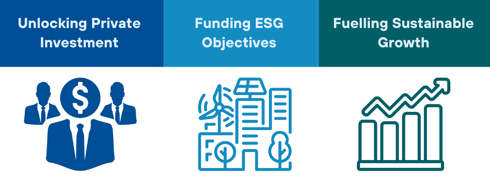
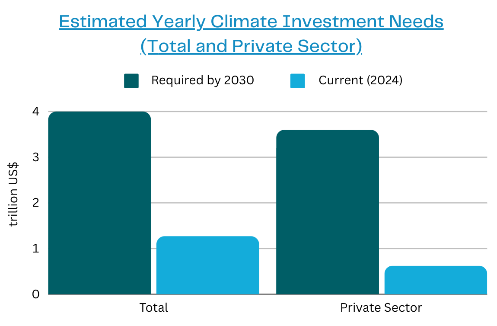
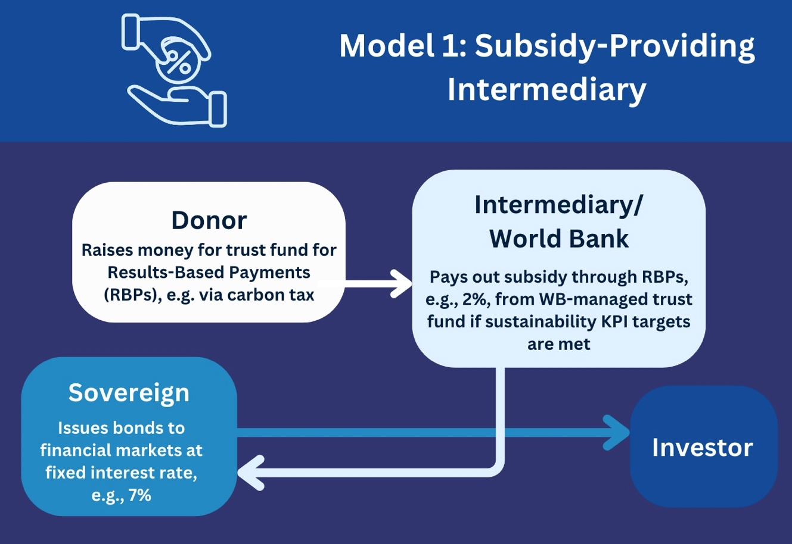
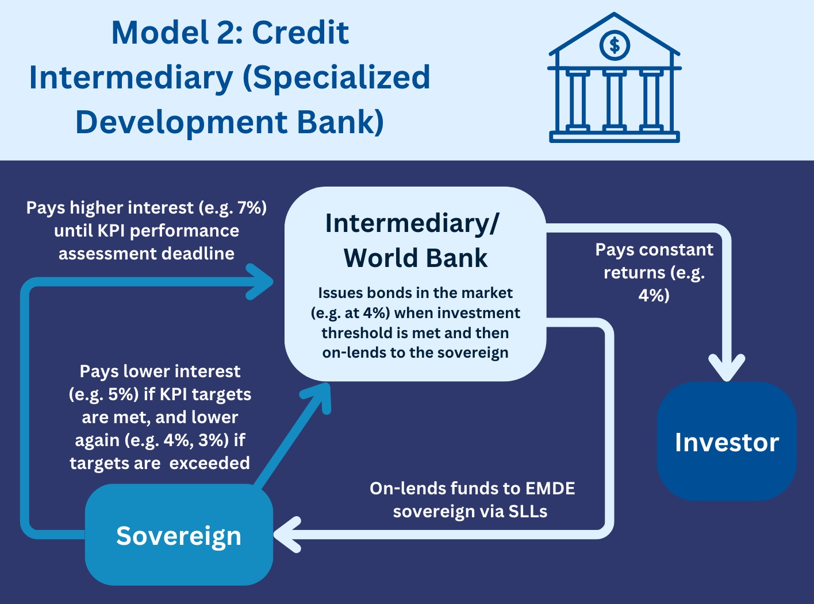

**Overview**

This summary paper presents a novel financial framework—Sustainability-Linked Intermediated Debt Instruments (SLIDIs)—designed to attract private capital to developing countries for sustainable development projects. These instruments aim to address key climate finance needs, particularly for clean infrastructure, climate adaptation, and biodiversity conservation.

The SLIDI proposal seeks to address the limitations of existing sustainability-linked bonds (SLBs), which have seen a decline in issuance since their peak in 2021. Like SLBs, SLIDIs offer reduced interest rates or rebates to borrowers that achieve specific sustainability-linked Key Performance Indicators (KPIs). However, SLIDIs differ by raising funds through bonds with fixed coupon payments, eliminating the rate-of-return uncertainty faced by SLBs.

In this model, interest payment rebates are provided to borrowers upon meeting KPI targets, but these rebates are funded by a third party, such as the World Bank through results-based payments or a donor-supported trust fund. The participation of official development partners enhances the credit profile of the bonds, creating a ‘halo effect’ that reduces the interest rates demanded by private investors. Additionally, guarantee products and co-lending from development partners help lower country risk, further reducing borrowing costs for developing nations.

**Key Issues to Address**

***Reducing Borrowing Costs for EMDEs:*** The private sector will need to supply about 80% of the required climate-related investment in emerging market and developing economies (WB, 2023). Due to currency risk and other country risks, such as geopolitical conflicts, institutional investors are often unwilling to invest in developing countries, or demand punitively high interest rates to do so.

***Incentivising Progress in ESG Areas:*** Developing countries face a dual burden: the need to service existing debt while also financing the costly transition to a low-carbon economy. Incentives are needed to encourage domestic policies that support a wide range of ESG objectives, such as decarbonizing the power sector, improving social equity, and enhancing governance standards, while progressing toward a developed economy.

Sources: [IMF (2023);](https://www.imf.org/en/Blogs/Articles/2023/11/27/world-needs-more-policy-ambition-private-funds-and-innovation-to-meet-climate-goals) [IEA (2023)](https://www.iea.org/reports/scaling-up-private-finance-for-clean-energy-in-emerging-and-developing-economies)

**Stakeholders**

***Participant/ Recipient Countries:*** The primary participants, responsible for implementing sustainability initiatives aligned with pre-defined KPIs. Upon meeting these targets, they receive interest rebates, which help lower their cost of borrowing and incentivize further progress toward sustainability goals.

***World Bank Group/ Third Party Intermediary:*** These entities provide the funding for the interest payment rebates when borrowers meet their sustainability-linked KPIs. Their participation is vital in mitigating return volatility, a key challenge in traditional SLBs, by guaranteeing the rebate mechanism.

***Investors:*** Provide the capital for SLIDIs through bond purchases. Their participation is encouraged by the ‘halo effect’—the enhanced credit profile resulting from the involvement of development partners. This reduces their risk perception and, consequently, the interest rates they demand.

***Official Development Partners:*** By offering co-lending, guarantee products, or results-based payments, these partners help lower the perceived risk of the bonds and improve the creditworthiness of the borrowing nations. Their backing catalyzes greater private sector participation and ensures concessional borrowing costs.

**Implementation**

Direct Bond Issuance by Sovereigns: Developing countries issue fixed-coupon bonds at market rates, with KPIs linked to rebates at maturity. The rebates, funded by third parties, provide financial incentives for meeting sustainability goals.

Trusted Intermediary Model: A development bank or trusted intermediary issues bonds backed by developed-country guarantees, on-lending the funds to developing nations at concessionary rates. By retaining a margin between bond issuance and lending rates, this model remains financially self-sustaining and reduces overall financing costs.

**Conclusions**

A coherent suite of SLIDIs, including fixed-coupon climate bonds to raise money for on-lending via sustainability-linked loans, with partial interest rate refunds paid out to developing-country borrowers on achievement of sustainability-linked KPIs with the support of trusted development agencies, could offer a promising solution to mobilizing private sector capital for the climate agenda. By incorporating clear KPIs, robust de-risking mechanisms, and fixed coupon payments, climate KPI-linked bonds and associated sustainability-linked loans may present a more effective means of mobilizing private capital for environmentally responsible projects in developing countries than current-generation sustainability-linked loans.  

SLIDIs could reduce the cost of capital for sustainable development in developing countries while providing a stable, predictable, de-risked return structure for institutional investors. By aligning sovereign incentives, private investor interests, and development partner goals, SLIDIs could play a pivotal role in closing the enormous climate finance gap in developing regions.  

***Recommendations for Future Research***

Further research should focus on refining the technical details of SLIDIs, exploring additional implementation models, and assessing the long-term impacts of KPI-linked financing on global climate goals. It should include: 

- Developing sophisticated risk management frameworks for SLIDIs. 

&nbsp;

- Exploring hybrid models that combine SLIDIs with other financial instruments. 

&nbsp;

- Evaluating the likely impact of SLIDIs on the cost of capital in developing countries. 

&nbsp;

- Evaluating the potential for SLIDIs to drive policy reform and systemic change. 

&nbsp;

- Exploring the role of technology in monitoring and verifying KPI achievements. 

&nbsp;

- Assessing the scalability of SLIDIs in different regional and economic contexts, identifying factors that influence their success. 
