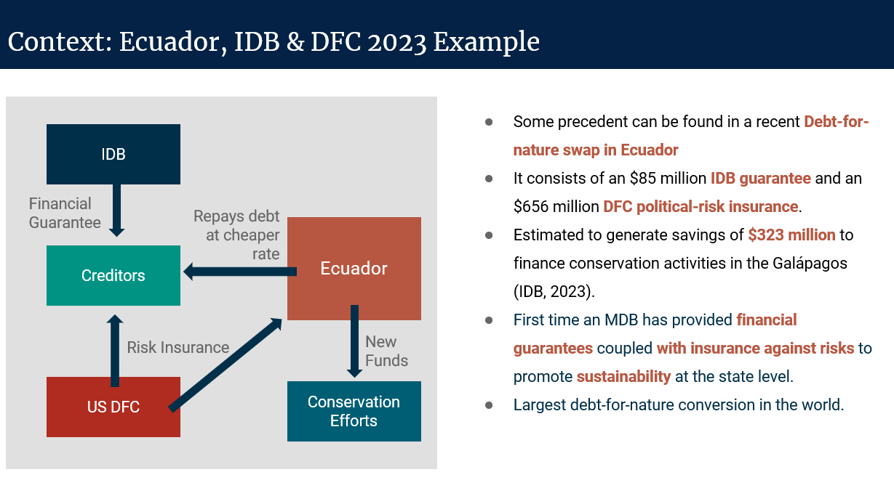
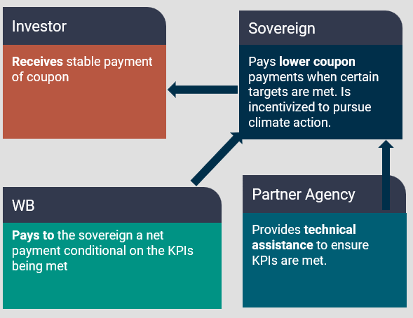
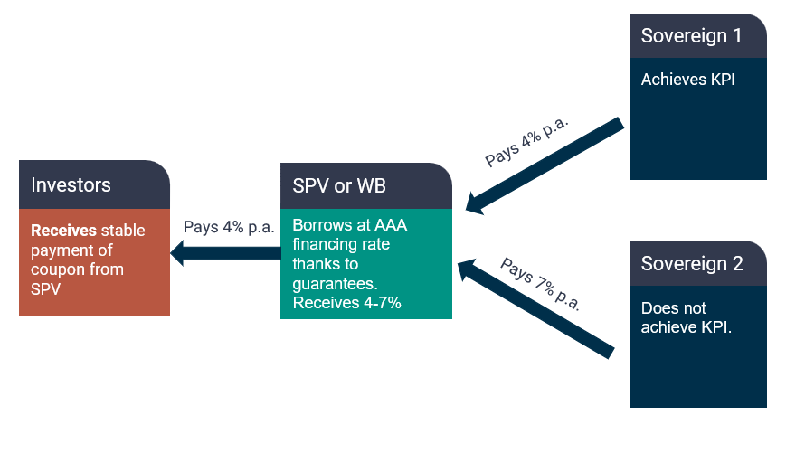

Marcello Estevão[^1]

Stephen Stretton[^2]

Nils Zimmermann[^3]

## Abstract

**We offer a scalable solution to the twin challenges of reducing developing countries’ cost of borrowing whilst incentivizing their governments to achieve progress in agreed environmental, social, and governance dimensions**. We propose a set of "sustainability-linked intermediated debt instruments" (SLIDIs; informally ‘KPI-linked lending’) that could overcome the limitations of existing sustainability-linked bonds (SLBs), limitations which have caused a slowdown in annual SLB issuance since a peak in 2021. We describe two approaches to construct SLIDIs. The first involves a sovereign bond that has in addition, results-based payments from the World Bank or other fund to the government that issued the bond, on achievement of certain outcomes (KPIs).

**In the other approach recommended, an intermediary sustainable lending fund backed by a voluntary coalition of highly developed country governments issues bonds at a fixed coupon rate; because the bonds are de-risked, their coupon rates are low.** The money raised is then on-lent to developing-country sovereigns at a higher interest rate, via sustainability-linked loans (SLLs). If after several years, the developing country borrower has met specific environmental, social, and governance (ESG) goals, as measured via key performance indicators (KPIs) specified in their SLL terms, then a significant portion of the interest that has been paid by the borrower since the beginning of the loan term is refunded to the borrower.

**Developing countries’ efforts to meet the KPIs can be assisted by development agencies, which also monitor and verify performance.** Development agencies and/or developed country partners can also offer guarantee products that would reduce country-issuer risk, and thus the coupon payments needed to attract private investors. The net effect is to incentivize and reward developing countries for progress on agreed ESG goals.

**\**

## Summary

**This paper introduces innovative financial mechanisms designed to attract private sector capital to developing countries for sustainable development purposes, including (but not limited to) the climate adaptation, biodiversity conservation, and clean infrastructure development agendas.** By involving trusted intermediaries in the process of arranging, de-risking, issuing, and monitoring sustainability-linked debt, our proposed system of “sustainability-linked intermediated debt instruments” (SLIDIs) addresses critical shortcomings of existing sustainability-linked bonds (SLBs) by offering more effective structures for incentivizing sustainable policies and mobilizing investments, particularly in developing countries where climate finance is most urgently needed.

**The clean infrastructure development investment gap in developing countries that must be closed for the world to achieve net-zero emissions by mid-century has been estimated by the IEA at \$2 trillion a year; for the world as a whole, about \$5 trillion a year will have to be invested beginning in 2030**. Due to currency risk and other country risks, institutional investors are often unwilling to invest in developing countries, or demand punitively high interest rates to do so.

**Like SLBs, SLIDIs provide reduced interest rates or interest payment rebates to governments (or other borrowing entities) that achieve targets defined by agreed sustainability-linked Key Performance Indicators (KPIs).** However, unlike SLBs, our proposed SLIDI system would raise money by issuing bonds with fixed coupon payments to investors (e.g., industrialized-world pension funds or other institutional investors), avoiding the rate-of-return uncertainty posed by existing SLBs. A rebate would be paid to borrowers that achieve KPI targets – but that rebate would not be paid by bond investors. Guarantee products (including co-lending of the private sector and the development partner) would further decrease country risk and the cost of borrowing by developing countries.

**Within that frame, we outline two alternative implementation models for sustainable development financing featuring KPI-linked variable interest rates**. In the first model, developing country sovereigns directly issue fixed-coupon KPI-linked bonds at normal market rates; institutional investors that buy these are not exposed to any step-ups or step-downs. Interest payment rebates are paid out when the KPI-linked bond matures if the KPIs have been met, but the rebates aren’t paid by bondholders.

**The rebate payments are made by a third party. This could be the World Bank Results-Based-Payment, or a donor-country-supported trust fund managed by a development bank to reward developing-country bond issuers who have performed well according to agreed KPIs.** The involvement of official development partners in the operation can create a ‘halo effect,’ decreasing the coupon payments required by the private sector. Different degrees of official development partner involvement in the operation would alter the extent of this effect.

**To achieve sufficiently strong incentives for good KPI performance and a high volume of SLIDI lending, the aggregate financial subsidies offered by the trust fund (and hence the donations collected from developed-country sovereign donors) would need to be very substantial, e.g., at least tens of billions of dollars per year if the overall portfolio is to reach \$2 trillion per year**. A possible original source of money for these rebates could be levies on bulk fossil fuel sales in participating wealthy donor countries. In this model, it could be helpful if a trust fund managed by the World Bank or another multilateral development finance institution makes a practice of buying a small fraction, e.g., 1%, of each such bond issuance, provided the bond issuance has been accompanied and endorsed by trusted development-agency partners, to signal to issuing sovereigns that these bonds are to be considered as senior debt and to reassure bond markets, thus producing a strong ‘halo effect’.

**The other SLIDI implementation model proposes a donor-country-derisked ‘trusted intermediary’ (which could also potentially be managed by the World Bank or another development bank) to raise money from institutional investors at low interest rates by issuing fixed-coupon climate bonds.** The bonds issued by the trusted intermediary fund are de-risked via co-guarantees from a coalition of willing developed-country sovereigns. The intermediary fund subsequently on-lends the money it has raised to public or private borrowers in developing countries at somewhat higher interest rates. This on-lending takes the form of sustainability-linked loans (SLLs) whose nominal rate is fixed over the loan term. Trusted development-agency partners, e.g., Germany’s GiZ or France’s AFD, will monitor progress, provide ongoing technical advice, and evaluate whether borrowers meet or exceed specified KPIs. If the assessment performed at the bond maturity date (or, for long-duration bonds, at predefined milestone years over the course of the bond’s term) shows KPIs have been met, the borrower is rewarded by a partial refund of interest previously paid.

**The trusted-intermediary-fund model enables a significant spread between the fund’s cost of money and the interest rates on loans charged by that fund to developing-country borrowers. With this approach, the intermediary fund should be financially self-sustaining.** Developed-country sovereigns would co-guarantee the fund’s bond issuances and thus be at risk of absorbing losses, but thanks to the spread, barring miscalculations or global crises, the portfolio of loans made by the fund should turn a modest profit. The fund would essentially be a specialized development bank. The fund’s ability to issue bonds with low coupon rates (because the bonds are co-guaranteed by wealthy developed-country sovereigns) should enable a lower overall cost of finance through this approach compared to a model in which bonds are issued directly by developing-country sovereigns.

**This paper shows how sustainability-linked intermediated debt instruments can align the interests of sovereigns, private investors, and development partners toward an acceleration of the global transition to a net-zero emissions economy and improved performance on biodiversity conservation, as well as other sustainable development indicators identified in the UN Sustainable Development Goals (SDGs).** We note some of the challenges hindering private sector investment in sustainable development initiatives in developing countries, such as the ‘tragedy of the commons,’ geopolitical conflicts, and high interest rates driven by perceived country risk. We discuss the prospective roles of development agency partners like Germany’s GiZ or France’s AFD in making the SLIDI system work in practical terms – by structuring climate and clean development financing via sustainability-linked intermediated debt instruments; monitoring and evaluating client country KPIs; and assisting developing-country partners with the technical steps necessary for success in meeting agreed KPIs. KPI-linked lending via SLIDIs is presented as a potentially scalable and practical solution for bridging the enormous investment gap in global climate mitigation and adaptation finance, especially in developing countries.

## Introduction

**The transition to a global net-zero emissions (NZE) economy by 2050 requires substantial investment, particularly in developing countries, where the capital required for decarbonization is very large and access to affordable finance is limited.** Achieving this transition is both a technical and financial challenge, with the need for approximately \$5 trillion a year in global investment by 2030, of which \$2 trillion in developing countries alone (IEA, 2023; IMF, 2023), a fivefold increase compared to 2020. This requires policy action at a national level, including policies that enable and provide investable projects at scale. Present financing mechanisms do not sufficiently encourage such policy actions.

**Current financing mechanisms are inadequate, relying heavily on multilateral development bank (MDB) finance but failing to provide sufficient incentives for countries to implement necessary policy changes.** A World Bank analysis (World Bank, 2023) projects that growth in public investment will be limited, and that the private sector will need to supply about 80 percent of the required climate-related investment in emerging market and developing economies; this share rises to 90 percent when China is excluded. However, private investors that control most of the available investible funds, such as pension funds or private equity funds in developed countries, are generally disinclined to invest in developing countries, due to perceived country risks and foreign exchange risks (Chowdhury & Tadjoeddin, 2022).

**The gap between the level of financing needed and what is available underscores the urgency for innovative financial instruments that can mobilize private sector capital at scale and support green development policies.** Meanwhile, hundreds of billions of dollars in direct financial subsidies for fossil fuels and harmful agricultural practices and trillions in implicit subsidies (amounts calculated when the harm done is accounted for) continue to exacerbate the problem (World Bank, June 2023).

**The existing flow of private and public climate finance from developed to developing countries is insufficient in scale and efficacy in incentivizing provision of global public goods.** Despite international commitments such as the \$100 billion annual pledge (an amount far below what is needed in aggregate) made in Copenhagen in 2009 at UNFCCC’s 15^th^ Conference of the Parties (CoP15) and reaffirmed in Paris in 2015 at CoP21, the actual flow of climate-related funds from developed into developing countries, tracked by the OECD, has been far lower (an estimated \$34 bn in 2022) (OECD, 2024a).

**There is a pressing need for financial instruments that can bridge this gap, mobilize additional resources, and incentivize and enable the implementation of effective climate policies.** Developing countries are often the most vulnerable to climate change but least able to finance the necessary infrastructure transitions. (Bhattacharya et al., 2023.)

**In recent years, since the late 2010s, sustainability-linked bonds, SLBs, have emerged as a new instrument intended to help close the climate and clean development financing gap** (Giráldez and Fontana, 2022). SLBs differ from other green, social, and sustainability (GSS) bonds in that most GSS bonds are use-of-proceeds (UoP) debt instruments that are tied to specific projects. In contrast, SLBs specify sustainability-related targets and key performance indicators (KPIs) for the issuing entity (corporation or sovereign) without reference to a specific project, so they are not considered to be use-of-proceeds instruments (OECD, 2024b). To date, only a handful of SLBs have been issued by sovereigns; most issuances have been by industrialized-world corporations, though interest is growing in the potential for sovereign sustainability-linked bond issuances ([Maplecroft, 2024](https://www.maplecroft.com/products-and-solutions/sustainable-finance/insights/the-rise-of-the-sovereign-sustainability-linked-bond/)).

**This paper is concerned with sustainability-linked finance for developing-country sovereigns.** However, the same instruments we describe here (SLIDIs) could be adapted for bonds issued by sub-national governments such as municipalities or individual provinces or states within federations, or in modified form, also by state-owned or private corporations in developing countries.

**After early excitement, interest in SLBs has been waning over the past three years.** After a peak in issuance volumes in 2021, the global market for SLBs (most of them issued by corporations) shrank for two consecutive years, 2022 and 2023, and again during the first half of 2024 (Ahren, 2024). SLBs have struggled to gain traction due to their complexity, concerns around potential greenwashing, and the unattractive nature of unpredictable variable coupon payments (Lefournier, 2023). It appears that both issuers and investors are increasingly assessing that the current generation of SLBs is not fit-for-purpose.

**The sustainability-linked intermediated debt instruments (SLIDIs) we present here comprise a suite of financial instruments specifically designed to attract private institutional investors to the sustainable development agenda in emerging and developing economies.** Unlike existing SLBs, which link interest rates paid to bondholders to the issuer’s achievement of sustainability targets by means of variable coupon payments (‘step-ups’ or ‘step-downs’) depending on whether or not target KPIs were met, SLIDI-type SLIDIs as we define them in this paper offer fixed-coupon returns to investors, removing a key uncertainty factor in rate-of-return, making the bonds less complex and more attractive to investors.

**This paper introduces a modified form of sustainability-linked debt instrument whose coupon does not vary from the perspective of the bond investor, regardless of whether the issuer meets target KPIs or not.** However, from the perspective of the borrower, the loan rate *does* vary depending on the borrower’s performance in terms of meeting sustainability-linked KPI targets. This asymmetry is enabled by intermediary institutions: trusted and well-resourced third parties that offer technical assistance and financial rewards for meeting the KPI targets.

**Before explaining in detail the workings of our proposed intermediated sustainability-linked debt instruments,** we briefly provide an overview of the key challenges to attracting private capital to the climate challenge, the current menu of sustainability-linked financial instruments, and the issues with those instruments.

## Key Challenges In International Finance for the Climate Agenda

### The ‘Tragedy of the Commons’ 

**One key challenge in attracting private sector capital to climate initiatives is the "tragedy of the commons" dilemma,** where private agents fail to internalize the broader impact of their investment decisions on common goods – e.g., global climate outcomes. This tragedy can be seen to exist on two levels: private sector agents have little or no incentive to internalize the climate externality, and countries’ governments have insufficient incentive to set the right incentives for private sector agents.

**Sustainability-linked finance instruments could help address the Tragedy of the Commons.** Sustainability-linked bonds (SLBs) and improvements on them, such as the sustainability-linked intermediated debt instruments (SLIDIs) described in this paper, have promise because they can act at the international level to incentivize governments to do what is in the interest of conserving or delivering global public goods.

### Fiduciary Responsibility and the ‘Tragedy of the Horizons’

**Another challenge is short-termism in financial markets, sometimes known as the ‘Tragedy of the Horizons’.** Fiduciary responsibilities to shareholders compel money managers to prioritize short-term asset profitability over long-term environmental, social, and governance benefits.

**The result is a persistent underinvestment in climate-related projects, as their immediate financial returns are often perceived as likely to be lower compared to other investment opportunities.** This misalignment between individual and collective interests is a major barrier to mobilizing private finance for the climate agenda. Overcoming the misalignment requires financial instruments that align investor incentives with broader environmental and climate goals.

### High Debt Levels and Low Fiscal Space in Developing Countries

**High debt levels and limited fiscal space in developing countries present additional challenges to investing in climate-related initiatives.** Developing countries face a dual burden: the need to service existing debt while also financing the costly transition to a low-carbon economy. That transition will reduce the long-run operating costs of the energy system by shifting to renewable energy and so eliminating fuel costs. But this requires major front-loaded capital investment (McKinsey Global Institute, 2022). This situation limits developing countries’ ability to leverage traditional debt instruments. International financial institutions have a major role to play in overcoming these problems (McGeady & Baskaran, CSIS, 2023).

### Geopolitical Conflicts and Competitive Dynamics

**Geopolitical conflicts and competitive dynamics among governments further complicate the mobilization of private sector capital for climate finance** (Hurrell, 2024). These tensions result in a reluctance to commit to global climate goals, particularly where political instability or international rivalry undermines cooperative efforts. In developing countries, where the cost of capital is already high due to forex and other country risks, geopolitical factors can exacerbate the challenges of financing climate-related infrastructure projects. The lack of coordination and trust between nations also hinders the flow of private capital into climate finance, making it more difficult to achieve the scale of investment needed for meaningful climate action. See [Diwan et al. (2024)](https://findevlab.org/wp-content/uploads/2024/01/FDL_A_Bridge_to_Climate_Action_final.pdf) for a recent proposed deal that acknowledges the collective action problem of new lenders bailing out old ones and links a plausible solution to meaningful climate action.

### The Necessity of Additional Climate Finance

**Given the scale of the climate challenge, additional financing beyond standard development needs will be essential.** Climate mitigation and adaptation efforts require a scale of financial resources that current financial instruments and mechanisms cannot fully provide (McGeady & Baskaran, CSIS, 2023; McKinsey, 2023). Furthermore if additional incentivization is to take place, the lending needs to be beyond the ‘envelope’ of existing MDB finance.

## Current sustainability-relevant Financial Instruments and their limitations

**Several financial instruments are currently used to mobilize capital for climate finance, each with strengths and limitations.**

**Green bonds are defined as Use of Proceeds bonds that raise money for specific ‘green’ projects** (‘green’ according to a taxonomy such as the [EU’s Taxonomy for Sustainable Activities](https://finance.ec.europa.eu/sustainable-finance/tools-and-standards/eu-taxonomy-sustainable-activities_en)). Examples include renewable energy installations, energy efficiency upgrades, ‘green’ steelmaking projects, or ecotourism developments. Green bonds have succeeded in raising money for many projects. (Climate Bonds Initiative maintains a [database](https://www.climatebonds.net/cbi/pub/data/bonds) of green bonds and projects linked to them.) However, green bonds lack the scope to address broader national- or regional-scale sustainability goals (Bouzidi and Papaioannou, 2021), and they face the problem of investor reluctance to accept country risks in developing-country contexts.

**Green bonds cannot, by themselves, ensure a country’s transition to sustainability.** A bond’s meeting the criteria of a ‘green’ taxonomy does not guarantee that a country’s overall investment volume in ‘green’ infrastructure is sufficient, nor does issuance of green bonds ensure ‘green’ sustainable development policies are in place, nor that desired outcomes (such as forest protection and biodiversity conservation) result at a national or regional scale.

**Sovereign sustainability-linked bonds could, in principle, incentivize a country’s national transition to sustainable development.** In contrast to green bonds, sovereign SLBs are not project-specific; they can specify national-scale outcomes as their target KPIs, driven by changes at the overall national policy level. Horrocks *et al*. (OECD, 2024b) explored ways of applying SLBs to developing-world sovereign debt (as distinct from the more common use case of industrialized-world corporate debt) in their paper “Sustainability-linked bonds: How to make them work for developing countries, and how donors can help”. There have been very few sovereign SLB issuances to date. Sovereign SLB transactions have included Uruguay’s Sovereign Sustainability-Linked Bond (Uruguay, 2022), issued with Inter-American Development Bank support.

**Sustainability-linked bonds, SLBs, have significant potential, but in their current form, they face several challenges that limit their effectiveness as a tool for mobilizing private capital at the scale required for global sustainability transitions**. Sustainability-Linked Bonds (SLBs) link coupon payments to the achievement of sustainability-related KPIs, with mechanisms such as step-downs for meeting targets and step-ups for missing them. The complexity of these instruments, particularly the variable coupon structures, has been a deterrent for investors, who often prefer more straightforward financial products (Kölbel and Lambillon, 2022; Lefournier, 2023). Additionally, the risk of greenwashing, where issuers set easily achievable or vague KPIs, undermines the credibility of SLBs and reduces their attractiveness to investors concerned about the genuine impact of their investments. These limitations have hindered the scalability of SLBs.

**Sustainability-Linked Loans (SLLs) link lending terms to the achievement of KPIs, offering more favorable terms as specific sustainability goals are met.** Again, Uruguay is an example. A World Bank loan was issued in 2023 with step-down sustainability-linked provisions (World Bank, 2023). This approach has shown promise, but is still in its early stages of development and requires further refinement to be widely adopted (Silva, 2021). The challenge lies in adapting, improving, and scaling this model to a broader range of countries and projects, as we propose in this paper.

**Debt-for-X Swaps involve exchanging debt for commitments to some specific outcome(s) ‘X’, e.g., nature conservation or energy efficiency improvements, providing a direct link between debt relief and environmental outcomes.** While offering a diverse array of use cases and having been effective in some cases (Cassimon & Essers, 2013), such swaps tend to be limited in scope and scale, making them insufficient to address the broader financing needs for global climate action. They are also typically complex to negotiate and implement, limiting their applicability.

**One recent example of a Debt-for-Nature swap involving guarantees is the 2023 transaction in Ecuador.** The transaction included an \$85million IDB guarantee and \$656 million DFC political risk insurance and was estimated to generate savings of \$323 million to finance conservation activities in the Galapagos islands. It is notable for the use of guarantees, which can be a very cost-effective method to generate interest savings.

*Figure 1: Debt-for-Nature Swap in Ecuador*

## SLIDIs: Concept and Implementation 

### Concept

**Sustainability-Linked Intermediated Debt Instruments (SLIDIs) offer a novel approach by providing fixed coupon payments to investors, separating private sector returns from sovereign incentives.** The SLIDI structure, explained in detail below, de-links bond buyer returns from sustainability outcomes, instead tying development partner co-lending to KPI achievement. By aligning the interests of sovereigns, private investors, and development partners, SLIDIs create a more predictable and stable return for investors, while ensuring that the financing is directed toward meaningful climate outcomes. This model addresses the shortcomings of existing SLBs by offering a simpler and more transparent mechanism for linking financial returns to sustainability achievements.

**SLIDIs also could reduce** **the cost of capital**. The high cost of capital in developing countries is a major barrier to scaling up financing of renewable energy and other climate-related infrastructure projects. This challenge is driven by the perceived risks associated with investing in these regions. SLIDIs address this issue by incorporating de-risking mechanisms, such as financial guarantees and collateralization, that lower the overall cost of capital for these projects. By leveraging the credibility of multilateral development banks (MDBs) and other development partners, SLIDIs can reduce the risk premium associated with sustainable infrastructure investments in developing countries, making them more attractive to private investors. This cost efficiency is critical for enabling the large-scale deployment of renewable energy and other climate-related projects in developing countries.

**In the next sections, we outline two main implementation models for SLIDIs: side payments and trusted intermediaries.**

### Option 1: Development Bank/Trust fund Side Payments

One proposed model for implementing SLIDIs involves side payments managed by the World Bank or other multilateral financial institutions (MLFIs). Under this model, a special-purpose fund disburses subsidies to sovereigns upon their achieving KPI targets previously specified in approved sustainability-linked bonds which those sovereigns have issued directly to financial markets. This reduces the issuing sovereigns’ financial burden and incentivizes and rewards progress on agreed sustainability priorities, e.g., climate action. These subsidies could be funded by a trust fund managed by the World Bank or another MLFI, with funds contributed by highly developed countries or carbon markets. Bond payments could tied to both KPI achievement and contingent on a high level of private sector participation in bond purchases. This approach provides a direct financial incentive for governments to meet their climate targets, whilst ensuring that investors receive a stable return. Bond buyers are not exposed to any ‘step-up’ or ‘step-down’ in the coupon rate; their coupon rate is fixed.

*Figure 2: Side Payment Option for SLIDIs*

### Option 2: Trusted Intermediary

**Another implementation model involves the use of a trusted intermediary institution to raise money in bond markets via fixed-coupon de-risked sustainable development bonds, then on-lend money to developing-country sovereigns via sustainability-linked loans, and manage disbursements of rewards to sovereign borrowers contingent on verified achievement of target KPIs specified in those sustainability-linked loans.** This model enhances investor confidence by maintaining a low-risk rating and a fixed coupon rate for the bonds, broadening the appeal of SLIDIs to a wider range of private investors. By acting as a neutral third party, the intermediary institution (‘SPV or WB’, i.e., special-purpose vehicle or World Bank, in Figure 3 below) ensures transparency and accountability in the issuance and management of the bonds and the measuring, reporting, and verification (MRV) of the performance of developing-country sovereigns in meeting sustainability-linked target KPIs. The intermediary institution would likely partner with leading international development agencies like Germany’s GiZ or France’s AFD for purposes of MRV of target KPIs, and for technical assistance to developing countries in meeting KPIs.

**A donor-country-derisked ‘trusted intermediary,’ such as a special purpose vehicle managed by the World Bank or another MLDB, can raise money from institutional investors at low interest rates by issuing fixed-coupon sustainable development bonds or climate bonds backed (guaranteed and de-risked) by a coalition of willing highly developed country sovereigns.**

**The intermediary fund subsequently on-lends the money it has raised to public or private borrowers in developing countries at somewhat higher interest rates. This on-lending takes the form of sustainability-linked loans (SLLs)** whose nominal rate is fixed over the loan term. Trusted development-agency partners, e.g., Germany’s GiZ or France’s AFD, monitor progress, provide ongoing technical advice, and evaluate whether borrowers meet or exceed specified KPIs. If the assessment performed at the bond maturity date (or, for long-duration bonds, at predefined milestone years over the course of the bond’s term) shows KPIs have been met, the borrower is rewarded by a partial refund of interest previously paid.

**The trusted-intermediary-fund model enables a significant spread between the fund’s cost of money and the interest rates on loans charged by that fund to developing-country borrowers. With this approach, the intermediary fund should be financially self-sustaining.** Developed-country sovereigns would co-guarantee the fund’s bond issuances and thus be at risk of absorbing losses, but thanks to the spread, barring miscalculations or global crises, the portfolio of loans made by the intermediary fund should turn a modest profit. The intermediary fund would essentially be a specialized development bank. Its ability to issue bonds with low coupon rates (because the bonds are co-guaranteed by wealthy developed-country sovereigns) should enable a lower overall cost of finance to developing country sovereigns through this approach, compared to a model in which bonds are issued directly by developing-country sovereigns.

**Lending intermediaries such as regional development banks already reduce credit risk and help developing countries overcome debt sustainability constraints by providing an additional layer of risk management.** Such intermediaries can facilitate the flow of funds and ensure that sustainability-linked bonds and loans are structured in a way that maximizes their impact (Bouzidi and Papaioannou, 2021). The involvement of lending intermediaries likewise enhances the scalability of SLIDIs, making them a viable option for a broad range of countries and projects.

## Advantages of SLIDIs

**SLIDIs offer a pathway to mobilize additional resources by aligning the interests of developing-country governments with the achievement of specific climate and sustainable development goals.** This alignment is achieved by tying financial rewards to the successful implementation of target KPIs, thereby creating a clear incentive for both public and private sector participation in specified sustainable development and climate-related investments. By bridging the gap between needed and available resources, SLIDIs can play a critical role in advancing global climate goals.

**The introduction of climate-KPI-linked SLIDIs, which offer fixed returns and are backed by robust de-risking mechanisms, provides a potential solution to the challenge of attracting private capital for climate finance in developing countries while managing country risk**. By reducing perceived financial risk and offering predictable returns, climate-related SLIDIs backed by highly developed sovereigns can help alleviate the financial constraints faced by developing countries, including in relation to the development of non-fossil energy infrastructure.

## Risk management

### Managing Bond Payment Default Risks

**Each implementation model must account for the risk of default, assessing whether the structure reduces the likelihood of default and how investors can be protected.** SLIDIs, by design, incorporate de-risking mechanisms that align the interests of all stakeholders, thereby minimizing the risk of default on bonds and providing incentives for meeting agreed sustainability-linked target KPIs. These de-risking mechanisms, i.e., financial guarantees and collateralization, provide a safety net for investors and enhance the credibility of SLIDIs, making them a viable option for mobilizing private capital in developing countries. The next section explores an additional de-risking mechanism: participation of institutions like the World Bank or other development banks which have preferred creditor status in buying approved bonds issued under a SLIDI program.

### Purchasing Bonds

**A risk of harm to the relationship between an official development partner and a borrowing developing-country sovereign consequent to defaults on approved SLIDI bonds can serve as a further de-risking mechanism and make such SLBs more attractive to private sector investors.** For instance, the World Bank or another development partner with preferred creditor status can buy a very small portion of an approved sustainability-linked sovereign bond issuance, thereby effectively making the bond issuance similar to super-senior debt. This approach could tie defaults on *any* bond in the sovereign’s approved SLIDI program SLB issuance, including bonds sold to private sector investors, to defaults against the participating official development partner. In case of defaults on payments on such bonds, the borrowing country would forego MLDB funding for other projects, MLDB technical assistance, and other forms of support provided by the development partner. The bond amounts bought by the participating MLDB can be very small, in essence ‘symbolic,’ and, thus, would not represent a real threat to its balance sheet and credit rating, even as the arrangement would be seen as presenting a credible threat of serious consequences to the borrowing country in case it defaults on the bond. This should be seen as a strong de-risking measure or implicit credit guarantee by private investors.

**In this model, a preferred creditor such as the World Bank purchases a small proportion of the SLIDI program approved sustainability-linked bonds issued by a developing-country sovereign, creating a ‘halo’ effect that discourages sovereign default on these bonds.** The involvement of the World Bank or some other multilateral development bank provides a strong signal to the market, enhancing the credibility of the bonds and making them more attractive to private investors. This approach also allows the development bank and affiliated development agencies to directly influence the achievement of KPIs by providing technical assistance and monitoring support.

## Setting and Monitoring KPIs

### Types of KPIs

**Policy Reform KPIs**: Examples include introduction of carbon pricing, feebates, or renewable energy auctions. These KPIs are designed to incentivize policy changes that broadly impact climate outcomes. Policy reform KPIs are particularly effective in creating systemic changes that drive long-term sustainability.

**Clean Energy Infrastructure KPIs**: KPIs related to the rollout of renewable energy and other clean infrastructure projects. These KPIs focus on tangible projects that contribute directly to reducing carbon emissions. Clean energy infrastructure KPIs are critical for meeting immediate climate targets and creating a foundation for sustainable development. While green energy bonds generally relate to specific projects, a sustainability-linked bond KPI would relate to a national goal, e.g., it might specify a progressively larger target percentage of renewable energy in the issuing country’s total electricity supply.

**Forest Cover KPIs**: KPIs related to forest cover or policies to reduce deforestation. These KPIs are critical for protecting natural carbon sinks and maintaining biodiversity. Forest cover KPIs are essential for preserving ecosystems and preventing the release of stored carbon.

### Baselining and Accounting

**KPIs typically require a baseline, but this comes with the risk of perverse incentives (establishment of deliberately weak baselines).** Establishing norms for credible baselines is essential to avoid ad hoc baselining, which can distort the effectiveness of sustainability-linked bonds (Kölbel and Lambillon, 2022).

**A standardized approach to baselining ensures that KPIs are set in a way that accurately reflects the environmental impact of the projects funded.** By avoiding the pitfalls of ad hoc baselining, SLIDIs can provide a more accurate and reliable measure of their environmental impact. Climate-related KPIs can be assessed using greenhouse gas (GHG) accounting to measure the benefits of the projects.

### Capacity Assessment

**An assessment of the issuer's capacity to deliver on climate targets is also crucial** (Bouzidi and Papaioannou, 2021). This involves evaluating the technical and financial capabilities of the issuer to ensure that they can meet the KPIs and deliver on the bond's promises. Capacity assessment is a critical step in the structuring of SLIDIs, as it ensures that the issuer has the necessary resources and expertise to achieve the desired outcomes – or that development agency partners are recruited to help the issuer achieve realistically set targets.

**Careful negotiation with stakeholders is required to align KPIs with the issuer's climate goals and development partners' expectations.** This collaborative approach ensures that all parties are committed to achieving the bond's specified objectives. Stakeholder negotiations are needed ensure that the KPIs are realistic, achievable, and aligned with broader climate and public policy goals. By bringing all stakeholders to the table, SLIDIs can create a sense of shared responsibility and commitment to achieving the bond's objectives.

**Additional considerations include regulating target KPIs to prevent greenwashing, establishing institutions for monitoring, and setting private sector participation thresholds for purchases of new bond issuances.** These measures ensure the integrity of the bonds and protect against potential abuses (Giráldez and Fontana, 2022). By establishing clear rules and guidelines, SLIDIs can maintain their credibility and effectiveness in mobilizing private capital for climate finance.

## The Role of International Institutions

### The Role of the World Bank

**The World Bank collaborates with impact investors to create KPIs in key areas such as natural forest protection, carbon pricing, and renewable energy targets.** Such collaborations can ensure that KPIs are aligned with global climate goals and that the bonds have a significant impact. If the World Bank were to get involved in structuring SLIDIs, this would provide credibility and assurance to investors, making prospective World Bank-linked SLIDIs a more attractive investment option than bonds that lack World Bank involvement. Involvement of regional development banks, e.g., Inter-American Development Bank or African Development Bank, could have similar benefits.

**The World Bank could prioritize developing KPI norms in each region.** This approach can ensure that the bonds are tailored to the specific needs of each region, making them more effective in achieving their objectives (Bouzidi and Papaioannou, 2021). Norm development is critical for creating a consistent and reliable framework for SLIDIs, ensuring that they can be scaled up and applied across different contexts.

### The role of development partners

**Development partners such as development banks and development agencies are crucial in designing KPIs that are specific, measurable, achievable, relevant, and time-bound (SMART).** Their role includes aligning KPIs with sovereigns’ climate goals and providing the necessary technical assistance to ensure that these goals are met (Giráldez and Fontana, 2022). The effectiveness of SLIDIs will depend largely on the quality and relevance of the KPIs set by development partners, making their involvement essential to the success of these instruments.

**Development partners play a key role in monitoring KPI achievement, ensuring accountability, and preventing greenwashing**. Regular evaluations and transparent reporting are essential to maintain investor confidence and ensure that sustainability-linked bonds and loans achieve their intended environmental and social outcomes (Kölbel and Lambillon, 2022).

## Conclusion

**A coherent suite of sustainability-linked intermediated debt instruments, including fixed-coupon climate bonds to raise money for on-lending via sustainability-linked loans, with partial interest rate refunds paid out to developing-country borrowers on achievement of sustainability-linked KPIs with the support of trusted development agencies, could offer a promising solution to mobilizing private sector capital for the climate agenda.** By incorporating clear KPIs, robust de-risking mechanisms, and fixed coupon payments, climate KPI-linked bonds and associated sustainability-linked loans may present a more effective means of mobilizing private capital for environmentally responsible projects in developing countries than current-generation sustainability-linked loans.

**SLIDIs could reduce the cost of capital for sustainable development in developing countries while providing a stable, predictable, de-risked return structure for institutional investors.** By aligning sovereign incentives, private investor interests, and development partner goals, SLIDIs could play a pivotal role in closing the enormous climate finance gap in developing regions.

### Recommendations for Future Research

**Further research should focus on refining the technical details of SLIDIs, exploring additional implementation models, and assessing the long-term impacts of KPI-linked financing on global climate goals.** It should include:

- Developing sophisticated risk management frameworks for SLIDIs.

- Exploring hybrid models that combine SLIDIs with other financial instruments.

- Evaluating the likely impact of SLIDIs on the cost of capital in developing countries.

- Evaluating the potential for SLIDIs to drive policy reform and systemic change.

- Exploring the role of technology in monitoring and verifying KPI achievements.

- Assessing the scalability of SLIDIs in different regional and economic contexts, identifying factors that influence their success.

**\**

## Bibliography

Ahren, L. (2024). SLBs: 2024 issuance slumps as issuer wariness grows. *Environmental Finance* [online journal article](https://www.environmental-finance.com/content/news/slbs-2024-issuance-slumps-as-issuer-wariness-grows.html).

Bhattacharya A, Songwe V, Soubeyran E and Stern N (2023) A climate finance framework: decisive action to deliver on the Paris Agreement – Summary. Second report of the Independent High-Level Expert Group on Climate Finance. London: Grantham Research Institute on Climate Change and the Environment, London School of Economics and Political Science.

Bouzidi, A., & Papaioannou, D. (2021). Sovereign Sustainability-Linked Bonds: Opportunities, challenges, and pricing considerations. Monetary Economics: Financial System & Institutions eJournal.

Bolton, P., Gulati, M., & Erlandsson, U. (2022). Environmental Protection and Sovereign Debt Restructuring. SSRN Electronic Journal.

Cassimon, D., & Essers, D. (2013). A Chameleon called Debt Relief. [IOB Working Paper 2013.01](https://medialibrary.uantwerpen.be/oldcontent/container2143/files/Publications/WP/2013/01-Cassimon-Essers.pdf).

Chowdhury, A., & Tadjoeddin, M. Z. (2022). Financing green transformation in developing countries. *Canadian Journal of Development Studies / Revue Canadienne d’études Du Développement*, *44*(3), 430–453. <https://doi.org/10.1080/02255189.2022.2113767>

Diwan I, Kessler M, Songwe V. A Bridge To Climate Action: A Tripartite Deal For Times of Illiquidity. CEPREMAP; 2024 Jan. https://findevlab.org/wp-content/uploads/2024/01/FDL_A_Bridge_to_Climate_Action_final.pdf

Giráldez, J., & Fontana, S. (2022). Sustainability-Linked Bonds: The Next Frontier in Sovereign Financing, Oxford University Press, vol. 17(1), pages 8-19.

Hurrell, A. (2024). Geopolitics and global economic governance, *Oxford Review of Economic Policy*, Volume 40, Issue 2, Summer 2024, Pages 220–233.

Kölbel, J. F., & Lambillon, A. (2022). Who Pays for Sustainability? An Analysis of Sustainability-Linked Bonds. SSRN Electronic Journal.

International Energy Agency (IEA) (2023). Scaling Up Private Finance for Clean Energy in Emerging and Developing Economies. [Online report](https://www.iea.org/reports/scaling-up-private-finance-for-clean-energy-in-emerging-and-developing-economies).

International Monetary Fund (IMF) (2023). Emerging economies need much more private financing for climate transition. [Online research blog post](https://www.imf.org/en/Blogs/Articles/2023/10/02/emerging-economies-need-much-more-private-financing-for-climate-transition) by Prasad Ananthakrishnan *et al*.

Lefournier, Julien (2023). The design flaw in Sustainability-Linked Bonds. [Working paper](https://chair-energy-prosperity.org/wp-content/uploads/2023/06/publication2023_design-flaw-Sustainability-Linked-Bonds_Lefournier_WP.pdf) (06/2023), Institut Louis Bachelier, Paris, France.

Maplecroft (a subsidiary of Verisk Analytics) (August 2024). [Online report](https://www.maplecroft.com/products-and-solutions/sustainable-finance/insights/the-rise-of-the-sovereign-sustainability-linked-bond/): The rise of the Sovereign Sustainability-linked Bond: What should investors be looking for?

McGeady, C. and Baskaran, G. (2023). Private Capital Mobilization for Climate Finance in an International Context. [Online report](https://www.csis.org/analysis/private-capital-mobilization-climate-finance-international-context). CSIS, Center for Strategic & International Studies.

McKinsey Global Institute (2022). The net-zero transition: What it would cost, what it could bring. [Online report](https://www.mckinsey.com/capabilities/sustainability/our-insights/the-net-zero-transition-what-it-would-cost-what-it-could-bring).

McKinsey (2023). Solving the climate finance equation for developing countries. [Online article](https://www.mckinsey.com/capabilities/sustainability/our-insights/solving-the-climate-finance-equation-for-developing-countries).

Organisation for Economic Cooperation and Development (OECD) (2024a). Climate finance and the USD 100 billion goal. [Online report](https://www.oecd.org/en/topics/sub-issues/climate-finance-and-the-usd-100-billion-goal.html#:~:text=Close-,About,actions%20and%20transparency%20on%20implementation.).

Organisation for Economic Cooperation and Development (OECD) (2024b). Sustainability-linked bonds: How to make them work for developing countries, and how donors can help. [Online report](https://one.oecd.org/document/DCD(2024)4/en/pdf). Paul Horrocks *et al*.

Silva, J. (2021). Scaling up Green, Social, Sustainability and Sustainability-linked Bond Issuances in Developing Countries. OECD Development Perspectives.

World Bank (June 2023). Detox development: Repurposing environmentally harmful subsidies. [Online report](https://www.worldbank.org/en/topic/climatechange/publication/detox-development?_gl=1*3y1un0*_gcl_au*MTQ1MTM5MDQ2Ni4xNzI0NjE5MjU1) by Richard Damania *et al*.

Uruguay (2022). [Online report](https://sslburuguay.mef.gub.uy/innovaportal/file/30690/20/uruguay_sslb_framework__2.pdf): Uruguay's Sovereign Sustainability-Linked Bond (SSLB) Framework for sustainability-linked bonds focused on climate and nature-based targets.

[^1]: Managing Director and Chief Economist, Institute of International Finance

[^2]: Economist, World Bank, writing in a personal capacity.

[^3]: Consultant, World Bank
