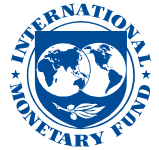

Document of

**The World Bank**

FOR OFFICIAL USE ONLY

Report No: PGD471

INTERNATIONAL BANK FOR RECONSTRUCTION AND DEVELOPMENT

PROGRAM DOCUMENT FOR A

PROPOSED LOAN

IN THE AMOUNT OF US\$ 160 MILLION TO THE

REPUBLIC OF SERBIA

FOR THE

> Second Serbia Green Transition Programmatic
>
> Development Policy Loan
>
> October 12, 2023

Macroeconomics, Trade and Investment Global Practice

Europe and Central Asia Region

  -----------------------------------------------------------------------------------------------------------------------------------------------------------------------------------------------------------
  This document has a restricted distribution and may be used by recipients only in the performance of their official duties. Its contents may not otherwise be disclosed without World Bank authorization.
  -----------------------------------------------------------------------------------------------------------------------------------------------------------------------------------------------------------

  -----------------------------------------------------------------------------------------------------------------------------------------------------------------------------------------------------------

.

Republic of Serbia

**GOVERNMENT FISCAL YEAR**

*January, 1 – December, 31*

**CURRENCY EQUIVALENTS**

(Exchange Rate Effective as of October 12, 2023)

Currency Unit

US\$1.00=RSD 111.67

**ABBREVIATIONS AND ACRONYMS**

+------+-------------------------------------------------------+--------+-------------------------------------------------------+
| AFD  | Agence Française de Développement                     | LFS    | Labor Force Survey                                    |
|      |                                                       |        |                                                       |
|      | (French Development Agency)                           |        |                                                       |
+======+=======================================================+========+=======================================================+
| CAD  | Current Account Deficit                               | LSG    | Local Self Government                                 |
+------+-------------------------------------------------------+--------+-------------------------------------------------------+
| CEM  | Country Economic Memorandum                           | MoEP   | Ministry of Environmental Protection                  |
+------+-------------------------------------------------------+--------+-------------------------------------------------------+
| CPF  | Country Partnership Framework                         | MME    | Ministry of Mining and Energy                         |
+------+-------------------------------------------------------+--------+-------------------------------------------------------+
| CTA  | Consolidated Treasury Account                         | MOF    | Ministry of Finance                                   |
+------+-------------------------------------------------------+--------+-------------------------------------------------------+
| DPL  | Development Policy Loan                               | NAPP   | National Air Protection Program                       |
+------+-------------------------------------------------------+--------+-------------------------------------------------------+
| EDS  | Elektrodistribucija Srbije Ltd. Belgrade              | NBS    | National Bank of Serbia                               |
+------+-------------------------------------------------------+--------+-------------------------------------------------------+
| EPS  | Elektroprivreda Srbije                                | PER    | Public Expenditure Review                             |
+------+-------------------------------------------------------+--------+-------------------------------------------------------+
| EU   | European Union                                        | PFM    | Public Finance Management                             |
+------+-------------------------------------------------------+--------+-------------------------------------------------------+
| FRMD | Fiscal Risk Monitoring Department                     | PIM    | Public Investment Management                          |
+------+-------------------------------------------------------+--------+-------------------------------------------------------+
| GCRF | Global Crisis Response Framework                      | PSEGR  | Public Sector Efficiency and Green Recovery           |
+------+-------------------------------------------------------+--------+-------------------------------------------------------+
| GDP  | Gross Domestic Product                                | RE     | Renewable energy                                      |
+------+-------------------------------------------------------+--------+-------------------------------------------------------+
| GHG  | Greenhouse Gases                                      | SBA    | Stand-by Arrangement                                  |
+------+-------------------------------------------------------+--------+-------------------------------------------------------+
| IBRD | International Bank for Reconstruction and Development | SCD    | Systematic Country Diagnostic                         |
+------+-------------------------------------------------------+--------+-------------------------------------------------------+
| IDA  | International Development Association                 | SDR    | Special Drawing Rights                                |
+------+-------------------------------------------------------+--------+-------------------------------------------------------+
| IFC  | International Finance Corporation                     | SOE    | State-owned enterprise                                |
+------+-------------------------------------------------------+--------+-------------------------------------------------------+
| IMF  | International Monetary Fund                           | UNFCCC | United Nations Framework Convention on Climate Change |
+------+-------------------------------------------------------+--------+-------------------------------------------------------+
| KfW  | Kreditanstalt für Wiederaufbau                        | VAT    | Value added tax                                       |
|      |                                                       |        |                                                       |
|      | (German Development Bank)                             |        |                                                       |
+------+-------------------------------------------------------+--------+-------------------------------------------------------+
| LCDS | Low-Carbon Development Strategy                       | WB     | World Bank                                            |
+------+-------------------------------------------------------+--------+-------------------------------------------------------+
| LDP  | Letter of Development Policy                          | WBG    | World Bank Group                                      |
+------+-------------------------------------------------------+--------+-------------------------------------------------------+

+---------------------------+---------------------------------------------------+
| Regional Vice President:  | > Antonella Bassani                               |
+==========================:+===================================================+
| Country Director:         | > Xiaoqing Yu                                     |
+---------------------------+---------------------------------------------------+
| Regional Director:        | > Asad Alam                                       |
+---------------------------+---------------------------------------------------+
| Practice Manager (s):     | > Jasmin Chakeri                                  |
+---------------------------+---------------------------------------------------+
| Task Team Leader (s):     | > Lazar Sestovic, Katharina Gassner, Sameer Akbar |
+---------------------------+---------------------------------------------------+

.

**REPUBLIC OF SERBIA**

**SECOND SERBIA GREEN TRANSITION PROGRAMMATIC DEVELOPMENT POLICY LOAN**

# TABLE OF CONTENTS

[SUMMARY OF PROPOSED FINANCING AND PROGRAM [3](#_Toc147958995)](#_Toc147958995)

[1. INTRODUCTION AND COUNTRY CONTEXT [5](#introduction-and-country-context)](#introduction-and-country-context)

[2. MACROECONOMIC POLICY FRAMEWORK [5](#macroeconomic-policy-framework)](#macroeconomic-policy-framework)

[2.1. RECENT ECONOMIC DEVELOPMENTS [5](#recent-economic-developments)](#recent-economic-developments)

[2.2. MACROECONOMIC OUTLOOK AND DEBT SUSTAINABILITY [6](#macroeconomic-outlook-and-debt-sustainability)](#macroeconomic-outlook-and-debt-sustainability)

[2.3. IMF RELATIONS [7](#imf-relations)](#imf-relations)

[3. GOVERNMENT PROGRAM [7](#_Toc147959001)](#_Toc147959001)

[4. PROPOSED OPERATION [7](#proposed-operation)](#proposed-operation)

[4.1. LINK TO GOVERNMENT PROGRAM AND OPERATION DESCRIPTION [7](#link-to-government-program-and-operation-description)](#link-to-government-program-and-operation-description)

[4.2. PRIOR ACTIONS, RESULTS AND ANALYTICAL UNDERPINNINGS [8](#prior-actions-results-and-analytical-underpinnings)](#prior-actions-results-and-analytical-underpinnings)

[4.3. LINK TO CPF, OTHER BANK OPERATIONS AND THE WBG STRATEGY [13](#link-to-cpf-other-bank-operations-and-the-wbg-strategy)](#link-to-cpf-other-bank-operations-and-the-wbg-strategy)

[4.4. CONSULTATIONS AND COLLABORATION WITH DEVELOPMENT PARTNERS [14](#consultations-and-collaboration-with-development-partners)](#consultations-and-collaboration-with-development-partners)

[5. OTHER DESIGN AND APPRAISAL ISSUES [14](#other-design-and-appraisal-issues)](#other-design-and-appraisal-issues)

[5.1. POVERTY AND SOCIAL IMPACT [14](#poverty-and-social-impact)](#poverty-and-social-impact)

[5.2. ENVIRONMENTAL, FORESTS, AND OTHER NATURAL RESOURCE ASPECTS [14](#environmental-forests-and-other-natural-resource-aspects)](#environmental-forests-and-other-natural-resource-aspects)

[5.3. PFM, DISBURSEMENT AND AUDITING ASPECTS [15](#pfm-disbursement-and-auditing-aspects)](#pfm-disbursement-and-auditing-aspects)

[5.4. MONITORING, EVALUATION AND ACCOUNTABILITY [15](#monitoring-evaluation-and-accountability)](#monitoring-evaluation-and-accountability)

[6. SUMMARY OF RISKS AND MITIGATION [15](#summary-of-risks-and-mitigation)](#summary-of-risks-and-mitigation)

[ANNEX 1: POLICY AND RESULTS MATRIX [17](#annex-1-policy-and-results-matrix)](#annex-1-policy-and-results-matrix)

[ANNEX 2: FUND RELATIONS ANNEX [22](#annex-2-fund-relations-annex)](#annex-2-fund-relations-annex)

[ANNEX 3: LETTER OF DEVELOPMENT POLICY [25](#annex-3-letter-of-development-policy)](#annex-3-letter-of-development-policy)

[ANNEX 4: ENVIRONMENT AND POVERTY/SOCIAL ANALYSIS TABLE [26](#annex-4-environment-and-povertysocial-analysis-table)](#annex-4-environment-and-povertysocial-analysis-table)

[ANNEX 5: MACROECONOMIC TABLES [27](#annex-5-macroeconomic-tables)](#annex-5-macroeconomic-tables)

[ANNEX 6: MATRIX OF KEY CHANGES TO ORIGINAL POLICY MATRIX IN A PROGRAMMATIC SERIES [30](#annex-6-matrix-of-key-changes-to-original-policy-matrix-in-a-programmatic-series)](#annex-6-matrix-of-key-changes-to-original-policy-matrix-in-a-programmatic-series)

[ANNEX 7: PRIOR ACTIONS AND ANALYTICAL UNDERPINNINGS [34](#annex-7-prior-actions-and-analytical-underpinnings)](#annex-7-prior-actions-and-analytical-underpinnings)

  ---------------------------------------------------------------------------------------------------------------------------------------------------------------------------------------------------------------------------------------------------------------------------------------------------------------------------------------------------------------------------------------------------------------------------------------------------------------------------------------------------------------------------------------------------------------------------------------------------------------------------------------------------------------------------------------------------------------------------------------------------------------------------------------------------------------------------------------------------------------------------------------------------------------------------------------------------------------------------------------------------------------------------------------------------------------------------------------------------------------------------------------------------------------------------------------------------------------------------------------------------------
  The Second Serbia Green Transition Development Policy Loan was prepared by an IBRD team consisting of Lazar Šestović (Sr. Economist, co-TTL), Katharina Gassner (Sr. Energy Economist, co-TTL), Sameer Akbar (Sr. Environment Specialist, co-TTL), Richard Record (Lead Economist), Tiago Peixoto (Sr. Public Sector Specialist), Aleksandar Crnomarković (Sr. Financial Management Specialist), Jonas Arp Fallow (Sr. Public Sector Specialist), Zurab Sajaia (Sr. Economist), Ivana Novaković (Environmental Specialist), Felix Quintero (Sr. Counsel), Ruxandra Costache (Sr. Counsel), Dilip Kumar Prusty Chinari (Finance Officer), Jasna Vukoje (Portfolio Analyst), Kornel Drazilov (Consultant), Elena Merle-Beral (Consultant), Sasa Eichberger (Sr. Environmental Specialist) and Bisera Nurković (Program Assistant). The team benefitted from guidance from Xiaoqing Yu (Country Director), Asad Alam (Regional Director), Jasmin Chakeri (Practice Manager), Stephanie Gil (Practice Manager), Sanjay Srivastava (Practice Manager), and Nicola Pontara (Country Manager). The peer reviewers were Tatyana Kramskaya (Sr. Energy Specialist), Ruslan Piontkivsky (Sr. Economist) and Marcelo Hector Acerbi (Sr. Environmental Specialist).
  ---------------------------------------------------------------------------------------------------------------------------------------------------------------------------------------------------------------------------------------------------------------------------------------------------------------------------------------------------------------------------------------------------------------------------------------------------------------------------------------------------------------------------------------------------------------------------------------------------------------------------------------------------------------------------------------------------------------------------------------------------------------------------------------------------------------------------------------------------------------------------------------------------------------------------------------------------------------------------------------------------------------------------------------------------------------------------------------------------------------------------------------------------------------------------------------------------------------------------------------------------------

  ---------------------------------------------------------------------------------------------------------------------------------------------------------------------------------------------------------------------------------------------------------------------------------------------------------------------------------------------------------------------------------------------------------------------------------------------------------------------------------------------------------------------------------------------------------------------------------------------------------------------------------------------------------------------------------------------------------------------------------------------------------------------------------------------------------------------------------------------------------------------------------------------------------------------------------------------------------------------------------------------------------------------------------------------------------------------------------------------------------------------------------------------------------------------------------------------------------------------------------------------------------

+-----------------------------------------------------------------------+
| # SUMMARY OF PROPOSED FINANCING AND PROGRAM                           |
+=======================================================================+

+-----------------------------------------------------------------------------------------+
| **BASIC INFORMATION**                                                                   |
+=========================+=========================+=====================================+
|                                                                                         |
+-------------------------+-------------------------+-------------------------------------+
| Project ID              | Programmatic            | If programmatic, position in series |
+-------------------------+-------------------------+-------------------------------------+
| P178115                 | Yes                     | 2nd in a series of 2                |
+-------------------------+-------------------------+-------------------------------------+

+-----------------------------------------------------------------------------------------------------------------------------------------------------------------------------------------------------------------------------------------------------------------------------------------------------------------------------------------+
| **Proposed Development Objective(s)**                                                                                                                                                                                                                                                                                                   |
+:===================================================================================================================================================================+:===================================================================================================================================================================+
| The objective of the proposed programmatic Green Transition Development Policy Loan is to support the Government of Serbia’s efforts to: 1) better align fiscal management with the climate-change agenda, 2) accelerate the clean energy transition, and 3) align with European Union standards on environment and climate action.     |
+-----------------------------------------------------------------------------------------------------------------------------------------------------------------------------------------------------------------------------------------------------------------------------------------------------------------------------------------+
| **Organizations**                                                                                                                                                                                                                                                                                                                       |
+--------------------------------------------------------------------------------------------------------------------------------------------------------------------+--------------------------------------------------------------------------------------------------------------------------------------------------------------------+
| Borrower:                                                                                                                                                          | MINISTRY OF FINANCE                                                                                                                                                |
+--------------------------------------------------------------------------------------------------------------------------------------------------------------------+--------------------------------------------------------------------------------------------------------------------------------------------------------------------+
| Implementing Agency:                                                                                                                                               | Ministry of Environmental Protection                                                                                                                               |
+--------------------------------------------------------------------------------------------------------------------------------------------------------------------+--------------------------------------------------------------------------------------------------------------------------------------------------------------------+

  -----------------------------------------------------------------------
  **PROJECT FINANCING DATA (US\$, Millions)**
  -----------------------------------------------------------------------

  -----------------------------------------------------------------------

**SUMMARY**

+--------------------------------------------------+-------------------+
| > **Total Financing**                            | **160.00**        |
+==================================================+===================+

**DETAILS**

+----------------------------------------------------------------+-------------------+
| > International Bank for Reconstruction and Development (IBRD) | 160.00            |
+================================================================+===================+

+--------------------------------------------------------------------------------------------------+
| **INSTITUTIONAL DATA**                                                                           |
+==================================================================================================+
| **Climate Change and Disaster Screening**                                                        |
+--------------------------------------------------------------------------------------------------+
| > This operation has not been screened for short and long-term climate change and disaster risks |
+--------------------------------------------------------------------------------------------------+
| **Overall Risk Rating**                                                                          |
|                                                                                                  |
| > Moderate                                                                                       |
+--------------------------------------------------------------------------------------------------+

.

  -----------------------------------------------------------------------
  **Results**
  -----------------------------------------------------------------------

  -----------------------------------------------------------------------

+:-----------------------------------------------------------------------------------------------------------------------------------------------------------------------------------------------------------------------------:+:------------------------------:+:------------------------:+:---------------------------------:+
| > **Indicator Name**                                                                                                                                                                                                          | > **Baseline**                 | > **Current Value**      | > **Target**                      |
+-------------------------------------------------------------------------------------------------------------------------------------------------------------------------------------------------------------------------------+--------------------------------+--------------------------+-----------------------------------+
| > Result Indicator #1:                                                                                                                                                                                                        | > No (2022)                    | > No (2023)              | > Yes, two in-year reports (2024) |
| >                                                                                                                                                                                                                             |                                |                          |                                   |
| > In-year reports on central government’s budget execution published.                                                                                                                                                         |                                |                          |                                   |
+-------------------------------------------------------------------------------------------------------------------------------------------------------------------------------------------------------------------------------+--------------------------------+--------------------------+-----------------------------------+
| > Result Indicator #2:                                                                                                                                                                                                        | > No (2022)                    | > No (2023)              | > Yes (2024)                      |
| >                                                                                                                                                                                                                             |                                |                          |                                   |
| > The borrower started publishing the assessments of fiscal risks related to natural disasters in the Fiscal Strategy.                                                                                                        |                                |                          |                                   |
+-------------------------------------------------------------------------------------------------------------------------------------------------------------------------------------------------------------------------------+--------------------------------+--------------------------+-----------------------------------+
| > Result Indicator #3:                                                                                                                                                                                                        | > n.a. (2021)                  | > n.a. (2023)            | > 15% (2024)                      |
| >                                                                                                                                                                                                                             |                                |                          |                                   |
| > Share of environment and climate change related projects in total capital budget.                                                                                                                                           |                                |                          |                                   |
+-------------------------------------------------------------------------------------------------------------------------------------------------------------------------------------------------------------------------------+--------------------------------+--------------------------+-----------------------------------+
| > Result Indicator \# 4:                                                                                                                                                                                                      | > 0 (2021)                     | > 425MW (2023)           | > 400 MW (2024)                   |
| >                                                                                                                                                                                                                             |                                |                          |                                   |
| > MW of cumulative renewable energy capacity procured through auctions.                                                                                                                                                       |                                |                          |                                   |
+-------------------------------------------------------------------------------------------------------------------------------------------------------------------------------------------------------------------------------+--------------------------------+--------------------------+-----------------------------------+
| > Result Indicator \# 5:                                                                                                                                                                                                      | > US\$ 0 million (2020)        | > US\$ 20 million (2023) | > US\$ 25 million (2024)          |
| >                                                                                                                                                                                                                             |                                |                          |                                   |
| > Financing mobilized per year for investment in residential energy efficiency by the programs of the MoME.                                                                                                                   |                                |                          |                                   |
+-------------------------------------------------------------------------------------------------------------------------------------------------------------------------------------------------------------------------------+--------------------------------+--------------------------+-----------------------------------+
| > Result Indicator \# 6:                                                                                                                                                                                                      | > No (2021)                    | > Yes                    | > Yes (2024)                      |
| >                                                                                                                                                                                                                             |                                |                          |                                   |
| > The distribution system operator is fully unbundled from generation and supply activities.                                                                                                                                  |                                |                          |                                   |
+-------------------------------------------------------------------------------------------------------------------------------------------------------------------------------------------------------------------------------+--------------------------------+--------------------------+-----------------------------------+
| > Result Indicator #7:                                                                                                                                                                                                        | > a\) 2.7% (2021)              | > a\) 2.7% (2023)        | > a\) TBD% (2024)                 |
| >                                                                                                                                                                                                                             | >                              | >                        | >                                 |
| > \(a\) Share of households receiving rebates to their energy bills under the protection program for Energy Vulnerable;                                                                                                       | > b\) 3.4% (2021)              | > b\) 16% (2023)         | > b\) 15% + TBD% (2024)           |
| >                                                                                                                                                                                                                             |                                |                          |                                   |
| > \(b\) Percent increase in the average electricity price for customers entitled to a guaranteed supply at regulated prices (households and small-scale customers).                                                           |                                |                          |                                   |
+-------------------------------------------------------------------------------------------------------------------------------------------------------------------------------------------------------------------------------+--------------------------------+--------------------------+-----------------------------------+
| > Result Indicator #8:                                                                                                                                                                                                        | > a\) 0% (2020)                | > a\) 0% (2023)          | > a\) 30% (2024)                  |
| >                                                                                                                                                                                                                             | >                              | >                        | >                                 |
| > a\) Percentage of GHG permits issued relative to the number of submitted applications from operators;                                                                                                                       | > b\) 0 (2020)                 | > b\) 1 (2023)           | > b\) 1 (2024)                    |
| >                                                                                                                                                                                                                             | >                              | >                        | >                                 |
| > b\) Establishment of GHG permitting IT tool;                                                                                                                                                                                | > c\) 0 (2020)                 | > c\) 3 (2023)           | > c\) 5 (2024)                    |
| >                                                                                                                                                                                                                             |                                |                          |                                   |
| > c\) Number of capacity building trainings for operators of stationary installations and for competent authorities.                                                                                                          |                                |                          |                                   |
+-------------------------------------------------------------------------------------------------------------------------------------------------------------------------------------------------------------------------------+--------------------------------+--------------------------+-----------------------------------+
| > Result Indicator #9:\                                                                                                                                                                                                       | > a\) 42% (2021)               | > a\) 42% (2023)         | > a\) 50% (2024)                  |
| > a) Accessibility of the population to sanitary landfills in the Republic of Serbia;                                                                                                                                         | >                              | >                        | >                                 |
| >                                                                                                                                                                                                                             | > b\) 0 (2020)                 | > b\) 1 (2023)           | > b\) 3 (2024)                    |
| > b\) Number of unsanitary landfills under remediation;                                                                                                                                                                       | >                              | >                        | >                                 |
| >                                                                                                                                                                                                                             | > c\) No (2020)                | > c\) Yes (2023)         | > c\) Yes (2024)                  |
| > c\) Multiple management/disposal options for sewage sludge created in Serbian strategic and legal framework.                                                                                                                |                                |                          |                                   |
+-------------------------------------------------------------------------------------------------------------------------------------------------------------------------------------------------------------------------------+--------------------------------+--------------------------+-----------------------------------+
| > Result Indicator #10:                                                                                                                                                                                                       | a)                             | > a\) 0 (2023)           | a)                                |
| >                                                                                                                                                                                                                             | b)                             | >                        | b)                                |
| > a\) Share of medium combustion plants (MCPs) with a thermal power from 1 to 50 MW out of the total number of MCPs registered in the National Register of Pollution Sources database, compliant with EU Directive 2015/2193. |                                | > b\) 1 (2023)           | c)                                |
| >                                                                                                                                                                                                                             | > 0 (2020)0 (2020)c) 36 (2020) | >                        |                                   |
| > b\) Air quality in Serbia expressed using a methodology that is aligned with EU air quality index;                                                                                                                          |                                | > c\) 45 (2023)          | 30% (2024) 1 (2024)50 (2024)      |
| >                                                                                                                                                                                                                             |                                |                          |                                   |
| > c\) Number of integrated permits issued.                                                                                                                                                                                    |                                |                          |                                   |
+-------------------------------------------------------------------------------------------------------------------------------------------------------------------------------------------------------------------------------+--------------------------------+--------------------------+-----------------------------------+

.

**IBRD PROGRAM DOCUMENT FOR A PROPOSED LOAN TO REPUBLIC OF SERBIA**

+-----------------------------------------------------------------------+
| ### INTRODUCTION AND COUNTRY CONTEXT                                  |
+=======================================================================+

**1. The proposed Second Serbia Green Transition Programmatic Development Policy Loan (DPL) supports policy and institutional reforms to help Serbia green its public financial management, modernize its energy sector and become more resilient to climate change by aligning legal and regulatory frameworks with the EU.** While Serbia saw a growth rebound after the pandemic, the country’s rate of growth over the past two years has hovered around 2 percent, falling short of that needed to achieve meaningful income convergence with EU peers. In addition, Serbia’s economy is characterized by high energy and carbon intensity and inefficient use of resources. Tackling these challenges would boost Serbia’s ambition to join the EU by advancing compliance with chapter 15 on energy, and chapter 27 on environment and climate change. Serbia is also a signatory of the Sofia Declaration on the Green Agenda for the Western Balkans, which aligns with the objectives of the EU Green Deal of a carbon-neutral continent. Poverty (based on the upper-middle income line of \$6.85/day in 2017 PPP) is estimated to have declined slightly from 8.5 percent in 2022 to 8 percent in 2023. The proposed loan of US\$ 160 million is the second in a programmatic series comprising two DPLs, with the first DPL approved in March 2023. The proposed DPL aims to help Serbia achieve growth that is faster and more resilient. The operation is envisaged in the FY22-26 Country Partnership Framework (CPF) and is financed in parallel by the French Development Agency (Agence Française de Développement, AFD) and the German Development Bank (Kreditanstalt für Wiederaufbau, KfW). AFD and KfW are financing the same policy matrix with two parallel loans worth up to Euro 135 million each, as it was the case with DPL1.

+-----------------------------------------------------------------------+
| ### MACROECONOMIC POLICY FRAMEWORK                                    |
+=======================================================================+

**2. Serbia’s macroeconomic policy framework is assessed to be adequate for this operation.** Serbia has implemented a prudent macroeconomic policy mix over the past decade, focusing on consolidation of the fiscal deficit (from 8 percent of GDP in 2020 to 3 percent in 2022) resulting in a continuous decline in public sector debt as a share of GDP. At the same time, close coordination between fiscal and monetary policy has helped to keep inflation relatively low and external balances in check. Still, there are risks to the macroeconomic framework, primarily related to the performance of SOEs and the pace of the global economic recovery.

+-----------------------------------------------------------------------+
| #### 2.1. RECENT ECONOMIC DEVELOPMENTS                                |
+=======================================================================+

**3. Growth has slowed down in the past 12 months, but the labor market remains resilient**. The Serbian economy experienced a strong post-COVID recovery. However, the economy started to slow in mid-2022, leading to growth of 2.5 percent in 2022. Growth in H1 2023 further decelerated to an estimated 1.3 percent. The labor market has remained, by and large, resilient to the shock caused by the pandemic, and the unemployment rate has remained stable at around 10 percent. Labor market improvements also resulted in a higher employment rate, which reached 50.4 percent in Q2 2023. Nevertheless, the youth unemployment rate has remained structurally high at around 25 percent. Wages continued to rise, increasing by 15.4 percent in nominal terms in H1 2023.

**4. Inflation remains stubbornly high.** The consumer price index (CPI) peaked at 16.2 percent (y/y) in March and has fallen since then. Nevertheless, inflation stood at 11.5 percent in August 2023, driven by food prices, which increased by 17.2 percent (y/y). It is expected that inflation will return to the NBS target band in mid-2024. Importantly, producer prices as measured by the PPI decreased significantly over recent months and, in July, were only 0.5 percent higher than a year earlier. The NBS decided in October to keep the key interest rate unchanged since July at 6.5 percent (after 16 months of continuous increases previously).[^1] The nominal exchange rate remains stable, but the REER appreciated by 4.4 percent over the first seven months of 2023.

**5. The consolidated budget shifted to a small surplus of 0.6 percent of GDP over the first six months of 2023.** Revenues posted a strong performance (up 12.5 percent in nominal terms, in H1, y/y), thanks to major increases in corporate income tax (CIT), domestic VAT and social contributions. High inflation drove VAT revenues, while improved CIT collection reflects the recovered profitability of businesses in 2022. Social contributions increased on the back of both higher formal employment (up 2.7 percent in H1, y/y) and nominal wages (up 15.4 percent in H1, y/y). Meanwhile, expenditures have been kept under control (up by 7.7 percent over the same period). According to the supplementary budget, this year’s fiscal deficit is expected to reach 2.8 percent of GDP, compared to 3 percent in 2022. Public and publicly guaranteed debt remained broadly stable throughout 2023 and stood at around 56 percent of GDP by end-June.

**6. There was a significant improvement in the BOP in the first half of 2023, contrasting with the extraordinarily large energy imports of 2022.** The CAD decreased by 82 percent in H1 (from EUR 2.9 billion in H1 2022 to EUR 0.5 billion in H1 2023). The trade balance shrank by 40 percent as imports of energy (both gas and electricity[^2]) decreased by 24.5 percent (or EUR 926 million) over the first six months of 2023, compared to the same period of 2022. As a result of a major decrease of the CAD in H1, it is now projected to shrink to around 2.5 percent of GDP for 2023 as a whole. Financing flows remain comfortable as net foreign direct investment inflows increased by almost 35 percent compared to the same period of 2022, to reach EUR 2 billion in the first half of 2023. As a result, official foreign currency increased to EUR 23.6 billion at the end of August, covering 6 months of imports.

**7. The performance of the banking sector remains robust.** Based on 2023 Q2 data, banks have remained profitable and liquid. The liquidity ratio increased from 2.2 at the end of 2022 to 2.4 in June, while the capital adequacy ratio increased to 22.3 percent at the end of June (compared to 20.2 at the end of 2022). Non-performing loans (NPLs) stood at 3.2 percent in June, a slight increase compared to 3 percent at the end of 2022. Credit growth has slowed down in 2023 due to tightening monetary conditions. The total stock of loans in June was only 2 percent higher than a year earlier. The highest increase in credit growth relates to loans to the government (up by 6.7 percent, y/y) while loans to private companies increased by a mere 0.3 percent (y/y) and to households by 2.6 percent (y/y, as of June 2023).

+-----------------------------------------------------------------------+
| #### 2.2. MACROECONOMIC OUTLOOK AND DEBT SUSTAINABILITY               |
+=======================================================================+

**8. The growth outlook remains positive with risks tilted to the downside.** The Serbian economy started to slow down in the second half of 2022, a trend that continued in the first half of 2023. However, in mid-2023 the construction sector has begun to show signs of a recovery, and some parts of the agriculture sector (wheat and corn production in particular) have performed better than expected. On the back of these developments, growth could accelerate in the second half of 2023 resulting in a growth rate of 2 percent for the year as whole. Over the medium term it is expected that growth will be around 3-4 percent. These are rates that are below Serbia’s potential and any acceleration in growth will depend on the implementation of structural reforms.

**9. Both public and external debt remain sustainable.** The government remains committed to lowering the fiscal deficit to 1.5 percent of GDP over the medium-term, in line with fiscal rules and by focusing on lowering budgetary expenditures. Although the share of public debt in GDP has been broadly stable over the last two years, there are certain risks. Since around 75 percent of public debt is denominated in foreign currencies, the most significant shock would be a 30 percent one-off depreciation of the Serbian dinar. A contingent liabilities shock would also be significant. Although issued guarantees are relatively small (2.9 percent of GDP at the end of June 2023) contingent liabilities could be significantly higher as the SOEs sector of the economy remains large and broadly unreformed. External debt also remains sustainable. The CAD is projected to be around 3.5-4 percent of GDP over the medium term. By and large, the CAD will be financed by non-debt-creating flows, mostly FDI, which is projected to average 5.5 percent of GDP. As a result, external debt is projected to continue to decline throughout the projection period and reach around 60 percent of GDP by 2026 (compared to an estimated 66.6 percent at the end of 2022, or the peak level of 76.4 percent in 2012).

**10. With inflation stubbornly high, the NBS is tightening monetary policy.** The NBS remains committed to inflation targeting (3 percent +/- 1.5 percent) although inflation remained above the higher band in 2023. By end-2023 inflation is expected to reach 8.2 percent, and it is expected to return to the target band in 2024. Reserves will remain at comfortable levels, although it is expected that the NBS will continue to intervene on the foreign exchange market to prevent more significant short-term fluctuations in the exchange rate.

**11. There are moderate risks to the macroeconomic framework, primarily related to the performance of SOEs and the outlook of the global economy.** The main risk to the baseline macroeconomic scenario is the performance of key state-owned energy utility companies (EPS and Srbijagas). As seen during the recent energy crisis, disruption in electricity production—combined with high prices of raw materials, including gas and coal—have entailed significant fiscal cost for the state’s budget. The second most important risk is associated with the EU economic outlook and performance of Serbia’s other main trading partners. Most of Serbia’s exports go to the EU (65 percent of the total) and to the Western Balkans (about 16 percent) making the country’s economy dependent on developments and on the pace of economic growth in these two regions.

+-----------------------------------------------------------------------+
| #### 2.3. IMF RELATIONS                                               |
+=======================================================================+

**12. Serbia has an ongoing IMF program that is on track.** On December 19, 2022, the IMF Board approved a 24-month Stand-By Arrangement (SBA) replacing the previous Policy Coordination Instrument and builds on its reform agenda in the energy sector, fiscal management (including through new fiscal rules framework), further reform of SOEs and monetary policy efforts to bring the inflation down to the NBS target band. The SBA amounts to SDR 1.9 billion, equivalent to about EUR 2.4 billion. The first review was successfully completed in June 2023.

+-----------------------------------------------------------------------+
| ###                                                                   |
+=======================================================================+

GOVERNMENT PROGRAM

+-----------------------------------------------------------------------+
| ### PROPOSED OPERATION                                                |
+=======================================================================+

+-----------------------------------------------------------------------+
| #### 4.1. LINK TO GOVERNMENT PROGRAM AND OPERATION DESCRIPTION        |
+=======================================================================+

**13. The programmatic series’ objective is to support the GoS’ efforts to: 1) better align fiscal management with the climate-change agenda, 2) accelerate the clean energy transition, and 3) align with the European Union standards on environment and climate action.** Therefore, reforms supported by proposed DPL are organized under three pillars aligned with the development objective and directly linked to prior actions supported by the first DPL under this series. Also, this operation is aligned with government strategies and action plans.

**14. The Government of Serbia’s operational and legislative agenda is driven by an increasing awareness of the necessity to pursue a more environmentally-friendly agenda.** The current government, which took office in October 2022, has five priority areas, articulated in its program for 2023-2026: modernizing the energy sector; boosting education; achieving a modern health system; increasing digitalization of key services; and taken action on climate change and environment protection. As such, the proposed DPL series crucially supports the aspirations of the Serbian government on the energy and climate fronts. The proposed DPL series also supports the implementation of the ongoing Action Plan for the Implementation of the Government's Program 2023-2026, in particular related to priority objectives: 1.2. “Energy security”; 1.3. “Environmental protection and waste management”, and 1.4. “Better air quality”. However, Serbia might face early elections in coming months and the priorities of the new government remain to be seen.

+-----------------------------------------------------------------------+
| #### 4.2. PRIOR ACTIONS, RESULTS AND ANALYTICAL UNDERPINNINGS         |
+=======================================================================+

***Pillar I: Better align fiscal management with the climate-change agenda***

**Prior Action #1: Fiscal Transparency**

15\. Rationale: The current budget formulation does not allow for making a direct link between planned budgetary expenditures and different public policies, including those related to environment and climate change. Therefore, the government is looking at options how to develop a budget that is more aligned with national green priorities and how to improve transparency and accountability in relation to actions that they are taking to address green priorities.

16\. Policy Content: In line with that, green budget tagging aims to use budgetary policy-making process to help achieve environmental and climate goals by evaluating environmental impacts of different policies and activities as financed by the budget. Green budget tagging will also contribute to informed, evidence-based discussion on sustainable growth. Therefore, the Budget System Law (BSL) will be amended by December 2023 to prescribe that Instruction for Preparation of the Budget will include the methodology for green budget tagging (starting from 2025), and that the government’s final account includes information on green expenditures. In the meantime, a comprehensive and acceptable Methodology for Green Budget Tagging, following the best international practice, will be prepared and adopted by the Government (also by December 2023).

17\. Expected Results: Effective tagging of green expenditures will better align sector workplans and expenditures with climate policy and facilitate resource flows to climate mitigation and adaptation.

**Prior Action #2: Fiscal Risk Management**

18\. Rationale: Over the past decade, natural disasters were one of the main fiscal risks which affected the government budget. However, there is no systemic analysis of these risks and their fiscal impact. On the other hand, effective fiscal risk management reduces the risk of unplanned budget expenditures when fiscal risks materialize and thus result in cost savings or better optimized use of funds.

19\. Policy Content: The Budget System Law amendments planned for December 2023 will prescribe in the article on elements of the Fiscal Strategy (article 27d) that analysis and estimates of the fiscal risks from natural disasters based on fiscal risks models are included in the fiscal risk section of the Fiscal Strategy. The amendment would be applied starting from the Fiscal Strategy 2025-2027, which will be prepared and adopted during 2024.

20\. Expected Results: The government will start publishing the assessments of fiscal risks related to natural disasters in the Fiscal Strategy and will be able to understand risks of natural disasters and assess potential impact of such risks on the government’s fiscal balance, in order to better mitigate the risks and plan allocation of funds.

**Prior Action #3: Public Investment Management**

21\. Rationale: In continuation of the planned introduction of Green Budget Tagging and formulation of green criteria for assessment and prioritization of public investment projects, there is a need to enable reporting on the share of financing of public investment projects that provide climate co-benefits.

22\. Policy Content: Planned amendments to the Decree on Capital Project Management to be adopted by December 2023 will include a provision to introduce climate co-benefit reporting both for newly proposed projects and for those that were completed. As a basis for the regulation - and building on previous experiences from IFIs and other countries - a methodology targeted to the Serbian context will be prepared taking into account the opinion of the Ministry of Environmental Protection (MoEP) and other stakeholders. The methodology should include an estimation of climate co-benefits at the pre-implementation stage as well as a final assessment of benefits once projects are completed.

23\. Expected results: As a result of a more focused management of new public investment with the emphasis on environmental and climate-friendly projects, their share in value of total spending on capital projects will increase to 15 percent in 2024. This will help Serbia to address the problem of missing or inefficient infrastructure when it comes to environment and climate change agenda.

***Pillar II: Accelerate the clean energy transition***

**Prior Action #4: Renewable Energy**

24\. Rationale: Renewable energy (RE) sources – apart from traditional hydro – only account for a small share of Serbia’s electricity generation. Large-scale RE power plants commissioned over the last decade were supported by feed-in tariffs (FiTs). To accelerate the pace of deployment of clean energy sources while reducing the unit cost of RE support, and to comply with Serbia’s Energy Community commitments, the 2021 Law on the Use of Renewable Energy Sources stipulates the transition from FiTs to competitive auctions as well as the possibility of generating RE-electricity by prosumers. The longer-term vision of RE’s role in Serbia’s energy mix will be included in the forthcoming Energy Sector Development Strategy (ESDS). This long-term strategy will also include the government’s vision for taking advantage of technological changes in the clean energy context, notably the production of green hydrogen.

25\. Policy Content: This DPL supports adoption of secondary legislation to enable renewable energy auctions (including on: balancing responsibility, quotas in the market premium system for solar power plants, maximum offered price for electricity etc). It also supports the development of the policy framework with regard to green hydrogen as an integral part of the ESDS which is under preparation and expected to be adopted by the National Assembly by December 2023.

26\. Expected results: The transition from FiTs to auctions is expected to result in private-sector led growth in RE generation procured at lower cost, thus contributing to the gradual reduction in the dependence on fossil fuel-based power due to the long-term competitive advantage of RE sources in the market. The first RE auctions were held between June and August 2023 and are expected to result in 400 MW of new wind capacity and 25 MW of solar capacity.

**Prior Action #5: Energy Efficiency**

27\. Rationale: Serbia’s per capita energy consumption is among the highest in Europe. The investments required to improve energy efficiency are significant across the building sector; for residential housing, many Serbian homeowners have limited financial resources and have difficulty accessing commercial lending. Therefore, there is need for a sustainable mechanism for financing residential energy efficiency. This issue was included under DPL-1, which supported establishment and operationalization of the Energy Efficiency Administration (EEA) within the MoME to implement national energy efficiency policies and to manage the government energy efficiency investment programs. However, a more predictable and transparent multi-year funding mechanism is needed to enhance energy efficiency investments in public and residential buildings over the longer term and demonstrate government commitment to scaling up the EE agenda. The Law on Energy Efficiency and Rational Use of Energy introduces obligatory energy audits to be conducted at least every four years for designated organizations under the energy management system and for large legal entities defined by the law governing the field of accounting. Secondary legislation is required to implement these provisions.

28\. Policy Content: Prior Action #5 (i) supports the introduction of measures to improve budget predictability of the EEA and better alignment of the budget allocation schedules with the seasonal cycles of energy efficiency support schemes, taking into account that most EE works are implemented in the summer season. The MoF is considering options for allowing EEA budgetary allocations to be determined on a three-year programmatic budget, as part of a broader initiative led by the IMF that aims to improve overall state budget transparency via a mid-term action plan. Prior Action #5 (ii) supports the adoption of regulations on licensing of energy auditors and energy audit methodology.

29\. Expected results: The financing mobilized for residential energy efficiency improvements through the government support programs is expected to increase from zero in 2020 to US\$ 25 million per year by 2024.

**Prior Action #6: Energy Market Reform**

30\. Rationale: The Serbian electricity sector was historically operated by the national utility public enterprise (PE) “PE Elektroprivreda Srbije” (EPS), that faces major challenges transitioning away from its reliance on legacy lignite-fired power generation assets, which are aging, inefficient and environmentally unsustainable. Under the Third EU Energy Package, Serbia has an obligation to fully unbundle PE EPS and to introduce competition in generation and supply. Effective unbundling of EPS and the establishment and licensing of a separate distribution system operator – the legal entity “Elektrodistribucija Srbije Ltd. Belgrade” (EDS) was completed under DPL-1.

31\. Policy Content: PE EPS was transformed into a closed joint-stock company in April 2023. New Supervisory Board members were appointed in June 2023 and a competitively recruited General Manager is to be announced by October 2023. Finally, the EPS strategic restructuring plan is expected to be adopted by December 2023. The initially planned DPL-1 Indicative Trigger #6 (ii) is dropped in DPL-2 because the newly established JSC EPS will not be able to develop GHG emission monitoring plans as originally foreseen when the DPL1 under this series was prepared, due to a delay in the regulatory framework linked to the Law on Climate Change.

32\. Expected results: The transformation of PE EPS into a joint-stock company under Prior Action 6(i) is expected to establish an enabling environment to improve its business practices, operational efficiency, corporate governance, and the use of human resources, and create better conditions for market development.

**Prior Action #7: Tariff Reform and Protecting Energy-vulnerable Consumers**

33\. Rationale: Residential consumers in Serbia have a limited ability to absorb higher energy prices. The inability to keep their homes warm and the incidence of arrears and late payments of bills are more common among low-income households, suggesting that poor and vulnerable consumers often have more difficulty meeting their energy needs. Under DPL-1, the Decree on Energy Vulnerable Customers (EVC) was revised on December 8, 2022 to expand protection of the energy vulnerable, following the amendment to the Energy Law in 2021.

34\. Policy Content. Part (i) of the Prior Action supports changes to the implementing structure of the EVC program: the transfer of the responsibility for its implementation from the MoME to the Ministry of Labor, Employment, Veteran and Social Affairs (MoLEVSA). MoLEVSA has a social assistance information system in place and a linked database for the social card system. The MoME needs to agree with the MoLEVSA and the MoF on the implementation responsibility and the necessary legal and regulatory changes for transferring the management of the EVC program to the MoLEVSA. As of September 2023, this has not been done yet. Part (ii) of the Prior Action supports tariff reform to enable financial sustainability of the energy sector. World Bank provided technical assistance to EPS under DPL-1, including deficit analysis and mid-term tariff considerations. Further tariff reforms in 2023 are driven by the Serbian government’s commitments under the IMF program.

35\. Expected results: The anchoring of the EVC program in the MoLEVSA and its inclusion into the existing information management architecture would facilitate automatization of collection and processing of eligible household data allowing for better targeting of beneficiaries which imply automatic qualification under the EVC program (including financial social assistance, child allowance, and allowance for assistance and care of another person). The price increases for customers entitled to a guaranteed supply are expected to reduce the gap between EPS’ costs and revenues in a longer-term perspective, therefore reducing its losses and liquidity issues. Moreover, end-user prices more reflective of real costs of supply will provide better incentives to invest in energy efficiency and distributed RE. The result indicator – the share of households that receive rebates to their energy bills to increase from 2.7% to 8% – was established under the DPL-1 on the basis of World Bank simulations but is unlikely to be met given actual progress. The new decree was expected to increase the number of beneficiaries (households that receive bill discounts) by 3 times compared to the year 2021 (from about 68,000 to an estimated 190,000 by the end of 2024, corresponding to approximately 8 percent of all households). However, the implementation in 2023 has been slower than expected. Approximately 70,000 households have been awarded EVC status in the first half of 2023, far from the 190,000 target.

***Pillar III: Align with European Union standards on environment and climate action***

**Prior Action #8: GHG Emissions**

36\. Rationale: The revised NDC submitted by the Government to the UNFCCC in August 2022 sets up an ambitious target of reducing GHG emissions by 33.3 percent as compared to 1990 levels. The Law on Climate Change (LCC) adopted by the Government in March 2021 provides the legal framework for strengthening the monitoring of GHG emissions and the necessary reporting of the reductions by installations. The Ministry of Environmental Protection (MoEP) is in the process of preparing / adopting the key bylaws or secondary legislation to enable this effort.

37\. Policy Content: This DPL2 supports the strengthening of the monitoring and reporting of GHG emissions through the adoption of: i) the Rulebook on the content of National GHG Inventory and its Reporting; ii) the Regulation specifying who is authorized to submit data for the preparation of the National GHG Inventory; and iii) Rulebook on Monitoring and Reporting of GHG emissions. These three secondary legislations on monitoring, reporting, and verification (MRV) are embedded in the Law on Climate Change (Article 25) and are aligned with the Directive 2003/87/EC of the EU. They are crucial requirements for setting up or joining any carbon pricing scheme as well as for responding to the EU Carbon Border Adjustment Mechanism (CBAM).

38\. Expected Results: Adoption of this package of three secondary legislations (along with by laws supported by DPL1) will enable the operationalization of a national MRV IT platform as well as the GHG permitting system for installations that will enable tracking progress in GHG emission reductions and support the introduction of appropriate policies.

**Prior Action #9: Waste Management**

39\. Rationale: The Waste Management Program in the Republic of Serbia (2022 – 2031) indicates sewage sludge as a growing waste stream. To comply with EU requirements, significant investments are planned and ongoing into extension of sewage network with additional more than 10,000 km and constructing or upgrading about 360 wastewater treatment plants. The current practice in Serbia is the disposal and temporary storage of sewage sludge at or in the vicinity of treatment plants until more appropriate treatment/re-use options become available. The legal basis for sludge management was established in 2023 through amendments to the Law on Waste Management, as supported by the DPL1. However more specific strategic long-term solution to the sludge management and legal framework is missing. Amendments to the Law also created the framework for management of the other growing waste stream – construction and demolition waste.

40\. Policy Content: This DPL2 supports adoption of the National Sludge Management Program for the period 2023 – 2032 and the action plan and the Regulation on Sludge Management in line with the relevant EU sludge legislation, both of which were envisaged in the amendments to the Law on Waste Management. The Regulation on Sludge Management will establish the regulatory framework for the use of sludge in agriculture (transposing corresponding EU requirements), as well as for sludge treatment involving reuse and disposal operations. According to the Law on Waste and the program for further aligning the legal framework with EU legal standards, the Regulation on Construction and Demolition Waste Management would define rules and guidelines for managing waste generated during construction and demolition activities as well as regulate recycling, quality assurance, and material reuse.

41\. Expected Results: The treatment options as set out in the Program will guide design of corresponding sludge management facilities. However, full impacts will be seen in about 20 years period. Adoption of the Regulation on Construction and Demolition Waste Management will establish the missing legal framework for handling of construction and demolition waste.

**Prior Action #10: Air Quality**

42\. Rationale: Serbian cities, such Belgrade are often at the top of the list of most polluted cities in the world in winter. According to the World Health Organization (2019), exposure to PM2.5 accounted for 3,585 premature deaths per year across 11 surveyed Serbian cities, including 1,796 in Belgrade. Emissions from industrial installations considerably impact environmental quality. Serbia’s EU Progress Report 2022 notes that alignment with most of the EU industrial pollution and risk management acquis is at an early stage, including on the Industrial Emissions Directive (IED). This concerns both lack of transposition of the directive requirements as well as slow implementation.

43\. Policy Content: According to Serbia’s EU Progress Report 2022, adopting the EU air quality index remains a key priority. Furthermore, one of the main objectives of the NAPP adopted in 2022 is a reduction in emissions of air pollutants from industrial processes. Operators of industrial installations must obtain an Industrial Pollution Prevention and Control (IPPC) integrated permit which will ensure that the whole of environmental impacts, including emissions to the air, is considered.[^3] The list of IPPC facilities currently includes 220 operators, and this number will increase once the new Law on IPPC will include additional sectors for permitting. Considering relatively low level of issued permits, steps, facilitating permitting process, are considered as a high priority.

44\. Expected Results: Air quality expressed through the EU air quality index would allow to implement one of the key EU air sector recommendations and establish internationally comparable air quality assessment criteria. The issuance of integrated permits for industrial operators will ensure that the pollutant emissions of the installation will remain as required by the IED’s best available techniques reference document. This will contribute to further reducing emissions and support meeting the NAPP air quality targets. While retaining the results indicator agreed for DPO1, two new results indicators are added to reflect the focus of this PA: i) Air quality in Serbia expressed using a methodology that is aligned with EU air quality index; ii) Number of integrated permits issued.

+-----------------------------------------------------------------------+
| #### 4.3. LINK TO CPF, OTHER BANK OPERATIONS AND THE WBG STRATEGY     |
+=======================================================================+

**45. The proposed DPL series underpins the overarching goal of the Serbia Country Partnership Framework (FY22-26) on fostering growth that is sustainable across generations and is coordinated with other World Bank engagements.** The DPL series directly supports CPF Higher Level Outcome – 1: Growth that is greener and more resilient, specifically objectives 1.1 (Stronger macro-fiscal framework and structural reforms for greened growth) and 1.2 (Greener investments and just transition to a low-carbon and resilient economy). The three pillars of the DPL series aim to ensure that Serbia achieves a robust recovery from the impact of COVID-19 with higher and resilient growth and broadly shared prosperity. The need to address environmental and climate vulnerabilities has been identified as development priority for the country and a medium-term transition away from coal is recognized as unavoidable if Serbia wants to reach its climate targets. Also, this DPL series is aligned with ongoing WB operations: (i) the Improving Public Financial Management for the Green Transition Program for Results (P175655); and (ii) the ongoing Serbia Scaling-Up Residential Clean Energy project (P176770).

+-----------------------------------------------------------------------+
| #### 4.4. CONSULTATIONS AND COLLABORATION WITH DEVELOPMENT PARTNERS   |
+=======================================================================+

**46. The operation is closely aligned with the priorities of Serbia’s development partners as well as other stakeholders.** This operation has been prepared in regular consultations with the relevant Serbian counterparts and the involved development partners. The work on this operation required a focused coordination with the AFD (on Pillar I and III in particular) and with the KfW (on Pillar II and III). Reforms supported by this DPL, like other government’s draft strategies and legal acts, were put for public consultations through a dedicated website run by the Public Policy Secretariat for online consultations which is open for all individuals and institutions (including NGOs) to post comments. Also, for some reforms supported by this DPL there were consultations in person (like for instance PA#9 and PA#10). Overall, numerous useful comments and suggestions were received – related to timing, sequencing, content of reforms etc which were taken into consideration when policy reforms were formulated.

+-----------------------------------------------------------------------+
| ### OTHER DESIGN AND APPRAISAL ISSUES                                 |
+=======================================================================+

**47. This operation aligns with the mitigation and adaptation and resilience goals of the Paris Agreement.** The DPF reform program is consistent with Serbia’s climate commitments, namely its NDC, LTS, and Law on Climate Change. Regarding mitigation goals, no prior action will likely introduce or reinforce significant and persistent barriers to transition to the country's low-GHG emissions development pathways. Regarding adaptation and resilience goals, for prior actions \[4,5,6,9\], the related construction activities might be in risk of present and future climate hazards. The government is implementing design measures to reduce the related risks. Therefore, the suggested DPL series program of reforms is likely aligned with the mitigation, and adaptation and resilience goals of the Paris Agreement.

+-----------------------------------------------------------------------+
| #### 5.1. POVERTY AND SOCIAL IMPACT                                   |
+=======================================================================+

**48. The program supported by this DPL is expected to have mainly positive poverty and social impacts, although there are some reforms (supported by PA#7 and PA#9) that require further attention.** Under Pillar I, all three prior actions are expected to have a neutral or a small positive impact on poverty. The proposed set of measures under Pillar II is expected to have mainly positive poverty and social impacts (such as investment in renewables and energy efficiency programs) however, Prior Action #7 is expected to have moderate negative poverty and social impacts. Energy poverty is a source of concern in Serbia but the increase in the guaranteed supply electricity tariff is expected to have a limited adverse impact on households (0.5 percentage point increase in the poverty rate). The proposed set of measures under Pillar III are expected to improve livelihoods by reducing air pollution and unmanaged solid waste, although there could be potential negative social impacts of Prior Actions #9 and #10 in the short term related to possible cost increases. Prior Action #9 (waste management) may result in cost increases for waste disposal, but any potential poverty and social impacts are expected to be moderate since cost increases will be gradual and capped to maintain affordability. Economic and affordability analyses by AfD suggest that payment for waste disposal could increase from up to 0.7 percent of household income. Existing mechanisms are in place to maintain affordability and mitigate adverse impacts on vulnerable households.

+-----------------------------------------------------------------------+
| #### 5.2. ENVIRONMENTAL, FORESTS, AND OTHER NATURAL RESOURCE ASPECTS  |
+=======================================================================+

**49. Given the overall green aim of the proposed DPL, the PAs are likely to have mostly positive effects on the environment, forests and natural resources.** However, some PAs (like PA#4) could be associated with potential negative, but manageable impacts in the long term. The proposed prior actions under Pillar II (Accelerating the clean energy transition) and Pillar III (Aligning with the European Union on the environment and climate action) will result in direct positive effects due to the expected reductions in GHG and other air pollutants emissions, and improvements in solid waste management. On the other hand, the RE capacity auctions investments could result in potential negative environmental effects attributed to the installation and operation of the RE systems (land use change, noise, generation of solid and hazardous waste, and threats to wildlife such as birds and bats), nevertheless, as mandated by Serbia’s Environmental Impact Assessment regulatory system, these impacts can be managed through adequate environmental impact assessment and appropriate mitigation measures.

+-----------------------------------------------------------------------+
| #### 5.3. PFM, DISBURSEMENT AND AUDITING ASPECTS                      |
+=======================================================================+

**50. Fiduciary arrangements for the DPO are satisfactory, including public financial management (PFM) systems, procurement systems and the foreign exchange control environment.** As identified by the 2020 PEFA assessment, treasury operations, budget formulation and budget execution have been assessed as reliable. Budgets are reliable, with deviations of actual revenue and expenditure outturns compared to those budgeted remaining low to moderate. The control environment has been gradually strengthened, including the external audit and parliamentary scrutiny of executed budgets. Overall, the existing system of internal controls is assessed as appropriate. The budget is executed through the Consolidated Treasury Account (CTA) operated by the Treasury Administration. The Treasury Administration is effective and reliable. Diagnostic assessments and external reviews confirm the reliable systems of payments and internal controls within the National Bank of Serbia (NBS), where Designated Accounts for all Bank loans are held. The proposed DPL is included in the Law on Budget for 2024. The proposed loan will follow the Bank’s disbursement procedures for DPLs. The IBRD will deposit the proceeds of the loan into a foreign currency deposit account (euro) that forms part of the country’s official foreign exchange reserves, designated by the Borrower, to be held at the NBS. This account will be managed by and subject to control of the MoF. The Borrower shall ensure that upon the deposit of the loan into the said account, it is available to finance budgeted expenditures and the management of public debt and is accounted for in the budget management system. No audit of the deposit account will be required, but rather a confirmation letter is to be provided.

#### 5.4. MONITORING, EVALUATION AND ACCOUNTABILITY

+-----------------------------------------------------------------------+
| ### SUMMARY OF RISKS AND MITIGATION                                   |
+=======================================================================+

**51. The overall risk for this operation is assessed as moderate.** All categories are assessed to be either as moderate or low risk after mitigation. Despite low or moderate ratings, several mitigating measures have been taken during the preparation of this DPL series in order to ensure that development objectives of this operation are reached. On the governance front, which has suffered some setbacks, according to the Governance Indicators, actions supported by this operation will be instrumental in supporting fiscal transparency and transparency of the renewables energy market. Similarly, despite the uncertain global economic outlook, the macroeconomic risk is rated moderate – in that this DPL series supports reforms aimed at strengthening budget management, the assessment of fiscal risks and the prioritization of capital expenditures. In addition, in December 2022, the IMF Board approved the new SBA, which would also help to mitigate macroeconomic risks. Finally, the DPL series is closely aligned with a series of complementary operations and technical assistance as part of the WBG’s broader country program in Serbia, including the Improving Public Financial Management for the Green Transition Program for Results.

**Table 1: Summary Risk Ratings**

+-------------------------------------------------------------------------------------------------------+
|                                                                                                       |
+=======================================================================================================+
| +:------------------------------------------------------------------:+:----------------------------:+ |
| | > **Risk Categories**                                              | > **Rating**                 | |
| +--------------------------------------------------------------------+------------------------------+ |
| | > 1\. Political and Governance                                     | > ●●●●● Moderate             | |
| +--------------------------------------------------------------------+------------------------------+ |
| | > 2\. Macroeconomic                                                | > ●●●●● Moderate             | |
| +--------------------------------------------------------------------+------------------------------+ |
| | > 3\. Sector Strategies and Policies                               | > ●●●●● Low                  | |
| +--------------------------------------------------------------------+------------------------------+ |
| | > 4\. Technical Design of Project or Program                       | > ●●●●● Low                  | |
| +--------------------------------------------------------------------+------------------------------+ |
| | > 5\. Institutional Capacity for Implementation and Sustainability | > ●●●●● Moderate             | |
| +--------------------------------------------------------------------+------------------------------+ |
| | > 6\. Fiduciary                                                    | > ●●●●● Moderate             | |
| +--------------------------------------------------------------------+------------------------------+ |
| | > 7\. Environment and Social                                       | > ●●●●● Low                  | |
| +--------------------------------------------------------------------+------------------------------+ |
| | > 8\. Stakeholders                                                 | > ●●●●● Moderate             | |
| +--------------------------------------------------------------------+------------------------------+ |
| | > 9\. Other                                                        | > ●●●●● Low                  | |
| +--------------------------------------------------------------------+------------------------------+ |
| | > **Overall**                                                      | > ●●●●● Moderate             | |
| +--------------------------------------------------------------------+------------------------------+ |
+-------------------------------------------------------------------------------------------------------+
|                                                                                                       |
+-------------------------------------------------------------------------------------------------------+

+-----------------------------------------------------------------------+
| ##### ANNEX 1: POLICY AND RESULTS MATRIX                              |
+=======================================================================+

+----------------------------------------------------------------------------------------------------------------------------------------------------------------------------------------------------------------------------------------------------------------------------------------------------------------------------------------------------------------------------------------------------------------------------------------------------------------------------------------------------------------------------------------------------------------------------------------------------------------------------------------------------------------------------------------------------------------------------------------------------------------------------------------------------------------------------------------------------------------------------------------------------------------------------------------------------------------------------------------------------------------------------------------------------------------------------------------------------------------------------------------------------------------------------------------------------------------------------------------------------------------------------------------------------------------------------------------------------------------------------------------------------------------------------------+-------------------------------------------------------------------------------------------------------------------------------------------------------------------------------------------------------------------------------------------------------------------------------------------------------------------------------------------------------------------------------------------------+
| > **Prior actions for DPL 1 and DPL2**                                                                                                                                                                                                                                                                                                                                                                                                                                                                                                                                                                                                                                                                                                                                                                                                                                                                                                                                                                                                                                                                                                                                                                                                                                                                                                                                                                                           | > **Results**                                                                                                                                                                                                                                                                                                                                                                                   |
+:==============================================================================================================================================================================================================================================================================================================================================================================================================================================================================================================================================================================================================================================================================================================================================================================================================================================================:+:===============================================================================================================================================================================================================================================================================================================================================================================================================================================================================================================================================================:+:=============================================================================================================================================================================================================================================================================================================================:+:===========================:+:=================================:+
| **Prior Actions under DPL 1**                                                                                                                                                                                                                                                                                                                                                                                                                                                                                                                                                                                                                                                                                                                                                                                                                                  | **Prior Actions for DPL 2**                                                                                                                                                                                                                                                                                                                                                                                                                                                                                                                                     | > **Indicator Name**                                                                                                                                                                                                                                                                                                          | > **Baseline**              | > **Target**                      |
+----------------------------------------------------------------------------------------------------------------------------------------------------------------------------------------------------------------------------------------------------------------------------------------------------------------------------------------------------------------------------------------------------------------------------------------------------------------------------------------------------------------------------------------------------------------------------------------------------------------------------------------------------------------------------------------------------------------------------------------------------------------------------------------------------------------------------------------------------------------+-----------------------------------------------------------------------------------------------------------------------------------------------------------------------------------------------------------------------------------------------------------------------------------------------------------------------------------------------------------------------------------------------------------------------------------------------------------------------------------------------------------------------------------------------------------------+-------------------------------------------------------------------------------------------------------------------------------------------------------------------------------------------------------------------------------------------------------------------------------------------------------------------------------+-----------------------------+-----------------------------------+
| > ***Pillar I - Program Development Objective A: Better align fiscal management with the climate-change agenda***                                                                                                                                                                                                                                                                                                                                                                                                                                                                                                                                                                                                                                                                                                                                                                                                                                                                                                                                                                                                                                                                                                                                                                                                                                                                                                                                                                                                                                                                                                                                                                                                                                                                                                                  |
+----------------------------------------------------------------------------------------------------------------------------------------------------------------------------------------------------------------------------------------------------------------------------------------------------------------------------------------------------------------------------------------------------------------------------------------------------------------------------------------------------------------------------------------------------------------------------------------------------------------------------------------------------------------------------------------------------------------------------------------------------------------------------------------------------------------------------------------------------------------+-----------------------------------------------------------------------------------------------------------------------------------------------------------------------------------------------------------------------------------------------------------------------------------------------------------------------------------------------------------------------------------------------------------------------------------------------------------------------------------------------------------------------------------------------------------------+-------------------------------------------------------------------------------------------------------------------------------------------------------------------------------------------------------------------------------------------------------------------------------------------------------------------------------+-----------------------------+-----------------------------------+
| > **Prior Action #1:** The Borrower has introduced the legal obligation to publish in-year budget execution information (covering the first six and nine months of budget execution), with functional and administrative breakdowns as in the original budget, to increase transparency in budgetary expenditures, including on environment and climate related activities, as evidenced by amendments to the Budget System Law, duly published in the Borrower’s Official Gazette No. 138, on December 12, 2022.                                                                                                                                                                                                                                                                                                                                              | > **Prior Action #1:** The Borrower introduced budget tagging of “green” expenditures by enacting amendments to the Budget System Law, Article 35, related to budgetary instructions, to add as part of annual budgetary instructions the new methodology for classification of climate change and environment protection expenditures, and Article 79 related to the content of the final account.                                                                                                                                                             | > In-year reports on central government’s budget execution published                                                                                                                                                                                                                                                          | > No (2022)                 | > Yes, two in-year reports (2024) |
+----------------------------------------------------------------------------------------------------------------------------------------------------------------------------------------------------------------------------------------------------------------------------------------------------------------------------------------------------------------------------------------------------------------------------------------------------------------------------------------------------------------------------------------------------------------------------------------------------------------------------------------------------------------------------------------------------------------------------------------------------------------------------------------------------------------------------------------------------------------+-----------------------------------------------------------------------------------------------------------------------------------------------------------------------------------------------------------------------------------------------------------------------------------------------------------------------------------------------------------------------------------------------------------------------------------------------------------------------------------------------------------------------------------------------------------------+-------------------------------------------------------------------------------------------------------------------------------------------------------------------------------------------------------------------------------------------------------------------------------------------------------------------------------+-----------------------------+-----------------------------------+
| > **Prior Action #2:** The Borrower, pursuant to the Methodology for Fiscal Risk Monitoring, developed fiscal risk models to quantify fiscal risks over the medium-term, as included in the Fiscal Strategy, and introduced the obligation to produce in-year and annual fiscal risk reports, as evidenced by Government Decision 05 No. 40-9575/2021, duly published in the Borrower’s Official Gazette No. 99, dated October 22, 2021.                                                                                                                                                                                                                                                                                                                                                                                                                       | > **Prior Action #2:** The Borrower has introduced analysis and estimates of the possible fiscal impact of disasters-related events in the Fiscal Strategy based on fiscal risks models and methodology starting with the 2025 Fiscal Strategy, based on amendments to the Budget System Law related to the content of the Fiscal Strategy.                                                                                                                                                                                                                     | > The borrower started publishing the assessments of fiscal risks related to natural disasters in the Fiscal Strategy                                                                                                                                                                                                         | > No (2022)                 | > Yes (2024)                      |
+----------------------------------------------------------------------------------------------------------------------------------------------------------------------------------------------------------------------------------------------------------------------------------------------------------------------------------------------------------------------------------------------------------------------------------------------------------------------------------------------------------------------------------------------------------------------------------------------------------------------------------------------------------------------------------------------------------------------------------------------------------------------------------------------------------------------------------------------------------------+-----------------------------------------------------------------------------------------------------------------------------------------------------------------------------------------------------------------------------------------------------------------------------------------------------------------------------------------------------------------------------------------------------------------------------------------------------------------------------------------------------------------------------------------------------------------+-------------------------------------------------------------------------------------------------------------------------------------------------------------------------------------------------------------------------------------------------------------------------------------------------------------------------------+-----------------------------+-----------------------------------+
| > **Prior Action #3:** The Borrower has introduced additional environmental and climate-related criteria to evaluate public investment projects, submitted by Budget Beneficiaries to the MoF for financing from the Government’s budget, and prioritize those public investment projects with positive impact on the environment and climate change, as evidenced by the amendments to the Decree on Management of Capital Projects, duly published in the Borrower’s Official Gazette No. 139, dated December 16, 2022.                                                                                                                                                                                                                                                                                                                                      | > **Prior Action #3:** The Borrower has developed a regulatory framework to measure the climate co-benefits of approved public investment projects by revising the Decree on Capital Projects Management and by adopting the Rulebook on methodology for calculating climate co-benefits.                                                                                                                                                                                                                                                                       | > Share of environment and climate change related projects in total capital budget                                                                                                                                                                                                                                            | > n.a. (2021)               | 15 percent (2024)                 |
+----------------------------------------------------------------------------------------------------------------------------------------------------------------------------------------------------------------------------------------------------------------------------------------------------------------------------------------------------------------------------------------------------------------------------------------------------------------------------------------------------------------------------------------------------------------------------------------------------------------------------------------------------------------------------------------------------------------------------------------------------------------------------------------------------------------------------------------------------------------+-----------------------------------------------------------------------------------------------------------------------------------------------------------------------------------------------------------------------------------------------------------------------------------------------------------------------------------------------------------------------------------------------------------------------------------------------------------------------------------------------------------------------------------------------------------------+-------------------------------------------------------------------------------------------------------------------------------------------------------------------------------------------------------------------------------------------------------------------------------------------------------------------------------+-----------------------------+-----------------------------------+
| > ***Pillar II – Program Development Objective B: Accelerate the clean energy transition***                                                                                                                                                                                                                                                                                                                                                                                                                                                                                                                                                                                                                                                                                                                                                                                                                                                                                                                                                                                                                                                                                                                                                                                                                                                                                                                                                                                                                                                                                                                                                                                                                                                                                                                                        |
+----------------------------------------------------------------------------------------------------------------------------------------------------------------------------------------------------------------------------------------------------------------------------------------------------------------------------------------------------------------------------------------------------------------------------------------------------------------------------------------------------------------------------------------------------------------------------------------------------------------------------------------------------------------------------------------------------------------------------------------------------------------------------------------------------------------------------------------------------------------+-----------------------------------------------------------------------------------------------------------------------------------------------------------------------------------------------------------------------------------------------------------------------------------------------------------------------------------------------------------------------------------------------------------------------------------------------------------------------------------------------------------------------------------------------------------------+-------------------------------------------------------------------------------------------------------------------------------------------------------------------------------------------------------------------------------------------------------------------------------------------------------------------------------+-----------------------------+-----------------------------------+
| > **Prior Action #4**: The Borrower, pursuant to the Law on the Use of Renewable Energy Sources, has (i) enabled implementation of auctions for renewable energy capacity, as evidenced by (a) the Decree on market premium model agreement (Decree 05 No. 110-9353/2021-1), and (b) the Decree on market premiums and feed-in tariff (Decree 05 No. 110-9352/2021-1), both duly published in the Borrower’s Official Gazette No. 112/2021, dated November 26, 2021; and (ii) introduced a simplified registration procedure for prosumers, as evidenced by the Decree on the criteria, conditions, and manner of calculating mutual financial claims between self-consumers and suppliers (Decree 5 No. 110-7592/2021-2) duly published in the Borrower’s Official Gazette No. 83, dated August 27, 2021.                                                     | > **Prior Action #4** (i) The Borrower has updated the regulatory framework for implementation of auctions for renewable energy capacity, as evidenced by amendments to the Law on the Use of Renewable energy Sources and related decrees.                                                                                                                                                                                                                                                                                                                     | > **Results Indicators #4:**                                                                                                                                                                                                                                                                                                  | > 0 (2021)                  | > 400 MW (2024)                   |
|                                                                                                                                                                                                                                                                                                                                                                                                                                                                                                                                                                                                                                                                                                                                                                                                                                                                | >                                                                                                                                                                                                                                                                                                                                                                                                                                                                                                                                                               | >                                                                                                                                                                                                                                                                                                                             |                             |                                   |
|                                                                                                                                                                                                                                                                                                                                                                                                                                                                                                                                                                                                                                                                                                                                                                                                                                                                | > **Prior Action #4** (ii) The Borrower has developed the policy framework with regard to green hydrogen as evidenced by the Energy Sector Development Strategy to 2050.                                                                                                                                                                                                                                                                                                                                                                                        | > MW of cumulative renewable energy capacity procured through auctions.                                                                                                                                                                                                                                                       |                             |                                   |
+----------------------------------------------------------------------------------------------------------------------------------------------------------------------------------------------------------------------------------------------------------------------------------------------------------------------------------------------------------------------------------------------------------------------------------------------------------------------------------------------------------------------------------------------------------------------------------------------------------------------------------------------------------------------------------------------------------------------------------------------------------------------------------------------------------------------------------------------------------------+-----------------------------------------------------------------------------------------------------------------------------------------------------------------------------------------------------------------------------------------------------------------------------------------------------------------------------------------------------------------------------------------------------------------------------------------------------------------------------------------------------------------------------------------------------------------+-------------------------------------------------------------------------------------------------------------------------------------------------------------------------------------------------------------------------------------------------------------------------------------------------------------------------------+-----------------------------+-----------------------------------+
| > **Prior Action #5:** The Borrower has revised the Rulebook on Internal Organization and Job Systematization (Rulebook No. 110-00-00085/2021-08, dated October 7, 2021) to enable the Energy Efficiency Administration to scale up programs for residential clean energy, as evidenced by the Government Decision 05 No. 110-10364/2021, dated November 10, 2021.                                                                                                                                                                                                                                                                                                                                                                                                                                                                                             | > **Prior Action #5** (i): The Borrower has institutionalized a predictable and transparent multi-year funding mechanism for the EEA’s programs                                                                                                                                                                                                                                                                                                                                                                                                                 | > **Results Indicator #5:**                                                                                                                                                                                                                                                                                                   | > US\$ 0m (2020)            | > US\$ 25m (2024)                 |
|                                                                                                                                                                                                                                                                                                                                                                                                                                                                                                                                                                                                                                                                                                                                                                                                                                                                | >                                                                                                                                                                                                                                                                                                                                                                                                                                                                                                                                                               | >                                                                                                                                                                                                                                                                                                                             |                             |                                   |
|                                                                                                                                                                                                                                                                                                                                                                                                                                                                                                                                                                                                                                                                                                                                                                                                                                                                | > **Prior Action #5** (ii): The Borrower has adopted secondary legislation that enables licensing of energy auditors and the adoption of energy audit methodology for the entities defined by the Law on Energy Efficiency and Rational Use of Energy of 2021.                                                                                                                                                                                                                                                                                                  | > Financing mobilized per year for investment in residential energy efficiency by the programs of the MoME.                                                                                                                                                                                                                   |                             |                                   |
+----------------------------------------------------------------------------------------------------------------------------------------------------------------------------------------------------------------------------------------------------------------------------------------------------------------------------------------------------------------------------------------------------------------------------------------------------------------------------------------------------------------------------------------------------------------------------------------------------------------------------------------------------------------------------------------------------------------------------------------------------------------------------------------------------------------------------------------------------------------+-----------------------------------------------------------------------------------------------------------------------------------------------------------------------------------------------------------------------------------------------------------------------------------------------------------------------------------------------------------------------------------------------------------------------------------------------------------------------------------------------------------------------------------------------------------------+-------------------------------------------------------------------------------------------------------------------------------------------------------------------------------------------------------------------------------------------------------------------------------------------------------------------------------+-----------------------------+-----------------------------------+
| > **Prior Action #6:** The Borrower, pursuant to the Energy Law and in order to promote transparent, and non-discriminatory access to the distribution grid for renewable energy prosumers and electricity retail service providers, has separated the Borrower-owned distribution system operator (“EPS Distribucija Ltd. Belgrade”) from the Borrower-owned power company (“PE Elektroprivreda Srbije”), by establishing and licensing a separate, and independent Borrower-owned legal entity (“Elektrodistribucija Srbije Ltd. Belgrade”), as evidenced by the Consolidated text of the Decision on the Incorporation of the “Elektrodistribucija Srbije Ltd. Belgrade”, No. 2460800-08.01-183456/1-22, dated April 28, 2022, notarized under certification No. UOP-T 12-2022, dated July 7, 2022.                                                         | > **Prior Action #6**: The Borrower has approved the transformation of the power company “PE Elektroprivreda Srbije” into a joint-stock company.                                                                                                                                                                                                                                                                                                                                                                                                                | > **Results Indicator #6:**                                                                                                                                                                                                                                                                                                   | No (2021)                   | Yes (2024)                        |
|                                                                                                                                                                                                                                                                                                                                                                                                                                                                                                                                                                                                                                                                                                                                                                                                                                                                |                                                                                                                                                                                                                                                                                                                                                                                                                                                                                                                                                                 | >                                                                                                                                                                                                                                                                                                                             |                             |                                   |
|                                                                                                                                                                                                                                                                                                                                                                                                                                                                                                                                                                                                                                                                                                                                                                                                                                                                |                                                                                                                                                                                                                                                                                                                                                                                                                                                                                                                                                                 | > The distribution system operator is fully unbundled from generation and supply activities.                                                                                                                                                                                                                                  |                             |                                   |
+----------------------------------------------------------------------------------------------------------------------------------------------------------------------------------------------------------------------------------------------------------------------------------------------------------------------------------------------------------------------------------------------------------------------------------------------------------------------------------------------------------------------------------------------------------------------------------------------------------------------------------------------------------------------------------------------------------------------------------------------------------------------------------------------------------------------------------------------------------------+-----------------------------------------------------------------------------------------------------------------------------------------------------------------------------------------------------------------------------------------------------------------------------------------------------------------------------------------------------------------------------------------------------------------------------------------------------------------------------------------------------------------------------------------------------------------+-------------------------------------------------------------------------------------------------------------------------------------------------------------------------------------------------------------------------------------------------------------------------------------------------------------------------------+-----------------------------+-----------------------------------+
| > **Prior Action #7** The Borrower: i) has expanded the benefits coverage for energy-vulnerable customers, as evidenced by the Decree on Energy Vulnerable Customers (Decree 05 No. 110-9890/2022-1), duly published in the Borrower’s Official Gazette No. 137/2022, dated December 9, 2022; and (ii) through its Council of the Energy Agency, has approved an increase of the electricity tariff for guaranteed supply to achieve sustainable tariff levels over the medium term, as evidenced by (a) Council of the Energy Agency of the Republic of Serbia Decision No. 487/2022-D-02/1, dated July 28, 2022, duly published in the Borrower’s Official Gazette No. 83/2022, dated July 28, 2022; and (b) Decision No. 791/2022-D-02/1, dated November 28, 2022, duly published in the Borrower’s Official Gazette No. 131/2022, dated November 29, 2022. | > **Prior Action #7** (i): The Borrower has transferred the responsibility for the implementation of the EVC protection program from the Ministry of Mining and Energy to the Ministry of Labor, Employment, Veteran and Social Affairs.                                                                                                                                                                                                                                                                                                                        | > **Results Indicator #7:** (a) Share of households receiving rebates to their energy bills under the protection program for Energy Vulnerable.                                                                                                                                                                               | > \(a\) 2.7% (2021)         | > \(a\) TBD% (2024)               |
|                                                                                                                                                                                                                                                                                                                                                                                                                                                                                                                                                                                                                                                                                                                                                                                                                                                                | >                                                                                                                                                                                                                                                                                                                                                                                                                                                                                                                                                               | >                                                                                                                                                                                                                                                                                                                             | >                           | >                                 |
|                                                                                                                                                                                                                                                                                                                                                                                                                                                                                                                                                                                                                                                                                                                                                                                                                                                                | > **Prior Action #7** (ii): The Borrower through its Council of the Energy Agency has approved an increase of the electricity tariff for guaranteed supply to achieve sustainable tariff levels over the medium-term.                                                                                                                                                                                                                                                                                                                                           | > \(b\) Percent increase in the average electricity price for customers entitled to a guaranteed supply at regulated prices (households and small-scale customers).                                                                                                                                                           | > \(b\) 3.4% (2021)         | > \(b\) 15% +TBD% (2024)          |
+----------------------------------------------------------------------------------------------------------------------------------------------------------------------------------------------------------------------------------------------------------------------------------------------------------------------------------------------------------------------------------------------------------------------------------------------------------------------------------------------------------------------------------------------------------------------------------------------------------------------------------------------------------------------------------------------------------------------------------------------------------------------------------------------------------------------------------------------------------------+-----------------------------------------------------------------------------------------------------------------------------------------------------------------------------------------------------------------------------------------------------------------------------------------------------------------------------------------------------------------------------------------------------------------------------------------------------------------------------------------------------------------------------------------------------------------+-------------------------------------------------------------------------------------------------------------------------------------------------------------------------------------------------------------------------------------------------------------------------------------------------------------------------------+-----------------------------+-----------------------------------+
| > ***Pillar III – Program Development Objective C: Align with European Union standards on environment and climate action***                                                                                                                                                                                                                                                                                                                                                                                                                                                                                                                                                                                                                                                                                                                                                                                                                                                                                                                                                                                                                                                                                                                                                                                                                                                                                                                                                                                                                                                                                                                                                                                                                                                                                                        |
+----------------------------------------------------------------------------------------------------------------------------------------------------------------------------------------------------------------------------------------------------------------------------------------------------------------------------------------------------------------------------------------------------------------------------------------------------------------------------------------------------------------------------------------------------------------------------------------------------------------------------------------------------------------------------------------------------------------------------------------------------------------------------------------------------------------------------------------------------------------+-----------------------------------------------------------------------------------------------------------------------------------------------------------------------------------------------------------------------------------------------------------------------------------------------------------------------------------------------------------------------------------------------------------------------------------------------------------------------------------------------------------------------------------------------------------------+-------------------------------------------------------------------------------------------------------------------------------------------------------------------------------------------------------------------------------------------------------------------------------------------------------------------------------+-----------------------------+-----------------------------------+
| > **Prior Action #8:** The Borrower has introduced a Monitoring Reporting and Verification system for industrial installations to align with the EU’s Emission Trading System, as evidenced by the adoption of (i) Decree on types of activities and greenhouse gases which require an emissions permit (Decree 05 No. 110-817/2022), duly published in the Borrower’s Official Gazette No. 13/2022, dated February 4, 2022; and (ii) Rulebook on verification and accreditation of verifiers of greenhouse gases emissions reports (Rulebook No. 110-00-00057/2021-04), duly published in the Borrower’s Official Gazette No. 107/2021, dated November 12, 2021.                                                                                                                                                                                              | > **Prior Action #8:** The Borrower has adopted additional bylaws on compilation of GHG inventory including the: i) the Rulebook on the content of GHG Inventory and Report on GHG Inventory ; and ii) the Decree on types of data, bodies and organizations and other natural and legal persons that submit data for the preparation of the National Inventory of Greenhouse Gases; and iii) Rulebook on Monitoring and Reporting of GHG emissions that will enable the operationalization of a national MRV IT platform as well as the GHG permitting system. | **Results Indicator #8:**                                                                                                                                                                                                                                                                                                     | a\) 0% (2020)               | a)                                |
|                                                                                                                                                                                                                                                                                                                                                                                                                                                                                                                                                                                                                                                                                                                                                                                                                                                                |                                                                                                                                                                                                                                                                                                                                                                                                                                                                                                                                                                 |                                                                                                                                                                                                                                                                                                                               |                             |                                   |
|                                                                                                                                                                                                                                                                                                                                                                                                                                                                                                                                                                                                                                                                                                                                                                                                                                                                |                                                                                                                                                                                                                                                                                                                                                                                                                                                                                                                                                                 | a\) Percentage of GHG permits issued relative to the number of submitted applications from operators;                                                                                                                                                                                                                         | b\) 0 (2020)                | 30% (2024)                        |
|                                                                                                                                                                                                                                                                                                                                                                                                                                                                                                                                                                                                                                                                                                                                                                                                                                                                |                                                                                                                                                                                                                                                                                                                                                                                                                                                                                                                                                                 |                                                                                                                                                                                                                                                                                                                               |                             |                                   |
|                                                                                                                                                                                                                                                                                                                                                                                                                                                                                                                                                                                                                                                                                                                                                                                                                                                                |                                                                                                                                                                                                                                                                                                                                                                                                                                                                                                                                                                 | b\) Establishment of GHG permitting IT tool;                                                                                                                                                                                                                                                                                  | c\) 0 (2020)                | b)                                |
|                                                                                                                                                                                                                                                                                                                                                                                                                                                                                                                                                                                                                                                                                                                                                                                                                                                                |                                                                                                                                                                                                                                                                                                                                                                                                                                                                                                                                                                 |                                                                                                                                                                                                                                                                                                                               |                             |                                   |
|                                                                                                                                                                                                                                                                                                                                                                                                                                                                                                                                                                                                                                                                                                                                                                                                                                                                |                                                                                                                                                                                                                                                                                                                                                                                                                                                                                                                                                                 | c\) Number of capacity building trainings for operators of stationary installations and for competent authority.                                                                                                                                                                                                              |                             | 1 (2024)                          |
|                                                                                                                                                                                                                                                                                                                                                                                                                                                                                                                                                                                                                                                                                                                                                                                                                                                                |                                                                                                                                                                                                                                                                                                                                                                                                                                                                                                                                                                 |                                                                                                                                                                                                                                                                                                                               |                             |                                   |
|                                                                                                                                                                                                                                                                                                                                                                                                                                                                                                                                                                                                                                                                                                                                                                                                                                                                |                                                                                                                                                                                                                                                                                                                                                                                                                                                                                                                                                                 |                                                                                                                                                                                                                                                                                                                               |                             | c)                                |
+----------------------------------------------------------------------------------------------------------------------------------------------------------------------------------------------------------------------------------------------------------------------------------------------------------------------------------------------------------------------------------------------------------------------------------------------------------------------------------------------------------------------------------------------------------------------------------------------------------------------------------------------------------------------------------------------------------------------------------------------------------------------------------------------------------------------------------------------------------------+-----------------------------------------------------------------------------------------------------------------------------------------------------------------------------------------------------------------------------------------------------------------------------------------------------------------------------------------------------------------------------------------------------------------------------------------------------------------------------------------------------------------------------------------------------------------+-------------------------------------------------------------------------------------------------------------------------------------------------------------------------------------------------------------------------------------------------------------------------------------------------------------------------------+-----------------------------+-----------------------------------+
| > 5 (2024)**Prior Action #9:** The Borrower has aligned national policy and legislation with the EU Waste Framework Directive, as evidenced by the (i) adoption of the National Waste Management Program and Action Plan through Government Decision 05 No. 353-588/2022-1, duly published in the Borrower’s Official Gazette No. 12/2022, dated February 1, 2022, and (ii) submission to the Parliament of the Amendment to the Law on Waste Management, through Government notice 05 No. 011-10810/2022-2, dated December 30, 2022.                                                                                                                                                                                                                                                                                                                          | > **Prior Action #9:** The Borrower has: i) adopted the National Sludge Management Program and Action Plan as well as the Decree on Sewage Sludge Management that would subsequently lead to further alignment with the relevant EU sludge legislation; and ii) adopted the Decree on management of construction and demolition waste that would contribute to environmentally sound management and increased reuse and recycling rates of this waste stream.                                                                                                   | **Results Indicator #9:**                                                                                                                                                                                                                                                                                                     | > a\) 42% (2021)            | > a\) 50% (2024)                  |
|                                                                                                                                                                                                                                                                                                                                                                                                                                                                                                                                                                                                                                                                                                                                                                                                                                                                |                                                                                                                                                                                                                                                                                                                                                                                                                                                                                                                                                                 |                                                                                                                                                                                                                                                                                                                               | >                           | >                                 |
|                                                                                                                                                                                                                                                                                                                                                                                                                                                                                                                                                                                                                                                                                                                                                                                                                                                                |                                                                                                                                                                                                                                                                                                                                                                                                                                                                                                                                                                 | > a) Accessibility of the population to sanitary landfills in the Republic of Serbia;                                                                                                                                                                                                                                         | > b\) 0 (2020)              | > b\) 3 (2024)                    |
|                                                                                                                                                                                                                                                                                                                                                                                                                                                                                                                                                                                                                                                                                                                                                                                                                                                                |                                                                                                                                                                                                                                                                                                                                                                                                                                                                                                                                                                 | >                                                                                                                                                                                                                                                                                                                             | >                           | >                                 |
|                                                                                                                                                                                                                                                                                                                                                                                                                                                                                                                                                                                                                                                                                                                                                                                                                                                                |                                                                                                                                                                                                                                                                                                                                                                                                                                                                                                                                                                 | > b\) Number of unsanitary landfills under remediation;                                                                                                                                                                                                                                                                       | > c\) No (2020)             | > c\) Yes (2024)                  |
|                                                                                                                                                                                                                                                                                                                                                                                                                                                                                                                                                                                                                                                                                                                                                                                                                                                                |                                                                                                                                                                                                                                                                                                                                                                                                                                                                                                                                                                 | >                                                                                                                                                                                                                                                                                                                             |                             |                                   |
|                                                                                                                                                                                                                                                                                                                                                                                                                                                                                                                                                                                                                                                                                                                                                                                                                                                                |                                                                                                                                                                                                                                                                                                                                                                                                                                                                                                                                                                 | > c\) Multiple management/disposal options for sewage sludge created in Serbian strategic and legal framework.                                                                                                                                                                                                                |                             |                                   |
+----------------------------------------------------------------------------------------------------------------------------------------------------------------------------------------------------------------------------------------------------------------------------------------------------------------------------------------------------------------------------------------------------------------------------------------------------------------------------------------------------------------------------------------------------------------------------------------------------------------------------------------------------------------------------------------------------------------------------------------------------------------------------------------------------------------------------------------------------------------+-----------------------------------------------------------------------------------------------------------------------------------------------------------------------------------------------------------------------------------------------------------------------------------------------------------------------------------------------------------------------------------------------------------------------------------------------------------------------------------------------------------------------------------------------------------------+-------------------------------------------------------------------------------------------------------------------------------------------------------------------------------------------------------------------------------------------------------------------------------------------------------------------------------+-----------------------------+-----------------------------------+
| > **Prior Action #10:** The Borrower has aligned national policy and legislation with the EU National Emissions Ceiling Directive and the Air Quality Framework Directive, as evidenced by adoption of the Air Protection Program in the Republic of Serbia for the period from 2022 to 2030 with an Action Plan, including specific interventions to address emissions from medium combustion plants, duly published in the Borrower’s Official Gazette No. 140, dated December 22, 2022.                                                                                                                                                                                                                                                                                                                                                                     | > **Prior Action #10:** The borrower has adopted: i) a rulebook on the application for an integrated permit as well as a rulebook on the format and content of the application; ii) and a conclusion instructing the Environmental Protection Agency, in cooperation with the Provincial Secretariat for Urban Planning and Environmental Protection as well as the local self-government units, to apply the Single Air Quality Index in the Republic of Serbia, which is well complied with the European Air Quality index.                                   | > **Results Indicator #10:**                                                                                                                                                                                                                                                                                                  | a\) 0 (2020)                | a\) 30% (2024)                    |
|                                                                                                                                                                                                                                                                                                                                                                                                                                                                                                                                                                                                                                                                                                                                                                                                                                                                |                                                                                                                                                                                                                                                                                                                                                                                                                                                                                                                                                                 | >                                                                                                                                                                                                                                                                                                                             |                             |                                   |
|                                                                                                                                                                                                                                                                                                                                                                                                                                                                                                                                                                                                                                                                                                                                                                                                                                                                |                                                                                                                                                                                                                                                                                                                                                                                                                                                                                                                                                                 | > a\) Share of medium combustion plants (MCPs) with a thermal power from 1 to 50 MW out of the total number of MCPs registered in the National Register of Pollution Sources database, compliant with EU Directive 2015/2193 on the limitation of emissions of certain pollutants into the air from medium combustion plants. | b\) 0 (2020)                | b\) 1 (2024)                      |
|                                                                                                                                                                                                                                                                                                                                                                                                                                                                                                                                                                                                                                                                                                                                                                                                                                                                |                                                                                                                                                                                                                                                                                                                                                                                                                                                                                                                                                                 | >                                                                                                                                                                                                                                                                                                                             |                             |                                   |
|                                                                                                                                                                                                                                                                                                                                                                                                                                                                                                                                                                                                                                                                                                                                                                                                                                                                |                                                                                                                                                                                                                                                                                                                                                                                                                                                                                                                                                                 | > b\) Air quality in Serbia expressed using a methodology that is aligned with EU air quality index;                                                                                                                                                                                                                          | c\) 36 (2020)               | c\) 50 (2024)                     |
|                                                                                                                                                                                                                                                                                                                                                                                                                                                                                                                                                                                                                                                                                                                                                                                                                                                                |                                                                                                                                                                                                                                                                                                                                                                                                                                                                                                                                                                 | >                                                                                                                                                                                                                                                                                                                             |                             |                                   |
|                                                                                                                                                                                                                                                                                                                                                                                                                                                                                                                                                                                                                                                                                                                                                                                                                                                                |                                                                                                                                                                                                                                                                                                                                                                                                                                                                                                                                                                 | > c\) Number of integrated permits issued.                                                                                                                                                                                                                                                                                    |                             |                                   |
+----------------------------------------------------------------------------------------------------------------------------------------------------------------------------------------------------------------------------------------------------------------------------------------------------------------------------------------------------------------------------------------------------------------------------------------------------------------------------------------------------------------------------------------------------------------------------------------------------------------------------------------------------------------------------------------------------------------------------------------------------------------------------------------------------------------------------------------------------------------+-----------------------------------------------------------------------------------------------------------------------------------------------------------------------------------------------------------------------------------------------------------------------------------------------------------------------------------------------------------------------------------------------------------------------------------------------------------------------------------------------------------------------------------------------------------------+-------------------------------------------------------------------------------------------------------------------------------------------------------------------------------------------------------------------------------------------------------------------------------------------------------------------------------+-----------------------------+-----------------------------------+

+-----------------------------------------------------------------------+
| ##### ANNEX 2: FUND RELATIONS ANNEX                                   |
+=======================================================================+

  --------------------------------------------------------------------------------------------------------------------------------------------------------------------------
     **IMF Executive Board Concludes 2023 Article IV Consultation and First Review Under the Stand-By Arrangement with the Republic of Serbia**
  ----------------------------- --------------------------------------------------------------------------------------------------------------------------------------------

  --------------------------------------------------------------------------------------------------------------------------------------------------------------------------

June 28, 2023

**Washington, DC:** The Executive Board of the International Monetary Fund (IMF) concluded the 2023 Article IV consultation[\[1\]](file:///\\\\data2\\COM\\COM\\MR\\Press%20Releases\\2023\\PR23242%20-%20Serbia%20-%20IMF%20Executive%20Board%20Concludes%202023%20Article%20IV%20Consultation%20and%20First%20Review%20Under%20the%20Stand-By%20Arrangement%20with%20the%20Republic%20of%20Serbia.docx#_ftn1)and first review of the Stand-By Arrangement with the Republic of Serbia. An additional SDR164 million (over €200 million) is available to purchase, which would bring cumulative drawing to SDR949 million (around €1.2 billion).

Over the last decade, Serbia has, despite external shocks, achieved impressive economic results reflecting its strong economic policies. Such policies supported strong growth, low inflation, and declining public debt. As a result, incomes rose, employment increased, and poverty declined. Large and diversified FDI inflows more than covered the current account deficit. The Covid-19 pandemic affected growth, but the economy quickly recovered in 2021 with the support of a strong package of policy measures.

Nevertheless, spillovers from Russia’s invasion of Ukraine and domestic problems, primarily in the energy sector, hit the economy hard. A sharp increase in international energy prices, domestic electricity production problems, and tightening global financial conditions led to an increase in fiscal and external financing needs in 2022. Under a Fund-supported Stand-By Arrangement (SBA), macroeconomic imbalances have already started to decline, and foreign exchange reserves are at an all-time high.

Headline inflation, however, at 15 percent in May, remains well above target and core inflation remains in double digits. Conditional on tighter monetary policy, which likely requires further policy rate increases, inflation should decline to around 8 percent by the end of the year and is projected to return to within the National Bank of Serbia’s target band in 2024. The projected fiscal deficit, which is not expected to exceed 3 percent of GDP in 2023, will support disinflation and further public debt reduction.

Growth is expected to decline to 2 percent in 2023, as tighter monetary and fiscal policies, still-high inflation, and weak external demand and tightening global financial conditions all weigh on activity. Over the medium term, growth should return to potential of around 4 percent. The current account deficit is expected to narrow to around 4½ percent of GDP as energy import prices fall and export volumes continue to grow.

Following the Executive Board’s discussion, Mr. Bo Li, Deputy Managing Director and Acting Chair of the Board, issued the following statement:

Tighter monetary policy is appropriate to address the challenging high inflation environment, support dinarization, and further strengthen reserves. While banks remain resilient, continued close monitoring is needed, given rising interest rates and risks from global financial turbulence. Steps to close remaining regulatory and supervisory gaps with the EU and support deeper capital markets are important.

The tight fiscal stance is supporting disinflation and helping to reduce public debt. The authorities have made strong progress on fiscal-structural reforms, including related to investment and risk management. Going forward, it will be important to adhere to the new fiscal rule, avoid ad hoc spending measures, and ensure that future fiscal overperformance is saved or used for priority investments.

Energy sector reform remains essential. Ongoing electricity and gas tariff hikes have helped to reduce fiscal subsidies and will be critical for financing essential energy investments over coming years. The new State-Owned Enterprise (SOE) law, which is aligned with OECD best practices, provides a strong foundation for governance reform in the energy sector and beyond. In parallel, considerable progress is being made in improving the structure and management of energy SOEs.

The authorities’ structural reform measures to improve the business environment are important, including strengthening the rule of law, improving the efficiency of the judicial system, and strengthening governance and anti-corruption.

+-----------------------------------------------------------------------------------------------------------------------------------------------------------------------------------------------------------------------------------------------+
| **Table 1. Serbia: Selected Economic Indicators**                                                                                                                                                                                             |
+===============================================================================================================================================================================================================================================+
| +-------------------------------------------------------+-----------------+------------------+-----------------------------------+-----------------------------------+------------------+----------------------------------+----------------+ |
| | Population: 6.87 million (2021)                       |                 |                  |                                   |                                   |                  |                                  |                | |
| +=======================================================+=================+==================+=================+=================+=================+=================+=================:+=================+===============:+===============:+ |
| | Quota: SDR654.8 million                               |                 |                  |                                   |                                   |                  |                                  |                | |
| +-------------------------------------------------------+-----------------+------------------+-----------------------------------+-----------------------------------+------------------+-----------------+----------------+----------------+ |
| | Main products and exports: manufactured goods, food, machinery and transport equipment.                                                                                                                 |                                 | |
| +---------------------------------------------------------------------------------------------------------------------------------------------------------------------------------------------------------+---------------------------------+ |
| | Key export markets: the EU (Germany, Italy) and ex-Yugoslavian states.                                                                                                                                                                    | |
| +-------------------------------------------------------+-----------------+------------------------------------+-----------------------------------+------------------------------------------------------+---------------------------------+ |
| |                                                       | 2021            | 2022                               |                                   | 2023                                                 |                                 | |
| +-------------------------------------------------------+-----------------+------------------+-----------------+-----------------+-----------------+-----------------+------------------+-----------------+----------------+----------------+ |
| |                                                       |                 | **SBA Approval** | Est.                              |                                   | **SBA Approval** | Proj.                            |                | |
| +-------------------------------------------------------+-----------------+------------------+-----------------------------------+-----------------------------------+------------------+----------------------------------+----------------+ |
| | **Output**                                            |                 |                  |                                   |                                   |                  |                                  |                | |
| +-------------------------------------------------------+-----------------+------------------+-----------------------------------+-----------------------------------+------------------+----------------------------------+----------------+ |
| | Real GDP growth (%)                                   | 7.5             | **2.5**          | 2.3                               |                                   | **2.3**          | 2.0                              |                | |
| +-------------------------------------------------------+-----------------+------------------+-----------------------------------+-----------------------------------+------------------+----------------------------------+----------------+ |
| | **Employment**                                        |                 |                  |                                   |                                   |                  |                                  |                | |
| +-------------------------------------------------------+-----------------+------------------+-----------------------------------+-----------------------------------+------------------+----------------------------------+----------------+ |
| | Unemployment rate (labor force survey) (%)            | 11.0            | **10.5**         | 9.4                               |                                   | **11.1**         | 9.1                              |                | |
| +-------------------------------------------------------+-----------------+------------------+-----------------------------------+-----------------------------------+------------------+----------------------------------+----------------+ |
| | **Prices**                                            |                 |                  |                                   |                                   |                  |                                  |                | |
| +-------------------------------------------------------+-----------------+------------------+-----------------------------------+-----------------------------------+------------------+----------------------------------+----------------+ |
| | Inflation (%), end of period                          | 7.9             | **15.8**         | 15.1                              |                                   | **8.2**          | 8.2                              |                | |
| +-------------------------------------------------------+-----------------+------------------+-----------------------------------+-----------------------------------+------------------+----------------------------------+----------------+ |
| | **General Government Finances**                       |                 |                  |                                   |                                   |                  |                                  |                | |
| +-------------------------------------------------------+-----------------+------------------+-----------------------------------+-----------------------------------+------------------+----------------------------------+----------------+ |
| | Revenue (% GDP)                                       | 43.3            | **43.0**         | 43.4                              |                                   | **41.6**         | 42.1                             |                | |
| +-------------------------------------------------------+-----------------+------------------+-----------------------------------+-----------------------------------+------------------+----------------------------------+----------------+ |
| | Expenditure (% GDP)                                   | 47.4            | **46.8**         | 46.4                              |                                   | **44.9**         | 44.9                             |                | |
| +-------------------------------------------------------+-----------------+------------------+-----------------------------------+-----------------------------------+------------------+----------------------------------+----------------+ |
| | Fiscal balance (% GDP)                                | -4.1            | **-3.8**         | -3.0                              |                                   | **-3.3**         | -2.8                             |                | |
| +-------------------------------------------------------+-----------------+------------------+-----------------------------------+-----------------------------------+------------------+----------------------------------+----------------+ |
| | Public debt (% GDP)                                   | 57.2            | **56.9**         | 55.6                              |                                   | **56.5**         | 55.3                             |                | |
| +-------------------------------------------------------+-----------------+------------------+-----------------------------------+-----------------------------------+------------------+----------------------------------+----------------+ |
| | **Money and Credit**                                  |                 |                  |                                   |                                   |                  |                                  |                | |
| +-------------------------------------------------------+-----------------+------------------+-----------------------------------+-----------------------------------+------------------+----------------------------------+----------------+ |
| | Broad money, eop (% change)                           | 13.0            | **3.3**          | 6.9                               |                                   | **7.9**          | 11.3                             |                | |
| +-------------------------------------------------------+-----------------+------------------+-----------------------------------+-----------------------------------+------------------+----------------------------------+----------------+ |
| | Credit to the private sector, eop (% change) 1/       | 9.9             | **10.3**         | 7.3                               |                                   | **7.7**          | 5.9                              |                | |
| +-------------------------------------------------------+-----------------+------------------+-----------------------------------+-----------------------------------+------------------+----------------------------------+----------------+ |
| | **Balance of Payments**                               |                 |                  |                                   |                                   |                  |                                  |                | |
| +-------------------------------------------------------+-----------------+------------------+-----------------------------------+-----------------------------------+------------------+----------------------------------+----------------+ |
| | Current account (% GDP)                               | -4.3            | **-9.0**         | -6.9                              |                                   | **-8.4**         | -4.7                             |                | |
| +-------------------------------------------------------+-----------------+------------------+-----------------------------------+-----------------------------------+------------------+----------------------------------+----------------+ |
| | FDI (% GDP)                                           | 6.9             | **6.1**          | 7.1                               |                                   | **5.2**          | 6.1                              |                | |
| +-------------------------------------------------------+-----------------+------------------+-----------------------------------+-----------------------------------+------------------+----------------------------------+----------------+ |
| | Reserves (months of prospective imports)              | 6.0             | **4.1**          | 5.2                               |                                   | **4.1**          | 5.6                              |                | |
| +-------------------------------------------------------+-----------------+------------------+-----------------------------------+-----------------------------------+------------------+----------------------------------+----------------+ |
| | External debt (% GDP)                                 | 74.4            | **68.0**         | 72.1                              |                                   | **65.4**         | 66.8                             |                | |
| +-------------------------------------------------------+-----------------+------------------+-----------------------------------+-----------------------------------+------------------+----------------------------------+----------------+ |
| | **Exchange Rate**                                     |                 |                  |                                   |                                   |                  |                                  |                | |
| +-------------------------------------------------------+-----------------+------------------+-----------------------------------+-----------------------------------+------------------+----------------------------------+----------------+ |
| | REER (% change)                                       | 1.4             | **…**            | 3.2                               |                                   | **…**            | …                                |                | |
| +-------------------------------------------------------+-----------------+------------------+-----------------------------------+-----------------------------------+------------------+----------------------------------+----------------+ |
| | Sources: Serbian authorities and IMF staff estimates. |                 |                  |                                   |                                   |                  |                                  |                | |
| +-------------------------------------------------------+-----------------+------------------+-----------------------------------+-----------------------------------+------------------+----------------------------------+----------------+ |
| | 1/ Calculated at a constant exchange rate to exclude the valuation effect.                                                                                                                                                                | |
| +-------------------------------------------------------------------------------------------------------------------------------------------------------------------------------------------------------------------------------------------+ |
+-----------------------------------------------------------------------------------------------------------------------------------------------------------------------------------------------------------------------------------------------+

[\[1\] ](file:///\\\\data2\\COM\\COM\\MR\\Press%20Releases\\2023\\PR23242%20-%20Serbia%20-%20IMF%20Executive%20Board%20Concludes%202023%20Article%20IV%20Consultation%20and%20First%20Review%20Under%20the%20Stand-By%20Arrangement%20with%20the%20Republic%20of%20Serbia.docx#_ftnref1)Under Article IV of the IMF's Articles of Agreement, the IMF holds bilateral discussions with members, usually every year. A staff team visits the country, collects economic and financial information, and discusses with officials the country's economic developments and policies. On return to headquarters, the staff prepares a report, which forms the basis for discussion by the Executive Board.

IMF Communications Department

**MEDIA RELATIONS**

**PRESS OFFICER:** CAMILA PEREZ

**PHONE: **+1 202 623-7100**EMAIL:** MEDIA@IMF.ORG

[\@IMFSpokesperson](https://twitter.com/IMFSpokesperson)

+-----------------------------------------------------------------------+
| ##### ANNEX 3: LETTER OF DEVELOPMENT POLICY                           |
+=======================================================================+

To be provided at the ROC stage review

+-----------------------------------------------------------------------+
| ##### ANNEX 4: ENVIRONMENT AND POVERTY/SOCIAL ANALYSIS TABLE          |
+=======================================================================+

+:---------------------------------:+:--------------------------------------------------------:+:----------------------------------------------------------------------------------------------------------------------------------------------------------------------------------------------------------------------------------------------------------------:+
| **Prior Actions**                 | **Significant positive or negative environment effects** | **Significant poverty, social or distributional effects positive or negative**                                                                                                                                                                                   |
+-----------------------------------+----------------------------------------------------------+------------------------------------------------------------------------------------------------------------------------------------------------------------------------------------------------------------------------------------------------------------------+
| **Operation Pillar I: Better align fiscal management with the climate-change agenda**                                                                                                                                                                                                                                                                           |
+-----------------------------------+----------------------------------------------------------+------------------------------------------------------------------------------------------------------------------------------------------------------------------------------------------------------------------------------------------------------------------+
| > **Prior Action #1**             | > Yes (Positive).                                        | > No substantial negative or positive impact.                                                                                                                                                                                                                    |
+-----------------------------------+----------------------------------------------------------+------------------------------------------------------------------------------------------------------------------------------------------------------------------------------------------------------------------------------------------------------------------+
| > **Prior Action #2**             | > Yes (Positive).                                        | > Yes (Positive).                                                                                                                                                                                                                                                |
+-----------------------------------+----------------------------------------------------------+------------------------------------------------------------------------------------------------------------------------------------------------------------------------------------------------------------------------------------------------------------------+
| > **Prior Action #3**             | > Yes (Positive).                                        | > Yes (Positive).                                                                                                                                                                                                                                                |
+-----------------------------------+----------------------------------------------------------+------------------------------------------------------------------------------------------------------------------------------------------------------------------------------------------------------------------------------------------------------------------+
| **Operation Pillar II: *Accelerate the clean energy transition***                                                                                                                                                                                                                                                                                               |
+-----------------------------------+----------------------------------------------------------+------------------------------------------------------------------------------------------------------------------------------------------------------------------------------------------------------------------------------------------------------------------+
| > **Prior Action #4**             | > Yes (Positive).                                        | > No significant negative impact.                                                                                                                                                                                                                                |
+-----------------------------------+----------------------------------------------------------+------------------------------------------------------------------------------------------------------------------------------------------------------------------------------------------------------------------------------------------------------------------+
| > **Prior Action #5**             | > Yes (Positive).                                        | > Yes (Positive).                                                                                                                                                                                                                                                |
+-----------------------------------+----------------------------------------------------------+------------------------------------------------------------------------------------------------------------------------------------------------------------------------------------------------------------------------------------------------------------------+
| > **Prior Action #6**             | > Yes (Positive).                                        | > No significant negative social impact.                                                                                                                                                                                                                         |
+-----------------------------------+----------------------------------------------------------+------------------------------------------------------------------------------------------------------------------------------------------------------------------------------------------------------------------------------------------------------------------+
| > **Prior Action #7**             | > Yes (Positive).                                        | > Mixed. The increase in tariffs is expected to have a limited adverse impact on households. The expanded coverage of the benefits for energy-vulnerable consumers, will support newly added beneficiaries of the program in reducing their energy expenditures. |
+-----------------------------------+----------------------------------------------------------+------------------------------------------------------------------------------------------------------------------------------------------------------------------------------------------------------------------------------------------------------------------+
| > **Operation Pillar III: *Align with European Union standards on environment and climate action***                                                                                                                                                                                                                                                             |
+-----------------------------------+----------------------------------------------------------+------------------------------------------------------------------------------------------------------------------------------------------------------------------------------------------------------------------------------------------------------------------+
| > **Prior Action #8**             | > Yes (Positive).                                        | > No substantial negative or positive impact.                                                                                                                                                                                                                    |
+-----------------------------------+----------------------------------------------------------+------------------------------------------------------------------------------------------------------------------------------------------------------------------------------------------------------------------------------------------------------------------+
| > **Prior Action #9**             | > Yes (Positive).                                        | > Yes (Positive; and potentially moderately negative in the long-term).                                                                                                                                                                                          |
+-----------------------------------+----------------------------------------------------------+------------------------------------------------------------------------------------------------------------------------------------------------------------------------------------------------------------------------------------------------------------------+
| > **Prior Action #10**            | > Yes (Positive).                                        | > Yes (Positive; and potentially moderately negative in the long-term).                                                                                                                                                                                          |
+-----------------------------------+----------------------------------------------------------+------------------------------------------------------------------------------------------------------------------------------------------------------------------------------------------------------------------------------------------------------------------+

+-----------------------------------------------------------------------+
| ##### ANNEX 5: MACROECONOMIC TABLES                                   |
+=======================================================================+

+-----------------------------------------------------------------------------------------------------------------------------------------------------------------------------------------------+
| **Table 1. Selected Economic and Financial Indicators**                                                                                                                                       |
+===============+===============+===============+===============+:==============+:=============:+:=============:+:=============:+:=============:+:=============:+:=============:+:=============:+
|                                                               | **2020**                      | **2021**      | **2022e**     | **2023p**     | **2024p**     | **2025p**     | **2026p**     |
+---------------------------------------------------------------+-------------------------------+---------------+---------------+---------------+---------------+---------------+---------------+
|                                                               |                               | Annual percentage change, unless otherwise indicated                                          |
+---------------------------------------------------------------+-------------------------------+---------------+---------------+---------------+---------------+---------------+---------------+
| **National Accounts**                                         |                               |               |               |               |               |               |               |
+---------------------------------------------------------------+-------------------------------+---------------+---------------+---------------+---------------+---------------+---------------+
| GDP at constant prices (%)                                    | -0.9                          | 7.7           | 2.5           | 2.0           | 3.0           | 3.8           | 4.0           |
+---------------------------------------------------------------+-------------------------------+---------------+---------------+---------------+---------------+---------------+---------------+
| Consumption                                                   | -1.0                          | 7.1           | 3.3           | 0.2           | 2.1           | 3.2           | 3.1           |
+---------------------------------------------------------------+-------------------------------+---------------+---------------+---------------+---------------+---------------+---------------+
| Investment                                                    | -0.4                          | 9.6           | 4.6           | -0.1          | 0.3           | 6.0           | 7.3           |
+---------------------------------------------------------------+-------------------------------+---------------+---------------+---------------+---------------+---------------+---------------+
| Exports of goods and services                                 | -4.2                          | 20.5          | 16.6          | 4.0           | 4.0           | 6.5           | 6.1           |
+---------------------------------------------------------------+-------------------------------+---------------+---------------+---------------+---------------+---------------+---------------+
| Imports of goods and services                                 | -3.6                          | 18.3          | 16.1          | 1.0           | 2.0           | 6.3           | 6.0           |
+---------------------------------------------------------------+-------------------------------+---------------+---------------+---------------+---------------+---------------+---------------+
| *Sectoral contribution to growth*                             |                               |               |               |               |               |               |               |
+---------------------------------------------------------------+-------------------------------+---------------+---------------+---------------+---------------+---------------+---------------+
| Agriculture (ppts)                                            | 0.2                           | -0.4          | -0.6          | 0.6           | 0.2           | 0.2           | 0.2           |
+---------------------------------------------------------------+-------------------------------+---------------+---------------+---------------+---------------+---------------+---------------+
| Industry (ppts)                                               | -0.1                          | 2.8           | 0.0           | 0.2           | 0.6           | 0.6           | 0.6           |
+---------------------------------------------------------------+-------------------------------+---------------+---------------+---------------+---------------+---------------+---------------+
| Services (ppts)                                               | -0.7                          | 5.3           | 2.8           | 1.2           | 2.1           | 2.8           | 3.2           |
+---------------------------------------------------------------+-------------------------------+---------------+---------------+---------------+---------------+---------------+---------------+
| **Inflation**                                                 |                               |               |               |               |               |               |               |
+---------------------------------------------------------------+-------------------------------+---------------+---------------+---------------+---------------+---------------+---------------+
| GDP deflator                                                  | 2.4                           | 5.8           | 10.4          | 11.5          | 6.1           | 4.7           | 3.8           |
+---------------------------------------------------------------+-------------------------------+---------------+---------------+---------------+---------------+---------------+---------------+
| Consumer prices (average)                                     | 1.6                           | 4.0           | 11.9          | 12.4          | 5.3           | 3.5           | 3.2           |
+---------------------------------------------------------------+-------------------------------+---------------+---------------+---------------+---------------+---------------+---------------+
| **Selected Monetary Accounts**                                |                               |               |               |               |               |               |               |
+---------------------------------------------------------------+-------------------------------+---------------+---------------+---------------+---------------+---------------+---------------+
| Banks' credit to the government                               | 24.0                          | 3.8           | -4.8          | 6.7           | ..            | ..            | ..            |
+---------------------------------------------------------------+-------------------------------+---------------+---------------+---------------+---------------+---------------+---------------+
| Banks' credit to private sector                               | 11.9                          | 9.7           | 7.1           | 0.9           | ..            | ..            | ..            |
+---------------------------------------------------------------+-------------------------------+---------------+---------------+---------------+---------------+---------------+---------------+
| Broad money (M2)                                              | 30.9                          | 13.8          | 6.1           | 21.8          | ..            | ..            | ..            |
+---------------------------------------------------------------+-------------------------------+---------------+---------------+---------------+---------------+---------------+---------------+
| **External sector**                                           |                               |               |               |               |               |               |               |
+---------------------------------------------------------------+-------------------------------+---------------+---------------+---------------+---------------+---------------+---------------+
| Exports fob                                                   | -2.1                          | 30.7          | 28.0          | 10.0          | 10.6          | 10.0          | 9.4           |
+---------------------------------------------------------------+-------------------------------+---------------+---------------+---------------+---------------+---------------+---------------+
| Imports fob                                                   | -3.5                          | 27.1          | 34.1          | 0.0           | 10.4          | 9.4           | 7.8           |
+---------------------------------------------------------------+-------------------------------+---------------+---------------+---------------+---------------+---------------+---------------+
| Terms of trade                                                | 4.6                           | 2.5           | -3.8          | ..            | ..            | ..            | ..            |
+---------------------------------------------------------------+-------------------------------+---------------+---------------+---------------+---------------+---------------+---------------+
|                                                               | *Percent of GDP, unless otherwise indicated*                                                                                  |
+---------------------------------------------------------------+-------------------------------+---------------+---------------+---------------+---------------+---------------+---------------+
| Current account balance (incl. grants)                        | -4.1                          | -4.2          | -6.9          | -2.5          | -3.4          | -4.3          | -4.3          |
+---------------------------------------------------------------+-------------------------------+---------------+---------------+---------------+---------------+---------------+---------------+
| Foreign Direct Investment                                     | 6.3                           | 6.9           | 7.1           | 6.0           | 5.6           | 5.5           | 5.5           |
+---------------------------------------------------------------+-------------------------------+---------------+---------------+---------------+---------------+---------------+---------------+
| **Debt**                                                      |                               |               |               |               |               |               |               |
+---------------------------------------------------------------+-------------------------------+---------------+---------------+---------------+---------------+---------------+---------------+
| Public debt (external and domestic)                           | 57.8                          | 57.1          | 55.6          | 55.4          | 53.7          | 51.7          | 48.3          |
+---------------------------------------------------------------+-------------------------------+---------------+---------------+---------------+---------------+---------------+---------------+
| External debt                                                 | 32.5                          | 34.7          | 35.7          | 36.0          | 35.0          | 34.5          | 33.5          |
+---------------------------------------------------------------+-------------------------------+---------------+---------------+---------------+---------------+---------------+---------------+
| Debt services                                                 | 9.0                           | 6.9           | 6.3           | 10.1          | 9.9           | 8.2           | 8.6           |
+---------------------------------------------------------------+-------------------------------+---------------+---------------+---------------+---------------+---------------+---------------+
| **Fiscal Accounts**                                           |                               |               |               |               |               |               |               |
+---------------------------------------------------------------+-------------------------------+---------------+---------------+---------------+---------------+---------------+---------------+
| Total revenue and grants                                      | 41.0                          | 43.2          | 43.4          | 42.9          | 42.5          | 42.0          | 41.8          |
+---------------------------------------------------------------+-------------------------------+---------------+---------------+---------------+---------------+---------------+---------------+
| Total expenditure and net lending                             | 49.0                          | 47.4          | 46.4          | 45.6          | 44.5          | 43.5          | 43.4          |
+---------------------------------------------------------------+-------------------------------+---------------+---------------+---------------+---------------+---------------+---------------+
| Overall fiscal balance (with grants)                          | -8.0                          | -4.1          | -3.0          | -2.8          | -2.0          | -1.6          | -1.6          |
+---------------------------------------------------------------+-------------------------------+---------------+---------------+---------------+---------------+---------------+---------------+
| **Memorandum items**                                          |                               |               |               |               |               |               |               |
+---------------------------------------------------------------+-------------------------------+---------------+---------------+---------------+---------------+---------------+---------------+
| GDP per capita (%)                                            | -0.2                          | 8.7           | 5.2           | 2.5           | 3.5           | 4.3           | 4.5           |
+---------------------------------------------------------------+-------------------------------+---------------+---------------+---------------+---------------+---------------+---------------+
| Gross reserves (US\$ millions, EOP)                           | 16,556                        | 18,636        | 20,709        | ..            | ..            | ..            | ..            |
+---------------------------------------------------------------+-------------------------------+---------------+---------------+---------------+---------------+---------------+---------------+
| In months of next year’s imports)                             | 5.9                           | 6.1           | 5.2           | ..            | ..            | ..            | ..            |
+---------------------------------------------------------------+-------------------------------+---------------+---------------+---------------+---------------+---------------+---------------+
| Nominal GDP (RSD million)                                     | 5,504,431                     | 6,271,988     | 7,097,629     | 8,072,134     | 8,821,470     | 9,587,050     | 10,349,412    |
+---------------------------------------------------------------+-------------------------------+---------------+---------------+---------------+---------------+---------------+---------------+
| Nominal GDP (US\$ million)                                    | 53,427                        | 63,040        | 63,451        | 74,894        | 82,125        | 89,316        | 96,423        |
+---------------------------------------------------------------+-------------------------------+---------------+---------------+---------------+---------------+---------------+---------------+
| Source: Staff estimates based on the NBS, MFIN, IMF, Statistics Office data.                                                                                                                  |
+---------------+---------------+---------------+-------------------------------+---------------+---------------+---------------+---------------+---------------+---------------+---------------+
|               |               |               |                               |               |               |               |               |               |               |               |
+---------------+---------------+---------------+-------------------------------+---------------+---------------+---------------+---------------+---------------+---------------+---------------+

+-----------------------------------------------------------------------------------+-----------+-----------+-----------+-----------+-----------+
| **Table 2. Key Fiscal Indicators (Percent of GDP)**                               |           |           |           |           |           |
+===========================================+:=================:+:=================:+:=========:+:=========:+:=========:+:=========:+:=========:+
|                                           | **2020**          | **2021**          | **2022e** | **2023p** | **2024p** | **2025p** | **2026p** |
+-------------------------------------------+-------------------+-------------------+-----------+-----------+-----------+-----------+-----------+
| **Total revenue and grants**              | **41.0**          | **43.2**          | **43.4**  | **42.9**  | **42.5**  | **42.0**  | **41.8**  |
+-------------------------------------------+-------------------+-------------------+-----------+-----------+-----------+-----------+-----------+
| *Revenue*                                 | 40.8              | 42.9              | 43.1      | 42.1      | 42.1      | 41.6      | 41.5      |
+-------------------------------------------+-------------------+-------------------+-----------+-----------+-----------+-----------+-----------+
| ** ** Tax revenue                         | 36.2              | 38.6              | 38.9      | 37.8      | 38.0      | 37.4      | 37.3      |
+-------------------------------------------+-------------------+-------------------+-----------+-----------+-----------+-----------+-----------+
|   Direct taxes                            | 18.2              | 20.4              | 20.6      | 20.3      | 20.2      | 19.9      | 19.9      |
+-------------------------------------------+-------------------+-------------------+-----------+-----------+-----------+-----------+-----------+
|   Indirect taxes                          | 16.5              | 16.8              | 16.9      | 16.2      | 16.5      | 16.3      | 16.2      |
+-------------------------------------------+-------------------+-------------------+-----------+-----------+-----------+-----------+-----------+
|   Taxes on goods and services             | 10.0              | 10.5              | 11.0      | 10.8      | 10.9      | 10.7      | 10.6      |
+-------------------------------------------+-------------------+-------------------+-----------+-----------+-----------+-----------+-----------+
| ** ** Taxes on international trade        | 0.9               | 1.0               | 1.1       | 1.0       | 1.1       | 1.1       | 1.1       |
+-------------------------------------------+-------------------+-------------------+-----------+-----------+-----------+-----------+-----------+
|   Other taxes                             | 1.5               | 1.5               | 1.4       | 1.3       | 1.3       | 1.3       | 1.2       |
+-------------------------------------------+-------------------+-------------------+-----------+-----------+-----------+-----------+-----------+
| ** ** Non-tax revenue                     | 4.6               | 4.2               | 4.0       | 4.1       | 3.9       | 4.0       | 4.0       |
+-------------------------------------------+-------------------+-------------------+-----------+-----------+-----------+-----------+-----------+
| *Grants*                                  | 0.2               | 0.3               | 0.2       | 0.7       | 0.4       | 0.4       | 0.3       |
+-------------------------------------------+-------------------+-------------------+-----------+-----------+-----------+-----------+-----------+
| **Total expenditures**                    | **49.0**          | **47.4**          | **46.4**  | **45.6**  | **44.5**  | **43.5**  | **43.4**  |
+-------------------------------------------+-------------------+-------------------+-----------+-----------+-----------+-----------+-----------+
| *Current expenditures*                    | 42.7              | 39.0              | 36.1      | 37.0      | 37.1      | 36.1      | 36.1      |
+-------------------------------------------+-------------------+-------------------+-----------+-----------+-----------+-----------+-----------+
| ** ** Wages and salaries                  | 10.5              | 10.0              | 9.6       | 9.7       | 10.0      | 9.9       | 10.0      |
+-------------------------------------------+-------------------+-------------------+-----------+-----------+-----------+-----------+-----------+
|   Goods and services                      | 11.0              | 10.4              | 9.6       | 9.0       | 8.4       | 8.3       | 8.3       |
+-------------------------------------------+-------------------+-------------------+-----------+-----------+-----------+-----------+-----------+
|   Subsides and transfers                  | 4.6               | 3.3               | 2.3       | 3.2       | 2.7       | 2.7       | 2.7       |
+-------------------------------------------+-------------------+-------------------+-----------+-----------+-----------+-----------+-----------+
| Social benefits                           | 14.6              | 13.6              | 13.1      | 13.4      | 13.9      | 13.3      | 13.3      |
+-------------------------------------------+-------------------+-------------------+-----------+-----------+-----------+-----------+-----------+
| Interest on debt                          | 2.0               | 1.7               | 1.5       | 1.8       | 2.1       | 1.9       | 1.9       |
+-------------------------------------------+-------------------+-------------------+-----------+-----------+-----------+-----------+-----------+
| *Capital expenditure*                     | 5.3               | 7.4               | 7.2       | 7.1       | 6.7       | 6.6       | 6.9       |
+-------------------------------------------+-------------------+-------------------+-----------+-----------+-----------+-----------+-----------+
| **Overall fiscal balance (incl. grants)** | **-8.0**          | **-4.1**          | **-3.0**  | **-2.8**  | **-2.0**  | **-1.6**  | **-1.6**  |
+-------------------------------------------+-------------------+-------------------+-----------+-----------+-----------+-----------+-----------+
| Primary balance                           | -6.0              | -2.4              | -1.5      | -1.0      | 0.0       | 0.3       | 0.3       |
+-------------------------------------------+-------------------+-------------------+-----------+-----------+-----------+-----------+-----------+
| **Financing**                             |                   |                   |           |           |           |           |           |
+-------------------------------------------+-------------------+-------------------+-----------+-----------+-----------+-----------+-----------+
| Domestic (Net)                            | 3.4               | 0.6               | 0.1       | -2.5      | 0.6       | 0.4       | 0.8       |
+-------------------------------------------+-------------------+-------------------+-----------+-----------+-----------+-----------+-----------+
| External (Net)                            | 3.7               | 5.2               | 4.3       | 5.3       | 1.5       | 1.3       | 0.7       |
+-------------------------------------------+-------------------+-------------------+-----------+-----------+-----------+-----------+-----------+
| *Source: Ministry of Finance, IMF.*       |                   |                   |           |           |           |           |           |
+-------------------------------------------+-------------------+-------------------+-----------+-----------+-----------+-----------+-----------+

+------------------------------------------------------------------------------------------------------------+----------+----------+---------+----------+----------+
| **Table 3. Public and Publicly Guaranteed Debt Stock and Debt Service**                                    |          |          |         |          |          |
+==============================+:=================:+:=================:+:=================:+:===============:+:========:+:========:+:=======:+:========:+:========:+
|                              | **Debt Stock (end of period)**                            | ** **           | **Debt Service**                                    |
+------------------------------+-------------------+-------------------+-------------------+-----------------+----------+----------+---------+----------+----------+
|                              |                   | **2022**          |                   |                 | **2023** | **2024** |         | **2023** | **2024** |
+------------------------------+-------------------+-------------------+-------------------+-----------------+----------+----------+---------+----------+----------+
|                              | in million US\$   | Percent of Total  | Percent of GDP    | ** **           | in million US\$     |         | (Percent of GDP)    |
+------------------------------+-------------------+-------------------+-------------------+-----------------+----------+----------+---------+----------+----------+
| **Total PPG Debt**           | 35,821.6          | 100.0             | 56.5              |                 | 6,852.1  | 7,522.2  |         | 9.7      | 9.7      |
+------------------------------+-------------------+-------------------+-------------------+-----------------+----------+----------+---------+----------+----------+
| **Domestic Debt**            | 12,525.4          | 35.0              | 19.7              |                 | 4,133.3  | 2,427.2  |         | 5.9      | 3.1      |
+------------------------------+-------------------+-------------------+-------------------+-----------------+----------+----------+---------+----------+----------+
| Treasury bills               | 11,129.9          | 31.1              | 17.5              |                 | ..       | ..       |         | ..       | ..       |
+------------------------------+-------------------+-------------------+-------------------+-----------------+----------+----------+---------+----------+----------+
| Treasury Bonds               | 506.7             | 1.4               | 0.8               |                 | ..       | ..       |         | ..       | ..       |
+------------------------------+-------------------+-------------------+-------------------+-----------------+----------+----------+---------+----------+----------+
| Others                       | 888.8             | 2.5               | 1.4               |                 | ..       | ..       |         | ..       | ..       |
+------------------------------+-------------------+-------------------+-------------------+-----------------+----------+----------+---------+----------+----------+
| **External Debt**            | 23,296.3          | 65.0              | 36.7              |                 | 2,718.7  | 5,095.0  |         | 3.9      | 6.6      |
+------------------------------+-------------------+-------------------+-------------------+-----------------+----------+----------+---------+----------+----------+
| Multilateral creditors       | 8,033.6           | 22.4              | 12.7              |                 | ..       | ..       |         | ..       | ..       |
+------------------------------+-------------------+-------------------+-------------------+-----------------+----------+----------+---------+----------+----------+
| Bilateral Creditors          | 7,144.3           | 19.9              | 11.3              |                 | ..       | ..       |         | ..       | ..       |
+------------------------------+-------------------+-------------------+-------------------+-----------------+----------+----------+---------+----------+----------+
| Paris Club                   | 639.5             | 1.8               | 1.0               |                 | ..       | ..       |         | ..       | ..       |
+------------------------------+-------------------+-------------------+-------------------+-----------------+----------+----------+---------+----------+----------+
| Non-Paris Club               | 6,504.8           | 18.2              | 10.3              |                 | ..       | ..       |         | ..       | ..       |
+------------------------------+-------------------+-------------------+-------------------+-----------------+----------+----------+---------+----------+----------+
| Commercial Creditors         | 8,118.4           | 22.7              | 12.8              |                 | ..       | ..       |         | ..       | ..       |
+------------------------------+-------------------+-------------------+-------------------+-----------------+----------+----------+---------+----------+----------+
| **Memo items**               |                   |                   |                   |                 | ..       | ..       |         | ..       | ..       |
+------------------------------+-------------------+-------------------+-------------------+-----------------+----------+----------+---------+----------+----------+
| SOE guaranteed external debt | 1,646.6           | 4.6               | 2.6               |                 | 97.9     | 112.0    |         | 0.1      | 0.1      |
+------------------------------+-------------------+-------------------+-------------------+-----------------+----------+----------+---------+----------+----------+
| External Arrears             | n.a.              | n.a.              | n.a.              |                 | ..       | ..       |         | ..       | ..       |
+------------------------------+-------------------+-------------------+-------------------+-----------------+----------+----------+---------+----------+----------+
| RSD per USD: Official (EOP)  | 110.15            | ..                | ..                |                 | ..       | ..       |         | ..       | ..       |
+------------------------------+-------------------+-------------------+-------------------+-----------------+----------+----------+---------+----------+----------+
| *Source: MOF, Public Debt Administration, staff calculations.*                           |                 |          |          |         |          |          |
+--------------------------------------------------+-------------------+-------------------+-----------------+----------+----------+---------+----------+----------+
| *Note: Central government only.*                 |                   |                   |                 |          |          |         |          |          |
+--------------------------------------------------+-------------------+-------------------+-----------------+----------+----------+---------+----------+----------+

  ------------------------------------------------------------------------------------------------------------------------------------
  **Table 4. Financing Needs (million of US\$)**                                                                           
  ------------------------------------------------ ----------- ----------- ----------- ----------- ----------- ----------- -----------
                                                    **2020**    **2021**    **2022e**   **2023p**   **2024p**   **2025p**   **2026p**

  **Financing Requirements**                        **4,180**   **6,018**   **7,310**   **4,459**   **5,335**   **5,267**   **5,547**

  Current account deficit                             2,201       2,677       4,346       1,763       2,627       3,592       3,938

  Long-term debt amortization                         1,979       3,341       2,964       2,696       2,708       1,675       1,609

  Short-term debt amortization                         ..          ..          ..          ..          ..          ..          ..

  Other capital outflows (incl. deposits)              ..          ..          ..          ..          ..          ..          ..

  **Available Financing**                           **4,180**   **6,018**   **7,310**   **4,459**   **5,335**   **5,267**   **5,547**

  Foreign Direct Investment (net)                     3,353       4,322       4,521       4,264       4,327       4,616       5,000

  Portfolio investment (net)                           ..          ..          ..          ..          ..          ..          ..

  Capital Grants                                       107         315         317         317         324         337         365

  Short-term debt disbursement                         ..          ..          ..          ..          ..          ..          ..

  Long-term debt disbursement (excl. IMF)             2,307       3,782       3,807       3,386       3,164       2,524       2,829

  IMF credit (net)                                     ..          ..          ..          ..          ..          ..          ..

  Change in Reserves (- = Increase)                  -1,467      -2,080      -2,030      -2,821      -1,929      -1,683      -2,282

  Errors & Omissions                                  -120        -320         695        -687        -550        -526        -365

  *Source*: *NBS, IMF and staff estimates.*            * *         * *         * *         * *         * *         * *         * *
  ------------------------------------------------------------------------------------------------------------------------------------

+-----------------------------------------------------------------------------------------+
| ##### ANNEX 6: MATRIX OF KEY CHANGES TO ORIGINAL POLICY MATRIX IN A PROGRAMMATIC SERIES |
+=========================================================================================+

+----------------------------------------------------------------------------------------------------------------------------------------------------------------------------------------------------------------------------------------------------------------------------------------------------------------------------------------------------------------------------------------------------------------------------------------------------------------------------------------------------------------------------------------------------------------------------------------------------------------------------------------------------------------------------------------------------------------------------------------------------+---------------------------------------------------------------------------------------------------------------------------------------------------------------------------------------------------------------------------------------------------------------------------------------------------------------------------------------------------------------------------------------------------------------------------------------------------------------------------------------------------------------------------------------------------------------+-------------------------------------------------------------------------------------------------------------------------------------------------------------------------------------------------------------------------------------------------------------------------------------------------------------------------------------------------------------------------------------------------------------------------------------------------------------------------+
| **Original Pillars, Indicative Triggers, and Indicators**                                                                                                                                                                                                                                                                                                                                                                                                                                                                                                                                                                                                                                                                                          | **Updated DPF Results Framework**                                                                                                                                                                                                                                                                                                                                                                                                                                                                                                                             | **Comments**                                                                                                                                                                                                                                                                                                                                                                                                                                                            |
+====================================================================================================================================================================================================================================================================================================================================================================================================================================================================================================================================================================================================================================================================================================================================================+===============================================================================================================================================================================================================================================================================================================================================================================================================================================================================================================================================================+=========================================================================================================================================================================================================================================================================================================================================================================================================================================================================+
| **PILLAR I: Better align fiscal management with the climate-change agenda**                                                                                                                                                                                                                                                                                                                                                                                                                                                                                                                                                                                                                                                                        | No Change in the Pillar title                                                                                                                                                                                                                                                                                                                                                                                                                                                                                                                                 | N/A                                                                                                                                                                                                                                                                                                                                                                                                                                                                     |
+----------------------------------------------------------------------------------------------------------------------------------------------------------------------------------------------------------------------------------------------------------------------------------------------------------------------------------------------------------------------------------------------------------------------------------------------------------------------------------------------------------------------------------------------------------------------------------------------------------------------------------------------------------------------------------------------------------------------------------------------------+---------------------------------------------------------------------------------------------------------------------------------------------------------------------------------------------------------------------------------------------------------------------------------------------------------------------------------------------------------------------------------------------------------------------------------------------------------------------------------------------------------------------------------------------------------------+-------------------------------------------------------------------------------------------------------------------------------------------------------------------------------------------------------------------------------------------------------------------------------------------------------------------------------------------------------------------------------------------------------------------------------------------------------------------------+
| **Results Indicator #1:**                                                                                                                                                                                                                                                                                                                                                                                                                                                                                                                                                                                                                                                                                                                          | **Target**: Yes, two in-year reports (2024)                                                                                                                                                                                                                                                                                                                                                                                                                                                                                                                   | The MOF requested to shift the target year for in-year reports to 2024.                                                                                                                                                                                                                                                                                                                                                                                                 |
|                                                                                                                                                                                                                                                                                                                                                                                                                                                                                                                                                                                                                                                                                                                                                    |                                                                                                                                                                                                                                                                                                                                                                                                                                                                                                                                                               |                                                                                                                                                                                                                                                                                                                                                                                                                                                                         |
| In-year reports on central government’s budget execution published                                                                                                                                                                                                                                                                                                                                                                                                                                                                                                                                                                                                                                                                                 |                                                                                                                                                                                                                                                                                                                                                                                                                                                                                                                                                               |                                                                                                                                                                                                                                                                                                                                                                                                                                                                         |
|                                                                                                                                                                                                                                                                                                                                                                                                                                                                                                                                                                                                                                                                                                                                                    |                                                                                                                                                                                                                                                                                                                                                                                                                                                                                                                                                               |                                                                                                                                                                                                                                                                                                                                                                                                                                                                         |
| **Baseline:** No (2022)                                                                                                                                                                                                                                                                                                                                                                                                                                                                                                                                                                                                                                                                                                                            |                                                                                                                                                                                                                                                                                                                                                                                                                                                                                                                                                               |                                                                                                                                                                                                                                                                                                                                                                                                                                                                         |
|                                                                                                                                                                                                                                                                                                                                                                                                                                                                                                                                                                                                                                                                                                                                                    |                                                                                                                                                                                                                                                                                                                                                                                                                                                                                                                                                               |                                                                                                                                                                                                                                                                                                                                                                                                                                                                         |
| **Target:** Yes, two in-year reports (2023)                                                                                                                                                                                                                                                                                                                                                                                                                                                                                                                                                                                                                                                                                                        |                                                                                                                                                                                                                                                                                                                                                                                                                                                                                                                                                               |                                                                                                                                                                                                                                                                                                                                                                                                                                                                         |
+----------------------------------------------------------------------------------------------------------------------------------------------------------------------------------------------------------------------------------------------------------------------------------------------------------------------------------------------------------------------------------------------------------------------------------------------------------------------------------------------------------------------------------------------------------------------------------------------------------------------------------------------------------------------------------------------------------------------------------------------------+---------------------------------------------------------------------------------------------------------------------------------------------------------------------------------------------------------------------------------------------------------------------------------------------------------------------------------------------------------------------------------------------------------------------------------------------------------------------------------------------------------------------------------------------------------------+-------------------------------------------------------------------------------------------------------------------------------------------------------------------------------------------------------------------------------------------------------------------------------------------------------------------------------------------------------------------------------------------------------------------------------------------------------------------------+
| **PILLAR II: Accelerate the clean energy transition**                                                                                                                                                                                                                                                                                                                                                                                                                                                                                                                                                                                                                                                                                              | No Change in the Pillar title                                                                                                                                                                                                                                                                                                                                                                                                                                                                                                                                 | N/A                                                                                                                                                                                                                                                                                                                                                                                                                                                                     |
+----------------------------------------------------------------------------------------------------------------------------------------------------------------------------------------------------------------------------------------------------------------------------------------------------------------------------------------------------------------------------------------------------------------------------------------------------------------------------------------------------------------------------------------------------------------------------------------------------------------------------------------------------------------------------------------------------------------------------------------------------+---------------------------------------------------------------------------------------------------------------------------------------------------------------------------------------------------------------------------------------------------------------------------------------------------------------------------------------------------------------------------------------------------------------------------------------------------------------------------------------------------------------------------------------------------------------+-------------------------------------------------------------------------------------------------------------------------------------------------------------------------------------------------------------------------------------------------------------------------------------------------------------------------------------------------------------------------------------------------------------------------------------------------------------------------+
| **Indicative Trigger #5**(i): The Borrower has institutionalized a predictable and transparent multi-year funding mechanism for the EEA’s programs.                                                                                                                                                                                                                                                                                                                                                                                                                                                                                                                                                                                                | **Prior Action #5 (i):** will be dropped.                                                                                                                                                                                                                                                                                                                                                                                                                                                                                                                     |                                                                                                                                                                                                                                                                                                                                                                                                                                                                         |
+----------------------------------------------------------------------------------------------------------------------------------------------------------------------------------------------------------------------------------------------------------------------------------------------------------------------------------------------------------------------------------------------------------------------------------------------------------------------------------------------------------------------------------------------------------------------------------------------------------------------------------------------------------------------------------------------------------------------------------------------------+---------------------------------------------------------------------------------------------------------------------------------------------------------------------------------------------------------------------------------------------------------------------------------------------------------------------------------------------------------------------------------------------------------------------------------------------------------------------------------------------------------------------------------------------------------------+-------------------------------------------------------------------------------------------------------------------------------------------------------------------------------------------------------------------------------------------------------------------------------------------------------------------------------------------------------------------------------------------------------------------------------------------------------------------------+
| **Indicative Trigger #6** (ii): The Borrower, through the power company ”PE Elektroprivreda Srbije”, has developed GHG emission monitoring plans, for the purpose of measurement and reporting of carbon emissions at key “PE Elektroprivreda Srbije” power plants and other energy facilities, pursuant to the provisions of the Law on Climate Change.                                                                                                                                                                                                                                                                                                                                                                                           | **Prior Action #6 (i):** will be dropped.                                                                                                                                                                                                                                                                                                                                                                                                                                                                                                                     | The initially planned Indicative Trigger #6 (ii) is dropped because the newly established JSC EPS will not be able to develop GHG emission monitoring plans as foreseen within the current DPL-2 preparation period because of a lag after adoption of necessary secondary legislation.                                                                                                                                                                                 |
+----------------------------------------------------------------------------------------------------------------------------------------------------------------------------------------------------------------------------------------------------------------------------------------------------------------------------------------------------------------------------------------------------------------------------------------------------------------------------------------------------------------------------------------------------------------------------------------------------------------------------------------------------------------------------------------------------------------------------------------------------+---------------------------------------------------------------------------------------------------------------------------------------------------------------------------------------------------------------------------------------------------------------------------------------------------------------------------------------------------------------------------------------------------------------------------------------------------------------------------------------------------------------------------------------------------------------+-------------------------------------------------------------------------------------------------------------------------------------------------------------------------------------------------------------------------------------------------------------------------------------------------------------------------------------------------------------------------------------------------------------------------------------------------------------------------+
| **Results Indicator #6:**                                                                                                                                                                                                                                                                                                                                                                                                                                                                                                                                                                                                                                                                                                                          | Only Result Indicator #6(a) is maintained.                                                                                                                                                                                                                                                                                                                                                                                                                                                                                                                    | The Result Indicator 6#(b) is dropped because the initially planned Indicative Trigger #6 (ii) is dropped.                                                                                                                                                                                                                                                                                                                                                              |
|                                                                                                                                                                                                                                                                                                                                                                                                                                                                                                                                                                                                                                                                                                                                                    |                                                                                                                                                                                                                                                                                                                                                                                                                                                                                                                                                               |                                                                                                                                                                                                                                                                                                                                                                                                                                                                         |
| a\) The distribution system operator is fully unbundled from generation and supply activities.                                                                                                                                                                                                                                                                                                                                                                                                                                                                                                                                                                                                                                                     |                                                                                                                                                                                                                                                                                                                                                                                                                                                                                                                                                               |                                                                                                                                                                                                                                                                                                                                                                                                                                                                         |
|                                                                                                                                                                                                                                                                                                                                                                                                                                                                                                                                                                                                                                                                                                                                                    |                                                                                                                                                                                                                                                                                                                                                                                                                                                                                                                                                               |                                                                                                                                                                                                                                                                                                                                                                                                                                                                         |
| b\) Percent of power plant output with approved carbon emissions monitoring system.                                                                                                                                                                                                                                                                                                                                                                                                                                                                                                                                                                                                                                                                |                                                                                                                                                                                                                                                                                                                                                                                                                                                                                                                                                               |                                                                                                                                                                                                                                                                                                                                                                                                                                                                         |
|                                                                                                                                                                                                                                                                                                                                                                                                                                                                                                                                                                                                                                                                                                                                                    |                                                                                                                                                                                                                                                                                                                                                                                                                                                                                                                                                               |                                                                                                                                                                                                                                                                                                                                                                                                                                                                         |
| **Baseline: a) NO \[2021\]**                                                                                                                                                                                                                                                                                                                                                                                                                                                                                                                                                                                                                                                                                                                       |                                                                                                                                                                                                                                                                                                                                                                                                                                                                                                                                                               |                                                                                                                                                                                                                                                                                                                                                                                                                                                                         |
|                                                                                                                                                                                                                                                                                                                                                                                                                                                                                                                                                                                                                                                                                                                                                    |                                                                                                                                                                                                                                                                                                                                                                                                                                                                                                                                                               |                                                                                                                                                                                                                                                                                                                                                                                                                                                                         |
| **b) 0 \[2021\]**                                                                                                                                                                                                                                                                                                                                                                                                                                                                                                                                                                                                                                                                                                                                  |                                                                                                                                                                                                                                                                                                                                                                                                                                                                                                                                                               |                                                                                                                                                                                                                                                                                                                                                                                                                                                                         |
|                                                                                                                                                                                                                                                                                                                                                                                                                                                                                                                                                                                                                                                                                                                                                    |                                                                                                                                                                                                                                                                                                                                                                                                                                                                                                                                                               |                                                                                                                                                                                                                                                                                                                                                                                                                                                                         |
| **Target: a) YES \[2024\]**                                                                                                                                                                                                                                                                                                                                                                                                                                                                                                                                                                                                                                                                                                                        |                                                                                                                                                                                                                                                                                                                                                                                                                                                                                                                                                               |                                                                                                                                                                                                                                                                                                                                                                                                                                                                         |
|                                                                                                                                                                                                                                                                                                                                                                                                                                                                                                                                                                                                                                                                                                                                                    |                                                                                                                                                                                                                                                                                                                                                                                                                                                                                                                                                               |                                                                                                                                                                                                                                                                                                                                                                                                                                                                         |
| **b) 95% \[2024\]**                                                                                                                                                                                                                                                                                                                                                                                                                                                                                                                                                                                                                                                                                                                                |                                                                                                                                                                                                                                                                                                                                                                                                                                                                                                                                                               |                                                                                                                                                                                                                                                                                                                                                                                                                                                                         |
+----------------------------------------------------------------------------------------------------------------------------------------------------------------------------------------------------------------------------------------------------------------------------------------------------------------------------------------------------------------------------------------------------------------------------------------------------------------------------------------------------------------------------------------------------------------------------------------------------------------------------------------------------------------------------------------------------------------------------------------------------+---------------------------------------------------------------------------------------------------------------------------------------------------------------------------------------------------------------------------------------------------------------------------------------------------------------------------------------------------------------------------------------------------------------------------------------------------------------------------------------------------------------------------------------------------------------+-------------------------------------------------------------------------------------------------------------------------------------------------------------------------------------------------------------------------------------------------------------------------------------------------------------------------------------------------------------------------------------------------------------------------------------------------------------------------+
| **Indicative Trigger #7** (i) The Borrower has (a) adopted further improvements to secondary legislation on energy-vulnerable consumers; and (b) approved the commensurate budget for supporting the energy vulnerable customers.                                                                                                                                                                                                                                                                                                                                                                                                                                                                                                                  | Prior Action #7 (i): The Borrower has transferred the responsibility for the implementation of the EVC protection program from the Ministry of Mining and Energy to the Ministry of Labor, Employment, Veteran and Social Affairs.                                                                                                                                                                                                                                                                                                                            | The initially planned Indicative Trigger #7 (i) has to be changed because the actual implementation of the EVP has been slower than expected, and to speed up the implementation it makes sense to transfer the responsibility for the program from the MoME to the Ministry of Labor, Employment, Veteran and Social Affairs.                                                                                                                                          |
|                                                                                                                                                                                                                                                                                                                                                                                                                                                                                                                                                                                                                                                                                                                                                    |                                                                                                                                                                                                                                                                                                                                                                                                                                                                                                                                                               |                                                                                                                                                                                                                                                                                                                                                                                                                                                                         |
| **Indicative Trigger #7** (ii) The Borrower through its Council of the Energy Agency has implemented the next phase of electricity tariff reform.                                                                                                                                                                                                                                                                                                                                                                                                                                                                                                                                                                                                  | Prior Action #7 (ii): The Borrower through its Council of the Energy Agency has approved an increase of the electricity tariff for guaranteed supply to achieve sustainable tariff levels over the medium term.                                                                                                                                                                                                                                                                                                                                               | No changes in substance of PA#7(ii), the wording “the next phase of electricity tariff reform” is replaced by more specific actions (tariff increases) and evidence.                                                                                                                                                                                                                                                                                                    |
+----------------------------------------------------------------------------------------------------------------------------------------------------------------------------------------------------------------------------------------------------------------------------------------------------------------------------------------------------------------------------------------------------------------------------------------------------------------------------------------------------------------------------------------------------------------------------------------------------------------------------------------------------------------------------------------------------------------------------------------------------+---------------------------------------------------------------------------------------------------------------------------------------------------------------------------------------------------------------------------------------------------------------------------------------------------------------------------------------------------------------------------------------------------------------------------------------------------------------------------------------------------------------------------------------------------------------+-------------------------------------------------------------------------------------------------------------------------------------------------------------------------------------------------------------------------------------------------------------------------------------------------------------------------------------------------------------------------------------------------------------------------------------------------------------------------+
| > **Results Indicator #7:** (a) Share of households receiving rebates to their energy bills under the protection program for Energy Vulnerable.                                                                                                                                                                                                                                                                                                                                                                                                                                                                                                                                                                                                    | **New Target:**                                                                                                                                                                                                                                                                                                                                                                                                                                                                                                                                               | a)                                                                                                                                                                                                                                                                                                                                                                                                                                                                      |
| >                                                                                                                                                                                                                                                                                                                                                                                                                                                                                                                                                                                                                                                                                                                                                  |                                                                                                                                                                                                                                                                                                                                                                                                                                                                                                                                                               | b)                                                                                                                                                                                                                                                                                                                                                                                                                                                                      |
| > \(b\) Percent increase in the average electricity price for customers entitled to a guaranteed supply at regulated prices (households and small-scale customers).                                                                                                                                                                                                                                                                                                                                                                                                                                                                                                                                                                                | > \(a\) \[xx%\] TBD (2024)                                                                                                                                                                                                                                                                                                                                                                                                                                                                                                                                    |                                                                                                                                                                                                                                                                                                                                                                                                                                                                         |
|                                                                                                                                                                                                                                                                                                                                                                                                                                                                                                                                                                                                                                                                                                                                                    | >                                                                                                                                                                                                                                                                                                                                                                                                                                                                                                                                                             |                                                                                                                                                                                                                                                                                                                                                                                                                                                                         |
| **Baseline:**                                                                                                                                                                                                                                                                                                                                                                                                                                                                                                                                                                                                                                                                                                                                      | > \(b\) 15% +TBD% (2024)                                                                                                                                                                                                                                                                                                                                                                                                                                                                                                                                      |                                                                                                                                                                                                                                                                                                                                                                                                                                                                         |
|                                                                                                                                                                                                                                                                                                                                                                                                                                                                                                                                                                                                                                                                                                                                                    |                                                                                                                                                                                                                                                                                                                                                                                                                                                                                                                                                               |                                                                                                                                                                                                                                                                                                                                                                                                                                                                         |
| > \(a\) 2.7% (2021)                                                                                                                                                                                                                                                                                                                                                                                                                                                                                                                                                                                                                                                                                                                                |                                                                                                                                                                                                                                                                                                                                                                                                                                                                                                                                                               |                                                                                                                                                                                                                                                                                                                                                                                                                                                                         |
| >                                                                                                                                                                                                                                                                                                                                                                                                                                                                                                                                                                                                                                                                                                                                                  |                                                                                                                                                                                                                                                                                                                                                                                                                                                                                                                                                               |                                                                                                                                                                                                                                                                                                                                                                                                                                                                         |
| > \(b\) 3.4% (2021)                                                                                                                                                                                                                                                                                                                                                                                                                                                                                                                                                                                                                                                                                                                                |                                                                                                                                                                                                                                                                                                                                                                                                                                                                                                                                                               |                                                                                                                                                                                                                                                                                                                                                                                                                                                                         |
|                                                                                                                                                                                                                                                                                                                                                                                                                                                                                                                                                                                                                                                                                                                                                    |                                                                                                                                                                                                                                                                                                                                                                                                                                                                                                                                                               |                                                                                                                                                                                                                                                                                                                                                                                                                                                                         |
| **Target:**                                                                                                                                                                                                                                                                                                                                                                                                                                                                                                                                                                                                                                                                                                                                        |                                                                                                                                                                                                                                                                                                                                                                                                                                                                                                                                                               |                                                                                                                                                                                                                                                                                                                                                                                                                                                                         |
|                                                                                                                                                                                                                                                                                                                                                                                                                                                                                                                                                                                                                                                                                                                                                    |                                                                                                                                                                                                                                                                                                                                                                                                                                                                                                                                                               |                                                                                                                                                                                                                                                                                                                                                                                                                                                                         |
| > \(a\) 8% (2024)                                                                                                                                                                                                                                                                                                                                                                                                                                                                                                                                                                                                                                                                                                                                  |                                                                                                                                                                                                                                                                                                                                                                                                                                                                                                                                                               |                                                                                                                                                                                                                                                                                                                                                                                                                                                                         |
| >                                                                                                                                                                                                                                                                                                                                                                                                                                                                                                                                                                                                                                                                                                                                                  |                                                                                                                                                                                                                                                                                                                                                                                                                                                                                                                                                               |                                                                                                                                                                                                                                                                                                                                                                                                                                                                         |
| > \(b\) 15% +TBD% (2024)                                                                                                                                                                                                                                                                                                                                                                                                                                                                                                                                                                                                                                                                                                                           |                                                                                                                                                                                                                                                                                                                                                                                                                                                                                                                                                               |                                                                                                                                                                                                                                                                                                                                                                                                                                                                         |
+----------------------------------------------------------------------------------------------------------------------------------------------------------------------------------------------------------------------------------------------------------------------------------------------------------------------------------------------------------------------------------------------------------------------------------------------------------------------------------------------------------------------------------------------------------------------------------------------------------------------------------------------------------------------------------------------------------------------------------------------------+---------------------------------------------------------------------------------------------------------------------------------------------------------------------------------------------------------------------------------------------------------------------------------------------------------------------------------------------------------------------------------------------------------------------------------------------------------------------------------------------------------------------------------------------------------------+-------------------------------------------------------------------------------------------------------------------------------------------------------------------------------------------------------------------------------------------------------------------------------------------------------------------------------------------------------------------------------------------------------------------------------------------------------------------------+
| > The result indicator – the share of households that receive rebates to their energy bills to increase from 2.7% to 8% – was established under the WB simulations with the caveat that the actual take-up rate would depend on various factors including energy prices and public awareness of the support program. Given the current implementation challenges and the time required to reform the implementation arrangements, it is likely that the 8% target will be underachieved by 2024. It is therefore proposed to reduce the indicator to xx% \[TBD\]. The exact percentage of the electricity price increase under DPL-2 has not been specified. **PILLAR III: Align with European Union standards on environment and climate action** | No Change in the Pillar title                                                                                                                                                                                                                                                                                                                                                                                                                                                                                                                                 | N/A                                                                                                                                                                                                                                                                                                                                                                                                                                                                     |
+----------------------------------------------------------------------------------------------------------------------------------------------------------------------------------------------------------------------------------------------------------------------------------------------------------------------------------------------------------------------------------------------------------------------------------------------------------------------------------------------------------------------------------------------------------------------------------------------------------------------------------------------------------------------------------------------------------------------------------------------------+---------------------------------------------------------------------------------------------------------------------------------------------------------------------------------------------------------------------------------------------------------------------------------------------------------------------------------------------------------------------------------------------------------------------------------------------------------------------------------------------------------------------------------------------------------------+-------------------------------------------------------------------------------------------------------------------------------------------------------------------------------------------------------------------------------------------------------------------------------------------------------------------------------------------------------------------------------------------------------------------------------------------------------------------------+
| > **Indicative Trigger #8:** The Borrower has adopted additional bylaws on compilation of GHG inventory including the: i) the Rulebook on the content of GHG Inventory and Report on GHG Inventory ; and ii) the Decree on types of data, bodies and organizations and other natural and legal persons that submit data for the preparation of the National Inventory of Greenhouse Gases, that will enable the operationalization of a national MRV IT platform as well as the GHG permitting system.                                                                                                                                                                                                                                             | **Prior Action #8:** The Borrower has adopted additional bylaws on compilation of GHG inventory including the: i) the Rulebook on the content of GHG Inventory and Report on GHG Inventory ; and ii) the Decree on types of data, bodies and organizations and other natural and legal persons that submit data for the preparation of the National Inventory of Greenhouse Gases; and iii) Rulebook on Monitoring and Reporting of GHG emissions that will enable the operationalization of a national MRV IT platform as well as the GHG permitting system. | The addition of the third Rulebook further strengthens this PA and also enables PA6(ii) under Pillar II                                                                                                                                                                                                                                                                                                                                                                 |
+----------------------------------------------------------------------------------------------------------------------------------------------------------------------------------------------------------------------------------------------------------------------------------------------------------------------------------------------------------------------------------------------------------------------------------------------------------------------------------------------------------------------------------------------------------------------------------------------------------------------------------------------------------------------------------------------------------------------------------------------------+---------------------------------------------------------------------------------------------------------------------------------------------------------------------------------------------------------------------------------------------------------------------------------------------------------------------------------------------------------------------------------------------------------------------------------------------------------------------------------------------------------------------------------------------------------------+-------------------------------------------------------------------------------------------------------------------------------------------------------------------------------------------------------------------------------------------------------------------------------------------------------------------------------------------------------------------------------------------------------------------------------------------------------------------------+
| **Indicative Trigger #9:** The Borrower has adopted the National Sludge Management Program and Action plan that would subsequently lead to adoption of the legislation/decrees in line with the relevant EU sludge legislation; and, the amendments to the Law on packaging and packaging waste with view to achieving the goals of reuse and recycling of packaging waste through introduction of the deposit system and other waste sector economic measures.                                                                                                                                                                                                                                                                                    | **Prior Action #9:** The Borrower has i) adopted the National Sludge Management Program and Action plan as well as the Regulation on Sewage Sludge Management that would subsequently lead to further alignment with the relevant EU sludge legislation;                                                                                                                                                                                                                                                                                                      | The scope of the PA had to be modified by replacing the adoption of the law on Packaging and Packaging waste (MoEP has changed its strategy for introduction of the deposit return system, which was the main reason for amending the law the decision was made to introduce the DRS through by-laws. The substitute reforms proposed are the adoption of the Regulation on Sewage Sludge Management and the Decree on management of construction and demolition waste. |
|                                                                                                                                                                                                                                                                                                                                                                                                                                                                                                                                                                                                                                                                                                                                                    |                                                                                                                                                                                                                                                                                                                                                                                                                                                                                                                                                               |                                                                                                                                                                                                                                                                                                                                                                                                                                                                         |
|                                                                                                                                                                                                                                                                                                                                                                                                                                                                                                                                                                                                                                                                                                                                                    | and ii) the Borrower has adopted the Decree on management of construction and demolition waste that would contribute to environmentally sound management and increased reuse and recycling rates of this waste stream.                                                                                                                                                                                                                                                                                                                                        | All proposed by-laws also strongly related to the DPO1 PA#9 Amendments to the Law on Waste Management.                                                                                                                                                                                                                                                                                                                                                                  |
+----------------------------------------------------------------------------------------------------------------------------------------------------------------------------------------------------------------------------------------------------------------------------------------------------------------------------------------------------------------------------------------------------------------------------------------------------------------------------------------------------------------------------------------------------------------------------------------------------------------------------------------------------------------------------------------------------------------------------------------------------+---------------------------------------------------------------------------------------------------------------------------------------------------------------------------------------------------------------------------------------------------------------------------------------------------------------------------------------------------------------------------------------------------------------------------------------------------------------------------------------------------------------------------------------------------------------+-------------------------------------------------------------------------------------------------------------------------------------------------------------------------------------------------------------------------------------------------------------------------------------------------------------------------------------------------------------------------------------------------------------------------------------------------------------------------+
| **Results Indicator #9:**                                                                                                                                                                                                                                                                                                                                                                                                                                                                                                                                                                                                                                                                                                                          | **Results Indicator #9:**                                                                                                                                                                                                                                                                                                                                                                                                                                                                                                                                     | An additional RI has been proposed to highlight the availability of multiple options for sewage sludge management as a result of modification in the PA.                                                                                                                                                                                                                                                                                                                |
|                                                                                                                                                                                                                                                                                                                                                                                                                                                                                                                                                                                                                                                                                                                                                    |                                                                                                                                                                                                                                                                                                                                                                                                                                                                                                                                                               |                                                                                                                                                                                                                                                                                                                                                                                                                                                                         |
| i\) Accessibility of the population to sanitary landfills in the Republic of Serbia                                                                                                                                                                                                                                                                                                                                                                                                                                                                                                                                                                                                                                                                | i\) Accessibility of the population to sanitary landfills in the Republic of Serbia                                                                                                                                                                                                                                                                                                                                                                                                                                                                           |                                                                                                                                                                                                                                                                                                                                                                                                                                                                         |
|                                                                                                                                                                                                                                                                                                                                                                                                                                                                                                                                                                                                                                                                                                                                                    |                                                                                                                                                                                                                                                                                                                                                                                                                                                                                                                                                               |                                                                                                                                                                                                                                                                                                                                                                                                                                                                         |
| 42% (2021); 50% (2024)                                                                                                                                                                                                                                                                                                                                                                                                                                                                                                                                                                                                                                                                                                                             | 42% (2021); 50% (2024)                                                                                                                                                                                                                                                                                                                                                                                                                                                                                                                                        |                                                                                                                                                                                                                                                                                                                                                                                                                                                                         |
|                                                                                                                                                                                                                                                                                                                                                                                                                                                                                                                                                                                                                                                                                                                                                    |                                                                                                                                                                                                                                                                                                                                                                                                                                                                                                                                                               |                                                                                                                                                                                                                                                                                                                                                                                                                                                                         |
| ii\) Number of unsanitary landfills under remediation                                                                                                                                                                                                                                                                                                                                                                                                                                                                                                                                                                                                                                                                                              | ii\) Number of unsanitary landfills under remediation                                                                                                                                                                                                                                                                                                                                                                                                                                                                                                         |                                                                                                                                                                                                                                                                                                                                                                                                                                                                         |
|                                                                                                                                                                                                                                                                                                                                                                                                                                                                                                                                                                                                                                                                                                                                                    |                                                                                                                                                                                                                                                                                                                                                                                                                                                                                                                                                               |                                                                                                                                                                                                                                                                                                                                                                                                                                                                         |
| 0 (2020), 3 (2024)                                                                                                                                                                                                                                                                                                                                                                                                                                                                                                                                                                                                                                                                                                                                 | 0 (2020), 3 (2024)                                                                                                                                                                                                                                                                                                                                                                                                                                                                                                                                            |                                                                                                                                                                                                                                                                                                                                                                                                                                                                         |
|                                                                                                                                                                                                                                                                                                                                                                                                                                                                                                                                                                                                                                                                                                                                                    |                                                                                                                                                                                                                                                                                                                                                                                                                                                                                                                                                               |                                                                                                                                                                                                                                                                                                                                                                                                                                                                         |
|                                                                                                                                                                                                                                                                                                                                                                                                                                                                                                                                                                                                                                                                                                                                                    | iii\) Multiple management/disposal options for sewage sludge created in Serbian strategic and legal framework                                                                                                                                                                                                                                                                                                                                                                                                                                                 |                                                                                                                                                                                                                                                                                                                                                                                                                                                                         |
|                                                                                                                                                                                                                                                                                                                                                                                                                                                                                                                                                                                                                                                                                                                                                    |                                                                                                                                                                                                                                                                                                                                                                                                                                                                                                                                                               |                                                                                                                                                                                                                                                                                                                                                                                                                                                                         |
|                                                                                                                                                                                                                                                                                                                                                                                                                                                                                                                                                                                                                                                                                                                                                    | No (2020), Yes (2024)                                                                                                                                                                                                                                                                                                                                                                                                                                                                                                                                         |                                                                                                                                                                                                                                                                                                                                                                                                                                                                         |
+----------------------------------------------------------------------------------------------------------------------------------------------------------------------------------------------------------------------------------------------------------------------------------------------------------------------------------------------------------------------------------------------------------------------------------------------------------------------------------------------------------------------------------------------------------------------------------------------------------------------------------------------------------------------------------------------------------------------------------------------------+---------------------------------------------------------------------------------------------------------------------------------------------------------------------------------------------------------------------------------------------------------------------------------------------------------------------------------------------------------------------------------------------------------------------------------------------------------------------------------------------------------------------------------------------------------------+-------------------------------------------------------------------------------------------------------------------------------------------------------------------------------------------------------------------------------------------------------------------------------------------------------------------------------------------------------------------------------------------------------------------------------------------------------------------------+
| > **Indicative Trigger #10**: The Borrower has adopted the Amendment to the Law on Industrial Pollution Prevention and Control (IPPC) by strengthening the reference to Best Available Techniques (BAT) and to Integrated Permits, and ensuring adequate level of coordination between competent authorities for addressing industrial pollution.                                                                                                                                                                                                                                                                                                                                                                                                  | **Prior Action #10:** The borrower has adopted i) a rulebook on the application for an integrated permit as well as a rulebook on the format and content of the application; ii) and a conclusion instructing the Environmental Protection Agency, in cooperation with the Provincial Secretariat for Urban Planning and Environmental Protection as well as the local self-government units, to apply the Single Air Quality Index in the Republic of Serbia, which is well complied with the European Air Quality index.                                    | The scope of the PA has been modified by replacing the adoption of the amendment to the law on IPPC which will take longer (than envisaged earlier by the borrower) by two rulebooks and a government conclusion both. All three are material to meeting the objectives of the National Air Protection Program whose adoption was supported by DPO1.                                                                                                                    |
+----------------------------------------------------------------------------------------------------------------------------------------------------------------------------------------------------------------------------------------------------------------------------------------------------------------------------------------------------------------------------------------------------------------------------------------------------------------------------------------------------------------------------------------------------------------------------------------------------------------------------------------------------------------------------------------------------------------------------------------------------+---------------------------------------------------------------------------------------------------------------------------------------------------------------------------------------------------------------------------------------------------------------------------------------------------------------------------------------------------------------------------------------------------------------------------------------------------------------------------------------------------------------------------------------------------------------+-------------------------------------------------------------------------------------------------------------------------------------------------------------------------------------------------------------------------------------------------------------------------------------------------------------------------------------------------------------------------------------------------------------------------------------------------------------------------+
| > **Results Indicator #10:** Share of medium combustion plants (MCPs) with a thermal power from 1 to 50MW out of the total number of MCPs registered in the National Register of Pollution Source database, compliant with the EU Directive 2015/2193 on the limitation of emission of certain pollutants into the air from medium combustion plants.                                                                                                                                                                                                                                                                                                                                                                                              | **Results Indicator #10:** Share of medium combustion plants (MCPs) with a thermal power from 1 to 50MW out of the total number of MCPs registered in the National Register of Pollution Source database, compliant with the EU Directive 2015/2193 on the limitation of emission of certain pollutants into the air from medium combustion plants.                                                                                                                                                                                                           | An additional RI has been proposed to highlight the issuance of integrated permits as a result of modification in the PA.                                                                                                                                                                                                                                                                                                                                               |
| >                                                                                                                                                                                                                                                                                                                                                                                                                                                                                                                                                                                                                                                                                                                                                  |                                                                                                                                                                                                                                                                                                                                                                                                                                                                                                                                                               |                                                                                                                                                                                                                                                                                                                                                                                                                                                                         |
| > Baseline: 0 (2020)                                                                                                                                                                                                                                                                                                                                                                                                                                                                                                                                                                                                                                                                                                                               | > Baseline: 0 (2022)                                                                                                                                                                                                                                                                                                                                                                                                                                                                                                                                          |                                                                                                                                                                                                                                                                                                                                                                                                                                                                         |
| >                                                                                                                                                                                                                                                                                                                                                                                                                                                                                                                                                                                                                                                                                                                                                  | >                                                                                                                                                                                                                                                                                                                                                                                                                                                                                                                                                             |                                                                                                                                                                                                                                                                                                                                                                                                                                                                         |
| > Target 1: (2024)                                                                                                                                                                                                                                                                                                                                                                                                                                                                                                                                                                                                                                                                                                                                 | > Target 1: (2024)                                                                                                                                                                                                                                                                                                                                                                                                                                                                                                                                            |                                                                                                                                                                                                                                                                                                                                                                                                                                                                         |
|                                                                                                                                                                                                                                                                                                                                                                                                                                                                                                                                                                                                                                                                                                                                                    |                                                                                                                                                                                                                                                                                                                                                                                                                                                                                                                                                               |                                                                                                                                                                                                                                                                                                                                                                                                                                                                         |
|                                                                                                                                                                                                                                                                                                                                                                                                                                                                                                                                                                                                                                                                                                                                                    | Air quality in Serbia expressed using a methodology that is aligned with EU air quality index.                                                                                                                                                                                                                                                                                                                                                                                                                                                                |                                                                                                                                                                                                                                                                                                                                                                                                                                                                         |
|                                                                                                                                                                                                                                                                                                                                                                                                                                                                                                                                                                                                                                                                                                                                                    |                                                                                                                                                                                                                                                                                                                                                                                                                                                                                                                                                               |                                                                                                                                                                                                                                                                                                                                                                                                                                                                         |
|                                                                                                                                                                                                                                                                                                                                                                                                                                                                                                                                                                                                                                                                                                                                                    | Baseline: 0 (2022)                                                                                                                                                                                                                                                                                                                                                                                                                                                                                                                                            |                                                                                                                                                                                                                                                                                                                                                                                                                                                                         |
|                                                                                                                                                                                                                                                                                                                                                                                                                                                                                                                                                                                                                                                                                                                                                    |                                                                                                                                                                                                                                                                                                                                                                                                                                                                                                                                                               |                                                                                                                                                                                                                                                                                                                                                                                                                                                                         |
|                                                                                                                                                                                                                                                                                                                                                                                                                                                                                                                                                                                                                                                                                                                                                    | Target: 1 (2024)                                                                                                                                                                                                                                                                                                                                                                                                                                                                                                                                              |                                                                                                                                                                                                                                                                                                                                                                                                                                                                         |
|                                                                                                                                                                                                                                                                                                                                                                                                                                                                                                                                                                                                                                                                                                                                                    |                                                                                                                                                                                                                                                                                                                                                                                                                                                                                                                                                               |                                                                                                                                                                                                                                                                                                                                                                                                                                                                         |
|                                                                                                                                                                                                                                                                                                                                                                                                                                                                                                                                                                                                                                                                                                                                                    | Number of integrated permits issued.                                                                                                                                                                                                                                                                                                                                                                                                                                                                                                                          |                                                                                                                                                                                                                                                                                                                                                                                                                                                                         |
|                                                                                                                                                                                                                                                                                                                                                                                                                                                                                                                                                                                                                                                                                                                                                    |                                                                                                                                                                                                                                                                                                                                                                                                                                                                                                                                                               |                                                                                                                                                                                                                                                                                                                                                                                                                                                                         |
|                                                                                                                                                                                                                                                                                                                                                                                                                                                                                                                                                                                                                                                                                                                                                    | Baseline: 36 (2020)                                                                                                                                                                                                                                                                                                                                                                                                                                                                                                                                           |                                                                                                                                                                                                                                                                                                                                                                                                                                                                         |
|                                                                                                                                                                                                                                                                                                                                                                                                                                                                                                                                                                                                                                                                                                                                                    |                                                                                                                                                                                                                                                                                                                                                                                                                                                                                                                                                               |                                                                                                                                                                                                                                                                                                                                                                                                                                                                         |
|                                                                                                                                                                                                                                                                                                                                                                                                                                                                                                                                                                                                                                                                                                                                                    | Target: 50 (2024)                                                                                                                                                                                                                                                                                                                                                                                                                                                                                                                                             |                                                                                                                                                                                                                                                                                                                                                                                                                                                                         |
+----------------------------------------------------------------------------------------------------------------------------------------------------------------------------------------------------------------------------------------------------------------------------------------------------------------------------------------------------------------------------------------------------------------------------------------------------------------------------------------------------------------------------------------------------------------------------------------------------------------------------------------------------------------------------------------------------------------------------------------------------+---------------------------------------------------------------------------------------------------------------------------------------------------------------------------------------------------------------------------------------------------------------------------------------------------------------------------------------------------------------------------------------------------------------------------------------------------------------------------------------------------------------------------------------------------------------+-------------------------------------------------------------------------------------------------------------------------------------------------------------------------------------------------------------------------------------------------------------------------------------------------------------------------------------------------------------------------------------------------------------------------------------------------------------------------+

+-----------------------------------------------------------------------+
| ##### ANNEX 7: PRIOR ACTIONS AND ANALYTICAL UNDERPINNINGS             |
+=======================================================================+

+-------------------------------------------------------------------------------------------------------------------------+------------------------------------------------------------------------------------------------------------------------------------------------------------------------------------------------------------------------------------------------------------------------------------------------------------------------------------------------------------------------------------------------------------------------------------------------------------------------------------------------------------------------------------------------------------------------------------------------------------------------------------------------------------------------------------------------------------------------------------------------------------------------------------------------------------------------------------------------------------------------------------------------------------------------------------------------------------------------------------------------------------------------------------------------------------------------------------------------------------------------------------------------------------------------------------------------------------------------------------------------------------------------------------------------------------------------------------------------------------------------------------+
| **Prior Actions**                                                                                                       | > **Analytical Underpinnings**                                                                                                                                                                                                                                                                                                                                                                                                                                                                                                                                                                                                                                                                                                                                                                                                                                                                                                                                                                                                                                                                                                                                                                                                                                                                                                                                                     |
+-------------------------------------------------------------------------------------------------------------------------+------------------------------------------------------------------------------------------------------------------------------------------------------------------------------------------------------------------------------------------------------------------------------------------------------------------------------------------------------------------------------------------------------------------------------------------------------------------------------------------------------------------------------------------------------------------------------------------------------------------------------------------------------------------------------------------------------------------------------------------------------------------------------------------------------------------------------------------------------------------------------------------------------------------------------------------------------------------------------------------------------------------------------------------------------------------------------------------------------------------------------------------------------------------------------------------------------------------------------------------------------------------------------------------------------------------------------------------------------------------------------------+
| > **Operation Pillar I: Better align fiscal management with the climate-change agenda**                                                                                                                                                                                                                                                                                                                                                                                                                                                                                                                                                                                                                                                                                                                                                                                                                                                                                                                                                                                                                                                                                                                                                                                                                                                                                                                                                                                                                      |
+-------------------------------------------------------------------------------------------------------------------------+------------------------------------------------------------------------------------------------------------------------------------------------------------------------------------------------------------------------------------------------------------------------------------------------------------------------------------------------------------------------------------------------------------------------------------------------------------------------------------------------------------------------------------------------------------------------------------------------------------------------------------------------------------------------------------------------------------------------------------------------------------------------------------------------------------------------------------------------------------------------------------------------------------------------------------------------------------------------------------------------------------------------------------------------------------------------------------------------------------------------------------------------------------------------------------------------------------------------------------------------------------------------------------------------------------------------------------------------------------------------------------+
| > Prior action #1: Fiscal Transparency                                                                                  | > World Bank Public Expenditure Financial Accountability Report (2020) provides an assessment of the budget planning and reporting system; the Public Finance Management Reform strategy (2021) envisages several reforms directly supported reforms supported by the proposed DPL, including on budget planning; the Republic of Serbia Green Bond Framework provides a detailed description of necessary steps to properly monitor spending of budgetary resources related to the environment friendly projects; OECD Working Party of Senior Budget Officials, Green Budget Tagging: Introductory Guidance & Principles (2020) provided several important policy recommendations related to budget tagging which were presented to the representatives of the MoF; Fiscal Council (2018) Investment in the environmental protection – social and fiscal priority, makes the case for increased spending on environment related projects and the necessity to properly monitor those. IMF technical report “Republic of Serbia: Developing a Methodology for Tagging Green Spending” (2023) provides overview of frameworks relevant for green budget tagging.                                                                                                                                                                                                                   |
+-------------------------------------------------------------------------------------------------------------------------+------------------------------------------------------------------------------------------------------------------------------------------------------------------------------------------------------------------------------------------------------------------------------------------------------------------------------------------------------------------------------------------------------------------------------------------------------------------------------------------------------------------------------------------------------------------------------------------------------------------------------------------------------------------------------------------------------------------------------------------------------------------------------------------------------------------------------------------------------------------------------------------------------------------------------------------------------------------------------------------------------------------------------------------------------------------------------------------------------------------------------------------------------------------------------------------------------------------------------------------------------------------------------------------------------------------------------------------------------------------------------------+
| > Prior action #2: Fiscal Risk Management                                                                               | > The World Bank Public Expenditure Financial Accountability Report (2020) provides analysis and assessments relevant for improvement of fiscal risks monitoring; the World Bank report: Supporting Serbia’s Transition to Greener and More Resilient Growth: Policy and Institutional Reforms (2022) discusses possible risks stemming from climate change; the Public Finance Management Reform strategy (2021) provides overview of government’s priorities toward improved PFM systems including those related to fiscal risks monitoring; IMF TA reports (from the ongoing regional TA activity) and the PCI program document provide information on necessary steps to improve the fiscal risks monitoring and management.                                                                                                                                                                                                                                                                                                                                                                                                                                                                                                                                                                                                                                                   |
+-------------------------------------------------------------------------------------------------------------------------+------------------------------------------------------------------------------------------------------------------------------------------------------------------------------------------------------------------------------------------------------------------------------------------------------------------------------------------------------------------------------------------------------------------------------------------------------------------------------------------------------------------------------------------------------------------------------------------------------------------------------------------------------------------------------------------------------------------------------------------------------------------------------------------------------------------------------------------------------------------------------------------------------------------------------------------------------------------------------------------------------------------------------------------------------------------------------------------------------------------------------------------------------------------------------------------------------------------------------------------------------------------------------------------------------------------------------------------------------------------------------------+
| > Prior action #3: Public Investment Management                                                                         | > The World Bank report: Serbia Public Investment Management Assessment (2017) provided a basis for the recent reform of the PIM system in Serbia; the recent report “Serbia: Climate Change Considerations for Public Investment Management (PIM) - Rapid Assessment and Recommendations to Inform Ongoing Policy Development” (2023) provides additional findings and recommendations related to climate smart PIM. World Bank Public Expenditure Financial Accountability Report (2020) provides assessment of existing practices in the field of the public investment management; the World Bank report Supporting Serbia’s Transition to Greener and More Resilient Growth: Policy and Institutional Reforms (2022) flags the issue to increase investment in environment and climate related infrastructure; the Public Finance Management Reform strategy (2021) provides overview of government’s priorities toward improved PFM systems including those related to PIM; the World Bank (2021) stock-take of the PIM legislative framework (output of the World Bank TA) provides insights into remaining reform areas related to PIM and principles of climate-smart PIM; the Fiscal Council (2018) report on Investment in the environmental protection – social and fiscal priority provides an assessment of needed investment in environment related infrastructure. |
+-------------------------------------------------------------------------------------------------------------------------+------------------------------------------------------------------------------------------------------------------------------------------------------------------------------------------------------------------------------------------------------------------------------------------------------------------------------------------------------------------------------------------------------------------------------------------------------------------------------------------------------------------------------------------------------------------------------------------------------------------------------------------------------------------------------------------------------------------------------------------------------------------------------------------------------------------------------------------------------------------------------------------------------------------------------------------------------------------------------------------------------------------------------------------------------------------------------------------------------------------------------------------------------------------------------------------------------------------------------------------------------------------------------------------------------------------------------------------------------------------------------------+
| **Operation Pillar II: Accelerate the clean energy transition**                                                                                                                                                                                                                                                                                                                                                                                                                                                                                                                                                                                                                                                                                                                                                                                                                                                                                                                                                                                                                                                                                                                                                                                                                                                                                                                                                                                                                                              |
+-------------------------------------------------------------------------------------------------------------------------+------------------------------------------------------------------------------------------------------------------------------------------------------------------------------------------------------------------------------------------------------------------------------------------------------------------------------------------------------------------------------------------------------------------------------------------------------------------------------------------------------------------------------------------------------------------------------------------------------------------------------------------------------------------------------------------------------------------------------------------------------------------------------------------------------------------------------------------------------------------------------------------------------------------------------------------------------------------------------------------------------------------------------------------------------------------------------------------------------------------------------------------------------------------------------------------------------------------------------------------------------------------------------------------------------------------------------------------------------------------------------------+
| > Prior action #4: Renewable Energy                                                                                     | Project preparation activities for Serbia Scale Up of Residential Clean Energy Project (P176770) analyzed the legal and regulatory framework for distributed RE generation (prosumers framework). Several activities under the WB6 Energy Transition PASA (P169389) have developed valuable analytical studies on RE: 1) the 2019 report ‘Renewable Energy Opportunities and Challenges in the Western Balkan Countries’ has identified barriers to scale up of RE; 2) under the solar PV component, communication materials for different groups of prosumers (households, SMEs, homeowners associations) in Serbia were developed; and 3) the study ‘Least cost generation planning and variable renewable energy grid integration analysis’ produced outputs for the whole WB6 region and for individual countries, including Serbia. The EBRD and EnC Secretariat 2018 publication ‘Competitive Selection and Support for Renewable Energy’ provided useful guidelines on the transition from FiTs to auctions. The USAID 2018 ‘Serbia Net Metering Study’ analyzed legal, regulatory and market barriers to scale up of prosumer generation, as well as international best practices.                                                                                                                                                                                         |
+-------------------------------------------------------------------------------------------------------------------------+------------------------------------------------------------------------------------------------------------------------------------------------------------------------------------------------------------------------------------------------------------------------------------------------------------------------------------------------------------------------------------------------------------------------------------------------------------------------------------------------------------------------------------------------------------------------------------------------------------------------------------------------------------------------------------------------------------------------------------------------------------------------------------------------------------------------------------------------------------------------------------------------------------------------------------------------------------------------------------------------------------------------------------------------------------------------------------------------------------------------------------------------------------------------------------------------------------------------------------------------------------------------------------------------------------------------------------------------------------------------------------+
| > Prior action #5: Energy Efficiency                                                                                    | > The World Bank report ‘Supporting Serbia’s Transition to Greener and More Resilient Growth: Policy and Institutional Reforms’ (2022) discuss the necessity to scale up activities related to energy efficiency. The joint transport-energy P4R, with a component on Energy Efficiency in public buildings (P163760) provides lessons on financing energy efficiency improvements. World Bank 2020 report on district heating and residential energy efficiency (P169842) highlighted energy efficiency needs in residential buildings and provided recommendations for local and national level. Project preparation activities in 2020 for Serbia Scale Up of Residential Clean Energy Project (P176770) analyzed the existing government mechanism for financing EE in Serbian residential sector.                                                                                                                                                                                                                                                                                                                                                                                                                                                                                                                                                                             |
+-------------------------------------------------------------------------------------------------------------------------+------------------------------------------------------------------------------------------------------------------------------------------------------------------------------------------------------------------------------------------------------------------------------------------------------------------------------------------------------------------------------------------------------------------------------------------------------------------------------------------------------------------------------------------------------------------------------------------------------------------------------------------------------------------------------------------------------------------------------------------------------------------------------------------------------------------------------------------------------------------------------------------------------------------------------------------------------------------------------------------------------------------------------------------------------------------------------------------------------------------------------------------------------------------------------------------------------------------------------------------------------------------------------------------------------------------------------------------------------------------------------------+
| > Prior actions #6: Energy Market Reform and Prior actions #7: Tariff Reform and Protecting Energy-vulnerable consumers | PSIA Note on Energy Poverty and related analytical work on energy vulnerable consumers (2016 and 2021) looked at energy vulnerability issue in Serbia. Briefing Note ‘Energy Pricing in Serbia: A Summary of Existing Analytics’ (2021) assessed prices and subsidies for electricity, gas and district heating. Reimbursable Advisory Services (RAS) supporting results-based management in the national electricity utility EPS (P167033) made a diagnostic of EPS financial governance and recommendations for improvement. Western Balkans Regular Economic Report No. 21: Steering Through Crises (Spring 2022) focused on the impact of the ongoing energy crisis on the energy sector utilities and households.                                                                                                                                                                                                                                                                                                                                                                                                                                                                                                                                                                                                                                                             |
+-------------------------------------------------------------------------------------------------------------------------+------------------------------------------------------------------------------------------------------------------------------------------------------------------------------------------------------------------------------------------------------------------------------------------------------------------------------------------------------------------------------------------------------------------------------------------------------------------------------------------------------------------------------------------------------------------------------------------------------------------------------------------------------------------------------------------------------------------------------------------------------------------------------------------------------------------------------------------------------------------------------------------------------------------------------------------------------------------------------------------------------------------------------------------------------------------------------------------------------------------------------------------------------------------------------------------------------------------------------------------------------------------------------------------------------------------------------------------------------------------------------------+
| > **Operation Pillar III: Align with European Union standards on environment and climate action**                                                                                                                                                                                                                                                                                                                                                                                                                                                                                                                                                                                                                                                                                                                                                                                                                                                                                                                                                                                                                                                                                                                                                                                                                                                                                                                                                                                                            |
+-------------------------------------------------------------------------------------------------------------------------+------------------------------------------------------------------------------------------------------------------------------------------------------------------------------------------------------------------------------------------------------------------------------------------------------------------------------------------------------------------------------------------------------------------------------------------------------------------------------------------------------------------------------------------------------------------------------------------------------------------------------------------------------------------------------------------------------------------------------------------------------------------------------------------------------------------------------------------------------------------------------------------------------------------------------------------------------------------------------------------------------------------------------------------------------------------------------------------------------------------------------------------------------------------------------------------------------------------------------------------------------------------------------------------------------------------------------------------------------------------------------------+
| > Prior action #8: GHG Emissions                                                                                        | > The World Bank report Supporting Serbia’s Transition to Greener and More Resilient Growth: Policy and Institutional Reforms (2022) highlights the need for an MRV system to support lowering GHG emissions; Republic of Serbia (2017) Second National Communication under the UNFCCC: this report provides the inventory of greenhouse gas emissions by sector, including future projections, as well as climate change impacts, vulnerability assessment, and adaptation measures; Republic of Serbia (2017) Nationally Determined Contribution submitted to the UNFCCC: this document summarizes the emission reduction ambition in the period 2021-2030 while noting the sectors that are most at risk to the impacts of climate change. The Low Carbon Development Strategy (2023) provides the analytical basis for Serbia’s emissions reductions target for 2030; and the updated NDC makes public Serbia’s climate change related actions and aspirations.                                                                                                                                                                                                                                                                                                                                                                                                                |
+-------------------------------------------------------------------------------------------------------------------------+------------------------------------------------------------------------------------------------------------------------------------------------------------------------------------------------------------------------------------------------------------------------------------------------------------------------------------------------------------------------------------------------------------------------------------------------------------------------------------------------------------------------------------------------------------------------------------------------------------------------------------------------------------------------------------------------------------------------------------------------------------------------------------------------------------------------------------------------------------------------------------------------------------------------------------------------------------------------------------------------------------------------------------------------------------------------------------------------------------------------------------------------------------------------------------------------------------------------------------------------------------------------------------------------------------------------------------------------------------------------------------+
| > Prior action #9: Waste Management                                                                                     | > EU accession negotiations Chapter 27 (2020) represents the most significant policy and planning document when it comes to harmonization with EU standards in the area of Environmental Protection and Climate Change; Draft Directive Specific Implementation Plan (DSIP) for Waste Framework Directive (2020): Annex to the Negotiations Position Ch. 27 contain the commitments and concrete plan of activities to achieve full alignment as well as required transitional periods for the achievement; National Programme for the Adoption of the EU acquis (2018): 3-year plan of the Serbian Government related to the adoption of legislation in alignment with the EU acquis; Roadmap for Circular Economy in Serbia (2021): The Road Map, presents a guide to circular economy transition for Serbia in line with the EU commitment towards green growth and circular economy.                                                                                                                                                                                                                                                                                                                                                                                                                                                                                           |
+-------------------------------------------------------------------------------------------------------------------------+------------------------------------------------------------------------------------------------------------------------------------------------------------------------------------------------------------------------------------------------------------------------------------------------------------------------------------------------------------------------------------------------------------------------------------------------------------------------------------------------------------------------------------------------------------------------------------------------------------------------------------------------------------------------------------------------------------------------------------------------------------------------------------------------------------------------------------------------------------------------------------------------------------------------------------------------------------------------------------------------------------------------------------------------------------------------------------------------------------------------------------------------------------------------------------------------------------------------------------------------------------------------------------------------------------------------------------------------------------------------------------+
| > Prior action #10: Air Quality                                                                                         | > The World Bank report Supporting Serbia’s Transition to Greener and More Resilient Growth: Policy and Institutional Reforms (2022) discusses negative consequences of air pollution and possible remediation measures; European Commission Joint Research Center (2020): Status of Air Pollutants and Greenhouse Gases in the Western Balkans: This report summarizes the current status of air pollution and emissions of pollutants and GHGs in the countries of the Western Balkans (WB), describing the existing level of knowledge and the gaps with respect to the EU aquis in order to benchmark the future progress in this field, during the accession process; World Health Organization (2019): Health Impact of Ambient Air Pollution in Serbia: A Call to Action assesses the effects of air pollution on health in major cities; UNEP (2021): “Air Pollution in the Western Balkans” summarizes the gaps in air quality management in the six countries of the Western Balkans; World Bank (2021): Serbia Air Quality Analysis: this rapid diagnostic analyzed the sources of air pollution and their spatial and temporal contribution.                                                                                                                                                                                                                           |
+-------------------------------------------------------------------------------------------------------------------------+------------------------------------------------------------------------------------------------------------------------------------------------------------------------------------------------------------------------------------------------------------------------------------------------------------------------------------------------------------------------------------------------------------------------------------------------------------------------------------------------------------------------------------------------------------------------------------------------------------------------------------------------------------------------------------------------------------------------------------------------------------------------------------------------------------------------------------------------------------------------------------------------------------------------------------------------------------------------------------------------------------------------------------------------------------------------------------------------------------------------------------------------------------------------------------------------------------------------------------------------------------------------------------------------------------------------------------------------------------------------------------+

[^1]: The lowest value was in March 2022 at 1 percent.

[^2]: Primarily related to return to normal operations in state-owned power company EPS.

[^3]: The Ministry of Environmental Protection is working on the new IPPC Law, adoption of which is planned for 2024.
