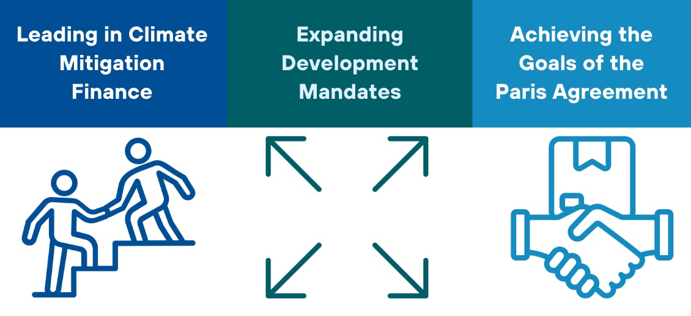
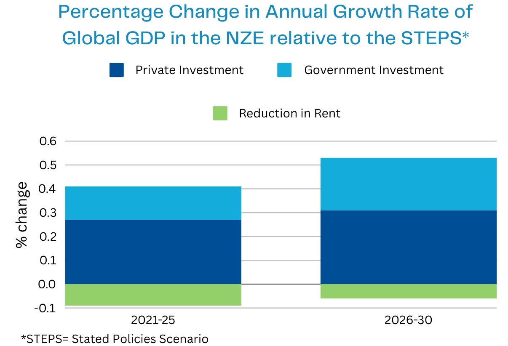

**Proposal Overview**

**Multilateral Development Banks (MDBs)** have a pivotal role in driving the global green transition, yet the scope and scale of their involvement remain key questions. This paper examines the various roles MDBs, particularly the World Bank Group (WBG), could and should assume to scale climate action. We explore the dual role of MDBs as financial institutions and policy influencers, with a focus on the WBG’s unique ability to provide both investment lending and policy-transforming support. In addition, we address the WBG’s involvement in the development of critical carbon market instruments.

The paper’s analysis spans several dimensions: the WBG’s mission, financing products, the challenges and opportunities for scaling efforts, and the critical role MDBs plays in creating dynamic policy incentives. We argue that the WBG, given its scale and leadership position, should expand its mandate to prioritize nature protection and significantly increase climate mitigation financing. By addressing these core issues, MDBs can more effectively catalyze the global green transition and drive meaningful progress toward climate goals.

**\**

**Key Issues to be Addressed**

***POLICY INCENTIVES:*** Achieving global net-zero emissions necessitates coordinated national policy actions and increased investments in clean energy. Developing countries often grapple with the challenge of prioritizing development goals, which can sideline critical climate initiatives.

***SCALABILITY:*** Ideally, any national government or municipality aiming for a swift transition to net zero (by 2050 or sooner) but struggling to attract significant private investment or access low-cost financing, should receive financial support from the World Bank or another MDB. However, the availability of such funding remains limited.

***MISSION AND MANDATE of MDBs:*** Each MDB has its own mandate. The World Bank has two ambitious goals: to end extreme poverty within a generation and boost shared prosperity on a liveable planet. While this mission implies the preservation of the planet's climate, the World Bank and other MDBs should broaden their mandates to *explicitly* commit to achieving the Paris Agreement’s temperature targets.

Source: [IEA (2021)](https://iea.blob.core.windows.net/assets/deebef5d-0c34-4539-9d0c-10b13d840027/NetZeroby2050-ARoadmapfortheGlobalEnergySector_CORR.pdf)

**\**

**Implementation**

1.  **Identifying opportunities for MDBs to scale up their efforts in providing more extensive, low-cost financing for climate and development projects.** For instance, the International Bank for Reconstruction and Development’s (IBRD) "super seniority" status incentivizes countries to prioritize repayments, reducing the bank's risk and allowing it to offer lower interest rates.

2.  **Reforming the envelope system to create a more flexible and responsive financing framework**. This could involve strategies such as risk transfer, syndicated lending, parallel capitalization, or establishing separate entities to achieve greater scale.

3.  **Setting up additional risk-absorbing equity and insurance funds.** For example, a blended equity fund combined with an approved project list; debt financing can be scaled through the creation of synthetic sovereign bonds.

4.  **Incentivising ‘strong’ Paris compliant projects through a universal incentive for policy action.** For example, a central institution like the World Bank could establish policy standards, such as a carbon price of \$100/tCO2 rising to \$200/tCO2, needed to achieve a 1.5°C temperature target. In exchange for adopting these policies, countries would receive financing for the necessary net-zero investments.

5.  **Act now or lose out**! Incorporating the Dixit/Pindyck ‘real option’ dynamic incentive model can encourage immediate action. The goal is to create incentives that prompt countries to act now rather than delay. For example, ensuring financing is initially available on favourable terms, with the terms becoming progressively less favourable over time. This creates urgency and motivates early action by making delayed participation less profitable.
