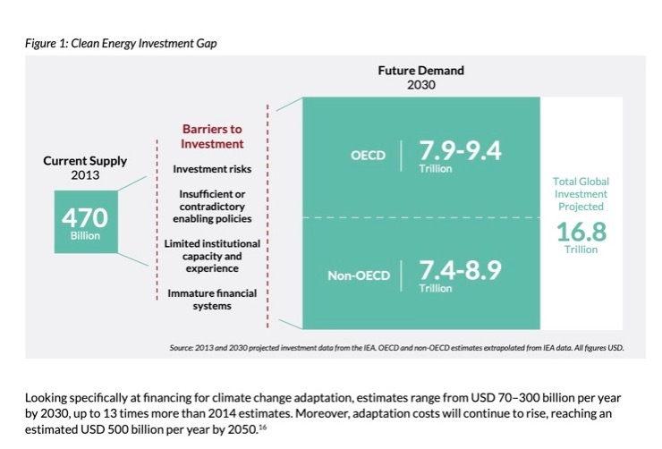
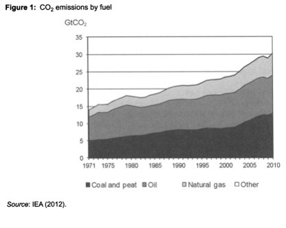
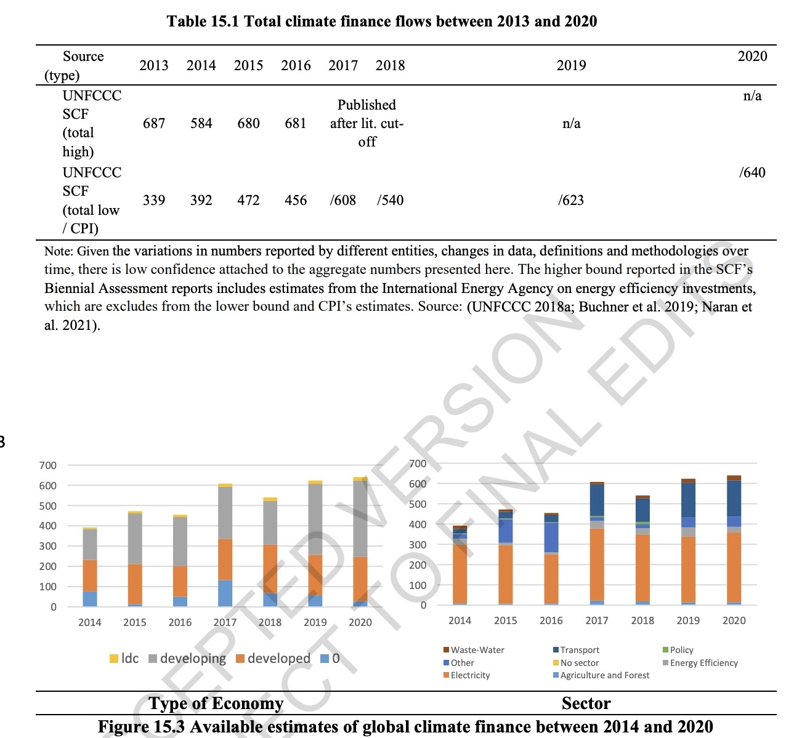
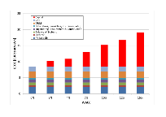

# Table of Contents

# Cheap Money, Warm Planet

*Ideas for financing the transition*

# Preface: Why New Thinking Is Needed

This book puts across five new ideas for climate: national feebates, international feebates, contracts for difference, positive framing, and dynamic incentives with collective action voting schemes.

### Two Directions

Thinking about climate runs in two directions: from the present to the future, and from the future to the present.

### Borrowing for Climate

Since climate change is an obligation on us to take care of the future, it is incumbent on us to account for that in our thinking. Economists have the idea of a Pareto improvement — an outcome in which everyone is better off. In this case, that means the future should pay the present.

More precisely, it means the present should borrow from the future to pay for the investment climate change requires. The borrowing exists to incentivize present-day countries to make the right choices. How? The original borrowers would be countries in proportion to their historical responsibility, beginning at USD 1 per historical ton emitted. The United States is the largest historical emitter, at 400 billion tonnes. Countries would borrow according to historical emissions if they choose to participate. The maximum liability for historical emissions is USD 100 if a country joins now, but only USD 1 is payable at present. Rather than issuing bonds, countries would issue SDRs for the quantity of their historical emissions.

### Positive Framing

Positive framing is a simple idea: agree on something that everyone can agree on. Don’t lead with what is tricky or unpopular.

### Carbon Pricing

Two themes recur throughout what follows: redundancy in carbon pricing — why overlapping instruments are a feature rather than a flaw — and risk reduction as a climate policy in its own right. The first is developed in Parts I and II, the second in Parts III and IV. *\[Section to be written.\]*

### Climate Café

*\[Section to be written.\]*

# Part I — Pricing Without the Politics

## 1. Why Feebates Beat Carbon Taxes

Economists have spent thirty years explaining that the cheapest way to cut emissions is to price them. Governments have spent thirty years discovering how hard that is to do. The gap between the two is not a failure of economics. It is a failure to take the politics of pricing as seriously as the arithmetic.

This chapter makes four claims, which together set up much of the rest of the book.

**First, a carbon tax is dominated by a feebate on political-economy grounds.** A feebate charges emitters above a benchmark and pays those below it, with the two flows designed to roughly cancel. It delivers the same marginal signal as a tax — a ton avoided is worth the same either way — while raising little or no net revenue. That sounds like a weakness. It is the source of its strength. A tax creates a visible class of losers who can organize; a feebate creates winners and losers inside the same industry, and the winners have every reason to defend the scheme.

**Second, feebates are better from the international perspective.** A country that taxes carbon unilaterally hands a cost advantage to its competitors and invites carbon leakage. A country that runs a feebate does not: because the average firm pays close to nothing, the sector-wide cost burden is small, while the incentive to be cleaner than the average is undiminished. This makes the instrument far easier to adopt without waiting for everyone else, which matters enormously when the alternative is waiting for a global agreement that has not arrived.

**Third, procurement auctions coordinate better across time than a given price.** A carbon price tells an investor what emitting costs today. It does not tell them what the price will be in 2040, which is the number that matters when the asset lasts twenty-five years. A reverse auction for a fixed quantity of renewable capacity does the opposite: it fixes the quantity and lets the market discover the price. Where the policy objective is to build a certain amount of something by a certain date, quantity instruments coordinate the investment path more reliably than price instruments do.

**Fourth, and consequently, renewables financed through procurement auctions carry a lower cost of capital.** An auctioned power purchase agreement converts a merchant project exposed to volatile wholesale prices into a contracted project with a predictable revenue stream. Lenders price that difference. Since renewable energy is capital-intensive — most of its lifetime cost is the cost of the money used to build it — a few percentage points off the discount rate matters more than almost anything else a policymaker can do. This is the thread that runs through Parts III and IV.

### The Logic of Collective Action

Behind all four claims sits a single principle of political economy, which is worth stating explicitly because the rest of the book leans on it. Following Mancur Olson, call it the logic of collective action.

A necessary condition for a policy to be politically feasible is that its benefits be concentrated and its costs diffuse, rather than the reverse. Where costs fall on a group that can organize, incentivize and coerce its own members — a trade association, a state-owned utility, a regional industry — that group will lobby to block the policy. Where benefits fall on such a group, it will lobby for it. Costs or benefits spread thinly across millions of households are individually too small to be worth acting on, and the transaction cost of organizing those millions is prohibitive.

This is uncomfortable for climate policy, because a conventional carbon tax has exactly the wrong shape. Its costs are concentrated on identifiable emitters in power, industry, transport and buildings. Its benefits are diffuse: a slightly better climate for everybody, decades hence, and some revenue that flows into the general budget where nobody in particular can point to it. Green subsidies, by contrast, are naturally compliant with the logic — concentrated beneficiaries, diffuse funding — which is one reason the world has rather more of them than it has carbon taxes.

The usual reply is that the revenue can be recycled. But the standard recycling proposals are macroeconomic in flavor — cuts in labor taxes, reductions in corporate rates, a uniform per-capita dividend — and are insufficiently targeted to solve the problem. A per-capita rebate leaves the heavy emitters comprehensively out of pocket, and losers are reliably more motivated to resist than winners are to support.

### A Rebate Design That Passes the Test

Here is a design that does pass. Rank sectors by emissions intensity per unit of gross value added. For those above the average — power first, then heavy industry — do not impose a tax at all. Impose a feebate, with the neutral point set as close as possible to recent historical usage. Do the same for domestic and commercial buildings: not a charge on energy, but an incentive calibrated against what each user has recently consumed.

A system of incentives benchmarked to recent history, running at a slightly negative net revenue, has three properties worth having.

It gives everybody a large marginal incentive to cut emissions, because the fee and the rebate are both live at the margin even when they cancel on average.

It creates no concentrated losers, because the benchmark is each participant’s own recent behavior rather than an abstract standard that happens to favor whoever is already clean.

And — this is the subtle one — it is slightly unfair, which is a virtue. Grandfathering to historical usage hands different participants different endowments of rebate for no defensible reason. That arbitrariness creates its own pressure, over time, to move toward a fairer common benchmark. The sequence matters: the climate incentive goes in immediately, and the substantial revenue, along with the opportunity for genuine tax reform, arrives later. This is close to the reverse of what is normally expected of a carbon tax, and that is the point.

*References: Pahle, Michael, Oliver Tietjen, Sebastian Osorio, Florian Egli, Bjarne Steffen, Tobias S. Schmidt, and Ottmar Edenhofer, “Safeguarding the energy transition against political backlash to carbon markets,” Nature Energy 7, no. 3 (2022): 290–296. IEA, World Energy Outlook 2020. Olson, Mancur, The Logic of Collective Action.*

## 2. The Energy Price Crisis and the Case for Feebates

The argument of the previous chapter can look abstract until a real crisis arrives and governments have to choose an instrument in a hurry. Europe’s gas crisis of 2022 was such a moment, and it is worth walking through, because almost every government reached for the one tool the logic of collective action would have warned them against.

### The Shape of the Problem

The immediate trigger was the war in Ukraine and Europe’s dependence on Russian gas. That dependence was not uniform. It differed sharply by member state, and it differed by end use: gas went into power generation, into industrial process heat, and into household heating, and each of those has a different substitution possibility on a different timescale. Any serious policy response had to disaggregate.

Europe also faced what might be called the Gazprom double bind. Sign long-term contracts, and you lock yourself into Russian gas for a decade. Buy on the spot market instead, and you expose yourself to the dominant supplier’s market power — the supplier can throttle flow, drive up the hub price, and collect more revenue on less gas. Neither door was safe. The composition of Europe’s purchases had in any case shifted: more than 80 percent of Gazprom’s delivered volumes had a direct link to trading hubs, with only around 13 percent still linked to oil prices, so the spot exposure was larger than the long-term-contract framing suggested.

The price moves were extraordinary. Natural gas prices reached record highs. The World Bank’s energy price index rose 34 percent between January and March 2022, on top of a 50 percent increase between January 2020 and December 2021. Crude oil rose roughly 350 percent in nominal terms from its pandemic low in April 2020 to April 2022. Modelling of the baseline upward revision to oil prices, if driven by supply shocks, suggested a reduction in global output of about 0.3 percent after two years.

### Why Subsidy Makes It Worse

The instinctive response — hold the consumer price down — is the wrong one, and not only for the usual fiscal reasons. In a shortage, price is doing necessary work. Suppressing it makes the scarcity worse.

There are four distinct reasons to resist the subsidy reflex.

It slows the transition away from the very dependence that caused the crisis. Cheap gas is an argument for more gas boilers.

It pushes governments toward high-carbon substitutes. Several countries, France included, moved to reopen coal plants to cover the coming winter’s power shortfall — a response that trades an energy problem for a climate one.

It consumes fiscal space that is not there. The conversation about constrained public finance usually concerns developing countries, but after the pandemic several European states, France and Italy among them, were carrying very high debt. Italian debt came under visible market tension around Mario Draghi’s resignation. Broad energy subsidies are an expensive way to spend borrowed money.

And it fails to change long-run household behavior, which is precisely what a durable answer to gas dependence requires. A subsidy tells households the problem is temporary. Insulation and heat pumps are decisions taken on the assumption that it is not.

France illustrates both the temptation and the partial escape: the government moved to grant allowances targeted at low-income households as part of a broader cost-of-living package, rather than holding down the price for everyone.

There is also a definitional trap worth flagging, because it distorts the debate. A tax on energy shows up in the inflation index. A revenue-neutral incentive largely does not, since the fee and the rebate offset. Two policies with the same marginal signal therefore look very different in the headline number that finance ministers are judged on. That is an argument for the feebate, not against it.

### Direct Assistance, Properly Targeted

If prices must be allowed to do their work, the distributional problem has to be handled directly rather than through the price. The tools are targeted transfers to vulnerable households and output-based rebating for exposed industry. Both preserve the marginal incentive to economize — the household still faces the true price of the next unit of gas, the factory still faces the true price of the next unit of process heat — while protecting the level of income or competitiveness. This is the same structural insight as the feebate: separate the incentive from the burden.

Alongside this sat a set of quantity and efficiency measures that were genuinely useful. The EU’s “Save gas for a safe winter” plan set demand reduction targets. The IEA’s ten-point plan for reducing reliance on Russian gas emphasized heat pumps, thermostat settings and efficiency retrofits. National measures followed in France, Germany and Italy. Lessons from the shocks of the 1970s point the same way: efficiency standards and renewable mandates proved highly effective, while price controls and the promotion of coal for power generation produced market distortions and environmental damage that took decades to unwind.

### The Feebate Answer

The instrument that fits this problem is the one from Chapter 1: an incentive that does not raise net revenue.

Consider the power sector first. A charge on gas used for generation gives every generator a reason to move away from gas — or, if they cannot, to run their plant more efficiently. Refund the proceeds per kilowatt-hour generated. Consumers’ bills are relieved directly, the sector as a whole is roughly whole, and the relative price of gas-fired against non-gas-fired generation has moved decisively.

In heavy industry, the same structure works with a different rebate base: charge on gas use, refund per physical unit of output. A steel plant that makes a ton of steel with less gas than its competitors comes out ahead. A plant that does not, pays. Neither faces a sector-wide levy that would simply relocate production outside Europe.

For households, a benchmark feebate can be built from a combination of historical usage and a per-capita allocation — the first to avoid punishing people for a housing stock they did not choose, the second to stop the benchmark from permanently rewarding the profligate. Feebates can also be pointed at the durable decisions rather than the flow: disincentivize new gas boilers, reward heat pumps, and the household’s next twenty years of gas demand is settled by one purchase.

A feebate can be levied directly on the CO2 content of a product, with the proceeds rebated per unit produced. In the European context the fee base could be gas consumption alone, all fossil fuels weighted by carbon content, or all fossil fuels weighted by full greenhouse-gas content. The last is the right choice. If the objective is both to meet climate goals and to curtail dependence on Russian gas, it is past time for Europe to run a greenhouse gas policy rather than a carbon dioxide policy.

### Burden Sharing Across the Union

Any Europe-wide action immediately raises the question of who bears what. Here too the feebate has an intergovernmental form. Member states could be allocated a quantity of gas at market prices, with imports of Russian gas taxed across the Union and states consuming beyond their quota paying more — a structure closely analogous to the double quota systems long used in agricultural production control.

A common financial facility for heat pumps would work on the same principle at the level of investment rather than consumption: countries that act more aggressively draw more from the pot. And there is no reason to stop at the Union’s borders. A burden-sharing structure designed to include non-EU and non-European participants becomes a prototype for exactly the kind of international arrangement that climate mitigation will eventually require. A crisis instrument, if designed properly, is also a climate instrument.

*Sources for this chapter include the IMF blog on the macroeconomic effects of a Russian gas cutoff, Bloomberg reporting on Gazprom contract pricing, the World Bank’s Global Economic Prospects, the European Commission’s “Save gas for a safe winter” plan, and the IEA’s ten-point plan and commentary on EU gas market liberalization.*

## 3. Commitment Devices: Contracts for Difference and Price Floors

A price signal that investors do not believe is not a price signal. It is an announcement. This chapter is about the instruments that turn one into the other.

### The Credibility Problem

Carbon pricing as actually practiced rarely delivers the certainty that long-lived investment requires. Emissions trading schemes produce a volatile price by construction: the quantity is fixed, so all the adjustment happens in the price, and the price then swings with the business cycle, the weather and the politics of allowance allocation. Carbon taxes are steadier in principle but sit inside the budget, where a rate set in one fiscal year can be changed in the next. Either way, the number an investor must plug into a twenty-five-year model is a number no government has promised to maintain.

Commitment devices, price floors and price caps address this directly. They keep the price within a band that investors and international agencies can rely on, and they do so through mechanisms that are costly for a future government to reverse.

Two distinct reasons make this worth doing.

The first is international. A policy commitment that is credible and hard to unwind is worth more, in negotiation and in the design of conditional finance, than one that can be reversed after the next election. This has a direct implication for how development institutions should design their conditionality: a prior action consisting of a long-term commitment should count for more than one that does not. A carbon tax legislated for this year is a gesture. A carbon tax with a statutory floor trajectory and contractual counterparties is a commitment.

The second is investment. Private agents need certainty to fund long-term projects whose costs exceed the incumbent alternative’s. This is most acute exactly where it matters most — in high-risk environments, in developing countries, and for green technologies competing against an established fossil incumbent that has already amortized its capital.

### Contracts for Difference

Contracts for difference are the sharpest tool in this category. A CfD is a contract issued by a government guaranteeing that a particular policy will keep providing a price signal over the life of an investment. It works by defining a strike price. If the market price — of carbon, or of power, or of hydrogen — falls below the strike, the government pays the difference. Most CfDs are two-sided: if the price rises above the strike, the counterparty pays the government back, so the arrangement generates revenue in exactly the states of the world where the policy is succeeding on its own.

What this buys the investor is a return above breakeven for the duration of the project. That is the thing investors actually need and the thing that pricing instruments, emissions trading schemes above all, are structurally incapable of providing. The design is already proven: CfDs are established in electricity markets and are being used in emerging hydrogen markets, and in both cases they have been decisive in getting low-emissions alternatives financed.

The fiscal logic deserves emphasis, because it is often misread. A two-sided CfD is not a subsidy. It is a swap of price risk for quantity certainty, in which the government takes on a risk it is better placed to bear — it is, after all, the party that controls the policy — in exchange for a much lower cost of capital on the project. As Part III argues at length, that lower cost of capital is where most of the value is created.

### Carbon Price Floors

The blunter version of the same idea is a floor: a commitment that the carbon price will not fall below a stated level. Floors do less than CfDs for any individual project, since they guarantee a minimum rather than a return, but they are administratively simpler and they do one job extremely well. A credible floor is what forces high-emission incumbents — coal generation above all — out of the merit order and keeps them out. Without a floor, a coal plant can simply wait for the allowance price to soften. With one, it cannot.

Floors and CfDs are complements rather than substitutes. The floor sets the level below which the system will not fall; the CfD converts that system-level assurance into a project-level revenue stream that a lender will accept as collateral.

## 4. Scarcity Rent: Prices, Taxes, and Rationing

The gas crisis raised a question that pricing theory answers unusually cleanly: when a commodity’s supply cannot adjust and its demand will not, who should capture the resulting windfall?

### Why Prices Went Where They Went

How does one explain prices eight times higher in one year than the last? Supply was constricted and could not adjust quickly. LNG terminals were being built, but terminals take years. With supply effectively fixed in the short run, the only remaining equilibrating mechanism is demand destruction — and if demand is highly inelastic, as heating and industrial process demand are over a single winter, prices must rise to extraordinary levels before enough demand goes away.

This is not a market failure. It is a market doing the only thing available to it. But it has a striking distributional consequence: the enormous gap between the cost of producing the gas and the price paid for it — the scarcity rent — accrues to whoever holds the gas. In Europe’s case, substantially to Russia.

### The Ramsey Argument

An inelastic commodity is a tempting object of taxation, and the observation is old. Frank Ramsey’s rule holds that commodities with the lowest elasticity of supply and demand should be taxed the most, since the deadweight loss of a tax depends on how much the tax changes behavior, and by assumption here it changes it very little.

The Ramsey logic is doubly compelling in a scarcity episode. Prices have to climb to astronomical levels before demand falls enough to clear the market. That money is going somewhere regardless. If a tax were used to limit demand instead, the same demand reduction would occur, but the funds would stay inside the importing bloc and could be refunded to domestic industry and households — which is to say, the competitiveness problem and the cost-of-living problem could both be addressed with the rent that is currently being exported.

Put plainly: the choice is not between high prices and low prices. Supply is fixed; the price that clears the market is what it is. The choice is about who collects the difference.

### Why This Is Harder Than It Sounds

Two obstacles stand in the way, one economic and one political.

The economic one is market geography. Coordinated demand-side taxation of oil is genuinely difficult, because oil trades globally and a bloc that taxes it simply reallocates supply toward those who do not. Gas is different. It is a regional market, linked only partially and expensively through LNG, which means a large importing bloc has real monopsony power. And the European Union is the rare importing bloc that pools sovereignty and can coordinate policy across its members. If the Ramsey argument is ever going to be applied in practice, gas in Europe is the case.

The political obstacle is the one this book keeps returning to. Reducing demand through flexible taxes or a cap-and-trade system on individual fuels is analytically attractive and politically very hard, for exactly the reasons set out in Chapter 1: the costs are concentrated and visible, the benefits diffuse and delayed.

Which brings the argument back to the same place. It makes obvious sense for Europe to capture more of the scarcity rent associated with restricted supply rather than pay extortionate prices to the dominant supplier. Doing it through taxation alone is, at present, close to politically impossible. Doing it through a feebate — same marginal signal, no net revenue, no concentrated losers — is not.

*Author’s notes for this chapter: the oil price cap, or consumer cartel, idea is easiest to implement through prices, taxes or a permit cap, and easiest of all with gas. A fee on gas imported by pipeline could also be justified on greenhouse-gas emissions grounds. \[Brief No. 3.\]*

## 5. The Power Sector and Carbon Pricing

Every argument in this book about pricing eventually has to be tested against one sector, because one sector carries most of the load. This chapter sets out why the power sector is the place where carbon pricing does its best work, and what specifically complicates it there.

### Why Power Comes First

Electricity matters twice over. It is a large emitting sector in its own right. But it is also the principal energy carrier for a decarbonized economy: in almost every net-zero pathway, transport, heating and a large slice of industry are electrified, which means their emissions become the power sector’s emissions. Decarbonizing power is therefore not one task among several. It is the precondition for the others. The power sector cannot serve as the clean energy source for the whole economy until it is itself clean.

Carbon pricing acts on power through three distinct channels, each operating on a different timescale: the *generation* decision, which responds within hours as the merit order reshuffles; the *retirement* decision, which responds over months and years as plants become uneconomic; and the *investment* decision, which responds over decades.

### Two Features That Cut in Opposite Directions

The first is that power is an unusually economic sector — in the sense that its decisions are made on relatively clean cost comparisons, and its assets are dispatched by merit order. Shifts in relative prices caused by carbon pricing therefore produce large shifts in emissions at reasonable cost. This is carbon pricing at its most effective, and it is the strongest single argument for putting a price on carbon at all.

The second cuts the other way: the power sector in much of the world, and in most developing countries, is state-owned. Economic sensitivity to a carbon price is only as strong as the decision rules of the entity making the decisions. A vertically integrated state utility operating under a politically set tariff, a mandate to keep the lights on and a balance sheet that the finance ministry ultimately underwrites will not respond to a carbon price the way a merchant generator does. It may not respond at all. Any serious program of work here has to assess in detail how different market structures — merchant, single-buyer, vertically integrated state monopoly — actually transmit a carbon price into generation, retirement and investment decisions. Chapter 13 returns to this.

### The Pass-Through Problem

Carbon pricing also acts on the demand for power. Because power is at present often highly emissions-intensive, a carbon price raises its cost, and that increase passes through to end consumers. This is where the politics bites, and there are three distinct challenges with the pass-through.

The first is distributional. Electricity is close to a necessity, and spending on it takes a larger share of poor households’ budgets than of rich ones’, so an unmitigated pass-through is regressive. This is a solvable problem — Chapter 2’s argument for targeted transfers and per-capita rebate components applies directly — but it must actually be solved rather than assumed away.

The second is that the pass-through works against electrification. Raising the price of electricity to reflect its current carbon content discourages exactly the switching — from gas boilers to heat pumps, from internal combustion to electric vehicles — that the strategy depends on. The instrument bites hardest on the substitute it is trying to promote. This is a strong argument for the output-based rebating of Chapter 2: charge on the fuel, refund per kilowatt-hour delivered, and the generation mix moves without the retail price rising.

The third is credibility, and it loops back to Chapter 3. Where tariffs are regulated or politically set, a carbon price that would raise consumer bills is the carbon price most likely to be suspended, exempted or reversed. A pass-through that cannot survive a bad winter is not a signal investors will finance against.

## 6. Green Policy as Growth Policy

The last chapter of this part makes a larger claim than the others, and one that runs beneath much of the rest of the book: that building a low-risk financial system around green assets is not merely a way to finance decarbonization, but a way to improve how the macroeconomy works.

### How Financial Systems Split

Financial systems tend to evolve into two parts. There is a no-risk part — the banking system, ultimately guaranteed by the central bank and the state — and a risky part. Macroeconomic policy operates almost entirely on the first. When a central bank moves interest rates, it moves the price of safe money, and the assets that respond most are the low-risk ones: those with some form of factor monopoly, such as land, or some form of market power, such as equity in large incumbent firms, particularly resource extractors.

This has two unattractive consequences. It makes the economy unstable, because monetary policy transmits through asset prices rather than through productive investment. And it makes it more unequal, because the assets that respond are the assets the already-wealthy hold.

### The Case for a Green Safe Asset

The proposal is to deliberately construct a low-risk financial system around green assets — the derisking structures of Parts IV and V are, in this light, the machinery for doing exactly that.

The first benefit is macroeconomic sensitivity. If green assets are safe assets, then low interest rates transmit into building things rather than into bidding up land. Growth becomes more responsive to monetary easing. There is even the possibility of interest rate separation: a green sector funded at rates distinct from the rest of the economy, which would give policymakers an instrument they currently lack.

The second benefit is specific to developing countries, and it is the more striking of the two. Many countries with weak currencies face a choice between dollarization and a high domestic cost of capital. Green financial assets denominated in something other than the dollar could serve as an alternative numéraire — and unlike dollarization, the assets underlying it would be physically located and economically productive inside the country rather than parked abroad. Capital that would otherwise flee stays and generates power.

Such an instrument could plausibly function as an international reserve asset. More immediately, it could serve as the denomination for long-term financial liabilities such as power purchase agreements. What one wants from a numéraire for a twenty-five-year PPA is that it be strong, stable and accessible to a developing country that has, at minimum, a solar industry. A green asset of this kind is a candidate on all three counts.

This would resolve a dilemma that recurs throughout the rest of this book: dollar-denominated debt is cheap but carries currency risk that has bankrupted governments, while local-currency debt carries far less currency risk but costs far more. A green numéraire, backed by real assets generating real revenue inside the borrowing country, is an attempt to have both. Chapter 21’s proposal for a solar-panel-backed currency is the most developed version of the idea.

# Part II — A New Logic for Carbon Markets

## 7. The Global Social Cost of Carbon, Set by Technology Competition

Carbon markets rest on an accounting convention so intuitive that it is rarely examined: one ton emitted here can be cancelled by one ton removed there. This chapter argues that the convention is wrong, that it is holding the price of carbon far below where it should be, and that replacing it would unlock a great deal more mitigation from the same money.

### The Proposal in Brief

The argument is for a social cost of carbon defined not by a committee or a discount-rate assumption but by a technology competition — by the observed, competitively bid cost of removing carbon from the air inorganically. A ton of emissions would then be certified as offset only if the buyer pays that full global social cost.

Crucially, the money does not have to be spent on air capture. A second market allocates the funds to whatever delivers the most mitigation per dollar. So one ton of emissions, offset at the air-capture price, might purchase five tons of avoided deforestation. Net-zero commitments in the developed world, by companies and by countries, would pay for the conservation in the developing world needed to preserve carbon stocks that are genuinely irreplaceable — while simultaneously funding the technology that will eventually be needed for sustainable drawdown at scale.

Achieving this requires three institutional pieces:

1.  Global auctions for inorganic carbon drawdown, which set the price.

2.  A process for determining the cost-effective use of the funds: a global assessment of organic carbon drawdown and protection cost-effectiveness.

3.  A consistent standards body that certifies offsets as gold standard only if the buyer has paid the price established in the auction.

### The Context

Compliance carbon markets and the voluntary offset market are a promising source of funds for mitigation, and particularly for preserving and enhancing forests. The basic transaction is sound: corporations or countries pay others to make reductions they cannot economically make themselves. That is what a market is for.

The problems are real too, and they are widely recognized. The price is too low to give a good incentive, and the effectiveness of the resulting mitigation is too uncertain to justify the claims made for it. These are usually treated as two separate scandals — a price scandal and a quality scandal. They are in fact the same scandal, and the accounting convention is what connects them.

### The Current Logic and Why It Fails

At present, carbon markets work one ton for one ton. One ton of emissions is deemed offset by one ton of drawdown, typically from forests. The buyer’s emissions and the seller’s sequestration are treated as fungible.

This paper argues against that idea, and for a global mitigation price set by the cost of inorganic drawdown — air capture. Offsets purchased at that price could then pay for multiple tons of, say, organic forest protection. Concretely, that price might be somewhere around \$200/tCO2.

### The Argument from Economic Theory

The theoretical case starts from an observation that is uncomfortable but hard to dispute. Economic theory tells you to pay the marginal cost at the social optimum. It does not tell you to pay the marginal cost in whatever market happens to exist. And the market for emissions and emissions drawdown is nowhere near the social optimum, and shows no sign of approaching it.

Look at where we actually are. There is far too little emissions drawdown, which means the price is too low. There is far too little emissions reduction, which also means the price is too low. Both margins point the same direction. The prices observed in today’s offset markets are prices from deep inside a badly under-abated equilibrium, and using them to value a ton of carbon is like using famine-era rationing prices to value food.

There is a second, more formal way to see it. Take the global social optimum to be the intersection of a global marginal abatement cost curve and a global marginal damage cost curve. Since we are demonstrably not at that intersection — emissions are higher than optimal and the price paid is below the optimal level — a gold-standard offset market should pay the social cost *at* the optimum, not the shadow price of our current position. The cost of drawing CO2 out of the atmosphere is a reasonable upper bound on that social cost. And given the economics of catastrophic risk — the property losses from flooding coastal cities alone would run to trillions — it may well be the lower bound too. When the plausible upper and lower bounds converge, that is a good sign the number is usable.

### The Argument from Practice

The practical case is about trajectories. A 1.5C-compliant path requires that developed countries reach *financial* net zero well before the date at which everyone has committed to territorial net zero. Financial net zero means every country and every consumer group commits to offsetting all the emissions from each of the sectors that emit — and then that money is directed to protecting the carbon stocks we already have, creating more, and funding the technology markets that will eventually take carbon out of the atmosphere altogether.

The theory and the practice happen to agree, which is reassuring. It is not right that emitters carry on emitting while paying a paltry carbon price. The credits they buy are often of limited credibility and may be impermanent — a protected forest can burn, or be logged after the contract expires. Paying for multiple tons is a far better response to that uncertainty than assuming every purchased ton was permanently sequestered. And genuine conservation activities need more money than they are getting, not more credits.

It is worth being clear that this is an argument for carbon markets, not against them. It would be much better for mitigation if there *were* a proper carbon market in the world. At some abatement cost, offsetting genuinely beats eliminating — aviation is the standard example, and probably the right one, since the alternative fuels are expensive and the emissions are hard to abate. The objection is not to trade. It is to the price.

### What Is Needed to Make It Work

So what would it take to build a world in which the developed world pays for the protection of carbon stocks worldwide, and new technologies arrive to take carbon out of the atmosphere entirely? Three things, each of which is a recognizable institution rather than a wish.

**A technology market for carbon capture, to set the global social cost of carbon.** This is a worldwide competition to determine the cheapest way to draw carbon out of the atmosphere: a global reverse auction, with each contract covering a plant sized at roughly 20 MtCO2 of lifetime removal — say 1 MtCO2 per year for twenty years. The winning bid sets the price. This is the same instrument that drove solar costs down through a decade of renewable auctions, applied to a different technology; and it has the same property, that the price is discovered rather than asserted.

**A mechanism for the most cost-effective use of funds.** This is a scientific and economic assessment exercise, and it should be designed by scientists rather than by market participants. If we know that deforesting the next 2 percent of the Amazon would trigger the loss of 75 percent of the remainder — through the forest-feeds-rain-feeds-forest dynamic — then that particular carbon is immensely more valuable than carbon at the margin elsewhere. Having identified it, one designs a cost-effective preservation mechanism for it, potentially through competition, and pays for that mechanism in different parts of the forest. Note that this makes the fund allocation deliberately non-uniform: the whole point is that not all tons are equal.

**A gold standard for offsets: pay the full price, and spend it well.** Only this logic would be certified as genuine net zero. Countries and companies would define a date for financial net zero, ahead of global net zero. Reaching it means paying the full auction-set price per ton of your emissions — but you receive several tons of mitigation for that money, because most of the time protecting rainforest is more cost-effective than air capture. The buyer’s claim is honest, the price is defensible, and the money goes where it does the most good.

## 8. Carbon Markets in the Context of Net-Zero Targets

The previous chapter proposed a new pricing logic. This one explains why the existing logic is not merely underpriced but structurally running out of sellers — and what has to replace it.

### The Sellers Are Disappearing

With the Paris Agreement and the definition of net-zero strategies for Europe, China, the United States and India, long-term strategies have become an established norm in the international community. Meeting the Paris temperature targets requires *global* net zero emissions by midcentury for a 2C target, and earlier than midcentury for 1.5C.[^1]

The distinction between national and global net zero is doing a great deal of quiet work here. A standalone *national* net zero target admits the possibility that emissions in one country are compensated by counterfactual emissions reductions — offsets — in another. A *global* net zero target does not. It requires that gross emissions be compensated by actual *sinks*: the permanent drawing-down of carbon from the atmosphere. And because the 1.5C budget, in particular, may well be overshot, there is the further prospect of needing to fund drawdown simply to come back down again.

This creates a problem for carbon markets that has not been widely absorbed. Where will the *sellers* of credits come from — which is to say, which countries will overachieve their targets? The offset model implicitly assumes some underachievement of stringent targets in developed countries, matched by overachievement of less stringent targets in developing ones. But under a global net-zero norm, developing countries will themselves need stringent targets, which are by construction very hard to overachieve. The supply side of the offset market is being legislated out of existence.

### What Carbon Markets Were Also For

That matters more than it first appears, because carbon markets were never only an efficiency device. They were conceived as a burden-sharing mechanism: a way to transfer resources from the richer developed world, which carries the historical responsibility, to the developing world, and thereby to give developing countries a reason to participate in global climate action at all.

Remove offset-based markets and the efficiency loss is manageable. The loss of the transfer channel is not. If offsets cannot do this work, the participation incentive has to come from somewhere, which means side payments in some form.

So the general question about how carbon markets should be structured for long-term strategies resolves into five requirements:

a.  a carbon *sink* logic rather than an offset logic;
b.  side payments to poor countries in return for stringency;
c.  an additional source of funding beyond offsets;
d.  a market-based logic for efficient selection of projects and policies; and
e.  fair burden sharing.

The rest of this book is largely an attempt to satisfy (b), (c) and (d).

### Funding

Side payments and drawdown both imply significant funding. Where might it come from? Three sources are worth examining, chosen to illustrate the range of what is possible rather than to exhaust it.

The first is gold-standard corporate net-zero commitments taken sometime before 2050 — in the 2030s, say. This is the demand side of Chapter 7’s proposal, and its attraction is that the money is voluntary and already notionally committed.

The second is sovereign co-guaranteed long-term borrowing — hundred-year maturities — repaid in proportion to historical emissions. This is the mechanism sketched in the preface: the present borrows from the future to prevent damage to the future, with the repayment key being cumulative responsibility.

The third is the concessionality component of scaled-up MDB-arranged lending. This could plausibly fund side payments, though probably not drawdown, and it is the subject of Part V.

### Assessing These by Political Economy

The right way to compare these options is not by their elegance but by whether they can survive contact with politics. Three components of political economy matter.

*Between nations.* States are sovereign and face something close to a prisoner’s dilemma. Any mechanism requiring simultaneous sacrifice by all parties will fail; mechanisms that reward early movers, or that make defection visible and costly, have a chance.

*Within nations.* Concentrated interests — fossil fuel interests above all — have more influence than diffuse ones, and every country has its own entrenched set. This is the logic of collective action from Chapter 1, applied at the level of international mechanism design, and it explains why instruments that need no net revenue travel better than instruments that need a lot.

*Across time.* Sacrifice later is considerably easier to agree to than sacrifice now. This is usually deplored as short-termism. It is more useful to treat it as a design parameter: a mechanism that front-loads the incentive and back-loads the payment is exploiting a real feature of political preference rather than fighting it.

### The Legal Character of an Emission

There is a legal dimension that carbon market design tends to ignore, and it strengthens the pricing argument of Chapter 7.

Emitting CO2 is not simply the consumption of a shared budget. It inflicts damage on identifiable agents across the world, in the future. Where there is potential legal liability for future damage, the appropriate response is to set aside money now to pay for it later — which is to say, it is a *capital* requirement, not an expense. This is the concept underlying both corporate emissions liability and national cumulative responsibility. An emitter who has not provisioned against the damage they are causing is running an unreserved liability, and no other industry is permitted to do that.

### Three Allocations

Finally, there are three distinct allocation questions, which are often run together and should not be.

**The allocation of money to its most efficient use.** This requires market design. Examples abound: renewables are procured through reverse auctions, in which the state contracts for a certain capacity and bidders compete on price. What matters in this allocation is *intertemporal* rather than static optimality — which may mean deliberately paying more for a particular technology now, because doing so moves it down its learning curve and lowers the cost of everything that follows. Static cost-effectiveness would never have funded solar in 2005.

**The burden-sharing arrangement.** One approach, close to the World Bank’s, recognizes the need for low-cost financing at scale in middle-income countries. What form the subsidy to middle-income countries should take is unclear, and the numbers involved imply that the available funds are insufficient — which suggests the arrangement will need both carrots and sticks rather than carrots alone.

**The intergenerational allocation.** Here there is the possibility of a genuine Pareto improvement, and it deserves more attention than it gets. If borrowing from the future funds the prevention of damage to the future, and the damage prevented exceeds the debt service, then every generation is better off. This is not redistribution. It is an investment that happens to cross a generational boundary, and the only reason it does not happen automatically is that the beneficiaries cannot yet sign the contract.

## 9. Phase Theories of Collective Action

The last thirty years of climate policy can be described in a single sentence: an extraordinary innovation success combined with a massive collective action failure. Solar modules fell in price by something like 90 percent. Global emissions rose. Any theory of what to do next has to explain how both things happened at once.

### Borrowing from Schumpeter

Schumpeter’s insight about innovation was that market structure and innovation interact: monopolists, contrary to the naive competitive story, may innovate more, because they can capture the returns. The suggestion here is to approach the green transition from the same angle but applied to policy — to ask whether competitive dynamics could inspire policy and collective action, and whether better and more dynamic policy could in turn generate innovation gains.

What this points toward is a *phase* model of policy, parallel to the familiar phase model of technology. Technologies pass through invention, demonstration, early deployment, mass deployment and maturity, and the right intervention differs at every stage. Policies plausibly do the same: policy innovation leads to coordinated policy diffusion, which leads to the creation of new norms.

### Elster’s Three Phases

Jon Elster provides a compelling account of how collective action actually gets going, and it maps onto the climate problem unusually well.

The first phase is driven by what he calls everyday Kantianism. Early movers act unilaterally, according to a rule they would wish to see universalized — they are, in the popular formulation, the change they want to see in the world. Such actors are not making a cost-benefit calculation, and criticizing them for irrationality misses what they are doing: they are creating the norm that later actors will respond to.

The second phase belongs to the utilitarians. These more pragmatic actors look for the diffusion of the new norm through local win-win arrangements. At the level of a state, the argument is about co-benefits and competitive advantage; inside a business, innovation is argued for as a business proposition. The essential move in this phase is to close the loop — to find a network of beneficiaries who can actually capture the gains, because a win-win that nobody can appropriate does not diffuse.

The third phase is the norm of fairness. By this point the new standard has been established as a social norm, and the question has changed from whether to comply to whether one is doing one’s share. Enforcement becomes largely social rather than administrative, which is what makes it cheap.

The practical value of this scheme is that it tells you the sequence of instruments is not arbitrary. Attempting a phase-three instrument in a phase-one world is the characteristic error of climate policy.

## 10. Innovation and Carbon Pricing

Putting the two previous chapters together yields a specific and somewhat heretical conclusion about carbon pricing: that it is the right policy at the wrong time, and that the sequence matters more than the instrument.

### The Missing Middle

Looking at climate strategies as they exist, we have different norms operating at different levels but no coherent process for getting from one stage to the next. The gap is most conspicuous in the middle. We lack policies for the *mass deployment* of technologies during the phase before carbon pricing can become dominant. Subsidy handles the early phase; carbon taxation handles the mature phase; the crossing between them is largely unmanaged, and it is where most of the world’s emissions currently sit.

A sequence theory of carbon pricing can be constructed to fill it. The Schumpeterian and game-theoretic grounds are the same: existing high-carbon interests will block carbon taxes unless incentives are tailored to prevent resistance and, better, to transform those interests into stakeholders in the new system.

### Three Phases, Three Instruments

In the early phase, green alternatives are small but expensive. Subsidies are close to optimal from a collective action perspective — concentrated beneficiaries, diffuse funding, no organized opposition. This is exactly the pattern that Chapter 1 identified as politically feasible, and it explains why the world has so much subsidy and so little taxation.

In the intermediate phase, low-carbon assets have a foothold and are growing fast. Subsidies now become too expensive, precisely because they are succeeding: the volume being subsidized has grown. Here a revenue-neutral tax with targeted sectoral rebating — a feebate — is the better instrument. It maintains the marginal incentive while the fiscal cost falls away, and it does so without creating the concentrated losers that would block a tax.

Later, and also earlier for sectors that are not carbon-intensive to begin with, carbon taxation with general revenue recycling is the ideal. By this stage the high-carbon incumbents are diminished, the alternatives are cheap, and the tax can do double duty as a revenue instrument and a climate one.

Getting there requires sectoral detail and a serious account of the political-economic dynamics of transformation — much as Schumpeter required an account of market structure rather than a single competitive benchmark.

### Conclusions

Six propositions follow from this part of the argument.

1.  Green development is concrete. It requires frameworks and platforms, not just prices.

2.  Research and development remain key, because the sequence starts with something to deploy.

3.  Secure property rights and derisked investment are prerequisites, not refinements — the subject of Parts III and IV.

4.  Supporting diffusion is critical, and not only for technologies. Policies diffuse too, and can be designed to diffuse faster.

5.  Policy forms and financial forms plausibly share the same dynamic diffusion processes, which means the same phase logic applies to instrument design as to technology support.

6.  Policy and norm diffusion could both lead to and be led by Schumpeterian green growth. The causation runs in both directions, which is what makes the virtuous circle possible — and what makes getting the sequence right so valuable.

## 11. Rewarding National Carbon Stocks: The Notional Capitalized Carbon Value

Chapter 7 argued that carbon in a standing forest is worth more than the offset market pays for it. This chapter proposes a mechanism for paying for it that requires almost no new money — by converting natural wealth into a lower cost of capital rather than into a cash transfer.

### Democratizing and Derisking Clean Energy Finance

Start with how development lending actually works. At the heart of the traditional World Bank business model is a relationship with governments. The Bank accesses finance cheaply on international credit markets and lends it on to governments. Through that relationship, the Bank’s preferred creditor status, and the project due diligence of its staff, the risk borne by the Bank is materially lower than the risk priced in the wider capital markets.

That gap — between the risk the Bank actually bears and the risk the market charges for — is the resource this proposal spends. It is not a budget appropriation, and it does not need to be voted through a legislature.

### The Problem

Countries with large carbon stocks, or other natural resources such as fossil fuel reserves, generally lack any mechanism for converting that natural wealth into tangible financial benefit. Worse, where the socially valuable act is *not* extracting — leaving fossil fuels in the ground — there is typically no incentive to do so at all.

Existing climate finance tools reward emissions reductions. They rarely reward large-scale carbon preservation. The result is an accounting system in which a country that has kept its forest standing for a century has earned nothing, while a country that clears it and then partially replants can be paid for the replanting.

The Notional Capitalized Carbon Value framework links carbon stocks to concessional financing, creating an incentive for conservation while lowering borrowing costs for sustainable investment.

### Why This Matters

Forests are critical for global climate stability, yet the countries that protect them receive limited financial recognition. Valuing carbon stocks and tying that value to concessional finance offers three things:

- Direct financial incentives for conservation, which reduce the pressure to exploit forests for short-term revenue.

- Lower borrowing costs for sustainable projects, enabling green growth and climate resilience.

- A transparent, rules-based system that rewards stewardship and penalizes emissions.

The last of these is the most important politically. Discretionary climate finance is negotiated, slow and unpredictable. A rules-based entitlement can be planned against, which means it can change investment behavior rather than merely rewarding it after the fact.

### Defining the NCCV

The construction is deliberately simple. Suppose a country has 100 MtCO2 stored in its forests and emits 1 MtCO2 per year from fossil fuels. Assign a notional value of \$100/tCO2. The country’s NCCV is then \$10 billion.

Each year, the NCCV is adjusted downward by the notional cost of net emissions — so 1 MtCO2 of emissions reduces it by \$100 million. The result is a balance-sheet-like figure, the country’s carbon capital, updated annually.

Two features of this design are worth noticing. It is a *stock* measure, which is what makes it reward preservation rather than change. And it is *notional*: no one is claiming the forest could be sold for \$10 billion, only that this is a defensible basis for allocating an entitlement.

### How the Balance Sheet Is Used

Suppose the \$10 billion NCCV is made available over a ten-year horizon, implying roughly \$1 billion of NCCV capacity per year. If MDB guarantees reduce the cost of capital by around 3 percent per dollar guaranteed, then the World Bank and other international financial institutions could deploy \$1 billion in guarantees per year, generating \$30 million in annual interest-cost reductions on qualified projects. Across the full ten-year envelope, the total concessional effect would be \$300 million.

Because that \$300 million is tied to carbon stocks, a portion — say one-third — could be earmarked specifically for forest protection. Projects benefiting from the earmark might receive a 3 percent reduction in weighted average cost of capital, offset by a 1 percent fee, for a net 2 percent reduction. The fee matters: it makes the scheme partly self-financing and it screens out projects that do not really need the support.

There is a refinement for the cases that matter most. In regions approaching ecological tipping points, the next 10 to 20 percent of forest area could be assigned a *leveraged* value, reflecting its amplified role in preserving the broader ecosystem through the forests-feed-rain-feeds-forest dynamic. This is the same insight as Chapter 7’s Amazon example, expressed as an entitlement rather than a price: the marginal hectare at the threshold is worth a large multiple of the average hectare, and a mechanism that ignores this will spend its money in the wrong place.

### Why This Works

The mechanism translates carbon wealth into lower financing costs, leveraging the MDBs’ preferred-creditor status to deliver interest-rate reductions on well-structured projects. The total allowable volume of interest reductions is tied to the NCCV and adjusts dynamically with emissions.

This makes the NCCV three things at once:

- a reward for maintaining forests and keeping fossil stocks unburned;

- a tax-like signal against burning carbon, since emissions shrink the entitlement; and

- an allowance for further cost-of-capital reductions on eligible projects, renewables in particular.

All of it is achieved at relatively low fiscal cost, because of the indemnification structure of MDB guarantees. That is the crux, and it connects this chapter to the whole of Part IV: a guarantee is not a grant. It consumes balance sheet capacity and expected loss rather than cash, which is why an institution with a strong credit rating and a long-term relationship with its borrowers can deliver a great deal of concessionality from very little money.

# Part III — Why Capital Costs Too Much

## 12. Derisking and Policy Reform

Parts I and II were about incentives: how to price carbon in a way that survives politics. This part is about money — specifically, about why the capital needed for the transition is either unavailable or unaffordable in the places that need it most, and what determines the price.

The organizing question is simple to state and hard to answer. How should we reduce the gap between available finance and needed investment in green technology? This chapter approaches it from three angles: the size of the gap and the barriers that create it; a system-dynamic view encompassing policy complementarity, tipping points and economies of scale; and finally the specific realities of developing countries.

### The Green Finance Gap and Investment Barriers

The IEA estimates global green financing needs of about \$3 trillion per year, split roughly equally between power generation, end-use technologies and infrastructure (IEA, 2021a, 2021b). For developing countries excluding China, the figure required is around \$600 billion in annual capital spending by 2030.

Set against that, the historical record is sobering. Between 2000 and 2017 total investment came to \$138.9 billion (IRENA, 2020) — not per year, but cumulatively. The gap is not marginal. It is close to an order of magnitude, and closing it is not a matter of adjusting the terms on which capital flows but of building channels that do not currently exist.

It matters, too, that “finance” is not one thing. The investor base is heterogeneous — commercial banks, institutional investors with long liabilities, project developers, development finance institutions, domestic savers — and each responds to a different mix of risk, tenor and instrument. A policy that mobilizes one pool may be irrelevant to another. This is a theme that recurs throughout Parts IV and V: the instrument has to be matched to the investor.

So what are the barriers? Three stand out. Transaction costs, which fall disproportionately on small projects and make the very deals that developing countries can execute uneconomic to arrange. The complexity of available climate funds, each with its own application process, eligibility rules and reporting requirements, which imposes a capability tax on precisely the governments least able to pay it. And the risks associated with the innovative nature of the solutions on offer, which is a genuine problem rather than an imagined one: a technology with no local operating history has no local track record to lend against.

Overcoming these requires being clear about which actor does what, since much of the waste in climate finance comes from institutions attempting roles they are not suited to.

- **Governments** set policy direction. This is the domain of the policy taxonomy, and it is where Parts I and II apply.

- **Governments together with MDBs and other development institutions** derisk private investment. Neither can do it alone: the government holds the policy levers, the MDB holds the credit rating.

- **MDBs, DFIs and financial institutions generally** structure the innovative instruments for derisking and blended finance. This is a design capability, and it is scarcer than money.

Adaptation offers a useful demonstration that this division of labor can work. In the water sector, national and local governments have integrated private sector agents to support new infrastructure investment through public-private partnership structures, with considerable effect (Altamirano, 2021).

### System Dynamics: Economies of Scale, Tipping Points and Policy Complementarity

The second approach starts from an uncomfortable premise: global resources for this are limited, and will remain limited. If that is accepted, then the objective is not to fund the transition directly but to find the points in the economic, technological, social and political systems where a limited intervention produces local change that then sustains itself. The aim is to buy virtuous circles rather than megawatts.

Several such dynamics are already visible.

*Technology learning.* The global collapse in renewable energy costs is the outstanding example. Each doubling of deployed capacity lowered costs, which raised deployment, which lowered costs again. Money spent on German feed-in tariffs in 2005 is why solar is cheap in India today.

*Information and demonstration.* The first project of a given type in a given country is worth more than its megawatts, because it establishes that the thing can be done — the permits obtained, the grid connection achieved, the tariff actually paid. The second project is easier to finance for reasons that have nothing to do with technology.

*Financial deepening.* The cost of capital in a developing country falls as experience with a new asset class accumulates. Lenders who have seen five solar PPAs perform will price the sixth differently. This is a learning curve in finance rather than in engineering, and it is arguably the more valuable of the two, for reasons Part IV develops.

### The Political Economy Has the Same Shape

The political economy of the transition exhibits the same dynamic structure, which is what makes it tractable.

Ask whether it is easy to implement a substantial carbon tax in a country where coal is the dominant power source. It is not, and for two compounding reasons. Incumbent industries resist changes that reduce their profitability, and they are organized to do so — the logic of collective action from Chapter 1. And the high costs imposed on a coal-dependent system are passed through to consumers, who then resist as well. The policy creates its own opposition on both sides of the meter.

The way out is to separate the incentives needed to transform an industry from the *cost* of that transformation. This is the single most important structural idea in this book, and it appears in three different guises: as the feebate in Part I, which delivers a marginal signal without a net burden; as derisking in Part IV, which lowers the cost of the alternative rather than raising the cost of the incumbent; and as the concessionality architecture of Part V. In short, the transformation should be encouraged by giving neutral incentives and access to cheap, available finance.

Note also the interaction that runs the other way. As long as fossil fuel subsidies persist, there is no incentive to invest in renewables, and the transition is delayed regardless of what else is done. Introducing a carbon tax is an excellent way of pricing that market failure. The instruments are complements, not alternatives, and a country that removes subsidies while derisking renewables gets more from each than the sum of the two.

Sometimes a virtuous circle reaches a *tipping point*, beyond which the market takes over without further intervention. This is what makes the strategy affordable: the intervention has a finite duration. Tipping can happen locally, regionally or globally, and the literature identifies several distinct varieties (Van der Ploeg, 2021):

- **Policy tipping.** The more countries that follow a particular route, the more likely others are to follow, and the smaller the international leakage from any one country’s action.

- **Technology cost tipping.** As demand for greener technology increases, production costs decline, which lowers prices and raises demand again. The consequence for this book’s purposes is that the needed technology becomes cheaper precisely in the capital-constrained countries that could not have afforded to develop it.

- **Social tipping.** Leading figures in society — not necessarily politicians — advocating green policies changes the perceived urgency of adopting them, and thereby the political cost of resisting.

- **Political economy tipping**, where the constituency benefiting from the transition outgrows the constituency defending the incumbent.

- **Technological business model tipping**, where a new way of organizing production becomes the default.

- **Financial business model tipping**, where a financing structure becomes standardized enough to be replicated without bespoke arrangement — the explicit objective of the schemes in Part IV.

- **International tipping**, where the interaction of the above across borders becomes self-reinforcing.

The literature converges on a coordinated and practical approach in which different parts of the economy are systemically linked through strategic goals, rather than each being addressed with its own isolated instrument.

### Reality Check for Developing Countries

What is the reality check for developing countries in particular? When we look at investment in developing countries, we find that poorer ones rely more heavily on government and on multilateral development banks. Many are now constrained in their public finance capability — several are already at their debt-sustainability limits.

This produces a paradox that has to be resolved rather than deplored. Government guarantees or government financing are needed to reduce the cost of capital, and there is no realistic substitute for them. But risks and long-term contingent liabilities have to be minimized, because the government’s balance sheet is the binding constraint. The resolution may be to develop dedicated risk-absorbing funds that enhance the derisking capability of governments and MDBs — extending what those institutions can guarantee without extending what they must ultimately pay. Part IV is largely an attempt to build this.

Many developing countries are rich in natural resources, which in principle should make it easier for them to transform their economies and move from fossil dependence to renewables. In practice the transition is harder than that suggests. The relevant technology may not yet be developed locally, the volumes of capital required are large, and sources of finance are scarce.

### Africa as the Case

Africa illustrates the whole problem compactly. The continent produces the smallest share of global emissions (Collier and Venables, 2012) — not because of green policy but because of poverty. It depends heavily on rain-fed agriculture, which means climate shocks hit living standards harder there than in regions less exposed to the weather. The continent is thus maximally vulnerable and minimally responsible, which is the core of the equity argument.

The physical resource is abundant. Africa has more intense sunlight than most northern countries, and it is distributed more evenly through the year — which matters, because it reduces the seasonal storage requirement. On hydro the gap between potential and actual is stark: the continent could generate 8 percent of its electricity from hydroelectric sources and currently generates 2.7 percent.

What is missing is capital, and the reasons compound. Households have low savings. Governments have not built efficient tax systems and hold few savings of their own, so they cannot make the investments themselves. And a history of debt default makes private investors reluctant to lend, so risk premia and therefore interest payments are higher than in developed countries. Since renewable energy is capital-intensive, a high interest rate translates almost directly into a high cost per kilowatt-hour — which is why the same solar panel produces expensive electricity in Lagos and cheap electricity in Lisbon.

The consequence is dependence: lacking capital, the continent relies on others to develop the technology and then imports it. Given how much climate change threatens African living standards, and hence how urgent the technology is there, this is close to the worst possible allocation of urgency and capability.

### The Division of Labor

It is worth setting out explicitly the natural division of labor between the entities involved, because the schemes in Part IV depend on each party doing only what it is good at.

Governments provide guiding policy and program direction. Private contractors provide technical capability. MDBs provide a high credit rating and project experience — and, importantly, act as a signal to other participants about which projects are investable. Finally, risk-absorbing equity funds allow the capability of all the other actors to be fully leveraged, by taking the first loss that none of the others can afford to take.

### What Deters Private Investors

The literature is consistent that public and private sectors must work together, and reasonably consistent about what currently prevents the private side from showing up.

The principal deterrent is lack of confidence: unknown technology risks, lack of information, and lack of experience (Hafner et al., 2020). Note that only the first of these is really about technology; the other two are about the *absence of a track record*, which is a problem that solves itself once enough projects exist, and which is therefore an argument for subsidizing the first few.

Governments should continue to provide capital, but should also introduce policies that derisk and build private confidence. Issuing green bonds is one such measure — though it should be understood as a short-term risk-minimizing step rather than the ultimate answer to the financing gap.

Two further barriers deserve mention. Long bureaucratic processes for implementing projects are a deterrent that governments could remove quickly and at almost no fiscal cost, which makes it one of the higher returns available in this whole field. And the absence of a long-term climate framework leaves investors worrying about the intentions of future administrations — the credibility problem of Chapter 3. The answer is long-term national commitments of the kind that commitment devices and contracts for difference are designed to make binding.

There is also a straightforward incentive problem. The private sector currently lacks reason to commit the capital needed to develop green technologies, and it will keep lacking it as long as investment in brown infrastructure remains available (Hafner et al., 2020). Since most of the sector’s hesitation concerns risk, the instruments that help are those that reallocate it: grants, guarantees and insurance (Global Green Growth Institute, 2016).

One encouraging counter-example is worth recording. In Latin America and the Caribbean, microfinance institutions have increased their clean energy lending since 2012, when 4 percent of their budgets went to such projects (Forcella et al., 2017). What is notable is the motivation. It was not primarily projected returns. Boards of directors had concluded that their own clients would be harmed by climate impacts, and that developing the technology was necessary to limit that harm. These institutions identify current regulation as the main barrier to doing more — which is a solvable problem, and a reminder that some of the capital is already willing.

### Conclusion

The literature identifies the barriers to adopting the green technology that fighting climate change requires. Some of that technology is still undeveloped and therefore requires high levels of capital investment, which poorer nations lack. Developed nations pledged to help finance this; since covid-19 the flows have in practice gone the other way.

Other barriers are political. Most politicians are concerned with the next election rather than the next generation, and are therefore unwilling to take measures that jeopardize their position — which is a large part of why carbon taxes remain rare. Some governments continue to subsidize fossil fuels, deterring renewable investment directly.

The private sector needs to be involved, and is held back by risk, whether objective or perceived. The composition of that reluctance is instructive: commercial investors will accept higher risk but want short project timeframes; institutional investors will accept long timeframes but want low risk. Green infrastructure is long and risky, and therefore falls between the two. Much of Part IV consists of structures designed to split a single project into a long-dated low-risk tranche and a shorter high-risk one, so that each investor gets the profile it actually wants.

Viable ways forward include green bonds and crowdfunding to provide finance for green projects, and carbon taxation to discourage coal and correct the externality. Revenue from such taxation could be invested in green financing — and specifically in green derisking funds, which can be leveraged many times over. That multiplication is the argument for preferring a derisking fund to a direct subsidy of the same size.

Tipping points in policy, technology and social norms may accelerate the transition, and they are interrelated: one raises the probability of another. In the short term there may be a green paradox effect in which emissions rise, as owners of fossil reserves accelerate extraction in anticipation of future restriction.

But reducing emissions ultimately requires a global collective effort in which developed nations provide funds and capital to developing ones. Failing that, any policy introduced carries an increased risk of leakage. Without collective implementation of policies favoring renewables, the switch from fossil fuels can be delayed by as much as forty years (Van der Ploeg and Rezai, 2016). That figure is the reason the burden-sharing arguments of Part II and the institutional architecture of Part V are not optional extras.

*Further literature bearing on this chapter — on the role of domestic politics in green investment (Besley and Persson, 2019), on poorly-designed policy and the limits of oil-consumption measures absent carbon taxation (Van der Ploeg, 2016), and on coal specifically (Collier and Venables, 2014) — is summarized in Appendix 1.*

## 13. Financial Constraints as a Barrier to Renewable Uptake

The previous chapter surveyed the gap. This one narrows the focus to a single technology in a single set of countries — solar PV in emerging markets — because that is where the argument of the rest of the book can be made concrete and, in principle, tested.

### The Question

The underlying research programme is to measure the impact of Green Financial Sector Interventions on climate change mitigation outcomes. Derisking is one family of such interventions, and this chapter goes into it in detail, guarantees included, as a way of reducing both the risk and the perceived risk of green projects.

The mechanism is worth stating precisely, because two distinct effects are usually conflated. Projects with lower risk attract finance at a lower *cost* of capital, which reduces total project cost and can turn an uneconomic project economic. Separately, reducing risk increases the *quantity* of finance available, from domestic and international investors alike. The first effect changes the price of a project; the second changes whether it can be financed at all.

The core question is how the design of derisking instruments can induce positive spillovers — risk transfers to capital markets, for instance — that reduce the overall cost and scale of the public intervention required. Well-designed policy and financial instruments could raise financial inflows to emerging markets and developing economies, enabling climate mitigation at scale even under tight financial constraints. The objective is leverage, not expenditure.

### Why Solar

This analysis focuses on the expansion of renewables, and on solar PV in particular, as the concrete context for guarantees and derisking. A high share of renewable supply is the backbone of net-zero scenarios consistent with the Paris goals (IEA, 2021).

The economics have already turned. Solar PV and onshore wind are cost-competitive with coal or gas-fired generation in many markets and are already the cheapest option in many countries (BloombergNEF, 2020). Renewables are not dispatchable in the way a thermal plant is, but storage costs are declining and are expected to become increasingly competitive within the decade. Solar has the additional property of working in a decentralized configuration, without costly investment in grid infrastructure — which is particularly valuable for short- and medium-term energy access goals in low-income countries.

For the purposes of this book, though, the decisive argument for solar is financial rather than technical. From a risk perspective solar has unusual advantages. Once a solar park is operational and grid-connected, operation and maintenance costs are minimal — there is no fuel to purchase, no fuel price to hedge, and comparatively little to break. Because insolation in most emerging markets is reliable, output is predictable. And the plant can sell power at a predetermined price, ideally set through an auctioned power purchase agreement.

Put those three properties together and a solar park looks less like an industrial asset and more like a bond: a predictable physical output sold at a contracted price with negligible running costs. That is the observation the whole of Part IV builds on. If an asset has bond-like cash flows, it should be financeable at bond-like rates — and the gap between what it actually costs to finance and what its cash flow profile deserves is the value that derisking structures exist to capture.

### The Constraint

Despite being economically viable, financing costs for renewables are high, particularly in emerging markets. This is a substantial constraint on any large-scale capacity increase.

There is a further twist that turns the problem into something more urgent than a cost issue. As international investors[^2] align their portfolios with the Paris goals, emerging economies whose emissions trajectories are *not* aligned with those goals may see financial *outflows*. The countries that most need capital for the transition risk losing capital because they have not yet made it.

This is why the benefits of instruments that make renewable projects in emerging markets financially attractive are twofold. First, the energy sector in those countries can be decarbonized, which is a prerequisite for the Paris targets being met at all. Second, international financial flows can be drawn toward those countries rather than away, avoiding a drying-up with serious developmental consequences. Low-carbon and development objectives are no longer a tradeoff: recent cost developments allow countries to leapfrog the fossil-based development path entirely, provided they can finance the leap.

### Investor Sentiment as a Barrier

Investor sentiment can itself obstruct the low-carbon transition (Battiston et al., 2021). Projects perceived as risky must compensate that perception with a higher return.[^3] Overall project costs rise, less funding is available, and investment is restrained. Note the word *perceived*: some of this risk is real and some is informational, and the two call for different remedies. Real risk has to be reduced or transferred. Perceived risk can be addressed by track record, standardization and the presence of a credible institution alongside the project.

The open question, then, is how financial risk can be reduced so as to increase the availability of financing and lower its cost.

The chapters that follow give an overview of the policy instruments currently used to stimulate renewable capacity — power purchase agreements, and financial instruments including guarantees and equity funds — and then examine how they can be combined to derisk renewable investment effectively. The aim is to exploit the properties of PPAs and guarantees so as to reduce financial risk by *more* than the public financial input, which is the only way an intervention of this kind can reach the necessary scale.

### Power Market Structure

None of this can be designed without attention to the market it sits in. The typical electricity market structure in emerging markets consists of a state-owned enterprise operating the grid, with power produced by independent power producers selling to the grid operator or to distribution companies.[^4]^,^[^5] This is the single-buyer model, and it has an important consequence: the creditworthiness of the entire renewable programme depends on the creditworthiness of one state-controlled counterparty. Chapter 15 returns to what can be done about that.

Auctioned PPAs typically support the roll-out of renewables, because they set the price to be paid to the project and thereby create a fixed and foreseeable revenue stream. The mechanics are straightforward: the government or state-owned grid operator sets a quantity of renewable capacity to be built, private operators bid for the tariff, and the lowest bid wins. The winning developer knows in advance what will be paid for the power.

That predictability is the whole point. A predictable cash flow is what allows financial planning and access to finance at lower interest rates. Such agreements are already a common approach to scaling up renewables. The argument advanced here is stronger: they are not merely a procurement convenience but the vital policy component that makes financial risk reduction possible at all. Everything in Part IV is built on top of a contracted revenue stream, and where no such stream exists, the structures do not work.

# Part IV — The Instruments

## 14. Why Risk Matters: A Primer

Everything in this part of the book is an argument about risk, so it is worth spending a short chapter on what risk is, what can be done about it, and why a development institution is unusually well placed to do it. Readers comfortable with the financial vocabulary can skip ahead; the one section they should not skip is the last, on superseniority.

### Two Reasons Risk Matters

Risk matters for two distinct reasons, and conflating them causes confusion later.

The first is direct. Uncovered risk causes harm when it materializes — a project fails, a currency collapses, a government defaults, and someone bears the loss.

The second is the one this book cares about most. Risk raises the cost of borrowing. The lower the risk an investor bears, the lower the return that investor requires. For a capital-intensive asset with a twenty-five-year life, that required return is the dominant term in the cost of the output. Which means that reducing risk is not a defensive activity. It is the cheapest available method of reducing the price of clean electricity.

### Reduction Versus Transfer

Risk can be dealt with in two fundamentally different ways, and the distinction runs through every structure in this part.

It can be *reduced* outright — genuinely made smaller, for instance through good hedging or through arrangements that change the underlying behavior. Or it can be *transferred*, moved from one party’s balance sheet to another’s. Transfer is enormously useful, because parties differ in their capacity to absorb a given risk, and moving a risk to someone better able to hold it lowers its price without changing its size.

But transfer has a characteristic failure mode that deserves emphasis. Many transfer strategies work normally almost all of the time and then fail together. They have tail risks: the counterparty that was diversified turns out to have been correlated, and the insurance is worthless exactly when it is needed. A structure that relies entirely on transfer with no reduction is a structure that has hidden its risk rather than dealt with it.

### Types of Risk

Whose risk one is talking about matters, because the same event looks different from each balance sheet.

- **From an investor’s point of view:** market risk, including foreign exchange risk; construction risk; and political risk.

- **From a government’s point of view:** energy price risk, and fiscal risk arising from climate itself — both from physical damage and from the transition.

- **From an MDB’s point of view:** borrower credit risk, above all.

A well-designed structure allocates each risk to the party for whom it is smallest or cheapest. Construction risk belongs with the developer, who controls it. Policy risk belongs with the government, which creates it. Currency risk belongs, ideally, nowhere — which is why so much of this part is about avoiding it rather than pricing it.

### Four Strategies

There are four basic tools: diversification, hedging, security, and seniority.

**Diversification.** Don’t put your eggs in one basket. The essential distinction is between diversifiable risk — idiosyncratic and uncorrelated across projects, so that pooling makes it shrink — and undiversifiable or systemic risk, which pooling does nothing about. A single solar park in a single country carries a great deal of diversifiable risk: this grid connection, this offtaker, this government. A portfolio spread across a dozen countries carries much less. This is the single most powerful and most underused property in climate finance, and it is why the equity fund in Chapter 19 can act as a cross-guarantor for projects it does not own.

**Hedging.** The point of a hedge is that the downside is covered. Two families of instrument do this.

*Options*, of which insurance is the everyday example: you pay a premium, and if the downside occurs you receive a larger payment. You keep the upside and buy away the downside, and the premium is the price of that asymmetry.

*Forwards*: going short, or taking the inverse bet. You enter a contract or hold an asset that moves opposite to your risk. This can be settled by *physical delivery*, or through a financial contract that simply pays the difference in price — a contract for difference. That is the same instrument as Chapter 3’s policy commitment device, which is worth noticing: a CfD is a hedge against the government’s own policy, sold by the government.

**Security and relationship.** Stronger security means a better claim on something if things go wrong. But there is a softer and, for our purposes, more important version: caring about the relationship. This is the key feature of MDBs, and it has two components. They are considered secure, which is why they can borrow cheaply. And other countries value the relationship with them, which is why they get repaid. A borrower who expects to need the lender again behaves differently from one who does not, and that expectation is an asset — arguably the most valuable asset a development bank has.

**Seniority.** Not all promises are equal. A structure can create different claims on the same cash flow, ranked in order of who gets paid first. This is the workhorse technique of Part IV: the point of tranching is that a single risky project can be split into a very safe claim and a very risky one, and sold to two different investors who each get the profile they want. The sum of the parts is worth more than the whole, because the pension fund that could not have touched the project can buy the senior tranche.

### Green Superseniority

There is a specific and, in this book’s view, underexplored idea worth flagging here, since Part V returns to it: privileging green lending as *supersenior* — a claim that ranks above other claims on a sovereign or a utility.

The logic is straightforward once stated. If green lending is structurally the most senior claim, it is the cheapest claim, and the cost of capital for the transition falls furthest exactly where fiscal space is tightest. The cost is borne by other creditors, whose claims become correspondingly more junior — which means the policy is not free and would need to be established before the other debt is issued, or negotiated as part of a restructuring. But as a way of directing the world’s cheapest capital toward its most urgent investment, it is one of the more powerful levers available, and it requires no new money at all.

## 15. Forms of Guarantees

If risk is the problem, guarantees are the most direct answer, and the oldest. This chapter surveys what is actually available, what each form costs the guarantor, and why the best structures combine several rather than choosing one.

### What a Guarantee Is For

Guarantees provide higher certainty to lenders in renewable energy projects. The objective, importantly, is *not* to guarantee all risks. It is to mitigate the specific risks created by a lack of confidence in state institutions: policy and payment risks caused by the government or a state entity, and political risks.[^6]

That targeting is what makes the instrument affordable. A guarantee against everything is an equity investment with extra steps. A guarantee against the two or three risks that the market is mispricing — because they are unfamiliar, or because the counterparty is a state-owned distribution company with a poor payment record — buys a large reduction in perceived risk for a small assumption of real risk.

Several distinct forms exist, along with related devices including indirect contracting and securitization, all of which can reduce policy and payment risk and thereby improve a project’s financial profile. This chapter does not attempt to cover them all. It concentrates on standard sovereign and development bank guarantees, risk insurance, and indirect contracting approaches, in which a creditworthy intermediary increases the certainty of power purchase agreements and thereby allows independent power producers to reach sovereign bond markets.

Each form has its own advantages and disadvantages. The argument developed over the following chapters is that a *combination* leverages the benefits of each, and that the combination is worth considerably more than the sum of its parts.

### Sovereign and Development Bank Guarantees

A sovereign guarantee may cover either the contract issued by the state-owned enterprise or the borrowing undertaken by the independent power project.[^7] Such guarantees are genuinely useful: they provide credit certainty over and above the creditworthiness of the SOE or the IPP itself.

But a guarantee is a contingent liability on the guarantor’s balance sheet, and that is the binding constraint on the whole approach. It limits the overall scale of investment that can be guaranteed — which means that in the countries where guarantees are most needed, the capacity to issue them runs out fastest. Risk transfer, such as MIGA’s reinsurance practice, and risk reduction, such as the IBRD’s use of its country relationships, are the two available routes to reducing the contingent liabilities that guarantees generate.[^8]

Multilateral development banks provide guarantees of their own. The Multilateral Investment Guarantee Agency offers two forms addressing risks that commonly arise in emerging markets. Political Risk Insurance protects against adverse political events such as the nationalization of investments. Credit Enhancement products guarantee against credit risk.

The mechanics of MIGA’s guarantees repay attention, because they show how scale can be achieved. They are typically *reinsured*: the risk is not retained on MIGA’s balance sheet but shifted to reinsurers’. That reinsurance costs money, but the risk transfer is a vital component, because it recruits the capacity of the global insurance market rather than being limited by the capital of a single agency.

The International Bank for Reconstruction and Development — the World Bank’s primary legal entity — also provides guarantees, and it does so on a different principle. The IBRD might guarantee a state-owned enterprise, but the state concerned provides indemnification to the IBRD in return. If there is a default and the IBRD pays, the state is liable to reimburse it.

This looks circular until one sees what it accomplishes. The *long-term relationship* between the state and the IBRD reduces the riskiness borne by the guarantor, because states do not typically wish to default to the IBRD — the relationship is worth more than any single payment. In effect, the IBRD acts as a commitment device, using its strong credit rating to allow a government to guarantee its own state-owned enterprise at a *higher* rating than it could achieve directly. The government’s promise becomes more credible by being routed through an institution that the government cannot afford to disappoint.

This is the single most important structural insight in this chapter, and it recurs throughout Part V. The concessionality is generated not by spending money but by borrowing credibility.

### Reducing the Risk of the PPA Itself

Energy markets in emerging economies commonly suffer from three compounding problems: the poor financial condition of energy providers, the high cost of further investment in grid and generation, and a limited investor base. The specific characteristics of power purchase agreements offer a way for investors and developers of independent power projects to get past all three.

Intermediate contracting is the key device. In India, independent power producers contract with the Solar Energy Corporation of India[^9] rather than with the distribution companies, which are typically in poor financial shape. A separate agreement between the distribution companies and SECI provides for the same fee to be paid. Because the federal Solar Energy Corporation carries a far better rating than the Discoms, it is perceived by investors as more financially stable and viable. The federal government then indemnifies SECI, and the state governments in turn guarantee their distribution companies.

Read that chain carefully and one can see it is the IBRD principle applied domestically: the risk has not disappeared, but it has been moved to a point in the chain where a long-term relationship makes it much cheaper to bear. Chapter 17 develops this into a general model.

### Secure Vehicles to Issue Green Bonds

There are further options for reducing the risk borne by the IPP, of which the most powerful is the securitization of PPA proceeds.

A special purpose vehicle can be created to receive the PPA payments directly. In return, the SPV lends the IPP the money to make the initial renewable energy investment. The combination of guaranteed energy payments and a guarantee from a highly rated entity — a state or a development finance institution — allows the SPV to issue green bonds at low interest. Such instruments could attract a specific pool of investors committed to the Paris goals, which is a real and growing pool with a structural shortage of eligible assets to buy.

Special purpose vehicles can be housed within a global investment bank or a secure development bank institution. The essential mechanic is the order of payments: guaranteed payments are routed to the SPV, which pays bondholders first, before any money is directed to the project’s equity investors. The bondholder is therefore exposed to the guarantor rather than to the developer — which is precisely the risk that can be priced cheaply.

## 16. Phasing Out Coal Even When a PPA Is in Place

The techniques of the previous chapter were developed to build new renewable capacity. This short chapter shows that the same techniques solve a problem that looks unrelated: coal plants that are uneconomic and yet cannot be closed.

### The Lock-In Problem

One of the central difficulties in phasing out coal is the existence of take-or-pay power purchase contracts, under which existing coal plants are contracted to produce power long into the future. The contract, not the economics, determines what runs.

And the economics have frequently moved. In some contexts the *total* cost of renewables now beats the *variable* cost of coal alone — which means the fuel and operating cost of running an existing, already-paid-for coal plant exceeds the full cost of building and running a new solar park.[^10] When that is true, closing an inefficient plant early is not a sacrifice for the climate. It is a saving.

Yet even where coal is uneconomic, it remains locked into its power purchase agreements. A contract is an asset to whoever holds it, and the holder will not surrender it for nothing.

### Securitization as the Solvent

Securitization structures can replace existing take-or-pay contracts with fossil fuel plants. The mechanism is the same as Chapter 15’s: a contracted revenue stream is a financeable asset, and if one contracted stream can be exchanged for another of equal value, the underlying physical asset can be changed underneath it.

Such agreements provide the essential context for advancing renewables with modest amounts of storage, so that new capacity can replace the generation capability lost when the coal plant closes. In this case, the power purchase agreement with the coal plant is replaced by a new contract with a renewable park plus storage.

The financial arithmetic is what makes this workable rather than merely desirable. At a sufficiently low cost of capital, the total solar cost beats the coal variable-only cost. When that holds, there is a financial gain available to *all* parties from replacing the coal plant with renewables — the plant owner can be paid to exit, the offtaker can pay less for power, and the financier can earn a return, all out of the same saving. Nobody has to be expropriated and nobody has to be subsidized.

Note what this makes the cost of capital responsible for. Whether a coal phase-out is a distributional fight or a mutually profitable transaction depends on the discount rate. That is a striking amount of political economy resting on a financial parameter, and it is the strongest possible argument for the structures in the rest of this part.

## 17. Synthetic Sovereign Bonds for Green Energy Investment

This chapter sets out the central instrument of the book: a bond that carries a developed-country credit rating, funds clean power in a developing country, and consumes almost none of that country’s fiscal space.

### Summary of the Proposal

The proposal is for synthetic sovereign bonds for green energy investment — bonds partially co-guaranteed by a consortium of developed-country governments.[^11] Such bonds could be arranged by MDBs without using developing countries’ scarce fiscal balance sheet space.

The second half of the proposal is what makes the first half work. The clean power generation assets underlying such bonds would be derisked at the level of their *power purchase agreements*, through national or regional institutions modelled on the Solar Energy Corporation of India: a specialized government agency acting as intermediary between renewable energy project developers and wholesale electricity purchasers — in India’s case the distribution companies, or Discoms. SECI ensures that participating generators are paid in full and on time for the power they produce.

The reason for attacking the problem at the PPA rather than at the bond is developed below, and it is the analytical core of this chapter.

### Context: The Scale of What Is Required

The IEA suggests that global clean energy investment needs to reach \$3 trillion per year by 2030 (IEA, 2021a, 2021b) for the world to meet the Paris goals. Roughly a third of that — \$1 trillion per year by 2030 — is needed directly for energy supply, principally renewables, with similar quantities for end-use technologies and public infrastructure. The total splits roughly equally between China, the developed world and the developing world.

This investment has to happen against a backdrop of fiscal constraint in many developing countries, following the pandemic and the spike in energy prices. Infrastructure investment in those countries typically involves a large role for the state and for MDBs, particularly in the least developed. And the state’s role in electricity is larger still: generation and distribution are frequently in the hands of state-owned enterprises, and markets, where they exist at all, are designed and regulated by governments and government agencies.

The energy-related emissions problem divides into supply and demand. This chapter restricts itself to needed investment in energy *supply* in developing countries. Renewable generators and other low-carbon power sources are the key to the transition, because they are the principal primary energy sources for any future low-carbon energy system. The existing generation sector must be decarbonized — and generation must simultaneously be scaled far beyond its current size, as per capita energy use rises, populations grow, and transport and heating electrify.[^12]

The costs of wind and solar fell dramatically between 2010 and 2020, and both are cost-competitive with fossil fuels for new investment in a growing number of regions, India notably among them. Recent cost increases driven by supply chain pressures and anticipated short-term mineral constraints notwithstanding, solar is expected to continue falling in price.

### The Scaling Problem

None of which resolves the difficulty. Low-carbon electricity has a *scaling* problem: how can renewables, at present a relatively small sector, expand at the pace needed to cover the bulk of total energy demand, within the timescales the Paris targets imply?

Some of the constraints are endogenous, which means the system has to be *pushed* to expand rapidly in order to overcome them — the constraint relaxes as a consequence of the expansion, so waiting for it to clear on its own is a mistake. Physical constraints also need unlocking: grid connections, supply chains, mineral resources and the speed at which mines can open,[^13] land, and labor markets.

But perhaps the most important scale constraint is the one this book is about: achieving the necessary scale and speed of *low-cost renewable energy project development financing*.

### How PPAs Currently Work

Developing countries have a range of power market structures, from state monopolies to fully liberalized generation and distribution markets. In all of them, policies exist intended both to encourage renewables and to reduce their financing cost, and in all of them a *contract* for the power produced is struck between the independent power project and the power distributor — often a state-owned enterprise.

The terms of these contracts can be set by state fiat, as with feed-in tariffs, or auctioned through reverse auctions in which prospective suppliers compete by offering lower prices per MWh, typically in the context of twenty-year power purchase agreements. Reverse auctions that guarantee power prices for project financing are relevant right across the spectrum, from state monopolies — which can reduce financing costs by creating standalone contracted entities — to fully liberalized markets. The United Kingdom, a liberalized market, runs a reverse auction for offshore wind that awards contracts for difference, paying generators the difference between the market price and an auction-determined strike price.

Auctioned PPAs for renewables serve two purposes. Historically they were used to *subsidize* renewables. But they also provide a high degree of *certainty*, and can therefore be used to reduce financing costs. Since the costs of renewables are largely fixed rather than variable, such contracts make both economic and financial sense: a fixed-cost asset paired with a fixed-price contract is a coherent object, in a way that a fixed-cost asset exposed to volatile merchant prices is not.

### PPAs and Fiscal Risk

Three things need saying about these contracts in the context of fiscal risk, and the first is uncomfortable for enthusiasts of the instrument.

**PPAs are themselves a macroeconomic risk.** Suppose a contract is signed for solar power at 5c/kWh in 2023, at a constant real price through 2030. Now suppose the cost of new renewable energy falls to 2.5c/kWh. Relative to new investment, the old contract is generating a loss of 2.5c/kWh on every kilowatt-hour produced — a loss borne by the offtaker, which is to say by consumers or by the state. This is not hypothetical; it is the standard history of every successful renewable support scheme, and it is why early feed-in tariffs became politically toxic in Europe.

The remedy is to design the auction for the world as it will be rather than as it is. Auctions can be structured so that the contracted price *declines* over time, in step with the expected decline in renewable costs. Rather than contracting for 5c/kWh flat in real terms, one might contract for 6c/kWh now, falling to 3c/kWh by 2030 — a higher price when capital is being repaid and cost comparisons are favorable, a lower price later when the alternative has become cheap. If the real-terms value of these contracts does not decline, they store up financial risk for the long term.

**But PPAs also reduce macroeconomic risk elsewhere.** Higher certainty reduces the financing cost, and a lower financing cost reduces the tariff that has to be contracted in the first place. The two effects work against each other, which is why the design of the decline profile matters so much: get it right and the contract is cheap and durable; get it wrong and it is either unfinanceable or a long-term liability.

**And PPAs can be made more certain.** The credit rating of the payment guarantor makes a very large difference to the certainty of payments and therefore to the risk of the power projects themselves. Guarantees can be used — but in the context of power markets, the efficient thing to guarantee is the *payor* in the reverse auction. That is the cornerstone of risk reduction, and it is the insight the rest of the chapter builds on.

### What Green Synthetic-Sovereign-Rated Bonds Are

Synthetic sovereign bonds for green energy investment are structured to be rated similarly to the highest-rated developed-country sovereigns. They can fund green energy projects at large scale, and are especially useful in developing countries. They are backed by real assets *and* by payment guarantees issued by an AAA-rated entity.

Achieving a very high credit rating does two things. It allows capital to be raised at scale, from international markets and from domestic savings alike — the pools of money that require investment-grade instruments are vastly larger than those that will take emerging market project risk. And it reduces the interest cost, which is a major component of the total cost of green infrastructure. A low risk of bond default reduces the levelized cost of green electricity, and that reduction can be shared between higher developer margins and lower consumer energy costs.

The goals of the proposal are therefore to:

- reduce the cost of capital on renewable investment;
- access low-cost capital at scale, reaching international institutional investors and attracting domestic savings;
- allow investment into poorer countries, where investment is presently dominated by the state and the MDBs; and
- enable green infrastructure investment to be scaled up under constrained fiscal space.

### Guarantee the Offtaker, Not the Loan

Here is the key difference between this proposal and its predecessors. The guarantees sit principally at the level of the *offtaker* for the power, rather than at the level of the debt financing. The payment risk is reduced at source.

Why does that matter? Three reasons, and they compound.

It is simply more efficient. If the PPA is guaranteed, that specific risk is isolated from all the other risks in the structure, and each can then be priced and allocated separately. Guarantee the loan instead and you have bundled policy risk, payment risk, construction risk and currency risk into a single undifferentiated obligation.

It preserves recourse. If the *borrower* is guaranteed, there is unlikely to be any recourse to the source of the risk — the guarantor pays, and the state-owned enterprise that failed to pay faces no consequence. Whereas if the *payment* is guaranteed, then even where the offtaker cannot pay today, it can still repay the guarantor over the long term. The obligation converts into a credit relationship rather than vanishing, which is exactly the mechanism that made the IBRD structure in Chapter 15 work.

And it creates the right incentive. A distribution company that knows its arrears become a debt to a guarantor it must deal with again behaves better than one whose arrears are simply absorbed.

### The SECI Model

India provides a working demonstration that institutional innovation can reduce financing costs.

Some Indian solar contracts are routed through a highly rated central auctioning company, the Solar Energy Corporation of India. SECI acts as intermediary between wholesale purchasers of electricity — the distribution companies — and generators, whether independent power producers or partially state-owned generation companies. SECI contracts with the generator to make timely payments for delivered power, and separately sells that power under contracts with the Discoms. If the Discoms are late paying SECI, SECI pays the generators anyway.

SECI can do this because it holds credit lines with the Reserve Bank of India, and because it is indemnified by state governments over the long term. The arrangement substantially reduces the counterparty payment risk faced by generators — risk which in India is very real, since most Discoms are owned by state governments and many are in poor financial condition for structural political-economic reasons that will not be resolved quickly.

The elegance of this is worth stating plainly. Nobody has fixed the Discoms. What has been fixed is the *sequencing* of who waits for whom. The generator, which needs certainty to raise cheap capital, is paid on time. The state, which can wait, waits. And the cost of that rearrangement is a credit line rather than a subsidy.

### Scaling the Model Elsewhere

In larger countries — Nigeria or Brazil, say — a SECI-like intermediary could be established nationally. For smaller countries, regional clubs sharing a single SECI-like institution would be the way forward, and would have the additional benefit of diversifying across several sovereigns.

Such an arrangement provides high certainty for bondholders, especially for the financing of *operational* infrastructure: bonds funding portfolios of operating renewable assets whose construction is already complete. This is an important restriction and a useful one, since it separates the two risks that institutional investors are least willing to hold together. The World Bank could help create SECI-like structures without taking the risk onto its own balance sheet.

One further element would be needed to bring developed countries in as guarantors: the carbon value of the investments, in the form of a certified measure of avoided emissions. That is the principal reason a developed country would provide an international guarantee — it is buying mitigation, and it needs to be able to say how much. There is a legal foothold for this. The Paris decision refers, at paragraph 108, to the social value of mitigation activities, which could serve as the basis for valuing carbon reduction within SECI-like regional institutions. This connects the instrument directly to the pricing argument of Part II: the guarantee is the vehicle, and the global social cost of carbon is what determines how much of it a developed country should be willing to write.

### Currency: The Risk That Cannot Be Guaranteed Away

The currency of the original PPA introduces a revaluation risk if it moves relative to revenues, and this is the hardest problem in the structure.

The mechanism is the familiar one from sovereign debt. Just as denominating government bonds in foreign currency amplifies the burden of payments when the local currency devalues, the same is true of PPAs. If PPAs are defined in dollars or another hard currency, there is a risk that they become, over the long term, a fiscal cost to the developing country — crystallizing precisely when the currency depreciates, exactly like external debt.

One mitigation is the declining PPA already discussed: define a price that falls year by year, matching the expected future cost of new solar, so that the hard-currency obligation shrinks as the exposure accumulates.

The alternative is to denominate in local currency, but this trades one problem for another. Assets denominated in weak local currencies may be useful for mobilizing domestic savings but will not attract international investment. Where that is the case, the bonds should be designed explicitly for the domestic savings market rather than pretending to international placement — a smaller pool, but a real one, and one whose liabilities are in the same currency as the asset.

There is no clean solution here within this instrument, which is why Chapter 6 raised the possibility of a green numéraire and why Chapter 21 develops it.

### The Trade Balance

Related to currency risk is the effect of renewable equipment imports on the local economy. A large solar programme financed in hard currency and built with imported panels is a substantial import bill.

This argues for accompanying supply chain and industrial policies, to ensure that domestic or at least regional capability is built alongside deployed capacity. The industrial policy is not a distraction from the financing problem; it is part of the answer to it, since domestic manufacturing converts part of the hard-currency cost into local currency spending.

### The Mechanics of Issuance

The derisked power purchase agreement ensures that, once a project is complete, there is a secure set of cash flows to back issued bonds or money market funds. Four technical points complete the structure.

**Bond priority to cash flows.** A highly rated intermediary provides a secure source of cash flow to back financial assets. Once a plant is finished and grid-connected, a solar park in a sunny location has very little business risk apart from the price paid for its power — and that is guaranteed. This permits a further innovation: a securitization arrangement in which the guaranteed PPA cash flows go *directly* to bondholders, so that bondholders are exposed only to the risk of the intermediate guaranteeing agency and not to the project developer at all. The bond becomes, in substance, a claim on a highly rated institution.

**Construction risk.** Plenty can go wrong before a plant is operational, so further guarantees are needed to achieve a AAA rating. The cleanest resolution is to separate the phases: a bank makes the initial construction investment, and the long-term bond financing is made available as a *refinancing* once the project is complete. This is the single most important structural feature of the whole scheme, since it means the cheap long-term money never bears construction risk, and the expensive short-term money is only outstanding for eighteen months.

**Secondary guarantees.** Alongside the primary guarantee from the central counterparty, secondary guarantees may be needed to secure the AAA rating. One approach is a dual-use equity fund, which co-invests in projects and also acts, for a fee, as a cross-guarantor for the bonds of *other* projects — earning a diversification benefit in the process, for the reasons set out in Chapter 14. Above this first-loss fund, bonds would be guaranteed by a final guarantor: a developed-market sovereign, or a reinsurer such as Swiss Re or Munich Re.

**The resulting stack.** Read from the bottom up, the structure is: a contracted revenue stream, guaranteed at the offtaker by a SECI-like intermediary, indemnified by the state; securitized into an SPV that pays bondholders first; with a first-loss equity buffer beneath the bonds and a sovereign or reinsurance guarantee above them. Each layer addresses one risk, and each is held by the party best able to hold it.

### Conclusions

The cost of capital and investment risk are the large barriers to investing in developing countries. A derisked project financing model can reduce that cost and mitigate those risks.

The key innovation, already successfully deployed in India, is a central counterparty or guarantor for power purchase agreements. Strong contracts brokered by an expert agency of that kind can become the basis for issuing AAA-rated bonds, or bank deposit money market funds, which in turn provide institutional investors and domestic savers with safe, highly rated savings and investment products.

That last point deserves emphasis, because it is easy to read this chapter as being only about cheaper electricity. It is also about the creation of a safe asset where none existed. A country that can manufacture investment-grade instruments out of its own sunshine has gained something more durable than a power station.

## 18. Key Insights from Existing Structures

Before proposing a new scheme it is worth consolidating what the existing ones have taught us. Five lessons stand out, and every structure in the next chapter is built to respect them.

### The Cost of Capital Drives Everything Else

Interest payments are a large part of the overall cost of solar energy, so reducing the cost of capital is a crucial way to reduce the overall cost of solar.[^14] And reducing risk reduces the cost of capital.

That is the whole argument in three sentences, and its importance is out of proportion to its complexity. For an asset whose cost is almost entirely upfront and whose fuel is free, the discount rate applied to its cash flows is close to the only variable that matters. A solar park in a country borrowing at 4 percent produces electricity at roughly half the price of an identical park in a country borrowing at 12 percent. No technological improvement on the horizon delivers a comparable gain.

### Solar Plus Auctioned PPAs Is the Right Foundation

The core issue is intertemporal. What is needed are financial structures that can cover high upfront costs by leveraging the stable, low-cost revenue streams that follow. Solar is unusually well suited to this: operating costs are low, and in most parts of the world the energy output over a year is predictable.

Put those properties together with an auctioned PPA and one has a very attractive context for derisking — a predictable physical output sold at a contracted price with negligible running costs. Not every green asset has this shape. Solar does, which is why it is the right place to build the machinery first.

### Policy and Payment Risk Can Be Almost Eliminated

Through the various guarantee structures of Chapter 15, the risk that a state-owned enterprise or a government defaults on a power purchase agreement can be substantially reduced or eliminated outright.

The most interesting forms of guarantee are effectively *commitment devices*: a secondary institution such as an MDB or a federal solar energy company reduces the risk cost-effectively, not by holding capital against it but by making default unattractive. This is the cheapest form of risk reduction available, because it changes behavior rather than buying insurance against it.

### Splitting Debt and Equity Is a Winning Strategy

Bond markets are, in a useful sense, distorted — and the distortion can be exploited for public purpose.

Two forces cause it. Insurance companies and pension funds are obliged, by regulation and by the structure of their liabilities, to hold low-risk bonds; their demand for high-grade paper is close to inelastic. And central banks intervene frequently in bond markets, where low-risk corporate bonds are close substitutes for government bonds, which are close substitutes for government bills. The consequence of both is that investment-grade bonds are cheap financing, particularly in advanced-country currency.

The implication is direct. Structuring bonds specifically to reduce credit risk lowers interest rates and overall funding costs — not marginally, but by moving the instrument into an entirely different demand pool. And the corollary is that the residual risk should be concentrated in a small equity tranche where higher returns are acceptable, rather than spread evenly across the capital structure. Two tranches, each sold to the investor who wants it, beat one blended instrument that neither wants.

### Long-Term Relationships and Credit Ledgers Are Key

Risk falls further where long-term relationships exist, particularly between a highly rated guarantor and the entity being guaranteed.

Such relationships are essential where a state or state-owned enterprise is the guaranteed party — as when guaranteeing a power purchase agreement. The reason is that a failure to pay need not be a permanent default. It can instead be added to a running credit relationship and repaid in good time. The Indian case above is the working example: the Discom’s arrears become a ledger entry rather than a credit event.

The same principle extends beyond finance. Long-term relationships also matter in procuring the equipment to build solar plants, where a credible pipeline gets better prices than a series of one-off tenders. But there is a caveat worth recording: alongside such relationships there should be nursery-slope arrangements that give domestic companies the financial space to scale. A procurement strategy optimized purely for the lowest price will award every contract to established foreign suppliers, and the local capability that Chapter 17 identified as the answer to the trade balance problem will never develop.

## 19. Goals, Criteria, and a Worked Derisking Scheme

This chapter does three things. It states what a derisking structure is for, sets out the criteria by which any such structure should be judged, and then works through one concrete scheme in enough detail to be criticized.

### Goals

The objective is to create innovative financing structures that scale up renewable energy deployment while containing the pressure on public finances, by overcoming the barriers that keep private financial institutions out. Three goals follow.

**Reduce risk for investors by leveraging MDB due diligence capacity.** MDBs have extensive expertise and experience with projects of this kind, and their involvement has two effects. The direct effect is the assessment itself. The indirect, and arguably larger, effect is *signalling*: the indication that a project forms part of a particular programme tells risk-averse investors that it has been assessed to a standard that makes participation reasonable. This is the informational component of risk from Chapter 13, and an institution’s reputation is a remarkably capital-efficient way of addressing it.

**Enable IPP projects to tap international capital markets.** The barriers to those markets are currently substantial for developing countries. Getting past them conserves scarce public finance space, especially at the guaranteeing agencies — and that is the constraint that determines how large any of this can become. If guarantees can be moved *off* the balance sheet of, say, an MDB, the scalability of the structure improves accordingly. And if the derisking generates some profit, scalability improves again, since a for-profit equity fund can presumably attract considerably more capital than a facility whose purpose is to absorb losses.

**Create opportunities for local financial products, using international intermediation.** Financial innovation matters here as much as financial engineering. The micro-solar pay-as-you-go model leveraged existing mobile payment infrastructure to finance rooftop systems with great success — a reminder that the binding constraint is sometimes the payment rail rather than the interest rate.

### Assessment Criteria

Three criteria serve to assess any guarantee or derisking structure.

**Cost-risk effectiveness.** How adequately do the guarantees reduce risk to investors? How risky are they to the guarantor itself? Is there an inherent synergy available — as in the example of insuring policy risk, where the guarantee also functions as a commitment device and therefore reduces the risk it insures? Risk appetite is the binding constraint for most institutional investors, so a structure that moves a project across a ratings threshold is worth far more than one that merely improves its economics.

**Capital efficiency.** How much space does the guarantee occupy on the guarantor’s balance sheet? Different guarantors apply different standards. Ideally a contract would be highly capital-efficient, using up as little lending capacity as possible.

But it remains crucial to know who *ultimately* bears the risk. Capital efficiency achieved by obscuring where the risk has gone is not capital efficiency; it is the 2008 financial crisis. Legitimate efficiency comes from splitting a risk into smaller parts borne by multiple investors, each of whom knows what they hold and finds it attractive.

**System dynamic potential.** Can the derisking be self-financing while still meaningfully reducing capital costs? Can a virtuous circle with a plausible theory of change be created — of the kind Chapter 12 described? And can the scheme contribute to the collective action problem of climate change, by generating something resembling a global commons fund? A structure that merely subsidizes projects one at a time fails this test however well it performs on the first two.

### A Worked Derisking Scheme

With those elements in mind, here is an example scheme. It is offered as an illustration of what the criteria imply rather than as a finished blueprint.

#### Foundations

The scheme rests on two familiar foundations.

*A network of approved developers and operators of independent power projects, with locations available for solar.* Developing country governments would set aside land and grid connections for new solar parks. Grid connections from retired coal power stations are the most valuable asset here, since the connection is the scarce component and it already exists — new solar parks could connect directly by replacing existing or planned coal stations. Community solar parks are the other model, with connections to the wider grid, direct microgrid connections to homes, and electric charging points.

*Auctioning for good-quality PPAs and offtake agreements with a guarantee structure.* PPAs are agreements to purchase power from a power station — here, a solar farm — and they guarantee the price paid by the grid operator, usually a state-owned enterprise, to the independent power project. They are a standard feature of electricity systems in which the grid operator is state-owned and the developer private.

Such auctions should follow best practice, which above all means being open to all participants. Part of the bargain is that developing countries scale up the *number* of auctions, since a pipeline is what justifies building the machinery.

Two design features deserve attention. A proportion of the tariff could be denominated in international currency — but in exchange, the tariff should decline over time, or carry a sunset clause with subsequent payments indexed to some international measure of the ongoing cost of new solar construction. This is Chapter 17’s declining PPA, and its purpose is to avoid locking in long-term liabilities at prices that will look absurd in a decade.

And the PPAs should be guaranteed — ideally not directly but through a long-term international lending facility that lends temporarily to IPPs to cover any default by the state-owned enterprise. The facility pays the IPP, then recovers the money from the SOE or the government later. This is the credit-ledger principle again: the generator is made whole immediately, the state repays over time, and no one has written off anything. The Global Climate Equity Derisking Buffer Fund described below would be the final guarantor, at risk only if neither the SOE nor the government ever paid.

#### Main Components

The heart of the proposal is two innovations: a special purpose vehicle, housed within existing financial institutions, for issuing derisked green bonds; and an equity capital fund providing initial finance for derisked projects.

**The special purpose vehicle.** Its primary purpose is to lend money at low rates to independent power projects. The key innovation is that the portion of PPA revenues needed to cover interest and principal on the debt would go *directly to the SPV*. The PPA repays the lender directly rather than passing through the IPP.

In other words, the PPA payments are securitized. The SPV packages the repayments into securities issued to the market — green derisked bonds. The SPV, and there could be several globally, would be managed by a financial institution such as a global investment bank, and ringfenced from the rest of that institution. Any losses from the derisking would ultimately be covered by the buffer fund, and AAA-rated institutions — a sovereign or an MDB — would also guarantee the SPV. The objective is to borrow as close as possible to the rates of the safest sovereigns: Germany, the United States, Switzerland. The currency mix of the bonds issued would match that of the underlying PPAs, which is how the structure avoids taking a currency position of its own.

**The Global Climate Risk Equity Fund.** This fund participates in independent power projects as *initial financing*, as part of the derisking bargain. Its investors could be governments and private investors up to some maximum individual holding — say \$100,000 — which keeps it available to ordinary savers rather than only to institutions.

The fund could carry profit-sharing provisions: some portion, say 25 percent, of its profits allocated to the populations of participating countries as a reward for participation. The remaining funds would continue to be reinvested, with developing country populations as the ultimate beneficiaries — a sort of supplementary pension fund for the population. This is not decoration. It is what converts the scheme from something done *to* a country into something the country’s own constituents have a stake in defending, which matters for exactly the political-economy reasons set out in Chapter 1.

**How the two fit together.** The project developer receives low-cost borrowing from the SPV. In exchange, the equity fund either takes a project equity stake or receives an *option* to purchase a share of the project equity at planned investment cost. The option version is the better design, because it means the equity buffer fund carries no construction risk.

A worked example makes this concrete. Imagine a \$1 million PV project financed 80 percent with derisked borrowing from the SPV and 20 percent — \$200,000 — with equity. During construction that \$200,000 is provided by the private developer. In exchange for the low-cost debt, the developer issues the equity fund an option to purchase \$150,000 of shares at that value on completion. If those shares are then worth more than \$150,000, as is likely given the low funding costs, the equity fund profits.

The expectation is that this model would, in its early stages, produce higher profitability for investors — both the private component and the Global Climate Equity Fund. That is a feature rather than an embarrassment. High profitability attracts further interest in both solar projects and the fund itself, and given the scale of the required build-out, initial profitability is desirable precisely because it accelerates entry. Because the public fund participates, much of that profit also flows back into scaling up dedicated global climate finance. Over time, investor competition would compress profit rates and lower the auctioned cost of solar PPAs — which is the intended end state, with the excess returns having done their work of recruiting capital in the meantime.

#### Suggested Advantages

Three claims are made for this structure.

First, the financial architecture — and specifically the SPV securitizing guaranteed PPA revenues — can reduce debt financing costs beyond what existing derisking practice achieves, toward developed-country sovereign bond levels.

Second, a hybrid global climate equity fund, funded by donor governments and small investors, that makes profits and reinvests them is a genuine innovation. Dedicated international public climate finance is scarce. Allowing a public climate fund to earn and recycle profits means more can be raised and the same money can be used repeatedly. Profit sharing with participating countries, after any risks have materialized, provides the participation incentive.

Third — and this is the claim that matters most for scale — the model does not weigh down anyone’s balance sheet. Project finance sits off the balance sheet of energy companies; the financing sits off the balance sheets of financial institutions; it does not significantly consume MDB lending space; and it does not increase developing country government liabilities. Every previous approach ran into a balance sheet constraint somewhere. This one is designed so that no single institution is the bottleneck.

### Conclusions and Further Work

Guarantee structures on their own reduce the cost of capital, but simple guarantees are limited by available space on the guarantor’s balance sheet. More advanced structures can self-fund, through a combination of secure green bond issuing vehicles that cut interest costs and equity co-financing that earns a return.

Solar PV plants provide a convenient context for scaling self-funding derisking: they leverage MDB capabilities and free scarce public funds for the costlier options that genuinely need grants. Any analysis of guarantees should assess both the risk and the possibilities of combining multiple instruments — including, notably, derisking debt sufficiently that it can participate in central bank repo frameworks or asset purchase programmes, which would connect this machinery to the deepest pool of cheap money in existence.

A further benefit of the derisking approach, easy to overlook, is the packaging itself: assembling projects into vehicles that are attractive to large-scale funds and to domestic investors. Standardization is what turns a series of bespoke deals into an asset class, and an asset class is what attracts capital without anyone having to negotiate.

## 20. Procurement Auctions and a Clean Energy Equity Fund

*Drafted as a blog pitch with Anders: a public procurement take on the energy transition.*

The previous chapter’s scheme can be told as a story about financial engineering. It can also be told, more simply, as a story about public procurement — and told that way it becomes considerably easier to sell to a finance ministry.

The pitch in three lines: the green transition can reduce fiscal costs and risks while creating jobs; but it requires forward planning of investment; and it requires risk management for investors. Where fiscal space is limited, procurement auctions and guaranteed revenues are effective measures — and they enable cheap financing off the government’s balance sheet.

### The Scale and the Price of Money

The finance needs of the clean energy transition are large. The IEA suggests approximately \$4 trillion per year globally, with \$1–2 trillion per year needed in emerging markets and developing economies.

For that finance to be sustainable it has to be *low cost* — meaning at interest rates comparable to those of the World Bank itself. That benchmark is worth pausing on. It is not an aspiration to cheapness for its own sake; it is the recognition, from Chapter 18, that for capital-intensive assets the interest rate largely *is* the cost.

The World Bank has a crucial role in scaling up clean energy finance in developing countries, because it can do two things at once: enable low-cost finance, and provide incentives for more rapid policy action than would otherwise occur. The two reinforce each other, which is the argument of Part V.

### The Additionality Requirement

There is a condition on all of this that is frequently stated and rarely enforced. When money is lent for clean energy — for climate mitigation — it should be *additional* to what would have been provided as non-climate development finance. Two reasons, and the second is the more important.

Climate mitigation finance needs are very large and genuinely additional to business-as-usual development needs. A country does not need less health spending because it needs more transmission lines.

And the incentives that climate finance provides for policy action only work if the financing is additional to the existing development envelope. If a government undertakes a difficult reform and receives climate finance that is offset by a reduction in other concessional finance, it has been paid nothing, and it will not do it again. Non-additional climate finance does not merely fail to help; it destroys the credibility of the incentive for everyone watching.

### Why Risk Absorption Is the Constraint

For low-cost debt financing to be financially sustainable, structures that absorb risk are necessary. Somebody has to stand behind the safe tranche.

At present there are three sources of such absorption, and each is constrained. In the World Bank’s case, equity capital injections come from its shareholders — governments — which are a limited resource and subject to political constraint. In project finance, project equity investors absorb risk, but in limited quantity and at a high required return. And for specific risks such as political risk, guarantees are used effectively, but they consume balance sheet as Chapter 15 described.

The shortage of risk-absorbing capital, not the shortage of capital as such, is what limits the transition. There is a great deal of money in the world that would fund clean energy at 4 percent. There is very little that will take first loss.

### The Proposal

The response is a clean energy equity fund combined with in-depth guarantee structures, designed to deliver risk-free debt financing alongside risk-absorbing equity. Its features:

- The funds act as **co-investor** in new clean energy projects during the initial construction phase — the phase in which risk is highest and cheap money is unavailable.

- They also absorb risk by acting as **cross-guarantor** to other projects, earning the diversification benefit of Chapter 14. Such funds could be established in each world region, in collaboration with the regional development banks.

- Critically, the in-depth guarantee structures enable **low-cost debt financing** — in local currency, and where needed in international currencies such as the dollar.

- Investors in such equity funds could include **governments and small investors**, and could be geographically spread, including investment made by rich countries on behalf of poorer ones. That last provision is how a burden-sharing transfer can be made without a grant: the rich country’s money is invested, not given, and it returns.

- Once an equity buffer fund exists, it enables **leverage**: cheaper debt financing becomes available from both domestic and international sources, which in many cases would allow developing countries to finance their own development.

- These funds provide what is most sorely lacking — an injection of *additional equity* at the scale the clean energy transition requires.

- And they provide a **multiplier** on the effective scale of the World Bank and other development banks. Because outside investors can participate, there is no real limit on the equity capitalization — unlike the World Bank’s own capital model, which depends on periodic shareholder replenishment and the politics that accompanies it.

That final point is the reason this chapter sits where it does. Every structure in Part IV eventually runs into the question of who provides the equity. An equity fund open to outside investors is the only version of the answer that is not ultimately rationed by the willingness of a small number of treasuries.

## 21. The Sollar: A Solar-Panel-Backed Currency

The last chapter of this part is the most speculative, and the closest to the theme raised in Chapter 6. Every structure so far has taken the world’s currencies as given and tried to manage the risks they create. This one asks a different question: what if the unit of account were the thing being built?

### Summary

The proposal is for an international financial instrument based on installed solar photovoltaic panels in dedicated utility-scale solar parks around the world. At any moment, one *Sollar* — pronounced like dollar, with an S — represents a certain quantity of solar panels, shared like an index fund across the solar parks participating in the scheme.

Over time, the quantity of solar panels represented by one Sollar *increases*, because profits from selling the electricity are reinvested in further panels. The unit appreciates in real terms, in physical units, without anyone managing a monetary policy.

Investors wishing to cash out can, after an introductory period of five years, convert each Sollar into a bond representing the *fixed* quantity of panels held at the moment of redemption. From that point the revenues from those panels are paid out as dividends.

Sollars are therefore intended to be *both* currency and investment. They are currency in that they are intended to have a standardized value and pay no dividends. They are an investment in that their value is expected to rise over time, and the structure is designed to suit pension investment: a growth phase while held as currency, and the ability to convert into a standardized dividend-paying instrument appropriate for funding a retirement. That convertibility is what gives the currency tangible value — it is redeemable in something real.

The Sollar is intended as a straightforward way to channel pension fund money into renewable investment worldwide. It is also intended to be a strong currency and a sound investment for people in developing countries.

And since the interest rate associated with issuing Sollars is expected to be lower than that of issuing debt, using them offers an additional means of leveraging a given equity investment.

### The Problem It Addresses

Financing renewable energy in developing countries is expensive. Those countries tend not to have well-developed capital markets. Raising capital in domestic currency is expensive; borrowing on international markets is both expensive and risky. Currencies are often weak, and corruption is a recurring problem. Higher credit risk ratings raise both the interest rate charged by banks and the return required by equity investors.

All of which makes new renewable infrastructure costly to finance. And because renewable energy is capital-intensive, the interest rate charged has a powerful effect on the levelized cost per kilowatt-hour — the same point as Chapter 18, arriving from a different direction.

### The General Idea

The idea is a solar-panel-backed currency. It is called a currency, though it shares characteristics with a financial investment.

Issuing this solar currency would be a means of financing international solar plants, competing with the existing means: equity, project debt, corporate debt, government spending and international grants.

Each Sollar represents a certain quantity of solar panels at each point in time, growing over time. Suppose that at the end of 2020 one Sollar represented enough panels to produce, on average, one watt of electrical output across the year — 8.8 kWh annually. Depending on the insolation where the panels are installed, that corresponds to between five and ten watts-peak of capacity.

The electricity produced is sold. Some fraction of the proceeds — around 10 percent, say — accrues to the operator of the solar park. That fraction is *variable* according to whether the panels performed as expected: if a park produced less than the expected quantity of electricity over the year, the operator’s fee is reduced. This is a performance incentive built into the payment structure rather than enforced by contract, and it is what makes the instrument reliable without extensive monitoring. In a state-run electricity system, contracts for the value of the electricity produced would need to be agreed with the government.

The panels sit in dedicated solar parks in different places around the world. Governments and private developers who build such parks would have the option to issue Sollars once a project was complete. During the growth phase they could *borrow* Sollars from international institutions, paying their suppliers in the borrowed currency. Once the panels were built, they would issue Sollars to repay the institutions.

Follow that through and something striking emerges. It is possible that the solar park costs nothing to produce, because it is financed entirely by borrowed Sollars, and the panels then support the issuance of at least as many Sollars as were originally borrowed. A given quantity of original investment finance goes very much further than before. A developer pays their suppliers in the thing they are about to manufacture.

### Design Choices

**Reinvested profits, then dividends.** Like a growth stock, money from selling the electricity is reinvested in more panels — potentially in different parts of the world from the original ones, which builds diversification into the instrument automatically.

After an initial phase of about five years, conversion into a bond-like instrument would be permitted, on the 1st of January each year. The currency converts into an instrument representing a *fixed* quantity of panels — those accumulated up to that point. The dividend paid represents the output of those panels globally, is paid in dollars, and would typically decline slightly over time as the panels age. Convertibility is what anchors the whole scheme: it gives a reference point that makes the currency’s value tangible rather than notional.

**Borrowing Sollars.** A proportion of the Sollars would be purchased by international organizations, which could then lend them to project developers who cannot yet issue their own. Because the Sollar itself appreciates, the interest rate *in Sollar terms* is likely to be low, zero or slightly negative — the appreciation does the work that interest would otherwise do. Developers therefore need to borrow Sollars only for the construction phase. Once the project is complete they can sell Sollars, since the park now contains the underlying asset.

**Administration.** The scheme would be administered by an international organization — plausibly part of the World Bank Group, the IBRD or the IFC, much as the IFC organized a local green bond issue in India. That involvement would pump-prime the market for the instrument, which is the hard part of launching any new asset.

### Guarantees Needed

Several parties need to guarantee different things for the scheme to function.

The park *operator* must guarantee that over a yearly period the panels will produce a certain quantity of electricity, making up any shortfall out of the percentage fee. This makes the operator’s incentive align with the instrument’s integrity.

The *purchaser* of the electricity must guarantee, contractually, the price paid. That price may well fall over time as solar becomes cheaper, but there must be contractual arrangements covering the price paid across the working life of the panels. Such guarantees are easiest to provide when combined with electricity feebates — combinations of carbon taxes with feed-in tariffs — which connects this instrument directly back to Part I. The price paid needs some form of guarantee over the whole life of the asset.

Because the panels in the scheme are located all over the world, the risk associated with any single government is diversified away. This is the structural advantage the Sollar has over any national instrument, and it is considerable: a portfolio spread across thirty jurisdictions is not exposed to any one of them.

In the early stages the scheme would nonetheless need guaranteeing. International organizations would have to provide various guarantees to get it started.

### Policy Coordination

Solar energy is already cost-competitive. But the potential profits are greater where a carbon tax or a system of feed-in tariffs for renewables exists, and such policies accelerate the shift to a clean energy system. The instrument and the pricing agenda are complements.

The development benefit of solar parks is also enhanced when local production facilities are involved. Developing local solar industries would keep more of the Sollar’s benefit in-house — the industrial policy point from Chapter 17, in its positive form.

There is a real tension to manage, and it should be stated rather than finessed. It matters that a substantial share of Sollars is retained *within* developing countries, to avoid international financial investors coming to own too much of vital infrastructure. Incentives could be introduced to favor Sollars held domestically, and especially those held by ordinary people. But there is an unavoidable trade-off between engaging international financial markets — with their capacity to finance at scale — and the risks that engagement brings. One possible resolution is to introduce Sollars in developed countries too, and to include non-solar power sources, broadening the base and diluting any single group’s ownership.

### Conclusions

Designing a solar-backed currency is an opportunity to reduce financing costs for solar — and, in the limit, to make solar plants self-financing. It allows developer-operators to pay their suppliers in something they will themselves produce: solar panels. Diversifying the investment-currency internationally, and giving it international backing, may provide a stable and strong currency-investment that aids the solar build-out while offering a sound home for savings.

Whether or not the Sollar is ever issued, it clarifies something the rest of this part has been circling. The reason capital is expensive in developing countries is not that the underlying assets are bad. Sunshine in the tropics is a better physical resource than sunshine in northern Europe. The reason is that the *unit of account* in which the asset’s revenues are denominated is unstable, and the institutions that would otherwise absorb that instability are thin. Fix the numéraire and much of the rest of this book’s machinery becomes unnecessary. That is a large claim, and it is the reason the idea is worth taking seriously even in its present speculative form.

# Part V — Institutions and the Architecture of Concessionality

## 22. The Elements of Scale

Part IV described instruments. This part is about the institutions that would have to issue them, and about a problem that no individual instrument solves: how anything built out of guarantees gets past the balance sheet of whoever is doing the guaranteeing.

### The Question

Scaling up green finance — closing a gap measured in trillions with institutions that operate in billions — will require governments, MDBs, other financial institutions and the private sector to work together. The question is how.

Three groups of problems have to be solved at once. The standardization and derisking of green projects has to be accelerated so that they become bankable. Low-cost finance has to be delivered to those projects at massive scale. And the policy change that creates the projects in the first place has to be incentivized. Solve only the first two and there is nothing to finance; solve only the last and the projects that emerge are unaffordable.

For all three, the financial structures need to be scalable to the trillions, to encourage standardization, and to reward the policies that generate projects. They must also meet a set of constraints that rule out most of what has been tried. The architecture should be fair and not concentrate wealth. It should reward early action. It should not require huge grants from rich countries or unrealistic action by developing nations. And it should be within the capabilities of institutions such as the World Bank to arrange, because an architecture that requires a new institution requires a treaty, and treaties take a decade.

What follows is a concrete structure offered as an example — not the only possible answer, but an illustration of the features any answer must embody. Its components are a new form of guarantee, derisked AAA-rated green debt, and a blended equity-insurance fund.

### The Three Components

**A guarantee that combines the best of MIGA and IBRD.** From IBRD guarantees, take the sovereign indemnity: the borrowing state agrees to reimburse the guarantor, which converts a default into a debt rather than a loss and makes the long-term relationship do the work. From MIGA guarantees, take reinsurance of the residual risk, however small, which recycles balance sheet space rather than consuming it. The first mechanism reduces the risk; the second removes what remains from the guarantor’s books. Existing practice uses one or the other. Using both is what makes the structure scalable.

**Derisked AAA green debt.** The guarantees create a new asset class investible by pension funds and central banks. This is the point that is easy to underestimate. The constraint on green finance is not the total quantity of money in the world but the quantity of money permitted to buy the instruments on offer. Manufacturing an AAA-rated green bond does not merely lower the interest rate; it makes the entire investment-grade universe eligible to participate.

**A blended equity and insurance fund.** Such a fund can co-invest in the same projects, taking advantage of the increased profitability and earning a fee. Once projects are complete and cash flows secured, the equity stakes can be sold and the proceeds reinvested. The fund is the recycling mechanism: the same capital finances one project after another rather than sitting under a single one for twenty-five years.

Put these together — a loss-absorbing green equity fund, derisked debt, and a smart guarantee structure — and they can be created *in parallel* to global, regional and national development banks, overcoming the balance sheet limitation of the MDBs. This maximizes the benefit from institutional advantages such as a strong credit rating while escaping the constraints of state and MDB balance sheets. It leverages information asymmetry, in that an MDB’s assessment is worth more to outside investors than to the MDB itself, and it encourages financial learning through financial deepening.

The intended result is a reinforcing loop: a profitable yet fair scale-up of green wealth funds, with profits shared with the citizens of the countries that act earliest.

The same schema can be adapted by sector. For renewables in the power sector, it focuses on simplifying, securing and securitizing the power purchase agreement — the version worked through in Part IV. For public infrastructure such as grids, the securable revenue is user fees or land charges. For private end-use technologies, it is long-term financing through property taxes with the fiscal authority, or a pay-as-you-go model. In each case the requirement is the same: find the contracted revenue stream, and build the structure on top of it.

*Note: the remainder of this chapter is work in progress.*

### Context: The Scale of the Gap

The investment needs and pace for a 1.5–2C world are daunting. The IEA suggests global energy-related investment must reach \$3 trillion per year in the next decade to meet a Paris-compliant net-zero trajectory, with about a third of that in emerging markets excluding China.

To put those numbers in perspective: the World Bank Group delivered \$21 billion in climate finance between 2018 and 2022, about 40 percent of all MDB climate finance.[^15] The largest single provider of multilateral climate finance in the world operates at roughly one percent of the required annual scale. No plausible increase in the Bank’s capital closes that gap. Something structurally different is needed, which is the premise of this whole part.

Closing the gap requires three things. Sufficient *bankable projects* — projects, or financing structures, well enough understood and low-risk enough that domestic and international investors will invest. Adequate *finance* for those projects, scaled from billions to trillions, which means overcoming a set of specific barriers. And a way of encouraging action *now* rather than later, by showing how increased availability of finance promotes better policy — the complementarity between available finance and the projects and policies it requires.

### Six Barriers to Scale

Six obstacles stand in the way in developing countries, and it is worth being blunt about each.

**Growth.** Funds and financing for the green transition appear unlikely to reach the required scale on their present trajectory. The question for the World Bank is how to ensure a scale-up rather than an increment.

**Exhortation without incentives.** Existing approaches have largely consisted of advocating that *others* change: governments should reform policy to enable private financing, developed countries should give more, MDBs should do more. These exhortations rarely come with sufficient incentives, rarely address the constraints the target faces, and are rarely sensitive enough to political economy for the change to actually happen. This is the failure mode the rest of this part is designed to avoid.

**The fiscal capacity paradox.** The state and the MDBs are typically essential to enabling investment in risky, poorer countries. But state and MDB fiscal capacities are limited, particularly at present. Detailed structural work — the guarantee-plus-reinsurance-plus-equity stack above — is how this gets solved.

**The energy price problem.** Most policies economists recommend involve raising energy prices. In an inflationary environment, that is close to politically impossible. How can incentives be created that do not put up energy costs? Part I’s answer was feebates, and it applies here.

**Bankability by design.** Some policies, notably reverse-auction renewable contracts, produce at least partially bankable projects automatically. The question is how to design policies and derisking options that are *user-friendly to finance* — that generate a contracted cash flow as a by-product of doing the policy properly. Renewable auctions are the model.

**Fiscal risk from financing.** Some financing forms have historically created fiscal risks for developing countries. Can local capital be mobilized without creating budgetary risk? The answer is yes, but it depends on the first point and on a careful net cost analysis — a theme Chapter 30 returns to.

### Project Availability and the Role of Risk

It helps to divide projects into three categories: those that are economic and are being financed; those that would be financed if low-cost capital were available, say at a weighted average cost of capital of 7 percent; and those that are not economic at any plausible cost of capital.

The distinction that matters here is between funding and financing. *Funding* means providing the revenue that makes a project happen. *Financing* means lending money against that revenue. A project that pays for itself over its life at a low cost of capital has a *financing* problem. A project that does not pay for itself over its life needs a *funding* source — grants or aid — and no amount of financial engineering will change that.

The reason this distinction has become so important is that the category boundaries have moved. Only recently has a low-cost alternative energy source existed at scale: solar power, cost-competitive on a levelized basis with fossil generation. A great many projects have therefore migrated from the third category into the second. They do not need subsidy. They need cheap money — which means the derisking agenda is now doing work that used to require grants.

So what makes projects available at scale? Renewables have close to ideal characteristics for low-cost financing, because they are typically built against an up-front tariff established by auction.

But there is a prior condition: *sufficient ambition*. Someone has to run the auctions, and enough of them. The question is how governments are encouraged to be ambitious — and the answer, developed through the rest of this part, is that finance itself must be a component of the incentive. A government that knows that ambition unlocks cheap capital behaves differently from one that is merely urged to be ambitious.

Achieving project availability therefore requires three things in sequence: the government policies; the project revenues defined and reasonably secure; and the risks to the financier minimized. Different strategies are needed for projects that are fundamentally economic but unfinanced because of risk or risk perception, and for those that are not economic at all. The first group has a financing problem, and this book is about solving it.

### Finance Availability

The second half of the puzzle is whether the finance exists at the scale and interest rate required.

The interest rate matters enormously, for the reasons set out in Chapter 18. And in many developing countries there is simply no access to low-cost finance at scale. Developing country sovereigns borrow at a substantial premium to institutions such as the IBRD with its AAA rating, and the same premium — usually larger — applies to private sector borrowers within those countries.

Second, the international institutions themselves are constrained. The IBRD has a balance sheet limitation: it is capital constrained. This is the fact that motivates the entire architecture proposed here, and it is worth stating plainly, because much climate finance commentary proceeds as though the constraint did not exist. The World Bank *could* invest directly in solar projects. But every dollar it lends to a solar park is a dollar it does not lend to a hospital. What is needed is an *additional* source of low-cost funds, not a reallocation of an existing one.

### Creating Parallel Institutions

The cost of finance and the bankability of projects are the barriers to deploying renewable energy at scale in developing countries. And the arithmetic of doing it the conventional way is forbidding: developing countries face a debt sustainability crisis if they attempt a big push while paying market interest costs. At IBRD rates, by contrast, debt rises somewhat but overall sovereign risk falls — because the assets acquired generate revenue and displace fuel imports.

The cost of capital depends not only on the inherent characteristics of a project but on the creditworthiness of the borrower, and creditworthiness can be enhanced by risk reduction measures. That is the lever.

Imagine finance could flow to developing country renewable projects at developed country financing costs. Three benefits follow. The overall cost of solar would be lower, because less money goes to banks and investors. The overall debt burden on developing countries would be lower than it would otherwise be. And part of the reduction in finance costs could be redirected into higher returns on the equity portion, which would both accelerate the pace of transformation and build up a global equity fund — the recycling mechanism described above.

Four elements are needed to resolve the green finance crisis.

1.  A way of overcoming scale constraints on IBRD-rated lending for green projects.
2.  A way to derisk at scale.
3.  A way to organize projects in developing countries.
4.  A *scaling dynamic* — a process that actually achieves the required scale.

The first is self-evident from the balance sheet argument above. The second matters because low-cost financing is only sustainable if investors are protected when things go wrong; cheap money without derisking is simply mispriced money, and it does not persist. The third is about platforms: projects need to be organized collectively, partly because of the fixed costs of due diligence and partly for information-asymmetry reasons — an investor who cannot assess one project can assess a standardized portfolio. The fourth is the one most often omitted. It is not enough for existing processes to trundle along at their present pace. What is needed is explosive growth in climate finance, and that requires a mechanism that grows by itself.

### The Toolkit

Several concepts, drawn from the preceding chapters, combine to produce that dynamic.

*Superseniority* concerns the relationship between borrower and lender: the lender is treated in preference to other lenders, and therefore lends more cheaply.

*Indemnification*. Long-term ledgers allow defaults to be compensated by adjustments in parallel ledgers rather than being written off — the credit-relationship principle of Chapter 15.

*Finance-ready policy* is a policy that generates an investible proposition as a by-product. Renewable energy encouraged through agreements that guarantee the future price of power is the canonical example.

*Project finance* separates a project’s financing from everything else on its sponsor’s balance sheet.

*Policy and contractual guarantees* guarantee those policies. The SECI and World Bank models both work by interposing a strongly rated entity between the borrower and the credit market.

*Securitization of policy guarantees* creates strongly rated bonds on the back of those guarantees.

*An equity fund* provides the final layer, ensuring the sovereign and the World Bank retain no residual risk.

*Credit lines to borrowers* ensure that a default is short-term and does not damage the long-term relationship.

*Off-balance-sheet treatment* is what allows the whole thing to grow.

The critical element, and the one that distinguishes this from a conventional subsidy programme, is generating a financial profit, passing some of it to the equity part of the investment, and using that profit to grow a global fund. Without the profit there is no scaling dynamic, and without the scaling dynamic the architecture is just another facility.

Applied to renewable energy, the combination looks like this: auctioned renewable power purchase agreements denominated in a basket of hard currencies but declining over the contract term; an equity fund that does co-investment and derisking simultaneously; and, on the back of both, AAA-rated bonds issued at scale.

## 23. The Safe Intermediary Strategy: Toward a Theory of Concessionality

The previous chapter listed the elements. This one states the principle that organizes them, and answers the most serious objection to the whole approach.

### The Principle

The strategy requires borrowing at low inflation-adjusted rates, and there are two keys to achieving it.

The first is that a *safe, AAA-rated institution should do the borrowing from the financial markets*. Not the developing country, not the project developer, not the state-owned utility — the safe institution. The money is then passed through.

The second is that *the long-term relationship between the safe institution and the borrowing entity does the risk reduction*. This is what makes the pass-through cheap rather than merely a transfer of risk to a stronger party.

Combining the two yields the central trick: guarantee a *state agency* — for example, the agency that sets the long-term contracts — rather than short-term private sector agents. The state agency is a repeat player with a relationship to protect. The private developer, having built its project, may never need the guarantor again. Guaranteeing the repeat player minimizes the real risk rather than merely relocating it.

Finally, the whole thing can be made self-sustaining through an equity fund that also profits from the reduced borrowing cost of the derisked debt.

This is what a theory of concessionality looks like. Concessionality is conventionally understood as money given up: a grant element, a below-market rate that someone subsidizes. The argument here is that a large part of it can be *manufactured* instead — out of credit ratings, relationships and diversification, which are institutional assets rather than budget lines. The World Bank’s AAA rating is a resource. Used correctly, it can be lent without being spent.

### The Objection, and the Answer

There is a serious criticism of derisking that has to be met: that it socializes risk and privatizes return. Public institutions absorb the downside, private investors keep the upside, and the arrangement amounts to a transfer from taxpayers to financiers.

The criticism is correct about conventional derisking. The structure proposed here answers it directly. If a *public* global equity fund — financed by small investors and by states, sharing profits with developing countries — captures some of those benefits, then the very profitability that makes the criticism bite becomes the mechanism by which the public captures the gain. The private investor still earns a return, because otherwise no private money arrives. But the public fund is sitting in the same capital structure, earning the same enhanced return, and recycling it.

This is why the equity fund is not an optional add-on to the guarantee architecture. It is what makes the architecture defensible.

### What About Other Sectors?

This book has concentrated on renewables, and specifically on solar, because that is where the contracted revenue stream is cleanest. The same logic must eventually be extended to grids, to batteries and to the rest of the system, each of which needs its own securable revenue — user charges for grids, capacity payments for storage. That work remains to be done.

### The Macroeconomics of Greening the Financial System

One further idea belongs here, because it points beyond finance into industrial strategy.

Green development is likely to be strongly stimulative to economic growth, and there is a way of making that stimulus pay for part of itself. Rapid installation of renewable energy could create *credits* that facilitate lending along the green supply chain. Every contract to install renewable generation or emissions-reducing end-use technology would earn credit toward financing the supply chain behind it — battery factories, PV factories, mineral mines. A megawatt of solar generation generates a defined quantity of credit.

The effect would be to link the deployment of clean energy to the financing of the capacity to build it, which is precisely the linkage that the trade balance discussion in Chapter 17 identified as missing.

One design warning. We should resist the temptation to make these credits part of the carbon market. Carbon markets have their own accounting problems, discussed at length in Part II, and folding a supply chain financing instrument into them would import every one of those problems while obscuring what the credit is actually for. The credit is a claim on financing capacity, not a claim about atmospheric carbon, and it should stay that way.

## 24. Frequently Asked Questions

Four questions recur whenever this architecture is presented. Short answers follow; the long answers are the surrounding chapters.

**How can policies and projects be structured so as to be fundable by reasonably low-cost sources of money?**

The simple answer is that policies and derisking strategies need to be designed with financing in mind from the outset, rather than designed first and financed afterwards. In practice this means one thing above all: there should be certainty over future cash flows. A policy that creates a contracted revenue stream — a feed-in tariff, an auctioned PPA, a contract for difference — produces a financeable asset as a by-product. A policy that produces the same physical outcome without a contracted stream produces an asset that must be financed on the sponsor’s balance sheet, at the sponsor’s cost of capital. The two policies can look identical in an emissions model and differ by a factor of two in the cost of the electricity.

**How can low-cost financing be channelled to these projects?**

This is a matter of understanding risk and then allocating it — putting each risk with the party best placed to bear it, as set out in Chapter 14, and using tranching so that each class of investor holds the profile it wants. The channel itself is usually a special purpose vehicle receiving contracted payments directly, as in Chapter 17.

**How can the risks to investors be minimized?**

This depends heavily on the type of project. For the case treated in this book — power purchase agreements — the answer is to guarantee the offtaker rather than the loan, to separate construction risk from operating risk by refinancing after completion, and to place a first-loss equity buffer beneath the debt.

**And, conversely, how can the risks to sovereigns be minimized?**

By not signing up to obligations that mismatch the source of funds, and by attending carefully to how those commitments evolve over time. In concrete terms: do not denominate a twenty-year liability in a currency you do not earn, and do not fix a real-terms tariff for twenty years against a technology whose costs are falling. Chapters 17 and 30 develop both points. The general principle is that a sovereign’s risk comes less from the size of its commitments than from the mismatch between their shape and the shape of its revenues.

## 25. Five Mechanisms for Mobilizing Private Capital

The architecture set out so far can be delivered through five concrete mechanisms, each of which stands on its own and each of which has been worked up separately.

**1. KPI bonds.** An alternative to sustainability-linked bonds, key performance indicator bonds would derisk cash flows for institutional investors in climate-related bonds issued to fund clean infrastructure in emerging markets. Countries that meet specified KPIs — through implementation of enabling measures such as infrastructure, regulation and financial guarantees — would pay lower interest rates than countries that fail to meet them. The instrument converts policy performance directly into a financing cost, which is the cleanest available way of making an incentive credible. A first version of this proposal has been published.

**2. A trusted intermediary model** for climate-related sovereign borrowing: a mechanism for raising low-cost money to on-lend to sustainable infrastructure developers in emerging markets at concessional rates.

Countries — advised by developed-country development agencies — would borrow for climate and green infrastructure purposes through a safe intermediary that is itself low risk, such as a regional sustainable infrastructure fund backed by highly developed countries. The key inversion is what determines the interest rate. Rather than the rate reflecting the country risk of the borrower, borrowers would pay according to their *performance on key performance indicators*, with poor performers paying close to their normal sovereign cost and good performers paying the borrowing rate of the safe intermediary.

The trusted intermediary could be the World Bank itself, or — to make additional financing available beyond the Bank’s capacity — a safe special purpose vehicle backed directly or indirectly by developed countries and by a capital buffer. This is the safe intermediary strategy of Chapter 23, given an institutional form.

**3. The Climate Incentives Trust.** A system of trust accounts funded by donors and allocated to specific countries. The accounts serve two functions: they act as risk-absorbing equity protecting against country-specific defaults, and the funds held in them can themselves be invested. Allocations from a generic donor-funded pool to country-specific accounts would depend on climate mitigation actions — implementation of strong renewable scale-up auctions, carbon pricing, or the public infrastructure required for net zero. Chapter 29 develops this in full.

**4. A clean energy financing model** offered to emerging and least developed countries by the IFC. Here the Climate Incentives Trust makes equity investments in renewable projects in developing countries, generating net returns that are reinvested.

For poorer countries the model has an important variant: the Trust could make a *pay-as-you-go* offer per MWh for energy delivered from clean systems it has itself financed, which removes the concern about adding to sovereign debt for green investment while still building net-zero capability. The Trust, or agencies collaborating with it, would contract with developers to deliver those megawatt-hours via appropriate offtake agreements. This matters most for countries lacking developed project finance markets and where fiscal space and fiscal risk are binding constraints.

The financial return comes from low-cost refinancing once projects are complete and generating cash flow. Much of a project’s risk sits in the early development stage, which is why refinancing *after development is complete* should produce net profits for the initial equity investor. The precondition, as always, is that the project achieves secure cash flow from a long-term power purchase agreement with the government or a related state-owned enterprise.[^16]

**5. A risk absorption model**, also using the Trust’s equity fund. Countries would provide policy guarantees and receive in exchange a counter-guarantee from the Trust together with the World Bank or a high-income country. The credit rating of the World Bank is thereby *used but not used up* — which is the phrase that best captures what this entire part is trying to achieve. A system of three levels of risk-absorption buffers, with a final guarantee from the World Bank or a high-income country, can mobilize low-cost international capital markets, mobile payment systems, and domestic debt and bank finance.[^17]

## 26. The World Bank’s Role in Paris Compliance

The previous chapters have been proposing things for the World Bank to do. This one steps back to ask what the Bank is actually for in a climate context, and why its particular institutional shape makes it the right place for this architecture to sit.

### What Paris Compliance Requires

To stabilize global temperature, total *global* greenhouse gas emissions must reach net zero: emissions must fall to a very small level — under a ton per person per year — and be balanced by net sequestration. Because some emissions are unavoidable, this amounts in practice to a decarbonized economy, meaning one that runs on low-carbon energy.

The expected temperature rise depends on *cumulative* emissions, which means the path matters as much as the destination. The Paris Agreement commits the world to holding the rise to 2C above pre-industrial levels with efforts toward 1.5C. These are typically measured at 2100, though the long-term stabilization level, if it is politically achievable at all, should be kept within the same bounds.

The limits matter because of tipping points in the Earth system — the collapse of the major ice sheets, or of the Amazon rainforest, whose disintegration is driven by deforestation as well as warming, since the forest generates its own rainfall. It should be said plainly that even 1.5C does not guarantee that all tipping points are avoided.

Current temperatures are around 1.2C, and more warming is already committed: partly from existing concentrations, since the system takes a decade or two to equilibrate to a given level, and partly from the momentum of a fossil fuel system that cannot be shut down overnight. Estimates vary, but the minimum technically feasible temperature without large-scale negative emissions is already at least 1.5C.

One further fact has to be faced rather than assumed away. It is unlikely that all countries will decarbonize. Some — Russia is the clear example — are internationally significant and may perceive benefits from warming, and will therefore not be motivated to reduce emissions. Whatever architecture is built must work without universal participation, which is an argument for mechanisms that reward participants rather than penalize non-participants.

### Why the World Bank Specifically

The World Bank Group has a leadership role here that is not interchangeable with that of other institutions, for four reasons.

It sets *incentives* for countries, which is crucial for climate. Specifically, and unlike other MDBs, it engages in *policy lending* and is also a provider of *carbon markets*. Policy lending is the instrument that connects money to reform, and it is the reason this book keeps returning to the Bank rather than to the regional development banks.

It has historically had a more forceful role than it currently exercises — a role that is arguably needed again in climate mitigation.

As the largest MDB, and the only one with genuinely global scope, it exercises leadership by defining institutional structures and business models. What the World Bank does becomes the template.

And it has a diversity of functions that no other institution combines: knowledge of development across many sectors, insurance through MIGA, private sector mobilization, and country offices with standing relationships in the places where the projects have to happen.

### The Scale, and the Approach

The scale is daunting. Meeting a 1.5–2C target requires vast infrastructure investment. A decarbonized economy is an electrified one, which principally means enormous quantities of electrical capacity. Recent Bank work suggests that a decarbonized world is not *more expensive* — but the shift required is very large indeed. The problem is one of transition finance rather than of ultimate affordability, which is precisely the problem financial structures can address.

So how can the Bank meet its potential? The premise adopted here is that financial services can be profitable — they are for the Bank — but that the *scale* needs to be far greater than the Bank’s own balance sheet permits. The method, therefore, is to search for *needed institutions* where there is a gap, and for the *business models* that could sustain them. That search is what produced the mechanisms in Chapter 25 and the funds described in the two chapters that follow.

## 27. Scaling Up Policy Lending

This chapter and the next set out two concrete institutional proposals. Both rest on the same insight: that an equity fund which absorbs risk can expand what the World Bank is able to lend without expanding what the Bank’s shareholders have to contribute.

### The Gap in Policy Lending

Meeting global climate-related financing needs will require scaling up low-cost lending for emerging markets and developing economies far beyond the existing capacity of the MDBs. The requirement is roughly \$1.35 trillion invested annually in the green transition in emerging markets excluding China over 2026–2030, according to the IEA.

Against that, consider the distribution of what is actually spent. In 2020, only \$100 billion of the \$632 billion in total global climate finance was spent in the developing regions where the majority of humanity lives: \$19 billion in sub-Saharan Africa, \$16 billion in the Middle East and North Africa, \$35 billion in Latin America and the Caribbean, and \$30 billion in South Asia.[^18] Roughly six-sevenths of global climate finance goes to roughly one-seventh of the world’s people.

A key reason is the one this book has returned to throughout: the weighted average cost of capital is much higher for project developers in developing countries than in highly developed ones, because of foreign exchange risk and other country risk factors. Climate finance concentrates where capital is cheap, which is the opposite of where it is needed.

Bridging the gap will require well-designed policy reform *and* a strong private capital mobilization strategy that can deliver cheap lending at the required scale. The World Bank could play a key role in incentivizing the reforms.

### The Proposal

This chapter proposes a financial structure for mobilizing impact investor capital for IBRD-rate policy and investment lending *beyond* the existing envelope of MDB finance.

It envisages a World Bank-managed global equity fund — and potentially also regional equity funds managed by regional MDBs on the same model — as part of a system of risk absorption for policy and investment lending. The fund performs three functions at once: it invests in the early stages of standardized projects, absorbs risk arising from additional policy lending, and provides profit-sharing incentives, via equity share distributions, to countries that act early on policy.

The perspective here follows Heine et al. (2023): policy incentives are best achieved through an *additional* envelope of lending for climate purposes, beyond the MDB-agreed overall country limits for development financing. This is the additionality requirement from Chapter 20, and it is load-bearing. An incentive that displaces other concessional finance is not an incentive.

### Scalability

The fund’s defining characteristic is that it is designed to grow.

It would provide resources to climate-friendly public and private infrastructure projects in two forms, equity investment and loans, with equity exits and loan repayments expected to bring profits back into the fund. Carefully chosen private and public institutions would be invited to participate as limited partners as it grows.

**Equity investment** would be available for a selected group of strategic projects following thorough due diligence. Critically, the fund would invest *only in the early stage* of each project — construction plus a year or two of operations — cashing out once the project reaches a low-risk operational phase. This is the recycling mechanism, and it has a second effect beyond capital efficiency: investment by the fund serves as a signal of project quality, reducing perceived risk and helping attract additional private investment from local and international financiers.

**Loans** would be provided to carefully selected public and private projects at IBRD-level interest rates. Recipient projects would be eligible for a multiple-layer guarantee scheme built on international donor guarantees together with guarantees from the World Bank and the local government. The scheme’s purpose is to reduce the financial risk of projects the fund has already vetted, thereby facilitating access to additional private finance at reasonable cost.

### Risk Absorption as the Route to Cheap Policy Lending

The fund’s most consequential function is not investment but risk absorption, because that is what unlocks lending capacity elsewhere.

The fund can itself be a risk-absorbing entity for policy lending, either by acting as a *guarantor* to policy lending in the manner of MIGA — so that policy lending does not consume scarce World Bank capital — or by providing risk-absorbing equity in a separate structure, similar to the SDR-funded investment accounts in the IMF’s Resilience and Sustainability Trust.

There is a reason to expect this to be extremely capital-efficient. Thanks to the preferred creditor treatment enjoyed by MDBs, their loan books show extremely low non-accruals and economic losses (Capital Adequacy Framework Panel, 2022). The risk being absorbed is, empirically, small. A modest buffer can therefore support a large volume of additional lending — which means the risk-buffer function can help the World Bank provide additional climate-related policy lending at the lowest possible rate to countries critical to global decarbonization, India prominent among them.

### Dynamic Incentives

Achieving policy reform requires policy lending *and* dynamic incentives — giving first movers a better deal than late movers. This is the mechanism that makes the whole thing more than a subsidy scheme, because it changes the strategic calculation of waiting.

Under this proposal, if the fund’s return exceeds some target level, countries taking rapid mitigation policy action would be rewarded with share allocations in the global equity fund. Those allocations dilute the original impact investors’ equity until they receive only the agreed maximum return — which is how the excess return is transferred without anyone writing a cheque.

Allocations to participating countries would be made into special national reward funds, conditional on policy actions, and including a requirement that each participating sovereign serve as the first line of risk absorption for portfolio losses in its own territory. That condition is what aligns the incentive: a government with equity in the fund and first-loss exposure on its own projects has every reason to maintain the regulatory environment those projects depend on. Dividends paid out of national reward funds could be used to purchase physical investments or to provide insurance against climate risks.

### A Fund of Funds

The proposal is for a network approach: initially a global fund organized by the World Bank, and later regional funds developed with the regional MDBs. Together these have the potential to scale the green infrastructure lending capacity coordinated by the World Bank to the level required.

Governance of the global fund would remain with the World Bank — the distributed shares would not carry direct voting rights. However, any Bank-proposed *changes* to the workings of the fund would require agreement by a super-majority of shareholders at the time of the proposed change. This is a deliberate asymmetry: the Bank retains operational control, while participants are protected against having the terms rewritten after they have committed.

*References: Climate Policy Initiative (2021), The Global Landscape of Climate Finance 2021. Heine et al. (2023), EFI Staff Discussion Note Proposing a Mechanism for Implementing the Evolution Roadmap on Climate (unpublished). IEA (2021), Financing Clean Energy Transitions in Emerging and Developing Economies. IEA (2023), World Energy Outlook 2022. Capital Adequacy Framework Panel (2022), Boosting MDBs’ Investing Capacity.*

### Application to Green Infrastructure Projects

The proposal applies to investment lending for clean energy systems, green public infrastructure, critical minerals, climate-resilient food supply and other green supply chain elements.

For clean energy specifically, the structure would consist of MIGA-style guarantees, indemnified by the sovereign, supporting low-cost loans to qualifying private green infrastructure developers, plus a shared equity fund co-investing in the early stages of projects meeting standardized criteria — the co-investors being the equity fund or funds together with private developers. As above, the fund invests only in the early stage and cashes out once the project is operational, and the co-investment functions as a quality signal that lowers perceived risk. Projects qualifying for co-investment could also be associated with regional or national renewable energy development agencies on the model of the Solar Energy Corporation of India.

Under the proposed system, a specialized global or regional lending agency makes IBRD-rate loans to qualifying clean energy projects in countries that have committed to a framework agreement — a key component of which is a standardized format for multi-year contracts for difference or power purchase agreements.

Two features of this design deserve emphasis. The agency lends *directly to project developers*, so the loan portfolio does not accrue to the client government’s balance sheet and does not consume fiscal space. But the loans are nonetheless backed by policy guarantees from the developing country government — not directly, but intermediated by the World Bank Group through MIGA and the IBRD. Governments contractually agree to indemnify the Bank for any portfolio losses caused by policy changes they themselves make. This is close to existing practice, and it is the sovereign indemnity of Chapter 15 doing its work: the government guarantees only what it controls.

It will also be important for the lending agency to be structured to absorb foreign exchange risk. One possible design for such a specialized global lending agency was put forward in 2022 by Avinash Persaud as the Global Climate Mitigation Fund, part of the Bridgetown Agenda 1.0.

### Solutions for Low-Capacity Countries

Cheap lending could have a very positive impact on developing countries’ fiscal space relative to sovereigns and developers financing mitigation at market rates — especially where large-scale lending to developers goes through non-government financial channels and therefore stays off the sovereign balance sheet.

But some countries lack the institutional and financial machinery to use any of this. For them, clean energy development could be provided as a *service*. Such an offering would suit least developed countries with low fiscal capacity and poorly developed capital markets, particularly those that import fossil fuels. Under the aegis of the specialized lending agency, working with a qualified consortium of implementation partners, a country could pay for its clean energy at a rate that declines over time and is priced below what it would pay for fossil fuels.

The declining price is not a concession; it is a projection. The price per MWh can be expected to fall as renewables continue to decline in unit cost with scale, in accordance with Wright’s law. The financial engineering would be provided by, for instance, the IFC, rather than by a domestic financial system that does not exist. What the country commits to is an energy bill, not a debt — which is the single most useful thing that can be offered to a government at its debt-sustainability limit.

### Minimizing Currency Risk

For macro-risk reasons, local currency financing is the appropriate choice in some countries. But many least developed countries have little or no access to green bond markets, so local currency financing has nowhere to go.

There is a way through. Providing guarantees that eliminate debt-servicing risk on a defined portfolio of clean energy projects would allow the creation of *green savings accounts*: domestic savers place local currency savings in special derisked accounts whose aggregate deposits finance clean energy projects. This creates the functional equivalent of a green bond market in a country that has no bond market — the saver gets a safe local currency asset, the project gets local currency funding, and no one takes a currency position.

### Why the Equity Fund Appreciates

A simple worked example shows where the fund’s returns come from. The returns below are not necessarily feasible or sustainable, and the scheme does not depend on them; the example describes a reasonable best case given low-cost refinancing of projects in risky contexts. It also assumes the price paid per MWh in the original auction does not adjust downward to reflect the new profitability — in time, averaged across many projects, competition would drive both returns and power prices down.

A solar project costs \$1 million to develop: \$200,000 of equity and \$800,000 of initial debt. The weighted average cost of capital is 10 percent and distributable net revenues from power sales are \$100,000 per year. The project takes one year to build and lasts ten years thereafter.

The 10 percent WACC decomposes as:

- 80 percent debt × 8 percent cost of debt = 6.4 percent → \$64,000 in interest
- 20 percent equity × 18 percent cost of equity = 3.6 percent → \$36,000 in profit to shareholders

Once the project is built and operational — that is, once the higher-risk development phase is behind it — the AAA guarantees, and optionally central bank purchase of the debt, allow the debt to be refinanced at 4 percent.

Interest then falls to \$32,000 per year, leaving \$68,000 for equity holders. The return on equity has risen from \$36,000 to \$68,000, roughly doubling. The shares appreciate by a factor of two in a single year.

That doubling is the engine of the whole architecture. It is not created by a subsidy. It is created by the fact that a completed, contracted, operating solar park is a fundamentally different risk from a solar park under construction — and by the fact that conventional financing prices both the same because it cannot separate them.

## 28. The Climate Investment and Insurance Fund

The previous chapter proposed a fund to expand policy lending. This one proposes its counterpart for project lending, and works the institutional design out in more detail.

### Context

The investment and financing needs for reaching net zero are enormous. The IEA has estimated that \$4 trillion per year of clean energy investment is needed globally,[^19] with about \$1.35 trillion per year in middle-income and less-developed countries on average from 2026–30.[^20]

The G20 independent expert group on Strengthening Multilateral Development Banks, in its June 2023 report “The Triple Agenda,” estimated that additional spending of some \$3 trillion per year is needed by 2030 — of which \$1.8 trillion represents additional investment in climate action, a fourfold increase in adaptation, resilience and mitigation compared with 2019, mostly in sustainable infrastructure, and \$1.2 trillion in additional spending to attain other Sustainable Development Goals, a 75 percent increase in health and education.

To make far more sustainable infrastructure projects financially viable, and to avoid compound interest debt traps, the cost of capital borne by project developers must be as low as possible — as low as the rates the IBRD charges governments.

One number captures the stakes better than any other in this book. A recent LSE study[^21] estimated that fiscal debt-to-GDP ratios under a major green public investment push would rise by *70 percentage points* if governments paid current bond market interest rates — but only *10 percentage points* under the rates the World Bank charges them. The same physical investment programme is either a debt crisis or a manageable expansion, depending entirely on the interest rate. Everything in this part of the book follows from that gap.

Derisking sustainable infrastructure investment, through policy reform in host countries and through MDB-intermediated financial mechanisms, is therefore the key to reducing the cost of capital. Previous proposals to reform the World Bank and other MDBs have emphasized scaling up platforms to organize public and private investment; greater use of guarantees; and an originate-to-distribute securitization model allowing private banks to participate in Bank-organized lending or to buy Bank loans. The Bank’s President has said it will adopt an approach that stretches every dollar,[^22] and the Evolution Roadmap sets out options for private capital facilitation, including better use of guarantees.

### The Bank’s Three Roles

The Bank has three crucial roles in enabling a major scale-up of green infrastructure investment, and it is worth distinguishing them because proposals often conflate them.

It can *enable low-cost finance* for green investment. It can *provide incentives* for more rapid policy action than would otherwise happen. And through appropriate financial instrument design, it can *mobilize* both international institutional investment and domestic savings within developing countries — helping those countries build buffers of financial wealth and increase their economic resilience.

The third role is the least discussed and possibly the most valuable. The instruments described here do not merely import foreign capital; they create domestic financial assets where none existed.

### Situating the Proposal

Several policy discourses on scaling up cleantech infrastructure were already in play by autumn 2023, all discussed at the Paris Summit for a New Global Financing Pact in June of that year, and the proposal here builds on them and is consistent with their direction of travel. They are: the ideas for scaling clean energy and green infrastructure in the World Bank Roadmap; the Indian G20 Presidency’s “Triple Agenda” independent experts’ report; proposals for reforming the MDB Capital Adequacy Framework to enable increased lending for sustainable infrastructure; and the Bridgetown Agenda 1.0 and 2.0, in particular the Bridgetown proposal for a global Climate Mitigation Trust. Each is summarized in Appendix 1.

The proposals developed here follow a similar philosophy, asking: how can the scale-up of finance for clean energy and climate-resilient infrastructure be maximized — especially by derisking private institutional investment, providing compelling incentives for developing country governments to act early, and enabling financial access for everyday people in developing countries?

Two financing cases are treated. First, primary investment and policy lending to states along the lines of existing IBRD operations, where the proposal is a simple scaling-up of current activities together with a climate-related institution or vice-presidency in the Bank to coordinate. Second, projects generating predictable revenue streams in countries with suitable regulatory regimes — renewable energy independent power projects whose revenues are defined by power purchase agreements. For this second case the proposal is a clean energy equity investment fund,[^23] which could also act as a derisking buffer in guarantee structures that mobilize the Bank’s AAA rating without using up its lending capacity.

### Additionality, Again

When the World Bank lends for climate, the money lent should be additional to what it lends for other goals. Why? Because climate needs *are* additional. The need for roads, schools and aqueducts does not go away now that we also need solar parks, desalination plants and seawalls.

There is a second reason, and it is about credibility rather than arithmetic. The Bank’s lending aims to encourage policy action. It will not succeed in promoting climate policy change if what it lends with one hand it takes away with the other. A government that reforms and finds its overall envelope unchanged has learned that reform is unrewarded.

So where does the risk-absorbing capital for this expansion come from? Existing shareholders could expand their contributions. Alternatively, climate-related loans could be originated and then distributed, with the Bank organizing the lending and selling the loans on to banks or investment funds. But an easier route is guarantees: the loans could be insured by a World Bank-managed Financial Intermediary Fund. What follows is a possible design.

### The Fund

The proposal is to establish a Financial Intermediary Fund called the Climate Investment and Insurance Fund, managed by the World Bank Group, with the specific goal of enabling climate mitigation in client countries, including clean energy supply expansion.

Consider the particular case of scaling up clean energy. A renewable project normally sells power at a specific price over a defined horizon — twenty years, say — under a power purchase agreement or contract for difference, with the price often set by auction. Long-term guaranteed prices derisk the *operating* phase of a project. This means the main higher-risk phase is project *development*. Once development is complete and the plant is operating, investing in it is generally a fairly safe bet.

The structure follows directly from that observation. Governments would guarantee the long-term contractually agreed price per MWh — and hence the revenues — for qualifying projects in their territory. The insurance/equity fund would provide a second guarantee. The World Bank would provide a final guarantee for the contracted price. This both uses and protects the Bank’s credit rating: the loans carry the Bank’s rating, but the buffer equity fund covers the risk.

**The fund as co-investor.** The CIIF would co-invest in new clean energy projects during the initial construction phase. To raise equity capital for these co-investments it would sell AAA-rated green bonds to regional and global institutional investors, and green deposit certificates to retail investors. Once a project’s construction phase is complete and it is generating revenue from electricity sales, the fund’s equity would be sold — generally at a profit — to investors, including institutional investors in developing countries.

**The fund as insurer.** The second function is to act as an insurer against non-performing loans made to power projects. The fund’s stack of equity would insure lending risks, effectively distributing risk across a diversified portfolio of projects, in exchange for a fee charged to developers. This is the diversification benefit of Chapter 14, monetized.

**Regional funds.** Funds similar to the global CIIF could be established as for-profit instruments open to small private investors in developing countries. These could serve as secure infrastructure investment vehicles supporting government pension and social protection schemes. In emerging economies with a middle class and a sufficiently developed financial system, ordinary people could participate through government-encouraged saving — social security contributions invested directly in funds that support the contributors themselves. This would increase financial resilience in the population while encouraging green investment-led growth that builds up individual and national balance sheets.

### Prioritization

The fund should prioritize investments with the highest social returns. A financial mechanism and transition planning capacity for *replacing* coal power stations with dispatchable clean capacity — renewable generation plus storage — must be among the first business lines developed. The reason is the one Chapter 32 develops: reducing climate risk does not only require expanding clean energy infrastructure, it urgently requires shutting down existing fossil-fuelled infrastructure, and almost no financial machinery exists for the second task.

Accordingly, a high priority is to systematize and scale up the Bank’s Just Transition for All work and the multi-institutional Just Energy Transition Partnerships, so that JET-P offers a transition package, including concessional financing, for *every* coal-fired power station globally — and expands to encompass gas-fired stations too.

The fund would also develop the specific know-how, standards and procedures supporting the global net zero objective. The proposal is for a global fund led by the World Bank alongside regional funds led by the respective regional MDBs, each enjoying administrative freedom over capitalization and operational decisions while adhering to common standards.

### Financial Products for the Developing World

The CIIF equity fund would be an *equity buffer fund*: it acts as risk-absorbing equity invested in specific projects and simultaneously provides insurance products as part of risk absorption structures. Initially it would supply one layer within a set of guarantee structures; later it could guarantee other risky green products.

Once an equity buffer fund exists, it enables leverage — cheaper debt financing from both domestic and international sources. The mechanism is worth spelling out. The fund provides a risk-absorbing structure for loans, which allows cheap green bank deposits to be created, with lending to green projects financed by issuing green deposit certificates. This creates the equivalent of a green bond — a local currency financing mechanism — even in countries with no local currency capital market.

There are at least three reasons to enable local currency financing alongside dollar loans.

If loans are issued in local currency there is no risk of depreciation raising the local currency cost of debt, as there is with hard currency lending. Put differently: if revenues are in local currency, there is less risk of mismatch between the currency of the revenue and the currency of the repayments.

And many banking systems are inefficient, with a large spread between the rates charged to borrowers and those paid to depositors. This structure competes with the banking system: depositors receive a slightly higher rate and borrowers pay a lower one than capital markets currently offer. The intermediation margin is captured for the transition rather than by the banks.

### Who Bears the First Loss

To involve developing country governments and strengthen their incentive to maintain sound regulatory regimes, the proposal is that they be the *first* guarantors of any losses incurred by the fund.

The CIIF would therefore have three risk-absorbing buffers. The first loss is guaranteed by the participating developing country government. The second layer is the equity fund. The third consists of AAA-rated guarantees from the World Bank or a strongly rated sovereign.

In other words, the primary risk absorption comes from developing countries guaranteeing themselves. In practice this means that if there is a default, payments are covered by the World Bank, but the government indemnifies — so the loss is added to existing sovereign obligations owed to the Bank. This is the credit-ledger principle again, and it is what keeps the guarantee cheap.

In exchange for that risk absorption, governments participate in profit-sharing: a share of net revenues from the fund’s portfolio of clean energy projects, credited to national reward accounts in the form of shares in the fund. Early participation can be incentivized by allocating larger equity stakes to early movers — the dynamic incentive of Chapter 27.

### What the CIIF Offers

This global fund, and potentially regional funds structured similarly, can provide an injection of additional equity at the scale the clean energy transition requires, and a climate-resilient financial buffer alongside it.

The same approach — an auctioned revenue guarantee plus derisked finance — could be applied to other contexts: the equipment supply chain for the transition, for instance integrated battery and solar gigafactories of the kind under construction in Gujarat, and the critical minerals transition. In those cases a revenue guarantee would be offered by governments or international organizations — a contract to sell minerals at a given price, or to buy solar panels at a certain price — and that guaranteed revenue provides the backing for bonds. The pattern generalizes: find the contract, secure it, securitize it.

In summary, this is a scalable solution that allows people in developing countries to participate financially in their own country’s clean infrastructure development — through profit sharing on equity investments, through green deposit accounts, through government social security contributions, and via financial products on smartphone apps that compress the spread between loans and deposits.

The proposed system overcomes the financial constraint of the World Bank, which is limited by its capitalization. It incentivizes developing country governments to participate in the solution. It offers a secure investment option for small retail investors as well as institutions. And it implements the Roadmap’s commitment to leverage guarantees in service of a financially scalable approach to investment-led growth.

## 29. The Climate Incentives Trust

This is the most developed of the five mechanisms, and the one that attempts most. Where the funds of the previous two chapters absorb risk so that lending can expand, the Climate Incentives Trust adds a third function — international incentives — and in doing so proposes an answer to the collective action problem that Part II left open.

### Objective

The proposal aims to expand global, for-public-good, loss-absorbing capital: for mitigation finance before 2050, and for loss and damage protection after 2050.

More specifically, the objective is the *insurance* of risks in exchange for sovereign commitments, *investment* in early-stage blended project equity in renewable projects, and — through profit-sharing — *incentives* for countries to act early. It aims to create nationally-allocated beneficiary funds that protect against the long-term fiscal risks climate change will impose in the second half of the century.

That last element is what distinguishes the Trust from everything else in this book. It is not only a financing structure. It is an attempt to accumulate, now, the national balance sheets that will be needed later.

### Summary of the Solution

The Trust would insure against risks so as to mobilize cheap debt financing — KPI bonds, or trusted intermediary investment finance — invest in renewable projects, and create incentives for countries to participate. It would partner with implementing agencies and initiatives such as Scaling Solar and the Energy Transition Partnerships.

At its heart, the Trust reduces borrowing costs and risks by maintaining national-scale accounts that can act as collateral for borrowing related to climate mitigation and adaptation. The accounts do two jobs at once: they are a reward, and they are security.

Like an insurance company, the Trust also makes financial investments, including blended project finance for the early stages of supported projects. The investment function is strictly non-core, but it adds both *financial return* and *impact*, which increases attractiveness to donors and is therefore vital to the transformative potential of the whole proposition. A pot of donor money that grows is worth qualitatively more than one that is spent.

The investment activities involve insurance contracts, MIGA-managed, and diversified green blended equity investments in the construction phase of projects, with implementation agencies worldwide including the IFC. The insurance and incentive functions are more straightforward to establish first, with investment added later.

In a trust structure, funding is separate from control and administration. Here the Trust would be funded by donor countries and managed by the World Bank Group. The *formal* end beneficiaries — the point at which investments become liquid and withdrawable — are the post-2050 populations of participating recipient countries. In the interim, those countries benefit through risk protection.

Incentives to join, and to reduce emissions once joined, come from the allocation of profits to the beneficiary accounts. Those accounts serve as buffer funds for the insurance of national policy guarantees and financing, and are also available to support national populations in the event of climate-related disasters after 2050. Some proportion would sit in a global benefit account not yet allocated to particular countries.

The structure also mobilizes additional private equity and debt. With Trust investment of \$1 billion per fund, mobilized private equity of \$100 billion, seven regional funds, and investment confined to the early stages of projects, the programme reaches the scale required for global net zero. The financial summary below sets out the arithmetic.

### Introduction

Meeting the Paris temperature targets will require clean energy investment totalling more than \$1 trillion per year in emerging markets and developing economies (IEA, 2021), far above what is currently achieved. The needed investment covers renewable generation and public infrastructure — grid, storage, electric vehicle charging — as well as the incentives that promote private sector action: sectoral feebates, regulatory policy and carbon pricing.

### Scope Limitations

*This document does not cover all aspects of implementation. In particular, there would need to be a net zero deal in each participating country, involving an overall plan of infrastructure and policy, and specific investment procurement auctions for renewables and required infrastructure.*

*In low-capacity countries lacking the relevant financial infrastructure, the project finance and investment functions would need to be provided as a service, with the goal of making the green transition fiscally sustainable while managing the overall balance sheet of the country concerned.*

*To avoid national indebtedness and to create capacity at international scale, one option is to offer a whole clean energy system deal to a small country or a municipality. So long as the price paid for the energy is below the price paid for fossil fuels, this could be an attractive proposition.*

*The document does not address the precise formula for profit sharing or for KPIs.*

*Finally, a green insurance scheme could fulfil several functions beyond those discussed — insuring foreign exchange risk, or reducing financing risk for critical minerals through price guarantees. Those are not covered here. The focus is on how to generate the required for-global-public-benefit equity capital at scale.*

### The Need for International Incentives

How could the necessary incentives be created? The task looks daunting, and it is worth working through why the obvious approaches fail, because that is what motivates the trust structure.

Existing institutions such as carbon markets and international carbon trading require *additionality*. But additionality creates a perverse strategic incentive: it pays countries to delay action until someone pays them to act. A country that decarbonizes on its own initiative forfeits the payment. *Universal incentives*, defined now for all countries, are one way around this.

Economists tend to favor internalizing externalities. Actions — policies — are required first at the national level, which requires incentives at the international level. But international norms of sovereignty preclude global taxation of national emissions.

The arithmetic makes this concrete. Suppose we need an incentive of \$100/tCO2e. A putative international carbon tax at that level would raise nearly \$5 trillion and require transfers, before any use of the revenue, of \$1 trillion per year from China to the rest of the world. Even after redistribution, the net sums would be enormous. Why would China sign up to such an infringement of its sovereignty and such vast transfers of money? The answer is that it would not, and no amount of elegant mechanism design changes that.

Direct global subsidies also look difficult, requiring a pot of global money that is infeasibly large. Suppose \$100/tCO2 of positive incentive reduced global emissions by 10 percent in the first year. That implies roughly \$500 billion per year, rising as emissions fall. Positive subsidies also raise thorny questions about the baseline against which they are paid — the same perverse incentive as additionality.

To keep the required money manageable, the *scope* of universal incentives could be limited regionally or sectorally. Restricting scope to, say, coal power station retirement alone looks promising in combination with other measures, and it is what the Trust proposes to begin with.

Trade policy is another option — the EU’s carbon border adjustment mechanism being the relevant example — but CBAM covers only major energy-intensive industries and can therefore play only a part. Relatively closed economies such as India may have the option of building their own supply chains and strategic industries, scaling up solar power and solar manufacturing simultaneously, but this looks inefficient for small countries unless they club together into larger trade blocs.

A further structure would combine a fee and a rebate for *countries*, such that there is an incentive to change behavior in aggregate. Countries would be rewarded for reductions in carbon intensity, with the overall pot netting to zero and better performers helping out worse ones. This is the feebate of Part I applied at the international level, and the required transfers would be much smaller. But the *negative* transfers — taxation of sovereign states — remain hard to imagine being feasible.

Unless, that is, they are deductions from funds held in trust. That is the pivot on which this whole proposal turns.

In the proposal, trust beneficiary accounts would allocate money to specific beneficiaries — the future populations of participating countries — on the basis of policy actions, and would *tax it back* if those actions were reversed. Deducting from an account a country does not yet control is politically achievable in a way that taxing a sovereign is not. Current finance could additionally be allocated according to the size of the beneficiary accounts, which gives the accounts immediate value rather than value deferred to 2050.

Relating to incentives, the theory of dynamic incentives puts them in a time context: act now or miss out. Renewable auctions for guaranteed prices provide the model. Because such auctions tend to clear at lower prices over time, they give developers an incentive to act early, which in turn drives the competition that pushes prices down.

Finance is also promising. The World Bank can borrow cheaply and holds preferred creditor status with respect to countries, which means that when dollar rates are low it can lend to countries more cheaply than they can access their own capital markets. But it lacks the scale, and we would not want the Bank to do all this lending in any case. So incentive and financing objectives can be linked — as in the KPI bond proposal (Estevao, 2023), which offers cheap financing in exchange for achieving key performance indicators. What is then crucial is derisking both the investors and the Bank or other intermediary.

### The Need for Risk-Absorbing Global Equity

Equity held in national-scale beneficiary accounts has many possible uses. Three are treated here:

1.  equity for investment in projects, multiplying private sources and adding a halo effect;
2.  equity to protect international institutions such as the World Bank from guarantee losses; and
3.  collateral at national scale, reducing national borrowing risks and costs.

Equity capital is needed to invest in green projects in developing countries and to absorb the risks that would otherwise deter investors — policy reversal, currency fluctuation — either through the capital structure directly or through insurance contracts and guarantees. This is only the start; there are many other useful financial products for the transition. The focus here is on guarantee structures that are themselves protected.

It is worth noticing how interchangeable these options are, because it explains why an equity fund can substitute for so many different instruments. To protect against credit loss on a loan, a bank can deploy capital, or insure the loan with a credit default swap or third-party guarantee. A company can keep foreign exchange risk on its balance sheet using equity, or insure it with a swap, forward or option — which then requires someone else’s capital. The World Bank can make a loan using its scarce capital, or MIGA can insure the risk and enable private investment instead. In every pair, capital and insurance are substitutes. A pool of loss-absorbing equity is therefore a general-purpose instrument.

One approach to enhancing globally available risk-absorbing capital is simply to scale up the World Bank’s capital so it can lend more for climate purposes. This is to be supported. But it is likely to be limited, for two reasons. The needs of the transition are enormous — more than an order of magnitude greater than the Bank’s current capacity. And an increase of that size, while possible, is unlikely, given institutional conservatism and the political dynamics among shareholders.

The alternative is to offer guarantees from the World Bank or an equivalently rated entity while *protecting against all the risks the Bank incurs*. That is the approach taken here.

One promising structure is an *intermediary* that reduces risk for investors. The World Bank itself is one, through preferred creditor status. The Solar Energy Corporation of India is another. A similar structure could create lower interest rates for countries achieving key performance indicators, or offer low-cost infrastructure lending.

Critical in all these schemes is derisking the investor via guarantees *and* guaranteeing the guarantor. One option is dual indemnification with a credit line: a AAA guarantee protected twice or three times — first by the government itself, as with IBRD guarantees; second by the global equity fund; and third by the World Bank or another AAA-rated entity.

### The Need for High Returns and Leveraged Effectiveness

What is missing at the global level is sheer scale. Existing institutions are not large enough, and there is no residual pot of spare for-public-benefit capital available to incentivize policy action and absorb risk.

Increasing the size of global institutions such as the World Bank would be worthwhile, for two reasons: the Bank plays a key role supporting existing global climate funds and carbon markets and in incentivizing policy action through development policy financing, and it can access global capital markets. But politics and institutional conservatism may preclude the scale of capitalization increase required. There are also missing functions within the Bank’s otherwise impressive capabilities — the IFC has traditionally had an equity investment function, but it has recently sat low in the list of priorities.

Another source of agency, apart from governments, is the initial investors in projects. Among all the financiers of a project’s various stages, the *initial equity investors* are the ones who determine whether the project happens at all. Such initial equity can also be blended, mixing private developers with for-public-benefit donor-investors.

Achieving scale will require high returns in both a financial and an effectiveness sense, and project equity supplies something that is otherwise missing. If equity stakes can be sold on once a project is complete, high *returns* become possible — important for mobilizing private investment and for growing the pot organically — and high *effectiveness* becomes a way to mobilize donor funds.

How can one create high-return investments that also absorb risk? There is an existing model. Insurance companies, particularly reinsurers such as Swiss Re, are typically very well capitalized, holding ample buffer against the risks they insure. They do not keep their net assets in cash; they invest them in bonds, equity and other products. Their returns are therefore the sum of underwriting returns and investment returns. Berkshire Hathaway is a financial group combining insurance and investment in which the investment returns came to dominate. The same combination is available here, and the very scale of a global operation should create insurance possibilities — though not against systemic risks such as a global recession or a pandemic.

To summarize: there is a need for benevolent capital that accumulates net wealth for public good, at both global and national scale, to incentivize action, absorb risk, and build wealth against the natural disasters climate change will bring. Three gaps therefore exist:

1.  capital for global public institutions — equity for public benefit, able to leverage low-cost borrowing including domestically;
2.  high-return equity investment options capable of creating the dynamism and scale needed; and
3.  structures creating dynamic incentives for countries to act early.

The proposal aims to fill all three.

### The Proposal: Insurance Buffer Funds for Policy Commitments

The proposal is a trust with three core functions: *insurance* of contractual policy guarantees made by governments; *investment* in the early stages of renewable energy projects; and *incentives* through profit-sharing toward countries that take beneficial action.

Insurance and incentives are the core, minimum functions needed to start. The investment function is intended to create a positive scaling dynamic, given the potentially high returns available from projects that can be refinanced at low rates once construction is complete and they are connected to the grid — the arithmetic of Chapter 27.

Such a scheme requires a *deal*. The deal would be a broader version of a typical renewable auction. Where in a renewable auction the government commits to a price for renewable energy, what could be accomplished instead is a *schedule*, or sequencing, for net zero in a country, with associated procurement auctions and sectoral pricing policies — feebates and fuel taxation — attached.

Supporting such a deal requires further capabilities: project finance, blended finance, relationships with governments, planning reform and grid connections. Those are not strictly part of the proposal and could be supplied by partnering with existing initiatives such as Scaling Solar, the Transition Partnerships or the Indian global solar initiative, with the IFC filling in the remaining elements.

So, in exchange for hard policy commitments by governments — commitments that include guarantees, for example renewable auctions backed by annual auctions of guaranteed prices plus grid investment — donors would create a system of buffer funds providing second-line insurance. Those funds would also invest in the early stage of supported investments.

The accounts would be held in trust, with the final beneficiary being the mid-century population of each country that commits to mid-century net zero. At mid-century the accumulated wealth converts into capital available to support those populations. That is the point at which the accounts become fully liquid — but the populations benefit immediately, because the accounts serve as collateral in the meantime.

The first investors would be donate-for-invest donor countries, incentivized by the high effectiveness of the structure. Such a fund can achieve high leverage and effectiveness, and can be open to co-investment by countries and by small private investors themselves.

For implementation it will be easier to begin with the insurance function, with the fund acting purely as a buffer. While it is acting as collateral it would not invest in renewable projects. Even so, such a fund would be extremely useful on its own.

### Financial Summary

The trust structure separates control from beneficiary. Voting shares are held by donors; the beneficiary is the post-2050 population of each participating developing country. Developing countries and their own populations could also contribute as donors, with their own future populations as beneficiaries. Regional child funds could be established later in collaboration with regional and national development banks, and national-scale funds of the same type could be set up as climate investment pension funds.

The structure can be compared to the investment accounts within the IMF’s Resilience and Sustainability Trust. In both cases the donation comes from rich donor countries — in the IMF’s case through allocation of SDRs, in the CIT’s case directly. The CIT’s insurance and blended project equity functions are designed to maximize both financial return and impact, and so to present an attractive option for donors.

Private investment — by pension funds and sovereign wealth funds such as Norway’s — is permitted, provided such stakes pay a fee of about 25 percent of investment returns to the trust, and provided those stakes carry voting rights only in the investment part of the scheme and not in the fee, insurance or incentive functions.

An illustrative capital structure: \$5 billion in the trust, comprising \$1 billion of donor funds and \$4 billion of co-investment from developing countries financed by long-term development policy financing, alongside \$95 billion of equity investment from, for instance, sovereign wealth funds. This could leverage an additional \$400 billion of debt financing. These numbers and leverage factors are tentative and indicative, and would need to be justified by formal modelling.

On that basis the global trust could leverage private investment of about \$500 billion. Because the trust invests only in the initial stages of projects, the money is recycled by selling equity stakes into the market. With an average construction phase of two years, total investment leveraged would be around \$250 billion per year.

Seven regional child funds — China, South Asia, Europe and Central Asia, East Asia and Pacific, Africa, North America, South America — of the same size and initially managed centrally could contribute an additional \$1.75 trillion per year, giving \$2 trillion of total annual investment, or a balance sheet of \$4 trillion.

Given the eight funds together and an average project construction time of two years, total leveraged investment would be about \$4 trillion after two years, on an equity balance sheet of \$800 billion, of which \$40 billion is the total size of the trust beneficiary accounts. Assuming a total return on the equity component of 10 percent on \$800 billion, with payments to the trust of 2.5 percent, or \$20 billion per year, the trust component — and thus the overall structure — would double every two years.

The allocation of beneficiary accounts depends on performance. The proposal is to commence sectorally, focusing only on global coal phase-out and rainforest protection. The incentive structure aims to reduce emissions by 10 percent per year with an incentive of \$100/tCO2 against total emissions of around 10 billion tons CO2 equivalent, costing roughly \$100 billion of allocation and profit sharing.

This can be achieved through profit-sharing provisions based on defined baselines, or, more radically, through development policy financing with KPI-oriented *repayment amounts* rather than merely KPI-oriented interest rates. In all cases there must be an incentive to join the scheme — net national beneficiary returns must always be positive — as well as an incentive within it to outperform one’s counterparts.

Where the incentives needed exceed the funds available for profit sharing, the concept of *notional capitalized value* can be used. This would define the value of, say, the remaining Amazon rainforest as a very large number — \$1 trillion — and pay into the beneficiary account the *interest* on that number rather than the capital sum. Countries would then hold two accounts: the beneficiary account and the notional capitalized value account. This is the mechanism developed in Chapter 11; its full treatment is beyond the scope of this proposal.

### Financial and Effectiveness Leverage

Two forms of leverage operate here, and both matter.

*Financial leverage* is the amplification described above: a \$5 billion trust capital structure, \$95 billion of additional private equity, a total equity investment of \$100 billion, and \$400 billion of enabled debt financing. Because the trust invests predominantly in the early stages of two-year utility-scale renewable developments, funds recycle through the sale of equity stakes once development is complete and the project is grid-connected, bringing leveraged investment to around \$250 billion per year.

*Effectiveness leverage* is about sequencing and selection. The insurance and incentive functions are easiest to establish first. The Trust would set strategic priorities for both investment and incentives, starting with coal phase-out and rainforest protection. And because the capital recycles every two years along with the profits, the whole structure compounds: with a 15 percent return on the equity component of \$100 billion and a 10 percent fee on profits redirected to national beneficiary accounts, the trust generates around \$1.5 billion annually, doubling the total size of the beneficiary accounts roughly every three years.

### Synergies with the Beneficiary Accounts

The beneficiary accounts are multipurpose, and that is the source of much of the design’s efficiency. The funds allocated to them serve two purposes simultaneously: they reward countries for positive action, and they function as loss-absorbing collateral for additional national loans. The same dollar does both jobs.

National loan protection follows from this. Countries, acting as donors themselves, contribute to their own future populations’ beneficiary accounts — and those accounts then serve as collateral, safeguarding against long-term fiscal risk and financing needs. The intertwining of financial and effectiveness leverage is what produces an impact at both global and national scale.

### Expanding to Regional Funds

Extending the model, seven regional child funds with identical structures can be initiated, managed centrally at first in collaboration with regional MDBs and large countries. Combining the central trust with the seven regional funds gives the global system an annual investment potential of around \$2 trillion, and, over an average two-year project horizon, total leveraged investment of about \$4 trillion. Doubling the size of each fund every three years leads to sustained growth in the incentives created and a steadily expanding impact.

### FAQs

**How are high financial returns achieved?** Through low-cost derisked refinancing once projects are complete — after construction is finished and the project is connected to the transmission grid. Derisking allows newly built renewable projects to be refinanced with synthetic AAA-rated bonds or bank loans, which lets central banks and national pension funds contribute to green growth at low financial risk. That refinancing is what creates high returns for the construction-stage equity.

**What partnerships are needed?** The trust would partner with project developers, with global initiatives such as Scaling Solar and the Energy Transition Partnerships, and with implementing institutions such as MIGA and the IFC.

**What about poor countries — how is indebtedness avoided?** In low-capacity countries the entire architecture of project finance would be provided as a service, so that the country commits only to an overall declining charge for its energy system, with no direct debt. This is a substantial advantage for countries with debt-sustainability concerns.

**What are the Trust’s other derisking applications?** The trust could insure against many risks. The initial intended applications are: providing surety on power purchase agreements, on the SECI model; derisking KPI-related sovereign bonds; and enabling cheap infrastructure lending through trusted intermediaries. Derisking could also give access to cheap mobile-app bank deposits with low financing costs. Other capital-requiring risk- or rate-reducing activities are possible, such as arbitrage between DFI-issued and sovereign bonds.

### The Underlying Development Challenge

It is worth stating the problem the Trust is ultimately addressing: *standardizing and enhancing the accessibility, to developing country governments and to small investors, of sophisticated financing products for the green energy transition.*

Meeting the Paris temperature goals requires large and rapid investment in clean energy. Renewable energy is cost-competitive with fossil alternatives and deployable at scales from utility down to the individual house. What is needed is financing that reduces both energy and financing costs and risks, for governments and investors alike, with governments and MDBs derisking the cash flows through long-term contracts.

The trouble with the existing instruments is that they are built for participants who already have access. Financial structures for motivating policy action, such as sustainability-linked bonds, and for financing green energy, such as green bonds, have focused on capital markets rather than on accessibility to borrower and investor. Many small island developing states cannot issue bonds at all. Many poor individuals are excluded from high-return investment products entirely. An instrument that only works for countries with a functioning bond market is not a solution to a problem concentrated in countries without one.

This proposal therefore aims to standardize and widen access to the financing and risk-reduction structures needed, so that all governments can participate cheaply in the clean energy transition, and so that the investor side is likewise broadened to include savers in developing countries. The overall goal is risk reduction strategies that let the green transition happen at low fiscal risk and low financing cost.

Three ideas carry the weight, and each has appeared in this book: standardized two-stage project finance structures for the green energy transition, of the kind set out in Chapter 27; a solar payment guarantee enabling low-risk green asset-backed debt instruments for final financing, from Chapter 17; and a high-accessibility, rapid-scaling, diversified initial-stage equity fund — the idea that Chapter 21 pursued in its most radical form.

### Conclusion

This chapter has described the need for incentives between countries and the dilemmas facing designers of global incentive mechanisms. Most proposals for pricing the externality are proposals for carbon pricing, which is a national policy rather than an international one. The existing institutions for international carbon pricing are weak and, because of the additionality requirement, potentially create perverse incentives and strategic delay. And there is a scale problem: there is insufficient willingness to commit funds to countries that today appear very risky, on the scale that would incentivize them to act at the necessary pace.

The response proposed is a financial structure — the Climate Incentives Trust — that acts as an effectiveness multiplier for donor funds. As a trust, control rests with the donors while the *beneficiaries* are the post-2050 populations of recipient countries.

It has three functions. *Insurance*, acting as a second-loss buffer in exchange for governments taking the first loss. *Investment*, blended with the private sector, in the early stages of project equity. And *international incentives*, meaning the allocation of beneficial ownership to countries according to their participation.

The reason the trust form matters, and the note on which this part should end, is that it solves a problem no contract can. A payment to a government can be reversed by the next government. An account held in trust for a country’s future population, which grows when the country acts and shrinks when it retreats, creates a constituency for persistence — and persistence, more than ambition, is what climate policy has lacked.

# Part VI — Debt, Coal, and Growth

## 30. Avoiding the Non-Renewable Energy Debt Trap

Every chapter of Part V eventually confronted the same objection: that borrowing for the transition adds to debt that developing countries cannot carry. This chapter answers it directly. The objection rests on treating all borrowing as equivalent, and it is not.

### Fossil Fuels Are a Liability Too

Energy costs and prices constitute both a cost and a macroeconomic risk. A developing country paying for imported coal to generate power is not merely spending money; it is holding an open position in the coal price. Every fluctuation in that price passes into its electricity costs, its inflation rate and its current account.

This is rarely counted as a liability, because it does not appear on the balance sheet. But a commitment to buy fuel for twenty-five years at an unknown price is economically a liability, and a riskier one than a fixed-rate loan of equivalent present value.

### Why Green Debt Is Different

Clean alternatives are increasingly cost-competitive with fossil fuels, but financing costs make up a large part of their total cost. Clean energy needs up-front financing — not necessarily government investment — because it is capital-intensive. Solar is expected to be cost-competitive with fossil fuels in places with liquid financial markets and well-developed supply chains, India being the standard example, where solar-generated electricity in many cases beats the *variable* cost of coal generation.

The crucial point is what the borrowing is for. Clean energy financing is typically *covered* by electricity payments. Bonds issued to pay for generation capacity are therefore a different economic object from government debt issued to fund current expenditure.

Consider the difference between paying for power from a coal station and from a photovoltaic park. For the coal station, most payments are ongoing — fuel, year after year, at prices set elsewhere. For the solar park, they are up-front. Borrowing moves those up-front payments back a few years, but that kind of borrowing does not consume fiscal space in the way an unfunded deficit does, because it is matched by an asset that generates the revenue to service it and displaces the fuel bill that would otherwise have been paid.

A country that borrows to build solar is converting a variable, open-ended, foreign-currency fuel liability into a fixed, finite, amortizing debt. That is a reduction in risk, not an increase, even though only one of the two shows up in the debt statistics. The debt-sustainability frameworks discussed in the next chapter do not currently make this distinction, which is a serious analytical gap and one with real consequences: it makes the safer choice look more dangerous.

### The Real Liability Is in the PPA

Power purchase agreements are usually how new clean generation gets built, and they are where the genuine long-term liability sits. These agreements constitute the envelope of long-term commitments, and if the tariff paid does not decline in real terms, they can become a substantial liability for governments — the problem set out in Chapter 17.

So the analysis comes back to minimizing the financing cost of these PPAs, through derisking, in order to reduce the long-term liability they represent. The tariff a government must contract is a direct function of the developer’s cost of capital; cut the cost of capital and the liability shrinks proportionally.

The basic dilemma that would have arisen with borrowing arises instead with the PPA. Should it be denominated in dollars, with lower financing costs but exposure to devaluation, or in local currency, with higher borrowing costs but no currency mismatch? A diversified approach is key — a basket rather than a single currency — combined with two design features. There must be *certainty* over the PPA, because certainty is what buys the low financing cost. And the PPA should *decline in real terms*, commensurate with the falling price of renewables, so that the tariff paid under old contracts stays close to that of new ones. Get those two right and the PPA is an asset. Get them wrong and it is the next generation’s problem.

## 31. Phasing Out Coal: New Investment

Building clean capacity is only half of what a climate strategy requires. The other half is closing the fossil capacity that already exists — and, as this chapter and the next argue, the financial machinery for the second task is far less developed than for the first.

There are two aspects to phasing out coal in the power sector: halting construction of new plants, and managing the decline in emissions from existing assets. The first is much the easier, and it is largely being achieved.

### The Pipeline Is Collapsing

There has been a considerable slowdown in the construction of new coal plants in recent years, with many planned projects cancelled outright. Some 1,175 gigawatts of new coal projects have been cancelled since 2015 — an amount greater than China’s entire current coal capacity. That is a remarkable figure, and it deserves more attention than it receives: the single largest climate achievement of the past decade may be the power stations that were never built.

Several forces produced it, and they are worth separating because they have different durability.

*Development finance has withdrawn.* Multilateral development banks committed to end new coal investment and have implemented that commitment. 2020 was plausibly the first year in which there was no project financing for coal from the MDBs at all.

*Private finance is following.* Over a hundred globally significant banks, insurers, asset managers and asset owners have announced divestment from fossil fuels including coal, oil, LNG, gas, oil sands and Arctic drilling. Many have also committed to reducing fossil exposure in line with the Paris emissions reduction targets.

*And the economics have turned*, for the reasons set out throughout Part IV. A new coal plant must now compete against solar whose cost has collapsed, in a market where the coal plant’s own cost of capital has risen because lenders fear stranding.

### The Exception

China, however, is still building. About half of the world’s coal plants operate within China, and it has plans to add around 100 gigawatts of new capacity. In a recent year it built over three times as much new coal power capacity as all other countries in the world combined.

This matters for how one reads the cancellation figures. The global pipeline outside China has largely been stopped by the combination of finance withdrawal and adverse economics. Inside China, where construction is financed domestically by state-directed lending and justified on system reliability grounds, neither of those levers operates. The instruments that closed the pipeline elsewhere do not reach the place where most of the remaining building happens — which is an argument for the incentive mechanisms of Chapter 29 rather than for more of the same divestment pressure.

## 32. Retiring Existing Coal Assets

The second and much harder component of a coal phase-out is closing plants that already exist. New coal can be stopped by withholding finance. Existing coal has already been financed, and withholding nothing changes it.

### Why This Is the Harder Half

An operating coal plant is somebody’s asset, generating somebody’s revenue, employing somebody’s workforce, and frequently locked into a take-or-pay contract that obliges an offtaker to buy its output whether or not cheaper power is available. Closing it early means writing off capital that has not been fully recovered, which someone must bear.

The one genuinely helpful condition is that phasing out existing coal assets becomes easier when alternatives are being scaled up rapidly. This is not incidental: the replacement capacity is what makes closure technically feasible, and the low cost of that replacement capacity is what makes it financially feasible. The two halves of the coal problem are therefore linked — the more successful the build-out, the cheaper the shutdown.

### The Buy-and-Retire Model

The instrument that follows from this is straightforward in principle: purchase the plant and close it, compensating the owner from the savings generated by cheaper replacement power.

The Asian Development Bank has identified a portfolio of coal power plants to buy and retire across Southeast Asia, with an initial budget of USD 4 million for the design phase. The relationship between those two numbers — a portfolio of power stations, and a design budget of four million dollars — indicates how early this work still is.

Chapter 16 set out the financial mechanics that make it possible: where the total cost of new renewables plus storage beats the variable cost of existing coal, replacing the coal plant generates a surplus that can pay off every party to the transaction, including the plant’s owner. The binding constraint is the cost of capital on the replacement, which is why the derisking architecture of Parts IV and V is also the coal retirement architecture.

### What Still Needs Work

Several strands remain underdeveloped, and they are listed here as an honest statement of gaps rather than as conclusions.

*Carbon pricing* interacts with retirement decisions directly, since a credible price floor is what keeps a retired plant from being restarted and what makes early closure economic — the argument of Chapter 3.

*Coordinating the transition* is a distinct problem from financing it. Closing a plant requires replacement capacity, transmission, and a workforce plan, all in sequence.

*Financial analysis and assumptions* need to be made explicit, since whether buy-and-retire pays depends sensitively on the discount rate, the residual life assumed, and the replacement cost.

*The risks facing recipient countries* deserve emphasis. Countries that have recently received coal power finance face substantial socio-economic and environmental risks associated with newly commissioned, carbon-intensive assets — assets with thirty years of accounting life ahead of them and a shrinking economic case.

*The persistence of fossil fuel subsidies* is the background condition that makes all of this harder, and the reasons they are so hard to remove are political rather than economic: they are visible, immediate and distributed to a constituency that notices their withdrawal.

*Success stories* need documenting, because the buy-and-retire model will be adopted by imitation rather than by argument.

## 33. Debt Sustainability and Green Investment

Chapter 30 argued that green borrowing differs in kind from ordinary borrowing. This chapter examines the machinery that currently fails to recognize the difference, and the practical consequences for countries caught by it.

Developing countries are in a more vulnerable position than developed nations when responding to climate shocks, which is precisely why investing in green technology matters for them: it helps mitigate the impacts of extreme weather. But green investment is often impossible in these countries because of debt burdens that have only grown since the pandemic.

The scale is considerable. Before covid-19, total debt reached \$253 trillion, representing 322 percent of global GDP (Picolotti and Miller, 2020), and the figure has risen since as governments increased spending and health budgets. Against that, it is estimated that extreme weather events will cost \$6 trillion over this century if no mitigating action is taken (Maldonado and Gallagher, 2022) — which reinforces rather than resolves the urgency, since the countries least able to borrow are the ones facing the largest losses.

Developed nations need to honor the financial commitments they made to developing countries. Left unaddressed, the situation risks an unprecedented debt default crisis.

### Barriers to Financing Renewable Projects

High debt leaves governments in developing countries with very tight budgets and frequently no available capital to finance the green investment required. Other barriers include high costs, high risks, a lack of competition among private or public firms willing to finance the investment, and a shortage of savings at the national level (Pueyo, 2018). The question is therefore how nations in this position can afford the transition at all.

There is a further, less obvious obstacle. Renewable projects in developing countries are often brought forward by new small and medium-sized enterprises. This creates a credibility problem: financing is frequently denied because such firms have a poorer repayment track record than larger enterprises (Hee Ng and Tao, 2016). The problem is not the technology but the balance sheet of whoever is proposing it, which is an argument for the platform and standardization approaches of Chapter 22.

Tenor is the third obstacle, and possibly the most damaging. Banks are often reluctant to lend where a project takes more than five to seven years to complete. This is particularly problematic because green transition projects tend to be knowledge-intensive, capital-intensive and long — typically twenty to twenty-five years. In India, because most banks apply these constraints, fewer than a third of domestic banks are willing to invest in projects supporting a green transition (Shrimali et al., 2013). A lending market that will not extend past seven years cannot finance an asset that pays back over twenty, whatever the returns.

### Possible Solutions

*Concessional flows.* Future flows of foreign aid could play a major role in helping heavily indebted countries finance the investment needed, as in Kenya, where aid arriving at close to zero interest allowed the country to finance geothermal plants and begin its transition (Pueyo, 2018). But the Kenyan case came with a precondition — the region was already rich in renewable resources — that does not hold everywhere.

*Green bonds.* These can be issued in two forms. Labeled bonds are marketed as green and their proceeds are restricted to green projects. Non-labeled green bonds fund environmentally beneficial projects without the label. A combination of both was introduced to the market by bond banks and public sector agencies, and in 2015 the Asian Development Bank raised \$339 million entirely dedicated to financing low-carbon growth in Asia (Hee Ng and Tao, 2016).

Green bonds also have an intergenerational justice argument in their favor, since their cost is borne by present and future generations together, and they are especially effective combined with carbon pricing (Heine et al., 2019). But they carry demanding preconditions: stable government, good quality information, adequate institutions for issuance, and a certain level of technical knowledge. Some developing countries may therefore prefer carbon pricing, where the only information required is the social cost of emissions. This is a general pattern worth noting — the more sophisticated the instrument, the more institutional capacity it presupposes, which is exactly backwards from where capacity is scarcest, and is the problem the accessibility agenda of Chapter 29 is meant to address.

*Fossil taxation.* Increasing taxes on fossil-fuel-intensive businesses is needed to incentivize renewable investment (Hee Ng and Tao, 2016), with the additional benefit of creating capital that governments can invest in green energy projects.

*Public participation.* Beyond the private and public sectors, ordinary citizens can be involved. In sub-Saharan Africa, solar crowdfunding has been implemented at small scale, with people providing zero-interest loans to organizations or projects they support (Shi, Liu and Yao, 2016). A secondary benefit is political: engaging public support makes future policymakers more likely to advocate financing the transition.

### How Much Finance Is Needed

Developing countries were forced to increase spending because of the pandemic, raising their debt levels. Of the ten most climate-vulnerable countries, seven are in Africa. Because of the continent’s history of debt default, interest rates are higher than elsewhere, and debt levels currently total \$400 billion (Shipalana, 2020).

The African Development Bank estimates the continent needs to mobilize between \$20 and \$30 billion per year until 2030 to finance the transition to green growth (Shipalana, 2020). Private sector participation is vital for the climate-resilience programs the continent needs, but governments must improve the policy and regulatory environment for that participation to materialize.

Set against the costs, the savings are large. According to a Stanford study, the world could save \$12.2 trillion on fuel costs and \$11 trillion per year on the health and ecological programs currently needed to address the effects of fossil fuels.

The distribution of climate finance is starkly uneven. In 2014 the UNFCCC estimated total global climate financing in 2012 at between \$340 and \$650 billion, of which developing countries spent only \$22.5 billion on climate mitigation programs (NGFS, 2021).

On adaptation, estimates of the annual investment needed by developing countries range between \$140 billion and \$300 billion by 2030 (UNEP, 2016), with projections rising to between \$280 billion and \$500 billion by 2050 given the increasing severity of climate change. And the Eliasch Review suggests annual investment of \$17–33 billion in the forest sector by 2030 if forest sector emissions are to be halved — a figure worth comparing with the carbon stock valuations in Chapter 11.

### Ten Recommendations

The literature converges on a fairly consistent set of measures for developing countries transitioning to a green economy.

1.  **Establish or strengthen green and environmental funds**, using them to attract investment from the private sector and from donors.
2.  **Improve the policy and regulatory environment** and create market-based mechanisms to incentivize business. Investment should be derisked and the private sector encouraged to participate, particularly in large projects.
3.  **Create green and ethical banks.** Ethical banks have the added benefit of attracting ethical investors and help create a competitive market, since banks are currently competing for the green finance space.
4.  **Accelerate investment in renewable energy**, which can be deployed into projects rapidly.
5.  **Accelerate infrastructure investment as a driver of growth.** Adapting existing infrastructure can stimulate economic activity.
6.  **Focus stimulus investment on green energy**, with green stimulus packages designed to reduce carbon intensity.
7.  **Undertake green fiscal reform.** Carbon taxes and the removal of fossil fuel subsidies can support economic recovery sustainably.
8.  **Redirect existing funding.** Reallocating current spending can advance multiple Sustainable Development Goals at once.
9.  **Green the financial sector.** Central banks must develop regulations oriented toward greener lending.
10. **Develop green market segments.** Green legislation is vital to encourage green finance.

### The Debt Sustainability Framework

Finally, the framework used to assess whether a country may borrow is itself part of the problem, and this is where the analytical gap identified in Chapter 30 becomes operational.

The current framework prevents countries that need capital from accessing it, and it is especially problematic for small states, which are already more vulnerable to climate shocks than other developing nations. The reason the LIC debt sustainability framework — used by multilateral institutions including the World Bank — is problematic is that it fails to account for the *size* of the borrowing country. The threshold for debt distress is the same for small states as for large ones, which constrains smaller states from borrowing what they need (Rustomjee, 2017).

Following criticism, the IMF reviewed its framework, and the 2018 report introduced four additions (IMF, 2018):

1.  an indicator assessing debt-carrying capacity that accounts for factors such as domestic institutional strength;
2.  analysis of debt and debt dynamics that accounts for possible shocks;
3.  tailored stress tests evaluating risks including natural disasters, market-financing shocks and volatile commodity prices; and
4.  closer examination of domestic debt and market financing.

These are improvements, particularly the stress testing for natural disasters. But they do not address the point of Chapter 30: that debt incurred to build revenue-generating assets which displace fuel imports is not economically equivalent to debt incurred to fund consumption, and that a framework which treats them identically will systematically prevent the investment that would reduce a country’s long-run fiscal risk.

### Conclusion

Previous debt default is one of the main reasons developing nations struggle to find the capital to finance the green transition. Yet the investment is vital both to adapt to extreme weather and to develop mitigation capacity. There are solutions that let these countries afford the projects — green bond issuance among them — but developed nations must also play their part and honor the economic commitments they made. And the debt framework analysis used by multilateral agencies should be updated to account for the different sizes of nations and therefore different sustainable levels of debt.

Suggestions for moving economies from brown to green energy ultimately depend on the involvement of governments, the private sector, and donors providing the liquidity to fund the transition. The architecture of Part V is an attempt to arrange all three at once.

*References for this chapter: Hee Ng and Tao (2016); Heine et al. (2019); IMF (2018); Maldonado and Gallagher (2022); NGFS (2021); Picolotti and Miller (2020); Pueyo (2018); Rustomjee (2017); Shi, Liu and Yao (2016); Shipalana (2020). Full citations appear in Appendix 1.*

## 34. Schumpeterian Rapid Green Development

The remaining chapters of this book turn from finance to growth, and to a question that determines whether any of the preceding architecture is politically sustainable: whether decarbonization makes poor countries richer or poorer.

World Bank client countries seek to develop rapidly and in a low-carbon fashion. Can the two objectives be reconciled? Since climate action requires the turnover of older high-carbon ways of doing things and their replacement by newer low-carbon means, could that capital replacement — and the innovation and reconfiguration it demands — be a spur to leapfrog economic growth?

### The History of Innovative Growth

Historical examples abound of innovation driven by the state, by the market, and by both together. Looking back, such innovations have often been driven by energy and communications: the steam engine, the coming of electrification, the internet. Major state projects have been drivers too — the Second World War, the Apollo program, the search for a covid vaccine.

The mechanism in each case is recognizable. A new challenge becomes a spur to entrepreneurial initiative, and the inventions created threaten the interests of incumbents, who must react or be displaced. These new configurations also lead to more innovative firms replacing less creative peers, which means the process may generate not only better outcomes but cultural change over time. The countervailing tendency should be noted: market concentration, and the political influence of concentrated interests, can work against this — the logic of collective action from Chapter 1, appearing here as a brake on innovation rather than on policy.

Climate shows both dynamics in action, and policy action has transformed the story. Subsidies for renewable installation in Europe, North America and elsewhere, together with R&D and production support in China — preferential strategic industry status, free land, low-cost credit and other production subsidies — have combined with an intrinsic learning curve effect to drive costs down.

Reducing the cost of renewables has in a real sense transformed the outlook for climate policy, because it finally provides a cost-effective alternative energy supply at scale. Everything in Parts IV and V depends on that fact: derisking a technology that was fundamentally uneconomic would achieve nothing. When the state provides incentives, universities do primary research, and firms do the innovating, the combination can produce results that none of the three would generate alone.

### Externalities, Market Structure, and Phases

According to Schumpeter, economic growth is driven by successive waves of innovation. Critical to the Schumpeterian view is the sense in which an externality loop can be *closed* — where and whether productive investment can be given a return. Innovation requires R&D, and R&D requires that someone capture enough of the gain to justify it.

Market structure therefore matters. If a monopolist controls an industry, Schumpeter argued, it may invest more in R&D, because it captures more of the rent from innovation. A competitive market might invest less. Arrow argued the opposite: that more competitive markets would be more innovative, since monopolists grow lazy and lack the drive to innovate. Recent empirical work suggests both effects are in play, with oligopoly the ideal balance between pure monopoly and perfect competition from the standpoint of innovation.

The *phases* of investment matter equally. Introducing new ways of doing things follows an S-shaped curve, like an epidemic: an early R&D and innovation phase, then a diffusion phase, then maturity. Climate change requires a dynamic process of creative reconfiguration across the whole economy, and each technology needed will sit somewhere on such a curve.

This is the same structure as the phase theories of Chapters 9 and 10, and the same practical implication follows: the right intervention depends on the phase, and applying a maturity-phase instrument to an early-phase technology accomplishes nothing.

### Drivers of Innovation-Led Growth

Several distinct drivers operate: innovation policy, research clusters, culture, industrial structure, technological dynamics, and the potential for new markets or the destruction of old capital.

Innovation requires secure property rights, in the sense of sufficient certainty about the business environment. This links directly to the themes of this book — the need for low-risk innovation possibilities and safe business environments is the same need that Chapter 3’s commitment devices and Part IV’s guarantee structures address. An investor who cannot predict the policy environment will not fund the plant that embodies the innovation.

What of other growth factors? Climate action also requires vast quantities of capital, and such capital is available — the argument of Part V is that the constraint is risk-absorbing capital rather than capital as such. Growth theory emphasizes both innovation and accumulation as significant drivers. Green development involves both, which is the strongest theoretical reason to expect it to be growth-enhancing rather than growth-reducing.

How is this relevant to green finance? Green investment could be a rapid spur to development, and financial innovation can synergize with policy and technological innovation. Together the three could drive a transformation in ways of doing things — a claim the next two chapters examine against the evidence.

## 35. A Green Growth Toolkit for Country Teams

The previous chapter argued that green development could be growth-enhancing in principle. This one asks a more practical question: what would a development institution actually hand to its country teams if it wanted them to promote green growth, and what does the honest version of that toolkit look like?

The question addressed here is: how can the World Bank better equip its own country teams, and through them client government agencies and client country business sectors, with effective green growth tools and policies? The paper was prompted by a request for guidance on which green growth policies to promote, from a Bank advisor working in Argentina — which is worth recording, because it is the form the question takes in practice. Someone in a country office is asked what to recommend, and needs an answer.

Economic growth remains necessary and desirable in countries where poverty is widespread. But growth as a global goal has come under increasing criticism from economists who point to the impossibility of indefinite exponential growth in energy and materials throughput on a finite planet; the tight historical coupling of GDP to aggregate energy use, albeit with generally higher GDP-to-energy ratios in developed than developing countries; the fact that coal, oil and gas still supply the overwhelming majority of humanity’s direct primary energy; and the difficulty of decoupling GDP growth from growth in material throughput. The section that follows takes these criticisms seriously rather than waving at them, because a toolkit built on a paradigm its own users do not believe in will not be used.

The remainder of the chapter surveys the existing green growth discourse in the Bretton Woods institutions; provides examples of green growth tools while posing one key question — how can renewable energy equipment production be ramped up? — and recommending that the Bank design standard-format policies based on best-practice case studies for wide dissemination with only minor local tweaking; explores the fiscal implications, including fiscal federalism; and finally sets out how management-approved tools could be disseminated systematically by country teams.

### What “Green Growth” Means, and Whether It Is the Right Paradigm

**Key message.** For a nation’s growth to be green, total fossil fuel use must *decline*, even as total primary energy use and GDP increase and living standards rise. Green growth therefore requires strategies for ramping fossil fuels *down* in parallel with ramping clean energy *up*. Similarly, for a nation to achieve green growth, the rate of conservation and restoration of natural ecosystems, soils and other fundamental biophysical assets must exceed the rate of their destruction and degradation.

That formulation is deliberately strict, because the loose version has done real damage. Merely adding renewable capacity while maintaining or increasing total fossil fuel use does not achieve green growth. If that pattern continues globally — as it has in recent years — catastrophic climate disruption becomes a certainty. A country can double its solar fleet, celebrate, and have higher emissions than before.

For nearly two decades the concept has enjoyed growing attention in development institutions, with several surges: after the 2008 financial crisis; in 2012, partly through the efforts of South Korea’s then-President Lee Myung-bak; after the 2015 Paris Agreement; during and after the covid pandemic; and again in 2023.

The OECD defines green growth as “fostering economic growth and development, while ensuring that natural assets continue to provide the resources and environmental services on which our well-being relies.” The World Bank President’s redefinition of the Bank’s mission — to create a world free from poverty on a liveable planet — is broadly consistent with a green growth paradigm. Eliminating poverty requires increasing consumption of goods and services per capita among underserved populations, which is to say delivering growth; maintaining a liveable planet means delivering those increases while staying within biophysical limits.

That in turn requires staying within sustainable limits for extractive activities to which growth has long been tightly coupled, and replacing some raw materials — fossil coal, oil and gas — with cleaner alternatives such as renewable electricity, green hydrogen and green ammonia. Limits will also have to be set on the conversion of biodiverse wildlands to agriculture or monoculture, on wood harvesting, on wild-caught fisheries, and on other activities that raise GDP while degrading ecosystems if done to excess.

### The Critics, and Why They Cannot Be Dismissed

Green growth scepticism comes from several distinct traditions: degrowth, prosperity without growth, steady-state economics, doughnut economics and wellbeing economics. In the opposite corner are green growth advocates who hold that the historical relationship between GDP and environmental impact can be not merely weakened but effectively severed. For them the key to a habitable planet is *decoupling* — reducing the environmental impact associated with each unit of GDP.

The sceptics do not dispute the need for decoupling. Their observation is narrower and harder to answer: the faster we grow, the faster we must decouple. As Beth Stratford has put it, even a modest goal of 2 percent annual growth implies doubling the scale of consumption every 35 years, and the rates of decoupling that would be required for rich countries to return to their fair share of ecological space while sustaining that growth have never been approached. Green growth advocates tend to reply that the historical record is not a reliable guide to what is possible in future — which is true, and also not evidence.

The academic literature has moved in the sceptics’ direction. Keyßer and Lenzen argue that the IPCC should add degrowth scenarios to its collection of integrated assessment model pathways and explore their implications. Lehmann and colleagues surveyed German environmental management experts on green growth and its alternatives — which, besides degrowth, include “a-growth” or “post-growth,” a position midway between the two. Like Raworth’s doughnut economics, the a-growth perspective focuses on keeping biophysical throughput within sustainable limits while remaining agnostic about GDP. Notably, they found that the *more* expertise a person had on the environmental impacts of economic activity, the more they leaned toward degrowth or a-growth as necessary in the long run.

Some of the disagreement dissolves on inspection. The goal of green growth is not indefinite compounding GDP growth forever, which, insofar as GDP correlates with material throughput, is impossible on a finite planet. The UN-defined aim of the global economy is the Sustainable Development Goals — again, a world free from poverty on a liveable planet. And for key quantities such as energy, water and food availability per capita, any growth curve eventually levels off toward some limit at which everyone has plentiful access. Nobody will demand five or six times as much food or water as they can consume. There are inherent limits to growth on the *demand* side once markets saturate.

Raworth’s doughnut economics paradigm proposes aiming for a safe global operating space across several key dimensions, achieving a thriving economy embedded in a sustainable biosphere.

*Figure: Raworth’s doughnut — the proposed planetary goal is to stay within the green zone.*

### The Growth Imperative in the Financial System

Any post-growth paradigm faces a major hurdle, and it is a financial one rather than an ecological one. Given the existing financial system, the alternative to economic growth is not a steady-state economy or a degrowth economy. It is economic collapse.

The reason has to do with self-reinforcing dynamics of credit and debt creation, circulation and destruction. Using a circular-flow financial credit model of a pure credit economy in which production takes time, Binswanger showed that a steady-state economy is not possible within the existing financial system. His argument, in summary, is that positive growth rates are necessary in the long run to enable firms to make profits in the aggregate; if growth falls below a certain positive threshold, firms make losses, go out of business, and move the whole economy into a downward spiral. On that model, capitalist economies can either grow at a sufficiently high rate or shrink — a zero-growth economy is not feasible in the long run.

This is not an isolated result. Irving Fisher’s debt deflation hypothesis sought to explain the Great Depression on the basis of empirical phenomena similar to those in Binswanger’s model; Fisher’s hypothesis was endorsed by former Fed Chairman Ben Bernanke and has been modelled by Steve Keen among others. In Perry Mehrling’s terminology, this perspective is the “Money View” of the economy, in which the macrofinancial dynamics of credit and debt quantities are central to macroeconomic outcomes. Ray Dalio, in *Principles for Navigating Big Debt Crises*, holds a similar view, as does Richard Werner. These economists, bankers and financiers, working from an empirical view of money, banking and macrofinancial dynamics, would broadly agree that the rules of the existing financial operating system require continual growth — the alternative being a spiral into collapse — and are incompatible with a steady-state or degrowth economy.

There is a distributional corollary. As Piketty and colleagues showed, the long-run return to financial capital tends to exceed the rate of economic growth, so wealth and property become increasingly concentrated over time; pools of wealth act as self-concentrating attractors for more wealth. In a steady-state or degrowth economy this becomes painfully visible, because it is no longer possible to argue that a rising tide lifts all boats. Calls for redistribution would become inescapable.

Williams and Alexander have explored whether the account of macro-financial accounting, credit and debt creation offered by Modern Monetary Theory could help policymakers avoid general economic collapse in a post-growth economy.

The inference from this body of work is that a significant reset of global banking and taxation systems — of the global financial operating system — would be necessary to remove the permanent growth imperative and to distribute wealth and production more fairly.

For the remainder of this chapter we set those issues aside and deal with the narrower question of what policies and financial mechanisms could nudge growth, especially in developing countries, in a relatively green direction *within* the existing financial system. But it is crucial to remain aware of four findings: that the existing financial operating system has a built-in growth imperative, so that degrowth or even a steady state would entail financial collapse; that GDP remains tightly coupled to energy and raw materials throughput; that the rate of decoupling of GDP growth from fossil energy growth has so far been lower than the rate of GDP growth in developing countries, leading to continuing annual increases in fossil volumes and emissions; and that the worldwide concentration of financial and property ownership is directly connected to the structure of that same system.

Achieving social and environmental stability, widely shared prosperity and a sustainable economy will therefore ultimately require changing some key rules of the global financial operating system — as well as heavy investment in scaling renewable infrastructure while ramping down fossil energy use in developing countries. Readers of Chapter 6 will recognize the first of those requirements; the argument there for constructing a low-risk financial system around green assets is a partial answer to precisely this critique.

### Green Growth Topic Areas: Tools and a Key Question

**Key message.** For almost any subdomain of a national economy it is possible to imagine green technologies, policies, financial mechanisms and outcomes. But *ubiquitous availability of cheap renewable energy is the most important building block* for creating a world free from poverty on a liveable planet.

Accordingly, a key goal for green growth is the rapid ramp-up of renewable energy systems alongside a simultaneous ramp-down of fossil fuel infrastructure, such that the net year-to-year impact in developing regions is rapidly increasing energy prosperity together with decreasing per capita carbon emissions.

How could the World Bank help make this happen? One approach is to define a desired future state of the world — in particular, the energy system in 2040 — then use back-casting and techno-economic modelling to explore plausible least-cost trajectories to that future, with particular attention to the *scale of cleantech production facilities required*. Once that is done, plausible financial mechanisms for building the requisite supply chains can be evaluated.

This chapter is not the place to list hundreds of policy options across dozens of economic domains; existing inventories of such options are noted above. Instead the focus is on one key question at the foundation of any green growth strategy: how can developing countries achieve energy abundance on a non-fossil basis?

An example of the diversity of programs available for a single domain — building energy efficiency — is given below, drawing on just two jurisdictions. The point of that example is to showcase how enormous the variety of financial incentives and programs can be for any given technical domain. Identifying which of the vast array of existing or potential programs would count as best practice is beyond this chapter’s scope, but it is an important question, and one the Bank should pose systematically in each domain.

### Back-Casting to Identify Required Cleantech Production, 2024–2040

Back-casting involves defining a vision of key quantities in a desired future state, then using techno-economic modelling to assess possible pathways from today to that future. Two framing questions organize the exercise.

**What does the green transition to 2040 look like in quantitative technology and engineering terms**, especially for the future clean energy and water supply systems that together drive food security?

**What financial mechanisms, regulatory environments, and influential political-economic cleantech development coalitions must be in place in each region** to create an appropriate context for large-scale clean energy equipment production or installation there?

These unfold into a research agenda. The questions below are set out at length because the value of back-casting lies in their specificity: each one has a numerical answer, and the answers constrain each other.

- **If the transition is largely complete by around 2040**, and the SDGs fully implemented, what will be the installed quantities of energy and water supply systems in each major region — for instance in each of the five major regions of sub-Saharan Africa?

- What are the **targets in MWh per person per annum in each region**, if the aim is first-world-standard energy prosperity worldwide with no region left behind, and what does that imply for the quantity of supply equipment that must be installed to achieve a nearly fully electrified, mostly renewable-powered world — with nuclear playing a role in some regions?

- What does the trajectory look like year by year? **What must be built, in what quantities, by when, between 2024 and 2040, in each major region**, if the transition is to be largely complete by 2040? This is addressable with detailed techno-economic modelling.

- What is the **optimal geographical distribution of equipment production facilities**, given regional build-out needs?

- More than 80 percent of global solar PV panel production is currently in China. **Is continued Chinese dominance of the PV supply chain desirable?** What would be the balance-of-trade consequences if African countries continue importing all their solar equipment from China at much higher annual volumes? This is the trade balance concern of Chapter 17, expressed as a strategic question rather than a financial one.

- **Could an East African cleantech gigafactory** — in Kenya, Rwanda, Uganda or Tanzania — **compete on price per MW** with state-supported Chinese gigafactories?

- What would be the impact if WTO rules prevented East African countries from erecting **regional tariff barriers** intended to nurture a regional cleantech supply chain? Can WTO rules be set aside to permit such barriers, and would it be desirable to do so?

- What **site selection criteria** make sense for cleantech gigafactory complexes?

- What is the **optimal scale of individual facilities?** Would it be better to build 200 gigafactories of 25 GW annual solar plus wind equipment production each — 25 GW/yr being the projected size of the Dhirubhai Ambani Green Energy Giga Complex at Jamnagar in Gujarat, roughly one gigafactory per 40 million people — or 1,000 gigafactories of 5 GW each, one per 8 million people?

- Solar PV’s low unit cost means that in most developing regions such complexes would be centered on **solar PV as the core technology, along with storage** and transmission equipment, with wind turbine blades an additional key technology in some regions. Other cleantech — desalination equipment, indoor food-growing systems, efficient stoves, green hydrogen or ammonia production equipment, air- and ground-source heat pumps, rooftop solar hot water — could also be produced there. How do we identify the **top-priority technologies within each region**?

- In any region, what coalition of regional and global finance, political-economic, business and engineering interests must be convened to create a politically effective quorum capable of driving construction of a regional cleantech supply chain?

- By what process can such coalitions be convened, and which institution should **lead the convening** — the World Bank, the International Solar Alliance, or another entity, perhaps a specialized unit within a major pension fund or a sovereign wealth fund?

- **In least-developed regions, what financial mechanism would allow poor families access to clean energy equipment and clean water?** If people cannot pay for solar panels or desalinated water, can they bootstrap into energy prosperity — for instance by being trained, equipped and organized into work crews providing solar farm installation services in exchange for the means to acquire systems for themselves?

- What are the **key financial mechanisms** for making clean energy equipment as cheap as possible? Here the key is reducing the cost of capital as far as possible — the subject of Parts IV and V. Could a global mechanism for solar supply chain derisking in developing countries be established, backed by several advanced industrial nations?

- Arguably the most cost-effective climate finance support developed countries can offer, given their share of cumulative historical emissions, is **guarantees enabling very-low-interest loans** to solar supply chain actors in developing countries qualifying through Program-for-Results agreements, intermediated by institutions such as the World Bank, EIB or African Development Bank. **How can derisking mechanisms be organized and scaled to meet the required volume of investment?**

- A good way into these questions may be **regional case studies** in parallel, asking how a regional gigafactory development project could be convened, for instance in the context of Country Climate and Development Reports.

- What role could or should the World Bank play in addressing any of this?

To give a sense of the range of policies available in the clean energy domain, two examples follow: large-scale solar PV projects, and building energy efficiency and clean energy upgrades.

### Example: Low-Interest Lending for Solar PV Project Development

Client governments could be encouraged to adopt a policy package offering qualified solar developers low-interest loans alongside a twenty-year feed-in tariff schedule to ensure stable net income. Program-for-Results financing could be used to encourage adoption.

The Bank is already engaged in promoting solar. India’s government is active through IREDA, the Indian Renewable Energy Development Agency, a state-owned renewable project financing company, and through SECI, the Solar Energy Corporation of India, a state-owned project developer whose guarantee function was examined in Chapter 17. The Bank has already lent to SECI to facilitate more rapid solar expansion.

It may well be that encouraging client countries to adopt feed-in tariffs for solar and wind power, and for storage, with Bank rewards offered to encourage adoption, complemented by a system of loan guarantees reducing developers’ cost of capital, would be a highly effective approach deployable in many client countries in a fairly standard way — which would in turn allow country staff to be trained in promoting it as a standard package. The Bank already encourages feed-in tariffs and has published a policymakers’ guide to their design.

Feed-in tariffs are very widely used, and the OECD maintains a database of them. Tariffs structured to guarantee a specified price per kWh many years in advance, often twenty, are especially suitable for solar because the financial viability of solar depends on predictable cash flow far into the future, given that the bulk of project cost is the up-front capital investment. This is the same property that Chapter 13 identified as making solar the natural first candidate for derisking.

Combining auctions with feed-in tariffs enhances financial efficiency. It is important to avoid setting tariffs unnecessarily high, and regular auctions for solar development licenses establish the going rate per MWh. Auctions allow price discovery — the price developers will actually accept — enabling policymakers to adjust tariffs to reflect the ongoing, generally downward, movement in the price of solar as the technology improves and scales.

**Recommendation:** feed-in tariffs plus financial mechanisms for reducing the cost of capital are two key policy mechanisms the Bank could promote and organize to catalyse a rapid solar scale-up in client countries. Feed-in tariffs can also support wind, storage, green hydrogen and other green technologies.

### Example: Buildings Sector Incentive Programs

Documenting every policy available worldwide in the building sector would exceed this chapter’s scope. Instead, to convey the complexity that arises in green growth policymaking, consider two cases: building energy efficiency and clean energy upgrade programs in California and in Tamil Nadu. These give a sense of the nearly infinite variety of support programs that can be launched — and they make the case for simplicity and reproducibility, meaning a rollout of the same policy on substantially the same terms across many countries.

A well-designed policy could be deployed with little change in multiple countries. A good goal would be for the Bank to work with domain experts to design standard-format green growth policies, based on existing best-practice case studies, that can be rolled out widely and tweaked easily for individual client countries.

**California.** *Property Assessed Clean Energy (PACE) financing* allows property owners to finance efficiency and renewable upgrades through an assessment on their property tax bill, providing low-cost long-term financing for solar installation, efficient windows and insulation. It is beyond this chapter’s scope to evaluate PACE or to assess which countries have the institutional capacity to adopt it, but it appears highly promising, and the Bank should consider it a possible key policy tool for client countries that do have the necessary capacity — meaning those with an effective property tax collection system. Note that PACE is structurally the same idea as the property-tax-based end-use financing mentioned in Chapter 22: it finds a contracted revenue stream where none obviously existed.

Other California programs include the *Million Solar Roofs Initiative* (2007–14), incorporating the California Solar Initiative, which provided cash rebates for PV installation with incentives based on system size and performance, and the New Solar Homes Partnership; *Energy Upgrade California* (2008–2021), an educational initiative supported by an alliance of the Public Utilities Commission, the Energy Commission, utilities, regional energy networks, local governments, businesses and nonprofits, aimed at motivating consumers to manage energy use; the *California Advanced Homes Partnership*, offering incentives to builders constructing homes that exceed the state energy code, encouraging solar panels, advanced insulation, efficient HVAC and water-saving measures; *California Energy Design Assistance*, replacing Savings by Design, which offers energy consultants to architects and engineers designing efficient new buildings and helps them navigate regulatory requirements for technical assistance and cash incentives; the *Self-Generation Incentive Program*, providing incentives for eligible storage systems including batteries at commercial, industrial and residential properties, to promote storage, enhance grid reliability and support renewable integration; and *California Energy Commission grants and incentives*, including zero- and low-interest loans and grants available to cities, counties, special districts, public schools, colleges, universities, hospitals and care facilities.

**Tamil Nadu.** The *Chief Minister’s Solar Rooftop Capital Incentive Scheme* provides direct financial support for grid-connected rooftop PV on citizens’ houses. TANGEDCO’s *net metering policy* allows consumers to install rooftop systems and sell excess electricity back to the grid, with a compensation mechanism for surplus generation. The *Energy Conservation Building Code* (2022) has been criticized for covering only commercial and not residential buildings. And the *PEACE scheme* promotes energy audits and conservation among micro, small and medium enterprises.

Two jurisdictions, roughly twenty programs, no two alike. The lesson is not that any of them is wrong but that the proliferation itself has a cost: it makes each program bespoke, each one a fresh design and a fresh negotiation, and it forecloses the standardization that would let a development institution deploy the same instrument fifty times.

### Fiscal Aspects of Green Growth

**Key message.** Numerous studies show the transition to a renewable-based economy will generate net employment benefits. For purposes of improving client governments’ fiscal health, the Bank should encourage systems of employment in the new energy economy *explicitly designed to incorporate workers into the formal rather than the informal economy.*

An OECD paper by Dougherty and Nebreda on the multi-level fiscal governance of ecological transition explores the relationship between fiscal federalism and green growth, with an eye on the fact that expressions of intent regarding decarbonization targets do not readily translate into action on the ground in federal systems. Their investigation covers the link between fiscal federalism institutions and ecological transition policies, focusing on the role of regional and local governments in implementing environmental goals. Their finding is that despite subnational governments’ commitment to green objectives, comprehensive implementation has been limited by local incentive schemes and capacity constraints — and that fiscal federalism instruments such as fiscal rules, transfers and capacity-building programs have real potential to support ecological transition. This matters in many major jurisdictions organized as federal polities: India, Indonesia, Brazil, Mexico, China, the European Union, Germany, the United States, Canada, Australia.

Multiple studies reviewed by the OECD find that shifting toward clean energy tends to enhance GDP growth. Depending on the details of taxation structures, green growth can therefore go hand in hand with rising fiscal revenues.

The consensus is that the employment impacts of the transition will be net positive. The IEA’s *Net Zero by 2050* roadmap projects that the transition will create 14 million new clean energy jobs while requiring the shift of around 5 million workers away from fossil sectors. IRENA, with the ILO, publishes an annual *Renewable Energy and Jobs* review. Brookings has explored how renewable energy jobs could uplift communities in the United States currently dependent on fossil sector employment.

The fiscal mechanism connecting this to government capacity is formality. Rising employment in the *formal* economy correlates with increases in fiscal revenue; conversely, high levels of informal employment imply lower revenues and lower government capacity, as the Bank’s own work on the long shadow of informality documents. This is why the recommendation above is specifically about formalization rather than about job numbers. A transition that creates 14 million informal jobs generates far less fiscal capacity than one that creates 10 million formal ones — and fiscal capacity is what pays for everything else.

In countries where large populations lack electricity access, especially in sub-Saharan Africa, increasing access provides a foundation for small and medium enterprise, higher value-added employment and enhanced GDP growth — and thus, assuming taxation systems also improve, a basis for increased fiscal revenue. IRENA, the UN Economic Commission for Africa and the RES4Africa Foundation have explored these possibilities jointly.

### Recommendations: Disseminating Green Growth Tools

**Key message.** The Bank could implement a more systematic, structured approach to disseminating pre-approved green growth tools in client countries, building on the Green Growth Knowledge Platform and the policies, programs and tools inventoried there.

Further progress could entail an internal process inviting proposals for additional tools from internal and external experts; an internal review and approval process; and a database of those tools, cross-correlated to the countries where each could be most suitably applied and grouped into complementary suites, within the GGKP framework or in parallel. An internal process would also be needed for training country staff on the options and motivating them to convene co-design processes with client country agencies and stakeholders. Follow-up after implementation would include monitoring, evaluation and iterative improvement. A searchable database would let Bank and client country staff find tools, identify their status in the review process — including whether a tool has senior management approval — find information on existing implementations, and learn about support options. The process would disseminate lessons learned and improve tool designs over time.

### Why This Is Needed

If declarations of intent, summit meetings and institutional initiatives are anything to go by, we have arrived at the era of full-throated institutional support for green growth. The Bank’s President has set out a vision of a world free from poverty on a liveable planet. Multiple networks and initiatives toward greening the financial system, development finance and energy infrastructure have arisen: the Bridgetown Agenda, the Principles for Mainstreaming Climate Action, the Network of Central Banks and Supervisors for Greening the Financial System, the Coalition of Finance Ministers for Climate Action, the Institutional Investors Group on Climate Change, the Summit for a New Global Financial Pact, and much else.

IRENA, founded in 2009, and the International Solar Alliance, founded in 2015 under Indian leadership, have emerged as important players. Their work complements the new consensus at the IEA that solar power is, and will remain, the new king of power generation. On the release of the World Energy Investment 2023 report, the IEA’s executive director observed that clean energy is moving faster than many people realize, and that for every dollar going into fossil fuels about 1.7 dollars now go into clean energy — a ratio that stood at one-to-one five years earlier.

And yet. Neither the proliferation of well-intentioned initiatives nor the ongoing rapid expansion of clean energy infrastructure has been enough to put the world on track for the twin goals of climate stability and energy prosperity. There has been no reduction in annual anthropogenic carbon emissions; they are at an all-time high and continue to rise. As noted at the start of this chapter, achieving green growth requires not only rapidly expanding renewable systems but simultaneously ramping *down* fossil systems — and that has not been happening.

This is the gap between institutional enthusiasm and physical outcome, and it is the reason a toolkit is needed rather than another declaration.

### What the Bank Could Do

Under its current leadership the Bank could increase the use of its convening power and its client relationships, alongside its policy design capacities and financing tools, to stimulate a simultaneous massive ramp-up in renewable infrastructure in developing countries and a ramp-down in fossil production — all within the envelope of a goal of rapidly increasing per capita energy consumption in developing countries as a cornerstone measure of prosperity.

Ramping *up* clean infrastructure requires setting up regulatory, financial and technological frameworks and capacities, as discussed throughout this book. Ramping *down* fossil fuels requires something different in kind: a systematic approach to convening fossil asset owners and stakeholders and co-designing viable transition strategies *with* them — inducing them to take responsibility for co-designing an off-ramp from their fossil investments that is simultaneously an on-ramp onto more sustainable ones, in renewables or in green synthetic chemicals. This is the political-economy insight of Chapter 1 applied to incumbents: the transformation succeeds when the incumbent has a stake in it.

This section is not concerned with which specific policies the Bank should promote — though renewable feed-in tariffs, cost-of-capital reduction schemes and PACE financing were identified above as plausible candidates. The focus here is on the *processes* by which country staff could be enabled to promote green growth policies more systematically and successfully. Detailed recommendations would exceed this chapter’s scope, but the approach could run as follows.

1.  Invite Bank staff, consultants and outside experts to propose specific green growth policies, programs and financial mechanisms for evaluation, building on the Green Growth Knowledge Platform inventory.
2.  After initial review by a designated green growth toolkit review panel of expert staff, submit options to senior management for review and approval, with the toolkit maintained as a living document.
3.  Have the database list approved tools, those pending approval, and draft ideas put forward but not yet submitted — so that each tool’s status in the review process is visible, along with a proposed timeline.
4.  For each tool, identify and list the client countries for which it is considered particularly appropriate.
5.  Organize tools and countries in a cross-correlated database searchable by tool category and by country.
6.  Identify groups of tools expected to work well together, and make those packages easy to find.
7.  Once a tool is approved and its candidate countries identified, organize outreach and training for country staff.
8.  Country staff would then approach key contacts in client countries’ finance ministries and infrastructure development agencies, along with relevant private sector and non-government stakeholders, with proposals for co-developing a locally appropriate version.
9.  Country staff would accompany the process through design and implementation — supported where appropriate by Program-for-Results financing — and track the tool’s success or failure in practice, reporting results back into the database and offering internal seminars to communicate lessons learned and iteratively develop best practice.

It should be said that this process is arguably not markedly different from established Bank internal processes. That is intended as reassurance rather than criticism. The proposal does not require a new institution or a new mandate; it requires applying an existing institutional competence to a domain where it is currently applied unsystematically.

## 36. Does Green Growth Happen? The Evidence

The last chapter of this book asks whether the central premise holds. Everything in Parts IV and V is built on the assumption that helping poor countries build clean energy is good for them economically as well as environmentally. That assumption deserves testing rather than asserting.

### Is Green Growth Possible?

Start with where we are. Growth in a fossil-powered economy is principally not green: every unit of GDP increase leads to a corresponding rise in emissions, because of the fossil energy consumption associated with that increase in activity.[^24] This is true in developed and middle-income countries alike, and it is the observation from which the degrowth critique in Chapter 35 proceeds.

But structural change in the energy supply can alter that coupling. Switching supply from brown to green could in principle *completely* decouple growth from emissions. Conceptually this is simple, even though it is technically difficult: transform the energy supply.

Climate action, though, involves two different kinds of thing — constraints on the economy, such as emissions caps and taxes, and developments of the economy, such as investment. The two have opposite signs for growth, and any honest analysis has to distinguish them. Much of the confusion in this literature comes from studies that measure one and generalize to the other.

Green growth might operate through three channels: the macroeconomic demand side, the supply side, or the balance sheet.

### The Demand Side

By the demand side we mean the increase in economic activity associated with expenditure — investment — in the short term. If an economy is demand-deficient, operating below capacity, then public and private investment can raise activity.

Rapid decarbonization requires high investment, and studies typically find high *multipliers* for investment, meaning short-term growth is enhanced not only directly but through knock-on effects.

There is an important condition attached, though, and it points in an unexpected direction. This demand-side benefit may depend on the transition being *relatively rapid* — the sort of dramatic investment trajectory needed to meet the Paris goals, meaning not merely net zero within a few decades but a majority of the emissions reduction happening within the next decade or so. Such a trajectory is technologically possible but would require macroeconomically significant levels of investment. Since renewables are relatively capital-intensive, or at least since their expenditure is brought forward, this implies a macroeconomic effect resembling the *accelerator*.

The implication is worth stating plainly, because it inverts the usual framing: a *fast* transition may be more growth-enhancing than a slow one. Gradualism is often defended on economic grounds, but if the demand-side channel is real, gradualism forfeits it.

### The Supply Side

Green investment could also stimulate growth on the supply side, and in the long run. Supply-side growth concerns the fundamental efficiency of the economy: is a low-carbon economy resource-efficient or not?

This is a dynamic question with forces pulling both ways. On one hand, the more accessible technological opportunities for low-carbon development are, by definition, taken first, which means costs are low for shallow decarbonization and rise as the easy options are exhausted — diminishing returns. On the other, technological progress reduces costs and can create a virtuous circle, and it has demonstrably done so for solar and batteries. The net effect is likely positive until only the genuinely hard decarbonization problems remain — cement, aviation, industrial heat — at which point the supply-side calculus turns less favorable.

### Why Derisking Matters for Growth

To enhance green growth and investment, a strategy to promote investment is needed, and derisking is that strategy: approaches that reduce the financial risk of green investments such as renewable energy. This appears especially important in developing country contexts, where capital markets and understanding of green investment are typically less developed than in advanced economies (Komendantova, Schinko and Patt, 2019).

This is the point at which the growth argument and the finance argument of this book meet. If the demand-side channel requires a rapid transition, and a rapid transition requires large volumes of investment, and that investment is blocked by the cost of capital, then derisking is not merely a financing technique. It is the precondition for green growth being growth at all.

### The Resource Depletion Argument

There is a further reason for developing countries to consider switching to renewables that is independent of climate. Growth currently goes hand in hand with increased energy use. If that energy comes from non-renewable sources, there is a risk of resource depletion that will constrain future growth (Syzdykova et al., 2021). Renewable energy has no depletion constraint, which makes it a superior foundation for long-run growth even setting emissions aside.

Risk aversion among investors and governments is the main obstacle to that switch — which is why the literature recommends strategies such as tax exemption to promote renewable investment, and why this book has spent most of its length on the same problem approached from the financing side.

### What the Empirical Evidence Shows

The empirical picture is more mixed than advocacy on either side suggests, and it is worth being precise about what has actually been found.

Using Granger causality tests, there is evidence that increases in energy use and growth in GDP move together (Pao, Li and Fu, 2014), meaning each affects the other. That bidirectionality reinforces the case for switching energy sources rather than restraining energy use: if energy and growth are mutually reinforcing, then making energy clean is more promising than making it scarce. Every unit of energy produced then yields returns without the emissions penalty.

But the results across countries are not uniform. Current literature suggests that in some developing countries the switch to renewables has *not* been accompanied by increased economic growth, and attributes this to the optimum level of investment in the resource not yet having been reached (Destek, 2016). This could explain why the measured growth effect has been negative in some countries, such as India, and positive in others, such as Brazil.

That finding deserves emphasis rather than burial, because it is the most policy-relevant result in this literature. If the growth benefit depends on crossing a threshold level of investment, then small, cautious renewable programmes may show *no* growth benefit — or a negative one — while large ones show a positive benefit. Half-measures would then be the worst of the available options: they incur the transition costs without reaching the scale at which the benefits appear. This is the economic counterpart of the tipping-point and economies-of-scale arguments in Chapter 12, and it is a further argument for the big-push approach that this book’s financial architecture is designed to make affordable.

### Conclusion

So: is green growth possible? The honest answer is that it is possible but not automatic, and that its likelihood depends on things that are within policy’s control.

It depends on the transition being fast enough for the demand-side channel to operate. It depends on investment reaching the scale at which the threshold effects in the empirical literature turn positive. It depends on the cost of capital being low enough that the investment is affordable at that scale. And it depends, over the longer term, on whether the harder decarbonization problems yield to technological progress the way solar has.

The first three of those are financing questions, which is why this book has been about finance. A transition financed at 12 percent is slow, small and quite possibly growth-reducing. The same transition financed at 4 percent is fast, large and probably growth-enhancing. The difference between those two worlds is not a difference in technology, ambition or physical resources. It is a difference in the price of money — and the price of money, as the preceding chapters have argued at length, is something that institutions can change.

# Appendix 1 — Notes on the Existing Literature

*Summaries of other authors’ papers and reports, and the consolidated bibliography. None of the material in this appendix is original to this book.*

## 1.1 Green Growth and the Growth–Energy Link

### Literature Review: Climate Action and Green Growth

The first paper analyzed, the “Analysis of the Relationship Between Renewable Energy and Economic Growth in Selected Developing Countries”, (Syzdykova *et al.*, 2021), studied the potential macroeconomic effect switching to renewable energy would have on the following countries: Brazil, India, Indonesia, China, Chile, Mexico, South Africa and Turkey. One of the main reasons why Syzdykova et al., 2021, advocate for the switching to renewable resources is due to the current foreign dependent of these nations for energy sources, which prevents them from achieving full economic growth potential. Moreover, non-renewable resources are only a temporary source of energy, as there is a current risk of resource depletion. Therefore, without switching to renewable sources of energy, long-term growth is not guaranteed.

For some countries, which due to their geographical conditions are rich in greener sources of energy, we can see that it can be seen as a cost-effective measure. This would be the case of Brazil, Mexico, South Africa or Turkey with their use of grid-based energy powered by wind energy. For the countries studied in this paper, it was concluded that a reduction in CO2 emissions led to economic growth. However, this switch is problematic in terms of funding due to multiple factors such as risk-aversion from investors.

Another paper which was analyzed was “Causality Relationship between Energy Consumption and Economic Growth in Brazil” by (Pao, Li and Fu, 2014). This paper paid special attention to the relationship between energy consumption and income, and it was determined that there is a positive influence between an increase in energy consumption and income earned in Brazil. The study looked at growth rates in energy consumption and income rates between the period 2008-2013 and concluded that in Brazil energy increased by 4.18% and income by 4.81%, which was greater than the global rates.

Pao, Li and Fu, 2014, used the Granger causality test to examine the relationship between the two variables and concluded that they are both affected at the same time, meaning an increase in GDP leads to an increase in energy consumption, but the same effect can be said vice-versa. The explanations for this relationship were the following. On one hand energy consumption increases as an economy grows. Secondly, an improvement in techniques of production leads to increased profitability of every unit of energy produced due to a reduce amount of energy used. Therefore, the study concluded that if Brazil wanted to keep growing at the pace it was, there should be an investment in greener sources of energy, which would generate more returns.

The third paper reviewed was “Renewable energy consumption and economic growth in newly industrialized countries: Evidence from asymmetric causality test” by (Destek, 2016). This paper examined the following countries Brazil, India, Turkey, South Africa, Mexico and Malaysia between the period 1971 to 2011. The purpose of this study was to determine if production and demand increase due to an increase in energy consumption or if energy consumption is only a result of economic growth.

The study failed to determine what the relationship was, since the conclusions was that it was content dependent. In the case of India, Turkey, South Africa and Mexico it was determined that as renewable energy consumption increased, there was a decrease in economic growth. However, in Malaysia or Brazil it was determined that the opposite effect was achieved as renewable energy consumption led to economic growth. Destek, 2016, concluded that one of the main reasons why the study failed to determine one conclusion was due to the fact that some countries might not have already reached optimum levels of investment in renewable energy, and this could be due to the fact that it is monetary expensive. Until this optimum level is achieved, the use of renewable energy could be harmful for some economic activities.

Other papers such as “CO2 emissions, renewable and non-renewable energy consumption, and economic growth: Evidence from panel data for developing countries” by (Ito, 2017), also analyzed the relationship between economic growth and renewable energy consumption. Ito, 2017, analyzed data from the following countries: Albania, Azerbaijan, Bolivia, Bosnia and Herzegovina, Brazil, Bulgaria, Chile, China, Colombia, Costa Rica, Croatia, Cuba, Dominican Republic, Ecuador, Egypt, Gabon, Hungary, India, Indonesia, Iran, Iraq, Jamaica, Jordan, Kazakhstan, Lebanon, Macedonia, Malaysia, Mauritius, Mexico, Moldova, Morocco, Panama, Poland, Romania, Russia, South Africa, Thailand, Tunisia, Turkey, Uruguay, Uzbekistan and Venezuela. The main conclusions after the study were the following. On one hand, there is a positive long-term effect on economic growth for countries that use renewable sources of energy. Looking at long-term economic growth, the study concluded that the continued use of non-renewable sources of energy will have a negative effect in economic growth. Finally, switching to renewable sources of energy will also lead to sustainable employment. In order for developing countries to be able to make this change, more developed nations should invest both through capital and technologically. The final recommendation made by Ivo, 2017, was that governments should use tax exemptions or subsidies in order to make it financially attractive for the investment in renewable sources, and they should adapt to each country’s geographical conditions.

The final paper reviewed was “The effect of renewable energy consumption on economic growth: Evidence from top 38 countries” from (Bhattacharya *et al.*, 2016). This paper highlighted the importance of granting tax credits as this is one of the main channels as to how renewable growth has been promoted in developing countries. This can be seen specially in the case of Latin America. Under the current literature there are four explanations which explain the relationship between growth and renewable energy. The first theory is called the growth theory. Under this theory it is assumed that the relationship between energy consumption and economic growth is unidirectional, which means that energy conservation policies will have fail to have a positive impact on economic growth. The second theory is called the conservation theory. This theory implies that an increase in energy consumption is a result of economic growth, hence the use of either renewable or non-renewable sources of energy has no impact of economic growth. Thirdly, the feedback hypothesis suggests there’s is a two-way relation between energy consumption and economic growth. This means that a change in any of the two variants will affect the other. Finally, the last theory is the neutrality hypothesis which implies that both energy consumption and economic growth are independent of each other and therefore no relationship between them. The main conclusion in this study was that in the case of India, increase use of renewable energy led to a decrease in GDP. However, for other developing countries such as Brazil or Mexico the study failed to find data which supported the theory renewable energy plays a significant role in increasing economic growth.

### Literature Survey: Renewable Deployment and Economic Growth

This literature survey considered papers on the relationship between renewables and developing countries’ growth. We consider the empirical evidence of the connection between renewables expansion and economic growth. One limitation of the papers is that some of the studies are outdated, and even the most recent papers may not account for the recent changes in the cost of renewables. We found five papers in total on this question.

“Renewable energy consumption and economic growth in newly industrialized countries: Evidence from asymmetric causality test” (Destek 2016) examined the direction of causality between economic growth and renewable energy consumption. The study concluded that the effects were country-dependent. In the case of India, Turkey, South Africa, and Mexico, it was determined that as renewable energy consumption increased, there was a decrease in economic growth. However, the opposite effect was achieved in Malaysia or Brazil as renewable energy consumption led to economic growth. Destek, 2016, concluded that one of the main reasons the effect depended on the country was that some countries might not have already reached optimum levels of investment in renewable energy since it has been costly.

“The effect of renewable energy consumption on economic growth: Evidence from top 38 countries” (Bhattacharya *et al.*, 2016) also highlighted the importance of granting tax credits as this is one of the main channels as to how renewable growth has been promoted in developing countries. This can be seen especially in the case of Latin America.

Under the current literature, there are four explanations of the relationship between growth and renewable energy. The first theory is called the growth theory. Under this theory, it is assumed that the relationship between energy consumption and economic growth is unidirectional, which means that energy conservation policies will fail to impact economic growth positively. The second theory is called the conservation theory. This theory implies that an increase in energy consumption results from economic growth; hence, the use of either renewable or non-renewable sources of energy has no impact on economic growth. Thirdly, the feedback hypothesis suggests a two-way relation between energy consumption and economic growth. In this case, a change in any of the two variants will affect the other. Finally, the last theory is the neutrality hypothesis, which implies that energy consumption and economic growth are independent of each other and, therefore, have no relationship between them.

The main conclusion in this study was that in the case of India, increased use of renewable energy led to a decrease in GDP. However, for other developing countries such as Brazil or Mexico, the study failed to find data that supported the theory renewable energy plays a significant role in increasing economic growth.

“Analysis of the Relationship Between Renewable Energy and Economic Growth in Selected Developing Countries” (Syzdykova *et al.*, 2021) studied the potential macroeconomic effect of switching to renewable energy in eight major middle-income countries[^25]. One of the main reasons Syzdykova et al., 2021, advocate for the switching to renewable resources is due to the dependence of these nations on imported energy, which prevents them from achieving full economic growth potential. Moreover, non-renewable resources are depletable. Therefore, without switching to renewable energy sources, long-term growth is not guaranteed.

For some countries, which are rich in greener energy sources due to their geographical conditions, we can see that it can be seen as a cost-effective measure: for example, in Brazil, Mexico, South Africa, or Turkey using grid-based energy powered by wind energy. For the countries studied in this paper, it was concluded that reducing CO2 emissions led to economic growth. However, this switch is hard to finance due to multiple factors such as risk-aversion from investors.

“CO2 emissions, renewable, and non-renewable energy consumption, and economic growth: Evidence from panel data for developing countries” by (Ito 2017) also analyzed the relationship between economic growth and renewable energy consumption in 42 primarily middle-income countries[^26]. The study found a positive long-term effect on economic growth for countries that use renewable energy sources. Continued use of non-renewable energy sources would harm economic growth. Finally, switching to renewable energy sources will also lead to sustainable employment. For developing countries to make this change, more developed nations should invest in capital and technology. The final recommendation was that governments should use tax exemptions or subsidies to make it financially attractive for the investment in renewable sources, and they should adapt to each country’s geographical conditions.

### Papers Researched for the Schumpeterian Argument

[Schumpeterian economic dynamics of greening: propagation of green eco-platforms \| SpringerLink](https://link.springer.com/article/10.1007/s00191-020-00669-5) John A. Mathews

Lessons from Schumpeterian Growth Theory By PHILIPPE AGHION, UFUK AKCIGIT, AND PETER HOWITT[AEA.pdf (brown.edu)](https://www.brown.edu/Departments/Economics/Faculty/Peter_Howitt/2070-2015/AEA.pdf#:~:text=1The%20theory%20was%20initiated%20in%20the%20fall%20of,focus%20instead%20on%20the%20differences%20between%20the%20twoapproaches.)

[R&D for green technologies in a dynamic oligopoly: Schumpeter, Arrow and inverted-U’s - ScienceDirect](https://www.sciencedirect.com/science/article/abs/pii/S0377221715008498)

[Innovation Perspectives:Schumpeter V Arrow - Wikireedia](http://www.wikireedia.net/wikireedia/index.php?title=Innovation_Perspectives:Schumpeter_V_Arrow#:~:text=It%20has%20been%20known%20as%20the%20Schumpeter%2FArrow%20debate.,lack%20of%20competition%2C%20is%20beneficial%20to%20innovation%20activities.)

[Joseph A. Schumpeter and Innovation \| SpringerLink](https://link.springer.com/referenceworkentry/10.1007/978-3-319-15347-6_476)

Schumpeter thus identified innovation as the critical dimension of economic change. He elaborated his theory to describe the process of innovation and also distinguished five types of innovation: (1) new production processes, (2) new products, (3) new materials or resources, (4) new markets, as well as (5) new forms of organizations (Schumpeter \[1911\] [1934](https://link.springer.com/referenceworkentry/10.1007/978-3-319-15347-6_476#ref-CR1010), p. 66). As such, he also broke new ground in the field of innovation management. Schumpeter went further to describe diffusion of innovation or the process over time of acceptance or absorption of it within an economic system. Without innovation, no diffusion can take place; correspondingly, without diffusion, an innovation remains a singular isolated event. Diffusion is thus complementary in Schumpeter’s theory. He suggested that innovation without diffusion would not lead to economic development (Brouwer [1991](https://link.springer.com/referenceworkentry/10.1007/978-3-319-15347-6_476#ref-CR102), p. 58).

Briefing: Derisking for Utility-Scale Renewables

## 1.2 Notes on Individual Papers

Paper: Closing the green finance gap- a systems perspective

Main points:

- The CCC in 2018 estimated the UK would need to invest 100 billion pounds by 2020 and 130 by 2030 in low-emission energy infrastructure in order to meet commitments agreed

- However, some organizations like the Committee on Climate Change and Vivid Economics estimate that this will not be enough, and instead, investment should be 300 billion pounds by 2030.

- Sources of finance that have been used in the past to fund infrastructure projects like project finance, will not be enough and therefore there is a need for private investors to become involved in these projects

- Currently, there are several reasons to explain why private investors refuse to invest the required capital into green energy infrastructure projects. Some of them are due to lack of confidence due to technological risks associated with them, lack of information or lack of experience.

- Additional barriers which prevent the implementation of more projects include complex and long administrations processes due to electricity market regulations or resistance of society. These reasons are of great concern to financial investors.

- Another reason is the lack of a long-term climate change framework which presents the concern of what will be the attitude of the following administration

- Current investments in brown infrastructure are a barrier to making the transition to green investments and therefore this urgently needed transition is postponed

- There is a need to price carbon emissions through a carbon tax to correct market failure of the negative externalities of carbon emissions.

- There should also be more direct government intervention in order to de-risk technological risk

- Green bonds could be an immediate solution to make renewable projects more attractive. However, this should only be thought of as a short-term solution as this will not be enough to tackle the green finance gap

- There is a need to conduct more studies into the effect of systematic policy intervention to close the green finance gap

Paper: Mind the gap: Bridging the climate finance gap with innovative financial mechanisms

Main points:

- Public finance alone cannot provide the necessary funds to support climate adaptation and mitigation

- There is a need to develop innovative financial mechanisms in LCDs and emerging economies to finance climate change projects. It is vital the risk is reduced because, without it, investment will still be seen as high risk and low returns, which further prevents and deters private sector participation. Commercial investors such as banks will only invest once projects reach bankability. Institutional investors like investment funds or insurance companies are wearier of risk and will only participate in projects which already count with finance.

- Innovative financial mechanisms will be key in achieving risk reduction

- Wealthier nations committed in 2009 to donate 100\$ billion per year till 2020 to finance climate projects to LDCs but this is not enough.

- The United Nations Environment Programme, the New Climate Economy and other organizations have given the targeted of 90\$ trillion in total infrastructure investment between 2015 and 2030. This should be destined to infrastructure projects but is not enough.

- One of the biggest challenges of LDCs is meeting investors’ risk-return expectations. Private investors tend to perceive climate projects as high risk and low return.

- Commercial investors (companies and banks) are willing to invest in projects that have higher risk with higher returns due to a shorter time horizon. They are interested in projects which have already addressed early-stage risks. Institutional investors (pension funds) instead prefer to invest in lower risk-return projects and are interested in projects which will generate reliable long-term cash flow.

- Innovative Finance Mechanisms play and will play a key role in financing projects in LDCs. Some of them are grants which can be given in the form of technical assistance or grant capital, equity (equity investment or tax equity), guarantee (partial risk guarantee, sovereign risk guarantee or counterparty risk guarantee), insurance (technology performance insurance, interest rate assurance or foreign exchange assurance) and loan (senior debt, subordinated debt, or quasi-equity)

- Sources of finance must meet the following criteria to be labelled innovative:

1\. They must use a blended approach. Combining different de-risking instruments (grants, guarantees, and insurance) will result in a lower overall cost of the project and blended returns for investors.

2\. They must attempt to de-risk investment. Stakeholders’ interests should be considered and they should be offered different projects taken into account their different return expectations.

3\. Finance for projects should come from different capital sources, integrating both the public and private sectors.

### Economies of Scale, Tipping Points, and Policy Complementarity

Paper: Climate Tipping and Economic Growth: Precautionary Capital and the Price of Carbon

Main points:

- The immediate solution to reduce carbon emissions would be to price them. This could be done either through a carbon tax or an emission market, “where the SCC is the present discounted value of all future production damages that result from emitting one ton of carbon today”.

- It is vital to deal with climate change due to the number of irreversible damages it can cause, such as high temperatures, which are climate tipping points.

The world needs to invest in institutions to reduce climate change risk. An example of this would be investing in networks that would facilitate implementing climate policy. In addition, there is a need to spend money to slow down global warming to try to reduce the risks and harm it causes to the environment, Weitzman 2007. There is also a need to invest capital to directly target areas that might be more sensitive to climate change and soften natural disasters linked to climate change, such as investing in seawalls or diversifying tourist attractions.

Paper: Climate policies: challenges, obstacles, and tools

Main points:

- Unless emissions are reduced to zero, it is expected the world temperatures will keep rising

- Many parts of the planet will suffer the effects of climate change in the form of extreme climate events, such as in the form of droughts or water shortages. Eventually, increased levels of conflict will take place due to a higher number of climate migrants wanting to reallocate to cooler areas of the planet.

- Other consequences, if we do not take immediate action on climate change, will directly affect human health, most commonly in the form of respiratory diseases

- Currently, international climate agreements such as Kyoto Protocol have failed as fossil fuels are still heavily subsidized which means there is no urgency to invest in renewable energy.

Possible solutions to deal with climate change:

1.  *Gradual carbon pricing*

- Mainly advocated by economists since it helps corrects market failure and prices emissions. This should be implemented through global permit markets, and will lead to the most efficient cut in emissions

- Carbon pricing also promotes the substitution of intensive carbon fossil fuels, such as coal, to less intensive forms of fossil fuels such as gas. However, this should not be seen as a long-term solution to fight climate change but instead as an opportunity for policymakers to promote the switch to renewable energy.

- Carbon pricing would limit the number of forests burning down and this is important for fighting climate change as forests absorb great amounts of carbon dioxide from the atmosphere.

- Carbon pricing also increases attractiveness to invest in research and development for cleaner energy alternatives

- Approaches to implementation:

1\. Set carbon price to the social cost of carbon

2\. Set a limit on temperature or cumulative emissions. Currently, this approach is adopted by the Intergovernmental Panel on Climate Change and the Network for Greening the Financial System

2.  *Transformative green investment*

- Governments should invest in green investment programs. The IMF has calculated the investment needed is \$6-\$10 trillion, and more than two-thirds needs to come from the private sector

- Many renewable industries are struggling to invest or find the technology needed, which is not a problem for fossil fuel-based companies. One of the main barriers they find is a lack of access to capital markets. Governments could provide the funding these companies need so that the technology is developed.

- Governments should also use monetary policy to impose strict liquidity constraints on companies that heavily rely on fossil fuels. This will not only encourage these companies to invest in renewable technology but also switch to renewable energy sources.

3.  *Tipping points*

- Policy tipping: the more countries that follow a certain route, the more likely other countries are likely to follow

- Technological tipping: if demand for “greener” technology increases, it is likely production costs will decline and this will result in the cost of said technology dropping which could lead to an increase in demand for said technology

- Social tipping: leading figures advocating for greener policies

- Challenges:

1.  Stranded carbon assets

- Global reserves of oil, coal and gas are found to be 10-11 times the implied safe carbon budget

- Some investors believe now there will be a growth in fossil fuel demand, due to future predictions of cheaper renewable energy

- Van der Ploeg and Rezai, 2020, believe two things must take place in order for carbon assets to be left stranded. There needs to be an unexpected technological breakthrough that will lead to a switch to greener energy preference. In addition, there needs to be heavy investment in order for the price to be lowered.

2.  Time

- The biggest challenge for policymakers is the time frame in climate policy. Some of the catastrophic effects of climate change are predicted in the distant future and therefore not all policymakers find themselves willing to adopt climate change-friendly policies.

- Politicians tend to be concerned with the current political climate and re-election so unlikely to promote unpopular policies

3.  Lobbying from firms

- Carbon intensive firms lobby governments to be exempted from carbon pricing

4.  Space

- Renewable energies require big amounts of space in order to be set-up. This can be a challenge, particularly in urban areas with dense populations

- A partial solution could be to implement solar panels on housing and buildings, but this is not enough

- It has been estimated that some countries like the Netherlands, due to their population density would not be able to be self-sufficient in green energy and would need to import from abroad, due to lack of space to host this technology.

Paper: Escaping the Climate Trap? Values, Technologies, and Politics

Main points:

- A fourth industrial revolution is needed to solve the planet. This will require firms to invest in technologies that will lower greenhouse gases emissions and households would need to consume which generate low emissions. Governments will play a leading role as they need to make this market attractive for private investors to invest in.

- Green technologies need to become more attractive for people to be willing to adopt environmentally friendly lifestyles. If people were willing to live environmentally friendly lifestyles, firms would be more likely to invest in the development of green technologies.

- Previous theoretical models of endogenous growth are based on one of the three approaches.

1\. Innovation might come through the will of new firms to introduce new goods to the market, Romer 1990.

2\. Firms that fail to innovate may find themselves replaced in the production of existing goods by the new innovating firms, Aghion and Howitt, 1992.

3\. Existing firms may invest in innovation of the production for goods they currently manufacture, Krusell, 1998.

- Environmentalist parties can push for taxation of brown goods and can make other political parties introduce climate change policies in their agenda

- Even though some economies might transition from a brown to a green consumption model, if this is not done fast enough, a climate disaster might not be prevented

- Investment in technology could produce spillovers which lead economies on to a sustainable path. For example, if a country invests and promotes green technologies, there is a chance this could generate worldwide positive spillover effects

- Even though investing in research and development and taxing brown goods could potentially play a role in a country’s development pathway, political implementation is the ultimate pathway to make this change possible.

- Activists also play a significant role in attempting to make societies move into a sustainable pathway as they can directly pressure individual firms without the need for political backing

Paper: Climate change induced socio-economic tipping points: review and stakeholder consultation for policy relevant research

Main points:

- Small changes in temperature can lead to tipping points and create climate conditions which can be hard to reverse

- Climate tipping points can lead to mitigation policies implemented by governments

- Transformation or transition tipping points are concerned with how ideas and trends spread. Institutional entrepreneurs are often responsible for tipping. They may slowly pressure governments, eventually creating a window of opportunity for innovation to take place

- Adaptation tipping points. Takes place when there is a change in climate event conditions such as sea-level rise, so governments are forced to invest in climate change solution policies

Reality Check: What are the specific constraints of developing countries concerning green investment and green finance

Paper: Greening Africa? Technologies, endowments and the latecomer effect

Main points:

- Africa is the continent that pollutes less, it emits 2.4% of global emissions. However, the reasoning behind this is due to high poverty in the continent.

- Climate change will produce devastating consequences for the region due to its reliance on rain-fed agriculture. Therefore, the generation of technology for mitigation purposes developed in other parts of the world will be very useful for Africa.

- Choices made in the continent regarding what energy to use will be based on the cost. Africa produces 12.2% of oil and has significant quantities of coal and currently produces 2.7% of hydroelectricity but with the appropriate investment has the potential of producing 8%. The continent also has more intense sunlight than some of the Northern countries. This means the continent has enormous potential for the use of renewable energy. To utilize these assets, there is a need for capital investment which Africa lacks, and this is due to low savings rates and poorly developed financial markets. In addition, the continent requires human skills, and this requires investment in education.

- Countries in Africa also need to invest in technological development and not rely on this innovation taking place in an uncertain future time span.

- African governments might currently prefer to keep using oil, gas, and coal as energy sources due to the region being rich in them.

- Africa is capital scarce, and this can be seen in households, firms, and the government. Households are poor so have very low savings in comparison to other countries. The government lacks the capital needed to finance major energy investment programs, due to a lack of savings and past failure of building an efficient tax system. Due to previous debt forgiveness and payment default, access to international private finance is expensive which is another barrier for investing in green projects.

- Solar power is the most promising new energy for the region due to its abundance and its distribution throughout the year, but it is also very capital intensive

- The continent’s richness in natural resources could be used as an advantage for globally fighting climate change but this will require international help

Paper: Green microfinance in Latin America and the Caribbean: An Analysis of Opportunities

Main points:

- Most of the gross loan portfolio for the Latin America and Caribbean market goes to non-related green activities, and only 4% is destined to clean energy

- Some of the biggest challenges are low public support, lack of dedicated funds for green projects, and perceived low client demand.

- The number of microfinance institutions that have engaged in green strategies has grown since 2012. This is because they view green microfinance as a market opportunity and often it forms part of their CSR mission of institutional responsibility, social mission, and good public image. Moreover, it provides an opportunity for market diversification. Further reasons to explain the growth in the number of MFIs involved in green investment is due to market saturation.

- However, lack of information on green microfinance experiences and opportunities deters some MFIs from engaging in green investment.

- In comparison to other regions, the electrification rate in the Latin American and Caribbean region is pretty high, with electrification rates exceeding 90% in most of the countries in the region. However, in 2012 there were still 23 million people which were unable to access electricity. A solution for this could be grid expansion but this is forecasted to take decades due to the elevated cost and access difficulty to access some regions such as the Andes or the Amazon rainforest.

- In 2012, the region contributed to 10% of the global greenhouse emissions. Considering that the region is the home for 9% of the global population, this number is very elevated. Climate change is a severe problem for the region since the rise in average temperatures will affect the agriculture industry and will lead to household water shortages, hence the need to invest in green climate projects.

- Development of green microfinance products and strategies could attract new clients to MFIs which would allow the development of new markets, innovation, and expansion of this technology particularly in rural areas where the need for environmentally sustainable practices is higher. If these products are well designed, they could potentially reduce client costs (cheaper energy), increase client income (better prices) and attract new funds to MFIs.

- Green microfinance attempts to affect the decision-making of microfinance clients and institutions passively (refusing to finance harmful activities) and actively (providing environmentally financial and non-financial services to clients to mitigate impacts to the environment.

- Risk aversions: MFIs can address risk by establishing procedures to reduce their ecological footprint and can condition loans of activities they finance. They can also support more resilient investments and decide when, how and where to support client activities.

- MFIs must define new products and develop strategic partnerships with local energy providers with access to dedicated Technical Assistance and funds and convince clients of new opportunities. Green microfinance also involves overcoming clients existing habits and existing relationships among actors (supply chains and distributions or market agreements).

- Moving forward:

1\. At the demand level:

- Only a few MFIs believe they have clients which pollute the local environment. This could be a barrier for future investments but most microfinance institutions believe their clients are being affected or will be affected by climatic events

2\. At the supply level:

- Lack of accountability from investors or donors to MFIs about their environmental management or green engagement and the private sector is still missing. However, executive boards are increasingly becoming more interested in green products and their potential.

3\. At the environmental level:

- Current weak regulation and lack of public intervention means enabling environment for green activities is weak.

4\. At opportunity level:

- Demand for green products could be created with the development of products that reduce vulnerability. There is a growing green market and there are clients willing to pay for these products.

- Private investors need to take the risk and capitalize on the potential green market and the public sector should provide incentives for investment.

4.Further Papers

Paper: The Dynamics of Environmental Politics and Values

Main points:

- There is a wide range of literature that shows how elections or pressure groups can influence policies being implemented

- Most models show how policies implemented affects the current population, but there is no mention of implications for future generations. There is also a failure to explain who benefits from the policies implemented

- Other environmental economics studies use the Pigouvian tax where the pollution externality is equal to the damage done to the environment

- Policymakers fear certain policies affect their chances to survive in office and therefore refuse to introduce policies that will damage their popularity.

- Cultural values and norms can act as a driver for consumer preferences

- Stern, 2015, argues that there is a need to implement stricter environmental policies in societies that believe that eventually, this will generate higher levels of welfare. Current policies are not enough for this to happen

- Environmental policies are constrained to what citizens want. For example, former President Donald Trump’s withdrawal from the Paris climate agreements was very popular amongst his supporters.

Paper: Closing Coal: economic and moral incentives

Main points

- Climate change requires collective action and there must be a reduction in emissions to prevent the stock of carbon reserves in the atmosphere

- Some of the changes needed to reduce emissions will require the development of innovative technology while others will involve changing household behavior. Carbon pricing will play a key role.

- Currently, enough efforts to reduce emissions are not being made, and hence it is expected emissions will increase till at least 2030. Due to the high levels of consumption, any solution that does not consider targeting the supply and demand of coal will fail to effectively tackle climate change.

- Directly targeting the supply of fossil fuels can minimize the “leakage” effect and can provide the opportunity to develop new implementation methods for renewable energy. The leakage effect will happen if there is a lack of international harmonization for implementation which means some countries will increase their emissions.

- Closing coal will also mean in the short-term the “green paradox” might take place, meaning that there is an increase in the burning of fossil fuels in the short term due to the reduction that will take place in the future. This will happen due to the fear of stranded assets.

- The closure of coal requires collective action from both politicians and the coal sector, who are currently not interested. Economic incentives and moral pressure should be used as a tool to bring these changes.

- All global action on climate change relies to a certain extent on moral pressure. The degree of moral pressure needed for private firms to enact these changes also varies depending on the number of incentives available.

- To keep to current commitments on climate change, 60-80% of current fossil fuels reserves should be considered unburnable. The problem is that companies see reserves as something exploitable.

- Coal produces higher CO2 emissions than other fossil fuels. It pollutes nearly twice as much as natural gas.

- Coal also generates lower economic rents. In addition, extraction costs are higher than for other fossil fuels such as oil

- How to address the problem of leakage:

> 1\. International leakage**.** In any coalition made, several countries should always be expected to refuse to participate in the said coalition. Efficiency regulations can lead to a decrease in demand. Carbon taxes will lead to an increase in price for consumers. Policies targeted to reduce supply will increase prices outside the coalition. Leakage will therefore be reduced if supply is targeted instead of demand.
>
> **2. Inter-temporal leakage.** Loss of future rents projected lower for coal than for other fossil fuels such as oil

- Production of coal is highly concentrated. Only several countries and actors are involved in it. Currently, other policies have unpredictable outcomes. Quotes have unpredictable effects on the price of carbon, and biofuels also have unpredictable effects on the environment.

- Harstad, 2012, proposes a solution to closing the global coal industry. There should be a coalition that should buy and close coal reserves globally. According to Harstad, this cost would be economically less costly than in the future addressing the problems caused by coal emissions. The main weakness with this solution is that it assumes property rights are not uncontested.

- Any successful effort for containing climate change effects will eventually require middle-income countries to close coal mines.

Paper: Second-best Carbon Taxation in the Global Economy: The Green Paradox and Carbon Leakage Revisited

Main points:

- Poorly designed climate policy is counterproductive. For example, politicians who are reluctant to introduce carbon taxation will increase oil consumption in their economies.

-1/3 of oil, half of gas and 4/5 of coal reserves should be left unburn to achieve target of not exceeding rise in temperature above 2 degrees Celsius (McGlade and Ekins, 2015)

- Fossil fuel use and total of carbon emissions heavily depend on carbon taxation

- The green paradox takes place due to weak substitution alternatives of fossil fuels. Carbon leakage strengthens this paradox as countries not participating in a reduction of use of coal will fail to reduce current and future carbon emissions.

- Van de Ploeg paper shows that carbon tax worsens welfare if the supply of fossil fuels is inelastic compared with the demand for fossil fuels

- According to the Hotelling reason, if a carbon tax was to be introduced, oil producers would also partially suffer the consequences. This is because in the future the price of oil will increase, so demand would fall. The current demand increases as there is a decrease in the current price of oil, hence leading to a rise in emissions and acceleration of global warming.

- Carbon emissions and fossil fuel extraction are increased due to the possibility of a future carbon tax, as producers fear most of the cost of the tax will fall on their shoulders. The higher this tax is set, the more business that will be encouraged to switch to other sources of energy. Instead, an asset holding tax would have a more effective result in reducing current emissions and increasing green welfare

- Why might the green paradox take place? If carbon pricing does not take place, and instead renewable energy is subsidized, a weak Green Paradox could take place. Another reason could be if some of the countries which import fossil fuels fail to price carbon or price it too low, the Green Paradox will still take place due to carbon leakage.

- The bigger question is why there are still countries that fail to pursue climate change policies. In the case of some developing countries, this could be due to them specializing in the production of goods that have a more polluting-intensive manufacturing process. A solution for this would be to embark on national commitments instead of focusing on emission cuts

- The removal of fossil fuel subsidies will play a significant role in convincing the world to use less coal and reduce emissions

Paper: Second-Best Renewable Subsidies to De-Carbonize the Economy: Commitment and the Green Paradox

Main points:

- Climate change must deal with two market failures: global warming and learning by doing in renewable energy production (this is the second-best policy).

- The ideal policy consists of an aggressive renewables subsidy in the near term and a gradually rising and falling carbon tax. Policymakers might need to seek other alternatives due to global carbon taxes failing to become implemented.

- Even with the second-best alternative there would be a weak Green Paradox due to in the short run fossil fuel prices increasing

- Two main market failures which undermine climate policy: the failure for markets to price carbon to fully internalize all future damages arising from burning another unit of carbon today and the failure of markets to internalize the full benefits of learning by doing in the production of renewable energy

- Failure to implement climate change policies leads to fossil dual extraction which leads to high carbon emissions with the global warming consequences this produces

- As the economy switches to renewable energy and stocks of atmospheric carbon recede, the return to capital, the interest rate, and investment increase.

- If renewable energy is subsidized without fossil fuels becoming taxed, there is still a tendency to use fossil fuels, and in the short-term their use increases. Therefore, a carbon tax is needed to avoid excessive extraction associated with the weak Green Paradox effect in the short run.

-if there is no international commitment, the transition of switching to renewable energy can be delayed by up to 40 years

The Green Finance Gap in the Context of EMDE Debt-Sustainability Concerns

## 1.3 How Much Finance Is Needed, and How Much Is Available

### Data on How Much Finance Is Needed

### Note on the Dashboard on Scaling up Green Finance and Data Gaps

- Global carbon emissions have more than doubled since the 1970s, but the intensity, measured as CO2 emissions per US\$ of GDP, has decreased by 50% over the same period

- Environmentally related tax revenue increased from US\$400 billion in 1994 to over US\$1 trillion annually since 2010, with variations between regions and countries

- Looking at fossil fuel subsidies, we can see a decrease in the second decade of the century. Oil and natural gas totalled two-thirds of those subsidies

- The total volume of green bonds issued to the market since 2007 surpassed the €900 billion mark in 2020, with one-quarter of this amount being issued in 2019 and again in 2020. At the end of 2020, green bonds were worth €760 billion.

- An issuer breakdown of green bonds shows that issuance by governments and supranational organisations exceeds that by financial institutions and utilities and power generation companies, although other nonfinancial corporations (included in the total) have caught up recently as well. Europe is the region that dominates the issuing of green bonds, mainly due to government-issued bonds.

- Against the backdrop of the COVID19 pandemic, the volume of social bonds issued reached €140 billion in 2020; this is more than three times the total issuance in the years up to 2019. European government bonds were mainly behind this development. Outstanding social bonds amounted to €173 billion at the end of 2020.

- Overall, total global climate finance flows increased steadily between 2013-14 and 2017-18, rising by approximately US\$100 billion.

- Comparable data across jurisdictions on carbon emissions are available for CO2 emissions only. The other greenhouse gases covered by the Kyoto Protocol (CH4, N2O, HFCs, PFCs, SF6, and NF3) are not reported to the same extent. The prices of different carbon pricing initiatives and in different years are not necessarily comparable. The timeliness of renewable energy consumption is somewhat limited, the latest observation available being for the year 2015. Most of the summary statistics on environmentally related tax revenue are flagged as estimated values and/or incomplete data. The database on national expenditure on environmental protection covers 27 countries (all OECD members), of which 17 are euro area Member States, and observations are in national currency. Moreover, the source appears to be incomplete, except for the years 2014 to 2017.

### IRENA- Investment Needs

Main points:

- Renewable energy supply, increased electrification of energy services, and energy efficiency can deliver more than 90% of global emission reductions needed in the energy sector.

- IRENA estimates that to put the world on track with the objectives of the Paris Agreement, cumulative investment in renewable energy needs to reach USD 27 trillion in the 2016-2050 period.

- In the power sector, the global energy transformation would require an investment of nearly USD 22.5 trillion in new renewable installed capacity through 2050. This would imply at least a doubling of annual investments compared to the current levels, from almost USD 310 billion to over USD 660 billion.

- IRENA estimates that around USD 1.7 trillion will be needed between 2015 and 2030 for the implementation of renewable energy targets in national climate plans, or on average almost USD 110 billion per year. More than 70% of the total investment needed (or USD 1.2 trillion) will have to be mobilized to implement the unconditional targets. A further \$500 billion will be required in developing countries in the form of international finance to support the conditional targets.

### Green Finance for Sustainable Development in Pakistan

<https://www.ipripak.org/wp-content/uploads/2019/10/Article-1-IPRI-Journal-XIX-2-Ana-Gre-Fin-ED-SSA.pdf>

Main points:

- Climate change and environmental degradation have been seriously influenced by the negative effects of market activities related to production and consumption, and runaway population growth.

- The levels of modern production have created social costs in the form of air and water pollution

- Modern patterns of consumption are heavily driven by market forces without consideration of basic ecological needs.

- In 2010, the International Energy Agency (IEA) conducted a critical review of total outcomes of energy-oriented CO2 emissions worldwide and found that fossil fuel-based energy and climate security challenges were classified as serious issues influencing sustainable economic development

- Over the past two decades, China’s economic growth has been the fastest among major countries which is the prime reason why it has extensive air pollution. Across the world, 16 of the 20 most polluted cities are located in China.

- The magnitude of environmental issues is considerably higher in developing countries due to non-compliance of the rules of business, broadly covering (a) disposal of industrial wastage; (b) usage of outdated machinery; (c) improper maintenance of plants and equipment; and (d) lack of accountability from governing bodies.

- The State Bank of Pakistan (SBP) has introduced Green Banking Guidelines to promote environment-friendly activities by providing funds to different sectors of the economy. To follow the directions of the SBP, all banks/development financial institutions (DFIs) are in the process of formulating procedures so that borrowers can be assessed before and after the disbursement of funds to make sure that they meet the required standards set to achieve Green Finance reforms.

- Green Finance is defined as ‘a key factor for achieving green growth which refers to balanced economic growth – an essential component to achieving sustainable growth’

- The purpose of green growth is to improve a country’s capability to manufacture goods in a way that overcomes environmental pollution, exploits green technology and knowledge, and expands energy and resources.

- According to the European Centre for the Development of Vocational Training, ‘both public and private sectors are required to establish linkages between technological development, innovation, and greening of the economy that provides untapped opportunities for economic growth.’

- To create the linkages between Green Finance and green growth, governments are required to promote and regulate green industrial markets by encouraging green technology, products, and consumption.

- The Pakistan Environmental Protection Act of 1997 upholds environmental protections. The clauses in the Protection Act clearly stipulate that every project requires an initial environmental examination which ensures that the new development does not damage natural resources, including freshwater

- Another objective of Green Finance is to introduce ‘green technology’ which may help to apprehend environmental issues.

### Green Finance Mechanisms in Developing Countries: Emerging Practice

> Link: <https://www.jstor.org/stable/pdf/resrep28377.pdf>
>
> Main points:

- Africa is now facing at least \$500 billion in economic costs (2020) owing to the pandemic. Seven of the world’s 10 most climate-vulnerable nations are in Africa. In 2020 the continent’s interest repayments on its debt amount to \$400 billion, which shows it lacks the financial capacity to mobilize green stimulus packages. Many African countries rely heavily on foreign income and earnings from exports and tourism markets, which have been severely damaged by the pandemic.

- The African Development Bank (AfDB) estimates that Africa’s financial requirements to adapt to climate change range from \$20–\$30 billion per year until 2030, but they can be met through diversification of both finance mechanisms and funding sources.

- To attract private sector investment in climate-resilience programs, governments must improve the policy and regulatory environment and create market-based mechanisms to incentivize businesses

- For the continent to be able to access green finance, the following market reforms should take place. There should be a dedicated green fund, de-risking investments and credit enhancement, and co-investing with local financial institutions. De-risking can be done by providing long-term grants

- Market practice strategies to unlock green finance should also include investment by the private sector for large projects

- African countries are starting to experiment with innovative financing approaches such as ‘green market-ready products’, a green growth fund that will be replenished through proceeds from trading credits from emission reduction projects, crowd-funding for clean energy and green bond financing, to finance adaptation and sustainable development projects.

- According to Stanford University, the world could save \$12.2 trillion on fuel costs and a further 11 trillion per year by reducing the health and ecological effects of fossil fuel pollution if it managed to achieve a 100% renewable energy system.

Recommendations in General from the Paper for Green Finance Mechanisms for developing countries:

1.  Establish green/environmental funds or enhance the efficiency of existing funds

2.  Improve the policy and regulatory environment and create market-based mechanisms to incentivize businesses

3.  Create green and ethical banks

4.  Accelerate investments in renewable energy

5.  Accelerate Infrastructure investment as the driver of growth

6.  Stimulus investments focus on green energy

7.  Green fiscal reform

8.  Redirecting existing funding

9.  Greening the financial sector

10. Developing green segments

### Data on How Much Finance Is Available

### Mind the Gap- Bridging the Climate Financing Gap with Innovative Financial Mechanisms (2016)

- In 2014 the UNFCCC estimated that total global climate financing in 2012 reached between USD 340–650 billion. Of that total, USD 40–175 billion flowed from developed to developing countries,

- Investment in countries outside of OECD totaled USD 206 billion, while investment from public financial institutions totaled USD 151 billion

-climate change adaptation projects and public financing specifically for developing countries reached USD 22.5 billion in 2014.

### Climate Finance in and Between Developing Countries: An Emerging Opportunity to Build On

- Multiple studies have projected needed expenditures lie the range of US\$ 480–2,200 billion per year globally until 2050 to keep the global temperature rise below 2°C

- Estimates of financing needs for developing countries ranges from US\$140–565 billion (World Bank, 2010a) to \$1,100 billion (United Nations, 2011) per year until 2050 for mitigation and from US\$70 billion (World Bank, 2010b) to \$380 billion (Montes, 2013) for adaptation.

- New Climate Economy, 2014, estimated US \$90 trillion are needed to be invested in the world’s urban, land use and energy systems in the next 15 years.

### New Figures on Climate Change: The Good, the Bad, the Disturbing and What’s Missing

- Current estimates of climate financing needs range between US \$1.6 trillion to US \$3.8 trillion between 2016-2050

- There is no data on gender-responsive finance

- Climate Vulnerable Manifesto for COP26 calls for finance between 2020-2025 of 100 billion from developed countries to developing countries. It should be split 50: 50 between adaptation and mitigation

### The Gathering Storm- Adapting to Climate Change in a Post Pandemic World

- The AGR2016 (UNEP 2016a; UNEP 2016b) estimated that the annual costs of adaptation in developing countries could be between US\$ 140 billion and US\$ 300 billion by 2030. Moreover, with increasing levels of climate change, the annual cost was projected to increase to between US\$ 280 billion and US\$ 500 billion by 2050.

### The State of REED+ Finance

- There have been several attempts to estimate needs with the Eliasch review suggesting that the finance required to halve emissions from the forest sector by 2030 could be around US \$17-33 billion per year if including global carbon trading

<https://climatefundsupdate.org/the-funds/>

## 1.4 Debt Sustainability and Green Investment

### Strengthening the Debt Sustainability Framework for Caribbean Small States (Rustomjee, 2017)

Main findings:

-small states, countries with less than 1.5 million citizens, find themselves in a more vulnerable position than other developing countries to climate change shocks.

- DSAs have been used in order to assess debt sustainability for these countries. A big limitation of their use is that analysis of DSAs attempts to answer the question of whether a country’s debt is sustainable, without considering the significantly smaller size of these states. Instead, there should be recognition this would probably lead to a bigger debt default than other larger states.

- Additional problems for borrowing money come from LIC-DSF framework which is used by institutions such as the World Bank when countries request to borrow money. Failure of acknowledging different thresholds should be set for these smaller states, has led to limitations to these countries’ capacity for borrowing.

### Public Appeal, Environmental Regulation and Green Investment: Evidence from China (Liao and Shi, 2018)

Main findings:

- In 2006, China became the biggest greenhouse gas emitter country

- The government has taken various measures to reduce emissions such as establishing carbon markets, implementing environmental taxes/ charges, developing emission treatment programs, and shutting down inefficient power/industrial facilities.

- China’s 13^th^ Five Year Plan (2016-2020) has included multiple targets such as increasing by up to 20% use of non-fossil energy or increasing forest reserves

- Other studies by other scholars such as Campiglio, 2016, conclude banking and finance policy implementation plays a major role in the transition to a green economy.

- Green investment from private firms due to strict government environmental regulations and media pressure

- Public pressure has also led to a positive investment in green energy from the government

### Assessment of Instruments in Facilitating Investment in Off-grid Renewable Energy Projects (Shi, Liu and Yao, 2016)

Main findings:

- Some barriers to the implementation of renewable energy projects include limited financing access or high transactions costs.

- Access to electricity is crucial as it is estimated 18% of the world’s population currently do not have access to electricity. Most of them live in sub-Saharan Africa. A solution to this has been a mini-grid electricity supply. Renewable energies like solar, geothermal, or wind power have been identified as more reliable and cost-competitive than fossil fuels-based solutions.

- However, currently, these solutions are not able to be implemented due to high initial costs or low return rates. In addition, these residents tend to not be able to afford electricity fees and investors fail to see the benefits they will bring to communities since they will not directly benefit from these positive spillovers. Therefore, these projects tend to not be attractive for private investors

- Possible solutions:

1\. **Capital subsidy.** The intention would be to help these projects overcome the initial transaction costs. Some countries like Brazil or India have adopted this policy. In Brazil, there is a provision of 85% on mini-grids projects and India subsidizes up to 90% of the initial investment.

2\. **Reduced Import Duties**. This is already implemented in the Comoros island, but the impact is limited as if in the case, the components for renewable energy projects are not imported.

3\. **Solar crowdfunding.** Rapidly developed in the last years and people provide zero-interest loans to organizations or projects they support.

### What Constrains Renewable Energy Investment in Sub-Saharan Africa? A Comparison of Kenya and Ghana (Pueyo, 2018)

Main findings:

- Policymakers in Sub-Saharan Africa face very tight budgets and need to make multiple choices in order to increase electricity levels within the country

- Region is rich in renewable energy sources yet neglected by energy investors

- Reasons which prevent the region from taking full advantage of its renewable energy sources include lack of adequate levels of capital, skills, and good governance. Other problems include corruption, low savings rates, poorly developed financial markets, or lack of technological knowledge

- More recent initiatives include the Feed-in-tariffs program. Even though this has been successfully implemented in other countries such as Germany or China and has led to a decrease in the cost of wind technologies, this has failed to be the case in Sub-Saharan Africa. In 2017, eight countries in the region had implemented these programs but failed to attract private investment

- Ghana wants to increase the use of a renewable but is unable to do so due to lack of experience with this technology and economically not feasible.

- Costs of using renewables are higher in developing countries which makes these projects not attractive

- Lack of savings from governments is also another factor that prevents the implementation of these projects

Barriers to finance:

1.  Inadequate access to savings

2.  Poor intermediation leads to a lack of competition, high costs, high risks, and high return expectations. This is problematic as the problem is not the supply of finance since banks are competitive and stable.

- Foreign aid in the case of Kenya with debt at nearly 0% interest, has allowed the country to finance geothermal plants.

### Bond Financing for Renewable Energy in Asia (Hee Ng and Yujia Tao, 2016)

Main findings:

- One of the main constraints for emerging economies to implement renewable energy projects is the fact that they require between 30-40% more capital injection due to the inability of these countries to raise sufficient debt. Inability to raise this capital tends to lead to the failure of these projects.

- Most implementors are new small and medium enterprises which poses a problem for credibility due to poorer track record in comparison to bigger enterprises

Potential solutions:

1.  Green bonds.

&nbsp;

a.  Labelled green bonds: marketed to investors as green and proceeds only destined to green projects

b.  Non-labelled green bonds: not marketed as green bonds but used for environmentally friendly projects.

-typical issuers of these bonds banks and public sector agencies.

- The Asian Development Bank has issued various green bonds and in March 2015 they managed to raise 339 US million dollars which have been destined to promote low carbon economic growth in Asia

2.  Carbon pricing

3.  Tax credits

4.  Domestic investment. It should be noted risks associated with this investment is country dependent. For example, Chinese firms have average market risk if investing in renewable energy projects, but Brazilian firms have lower than average market risk.

5.  Provision of credit guarantees would reduce the cost of financing. This is normally done by governments but carries fiscal risk

6.  Higher taxes on fossil fuel-intensive businesses. This would incentivize them to invest in renewable energy and would provide extra capital to invest in renewable energy projects.

**6. Renewable deployment in India: Financing costs and implications for policy** (Shrimali *et al.*, 2013)

Main findings:

- Renewable energy 13-14% more expensive in India than in the US.

- Renewable energy projects are implemented unevenly across India, which is causing challenges for future implementation.

- Traditionally renewable energy grew in India due to state incentive programs.

- Moreover, investments from state-owned, bilateral, or multilateral institutions

- Cost of debt is high in India, due to the government borrowing more than other developed countries.

- Long-term debt is not possible to secure investment for \`green´projects due to the diminished role of financial institutions or weal bond markets. This has led to banks not lending for projects that require more than 5-7 years and most renewable projects take 20-25 years. This has led to less than a third of domestic banks providing lending for renewable energy projects.

Possible solutions:

1.  Expand renewable energy projects to be available in multiple states

2.  Indian government should target high inflation as it contributes to high interest rates for renewable energy projects.

3.  Government should provide revenue certainty which would reduce cost of projects between 3-11%

## 1.5 Carbon Pricing, Green Bonds, and Fiscal Policy

### Abstract on Carbon Pricing and Green Bonds

Clean energy investment in emerging and developing economies declined by 8% to less than USD 150 billion in 2020, which shows the urgent need to maximize available financial tools to increase investment. Private investors still consider green energy as an unattractive investment; therefore, it is vital to combine available financial instruments, carbon pricing, and green bonds, in order for countries to be able to finance the transition to low-carbon economies. In addition, the IEA estimates that globally, US\$45 trillion needs to be invested in renewable energy by 2050; approximately over US\$1 trillion per year on average. Much of this investment is needed for energy efficiency projects or to replace existing technologies. Due to a history of debt default, developing countries might struggle to find donors who will lend this capital and therefore can use carbon pricing to mobilize the needed capital.

Green bonds are issued by government agencies, multilateral institutions, and private businesses whereas the price of carbon pricing is set up and regulated by governments. Currently, green bonds fail to provide incentives for private decision makers to consider what are carbon costs. Even though carbon pricing is easier to implement, it requires countries to have adequate financial institutions to regulate it. Presently, carbon pricing is insufficient to meet needed mitigation requirements. Ideally, both instruments should be combined as it improves the performance of green bonds. Developing countries might not be able to currently combine both instruments as their existing levels of public or private debt makes it problematic for green bonds to be implemented. Hence, implementing carbon pricing and green bonds is a strategy currently only available for richer nations.

Carbon taxes are currently insufficient to produce the needed resources and incentives for climate change adaptation, therefore other instruments should also be implemented. Green bonds are a useful instrument to combine carbon pricing with as they have a Pareto-improving approach, which means that future generations will share both benefits and costs from green investments. The combination of both instruments makes green debt sustainable and supports the needed technological development. Both instruments should be combined as carbon taxation manages to incentivize the economy to engage in the needed low-carbon structural change and green bonds help mobilize resources needed for this transition.

### Alternatives to Bank Finance: Role of Carbon Tax and Hometown Investment Trust Funds in Developing Green Energy Projects in Asia

Link: <https://www.econstor.eu/bitstream/10419/179217/1/adbi-wp761.pdf>

Main points:

- Asia has driven the increasing trend in world energy consumption in the last 2 decades. In 2011, the growth rate for the Asia and the Pacific region was about 5.4%, compared with 3.1% worldwide (Aguilera, Inchauspe, and Ripple 2014). However, fossil fuels, especially coal, are the main sources of energy for the Asian economies.

- Lack of access to cheap finance is a major obstacle to the development of renewable energy projects.

- In recent years, several new methods for financing green energy projects have been developed, including green bonds, green banks, and village funds. Green banks and green bonds have some potential to help with clean energy financing. The advantages of green banks include improved credit conditions for clean energy projects, aggregation of small projects to reach a commercially attractive scale, creation of innovative financial products, and market expansion through information about the benefits of clean energy.

- Fossil fuel investments continue to be much larger than investments in renewable energy. In 2013, renewable energy received investments of only about US\$260 billion, which is only 16% of the US\$1.6 trillion in total energy sector investments (IEA 2014). Investment in fossil fuels in the power sector rose by 7% from 2013 to 2014 (UNEP and BNEF 2015). \[\[2013-14 is a long time ago in the context of energy business; best find updated numbers.\]\] A major concern in the transition to low-carbon energy provision, therefore, is how to obtain sufficient finance to steer investments toward renewable energy (Mazzucato and Semieniuk 2017).

- Asian economies are usually characterized as bank-oriented economies. This means that banks, insurance companies, and pension funds will be the main source of finance for projects and businesses.

- Banks loans are suitable for financing short- to medium-term projects because the resources of banks are bank deposits, which typically are short-term or medium-term resources—usually 1 year, 2 years, and at most 5 years. Therefore, because banks’ liabilities (deposits) are short- to medium-term, their assets (loans) also need to be allocated to short- to medium-term projects rather than to long-term projects. \[\[I’m not sure this logic is sound, since banks do not simply on-lend money from depositors; that isn’t how bank lending works.\]\] Insurance and pensions are an alternative for long-term investments (10, 20, 40 years). Large projects, such as big hydropower, gas-, or coal-based power plants can be financed by insurance companies or pension funds, as they are long-term (10–20 year) projects. However, electricity is a public good, so tariffs are often regulated by the government. This makes it difficult for private financial institutions such as pension funds or insurance companies to finance these infrastructural projects. Therefore, to increase investment incentives, it is necessary to utilize spillover effects \[\[=?\]\] originally created by energy supplies, and refund tax revenues to investors in energy projects.

### Financing Clean Energy Transitions in Emerging and Developing Economies

Link: <https://iea.blob.core.windows.net/assets/6756ccd2-0772-4ffd-85e4-b73428ff9c72/FinancingCleanEnergyTransitionsinEMDEs_WorldEnergyInvestment2021SpecialReport.pdf>

Main points:

- Countries are not starting on the journey from the same place – and the damaging effects of the Covid-19 crisis are lasting longer in many parts of the developing world: the economic slump is deeper, and the capacity to drive a sustainable recovery is limited. If energy transitions and clean energy investment do not quickly pick up speed in emerging and developing economies, the world will face a major fault line in efforts to address climate change and reach other sustainable development goals. This is because the bulk of the growth in global emissions in the coming decades is set to come from emerging and developing economies as they grow, industrialize, and urbanize.

- Private capital does not yet see the right balance of risk and reward in clean energy projects

- Clean energy investment in emerging and developing economies declined by 8% to less than USD 150 billion in 2020

- By the end of the 2020s, annual capital spending on clean energy in these economies needs to expand by more than seven times, to above USD 1 trillion, to put the world on track to reach net-zero emissions by 2050

- Energy investments today in emerging and developing economies rely heavily on public sources of finance, and this can limit the number of projects implemented. Public sources of finance, including state-owned enterprises, will continue to play vital roles, especially in grid infrastructure and in transitions for emissions-intensive sectors. Provision of blended capital from development finance institutions is critical to attracting private investment to markets and sectors, especially in situations where the risks are hard to mitigate, such as energy access projects for vulnerable communities or in remote areas.

- Global energy investment is set to bounce back quite strongly in 2021 after the shock of the pandemic: a rise of around 10% in energy investment worldwide would reverse most of the declines seen in 2020 (IEA, 2021). While around 70% of this reduction has come from lower spending on oil and gas supply, investment has fallen across all regions. This reflects there were challenges in mobilizing finance towards more capital-intensive and lower-carbon assets, even before the economic shock caused by the Covid19 pandemic.

- The commitment by advanced economies to mobilize funds to address the requirements of developing economies is a critical element of the response. Climate finance provided and mobilized for developing economies grew to nearly USD 80 billion in 2018, with public sources making up 80% of this, though it remains short of a goal of USD 100 billion by 2020 (OECD, 2020a).

### Ways of Financing Renewable Energy Projects in Emerging and Developing Countries

Link: <https://www.roedl.com/insights/renewable-energy/2016-10/financing-renewable-energy-projects-emerging-developing-countries>

Main points:

- Annual renewable energy investment volume in emerging and developing countries had been constantly increasing between 2004 and 2015, resulting in a rise from USD 9 billion back then to USD 156 billion last year. However, many of the related investment risks are perceived to be relatively higher there, so capital providers receive higher risk premiums, which negatively affects the competitiveness or feasibility of renewable energy projects.

- Risks associated with renewable energy projects:

### Financing Renewable Energy in Developing Countries: Mechanisms and Responsibilities

Link: <http://www.stephanygj.net/papers/Financing_Renewable_Energy_in_Developing_Countries.pdf>

Main points:

- To halve current carbon emissions, the International Energy Agency (IEA) estimates that, globally, US\$45 trillion needs to be invested in renewable energy by 2050. This is approximately over US\$1 trillion per year on average. In 2010 global investment in renewable energy reached a record high of US\$243 billion (UNEP and Bloomberg New Energy Finance, 2011).

- Of the estimated US\$1 trillion of annual investment required, around half is needed for energy efficiency or to replace existing technologies. Much of this is in the developed world, but US\$530 billion per year is needed for newly installed capacity, mainly in developing economies. It is estimated that 85% of this total investment will need to come from private sources (IEA, 2009). Annual fossil-fuel subsidies are around US\$300 billion per year, which means that US\$530 billion investment in 2030 would represent only 3% of global investment.

- There are three forms of Pigouvian taxes that could be implemented and would be beneficial for society: first, second or third best. First-best taxes are designed to achieve an ‘optimal’ level of pollution so that the marginal costs of measures to restrict pollution are equal to the marginal benefits that result from them. They seek to balance these costs and benefits optimally across society. This does not happen because of the benefits – i.e., employment and incomes – created by the activities producing the emissions. In practice, first-best taxes remain an abstract idea rather than a reality (Sterner, 2003). Furthermore, there is uncertainty about future social costs and benefits. Second-best taxes do not seek to estimate marginal social benefits, but rather determine a limit on an activity, and calibrate taxes to achieve the required reduction in the activity. Importantly, this relates directly to the pollutant. The third best option would be to tax fossil fuels. In theory, Pigouvian taxes should be sufficient to stimulate non-fossil-fuel forms of energy, such as renewables (Petrakis et al., 1997).

- In their absence, however, many countries have chosen to subsidize the renewable sector directly, particularly targeting research and development, innovation, and the reduction of unit costs.

- Example of a subsidy program: UNEP’s Rural Energy Enterprise Development (REED). The program seeks to lower entry barriers by providing seed capital for entrepreneurs in renewable energy in developing countries. REED focuses on small-scale, innovative projects, which would be unlikely to attract commercial funding, but have significant potential for scalability. A project with similar aims, which operates across Asia and Africa, is the Seed Capital Assistance Facility (SCAF). Instead of working directly with entrepreneurs, SCAF assists energy-investment funds to provide seed financing for clean energy enterprises and projects. UNEP partners with the African and Asian Development Banks as part of the SCAF project.

- The favoured mechanism to boost the returns of renewable energy providers has been the feed-in tariff (FIT). With a FIT, producers of electricity from renewable sources are paid a guaranteed premium over fossil-fuel producers. FITs are generally designed to decline over time as the knowledge benefits are generated and diffused, and the unit cost of renewable energy becomes competitive with fossil fuels. Following their introduction in Germany, numerous developed countries now have FITs in place. They have also become increasingly common in developing countries, with a few countries having already implemented a FIT, or planning to do so, such as Argentina, Brazil, China, Ghana, Kenya, Malaysia, Nigeria, Pakistan, and South Africa.

### Financing Low-Carbon Transitions Through Carbon Pricing and Green Bonds

Link: <https://papers.ssrn.com/sol3/papers.cfm?abstract_id=3440367>

Abstract:

The combination of carbon pricing and green bonds is a mechanism through which countries can finance the transition to low-carbon economies. Green bonds are issued by government agencies, multilateral institutions and private businesses whereas the price of carbon pricing is set up and regulated by governments. Currently, green bonds fail to provide incentives for private decision makers to consider what are carbon costs. Even though carbon pricing is easier to implement, it requires countries to have adequate financial institutions to regulate it. However, at the moment, carbon pricing is insufficient to meet needed mitigation requirements. Ideally, both instruments should be combined as it improves the performance of green bonds. Developing countries might not be able to currently combine both instruments as their existing levels of public of private debt makes it problematic for green bonds to be implemented. Hence, implementing carbon pricing and green bonds is a strategy currently only available for richer nations

Main points:

- Countries dealing with climate change use carbon pricing and green bonds to fund their transition to low-carbon economies.

- Green bonds (also known as climate bonds) are a more recent addition to the policy repertoire for funding climate change mitigation, adaptation, and natural capital conservation.

- Green bonds can be issued by government agencies, multilateral institutions, and private businesses

- Carbon pricing, in the form of carbon taxes or emissions trading programs, has been used as an incentive for reducing greenhouse gas (GHG) emissions since the 1990s and has raised a total of 43 billion dollars.

- The primary goal of carbon pricing is to have consumers and producers of polluting commodities consider the costs that pollution imposes on society as a whole. In addition to green bonds, carbon pricing regulations such as carbon taxes or emissions trading systems (ETS) can be utilized to achieve greater environmental efficacy and reduce total mitigation costs.

- Carbon pricing, particularly carbon taxation, has additional benefits for reducing climate change in nations where there is a danger of “government failure.” When a government issues green bonds to fund a mitigation project, it needs to know everything there is to know about the project’s societal costs and benefits. There is a requirement of institutional capacity to be able to implement carbon pricing

- Carbon pricing is easy to implement even in countries with low institutional capacity or high corruption risk (Bento et al. 2018, Liu 2013, Markandya et al. 2013)

- Green bonds, unlike carbon pricing, do not provide the necessary marginal incentives for private decision makers to consider carbon costs optimally.

- When a government issues green bonds to fund a mitigation project, it needs to know everything there is to know about the project’s societal costs and benefits. Despite the possibility of corruption and a shortage of public officials with the necessary technical competence, the government requires institutional capacity for project implementation. On the other hand, the government does not need precise information about the costs and benefits of mitigation programs when it comes to carbon taxes, only the marginal social cost of emissions (Posner 1992).

- The IMF calculates that the difference between current fossil fuel taxation and the level of taxation justified by external costs is more than 5 trillion dollars per year, much above the expected finance needed to combat global warming.

- Despite its potential, current carbon pricing is insufficient to meet mitigation requirements.

- Green bonds can also be used to fund adaptation to the effects of climate change.

- The introduction of carbon pricing continues to be far too slow to meet the internationally agreed objective of limiting climate change to well below 2°C, and this delayed policy action causes significant economic harm.

- Green bonds can be problematic in countries with existing high public or private debt. In these cases, it is better to finance climate change policies through the use of taxation or budget reallocation

- Green bonds are more likely to be successful in a mitigation project which has higher private returns

- Carbon pricing improves the performance of green bonds, so ideally richer nations should combine both strategies

### Fiscal Policies for a Low-Carbon Economy

Link: <https://openknowledge.worldbank.org/bitstream/handle/10986/35795/Fiscal-Policies-for-a-Low-Carbon-Economy.pdf?sequence=1&isAllowed=y>

Abstract:

Carbon taxes are currently insufficient to produce the needed resources and incentives for climate change adaptation, therefore other instruments should also be implemented. Green bonds are a useful instrument to combine carbon pricing with as they have a Pareto-improving approach, which means that future generations will share both benefits and costs from green investments. The combination of both instruments makes green debt sustainable and supports the needed technological development. The reason why both instruments should be combined is that carbon taxation manages to incentivize the economy to engage in the needed low-carbon structural change and green bonds help mobilize resources needed for this transition.

Main points:

- Climate change may have a medium-term influence on financial markets by raising commodity and asset price volatility and increasing the risk of “stranded assets.” (Carney, 2018)

- Carbon-intensive securities, such as fossil fuel energy-based assets, may have an impact on stock prices, bond markets, and banking system stability. Oil prices are now and will certainly become extraordinarily volatile, correlated with key macroeconomic indicators, and have a significant impact on financial markets (Hamilton 1983,2010; Kilian

&nbsp;

- Active climate policy and green investments have positive externalities that affect production and employment potentials, as well as long-term asset returns and investor behavior and preferences. (Semmler et al., 2020).

- Carbon taxes at their current levels are insufficient to produce the resources and incentives required for climate change adaptation. (Legarde and Gaspar, 2019)

- Green bonds provide the opportunity to take a Pareto-improving approach to fiscal policy so future generations will share both benefits from green investments as well as costs (Sachs, 2015; Flaherty et al., 2017)

- The combination of carbon taxation and green bonds makes green debt sustainable and supports technological development. Carbon taxation can aid for the needed low-carbon structural change of the economy to take place and green bonds can help mobilize resources and provide complementarity incentives for the needed low-carbon transition

- Carbon taxes are insufficient to generate the resources and incentives required for climate change adaptation at their current levels (Kemfert et al., 2019; Blanchard, 2019).

- Covid-19 also led to an economic scenario where there was a strong decline in oil prices and there were losses in the value of fuel-related assets.

- The challenge is how all countries can combine green bonds, carbon taxation, as well as other instruments since not all have the same fiscal space, and some face larger constraints to access credit markets.

- Vulnerability to climate risks and severity of COVID-19, means there is a need for early debt forgiveness to take place and the implementation of green convertible swaps or climate-to-debt swaps

- Carbon taxation and green bonds have complementary interaction effects, hence why they are both needed to effectively mobilize real and financial investments. This is why green fiscal policy relies on the combination of both instruments.

- The combined use of carbon taxation with green bonds, however, can help meet the financing needs of the green transition as well as create positive interaction effects, and it should be encouraged

- Carbon taxes and green bonds can provide both the incentives and means to make industrial, transport and service sectors less carbon-intensive, leading toward a low-carbon economy

- The adoption of carbon taxation today can reduce physical climate risk as well as diminish the macroeconomic impacts of a future fall in carbon-dependent asset prices by helping investors progressively shift to green assets

- Green bonds can protect governments and investors against oil price changes during business cycle fluctuations and low-growth macroeconomic regimes.

- Carbon pricing initiatives internalize carbon emission costs into private decisions and can be implemented by a tax on carbon emissions and/or a cap-and-trade scheme

- Looking at carbon pricing initiatives in middle-income countries, we can see that it’s mostly the upper-middle-income countries that implement them

- Carbon taxation initiatives in the developing world, while not numerous, are responsible for almost half of the emissions covered by world carbon taxation initiatives, demonstrating a greater relative effort in these countries. However, carbon taxation is still very concentrated in a few countries and initiatives rely on relatively low carbon prices.

- Using green bonds to fund green projects is increasing in popularity as investors realize the benefits of these instruments, but green bonds represent less than 1 percent of the total debt market.

- In 2019, 61 percent of green bond proceeds were used for renewable energy or energy efficiency projects (31 percent for renewables and 30 percent for green buildings), 20 percent for transport, and 9 percent for water projects (Climate Bonds Initiative, 2020).

- In 2020, the Intra-American Development Bank (IDB) released the Green Bond Transparency Platform, which will address this lack of information for Latin America. This type of platform can ease information constraints between investors and issuers and diversify the allocation of green bond proceeds.

- In 2020, after the COVID-19 outbreak and a rapid decline in oil prices, green assets

seem to have outperformed carbon-intensive assets.

- A combination of green bonds and carbon taxation allows the low-carbon transition period to speed up.

- Carbon taxation also has health implications as it can reduce the risk of death from pandemics by improving air pollution and reducing associated morbidities. It can also mitigate the risk of other infectious diseases which might happen due to climate change

- Since 2017, more than 3,000 green bonds have been issued worldwide, mobilizing more than \$800 billion. Green bonds are now being issued rapidly, and a variety of issuers in the private, as well as the public sector, use them. The OECD (2017) estimates that the necessary level of investment for the climate transition is 5–7 percent of global GDP, or roughly between \$5 and \$6 trillion, much larger than current green bond issuance despite recent increases.

- Oil prices co-move with macroeconomic regimes and thus are drivers of sovereign risks and fluctuations in financial markets, strongly impacting fiscal policy conditions, especially in developing economies. The correlation of macro regimes and oil prices suggests the use of green securities—such as green bonds—as favorable fiscal instruments to fund green recovery plans

## 1.6 The Green Finance Policy Toolkits

### Toolkits for Policymakers to Green the Financial System

Link: <https://openknowledge.worldbank.org/handle/10986/35705>

Notes:

- Supporting a green post-COVID recovery can generate more than \$10 trillion in investment opportunities and create over 200 million jobs in emerging markets alone. The global transition away from fossil fuels has been estimated as a \$50 trillion opportunity. At the same time, green finance globally is falling short of what is required to meet international and domestic climate and environmental objectives.

- Green finance has not been able to scale up to the level required, particularly for World Bank client countries. This may be due to several institutional hurdles both within and outside the financial sector. In some countries, for example, there is a misalignment of financial sector policies and incentives for climate and environmental goals. This includes subsidies for sectors that aren’t on a low-carbon path and a lack of externality pricing. There may also be ambiguity about long-term government policy, which impedes the creation of a project pipeline; or financial institutions’ inadequate incentive or capacity to discover and originate green assets and manage climate-related and environmental risks.

- Climate change and other environmental concerns could pose risks to financial systems and the economy. In the context of climate change, a rapid and unmanaged transition to a low carbon economy could translate into significant transition risks for the financial sector, especially if there is a need to drive a rapid transition toward green investments to meet climate goals; and financial institutions have large exposures to carbon-intensive and other transition-sensitive sectors. The physical effects of climate change, on the other hand, may pose a risk to the financial sector. Climate change, when paired with other variables such as the COVID-19 pandemic and biodiversity loss, will not only generate new sources of financial instability, but financial institutions’ lack of understanding or awareness of climate concerns might also delay the low-carbon transition. Management of climate and environmental risks through financial supervision and increased knowledge can play an essential role in influencing financial behavior and moving capital towards green goals because perceived risk has a direct impact on investment decisions.

### How Should the Green Finance Toolkits Be Considered in the Context of the Broader Policy Package?

1.  Alignment of fiscal, economic, environmental, and climate policies.

- Financial sector actors must be given the necessary incentives to divert or reallocate capital to help the change. This includes making sure that externalities are fairly charged (e.g., through carbon pricing instruments). The financial industry may be actively involved in carbon pricing instruments in some situations (e.g., more advanced emission trading schemes). It will be equally crucial to align with other forms of economy-wide or sector-specific policies that contribute to climate and environmental goals. Furthermore, authorities must identify and address incompatible (e.g., fossil fuel subsidies) or conflicting policies (e.g., continuous financial support for high-carbon sectors while subsidizing renewable energy) to assure alignment and prevent wasting limited resources.

2\. Policies to promote an inclusive and just system.

- A long-term approach where communities are protected is needed

3\. Disaster risk finance and climate risk insurance

- Disaster risk finance aims to address the fiscal impacts and economic losses caused by natural hazards to support countries in their efforts to increase financial resilience to natural disasters

4\. International climate finance

- Through public bilateral or multilateral sources, international finance plays an important role in facilitating large-scale investments required for climate mitigation and adaptation

### Toolkit 1: Develop a Green Finance Roadmap for the Financial Sector

- Key stakeholders: Ministry of Finance, Ministry of Environment, central bank, other relevant ministries, and other regulators responsible for finance and climate-related policies

- It is important to gain support from the general public as well as address concerns, such as those related to fears of job losses and the unequal distribution of costs or benefits, hence it is relevant to carry out a country-specific analysis, assessing the potential trade-offs and co-benefits which may arise.

- The roadmap should give due consideration to both the supply and demand of green finance and ensure alignment with relevant climate or environmental objectives, such as the Nationally Determined Contributions (NDCs) and the Long-Term Low Emission Development Strategy.

- Public authorities need to understand the prevailing incentives and behaviors within the financial sector, and the roadmap should recognize the interconnectedness of the overall financial system and as such, cover all different areas of the financial system, including banking, insurance, institutional investors, and capital markets

### Toolkit 2: Develop a National Climate Finance Strategy

- Key Stakeholders: Key line ministries (e.g., Ministry of Finance, Environment, Infrastructure, Energy, Agriculture) and other relevant policymakers

- The strategy needs to ensure that over the long term, the public and private sectors can meet the required investment to respond to a country’s climate mitigation and adaptation needs. The strategy should clearly define the role of the private sector.

- The strategy should provide clarity on how private sector financing could be mobilized intelligently to meet a country’s climate goals, and through which financial institutions and instruments, in light of the limited public and concessional funding available.

- This is a unique opportunity to ensure that the recovery measures are future-proof, contribute to low-carbon development, and enhance a country’s resilience against climate change.

### Toolkit 3: Create a National Platform or Taskforce on Green Finance

- Key stakeholders: Ministry of Finance, central bank, financial supervisory/regulatory authority, industry associations

- A national platform on green finance can be an important mechanism to ensure coordination between stakeholders and accelerate the growth of green finance.

- A national green finance platform can differ based on an individual country’s needs and challenges. A platform can be designed to cover a broad range of topics related to green finance or be designed to achieve specific objectives outlined in national climate finance plans.

- Representation from certain ministries may be essential, so the selection of the committee should be driven by the country’s context

### Toolkit 4: Participation in Green Finance- Related International Networks

- Key stakeholders: Ministry of Finance, Central Bank, financial supervisory/regulatory authority

- Numerous worldwide networks can be used to assist countries in meeting domestic climate targets and expanding green finance. Specific goals include increasing green investments in the financial industry, strengthening capability, and collaborating among financial regulators and supervisors.

- Domestic circumstances, requirements, and resource limits may influence which international networks are most beneficial.

Because many networks are voluntary and comprise entities who contribute their best efforts, joining them is usually simple. It is critical that the information gathered by these worldwide networks be distributed through national public networks or industry organizations.

### Toolkit 5: Support Financial Institutions Commitments to Align with the Paris Agreements

- Key Stakeholders: Ministry of Finance, financial supervisory/regulatory authority, industry associations

- Encouraging financial institutions to consider the Paris alignment of their portfolios,

businesses and strategies can help them capture the opportunities created by the low carbon transition and manage the associated risks.

- Key tools and options to ensure financial sectors align with Paris goals include: building a financial sector platform to commit to Paris alignment; encouraging the financial sector to formally sign up to the government’s climate strategy and educating the financial sector on the different tools and methodologies that exist for each step of the “alignment journey”

### Toolkit 6: Conduct a Climate-Related and Environmental Risk Assessment

- Key Stakeholders: Financial supervisory/regulatory authority, central bank, Ministry of Finance, knowledge institutes (e.g., meteorological institutes)

- It provides a fact base for dialogue between stakeholders and supports the improvement of risk management practices.

It is also possible to identify risks without quantitative impact assessments based on stress tests and scenario analysis

- Stress tests for climate-related and environmental risks are typically explorative in nature and have so far not been used as a pass/fail exercise to increase capital requirements for financial institutions.

- Climate-related and environmental risk assessments typically lend themselves well to be published in the form of a public report.

### Toolkit 7: Incorporate Climate-Related and Environmental Risk into Supervisory Practice

- Key Stakeholders: Central bank, financial supervisory/regulatory authority (prudential and market conduct)

- Climate-related and environmental risks can have an impact on financial stability

- A growing number of central banks, regulators, and supervisors across the globe have issued warnings on the impact of climate and environmental risks on the stability of their financial systems or the impact on financial markets or financial market participants

- Some tools to assess mitigated-climate and environmental risks:

1\. Targeted supervisory on-site assessments on climate-related and environmental risks

2\. Integration in the Supervisory Review and Evaluation Process, including business model analysis and an assessment of the internal governance and controls related to climate-related and environmental risks

3\. Expectations to integrate climate-related and environmental risks in banks’ Internal Capital Adequacy Assessment Process or insurers’ Own Risk and Solvency Assessment

4\. Updating a supervisory rating system to account for climate and environmental risks

5\. Consider adjustments based on evidence-based outcomes and international consensus and standards

6\. Communicate expectations for climate-related and environmental risks

7\. Integration of climate-related and environmental risks in disclosure requirements or listing rules for issuers of listed securities

### Toolkit 8: Issuing Supervisory Guidance on Climate-Related and Environmental Financial Risk

- Key Stakeholders: Central bank, financial supervisory/regulatory authority

- Setting up supervisory guidance plays an important role in clarifying authorities’ expectations concerning regulated institutions’ response to climate-related and environmental risks

- It is an important mechanism to drive financial institutions to action and enhance their approaches to managing climate-related and environmental risks. Initiatives are underway in many jurisdictions to issue supervisory guidance, which tends to focus on several key areas: governance, strategy, risk management, scenario analysis, stress testing, and disclosure.

### Toolkit 9: Exploring Greening of Central Banks’ Activities

- Key Stakeholders: Central Banks

- Many of the options suggested are still under review by the international central banking community, including under the Network for Greening Financial System (NGFS), and may not be deemed feasible, at this stage, depending on mandates, legal environments, or other individual assessments

- The adoption of sustainable and responsible investment practices by central banks is important for better managing environmental, social, and governance risks and further greening the financial system

- Central banks can broadly consider five different sustainable and responsible strategies:

1\. Negative screening: restricting the investment universe based on pre-selected criteria

2\. Best-in-class: based on a peer comparison of either positive screening or index-adjusted weighting/ESG tilting

3\. ESG integration: including all financially material ESG criteria in the investment analysis to improve the risk return profile of the portfolio

4\. Impact investing: aimed at generating an intentional and quantifiable positive impact alongside financial returns

5\. Voting and engagement: exercising ownership rights to influence the company’s conduct on ESG issues

- Climate change and its mitigation will affect key macroeconomic variables, which are relevant for the application of monetary policy

- A recent NGFS report highlighted that central banks can potentially adapt their monetary policy operational frameworks to reflect climate-related risks, and outlined options to explore in three key monetary policy fields: credit operations, collateral policies, and asset purchases

- Other monetary policy instruments include the green reserve requirement policy, which would allow banks to hold fewer reserves (bearing zero or low interest) against green loans; and green-targeted refinancing lines, which offer refinancing for commercial banks at preferred terms for specified green segments of the economy.

- Green credit allocation or the targeted regulation of financing green projects can include minimum and maximum credit quotas, requiring banks to allocate a fixed percentage of their loan portfolio to a specified sector

### Toolkit 10: Develop and Implement Climate-Related and Environmental Disclosure and Reporting Standards

- Key Stakeholders: Ministry of Finance, central banks, financial supervisory/regulatory authority, and relevant public/governmental authorities.

- Climate-related and environmental financial disclosure of both financial institutions and corporates in the real economy is imperative in providing the necessary information for financial market actors to consider climate or environmental-related risks and opportunities and align their capital accordingly

- Public authorities can stimulate the effective allocation of capital by influencing disclosure and reporting practices

- Capital markets regulators could play an essential role in supporting and enforcing sustainability reporting and labeling practices for listed companies.

- Process of implementing disclosure standards:

1\. Building partnerships and raising awareness around climate and sustainability reporting and disclosure

2\. Communicating authorities’ expectations and building capacity within the sector.

### Toolkit 11: Develop and Adopt a National Green Taxonomy

- Key Stakeholders: Ministry of Finance, other relevant ministries, financial supervisory/regulatory authority, financial sector entities, external experts, non-governmental organizations, societal representatives, and academia.

- A green taxonomy offers a uniform and harmonized way of determining what economic activities can be considered environmentally sustainable

- It can perform a variety of functions be a core building block of a country’s green finance objectives; support financial actors in making informed decisions on environmentally friendly investments and finally scaling up finance for climate mitigation, adaptation, and other environmental goals

- For policymakers, some of the benefits are:

1\. Providing a common language for investors, issuers, and real economy actors

2\. Identifying areas of underinvestment and bridging the funding gap, and facilitating the development of a pipeline of green projects following national priorities for environmentally sustainable development

- When being implemented consultation with key stakeholders, such as industrial corporates, cooperatives, small and mid-size enterprises, and financial services providers, is highly recommended.

- For developing countries, interlinkages with social issues require consideration. For some climate mitigation activities, for example in certain renewable energy sectors, greenhouse gas emissions are so low that the inclusion of that activity may not be necessary. Adaption activities are country specific and will have to be selected for inclusion on a national basis.

- Careful planning is needed to determine the scope of the taxonomy upfront and how it is to be phased.

- The mobilization of investment relies on the economy being in a position to bring ideas to market and to scale up, requiring a medium to a long-term strategic perspective.

### Toolkit 12: Greening a National Development Bank or Other Domestic Public Finance Institution

- Key Stakeholders: Ministry of Finance, Ministry of Development, Ministry of Environment, National or Local Development Banks, other public finance institutions

- National Development Banks and other domestic public finance institutions occupy a key position in the green finance landscapes these institutions can already have a major influence on the country’s development and infrastructure as well as the government’s climate-related plans and policies, due to their proximity to government

- To ensure that existing National Development Banks or other related institutions can be effective in promoting green finance, it is vital to assess the alignment of current mandates with key national climate and environmental goals.

- An increased focus on climate and green projects will allow National Development Banks to attract additional long-term funding through global green bond markets

### Toolkit 13: Create a National Green Finance Entity or Green Bank

- Key Stakeholders: Ministry of Finance, Ministry of Environment, Ministry of Development, or other relevant policymakers

- Public sector funding on its own cannot meet the financing needs to achieve climate and environmental objectives therefore it is vital to incorporate dedicated national green finance entities or green banks which can address the need for increased domestic green finance

- A green finance entity or green bank can differ in specific goals and structure, mainly depending on the local context, but should aim to achieve the following objectives:

1\. Have a specific semi-independent mandate to mobilize green investment. Institutions should have the authority, independence, and flexibility to design and implement innovative financing and transaction structures to close green finance investment gaps.

2\. Mobilize private finance.

3\. Pursue financial performance and be self-sustainable. The goal of green banks is to finance commercially viable projects. They should seek a financial return on their investments and avoid concessional financing, thereby building a market and demonstrating to private actors the commercial opportunities of green and clean energy financing.

4\. Demonstrate additionality. It is vital to avoid crowding out other private investments or competing with other market actors. Green banks should facilitate transactions that could not be supported without their involvement.

### Toolkit 14: Stimulate Corporate and Green Bond Issuance

- Key Stakeholders: Capital market regulatory authority, industry associations

- Standards and guidance by regulatory bodies can raise visibility and awareness of green bonds as well as guide the bond issuance process. Regulators and policymakers have several tools at their disposal to drive the development of green bond markets and stimulate domestic bond issuance,

- The development or adoption of green bond guidelines and standards will be a key starting point for the development of green bond markets,

- Green bonds may initially have higher transaction costs than other equivalents, due to the higher cost of compliance with regulations or international standards, the securing of an independent review of the green bond framework, the cost of tracking and reporting on the underlying investments to bondholders, the calibration of sustainability performance targets and the annual audit

- Some authorities have introduced tax incentives for both issuers and investors to enhance the attractiveness of issuing and investing in green bonds

- Policymakers can also grow the green bonds markets by providing support on the demand side

### Toolkit 15: Issue Green Sovereign Bonds

- Key Stakeholders: Ministry of Finance

- Green bonds have the potential to provide a strong signal of a country’s commitment to meeting its climate goals and green growth objectives

- In the past, issuing of green bonds has helped attract a wide range of global investors

- The initial issuance of a sovereign green bond will require upfront and ongoing resources in addition to the usual costs associated with the preparation of a regular government bond. A green bond requires a governance framework, reporting and monitoring systems, and external verification to support the issuance. Although the preparation costs could be higher initially, once the process is in place, the additional costs for issuing the next green bond will be minimized.

### Toolkit 16: Promote Use and Development of Blended Finance Products for Green Finance Purposes

- Key Stakeholders: Ministry of Finance, Ministry of Development, Ministry of Environment, National Development Banks, and other public finance institutions

- Blended finance mechanisms can assist a country in filling the funding gap for its green finance goals.

- In situations where private investments are not commercially viable due to high risks or noncommercial returns, suitable financial structuring through blended finance can unlock private investment.

- Blended finance can help mitigate, perceived or actual, risks or uncertainties associated with new technologies

- The design of the blended finance instrument should consider different factors, such as what sources of funding are available to a sector/ geography, access modalities, processing time, and structuring options.

- Effectively deploying blended finance requires collaboration between authorities and commercial financiers to help identify barriers to raising commercial finance, target suitable investor categories (e.g., commercial banks, international banks, institutional investors), and facilitate structures that effectively mitigate risks that are most likely to impact private participation.

### Toolkit 17: Stimulate Origination of Green Loans or Sustainability-Linked Loan Products

- Key Stakeholders: Ministry of Finance, National Development Banks, and other public finance institutions

- Sustainability-linked loans are a relatively new type of instrument, which has significant potential to become increasingly important for banks, improving their borrower’s sustainability profiles over time.

- Instead of determining specific uses of proceeds such as green loans, sustainability-linked loans look to improve the borrower’s sustainability profile by aligning loan terms to the borrower’s performance against relevant predetermined targets or Key Performance Indicators, assuring the actual benefits achieved by the loan.

- Governments have a range of tools and policies at their disposal to build interest and encourage the origination of green or sustainability-linked loan products.

- Mechanisms such as guarantees, subsidies, government support funds, or support with loan collection, aggregation or data provision can play an important role in facilitating the derisking of these types of products.

## 1.7 The Financing Gap for Adaptation and Mitigation

(how much green finance is needed, including private and public).

Blog: Climate finance potential to unlock private sector investments in adaptation

Main points:

- There is a need to develop new governance strategies to overcome the remaining barriers to the participation of the private sector in funding green investments

- Public-private sector strategies should combine, and this would help de-risk investments

- Private sector engagement is vital to increase the long-term sustainability of green investments

- Climate finance should promote a more inclusive economic environment.

- Remaining barriers for integration of the private sector into green investments:

- **1. Lowering transaction costs – governments and MDB providing standards and information systems**

- **2. Risks from the innovative nature of new solutions when these solutions are adopted first.**

- Water gives an example of an infrastructural sector integrating private and public sectors for green growth. It can work with national and local governments to implement governance structures that integrate the private sector for financing. This has the potential to generate economies of scale.

- A public-private approach has the potential of reducing transaction costs in investments, but this would need cooperation from non-traditional partnerships such as multilateral development banks or private donors

## 1.8 Major Sustainable Development Finance Reform Initiatives

**(i) World Bank Roadmap** (March 2023 Roadmap development committee paper link here(https://consultations.worldbank.org/content/dam/sites/consultations/doc/2023/Development-Committee-paper-2023.pdf); constructive comments on the Roadmap from E3G here(https://www.e3g.org/wp-content/uploads/2023_07_WBG-consultation-response.pdf).)

The WBG proposes an enhanced mission, enhancements to its operating model, and steps to expand its financial capacity. Table 4, entitled “Proposals to evolve the WBG financing model,” in the Development Committee paper summarizes the proposals that were on the table as of June 2023. The table is reproduced here:

The most relevant action items addressed by our Climate Investment and Insurance Fund proposal correspond to the rubrics under “to be further explored,” including “Portfolio guarantees and guarantee platform,” “sources of concessionality for GPG projects in IBRD and for private sector blended finance,” and “allocation framework for WBG concessionality for GPG projects.”

**(ii) G20 Triple Agenda Report** (link here(https://www.g20.org/content/dam/gtwenty/gtwenty_new/document/Strengthening-MDBs-The-Triple-Agenda_G20-IEG-Report-Volume.pdf)).

The Triple Agenda Report says that: “**Additional spending of some \$3 trillion per year is needed by 2030**, of which **\$1.8 trillion represents additional investments in climate action** (a four-fold increase in adaptation, resilience and mitigation compared to 2019), mostly in sustainable infrastructure, and \$1.2 trillion in additional spending to attain other SDGs (a 75% increase in health and education).”

Summary of key points (excerpted from Executive Summary):

“The report of the Independent Expert Group (IEG), appointed under the auspices of the India G20 Presidency, recommends a triple agenda to harness the potential of MDBs. The three elements of this agenda are: (i) adopting a triple mandate of eliminating extreme poverty, boosting shared prosperity, and contributing to global public goods; (ii) tripling sustainable lending levels by 2030; and (iii) creating a third funding mechanism which would permit flexible and innovative arrangements for purposefully engaging with investors willing to support elements of the MDB agenda.

Effective implementation of the triple agenda requires important changes in the ways that MDBs operate. *Individually and collectively, MDBs must become effective agents in all developing countries for integrating the development and climate agendas,* working with governments and the private sector to *reduce, share, and manage risks, and thereby bring down the cost of capital*.

One of the greatest opportunities for transformation is in MDB engagement with the private sector. There is considerable innovation and energy behind new ways of attracting private capital into sustainable infrastructure, and MDBs must complement, rather than compete with, these efforts. Helping to co-create country platforms that identify the nature and scale of investment climate reforms will be central to this. \*Coordination between private and public sector arms of the MDBs on the use

of the Cascade principles(https://ieg.worldbankgroup.org/evaluations/world-bank-groups-approach-mobilization-private-capital-development/key-concepts), guarantees, blended finance, political risk insurance, and foreign exchange hedging should be systematic rather than episodic\*.”

Our proposed Climate Investment and Insurance Fund can be understood as an instrument for achieving the aims set out in the italicized sentences above.

**(iii) MLDB Capital Adequacy Framework** (Independent Review of Multilateral Development Banks’ Capital Adequacy Frameworks report to the G20, July 2021, link here(https://www.dt.mef.gov.it/export/sites/sitodt/modules/documenti_it/rapporti_finanziari_internazionali/rapporti_finanziari_internazionali/CAF-Review-Report.pdf); summary of key points link here(https://www.clubgestionriesgos.org/wp-content/uploads/2023-MDBs-Capital-Adequacy-Frameworks-CGR.pdf)).

In 2022, the G20 convened an expert panel and tasked it with providing credible and transparent benchmarks for evaluating MLDBs’ Capital Adequacy Frameworks, to help MLDB shareholders identify possible adaptations that could increase MLDBs’ lending capacities. The Expert Panel identified five broad areas for improvement:

- Adapt approach to defining risk tolerance

- Give more credit to callable capital

- Expand use of financial innovations

- Improve credit rating agencies’ assessments of MDB financial strength

- Increase access to MDB data and analysis

Our proposal for setting up a Climate Investment and Infrastructure Fund as a World Bank Financial Intermediary Fund(https://fiftrustee.worldbank.org/en/about/unit/dfi/fiftrustee#:\~:text=Financial%20Intermediary%20Funds%20(FIFs)%20are,coordinated%20response%20to%20global%20priorities.) (FIF), and later setting up similar regional FIFs associated with other MLDBs (e.g. the AFDB(https://www.afdb.org/en)), does not burden MLDBs’ balance sheets directly. Rather, it resonates strongly with the third area for improvement identified by the CAF report, “Expand use of financial innovation,” which is expanded in the CAF report’s executive summary as: “Proven innovations to create more usable capital or shift loan risks to willing counterparties should be used more widely and frequently by MDBs, mobilizing financial markets as sources of development finance and potentially freeing billions of dollars in additional financing.”

### (iv) Bridgetown Agenda 1.0 and 2.0 - Global Climate Mitigation Trust

The Bridgetown Agenda 1.0 (link here(https://unclimatesummit.org/opinion-the-bridgetown-initiative/)) included five proposals. The proposal most closely similar to the one put forward in our brief is the first of the five, and it reads as follows:

### Bridgetown #1: Drawing in \$5trn of private savings for climate mitigation.

Overseas Development Assistance and Multilateral Development Bank lending on everything is less than 10% of what is required to finance the low-carbon transition in developing countries. We need to boost these sources of finance but to substantially fill the gap, we must redirect mainstream private savings. The fundamental obstacle is the cost of capital. Governments that issue an international reserve currency borrow ten-year money at 1-4% per year today, while developing countries borrow at an average of 14%. Add a private sector risk premium and the country-ceiling credit rating, and few projects are commercially viable in the developing world. The Bridgetown solution is a Climate Mitigation Trust that borrows on the international capital markets with the backing of \$500bn of Special Drawing Rights, donor guarantees, or similar. It could be an IMF Trust or the private sector arms of regional development banks to increase flexibility. The Trust would invest borrowed funds in projects based on the size and pace of climate change mitigated and would leverage up to \$5trn of private finance. These loans would be on the Trust’s balance sheet, not the Government’s, but the projects would likely comprise partnerships of Governments, communities, technology firms and capital. The projects would have to comply with extensive ESG processes like those in Just Energy Transition Partnerships.

The one-page Bridgetown Agenda 2.0 document (link here(https://assets.bwbx.io/documents/users/iqjWHBFdfxIU/rgUFt2H4YNsw/v0.)) includes several proposed measures, including number 3, which reads as:

### IMF and MDBs to

• Cut the excessive macro-risk premia on developing countries with \$100 billion per year of foreign exchange guarantees for just green transition investments.

• Expand project preparation support, risk reduction instruments, blended finance, and viability gap funding in order to strengthen the pipeline of bankable development and climate projects.

In Bridgetown Agenda 1.0, these ideas were introduced as a proposal for a Global Climate Mitigation Trust, as noted above. The one-page Bridgetown Agenda 2.0 one-page document is somewhat less specific in its details; the details will continue to be discussed in Roadmap and ‘New Global Financing Pact’ policy circles. Our brief can be understood as one possible approach to instantiating a version of an instrument such as the Climate Mitigation Trust (CMT), with our proposed Climate Investment and Insurance Fund’s emphases on:

- keeping green infrastructure debt off the balance sheet of sovereigns by having our proposed Fund lend directly to project developers (in the same way as Bridgetown 1.0 proposed for the CMT), and

- de-risking investments into green infrastructure in developing countries, both by buffering against foreign exchange risks and by limiting investments to countries that agree on a set of policy measures that provide long-term surety on revenue flows (in particular, electricity prices), with host countries agreeing to indemnify the Fund if future policy changes undermine these investment funds.

The point of setting up a Climate Mitigation Trust (as per Bridgetown 1.0) or, similarly, a Global Climate Investment and Insurance Fund (as per our proposal), is to de-risk flows of international institutional investment money in LDCs and emerging market economies, with particular attention to foreign exchange risks, as explained in a Bloomberg(https://www.bnnbloomberg.ca/unlocking-climate-trillions-with-a-global-plan-from-a-sinking-island-1.1935833) article about the purpose of the Bridgetown Agenda 1.0 CMT proposal:

“When foreign investors back green energy projects in developing countries, they’re doing two things. First, they’re using their dollars, pounds or euros to buy reals, pesos or rupees, and then they’re using that local currency to take a stake in a local project. When they want to cash out, they do the reverse. The project might be profitable, but if the value of the local currency depreciates, it eats away at the gains. To guard against these currency risks, many emerging-markets investors, in projects green and otherwise, pay for currency hedges. Those instruments are also expensive. Persaud, who used to trade emerging-markets currencies in his finance career, says investors often overpay for hedges. The currency risk adds a layer of cost and complication, both of which deter otherwise willing investors.

That’s why Bridgetown 2.0 calls for the World Bank and IMF to offer a solution by backing a separate agency designed to reduce the cost of hedging for investors. The multilateral lenders can do so in the form of currency-exchange guarantees and thus trim off the “overpayment” that’s currently made in the open market. In turn, that would boost the return on clean-energy projects and make many more of them bankable. Persaud’s estimation is that a facility with \$100 billion to offer in such guarantees could unlock an additional \$1.5 trillion in annual spending on clean energy in the developing world.”

Enhancing Deployment of Green Growth Policies

### Table of Contents

[1.0 INTRODUCTION: DEFINING A GREEN GROWTH TOOLKIT FOR WORLD BANK COUNTRY TEAMS 1](#Xafc8a40a897449f7f4b1ce6b08775e7e083273c) \> [2.0 WHAT IS “GREEN GROWTH” – AND IS IT A GOOD CHOICE OF PARADIGM FOR THE WORLD BANK? 2](#X56882da80e767641b6ec2369134ab7e6c871d9f) \> [3.0 PAST WORLD BANK PUBLICATIONS ON GREEN GROWTH 5](#X148719c36884301152b68fcf9d087b3498948e9) \> [4.0 GREEN GROWTH TOPIC AREAS: EXAMPLES OF POLICY TOOLS AND A KEY QUESTION 6](#X83cc71d489e5249187a4012e1bf4f62fa6c7170) \> [*4.1 Back-casting to Identify Required Cleantech Production from 2024-2040 7*](#X1e2b6b828c369e942ba7415669452b4848a7230) \> [*4.2 EXAMPLE POLICY: Low-interest lending for solar PV project development 9*](#Xff4d1f77b6f26ea867dc7b8eb598e5f650cae9b) \> [*4.3 EXAMPLE POLICIES: Buildings Sector Clean Energy & Energy Efficiency Upgrade Incentives and Programs 10*](#Xc1fc2bbfd07b24eb1c7b097d3acd01104ac236a) \> [5.0 FISCAL ASPECTS OF GREEN GROWTH 11](#fiscal-aspects-of-green-growth) \> [6.0 RECOMMENDATIONS: ENHANCING DISSEMINATION OF “GREEN GROWTH” POLICIES AND PROGRAMS IN WORLD BANK CLIENT COUNTRIES 13](#X856e89375238f0e895decfef59188dc480c7f99)

## 1.9 Past World Bank Publications on Green Growth

**Section 3.0 Key Message:** Collections of examples of “green growth” inspired policies and projects can be found online, published by multiple reputable agencies. The Green Growth Knowledge Partnership(https://www.greengrowthknowledge.org/) and its three Platforms, the UN Sustainable Development Knowledge Platform(https://sustainabledevelopment.un.org/index.html), IRENA’s Energy Transition Policy website(https://www.irena.org/Energy-Transition/Policy), IEA’s Policy Database(https://www.iea.org/policies/about), and Renewable Energy Policy Network for the 21st Century (REN21) and its annual Status Reports(https://www.ren21.net/reports/ren21-reports/) offer such resources.

In this section, we briefly survey some important World Bank publications on the topic of “green growth.”

Two key World Bank reports focused on green growth (GG) were led by Stéphane Hallegatte and Marianne Fay: Inclusive green growth: The pathway to sustainable development(https://documents1.worldbank.org/curated/en/368361468313515918/pdf/691250PUB0Publ067902B09780821395516.pdf) (2012) and Decarbonizing development: three steps to a zero-carbon future(https://www.worldbank.org/content/dam/Worldbank/document/Climate/dd/decarbonizing-development-report.pdf) (2015).

Another paper led by WB staff but published by NBER is “From Growth to Green Growth - a Framework(https://www.nber.org/system/files/working_papers/w17841/w17841.pdf),” by Stéphane Hallegatte, Geoffrey Heal, Marianne Fay, and David Treguer (NBER Working Paper No. 17841, February 2012).

A seminal document from 2012 involving multiple international organizations is A Toolkit of Policy Options to Support Inclusive Green Growth(https://openknowledge.worldbank.org/server/api/core/bitstreams/e3170c9a-56ba-508d-a627-98cbbd0c8e8e/content): Submission to the G20 Development Working Group by the AfDB, the OECD, the UN and the World Bank.

These organizations came together to create the Green Growth Knowledge Partnership(https://www.greengrowthknowledge.org/) and its to identify knowledge gaps, remediate these, and create communities of practice. GGKP includes three Platforms: the Green Policy Platform(https://www.greenpolicyplatform.org/), Green Industry Platform(https://www.greenindustryplatform.org/), and Green Finance Platform(https://www.greenfinanceplatform.org/). These offer courses, case studies, and data portals.

Many additional publications and data sets relevant to green growth can be found via the World Bank’s Open Knowledge Repository(https://openknowledge.worldbank.org/home), World Bank Open Data portal(https://data.worldbank.org/), and Climate Change Knowledge Portal(https://climateknowledgeportal.worldbank.org/).

The United Nations(https://sustainabledevelopment.un.org/index.php?menu=1447) and the OECD(https://www.oecd.org/greengrowth/futurewewant.htm) also have produced reports and databases relevant to green growth. They can easily be found by online search by entering “UN.org green growth” or “OECD.org green growth”.

Additional inventories of relevant policies can be found in many other organizations’ websites, e.g. the Science Based Targets Initiative(https://sciencebasedtargets.org/about-us), The New Climate Economy(https://newclimateeconomy.net/) (Global Commission on the Economy and Climate), the German(https://www.giz.de/en/html/index.html), French(https://www.afd.fr/fr), and Japanese(https://www.jica.go.jp/english/index.html) development agencies, or private think-tanks like the Rocky Mountain Institute(https://rmi.org/), World Resources Institute(https://www.wri.org/), IISD International Institute for Sustainable Development(https://www.iisd.org/), or the members of the International Network of Energy Transition Think Tanks (INETTT)(https://www.inettt.org/), or India’s NITI Aayog(https://niti.gov.in/), CEEW(https://www.ceew.in/?utm_source=google&utm_medium=organic&utm_campaign=gmb), TERI(https://www.teriin.org/), and CSTEP(https://www.cstep.in/). 

## 1.10 Consolidated Bibliography

### Green Growth and Development

Bhattacharya, M. *et al.* (2016) “The effect of renewable energy consumption on economic growth: Evidence from top 38 countries,” *Applied Energy*, 162, pp. 733–741.

Destek, M.A. (2016) “Renewable energy consumption and economic growth in newly industrialized countries: Evidence from asymmetric causality test,” *Renewable Energy*, 95, pp. 478–484.

Ito, K. (2017) “CO2 emissions, renewable and non-renewable energy consumption, and economic growth: Evidence from panel data for developing countries,” *International Economics*, 151, pp. 1–6.

Komendantova, N., Schinko, T. and Patt, A. (2019) “De-risking policies as a substantial determinant of climate change mitigation costs in developing countries: Case study of the Middle East and North African region,” *Energy Policy*, 127(March 2018), pp. 404–411. doi:10.1016/j.enpol.2018.12.023.

Pao, H.-T., Li, Y.-Y. and Fu, H.-C. (2014) “Causality Relationship between Energy Consumption and Economic Growth in Brazil,” *Smart Grid and Renewable Energy*, 5, pp. 198–205.

Syzdykova, A. *et al.* (2021) “Analysis of the Relationship Between Renewable Energy and Economic Growth in Selected Developing Countries,” *International Journal of Energy Economics and Policy*, 11(1), pp. 110–116.

 

Blog

### Derisking and Climate Finance

Bibliography:

Altamirano, M. (2021) *Climate finance potential to unlock private sector investments in adaptation*.

Besley, T. and Persson, T. (2019) “The Dynamics of Environmental Politics and Values,” *Journal of the European Economic Association*, 17(4), pp. 993–1024.

Collier, P. and J.Venables, A. (2012) “Greening Africa? Technologies, endowments and the latecomer effect,” *Energy Economics*, 34(1), pp. S75–S84.

Collier, P. and J.Venables, A. (2014) “Closing coal: economic and moral incentives,” *Oxford Review of Economic Policy*, 30(3), pp. 492–512.

Forcella, D. *et al.* (2017) *Green microfinance in Latin America and the Caribbean: An Analysis of Opportunities*.

Global Green Growth Institute (2016) *Mind the Gap: Bridging the Climate Financing Gap with Innovative Financial Mechanisms*.

Hafner, S. *et al.* (2020) “Closing the green finance gap – A systems perspective,” *Environmental Innovations and Societal Transitions*, 34, pp. 26–60.

IEA (2021a) *Financing Clean Energy Transitions in Emerging and Developing Economies*, *Iea*. Available at: <https://iea.blob.core.windows.net/assets/6756ccd2-0772-4ffd-85e4-b73428ff9c72/FinancingCleanEnergyTransitionsinEMDEs_WorldEnergyInvestment2021SpecialReport.pdf>.

IEA (2021b) *Net Zero by 2050 A Roadmap for the Global Energy Sector*. Available at: www.iea.org/t&c/.

IRENA (2020) “Finance for Renewables in Developing Countries Is on the Rise,” *International renewable Energy* \[Preprint\].

Van der Ploeg, F. (2016) “Second-best carbon taxation in the global economy: The Green Paradox and carbon leakage revisited,” *Journal of Environmental Economics and Management*, 78, pp. 85–105.

Van der Ploeg, F. (2021) “Climate Policies: Challenges, Obstacles and Tools,” *National Institute Economic Review*, 258.

Van der Ploeg, F. and Rezai, A. (2016) *Second-best renewable subsidies to de-carbonize the economy: commitment and the green paradox*. 168. Oxford.

### Guarantees and Derisking Structures

Foster, Vivien, and Anshul Rana. *Rethinking Power Sector Reform in the Developing World*. *Rethinking Power Sector Reform in the Developing World*, 2020. https://doi.org/10.1596/978-1-4648-1442-6.

Gadre, Rohit, Atin Jain, Shantanu Jaiswal, Vandana Gombar, and Dario Traum. “India’s Clean Power Revolution,” 2020. https://data.bloomberglp.com/professional/sites/24/2020-06-26-Indias-Clean-Power-Revolution_Final.pdf.

International Renewable Energy Agency. “Sovereign Guarantees - Renewable Energy Finance Brief 01,” no. January (2020): 16. https://www.irena.org/-/media/Files/IRENA/Agency/Publication/2020/Jan/IRENA_RE_Sovereign_guarantees_2020.pdf.

Komendantova, N, T Schinko, A Patt - Energy policy, and undefined 2019. “De-Risking Policies as a Substantial Determinant of Climate Change Mitigation Costs in Developing Countries: Case Study of the Middle East and North African Region.” *Elsevier*. Accessed March 22, 2021. https://www.sciencedirect.com/science/article/pii/S030142151830822X.

MIGA. “MIGA: Advancing Sustainable Investments,” no. April (2013).

Shrimali, Gireesh. “Making India’s Power System Clean: Retirement of Expensive Coal Plants.” *Energy Policy* 139, no. May 2019 (2020): 111305. https://doi.org/10.1016/j.enpol.2020.111305.

Steckel, Jan Christoph JC, and Michael Jakob. “The Role of Financing Cost and De-Risking Strategies for Clean Energy Investment.” *International Economics* 155, no. September 2017 (2018): 19–28. https://doi.org/10.1016/j.inteco.2018.02.003.

Climate Cafe Podcasts

Products:

- Briefings (2 pagers + podcasts) on basic topics

- Briefings (2 pagers + podcasts) on new ideas,.

Topic area: to be discussed at the Thursday/Friday session. Probably the role of MDBs.

Topics (working assumption, to be confirmed later)

- Basic Risk Training

- Issues and Role of MDBs

- Risk Models

YouTube videos on this topic. 

Basic Risk Training: Non-Climate Risk in Climate Mitigation

 

What is risk? Risk is the chance that things will go wrong. 

More precisely we can link risk of investments with a mathematical quantity we call sigma. Sigma is some the expected variation around the mean. The mean gives you the average return; the sigma gives how uncertain we are about the investment,.

Risk exists for different agents, so for example we can have risk for investors & financers, risk for governments (sovereign risk) and risk for development banks.

### Green Finance Data and Debt Sustainability

Hee Ng, T. and Yujia Tao, J. (2016) “Bond financing for renewable energy in Asia,” *Energy Policy*, 95, pp. 509–517.

Liao, X. and Shi, X. (Roc) (2018) “Public appeal, environmental regulation and green investment: Evidence from China,” *Energy Policy*, 119, pp. 554–562.

Pueyo, A. (2018) “What constrains renewable energy investment in Sub-Saharan Africa? A comparison of Kenya and Ghana,” *World Development*, 109, pp. 85–100.

Rustomjee, C. (2017) “Strengthening the Debt Sustainability Framework for Caribbean Small States,” *Centre for International Governance Innovation*, Policy Brief 114, pp. 1–11.

Shi, X., Liu, X. and Yao, L. (2016) “Assessment of instruments in facilitating investment in off-grid renewable energy projects,” *Energy Policy*, 95, pp. 437–446.

Shrimali, G. *et al.* (2013) “Renewable deployment in India: Financing costs and implications for policy,” *Energy Policy*, 62, pp. 28–43.

 

IPCC report

Link: <https://www.ipcc.ch/report/ar6/wg2/>

- Climate finance in developing countries remains heavily concentrated in a few large economies with Brazil, India, China, and South Africa accounting for 25% to 43% varying every year, a share similar to that represented by developed countries.

- At a global level, the majority of tracked climate finance is assessed as coming from private actors (Buchner et al. 2019)

- Mitigation continues to represent the lion’s share of global climate finance (between 90% and 95% 18 between 2017 and 2020),

- Between 2003 and 2014 of the 2 billion USD 32 that flowed through dedicated climate change adaptation funds, only 369 million USD explicitly went to disaster risk reduction activities (Climate Funds Update 2014; Nakhooda et al. 2014a,b; Watson et al. 2015).

- OECD reports have been tracking how much finance has been given from the pledge of \$100 billion US dollars per year. In 2018, the analysis concluded that a total of \$78.9 billion USD had been given, out of which \$62.2 billion USD of public finance, 2.1 billion USD of export credits, and 14.5 billion USD of private finance mobilized. Mitigation represented 73% of the total, adaptation 19%, and cross-cutting activities 8%.

- Labelled green bonds have grown significantly, exceeding 290 billion USD issued in 2020 with a total of 1.1 trillion USD in outstanding bonds

- Green bonds mainly finance projects in the energy, buildings, and transportation sectors, which constituted 85% of the use of proceeds of green bonds in 2020 (CBI 2020b, 2021a). Agriculture and forestry projects, including adaptation projects, have been less suited to be financed in a bond structure, which could be in part due to the more dispersed and smaller nature of the projects and in part due to project ‘bankability’ or ability to contribute steady streams of financing to pay back the terms of a bond.

- Most estimates of adaptation costs in the literature are for developed countries. Chapagain et al. (2020) assessed various estimates of adaptation for developing countries, under different emissions scenarios for 2030 and 2050. The median estimate is 46 billion USD per year for climate change impacts between 2030 and 2050. All but one study reports adaptation costs higher than the 70-100 billion estimated in 2010 by the World Bank (World 48 Bank, 2010). A major limitation is that the cost of adaptation for developed countries is rarely reported.

- Green bond annual issuance reached 260 billion in 2019 (CBI, 2020) but, as of 2018, only 3-5% (USD 11 billion) of green bond total proceeds can be explicitly traced to climate resilience related efforts (CBI, 2019). Examples of focused bonds include those issued by Fiji in 2017, dedicating 91% of spending to adaptation and resilience (Shukla and Peyraud, 2017; Ministry of Economy, 2019), and by the European Bank for Reconstruction and Development’s 2019 Climate Resilience Bond for USD 700 million to finance climate resilient infrastructure, commercial operations, agriculture or ecological systems (EBRD, 2019).

- There is a need to create more equity funds to enhance resilience and reduce risks. Dedicated investment vehicles are equity funds created for this purpose. An example is the Climate Resilience and Adaptation Finance and Technology Transfer Facility which is proposed as a USD 500 million private equity fund to invest in 20 companies providing climate resilience solutions for developing countries. The initial funding has been provided by 21 donors (Miller et al., 2019).

- Sub-Saharan Africa has been the region that received the highest funding through grants (38%), followed by the Latin America & Caribbean region (23%), with other non-OECD regions receiving 42 between 16 and 10%. Concessional debt as a proportion of the regional total varies from 84% in South Asia to as low as 29% in Latin America & Caribbean, which has the highest proportion of non-concessional debt (48%).

- Where is the funding going in climate-vulnerable countries? Research shows very little is channeled to local communities who need it most; the few analyses available suggest that less than 10% of total climate finance supports decentralized actions 38 (Rai et al., 2016; Soanes et al., 2017). Reasons include: (i) lack of consideration of procedural equity in 39 program designs (Grasso, 2010b; Wang and Gao, 2018; Venn, 2019; Khan et al., 2019a); (ii) finance being 40 managed by multilateral implementers, rather than agencies that are closer to local communities;

(iii) the 41 higher transaction costs of decentralized projects in low-income communities reduce their attractiveness to funders as well as the ability of local organizations to meet the fiduciary standards (Fonta et al., 2018; 43 Omari-Motsumi et al., 2019).

- Matching domestic climate spending with international support is one way to ensure poorer countries get the funds they need (Grasso, 2010b; Bird, 2014). Targeting specific marginalized communities and women within countries can also help make climate finance more effective and fairer, such as the Asian Development Bank’s efforts to make lending portfolios more inclusive and pro-poor (ADB, 51 2018).

Africa

- In the case of Africa technological barriers limit the implementation of green energy. In the different sectors assessed in the report, from food to key infrastructure, current technology was in 92% of the cases considered to be of low feasibility for the adaptation and use of reforms needed

- There is limited research providing quantitative estimates of adaptation costs across Africa. Adaptation costs in Africa have been estimated at USD 7–15 billion per year by 2020 (Schaeffer et al., 2013), corresponding to USD 5–11 per capita per year. The African Development Bank estimates costs of near-term adaptation needs identified in the Intended NDCs (INDCS) of African countries as USD 7.4 billion per year from 2020, recognizing that INDCs describes only a limited subset of adaptation needs (AfDB, 2019). Many African countries, particularly Least Developed Countries (LDCs), express a stronger demand for adaptation finance. A study of financial demands in INDCs for 16 African countries suggests a ratio of around 2:1 for adaptation to mitigation finance with demand for Eritrea and Uganda at approximately 80% for adaptation (Zhang and Pan, 2016).

- Adaptation costs in Africa are expected to rise rapidly as global warming increases. A

meta-analysis of adaptation costs for developing countries estimated a median adaptation cost of around USD 17 billion per capita per year for 2020–2030 (Chapagain et al., 2020).

- Needed adaptation cost estimates for Africa increase range from USD 18–60 billion per year

- The OECD (2020) estimates an average of USD 17.3 billion per year in public finance

targeting mitigation and adaptation from developed countries to Africa from 2016-to 2018, with adaptation expected to be a small share of this amount: Of the global total only 21% in 2018 targeted adaptation (there is no breakdown provided for Africa). Analysis of OECD data that is reported by the funders, covering bilateral and multilateral funding sources, estimated international public finance (grants and concessional lending) committed to Africa for climate change for 2014-2018 at USD 49.9 billion: 61% (30.6 billion) for mitigation, 33% (16.5 billion) for adaptation and 5% (2.7 billion) for both objectives simultaneously (Savvidou and Atteridge, 2021). This equates to an average of USD 3.8 billion per year targeting adaptation (Savvidou and Atteridge, 2021).

- Even though it is hard to estimate, around \$19 billion US dollars were given during 2017-2018 to Sub-Saharan Africa for climate finance, and around 5% of that funding was destined to adaptation projects

- Globally, in 2016-2018, Africa made up only 17% of mobilized private finance relevant for climate change (OECD, 2020).

- Finance mobilization varies between regions. Between 2014-2018 finance for adaptation increased in East and West Africa yet decreased in Central Africa

### Debt Sustainability and Green Investment

Bibliography:

Hee Ng, T. and Yujia Tao, J. (2016) “Bond financing for renewable energy in Asia,” *Energy Policy*, 95, pp. 509–517.

Heine, D. *et al.* (2019) *Financing Low-Carbon Transitions through Carbon Pricing and Green Bonds*. 8991. Washington. Available at: https://openknowledge.worldbank.org/handle/10986/32316?locale-attribute=es.

IMF (2018) *The Debt Sustainability Framework for Low-Income Countries*.

Maldonado, F. and Gallagher, K. (2022) *Climate Change and IMF Debt Sustainability Analysis*. Washington.

Picolotti, R. and Miller, A. (2020) *Debt-For-Climate Swaps Can Help Developing Countries Make A Green Recovery*, *Sustainable Recovery 2020*.

Pueyo, A. (2018) “What constrains renewable energy investment in Sub-Saharan Africa? A comparison of Kenya and Ghana,” *World Development*, 109, pp. 85–100.

Rustomjee, C. (2017) *Strengthening the Debt Sustainability Framework for Caribbean Small States*. 114.

Shi, X., Liu, X. and Yao, L. (2016) “Assessment of instruments in facilitating investment in off-grid renewable energy projects,” *Energy Policy*, 95, pp. 437–446.

 

### Renewable Deployment and Growth

Bhattacharya, M. *et al.* (2016) “The effect of renewable energy consumption on economic growth: Evidence from top 38 countries,” *Applied Energy*, 162, pp. 733–741.

Destek, M.A. (2016) “Renewable energy consumption and economic growth in newly industrialized countries: Evidence from asymmetric causality test,” *Renewable Energy*, 95, pp. 478–484.

Gulagi, A., Bogdanov, D. and Breyer, C. (2018) “The role of storage technologies in energy transition pathways towards achieving a fully sustainable energy system for India,” *Journal of Energy Storage*, 17, pp. 525–539. doi:10.1016/j.est.2017.11.012.

Ito, K. (2017) “CO2 emissions, renewable and non-renewable energy consumption, and economic growth: Evidence from panel data for developing countries,” *International Economics*, 151, pp. 1–6.

Komendantova, N., Schinko, T. and Patt, A. (2019) “Derisking policies as a substantial determinant of climate change mitigation costs in developing countries: Case study of the Middle East and North African region,” *Energy Policy*, 127(March 2018), pp. 404–411. doi:10.1016/j.enpol.2018.12.023.

Pao, H.-T., Li, Y.-Y. and Fu, H.-C. (2014) “Causality Relationship between Energy Consumption and Economic Growth in Brazil,” *Smart Grid and Renewable Energy*, 5, pp. 198–205.

Syzdykova, A. *et al.* (2021) “Analysis of the Relationship Between Renewable Energy and Economic Growth in Selected Developing Countries,” *International Journal of Energy Economics and Policy*, 11(1), pp. 110–116.

 

- The Theory of Change for tackling climate change proposes a strategy centred around creating financial tipping points to accelerate green investment. The approach emphasizes learning from successful initiatives like the Paris Agreement, which fostered a common commitment, and the dynamic growth of renewables supported by subsidies. The aim is to replicate this success in other sectors by:

- Developing a framework of incentives to support green growth and investment, while also ensuring realistic backup plans.

- Enhancing international cooperation, such as scaling up renewable energy (e.g., auctions and solar energy collaboration in India) and improving climate finance mechanisms.

- Addressing why current systems fail, especially the “pledge and review” process, and considering alternatives.

- Leveraging dynamic processes, enforcement of commitments, and international and regional coordination to create an environment conducive to green norms.

- Involving institutions like the World Bank to reduce risk and stimulate trade and investment.

- The core idea is to create a positive tipping point by fostering financial and political conditions that reward early action, setting green norms on a regional and global scale. The goal is to encourage the transition to green economies through dynamic, incentive-driven processes.

- An analogy for this Theory of Change could be likened to **planting seeds in a garden to trigger a chain reaction of growth**. \[Seeds of Change\]

- Imagine a vast, barren landscape where the soil represents the current economic and political systems, which aren’t naturally conducive to green growth. By carefully planting seeds (incentives, policies, and investments) in this soil, you begin to cultivate patches of greenery (renewable projects and sustainable investments). As these patches grow, they start to alter the surrounding soil, making it more fertile and encouraging further growth. Over time, this creates a **tipping point** where the whole landscape starts to transform into a thriving ecosystem, with the early efforts (seeds) multiplying and spreading without the need for constant intervention.

- In this way, the initial steps taken to foster green investments, set norms, and coordinate regional and global efforts act like the seeds, creating a self-sustaining momentum that drives the transition to a green economy on its own.

## 1.11 Source Links from Parts V and VI

\*Inline URLs were moved out of the prose during editing. The full list is retained here so no reference is lost.

- <https://www.ft.com/content/5198e3ba-997f-4db5-8310-3a68ae91d9f2>
- <https://www.imf.org/en/Topics/Resilience-and-Sustainability-Trust>
- <https://www.climatepolicyinitiative.org/wp-content/uploads/2021/10/Full-report-Global-Landscape-of-Climate-Finance-2021.pdf>
- <https://www.iea.org/reports/world-energy-outlook-2022/an-updated-roadmap-to-net-zero-emissions-by-2050>
- <https://docs.google.com/document/d/1_wJ4_iiIdB6mitBOjMQ-MITP1fBDHv0r3e8PEnFDK7s/edit>
- <https://docs.google.com/document/d/192RHsLlbl8AbZXF486mA8Zmy0GpeXMsye2DTZv6TiA0/edit?usp=drive_link>
- <https://docs.google.com/document/d/1ph6KAYDIPe7mFpNYu6LCJYrMyAsU7qFkVi9IfhM6reQ/edit?usp=drive_link>
- <https://docs.google.com/document/d/1jsnRObIkgdrREnUYETV5oubAVEWd03Sw/edit>
- <https://en.wikipedia.org/wiki/Solar_Energy_Corporation_of_India>
- <https://en.wikipedia.org/wiki/Experience_curve_effects>
- <https://www.iea.org/reports/net-zero-by-2050>
- <https://www.lse.ac.uk/granthaminstitute/wp-content/uploads/2022/11/IHLEG-Finance-for-Climate-Action-1.pdf>
- <https://www.worldbank.org/en/topic/extractiveindustries/justtransition>
- <https://www.cgdev.org/publication/just-energy-transition-partnerships-early-successes-and-challenges-indonesia-and-south>
- <https://www.pv-magazine.com/2023/08/30/reliance-chairman-outlines-plans-for-hjt-solar-modules-sodium-ion-batteries/>
- <https://e360.yale.edu/digest/new-coal-plants-dwindle-amid-wave-of-cancelled-projects(https://e360.yale.edu/digest/new-coal-plants-dwindle-amid-wave-of-cancelled-projects>
- <https://www.eenews.net/articles/energy-crunch-raises-questions-about-chinas-devotion-to-coal/(https://www.eenews.net/articles/energy-crunch-raises-questions-about-chinas-devotion-to-coal/>
- <https://www.iisd.org/articles/fossil-finance-multilateral-development-banks-reached-usd-3-billion-2020-coal-excluded(https://www.iisd.org/articles/fossil-finance-multilateral-development-banks-reached-usd-3-billion-2020-coal-excluded>
- <https://ieefa.org/finance-leaving-coal/(https://ieefa.org/finance-leaving-coal/>
- <https://www.thethirdpole.net/en/climate/asian-development-bank-plans-buy-out-retire-coal-plants/(https://www.thethirdpole.net/en/climate/asian-development-bank-plans-buy-out-retire-coal-plants/>
- <https://www.nature.com/articles/d41586-021-02847-2>
- <https://www.scmp.com/week-asia/health-environment/article/3154571/cop26-adb-plan-phase-out-coal-plants-blah-blah-blah(https://www.scmp.com/week-asia/health-environment/article/3154571/cop26-adb-plan-phase-out-coal-plants-blah-blah-blah>
- <https://www.iea.org/reports/world-energy-outlook-2021/phasing-out-coal>
- <https://www.canarymedia.com/articles/fossil-fuels/cop26-players-pledge-funding-to-shut-down-coal-plants>
- <https://www.sciencedirect.com/science/article/pii/S2352484722013361>
- <https://ourworldindata.org/grapher/global-primary-energy>
- <https://journals.plos.org/plosone/article?id=10.1371/journal.pone.0164733#:~:text=Absolute%20decoupling%20theoretically%20occurs%20when>
- <https://www.iea.org/reports/co2-emissions-in-2022>
- <https://www.opendemocracy.net/en/oureconomy/green-growth-vs-degrowth-are-we-missing-point/>
- <https://www.degrowth.info/en/what-is-degrowth/>
- <https://timjackson.org.uk/ecological-economics/pwg/>
- <https://steadystate.org/discover/definition/>
- <https://doughnuteconomics.org/>
- <https://wellbeingeconomy.org/>
- <http://www.oecd.org/greengrowth/>
- <https://www.resourcepanel.org/reports/decoupling-2>
- <https://eeb.org/library/decoupling-debunked/>
- <https://science.sciencemag.org/content/366/6468/950>
- <https://www.tandfonline.com/doi/abs/10.1080/13563467.2019.1598964>
- <https://www.cebm.net/covid-19/exponential-growth-what-it-is-why-it-matters-and-how-to-spot-it/>
- <https://www.lombardodier.com/contents/corporate-news/responsible-capital/2019/november/can-we-be-green-and-grow.html>
- <https://www.nature.com/articles/s41467-021-22884-9>
- <https://jimdo-storage.global.ssl.fastly.net/file/e468d9b0-b75f-4ab7-8e49-c366ed4cfcf3/Green%20growth%20a-growth%20or%20degrowth.pdf>
- <https://sdgs.un.org/>
- <https://climatalk.org/2022/01/23/doughnut-economics/>
- <https://www.tandfonline.com/doi/abs/10.2753/PKE0160-3477310410>
- <https://en.wikipedia.org/wiki/Debt_deflation>
- <https://www.debtdeflation.com/blogs/2014/02/02/modeling-financial-instability/>
- <https://en.wikipedia.org/wiki/Perry_Mehrling>
- <https://www.ineteconomics.org/perspectives/blog/a-money-view-of-keynes-keynesians-and-post-keynesians>
- <https://www.principles.com/big-debt-crises>
- <https://en.wikipedia.org/wiki/Richard_Werner>
- <https://www.pbs.org/newshour/nation/how-pikettys-inequality-theory-explains-mr-darcys-wealth>
- <https://static1.squarespace.com/static/552ce8bae4b07fb7ebb9a572/t/5f07ccb8ed80fa4741a90329/1594346686100/EESolutionsFutureRoyalDraftJuly2ndFINALEbook.pdf#page=139>
- <https://www.ril.com/OurBusinesses/New-Energy.aspx>
- <https://www.ireda.in/home>
- <https://www.seci.co.in/about/introduction>
- <https://www.worldbank.org/en/news/press-release/2022/12/16/world-bank-signs-project-to-scale-up-innovative-renewable-energy-technologies-in-india>
- <https://ppp.worldbank.org/public-private-partnership/library/policymaker%E2%80%99s-guide-feed-tariff-policy-design>
- <https://en.wikipedia.org/wiki/Feed-in_tariff>
- <https://stats.oecd.org/Index.aspx?DataSetCode=RE_FIT>
- <https://dfpi.ca.gov/pace-program-administrators/pace/>
- <https://en.wikipedia.org/wiki/PACE_financing>
- <https://environmentamerica.org/california/center/resources/californias-solar-success-story/>
- <https://energyupgradeca.org/>
- <https://title24energyreports.com/articles/rebate-beyond-title24.php>
- <https://aiacv.org/california-energy-design-assistance-ceda-replaces-former-savings-by-design-program/>
- <https://www.selfgenca.com/>
- <https://www.energy.ca.gov/programs-and-topics/topics/energy-efficiency/energy-efficiency-financing-opportunities>
- <https://teda.in/faqs/>
- <https://www.tnebltd.gov.in/usrp/>
- <https://www.newindianexpress.com/states/tamil-nadu/2023/mar/10/tamil-naduadopts-centres-energy-code-but-skips-residential-buildings-2554667.html>
- <https://www.msmetamilnadu.tn.gov.in/peace.php#:~:text=PEACE%20scheme%20aims%20to%20promote>
- <https://t4.oecd.org/greengrowth/the-multi-level-fiscal-governance-of-ecological-transition-2051f0f7-en.htm>
- <https://www.oecd.org/greengrowth/greeneco/>
- <https://www.visualcapitalist.com/the-clean-energy-employment-shift-by-2030/>
- <https://www.irena.org/publications/2022/Sep/Renewable-Energy-and-Jobs-Annual-Review-2022>
- <https://www.brookings.edu/articles/how-renewable-energy-jobs-can-uplift-fossil-fuel-communities-and-remake-climate-politics/>
- <https://www.worldbank.org/en/research/publication/informal-economy>
- <https://www.irena.org/-/media/Files/IRENA/Agency/Publication/2022/Apr/IRENA_RES4Africa_UNECA_Prosperous_Sustainable_Africa_2022_.pdf?rev=aed74ce1cd6f49269d8c3bbdf466ceb4>
- <https://www.un.org/sustainabledevelopment/blog/2023/04/press-release-with-clock-ticking-for-the-sdgs-un-chief-and-barbados-prime-minister-call-for-urgent-action-to-transform-broken-global-financial-system/>
- <https://www.mainstreamingclimate.org/what-is-climate-mainstreaming/five-voluntary-principles/>
- <https://www.ngfs.net/en>
- <https://www.financeministersforclimate.org/>
- <https://www.iigcc.org/#:~:text=IIGCC%20%E2%80%93%20The%20Institutional%20Investors%20Group%20on%20Climate%20Change>
- <https://www.climate-chance.org/en/event-calendar/summit-financial-pact-international-aid-fund/>
- <https://isolaralliance.org/>
- <https://iea.blob.core.windows.net/assets/54a781e5-05ab-4d43-bb7f-752c27495680/WorldEnergyInvestment2023.pdf>
- <https://www.iea.org/news/global-co2-emissions-rebounded-to-their-highest-level-in-history-in-2021>

The study used the Granger causality test to examine the relationship between the two variables. It concluded that they are both affected simultaneously, meaning an increase in GDP leads to increased energy consumption. Still, the same effect can be said vice-versa. The explanations for this relationship were the following. On the one hand, energy consumption increases as an economy grows. Secondly, an improvement in production techniques leads to increased profitability of every unit of energy produced due to a reduced amount of energy used. Therefore, the study concluded that if Brazil wanted to keep growing at the pace it was, there should be an investment in greener energy sources, which would generate more returns.

# Appendix 2 — Institutional Project Proposals

*Work-programme documents written with named colleagues: briefing-paper proposals, division of labor, and reviewer correspondence. They are kept here for the record. Wherever a proposal contained an argument the book needs, that argument now appears in the main text instead.*

## The Work Program Behind This Book

### Proposed Strategy

1)  First determine the key Questions (to be edited)

2)  Three briefs (context/global picture; macro-fiscal analysis for FM, financing model)

### Key Questions

Lead: Jasper

1.  How to incentivize countries to take climate action (including how to measure incentive effects, and the role of IBRD rate finance);

2.  How to capture development benefits of green supply chain (including climate clubs);

3.  How to leverage long-term relationships for finance;

4.  ‘Platforms’ for generic financing; e.g. equity fund platforms or coordinated infrastructure plans (link to and communicate with the high level advisory group(s) on climate finance).

5.  What net zero ‘looks like’ (stylized facts of the green transition).

6.  The sequencing of slow and fast actors and overcoming the incentives to waiting

7.  How to overcome institutional capacity limits?

8.  Overcoming debt constraints (fiscal space).

9.  Modeling how to prioritize / measure effectiveness of WB actions

10. Key product areas of WB that could be developed.

### Three Briefs

This section give four pieces already done or in progress for other purposes and aims to collate them into a coherent story.

1.  Context and big global picture: the original brief for stephane.

2.  ‘Green Macro Fiscal Analysis’: Green transition analysis from a saving-money (e.g. SOEs), promoting growth and enhancing net-assets perspective.

3.  ‘Financing model’, feeds cost of capital into the Green Macrofiscal analysis

&nbsp;

a.  Overview of the whole picture (e.g. Property Assessed Clean Energy upgrades for house efficiency financing; Pay as you go for rooftop solar; WB for big grid connections; etc etc)

b.  One key sectors in detail (e.g. coal for renewables replacements). This is what Pablo is driving at. Like the paper I already wrote which we can therefore perhaps edit together.

c.  What the WB/WB supplanter can do: products (not covered at present).

d.  WB product lines or new product lines (e.g. perhaps equity funds/platforms, guarantees, commitment devices)

&nbsp;

ii. Big picture strategies – should the WB be upgraded or a new institution created?

## Reducing the Cost of Capital as a Mitigation Strategy

Lead(s): Stephen and Jasper using the financial sector mitigation tool

1.  The narrative extends the CCDR synthesis report, which evaluates the CO2 reduction potential of priority investments.

2.  Developing countries are often constrained by competing development priorities, tight fiscal space, weak or absent energy markets, overall lack of human capacity, access to finance and availability of bankable projects. Additionally, they face governance challenges (such as corruption and unstable institutions), limiting the effectiveness of climate policy.

3.  Renewable energy sources can be cheaper than fossil fuels when low-cost finance is available.

4.  However, the cost of capital in many countries is high (over 10% in real terms), making the cost of renewable energy more expensive than it would otherwise be, and sometimes making it more expensive than fossil fuel-based systems, due to RE’s high capital intensity.

5.  This high cost of capital poses a threat to the debt sustainability of the green transition as interest payments accumulate over time.

6.  To address this issue, we can propose two related solutions: direct lending (e.g., by the IBRD) and/or derisking strategies.

&nbsp;

a.  Direct lending is going to be particularly important for public sector investment. If the focus is broader than renewables, then the discussion is going to be about the cost of capital for low-carbon infrastructure, especially transport, water and energy. If we focus on renewables, then we need to separate the cases where SOEs are expecting to capture that market, in contrast to most countries where the private sector is the one going for renewables. There is another component to the lending strategy, which is lending to the financial sector for them to improve access to finance, especially for SMEs.

b.  De-risking is particularly important for private capital mobilization; thus, renewables are a perfect fit. Other areas may include investment on climate-smart agriculture

&nbsp;

7.  These strategies (*without* additional concessionality beyond IBRD rates) can make a significant difference in reducing the cost of capital, and therefore making renewable energy cheaper.

8.  While these solutions cannot eliminate risk, smart risk management approaches can lower the risk (and its cost) incurred by the World Bank, sovereigns, and private sector investors.

Real government policy changes are also needed across different sectors to achieve decarbonization. The Turkey CCDR provides some concrete examples of policy changes that can be implemented

## Macro-Fiscal Climate Analysis

Leads: Stephen, Frank with suggestions from Pablo.

*This brief introduces the idea of a macro-fiscal-climate analysis to other Bank economists so that the reader can understand what might be meant by such a concept.* The idea is to do an analysis of cost savings in SOEs and also the macro benefit for an investment led growth approach with climate mitigation investments.

### What Is the Purpose of a Macro-fiscal-climate Analysis (MFCA)?

*A long-term macro-fiscal-climate analysis would analyze the effect of future climate change mitigation, growth, (and later, adaptation) strategies on the governmental and private sector national **net asset position**.*  

### What Problem Do We Aim to Provide Insight On?

The analysis provides advice on the long-term consequences of various climate and/or growth strategies on the long-term fiscal position of a country. It also aims to advise on financing strategies for those strategies. The benefit of the analysis would be to provide a fuller assessment of the fiscal impacts of climate investment strategies on long term fiscal sustainability.  

### How Does This Improve Upon Existing Analysis?

At present, the analysis of fiscal implications of climate strategies sometimes tends to be gross analyzes rather than net analyzes (this is sometimes true of investment needs and costs as well). Considering gross investment needs, considering that the government must invest and use debt to do it, and considering only one side of the balance sheet is a crude and partial analysis. 

What instead countries require is a short- and long-term fiscal analysis of the effect of climate strategies on short-term growth, their overall fiscal position, and their long-term pension liabilities. 

### Why Do We Need a Net Approach?

Both mitigation and adaptation investments have a return (produce product revenues such as electricity sales or prevent losses due to climate risks). In both cases, there are a considerable proportion of options, that pay for themselves. In the mitigation case, many technologies, for example, solar, are now cost-competitive, at least if financing costs are low. In the adaptation case, investments that are justified are expected to pay for themselves in terms of reducing fiscal costs. 

### What Would Be the Sections of an MFCA?

There would be two main sections of an MFCA. The first section would provide the macro-fiscal analysis of alternative strategies including the baseline. This includes both the short-term growth impact (using multipliers) and the long-term impact on the fiscal position.  

The second section would consider financing of the investments, considering different options and their effect on accumulated interest paid. This section would then consider operational products that are either offered by the world bank or that could be offered by the world bank. 

### How Does This Differ from Similar Analyzes?

Like debt sustainability analysis (DSA) it takes a long-term view. Different from DSA, it considers assets as well as debts. Like the changing Wealth of Nations analysis, it is concerned with a net asset position but is narrower considering mainly physical capital and financial position. Like long-term climate strategies in climate mitigation, it considers the trajectory of investments needed, but it is more focused on the investments from a macro-fiscal perspective. 

### What Would Be Considered Initially and Later?

Both mitigation and adaptation could be considered. However, we propose to begin with mitigation as the data can be sourced more easily. Over time we would then develop the adaptation/climate risks work. 

### What Policy Scenarios Would Be Considered?

There are three main dimensions: climate action vs no climate action; different growth-fiscal strategies (e.g., fiscal consolidation, fiscal stimulus as well as climate mitigation) and alternative financing options (market rates versus long-term low-cost financing and how it might be enabled, for example through domestic saving). 

### What Financing Scenarios Would Be Considered?

We would focus on domestic saving mobilization: what financial products and fiscal approaches are missing, where the World Bank itself could add value and what strategies could governments adopt. 

- Long-term risk reduction policy guarantees 

- How-to in terms of mobilizing domestic savings (including fiscal \> mediated contributions) 

- Effect on long term pensions 

 

### How Could This Work Be Used?

It could feed into an analysis in the Public Finance Reviews (PFRs); it could also be used in CCDRS. The analysis could be done in collaboration with countries and could provide a template for a national-scale climate mitigation macro-fiscal-financial strategy. 

### What Would We Concretely Do?

This analysis could be done in a climate chapter of a PFR, in collaboration with the country itself. The steps would be: 

- Use a simplified techno-economic model (for example FTT or CPAT) 

- Couple it with a macro model (such as MFMod) or use multipliers for short-term effects. 

- Provide two scenarios for investment: little action and mid-century NZ compliant 

- Provide a full net asset perspective on these two scenarios: track not only public vs private debt but also public and private assets 

- Provide climate mitigation benefits relative to a baseline for Results-Based Climate purposes. 

- Provide a proposal for low-cost financing (in this case we might need to divide the NZ scenario into two options, with and without). Show how pension ‘temporal mismatch’ can be filled in. 

- Aim also to provide a more detailed version of the effect of different financing approaches on overall debt accumulation. 

## The Financing Model

Leads: Pablo and Claudio

1.  Short background on energy decarbonization (linked to the 1.5C)

2.  Weight of EMDEs in terms of energy demand growth (and hence emissions)

3.  Overview of challenges (and all of them linked to risk, cost of capital and low investment (whereas public or private, depending on emphasis)

4.  Introduce the idea and specifically what challenges and risks we are addressing (flowing from above)

- Explain the “typology”/“geography” this is intended for,

5.  Description of the concept

&nbsp;

a.  Assumptions and framework conditions

b.  Lending

c.  Derisking

d.  Institutional aspects (if considered important, otherwise this can be part of the next section)

&nbsp;

6.  Making it happen: 

&nbsp;

a.  Actors, mechanisms

b.  Foreseen challenges

Key Points on Environmental Taxation

## Fiscal Vulnerability: Disaster, Energy Price, Nature, Transition

### Fiscal Vulnerability from Climate-related Natural Disaster, Energy Price, Nature Degradation and Transition Risks

→ \[Peer comparison of climate-related natural disaster, energy and transition risk; plus, illustrative median and reasonable-worst case scenario for national losses based on EMDat\].

### Priority Investment Needs

- Existing Climate Plan where available. Deep Dive only (e.g. when building on a CCDR) Identifying \*High-Priority\* Investment Needs at given interest rate: No-regrets Mitigation investment + Critical adaptation investment needs. \[→ CCG only - talk to them. Use existing data sources and national plans\] Not possible to do this without in-depth analysis. Identify financing strategy for critical. Cost benefit ratio criteria.\]

- Funding financing and policy/institution mix at present. Resilience and greenness of new private investment. Financing options. Overall Public investment/Public guaranteed/Private/Residual Split of prudent scenario. → \[FTT + Composite indicator of policy strength in mitigation and adaptation from data sources\].

- Macro-fiscal financing of this new investment: interest rate and DSA outcome of the better investment. Potential RBCF and DPF benefit. → \[NPV and macro path of prioritized investment scenario. Net wealth etc.\]

A new logic for carbon markets in the net zero world

## Mobilizing Private Capital: Five Proposals

### Mobilizing Private Capital for the Climate and Clean Energy Agenda

A proposal for a series of papers by a team of WBG authors and reviewers outlining how the World Bank Group can contribute to the international community’s ambitious agenda for achieving SDGs 7 (clean energy abundance) and 13 (urgent climate action) by mobilizing private financial capital on a very large scale. The topic outlines below will be adjusted going forward to reflect ongoing work by existing relevant initiatives the World Bank is leading or participating in, e.g. the [Private Sector Investment Lab](https://worldbankgroup.sharepoint.com/sites/news/WhoWeAre/pages/The-Private-Sector-Investment-Lab--18042024-142221.aspx) (PSIL).

### Background and Issues

There is a clear consensus that climate change mitigation in developing countries requires more private investment capital. Attracting such private capital is challenging for several reasons. These include:

1)  Insufficient climate-mitigation-related policy actions by governments, particularly policies that enable, support, and provide *bankable projects* and an insufficient effective *price of carbon*.

2)  Too high a cost of capital in developing countries for mitigation and adaptation projects. At present, this is exacerbated by a lack of client demand for USD-denominated IBRD-rate lending caused by recent increases in interest rates.

3)  A lack of capacity to execute the projects needed for the net-zero transition.

4)  Insufficient incentives for governments to prioritize green policies and bankable projects and insufficient funds at the global level to provide rewards for EMDCs in this direction. There’s a lack of time-dynamic incentives for EMDCs to be early adopters (i.e., incentives to act now rather than later). Conversely, incentives exist to delay action and wait for better conditions: these incentives include high (by recent standards) USD interest rates, the current early-stage structure of carbon markets, and declining cost trends for clean technology.

5)  Insufficient core capital to serve as the foundation on which to scale up climate-related lending. Global EMDC climate and clean energy finance needs are two orders of magnitude greater than current WB lending capacity (tens of \$billions are available; thousands of \$billions are needed).

6)  A lack of clarity about the amounts of sustainable infrastructure (above all: renewable energy capacity) that need to be built in each country and region by future target years if sustainable development goals for energy access and climate action are to be met, and a concomitant lack of clarity about the *enabling conditions* that must be met for the required infrastructure buildout to occur.

The Climate Financial Innovation Briefing Papers outlined below will attempt to fill those gaps with financial mechanism proposals, each of which will aim to tackle one or more of the issues noted above.

### Proposals for Briefing Papers

We will propose a set of financial innovations, expressed in a sequence of policy briefing papers on different topics related to green finance. The sequence is as follows:

1)  *KPI Bonds*, Key Performance Indicator bonds: an alternative to Sustainability Linked Bonds (SLBs), KPI bonds would de-risk cashflows for institutional investors in climate-related bonds. The first version of this paper has been written and published [here](https://www.ifcreview.com/articles/2024/january/trusted-intermediaries-can-channel-concessional-finance-for-lmic-green-development/).

2)  The *Trusted Intermediary Model* for climate-related sovereign borrowing: a mechanism for raising low-cost money for on-lending to sustainable infrastructure project developers in EMDCs at concessional rates.

3)  The *Climate Incentives Trust (CIT).* A system of trust accounts invested in equity-insurance fund funded by donors and allocated to a global fund and to specific countries, (in exchange for mitigation commitments and actions by those countries). These funds would provide incentives for rapid action by developing countries.

4)  A *Clean Energy Financing Model* offered to EMDCs and LDCs by the IFC. In this model, the CIT would make equity investments in renewable energy projects in developing countries. These will provide net investment returns for the CIT. The model would provide a pay as you go model without explicit debt; with capacity for designing and implementing clean energy economies developed and organized centrally across otherwise low-capacity countries.

5)  *A Risk Absorption model*; also using the CIT equity fund. Countries would provide policy guarantees and in exchange get a counter-guarantee by the CIT and the WB or a high-income country. Thus, the credit rating of the WB is used but not used-up.

**Workflow:** Each briefing paper will be accompanied by a PowerPoint presentation, then circulated within WB for discussion (e.g., on pathways to operationalization), and then submitted to a relevant conference for peer comment and discussion.

**Format:** Each briefing paper will be short, with an initial proposal of around 3 pages. Once finalized, the briefing papers will be **numbered** and linked to a website landing page. Onward publication is encouraged.

**Roles:** The work will generate proposals for the specific roles of fiscal authorities, private finance, and international development banks, based on consultative input from relevant agencies and surveys of existing programs, initiatives, and commitments.

**Peer Reviewer Community**: The briefing papers will be circulated within a peer review *community* consisting of at least one representative from each of MTI, FCI, IFC, MIGA, and CCG, plus at least one external reviewer (e.g., from WRI). This community of reviewers could meet once every month or two months to review current work.

**Discussion and Dissemination**: A standard series of monthly calls would be made to release each of the briefing papers. Initial dissemination would be among the team, with a follow-up repeat public event organized 2-3 months later.

## Mobilizing Private Capital: Proposal Conclusions

### Conclusions

We have outlined a series of five briefing papers which cover the mobilization of private capital; they also could be useful for the wider reform of climate-related international public finance as well as the generation of incentives for countries.

SCALING UP FINANCE

Climate finance is essential for developing countries to address the impacts of climate change and achieve their development goals. However, limited fiscal space in these countries can be a challenge to scaling up climate finance. Fiscal space refers to the ability of governments to mobilize sufficient resources to finance their development priorities. Developing countries often have limited fiscal space due to a combination of factors such as low tax revenues, high debt levels, and limited access to external financing. In this context, it is essential to explore ways to scale up climate finance while considering the limitations of fiscal space.

One way to scale up climate finance is to mobilize domestic resources. Developing countries can generate additional revenue through innovative financing mechanisms such as carbon pricing, green taxes, and public-private partnerships. For instance, carbon pricing can incentivize businesses to reduce their carbon emissions by making it more expensive to emit carbon, and the revenue generated can be used to finance climate projects. Green taxes can be imposed on products that have a negative environmental impact, such as plastic bags or gasoline, to discourage their use and generate revenue.

Another way to scale up climate finance is to leverage international climate finance. Developing countries can access international climate finance through various channels such as bilateral and multilateral development agencies, climate funds, and private sector financing. International climate finance can support developing countries to implement climate projects that are too large or complex to be financed by domestic resources alone. Developing countries can also access technical assistance to help them develop bankable climate projects that can attract international climate finance.

In addition to mobilizing domestic resources and accessing international climate finance, developing countries can prioritize climate finance in their national budgets. Governments can allocate a specific percentage of their budgets to climate-related projects and activities. This approach can ensure that climate finance is not overlooked in the budgeting process and can help to mainstream climate action across different sectors of the economy.

Developing countries can also leverage private sector financing to scale up climate finance. The private sector can play a significant role in financing climate projects through direct investments or public-private partnerships. Developing countries can create an enabling environment for private sector investment by implementing policies and regulations that encourage investment in climate projects. For example, governments can provide tax incentives to businesses that invest in climate projects or establish regulatory frameworks that support renewable energy investments.

Finally, developing countries can engage in international climate negotiations to increase their access to climate finance. Developing countries can advocate for increased climate finance in international forums such as the United Nations Framework Convention on Climate Change (UNFCCC). They can also work to strengthen their negotiating positions by building coalitions with other developing countries and advocating for climate justice.

In conclusion, scaling up climate finance in the context of limited fiscal space in developing countries requires a multifaceted approach that includes mobilizing domestic resources, accessing international climate finance, prioritizing climate finance in national budgets, leveraging private sector financing, and engaging in international climate negotiations. These approaches can help developing countries to address the impacts of climate change and achieve their development goals while ensuring that fiscal limitations are taken into account.

## Reviewer Objections and Replies

FLORENT COMMENTS

It looks good. A few additional thoughts to yours,

- Since Hamilton’s work in the early 1980s, it is well recognized that fluctuations in energy prices, specifically the price of oil, have macroeconomic consequences (negative after an oil shock in the US). That is, the energy sector is macro-relevant (lack of substitutability within this sector to smooth out negative shocks, which are passed on to other sectors and multiply).

- It is excellent to emphasize the fundamental differences in financing plans for renewables versus fossil fuels, the initial CAPEX versus the more flexible financing possibilities offered by OPEX as it is spread in time.

- This is just the idea that CAPEX has to be paid upfront, while you can (partially) pay the OPEX of a mix CAPEX-OPEX with your stream of income (or whatever else). I essentially echoed the point you already made.

It seems you may want to get to the following argument “avoiding the non-RE debt trap”, distinguishing between RE and non-RE debt. Right?

CHARL COMMENTS

The first thing to say is that energy costs and prices constitute both a cost and macroeconomic risk.  So if a developing country is paying for coal to pay for power generation is itself incurring costs and risks. It’s also exposed to variability in the coal price. Correct. But here it works pretty much like all commodity price shocks. If you are an importer (and have inelastic demand), then you are held prisoner by price swings. Many governments, however, purchase commodities at the futures market to avoid commodity price volatility (with extra premium of course). The way this would be dealt with is to incorporate commodity price volatility directly in the government expenditure (I have seen this being done for revenue, less so for expenditures).

- I see, thanks.

The second is to say that clean alternatives are increasingly cost competitive with fossil fuels, but their financing cost is a large part of the costs. Clean energy needs up front financing (not necessarily government investment) because it is capital intensive. Solar is expected to be cost competitive with fossil fuels in places with liquid financial markets and well-developed supply chains; for example in India, solar total costs in many cases beat the *variable* cost of coal powered generation. Agreed – from an economics perspective we mainly care about the variable costs (or marginal costs). As long as those are lower than fossil fuel power generation then governments should switch.

- My original statement wasn’t quite precise enough here. But I think we agree. I guess there’s a new capacity decision (total cost of solar versus total cost of coal, including system integration costs/benefits) and then there’s a closing down of existing capacity where sunk costs can be ignored.

The third is to say that clean energy financing is typically *covered* by electricity payments. So bonds issued to pay for electricity generation are different from government debt issued to pay for current expenditure. The difference between paying for power from a coal power station and for a photovoltaic plant is that many of the payments for the coal station are ongoing, whereas for the solar power farm, they are up front. Those upfront payments are moved back a few years through borrowing, but that type of borrowing does not use up fiscal space in the same way that an unfunded deficit might. This is an interesting point worth exploring more. Who owns the solar power plant? If it is an SOE then I would imagine that risks are priced in a similar manner as power plants that use coal. This means that the SOE issues bonds directly to finance the fixed costs, while the electricity levy covers marginal costs and a bit (assuming that the regulated price is either at or below the marginal cost).

If it is an SOE, then all that matters for the government is the contingent liability (it was never an issue of expenditures – but always an issue of profitability by the SOE and hence whether financing is done via equity or debt).

- So, you are saying that state SOEs routinely don’t cover total costs, and therefore decline in financial viability over time. So therefore perhaps in that case the SOE can’t borrow cheaply? What then would equity actually mean for an SOE? Do SOE’s issue equity or do you mean the government would then come in? Bringing this back to my original concern, it would perhaps be another example where arm’s length financing (via an independent power project) could work better. (The model I was dealing with was more that the SOE was the off-taker, and an independent power project would borrow separately.)

Thanks, it’s helpful to think about profitability of SOEs and how it affects financing costs, especially when SOEs are doing the investment. I will think further on that – this helps a lot.

The fourth thing to say is that Power Purchase Agreements are often the way to build new clean green energy. These agreements constitute the ‘envelope’ of long-term liabilities. If the tariff paid is not declining in real terms over time, then these PPAs can constitute a long-term liability for governments. Thus, it comes back to minimizing the cost of financing of these PPAs (e.g. through derisking) to reduce in turn the long-term liabilities. The basic dilemma that would have been faced by borrowing is actually faced by PPAs – should these be denominated in dollars, with lower financing costs, but potentially some risk of devaluation, or in local currency and then face higher borrowing costs? I think a diversified approach is key, and also to have in place *certainty* of the PPA but that the PPA should decline in real terms, commensurate with the falling price of renewables (so that the tariff to new PPAs is expected to be similar to those of old PPAs. Presumably the owners of a PPA are the private sector.

- Yes

How will their levies fall in line with the falling price of renewables? I guess only when these private sector companies invest in renewables.

- I mean in two senses: first the tariff for new investment should fall over time. Second, for a single project over time, it might be important to structure compensation that also falls in time, to avoid the fiscal risks of existing solar compared to presumably cheaper new solar. Of course the price paid might need to be higher, for a given level of derisking, if the schedule is that the price falls over time. But that’s perhaps better.

Tricky part though – what is the price of renewables that will make the private owner indifferent to building renewable energy and how would competition affect these markets given the large fixed investment needs? Large fixed costs will mean that only a handful of companies will be able to produce renewables.

- I wasn’t using fixed costs necessarily in the sense of scale, but more in the sense of capex versus opex (sorry for imprecise language). Solar I think does have more scalability, so long as it can be connected to grid at small and large scales.

They can capture the market by selling at a rate that is lower than fossil fuels, but at a rate that is higher than the competitive market price. Once we get to this point, we are stuck with a natural monopoly (in this case, I do not think it is necessarily bad to have a monopoly if they continue to make innovations).

- For solar *manufacture* there may well be these economies of scale. Which might be what you refer to. I think the global market might be something like aerospace or defense, where there are a few manufacturers but not a lot. I’d need to know more.

## Research Ideas for Klaus

**Maximizing Effectiveness of Funds Risk Absorbing Equity Project – little appetite**

How a \$ of funding could go further? This project looks into risk and leverage. It concentrates on a particular example: let’s say a SID (small island developing country) wants to maximise the impact of \$1 of carbon tax revenue or \$1 of concessional money (e.g. IDA credits) on a) fiscal sustainability and b) investment in clean technology. How could it do that with the help of leverage?

It focuses on modelling risks associated with:

a)  Equity sovereign wealth fund

b)  A derisked, leveraged model for investment in clean energy.

Similar to Michael Grubb’s article here: <https://www.ft.com/content/c4bf95e2-6868-448d-bfca-5871dd2fb492>

### Policy weightings Project – Consider this priority

This project would develop a set of quantitative weights for policy changes. This would include initially carbon taxes and feebates, associated with the degree to which these policies change the emissions trajectory.

The first Basel Accord (Basel I) adopted a menu of standardized weights for risk assets to translate those assets into financial capital requirements for banks.

This project would develop a set of weights based on CPAT.

**Stock externalities –** *follow up with forestry people. There is concrete operational link here.*

This would look into incentives to align with the need for stock externalities e.g. forest cover. Potentially stock rather than flows could also apply to emissions too.

**FSMAT integration** *– closing the project*

1)  CPAT-R in FSMAT: FSMAT is a coded macro model, in R. This project would build a simple energy mitigation model in the FSMAT system based on CPAT data. It would enable carbon pricing in FSMAT. It would also interface between code and an Excel spreadsheet

2)  Create MACC curve for public investments in power grid and electricity charging status for implementation in FSMAT

**Climate Subgame Projects –** *Discuss with Carolyn Fischer*

Global cooperation is difficult. This project would instead look to identify subcoalitions (both donor and recipients), for example:

- SIDS

- Non-US Liberal Democracies

- Coal burning nations

- Fossil fuel importers

It would extend the WTPCM into looking into the relative benefits of fossil fuel importing countries.

## Geoprosperity and the Steward Network

### Geoprosperity, *The Steward Network*

### About Us

We are a website/blog (later functioning as a platform) that publishes well written one page summaries of topics related to climate policy, economic policy, politics and geopolitics. We discuss those summaries. We bring together volunteer teams (young and retired experts) with AI to produce credible information about areas of interest.

Team

Stephen Stretton, Convenor

Loic De Weerdt, Monthly Dinner Coordinator

### Business Plan

May-July 2025:

- Set up Monthly Dinners

- Set up Geoprosperity website and mailing list

**The Development Challenge (MAX 200 words)**: A succinct description of the specific challenge the solutions aim to address. Each submission should target a specific sub-problem preferably within one of the selected themes. Rather than addressing broad challenges, contributors are encouraged to zoom in on pressing, well-defined issues that have the potential for real impact. For example, whether it’s increasing youth employment in rural areas under the “employment strategies” theme or fostering women-led SMEs in the “SME growth” theme, the goal is to focus on solutions with tangible outcomes.

# Appendix 3 — Unplaced Material

*Fragments, article plans, reference catalogues and alternative drafts that belong to no chapter. Nothing here has been cut; it is parked.*

## Longer Forms of the Carbon Markets Argument

### Appendix: Longer Form of the Other Forms of the Work

Paper WP2: SPIFF (Solar Payments Intermediary and Financing Facility)

We propose a global facility for Green Transition Payment-Guaranteeing contractual policy commitments and securitizing forward cashflows for Low-Capacity Countries (e.g. SIDS and Sub-Saharan Africa). This includes three components

1.  a RE contract intermediary agency (managed by MIGA);

2.  a two-stage project finance model for those projects for low-capacity countries (managed by MIGA or IFC).

3.  These two functions can be applied to overall ‘energy contracts’ (pay as you go model) for countries in debt-distress, who would not otherwise be able to borrow. We now explain these three functions in more detail.

**First:** a global facility for \[increasing the certainty of investible policy commitments that\] guarantee\[ing\] the revenue for renewable energy projects (e.g., renewable energy capacity tariff auctions and Contracts for Difference). This is similar to the financial guarantor role the Solar Energy Corporation of India (SECI) plays for solar power projects in India, but could be a global facility spearheaded by WBG. These commitments also have a role as a commitment device in climate policy.

**Second:** a project finance structure for these bonds consisting of initial equity and loans and then final financing through pension funds’ investments and the issuance of bonds secured by these (guaranteed) future cashflows (future cashflow securitization).

**Third:** it proposes a way that these financial services can be offered to low-capacity and/or small countries such as Small Island Developing States through a ‘pay as you go’ energy service contract, developing transnational capability in net-zero energy systems. The total energy-service cost of a clean energy system would be both lower cost and more certain (lower fiscal risk) than current systems, which are often based on imported oil. The pay-as-you-go model ensures the debt is held in a way that neither in substantive nor measured terms contribute to the risk or debt burden of the country. Just like SECI, the proposal leverages the relationship advantages and capabilities of the WBG, specifically with the preferred creditor arrangement which means that even if payment delays between the buyer of power and the supplier, then the relationships ensure that no losses are taken by investors and the losses by the guarantor are recouped.

**Paper** WP3**: Climate Investment Trust –** A for-public-benefit equity fund for co-investing in standardized solar projects and for global and national-scale de-risking insurance contracts.

This paper proposes a global for public benefit equity fund for investing in the early stages of standardized solar projects and for insurance contracts. In short, the impact is as follows: investing in the early stage is the point at which projects happen and has higher risk and higher reward.

Through using the project finance capacities previously mentioned (low-cost refinancing through secured future cashflow finance) a high return is possible. Over time this high return would be competed away, lowering costs of the transition substantially. Small island states wealth funds could invest in other similar states and gain a good return and a benefit from coordinated early action.

The for-public-benefit equity fund would also be used for derisking through insurance contracts. An insurance company (such as Berkshire Hathaway, the organization managed by Warren Buffet) provides a model of insurance and equity investment. For this purpose, there would need to be a global account, and then later, national accounts to do national scale derisking.

There are a few investment models for this fund: some funds could be donated-for-investment by donor countries to low-capacity countries (e.g. Japan to a small island pacific state); the countries themselves could invest (sovereign wealth fund), or some money could be donated into a global derisking fund. Private sector involvement is also possible, but not covered here.

The Future of Carbon Markets in the context of Long-Term Strategies for Net Zero

## Plan of Article: Phasing Out Coal

Phasing out Coal: From Pledges to Action

### Plan of Article: Phase Out Coal → Why Is Coal Important (Emissions) → Existing Commitments → Suggestions of How to Do It → What Is Missing? → Our Suggestions

At COP26, the Glasgow Pact agreed to phase down unabated coal power plants and eliminate inefficient fossil fuel subsidies.

These are vital objectives. Coal accounts for around 46% of total CO2 emissions. Coal use in power alone surpassed 10 Gt CO2 in 2018, around a quarter of global emissions.[^27] Furthermore, coal produces significant local pollutants. A recent study estimates that 1 in 5 of global deaths are caused by air pollution, with coal use a major contributing factor.

Countries with significant new coal investments face the risks that these assets might become ‘stranded assets’, either due to changing climate sentiment and therefore policy, or due to pure economic factors. Renewables, especially solar, are falling in price, and are already cheaper than coal for new investment. In some markets new solar beats the *variable* cost of coal, meaning that existing assets could become ‘stranded’ economically. Such asset stranding has implications for financial stability.

Most emissions from coal are in the electricity sector and, as we already have the technologies that can replace coal, phase out is a relatively cheap and easy option to reduce emissions**.**

“To achieve SDG7, power systems must prioritize increased penetration of renewable energy, regardless of the access tier”.

“759 million people still live without electricity, with about half of them living in fragile and conflict-affected settings.”

\[Talk about the context at UNFCCC\]

A 190-strong coalition of countries and organizations announced unprecedented commitments to phase out coal power and scale up clean power. Among the initiatives was a “global coal to clean power transition statement”, which commits nations to “end all investment in new coal power generation domestically and internationally”. This included 23 countries, five of which are the world’s top 20 coal power-using countries, committing for the first time to phase out and not build or invest in new coal power, including Indonesia, South Korea, Poland,Vietnam and Chile. Major players in global finance such as HSBC, Fidelity International and Ethos also pledged to end all financing of new unabated coal power. Collectively, this could shift an estimated \$17.8bn a year in public support out of fossil fuels and into the clean energy transition. A \$8.5bn partnership between the US, UK, France, Germany and EU was also launched to help fund South Africa ’s transition from coal to a “clean energy economy” over the next five years.

Investment in new coal-fired power plants persists globally despite misalignment with a net zero economy and the falling costs of renewable energy technologies.

## The Policy Instrument Inventory

### Goal

In the context of the Trillions to Billions (T2B) project, what are the policies we recommend for tackling energy-related CO~2~ emissions?

This taxonomy is intended to inform operationalisation – i.e., we could engage in preferential lending to countries based on their implementation of these policy reforms.

### Overview

Conceptual framework:

- *Market failures*: Michael Grubb ‘Planetary Economics’: Grubb posits ‘three domains’ of climate policy: regulatory and behavioral policy to shift norms; market pricing policy to shift markets; and infrastructure and growth policy to shift out the production possibility curve.

### Carbon Pricing Measures

- Carbon Taxes

- Fossil Fuel Subsidy Reform

- Feebate systems

- Vehicle feebates

- Othee sectoral

- Output Based Rebating of Carbon Taxes

- Cap-and-trade systems

- Upstream cess on coal, oil, gas, at point of import or production, with money raised going directly to cleantech buildout, e.g. by paying interest on cleantech infrastructure loans and/or paying a % of zero-interest principal

### Factor Market Reforms

- Skill reforms

- Land reforms (e.g. solar park)

### Power Market Reforms

- RE targets

- Market based Dispatch – reform of PPAs

- Hedging instruments in liberalised markets e.g. Contracts for Difference

- Framework for storage

### Banking and Financial System Measures

- Preferential interest rates for clean power plants and other cleantech infrastructure

- Window Guidance – bank portfolio requirements: minimum % cleantech loans

- De-risking of loans by national cleantech SPV fund backed by central bank

- Set-up of nationally or internationally derisked cleantech development bank

- Remove fossil project loans from balance sheets of most banks and prohibit new fossil project loans, resulting in lower risk of stranded assets in “clean banks”; concentrate fossil stranded asset risk in SPV “carbon bad banks” with central bank support

- Equip citizens with Solar Certificates on secure smartphones; enable savers and borrowers to engage with a solar-backed currency

- Set up intermediary institutions between buyers and sellers of power, similar to Solar Energy Corporation of India SECI, to control counterparty risks / off-taker risks faced by IPP (independent power producer) generators

### Energy Efficiency and Clean Energy Private Property Upgrade Programs

- For countries with sufficient administrative competencies and functioning property tax registry systems: Suggest they each set up a national Property Assessed Clean Energy Fund with zero-money-down terms to enable private property owners to borrow money (no money down) for certified installers to make approved energy efficiency and clean energy improvements (solar rooftops, heat pump systems, efficient air conditioning, etc.).

- Money for National PACE Fund raised via de-risked Green Bond issuance. The National PACE Fund is an SPV. MLDBs can play a role in structuring, managing, and de-risking the National PACE Funds to minimize WACC (interest rate on bonds). National PACE Fund is not part of the fiscal space of government – indeed, the huge numbers of jobs created and substantial GDP increase, and the potential to ensure certified installers automatically pay VAT and income taxes electronically when they invoice clients, will mean that the government will \*increase\* its tax revenues due to National PACE Fund program, bring more people into the formal economy, and improve its fiscal position.

- Improvements to private properties made by PACE installers are then monitored, verified, and insured by a well-run system of accountability, the costs of which (including licensed site inspectors) are included in the standard procedure and PACE project cost structure.

- Scheduled Maintenance is included in package via maintenance contracts with approved providers.

- Insurance is included automatically so that any problems with installation or maintenance quality, or with equipment installed, will be fixed immediately.

- AirBnB style online reviews of installers’ work by verified clients, to crowdsource weeding-out of poor performers.

- Repayment of work done via long-term tax lien on the property itself (the debt is a debt of the property itself, not a debt of the property owner), e.g. over 10, 20, or 25 years, as appropriate for the specific work done. Standard schedule of terms. Repayment takes the form of a flat interest-free payment each month (or annually). Debt accrues to the property and is collected via property taxes.

- Everyone wins: Government treasuries (net fiscal improvement); cleantech production and installation business; workers (more jobs and income); property owners (property values increase due to work done).

### Regulatory Measures

- Planned coal and gas power phase-outs

- Cap-and-trade to manage declining coal fired power capacity market

- Ban on new coal and gas projects

- Complemented by planned ramp-up of solar, wind, hydro, energy storage

- Coal-to-solar corporate transition planning

- Transition incentives (e.g. tax breaks, land grants)

- Feebate zero-sum OBR pools with cash rewards for early-mover C suites

### Subsidies

- Land grants or leases at preferential rates for large solar, wind, or hybrid wind-plus-solar projects

- Training program grants (Dual education system) to retrain workers from brown economy for green economy

- What are best uses for promised \$100 billion financial support from rich to poor countries? Are these grants or something else? What are the mechanisms?

- Could build solar PV plus energy storage system Gigafactories (and perhaps also associated large solar plants in vertically integrated cooperative corporations) as sunk-cost “gifts” in key locations, in Special Economic Zones equipped with technical training colleges, etc.

- Money could support international green bond de-risking schemes

### Assessment Tools

- Stakeholder assessments and transition co-design consultations

- Green Growth economic models to explore win-win scenarios

- Techno-economic models to find optimal pathways for rapid transitions

### Modeling Tools and Model Intercomparisons

What techno-economic modeling is needed?

- Four scenarios for each country, minimum: Net annual zero CO~2~ by 2050, 2040, and ASAP, compared with some baseline (but what baseline?)

- Model intercomparison studies – as comprehensive as possible in the coverage of different sectors (power, heating/cooling, transport, industry including new Power-to-X ‘green’ chemical synthesis industries, water desalination, agriculture)

- In addition to techno-economic models: Stock-flow-consistent models, financial flows models, GDP growth models: critical appraisal of their assumptions

- Identification of key technological infrastructure measures based on existing models and studies that have already been done – literature review, discussions with experts

- Ask key questions, e.g. system integration costs of solar and wind in China or India – what are they really?

- Correlate accelerated ramp-down of coal and gas with ramp-up of solar and wind in the models

- Which models are most realistic? Which research groups are doing best work? In many cases might not need to do new work.

- Survey / inventory of the best available existing global techno-economic model scenarios to 2050 that have been published is underway, and will be maintained and updated; remaining gaps in techno-economic modeling will be identified and modeling projects to fill these gaps can be proposed

### Just Transition / Coal Plant Repurposing / Co-Purposing Measures

- A key global source of emissions is from coal-fired power plants

- Their owners resist decommissioning of their fossil assets, yet face increasing risk of stranded value as more and more renewable energy displaces coal power from the power markets due to R.E.’s lower marginal cost and merit-order effects

- A possible solution is repurposing coal-fired power plants for other uses, e.g. as sites on which to place utility-scale battery parks to serve as “peaker plants”

- Rather than “repurposing” one can speak of “co-purposing” (a less threatening approach from the point of view of fossil asset owners): why not put battery parks on the sites of coal fired power plants *even while the latter are still operational?* Merit order effects will induce owners to use less coal and supply MWh of stored energy instead (stored from solar and wind oversupplies when available), and “softly” shift the business model of generator owners in a greener direction.

- MLDBs can encourage or administer concessional financing for coal plant site repurposing and co-purposing projects

## Working Outlines and Narrative Notes

### Appendix 1: Outline

Introduction

1.  Cost of capital is an important part of debt sustainability of the financial transition

2.  Risk reduction is attractive when risks are relatively uni- or bipolar (Pythagorean rule)

3.  RE is interesting a) because of low Operational Risk and Capex Risk (therefore fewer risks left) and b) policies that reduce power price risk and c) remaining risks that are subject to AAA guaranteeing

4.  Finance depends not only on the characteristics of the asset but also on **relationship aspects**.

5.  **We apply this to the Indian case.**

Methodology

1.  Pythagorean sum - why derisking is most effective ironically when there are fewer risk factors left.

2.  Policy and FX derisking.

3.  Risk for whom?

4.  Key role of intermediaries: empirical work (India - central contracts versus distributed). The UN model

Financial risk reducing policy+ Financial intermediaries.

1.  4 dimensions of risk reduction policy (UN Paper): Mitigation effect,

2.  Implement a model of full derisking (i.e., sovereign bond equivalent final financing).

3.  Quick estimate of total needs – existing electricity sector.

4.  Reduction in cost of solar and storage model

5.  Indian case study of how that changes the ‘merit order’.

6.  We model the reduction in the cost of capital and the mitigation effect

Empirical data.

Policy strategy:

6.  We show how to construct ‘synthetic sovereign bonds’ out of RE

Results:

- Use of UN derisking tool.

### Appendix 2: Narrative Notes

7.  Objective one: Lower the cost of capital

8.  Objective two: Organize/incentivize for all actors the exponential growth of green energy in developing countries

Modeling objective one: derisking

Modeling objective two: scale

Institutional Feasibility

Split it into pieces

- Context background trends profiles how it look, econ sectors. Where it fits.

- What is the goal? Definitions.

Mobilize ‘private’ capital at scale at low financing

Generate a virtuous cycle of for public benefit global financing and a dynamic incentive

Overcome the constraints of public development bank

Create financial products for development.

- What is the gap? policy gap financing knowledge gap

There’s no World Bank equity fund

There’s no organization of solar projects that accounts for financial risk optimal

- conceptual framework- how this evaluates. Examples

In India, they guarantee the renewables auctions.

- Concrete options to address those gaps& evaluation. Embed the how in the.

Give Examples of (Direct lending + Credit Guarantees)

- Having the big picture in mind how do these proposals that fill the need also address the big picture

Big picture: this could fill the gap and can be done with existing institutions.

Shorter. A few numbers to illustrate problem and solution could help a lot.

Mini-Tookit

- Carbon Pricing and Feebate Analysis

- Enhanced Decarbonisation (dirigisme - 25 years)

- Financial Sector Interventions (WACC Calculator)

- Derisking Cost Reduction (UN System)

- LCOE: Carbon Pricing and Feebate Analysis (storage cost analysis)

- LCOE: Asset level analysis

- LCOE+SysCost:Total Power System Cost Analysis

[^1]: These targets matter: latest evidence suggests fundamental instability of Greenland ice sheets well below the 2C level, and perhaps even below current levels. Indeed the rapid warming of the arctic is already giving considerable global effects.

[^2]: Examples include the Net Zero Asset Managers Initiative (\$57 trillion AUM), the Net Zero Insurance Alliance, and the Net Zero Banking Alliance (representing over 40% of global banking assets).

[^3]: While some investors, such as institutional investors, might need to abstain from those riskier investments entirely as they do not satisfy their required risk structure.

[^4]: We assume here that there is a state-owned enterprise operating the grid, purchasing power from independent power projects. Other market structures are possible, from a pure state-owned monopoly, to fully unbundled and competitive generation and distribution. But in other cases, it is usually possible to contrive a market structure like that of the SOE/IPP relationship, and in any case some sort of auctioned tariff is usually necessary.

[^5]: Foster and Rana, *Rethink. Power Sect. Reform Dev. World*.

[^6]: Market risk and liquidity risk in the financial markets are also significant but are not emphasized in this brief.

[^7]: International Renewable Energy Agency, “Sovereign Guarantees - Renewable Energy Finance Brief 01.”

[^8]: MIGA, “MIGA: Advancing Sustainable Investments.”

[^9]: Gadre et al., “India’s Clean Power Revolution.”

[^10]: Shrimali, “Making India’s Power System Clean: Retirement of Expensive Coal Plants.”

[^11]: This relates to the idea of a ‘climate club’.

[^12]: Deployment of electrified end-user technologies (for example, air conditioning/heat pump units and lightweight, cheap electric vehicles) and infrastructure (charging point networks, transmission grids, utility-scale energy storage) must be scaled up quickly. This is not the topic of this paper, but rather the more general T2B report.

[^13]: See: https://www.iea.org/reports/the-role-of-critical-minerals-in-clean-energy-transitions

[^14]: Komendantova et al., “De-Risking Policies as a Substantial Determinant of Climate Change Mitigation Costs in Developing Countries: Case Study of the Middle East and North African Region”; Steckel and Jakob, “The Role of Financing Cost and De-Risking Strategies for Clean Energy Investment.”

[^15]: <https://www.devcommittee.org/sites/dc/files/download/Documents/2022-10/Final%20Achieving%20Climate%20DC2022-0006.pdf> Total green finance in middle-income and poor countries is dominated by east Asia and public (state) investment, is higher, at around \$300bn per year, but still far short of what is needed.

[^16]:
    > *100% Clean Energy Transition Program Assistance.* Finally, we will consider whether WB, working with other international institutions, e.g. IRENA (International Renewable Energy Agency) and ISA (International Solar Alliance), could make a standard offer of comprehensive assistance to any countries willing to embark on a rapid transition to a (nearly) 100% clean energy economy and low-cost energy abundance (or even beyond that, to clean energy abundance and net negative CO~2~ emissions in the context of future mid-century global demand for several billion tons per year of carbon dioxide removal to offset residual fossil fuel use). This paper will survey effective *pathways* and physical, regulatory, and financial *enabling conditions* for organizing and financing the *green infrastructure supply chain* in developing countries. Country-scale clean energy transitions will entail providing concessional financing in exchange for EMDCs’ adoption of enabling conditions for clean energy buildout and fossil energy ramp-down. These enabling conditions will include *physical infrastructure* (e.g. power transmission and distribution network expansion), *enabling regulations* (e.g. power purchase agreement frameworks and renewable energy feed-in tariffs, speedy project approval processes, and rules governing land availability for utility-scale solar power projects), and *financial incentives* (e.g. tax breaks, carbon taxes, and low-cost financing of clean energy and other sustainable infrastructure projects via national development banks). The World Bank’s ESMAP (Energy Sector Management Assistance Program) is already engaged in advising EMDCs along these lines, albeit not yet in the development of comprehensive country-scale transitions to post-fossil-fuels energy abundance (or of net carbon dioxide removal operations). ESMAP’s remit could be expanded to encompass advising countries on such comprehensive transitions.

[^17]:
    > *Multi-Tiered Sustainable Infrastructure Project Portfolio Loan Guarantee System.* A system of multi-tiered risk protection for loan guarantees, such that the WB (or another multilateral institution backed by safe HDC sovereigns) can be the guarantor of last resort on loans to approved sustainable infrastructure project developers (or co-guarantor of cash flows from renewable energy Power Purchase Agreements) whose projects qualify to participate in a portfolio of sustainable infrastructure projects in participating EMDCs. This system of guarantees will achieve low financing rates for sustainable infrastructure projects, with the HDC sovereigns providing only the third and last tier of loan guarantee, without being subject to first- or second-line risk. This can be achieved by a system of triple guarantees: (i) the first line of loan guarantee is provided by the EMDC host government where the infrastructure project is located. If the project developer whose project has been approved for inclusion in the portfolio defaults on a loan, then the EMDC or LDC beneficiary country government guarantees to hold lenders harmless (either directly, or by agreeing to add any defaults on loans by sustainable infrastructure projects to the country’s debt with the WB); (ii) the second line of guarantee is a buffer account allocated to that country within a special purpose vehicle we’ll call the ‘Climate Investment Trust’ (CIT) (see further below) - with the funds in the country’s CIT account supplied with money from sources to be determined, e.g. funds from net income generated by equity participation in a global sustainable infrastructure portfolio, or funds from a trust fund topped up by HDC carbon taxes, or by the IMF’s Resilience and Sustainability Trust, or by contributions from wealthy sovereigns; and (iii) only if that buffer also fails will the WB (or another designated HDC-backed multilateral institution) step in to hold harmless lenders to a defaulting portfolio project. In that way, the WB or HDC sovereigns can mobilize their AAA ratings as a third line of defense, leading to lower capital costs for participating project developers, even as HDC sovereigns are well protected against exposure to defaults. The WB or rich sovereigns would only be subject to a final tier of financial risk if first and second buffers were exhausted.

[^18]: According to the Global Landscape of Climate Finance 2021, global climate finance reached \$632bn in 2020, most of it in East Asia, Western Europe, and USA-Canada (Climate Policy Initiative (CPI), Dec. 2021(https://www.climatepolicyinitiative.org/publication/global-landscape-of-climate-finance-2021/)). Yet this is far too little: CPI estimated that global climate finance must increase at least 590% if 2030 mitigation goals are to be met. The numbers are particularly dire in the developing world.

[^19]: IEA (2021), *Net Zero by 2050*, IEA, Paris

[^20]: IEA (2021), *Financing clean energy transitions in emerging and developing economies*, IEA, Paris

[^21]: Songwe V, Stern N, Bhattacharya A (2022) *Finance for climate action: Scaling up investment for climate and development*. London: Grantham Research Institute on Climate Change and the Environment, London School of Economics and Political Science.

[^22]: World Bank to ‘stretch every dollar’ with new lending measures \| Financial Times(https://www.ft.com/content/3b1928e3-5531-47a7-b11a-fbb9bd067fc7)

[^23]: Initially one fund, but expandable to a system of funds later.

[^24]: “Causality Relationship between Energy Consumption and Economic Growth in Brazil” (Pao, Li, and Fu, 2014) paid particular attention to the relationship between energy consumption and income. The study looked at growth rates in energy consumption and income between 2008-2013 found a positive influence between an increase in energy consumption and GDP in Brazil. It concluded that in Brazil, energy increased by 4.18% and GDP by 4.81%, which was greater than the global energy and GDP increases.

[^25]: Brazil, India, Indonesia, China, Chile, Mexico, South Africa and Turkey

[^26]: Albania, Azerbaijan, Bolivia, Bosnia and Herzegovina, Brazil, Bulgaria, Chile, China, Colombia, Costa Rica, Croatia, Cuba, Dominican Republic, Ecuador, Egypt, Gabon, Hungary, India, Indonesia, Iran, Iraq, Jamaica, Jordan, Kazakhstan, Lebanon, Macedonia, Malaysia, Mauritius, Mexico, Moldova, Morocco, Panama, Poland, Romania, Russia, South Africa, Thailand, Tunisia, Turkey, Uruguay, Uzbekistan and Venezuela

[^27]: https://www.iea.org/reports/global-energy-co2-status-report-2019/emissions(https://www.iea.org/reports/global-energy-co2-status-report-2019/emissions)
