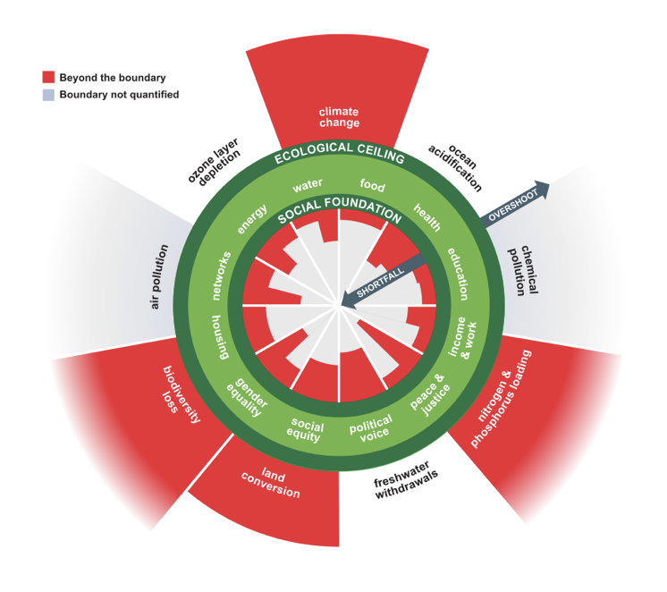
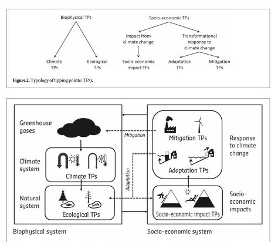
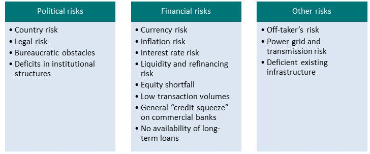
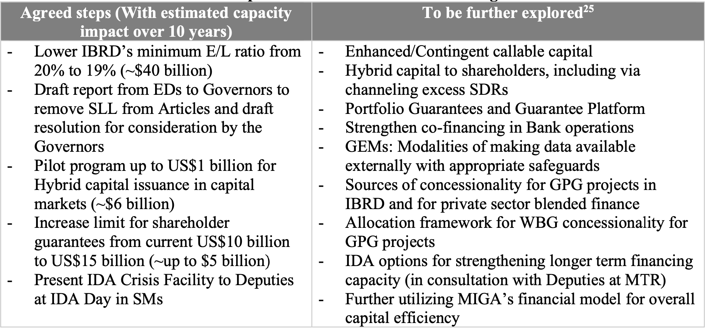
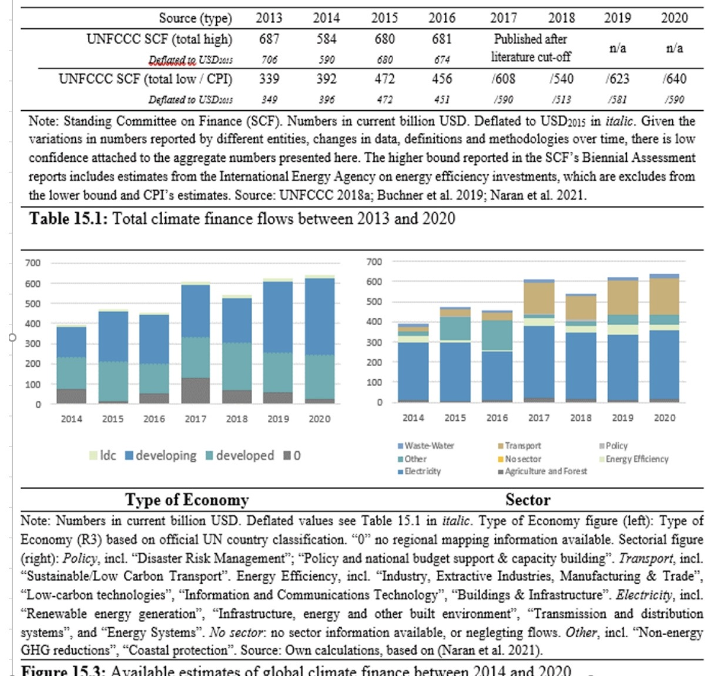

# Table of Contents

# Time and Chance — Working Papers

*Supporting material for the two volumes,* Time and Chance\* and *The Right Policy at the Wrong Time*. Contains the two growth papers not carried into either book, the notes on existing literature, the institutional project proposals and briefs, the unplaced fragments, the consolidated bibliography, and the source links. Reproduced as they stood in the combined manuscript; chapter and part cross-references inside refer to that manuscript’s numbering.\*

*The earlier drafts of the pricing and carbon-market chapters, since rewritten into* The Right Policy at the Wrong Time, *are preserved in the archived combined manuscript rather than repeated here.*

# Part A — Green Growth

## A Green Growth Toolkit for Country Teams

The previous chapter argued that green development could be growth-enhancing in principle. This one asks a more practical question: what would a development institution actually hand to its country teams if it wanted them to promote green growth, and what does the honest version of that toolkit look like?

The question addressed here is: how can the World Bank better equip its own country teams, and through them client government agencies and client country business sectors, with effective green growth tools and policies? The paper was prompted by a request for guidance on which green growth policies to promote, from a Bank advisor working in Argentina — which is worth recording, because it is the form the question takes in practice. Someone in a country office is asked what to recommend, and needs an answer.

Economic growth remains necessary and desirable in countries where poverty is widespread. But growth as a global goal has come under increasing criticism from economists who point to the impossibility of indefinite exponential growth in energy and materials throughput on a finite planet; the tight historical coupling of GDP to aggregate energy use, albeit with generally higher GDP-to-energy ratios in developed than developing countries; the fact that coal, oil and gas still supply the overwhelming majority of humanity’s direct primary energy; and the difficulty of decoupling GDP growth from growth in material throughput. The section that follows takes these criticisms seriously rather than waving at them, because a toolkit built on a paradigm its own users do not believe in will not be used.

The remainder of the chapter surveys the existing green growth discourse in the Bretton Woods institutions; provides examples of green growth tools while posing one key question — how can renewable energy equipment production be ramped up? — and recommending that the Bank design standard-format policies based on best-practice case studies for wide dissemination with only minor local tweaking; explores the fiscal implications, including fiscal federalism; and finally sets out how management-approved tools could be disseminated systematically by country teams.

### What “Green Growth” Means, and Whether It Is the Right Paradigm

**Key message.** For a nation’s growth to be green, total fossil fuel use must *decline*, even as total primary energy use and GDP increase and living standards rise. Green growth therefore requires strategies for ramping fossil fuels *down* in parallel with ramping clean energy *up*. Similarly, for a nation to achieve green growth, the rate of conservation and restoration of natural ecosystems, soils and other fundamental biophysical assets must exceed the rate of their destruction and degradation.

That formulation is deliberately strict, because the loose version has done real damage. Merely adding renewable capacity while maintaining or increasing total fossil fuel use does not achieve green growth. If that pattern continues globally — as it has in recent years — catastrophic climate disruption becomes a certainty. A country can double its solar fleet, celebrate, and have higher emissions than before.

For nearly two decades the concept has enjoyed growing attention in development institutions, with several surges: after the 2008 financial crisis; in 2012, partly through the efforts of South Korea’s then-President Lee Myung-bak; after the 2015 Paris Agreement; during and after the covid pandemic; and again in 2023.

The OECD defines green growth as “fostering economic growth and development, while ensuring that natural assets continue to provide the resources and environmental services on which our well-being relies.” The World Bank President’s redefinition of the Bank’s mission — to create a world free from poverty on a liveable planet — is broadly consistent with a green growth paradigm. Eliminating poverty requires increasing consumption of goods and services per capita among underserved populations, which is to say delivering growth; maintaining a liveable planet means delivering those increases while staying within biophysical limits.

That in turn requires staying within sustainable limits for extractive activities to which growth has long been tightly coupled, and replacing some raw materials — fossil coal, oil and gas — with cleaner alternatives such as renewable electricity, green hydrogen and green ammonia. Limits will also have to be set on the conversion of biodiverse wildlands to agriculture or monoculture, on wood harvesting, on wild-caught fisheries, and on other activities that raise GDP while degrading ecosystems if done to excess.

### The Critics, and Why They Cannot Be Dismissed

Green growth scepticism comes from several distinct traditions: degrowth, prosperity without growth, steady-state economics, doughnut economics and wellbeing economics. In the opposite corner are green growth advocates who hold that the historical relationship between GDP and environmental impact can be not merely weakened but effectively severed. For them the key to a habitable planet is *decoupling* — reducing the environmental impact associated with each unit of GDP.

The sceptics do not dispute the need for decoupling. Their observation is narrower and harder to answer: the faster we grow, the faster we must decouple. As Beth Stratford has put it, even a modest goal of 2 percent annual growth implies doubling the scale of consumption every 35 years, and the rates of decoupling that would be required for rich countries to return to their fair share of ecological space while sustaining that growth have never been approached. Green growth advocates tend to reply that the historical record is not a reliable guide to what is possible in future — which is true, and also not evidence.

The academic literature has moved in the sceptics’ direction. Keyßer and Lenzen argue that the IPCC should add degrowth scenarios to its collection of integrated assessment model pathways and explore their implications. Lehmann and colleagues surveyed German environmental management experts on green growth and its alternatives — which, besides degrowth, include “a-growth” or “post-growth,” a position midway between the two. Like Raworth’s doughnut economics, the a-growth perspective focuses on keeping biophysical throughput within sustainable limits while remaining agnostic about GDP. Notably, they found that the *more* expertise a person had on the environmental impacts of economic activity, the more they leaned toward degrowth or a-growth as necessary in the long run.

Some of the disagreement dissolves on inspection. The goal of green growth is not indefinite compounding GDP growth forever, which, insofar as GDP correlates with material throughput, is impossible on a finite planet. The UN-defined aim of the global economy is the Sustainable Development Goals — again, a world free from poverty on a liveable planet. And for key quantities such as energy, water and food availability per capita, any growth curve eventually levels off toward some limit at which everyone has plentiful access. Nobody will demand five or six times as much food or water as they can consume. There are inherent limits to growth on the *demand* side once markets saturate.

Raworth’s doughnut economics paradigm proposes aiming for a safe global operating space across several key dimensions, achieving a thriving economy embedded in a sustainable biosphere.

*Figure: Raworth’s doughnut — the proposed planetary goal is to stay within the green zone.*

### The Growth Imperative in the Financial System

Any post-growth paradigm faces a major hurdle, and it is a financial one rather than an ecological one. Given the existing financial system, the alternative to economic growth is not a steady-state economy or a degrowth economy. It is economic collapse.

The reason has to do with self-reinforcing dynamics of credit and debt creation, circulation and destruction. Using a circular-flow financial credit model of a pure credit economy in which production takes time, Binswanger showed that a steady-state economy is not possible within the existing financial system. His argument, in summary, is that positive growth rates are necessary in the long run to enable firms to make profits in the aggregate; if growth falls below a certain positive threshold, firms make losses, go out of business, and move the whole economy into a downward spiral. On that model, capitalist economies can either grow at a sufficiently high rate or shrink — a zero-growth economy is not feasible in the long run.

This is not an isolated result. Irving Fisher’s debt deflation hypothesis sought to explain the Great Depression on the basis of empirical phenomena similar to those in Binswanger’s model; Fisher’s hypothesis was endorsed by former Fed Chairman Ben Bernanke and has been modelled by Steve Keen among others. In Perry Mehrling’s terminology, this perspective is the “Money View” of the economy, in which the macrofinancial dynamics of credit and debt quantities are central to macroeconomic outcomes. Ray Dalio, in *Principles for Navigating Big Debt Crises*, holds a similar view, as does Richard Werner. These economists, bankers and financiers, working from an empirical view of money, banking and macrofinancial dynamics, would broadly agree that the rules of the existing financial operating system require continual growth — the alternative being a spiral into collapse — and are incompatible with a steady-state or degrowth economy.

There is a distributional corollary. As Piketty and colleagues showed, the long-run return to financial capital tends to exceed the rate of economic growth, so wealth and property become increasingly concentrated over time; pools of wealth act as self-concentrating attractors for more wealth. In a steady-state or degrowth economy this becomes painfully visible, because it is no longer possible to argue that a rising tide lifts all boats. Calls for redistribution would become inescapable.

Williams and Alexander have explored whether the account of macro-financial accounting, credit and debt creation offered by Modern Monetary Theory could help policymakers avoid general economic collapse in a post-growth economy.

The inference from this body of work is that a significant reset of global banking and taxation systems — of the global financial operating system — would be necessary to remove the permanent growth imperative and to distribute wealth and production more fairly.

For the remainder of this chapter we set those issues aside and deal with the narrower question of what policies and financial mechanisms could nudge growth, especially in developing countries, in a relatively green direction *within* the existing financial system. But it is crucial to remain aware of four findings: that the existing financial operating system has a built-in growth imperative, so that degrowth or even a steady state would entail financial collapse; that GDP remains tightly coupled to energy and raw materials throughput; that the rate of decoupling of GDP growth from fossil energy growth has so far been lower than the rate of GDP growth in developing countries, leading to continuing annual increases in fossil volumes and emissions; and that the worldwide concentration of financial and property ownership is directly connected to the structure of that same system.

Achieving social and environmental stability, widely shared prosperity and a sustainable economy will therefore ultimately require changing some key rules of the global financial operating system — as well as heavy investment in scaling renewable infrastructure while ramping down fossil energy use in developing countries. Readers of Chapter 6 will recognize the first of those requirements; the argument there for constructing a low-risk financial system around green assets is a partial answer to precisely this critique.

### Green Growth Topic Areas: Tools and a Key Question

**Key message.** For almost any subdomain of a national economy it is possible to imagine green technologies, policies, financial mechanisms and outcomes. But *ubiquitous availability of cheap renewable energy is the most important building block* for creating a world free from poverty on a liveable planet.

Accordingly, a key goal for green growth is the rapid ramp-up of renewable energy systems alongside a simultaneous ramp-down of fossil fuel infrastructure, such that the net year-to-year impact in developing regions is rapidly increasing energy prosperity together with decreasing per capita carbon emissions.

How could the World Bank help make this happen? One approach is to define a desired future state of the world — in particular, the energy system in 2040 — then use back-casting and techno-economic modelling to explore plausible least-cost trajectories to that future, with particular attention to the *scale of cleantech production facilities required*. Once that is done, plausible financial mechanisms for building the requisite supply chains can be evaluated.

This chapter is not the place to list hundreds of policy options across dozens of economic domains; existing inventories of such options are noted above. Instead the focus is on one key question at the foundation of any green growth strategy: how can developing countries achieve energy abundance on a non-fossil basis?

An example of the diversity of programs available for a single domain — building energy efficiency — is given below, drawing on just two jurisdictions. The point of that example is to showcase how enormous the variety of financial incentives and programs can be for any given technical domain. Identifying which of the vast array of existing or potential programs would count as best practice is beyond this chapter’s scope, but it is an important question, and one the Bank should pose systematically in each domain.

### Back-Casting to Identify Required Cleantech Production, 2024–2040

Back-casting involves defining a vision of key quantities in a desired future state, then using techno-economic modelling to assess possible pathways from today to that future. Two framing questions organize the exercise.

**What does the green transition to 2040 look like in quantitative technology and engineering terms**, especially for the future clean energy and water supply systems that together drive food security?

**What financial mechanisms, regulatory environments, and influential political-economic cleantech development coalitions must be in place in each region** to create an appropriate context for large-scale clean energy equipment production or installation there?

These unfold into a research agenda. The questions below are set out at length because the value of back-casting lies in their specificity: each one has a numerical answer, and the answers constrain each other.

- **If the transition is largely complete by around 2040**, and the SDGs fully implemented, what will be the installed quantities of energy and water supply systems in each major region — for instance in each of the five major regions of sub-Saharan Africa?

- What are the **targets in MWh per person per annum in each region**, if the aim is first-world-standard energy prosperity worldwide with no region left behind, and what does that imply for the quantity of supply equipment that must be installed to achieve a nearly fully electrified, mostly renewable-powered world — with nuclear playing a role in some regions?

- What does the trajectory look like year by year? **What must be built, in what quantities, by when, between 2024 and 2040, in each major region**, if the transition is to be largely complete by 2040? This is addressable with detailed techno-economic modelling.

- What is the **optimal geographical distribution of equipment production facilities**, given regional build-out needs?

- More than 80 percent of global solar PV panel production is currently in China. **Is continued Chinese dominance of the PV supply chain desirable?** What would be the balance-of-trade consequences if African countries continue importing all their solar equipment from China at much higher annual volumes? This is the trade balance concern of Chapter 17, expressed as a strategic question rather than a financial one.

- **Could an East African cleantech gigafactory** — in Kenya, Rwanda, Uganda or Tanzania — **compete on price per MW** with state-supported Chinese gigafactories?

- What would be the impact if WTO rules prevented East African countries from erecting **regional tariff barriers** intended to nurture a regional cleantech supply chain? Can WTO rules be set aside to permit such barriers, and would it be desirable to do so?

- What **site selection criteria** make sense for cleantech gigafactory complexes?

- What is the **optimal scale of individual facilities?** Would it be better to build 200 gigafactories of 25 GW annual solar plus wind equipment production each — 25 GW/yr being the projected size of the Dhirubhai Ambani Green Energy Giga Complex at Jamnagar in Gujarat, roughly one gigafactory per 40 million people — or 1,000 gigafactories of 5 GW each, one per 8 million people?

- Solar PV’s low unit cost means that in most developing regions such complexes would be centered on **solar PV as the core technology, along with storage** and transmission equipment, with wind turbine blades an additional key technology in some regions. Other cleantech — desalination equipment, indoor food-growing systems, efficient stoves, green hydrogen or ammonia production equipment, air- and ground-source heat pumps, rooftop solar hot water — could also be produced there. How do we identify the **top-priority technologies within each region**?

- In any region, what coalition of regional and global finance, political-economic, business and engineering interests must be convened to create a politically effective quorum capable of driving construction of a regional cleantech supply chain?

- By what process can such coalitions be convened, and which institution should **lead the convening** — the World Bank, the International Solar Alliance, or another entity, perhaps a specialized unit within a major pension fund or a sovereign wealth fund?

- **In least-developed regions, what financial mechanism would allow poor families access to clean energy equipment and clean water?** If people cannot pay for solar panels or desalinated water, can they bootstrap into energy prosperity — for instance by being trained, equipped and organized into work crews providing solar farm installation services in exchange for the means to acquire systems for themselves?

- What are the **key financial mechanisms** for making clean energy equipment as cheap as possible? Here the key is reducing the cost of capital as far as possible — the subject of Parts IV and V. Could a global mechanism for solar supply chain derisking in developing countries be established, backed by several advanced industrial nations?

- Arguably the most cost-effective climate finance support developed countries can offer, given their share of cumulative historical emissions, is **guarantees enabling very-low-interest loans** to solar supply chain actors in developing countries qualifying through Program-for-Results agreements, intermediated by institutions such as the World Bank, EIB or African Development Bank. **How can derisking mechanisms be organized and scaled to meet the required volume of investment?**

- A good way into these questions may be **regional case studies** in parallel, asking how a regional gigafactory development project could be convened, for instance in the context of Country Climate and Development Reports.

- What role could or should the World Bank play in addressing any of this?

To give a sense of the range of policies available in the clean energy domain, two examples follow: large-scale solar PV projects, and building energy efficiency and clean energy upgrades.

### Example: Low-Interest Lending for Solar PV Project Development

Client governments could be encouraged to adopt a policy package offering qualified solar developers low-interest loans alongside a twenty-year feed-in tariff schedule to ensure stable net income. Program-for-Results financing could be used to encourage adoption.

The Bank is already engaged in promoting solar. India’s government is active through IREDA, the Indian Renewable Energy Development Agency, a state-owned renewable project financing company, and through SECI, the Solar Energy Corporation of India, a state-owned project developer whose guarantee function was examined in Chapter 17. The Bank has already lent to SECI to facilitate more rapid solar expansion.

It may well be that encouraging client countries to adopt feed-in tariffs for solar and wind power, and for storage, with Bank rewards offered to encourage adoption, complemented by a system of loan guarantees reducing developers’ cost of capital, would be a highly effective approach deployable in many client countries in a fairly standard way — which would in turn allow country staff to be trained in promoting it as a standard package. The Bank already encourages feed-in tariffs and has published a policymakers’ guide to their design.

Feed-in tariffs are very widely used, and the OECD maintains a database of them. Tariffs structured to guarantee a specified price per kWh many years in advance, often twenty, are especially suitable for solar because the financial viability of solar depends on predictable cash flow far into the future, given that the bulk of project cost is the up-front capital investment. This is the same property that Chapter 13 identified as making solar the natural first candidate for derisking.

Combining auctions with feed-in tariffs enhances financial efficiency. It is important to avoid setting tariffs unnecessarily high, and regular auctions for solar development licenses establish the going rate per MWh. Auctions allow price discovery — the price developers will actually accept — enabling policymakers to adjust tariffs to reflect the ongoing, generally downward, movement in the price of solar as the technology improves and scales.

**Recommendation:** feed-in tariffs plus financial mechanisms for reducing the cost of capital are two key policy mechanisms the Bank could promote and organize to catalyse a rapid solar scale-up in client countries. Feed-in tariffs can also support wind, storage, green hydrogen and other green technologies.

### Example: Buildings Sector Incentive Programs

Documenting every policy available worldwide in the building sector would exceed this chapter’s scope. Instead, to convey the complexity that arises in green growth policymaking, consider two cases: building energy efficiency and clean energy upgrade programs in California and in Tamil Nadu. These give a sense of the nearly infinite variety of support programs that can be launched — and they make the case for simplicity and reproducibility, meaning a rollout of the same policy on substantially the same terms across many countries.

A well-designed policy could be deployed with little change in multiple countries. A good goal would be for the Bank to work with domain experts to design standard-format green growth policies, based on existing best-practice case studies, that can be rolled out widely and tweaked easily for individual client countries.

**California.** *Property Assessed Clean Energy (PACE) financing* allows property owners to finance efficiency and renewable upgrades through an assessment on their property tax bill, providing low-cost long-term financing for solar installation, efficient windows and insulation. It is beyond this chapter’s scope to evaluate PACE or to assess which countries have the institutional capacity to adopt it, but it appears highly promising, and the Bank should consider it a possible key policy tool for client countries that do have the necessary capacity — meaning those with an effective property tax collection system. Note that PACE is structurally the same idea as the property-tax-based end-use financing mentioned in Chapter 22: it finds a contracted revenue stream where none obviously existed.

Other California programs include the *Million Solar Roofs Initiative* (2007–14), incorporating the California Solar Initiative, which provided cash rebates for PV installation with incentives based on system size and performance, and the New Solar Homes Partnership; *Energy Upgrade California* (2008–2021), an educational initiative supported by an alliance of the Public Utilities Commission, the Energy Commission, utilities, regional energy networks, local governments, businesses and nonprofits, aimed at motivating consumers to manage energy use; the *California Advanced Homes Partnership*, offering incentives to builders constructing homes that exceed the state energy code, encouraging solar panels, advanced insulation, efficient HVAC and water-saving measures; *California Energy Design Assistance*, replacing Savings by Design, which offers energy consultants to architects and engineers designing efficient new buildings and helps them navigate regulatory requirements for technical assistance and cash incentives; the *Self-Generation Incentive Program*, providing incentives for eligible storage systems including batteries at commercial, industrial and residential properties, to promote storage, enhance grid reliability and support renewable integration; and *California Energy Commission grants and incentives*, including zero- and low-interest loans and grants available to cities, counties, special districts, public schools, colleges, universities, hospitals and care facilities.

**Tamil Nadu.** The *Chief Minister’s Solar Rooftop Capital Incentive Scheme* provides direct financial support for grid-connected rooftop PV on citizens’ houses. TANGEDCO’s *net metering policy* allows consumers to install rooftop systems and sell excess electricity back to the grid, with a compensation mechanism for surplus generation. The *Energy Conservation Building Code* (2022) has been criticized for covering only commercial and not residential buildings. And the *PEACE scheme* promotes energy audits and conservation among micro, small and medium enterprises.

Two jurisdictions, roughly twenty programs, no two alike. The lesson is not that any of them is wrong but that the proliferation itself has a cost: it makes each program bespoke, each one a fresh design and a fresh negotiation, and it forecloses the standardization that would let a development institution deploy the same instrument fifty times.

### Fiscal Aspects of Green Growth

**Key message.** Numerous studies show the transition to a renewable-based economy will generate net employment benefits. For purposes of improving client governments’ fiscal health, the Bank should encourage systems of employment in the new energy economy *explicitly designed to incorporate workers into the formal rather than the informal economy.*

An OECD paper by Dougherty and Nebreda on the multi-level fiscal governance of ecological transition explores the relationship between fiscal federalism and green growth, with an eye on the fact that expressions of intent regarding decarbonization targets do not readily translate into action on the ground in federal systems. Their investigation covers the link between fiscal federalism institutions and ecological transition policies, focusing on the role of regional and local governments in implementing environmental goals. Their finding is that despite subnational governments’ commitment to green objectives, comprehensive implementation has been limited by local incentive schemes and capacity constraints — and that fiscal federalism instruments such as fiscal rules, transfers and capacity-building programs have real potential to support ecological transition. This matters in many major jurisdictions organized as federal polities: India, Indonesia, Brazil, Mexico, China, the European Union, Germany, the United States, Canada, Australia.

Multiple studies reviewed by the OECD find that shifting toward clean energy tends to enhance GDP growth. Depending on the details of taxation structures, green growth can therefore go hand in hand with rising fiscal revenues.

The consensus is that the employment impacts of the transition will be net positive. The IEA’s *Net Zero by 2050* roadmap projects that the transition will create 14 million new clean energy jobs while requiring the shift of around 5 million workers away from fossil sectors. IRENA, with the ILO, publishes an annual *Renewable Energy and Jobs* review. Brookings has explored how renewable energy jobs could uplift communities in the United States currently dependent on fossil sector employment.

The fiscal mechanism connecting this to government capacity is formality. Rising employment in the *formal* economy correlates with increases in fiscal revenue; conversely, high levels of informal employment imply lower revenues and lower government capacity, as the Bank’s own work on the long shadow of informality documents. This is why the recommendation above is specifically about formalization rather than about job numbers. A transition that creates 14 million informal jobs generates far less fiscal capacity than one that creates 10 million formal ones — and fiscal capacity is what pays for everything else.

In countries where large populations lack electricity access, especially in sub-Saharan Africa, increasing access provides a foundation for small and medium enterprise, higher value-added employment and enhanced GDP growth — and thus, assuming taxation systems also improve, a basis for increased fiscal revenue. IRENA, the UN Economic Commission for Africa and the RES4Africa Foundation have explored these possibilities jointly.

### Recommendations: Disseminating Green Growth Tools

**Key message.** The Bank could implement a more systematic, structured approach to disseminating pre-approved green growth tools in client countries, building on the Green Growth Knowledge Platform and the policies, programs and tools inventoried there.

Further progress could entail an internal process inviting proposals for additional tools from internal and external experts; an internal review and approval process; and a database of those tools, cross-correlated to the countries where each could be most suitably applied and grouped into complementary suites, within the GGKP framework or in parallel. An internal process would also be needed for training country staff on the options and motivating them to convene co-design processes with client country agencies and stakeholders. Follow-up after implementation would include monitoring, evaluation and iterative improvement. A searchable database would let Bank and client country staff find tools, identify their status in the review process — including whether a tool has senior management approval — find information on existing implementations, and learn about support options. The process would disseminate lessons learned and improve tool designs over time.

### Why This Is Needed

If declarations of intent, summit meetings and institutional initiatives are anything to go by, we have arrived at the era of full-throated institutional support for green growth. The Bank’s President has set out a vision of a world free from poverty on a liveable planet. Multiple networks and initiatives toward greening the financial system, development finance and energy infrastructure have arisen: the Bridgetown Agenda, the Principles for Mainstreaming Climate Action, the Network of Central Banks and Supervisors for Greening the Financial System, the Coalition of Finance Ministers for Climate Action, the Institutional Investors Group on Climate Change, the Summit for a New Global Financial Pact, and much else.

IRENA, founded in 2009, and the International Solar Alliance, founded in 2015 under Indian leadership, have emerged as important players. Their work complements the new consensus at the IEA that solar power is, and will remain, the new king of power generation. On the release of the World Energy Investment 2023 report, the IEA’s executive director observed that clean energy is moving faster than many people realize, and that for every dollar going into fossil fuels about 1.7 dollars now go into clean energy — a ratio that stood at one-to-one five years earlier.

And yet. Neither the proliferation of well-intentioned initiatives nor the ongoing rapid expansion of clean energy infrastructure has been enough to put the world on track for the twin goals of climate stability and energy prosperity. There has been no reduction in annual anthropogenic carbon emissions; they are at an all-time high and continue to rise. As noted at the start of this chapter, achieving green growth requires not only rapidly expanding renewable systems but simultaneously ramping *down* fossil systems — and that has not been happening.

This is the gap between institutional enthusiasm and physical outcome, and it is the reason a toolkit is needed rather than another declaration.

### What the Bank Could Do

Under its current leadership the Bank could increase the use of its convening power and its client relationships, alongside its policy design capacities and financing tools, to stimulate a simultaneous massive ramp-up in renewable infrastructure in developing countries and a ramp-down in fossil production — all within the envelope of a goal of rapidly increasing per capita energy consumption in developing countries as a cornerstone measure of prosperity.

Ramping *up* clean infrastructure requires setting up regulatory, financial and technological frameworks and capacities, as discussed throughout this book. Ramping *down* fossil fuels requires something different in kind: a systematic approach to convening fossil asset owners and stakeholders and co-designing viable transition strategies *with* them — inducing them to take responsibility for co-designing an off-ramp from their fossil investments that is simultaneously an on-ramp onto more sustainable ones, in renewables or in green synthetic chemicals. This is the political-economy insight of Chapter 1 applied to incumbents: the transformation succeeds when the incumbent has a stake in it.

This section is not concerned with which specific policies the Bank should promote — though renewable feed-in tariffs, cost-of-capital reduction schemes and PACE financing were identified above as plausible candidates. The focus here is on the *processes* by which country staff could be enabled to promote green growth policies more systematically and successfully. Detailed recommendations would exceed this chapter’s scope, but the approach could run as follows.

1.  Invite Bank staff, consultants and outside experts to propose specific green growth policies, programs and financial mechanisms for evaluation, building on the Green Growth Knowledge Platform inventory.
2.  After initial review by a designated green growth toolkit review panel of expert staff, submit options to senior management for review and approval, with the toolkit maintained as a living document.
3.  Have the database list approved tools, those pending approval, and draft ideas put forward but not yet submitted — so that each tool’s status in the review process is visible, along with a proposed timeline.
4.  For each tool, identify and list the client countries for which it is considered particularly appropriate.
5.  Organize tools and countries in a cross-correlated database searchable by tool category and by country.
6.  Identify groups of tools expected to work well together, and make those packages easy to find.
7.  Once a tool is approved and its candidate countries identified, organize outreach and training for country staff.
8.  Country staff would then approach key contacts in client countries’ finance ministries and infrastructure development agencies, along with relevant private sector and non-government stakeholders, with proposals for co-developing a locally appropriate version.
9.  Country staff would accompany the process through design and implementation — supported where appropriate by Program-for-Results financing — and track the tool’s success or failure in practice, reporting results back into the database and offering internal seminars to communicate lessons learned and iteratively develop best practice.

It should be said that this process is arguably not markedly different from established Bank internal processes. That is intended as reassurance rather than criticism. The proposal does not require a new institution or a new mandate; it requires applying an existing institutional competence to a domain where it is currently applied unsystematically.

## Does Green Growth Happen? The Evidence

The last chapter of this book asks whether the central premise holds. Everything in Parts IV and V is built on the assumption that helping poor countries build clean energy is good for them economically as well as environmentally. That assumption deserves testing rather than asserting.

### Is Green Growth Possible?

Start with where we are. Growth in a fossil-powered economy is principally not green: every unit of GDP increase leads to a corresponding rise in emissions, because of the fossil energy consumption associated with that increase in activity.[^1] This is true in developed and middle-income countries alike, and it is the observation from which the degrowth critique in Chapter 35 proceeds.

But structural change in the energy supply can alter that coupling. Switching supply from brown to green could in principle *completely* decouple growth from emissions. Conceptually this is simple, even though it is technically difficult: transform the energy supply.

Climate action, though, involves two different kinds of thing — constraints on the economy, such as emissions caps and taxes, and developments of the economy, such as investment. The two have opposite signs for growth, and any honest analysis has to distinguish them. Much of the confusion in this literature comes from studies that measure one and generalize to the other.

Green growth might operate through three channels: the macroeconomic demand side, the supply side, or the balance sheet.

### The Demand Side

By the demand side we mean the increase in economic activity associated with expenditure — investment — in the short term. If an economy is demand-deficient, operating below capacity, then public and private investment can raise activity.

Rapid decarbonization requires high investment, and studies typically find high *multipliers* for investment, meaning short-term growth is enhanced not only directly but through knock-on effects.

There is an important condition attached, though, and it points in an unexpected direction. This demand-side benefit may depend on the transition being *relatively rapid* — the sort of dramatic investment trajectory needed to meet the Paris goals, meaning not merely net zero within a few decades but a majority of the emissions reduction happening within the next decade or so. Such a trajectory is technologically possible but would require macroeconomically significant levels of investment. Since renewables are relatively capital-intensive, or at least since their expenditure is brought forward, this implies a macroeconomic effect resembling the *accelerator*.

The implication is worth stating plainly, because it inverts the usual framing: a *fast* transition may be more growth-enhancing than a slow one. Gradualism is often defended on economic grounds, but if the demand-side channel is real, gradualism forfeits it.

### The Supply Side

Green investment could also stimulate growth on the supply side, and in the long run. Supply-side growth concerns the fundamental efficiency of the economy: is a low-carbon economy resource-efficient or not?

This is a dynamic question with forces pulling both ways. On one hand, the more accessible technological opportunities for low-carbon development are, by definition, taken first, which means costs are low for shallow decarbonization and rise as the easy options are exhausted — diminishing returns. On the other, technological progress reduces costs and can create a virtuous circle, and it has demonstrably done so for solar and batteries. The net effect is likely positive until only the genuinely hard decarbonization problems remain — cement, aviation, industrial heat — at which point the supply-side calculus turns less favorable.

### Why Derisking Matters for Growth

To enhance green growth and investment, a strategy to promote investment is needed, and derisking is that strategy: approaches that reduce the financial risk of green investments such as renewable energy. This appears especially important in developing country contexts, where capital markets and understanding of green investment are typically less developed than in advanced economies (Komendantova, Schinko and Patt, 2019).

This is the point at which the growth argument and the finance argument of this book meet. If the demand-side channel requires a rapid transition, and a rapid transition requires large volumes of investment, and that investment is blocked by the cost of capital, then derisking is not merely a financing technique. It is the precondition for green growth being growth at all.

### The Resource Depletion Argument

There is a further reason for developing countries to consider switching to renewables that is independent of climate. Growth currently goes hand in hand with increased energy use. If that energy comes from non-renewable sources, there is a risk of resource depletion that will constrain future growth (Syzdykova et al., 2021). Renewable energy has no depletion constraint, which makes it a superior foundation for long-run growth even setting emissions aside.

Risk aversion among investors and governments is the main obstacle to that switch — which is why the literature recommends strategies such as tax exemption to promote renewable investment, and why this book has spent most of its length on the same problem approached from the financing side.

### What the Empirical Evidence Shows

The empirical picture is more mixed than advocacy on either side suggests, and it is worth being precise about what has actually been found.

Using Granger causality tests, there is evidence that increases in energy use and growth in GDP move together (Pao, Li and Fu, 2014), meaning each affects the other. That bidirectionality reinforces the case for switching energy sources rather than restraining energy use: if energy and growth are mutually reinforcing, then making energy clean is more promising than making it scarce. Every unit of energy produced then yields returns without the emissions penalty.

But the results across countries are not uniform. Current literature suggests that in some developing countries the switch to renewables has *not* been accompanied by increased economic growth, and attributes this to the optimum level of investment in the resource not yet having been reached (Destek, 2016). This could explain why the measured growth effect has been negative in some countries, such as India, and positive in others, such as Brazil.

That finding deserves emphasis rather than burial, because it is the most policy-relevant result in this literature. If the growth benefit depends on crossing a threshold level of investment, then small, cautious renewable programmes may show *no* growth benefit — or a negative one — while large ones show a positive benefit. Half-measures would then be the worst of the available options: they incur the transition costs without reaching the scale at which the benefits appear. This is the economic counterpart of the tipping-point and economies-of-scale arguments in Chapter 12, and it is a further argument for the big-push approach that this book’s financial architecture is designed to make affordable.

### Conclusion

So: is green growth possible? The honest answer is that it is possible but not automatic, and that its likelihood depends on things that are within policy’s control.

It depends on the transition being fast enough for the demand-side channel to operate. It depends on investment reaching the scale at which the threshold effects in the empirical literature turn positive. It depends on the cost of capital being low enough that the investment is affordable at that scale. And it depends, over the longer term, on whether the harder decarbonization problems yield to technological progress the way solar has.

The first three of those are financing questions, which is why this book has been about finance. A transition financed at 12 percent is slow, small and quite possibly growth-reducing. The same transition financed at 4 percent is fast, large and probably growth-enhancing. The difference between those two worlds is not a difference in technology, ambition or physical resources. It is a difference in the price of money — and the price of money, as the preceding chapters have argued at length, is something that institutions can change.

# Appendix 1 — Notes on the Existing Literature

*Summaries of other authors’ papers and reports, and the consolidated bibliography. None of the material in this appendix is original to this book.*

## 1.1 Green Growth and the Growth–Energy Link

### Literature Review: Climate Action and Green Growth

The first paper analyzed, the “Analysis of the Relationship Between Renewable Energy and Economic Growth in Selected Developing Countries”, (Syzdykova *et al.*, 2021), studied the potential macroeconomic effect switching to renewable energy would have on the following countries: Brazil, India, Indonesia, China, Chile, Mexico, South Africa and Turkey. One of the main reasons why Syzdykova et al., 2021, advocate for the switching to renewable resources is due to the current foreign dependent of these nations for energy sources, which prevents them from achieving full economic growth potential. Moreover, non-renewable resources are only a temporary source of energy, as there is a current risk of resource depletion. Therefore, without switching to renewable sources of energy, long-term growth is not guaranteed.

For some countries, which due to their geographical conditions are rich in greener sources of energy, we can see that it can be seen as a cost-effective measure. This would be the case of Brazil, Mexico, South Africa or Turkey with their use of grid-based energy powered by wind energy. For the countries studied in this paper, it was concluded that a reduction in CO2 emissions led to economic growth. However, this switch is problematic in terms of funding due to multiple factors such as risk-aversion from investors.

Another paper which was analyzed was “Causality Relationship between Energy Consumption and Economic Growth in Brazil” by (Pao, Li and Fu, 2014). This paper paid special attention to the relationship between energy consumption and income, and it was determined that there is a positive influence between an increase in energy consumption and income earned in Brazil. The study looked at growth rates in energy consumption and income rates between the period 2008-2013 and concluded that in Brazil energy increased by 4.18% and income by 4.81%, which was greater than the global rates.

Pao, Li and Fu, 2014, used the Granger causality test to examine the relationship between the two variables and concluded that they are both affected at the same time, meaning an increase in GDP leads to an increase in energy consumption, but the same effect can be said vice-versa. The explanations for this relationship were the following. On one hand energy consumption increases as an economy grows. Secondly, an improvement in techniques of production leads to increased profitability of every unit of energy produced due to a reduce amount of energy used. Therefore, the study concluded that if Brazil wanted to keep growing at the pace it was, there should be an investment in greener sources of energy, which would generate more returns.

The third paper reviewed was “Renewable energy consumption and economic growth in newly industrialized countries: Evidence from asymmetric causality test” by (Destek, 2016). This paper examined the following countries Brazil, India, Turkey, South Africa, Mexico and Malaysia between the period 1971 to 2011. The purpose of this study was to determine if production and demand increase due to an increase in energy consumption or if energy consumption is only a result of economic growth.

The study failed to determine what the relationship was, since the conclusions was that it was content dependent. In the case of India, Turkey, South Africa and Mexico it was determined that as renewable energy consumption increased, there was a decrease in economic growth. However, in Malaysia or Brazil it was determined that the opposite effect was achieved as renewable energy consumption led to economic growth. Destek, 2016, concluded that one of the main reasons why the study failed to determine one conclusion was due to the fact that some countries might not have already reached optimum levels of investment in renewable energy, and this could be due to the fact that it is monetary expensive. Until this optimum level is achieved, the use of renewable energy could be harmful for some economic activities.

Other papers such as “CO2 emissions, renewable and non-renewable energy consumption, and economic growth: Evidence from panel data for developing countries” by (Ito, 2017), also analyzed the relationship between economic growth and renewable energy consumption. Ito, 2017, analyzed data from the following countries: Albania, Azerbaijan, Bolivia, Bosnia and Herzegovina, Brazil, Bulgaria, Chile, China, Colombia, Costa Rica, Croatia, Cuba, Dominican Republic, Ecuador, Egypt, Gabon, Hungary, India, Indonesia, Iran, Iraq, Jamaica, Jordan, Kazakhstan, Lebanon, Macedonia, Malaysia, Mauritius, Mexico, Moldova, Morocco, Panama, Poland, Romania, Russia, South Africa, Thailand, Tunisia, Turkey, Uruguay, Uzbekistan and Venezuela. The main conclusions after the study were the following. On one hand, there is a positive long-term effect on economic growth for countries that use renewable sources of energy. Looking at long-term economic growth, the study concluded that the continued use of non-renewable sources of energy will have a negative effect in economic growth. Finally, switching to renewable sources of energy will also lead to sustainable employment. In order for developing countries to be able to make this change, more developed nations should invest both through capital and technologically. The final recommendation made by Ivo, 2017, was that governments should use tax exemptions or subsidies in order to make it financially attractive for the investment in renewable sources, and they should adapt to each country’s geographical conditions.

The final paper reviewed was “The effect of renewable energy consumption on economic growth: Evidence from top 38 countries” from (Bhattacharya *et al.*, 2016). This paper highlighted the importance of granting tax credits as this is one of the main channels as to how renewable growth has been promoted in developing countries. This can be seen specially in the case of Latin America. Under the current literature there are four explanations which explain the relationship between growth and renewable energy. The first theory is called the growth theory. Under this theory it is assumed that the relationship between energy consumption and economic growth is unidirectional, which means that energy conservation policies will have fail to have a positive impact on economic growth. The second theory is called the conservation theory. This theory implies that an increase in energy consumption is a result of economic growth, hence the use of either renewable or non-renewable sources of energy has no impact of economic growth. Thirdly, the feedback hypothesis suggests there’s is a two-way relation between energy consumption and economic growth. This means that a change in any of the two variants will affect the other. Finally, the last theory is the neutrality hypothesis which implies that both energy consumption and economic growth are independent of each other and therefore no relationship between them. The main conclusion in this study was that in the case of India, increase use of renewable energy led to a decrease in GDP. However, for other developing countries such as Brazil or Mexico the study failed to find data which supported the theory renewable energy plays a significant role in increasing economic growth.

### Literature Survey: Renewable Deployment and Economic Growth

This literature survey considered papers on the relationship between renewables and developing countries’ growth. We consider the empirical evidence of the connection between renewables expansion and economic growth. One limitation of the papers is that some of the studies are outdated, and even the most recent papers may not account for the recent changes in the cost of renewables. We found five papers in total on this question.

“Renewable energy consumption and economic growth in newly industrialized countries: Evidence from asymmetric causality test” (Destek 2016) examined the direction of causality between economic growth and renewable energy consumption. The study concluded that the effects were country-dependent. In the case of India, Turkey, South Africa, and Mexico, it was determined that as renewable energy consumption increased, there was a decrease in economic growth. However, the opposite effect was achieved in Malaysia or Brazil as renewable energy consumption led to economic growth. Destek, 2016, concluded that one of the main reasons the effect depended on the country was that some countries might not have already reached optimum levels of investment in renewable energy since it has been costly.

“The effect of renewable energy consumption on economic growth: Evidence from top 38 countries” (Bhattacharya *et al.*, 2016) also highlighted the importance of granting tax credits as this is one of the main channels as to how renewable growth has been promoted in developing countries. This can be seen especially in the case of Latin America.

Under the current literature, there are four explanations of the relationship between growth and renewable energy. The first theory is called the growth theory. Under this theory, it is assumed that the relationship between energy consumption and economic growth is unidirectional, which means that energy conservation policies will fail to impact economic growth positively. The second theory is called the conservation theory. This theory implies that an increase in energy consumption results from economic growth; hence, the use of either renewable or non-renewable sources of energy has no impact on economic growth. Thirdly, the feedback hypothesis suggests a two-way relation between energy consumption and economic growth. In this case, a change in any of the two variants will affect the other. Finally, the last theory is the neutrality hypothesis, which implies that energy consumption and economic growth are independent of each other and, therefore, have no relationship between them.

The main conclusion in this study was that in the case of India, increased use of renewable energy led to a decrease in GDP. However, for other developing countries such as Brazil or Mexico, the study failed to find data that supported the theory renewable energy plays a significant role in increasing economic growth.

“Analysis of the Relationship Between Renewable Energy and Economic Growth in Selected Developing Countries” (Syzdykova *et al.*, 2021) studied the potential macroeconomic effect of switching to renewable energy in eight major middle-income countries[^2]. One of the main reasons Syzdykova et al., 2021, advocate for the switching to renewable resources is due to the dependence of these nations on imported energy, which prevents them from achieving full economic growth potential. Moreover, non-renewable resources are depletable. Therefore, without switching to renewable energy sources, long-term growth is not guaranteed.

For some countries, which are rich in greener energy sources due to their geographical conditions, we can see that it can be seen as a cost-effective measure: for example, in Brazil, Mexico, South Africa, or Turkey using grid-based energy powered by wind energy. For the countries studied in this paper, it was concluded that reducing CO2 emissions led to economic growth. However, this switch is hard to finance due to multiple factors such as risk-aversion from investors.

“CO2 emissions, renewable, and non-renewable energy consumption, and economic growth: Evidence from panel data for developing countries” by (Ito 2017) also analyzed the relationship between economic growth and renewable energy consumption in 42 primarily middle-income countries[^3]. The study found a positive long-term effect on economic growth for countries that use renewable energy sources. Continued use of non-renewable energy sources would harm economic growth. Finally, switching to renewable energy sources will also lead to sustainable employment. For developing countries to make this change, more developed nations should invest in capital and technology. The final recommendation was that governments should use tax exemptions or subsidies to make it financially attractive for the investment in renewable sources, and they should adapt to each country’s geographical conditions.

### Papers Researched for the Schumpeterian Argument

[Schumpeterian economic dynamics of greening: propagation of green eco-platforms \| SpringerLink](https://link.springer.com/article/10.1007/s00191-020-00669-5) John A. Mathews

Lessons from Schumpeterian Growth Theory By PHILIPPE AGHION, UFUK AKCIGIT, AND PETER HOWITT[AEA.pdf (brown.edu)](https://www.brown.edu/Departments/Economics/Faculty/Peter_Howitt/2070-2015/AEA.pdf#:~:text=1The%20theory%20was%20initiated%20in%20the%20fall%20of,focus%20instead%20on%20the%20differences%20between%20the%20twoapproaches.)

[R&D for green technologies in a dynamic oligopoly: Schumpeter, Arrow and inverted-U’s - ScienceDirect](https://www.sciencedirect.com/science/article/abs/pii/S0377221715008498)

[Innovation Perspectives:Schumpeter V Arrow - Wikireedia](http://www.wikireedia.net/wikireedia/index.php?title=Innovation_Perspectives:Schumpeter_V_Arrow#:~:text=It%20has%20been%20known%20as%20the%20Schumpeter%2FArrow%20debate.,lack%20of%20competition%2C%20is%20beneficial%20to%20innovation%20activities.)

[Joseph A. Schumpeter and Innovation \| SpringerLink](https://link.springer.com/referenceworkentry/10.1007/978-3-319-15347-6_476)

Schumpeter thus identified innovation as the critical dimension of economic change. He elaborated his theory to describe the process of innovation and also distinguished five types of innovation: (1) new production processes, (2) new products, (3) new materials or resources, (4) new markets, as well as (5) new forms of organizations (Schumpeter \[1911\] [1934](https://link.springer.com/referenceworkentry/10.1007/978-3-319-15347-6_476#ref-CR1010), p. 66). As such, he also broke new ground in the field of innovation management. Schumpeter went further to describe diffusion of innovation or the process over time of acceptance or absorption of it within an economic system. Without innovation, no diffusion can take place; correspondingly, without diffusion, an innovation remains a singular isolated event. Diffusion is thus complementary in Schumpeter’s theory. He suggested that innovation without diffusion would not lead to economic development (Brouwer [1991](https://link.springer.com/referenceworkentry/10.1007/978-3-319-15347-6_476#ref-CR102), p. 58).

Briefing: Derisking for Utility-Scale Renewables

## 1.2 Notes on Individual Papers

Paper: Closing the green finance gap- a systems perspective

Main points:

- The CCC in 2018 estimated the UK would need to invest 100 billion pounds by 2020 and 130 by 2030 in low-emission energy infrastructure in order to meet commitments agreed

- However, some organizations like the Committee on Climate Change and Vivid Economics estimate that this will not be enough, and instead, investment should be 300 billion pounds by 2030.

- Sources of finance that have been used in the past to fund infrastructure projects like project finance, will not be enough and therefore there is a need for private investors to become involved in these projects

- Currently, there are several reasons to explain why private investors refuse to invest the required capital into green energy infrastructure projects. Some of them are due to lack of confidence due to technological risks associated with them, lack of information or lack of experience.

- Additional barriers which prevent the implementation of more projects include complex and long administrations processes due to electricity market regulations or resistance of society. These reasons are of great concern to financial investors.

- Another reason is the lack of a long-term climate change framework which presents the concern of what will be the attitude of the following administration

- Current investments in brown infrastructure are a barrier to making the transition to green investments and therefore this urgently needed transition is postponed

- There is a need to price carbon emissions through a carbon tax to correct market failure of the negative externalities of carbon emissions.

- There should also be more direct government intervention in order to de-risk technological risk

- Green bonds could be an immediate solution to make renewable projects more attractive. However, this should only be thought of as a short-term solution as this will not be enough to tackle the green finance gap

- There is a need to conduct more studies into the effect of systematic policy intervention to close the green finance gap

Paper: Mind the gap: Bridging the climate finance gap with innovative financial mechanisms

Main points:

- Public finance alone cannot provide the necessary funds to support climate adaptation and mitigation

- There is a need to develop innovative financial mechanisms in LCDs and emerging economies to finance climate change projects. It is vital the risk is reduced because, without it, investment will still be seen as high risk and low returns, which further prevents and deters private sector participation. Commercial investors such as banks will only invest once projects reach bankability. Institutional investors like investment funds or insurance companies are wearier of risk and will only participate in projects which already count with finance.

- Innovative financial mechanisms will be key in achieving risk reduction

- Wealthier nations committed in 2009 to donate 100\$ billion per year till 2020 to finance climate projects to LDCs but this is not enough.

- The United Nations Environment Programme, the New Climate Economy and other organizations have given the targeted of 90\$ trillion in total infrastructure investment between 2015 and 2030. This should be destined to infrastructure projects but is not enough.

- One of the biggest challenges of LDCs is meeting investors’ risk-return expectations. Private investors tend to perceive climate projects as high risk and low return.

- Commercial investors (companies and banks) are willing to invest in projects that have higher risk with higher returns due to a shorter time horizon. They are interested in projects which have already addressed early-stage risks. Institutional investors (pension funds) instead prefer to invest in lower risk-return projects and are interested in projects which will generate reliable long-term cash flow.

- Innovative Finance Mechanisms play and will play a key role in financing projects in LDCs. Some of them are grants which can be given in the form of technical assistance or grant capital, equity (equity investment or tax equity), guarantee (partial risk guarantee, sovereign risk guarantee or counterparty risk guarantee), insurance (technology performance insurance, interest rate assurance or foreign exchange assurance) and loan (senior debt, subordinated debt, or quasi-equity)

- Sources of finance must meet the following criteria to be labelled innovative:

1\. They must use a blended approach. Combining different de-risking instruments (grants, guarantees, and insurance) will result in a lower overall cost of the project and blended returns for investors.

2\. They must attempt to de-risk investment. Stakeholders’ interests should be considered and they should be offered different projects taken into account their different return expectations.

3\. Finance for projects should come from different capital sources, integrating both the public and private sectors.

### Economies of Scale, Tipping Points, and Policy Complementarity

Paper: Climate Tipping and Economic Growth: Precautionary Capital and the Price of Carbon

Main points:

- The immediate solution to reduce carbon emissions would be to price them. This could be done either through a carbon tax or an emission market, “where the SCC is the present discounted value of all future production damages that result from emitting one ton of carbon today”.

- It is vital to deal with climate change due to the number of irreversible damages it can cause, such as high temperatures, which are climate tipping points.

The world needs to invest in institutions to reduce climate change risk. An example of this would be investing in networks that would facilitate implementing climate policy. In addition, there is a need to spend money to slow down global warming to try to reduce the risks and harm it causes to the environment, Weitzman 2007. There is also a need to invest capital to directly target areas that might be more sensitive to climate change and soften natural disasters linked to climate change, such as investing in seawalls or diversifying tourist attractions.

Paper: Climate policies: challenges, obstacles, and tools

Main points:

- Unless emissions are reduced to zero, it is expected the world temperatures will keep rising

- Many parts of the planet will suffer the effects of climate change in the form of extreme climate events, such as in the form of droughts or water shortages. Eventually, increased levels of conflict will take place due to a higher number of climate migrants wanting to reallocate to cooler areas of the planet.

- Other consequences, if we do not take immediate action on climate change, will directly affect human health, most commonly in the form of respiratory diseases

- Currently, international climate agreements such as Kyoto Protocol have failed as fossil fuels are still heavily subsidized which means there is no urgency to invest in renewable energy.

Possible solutions to deal with climate change:

1.  *Gradual carbon pricing*

- Mainly advocated by economists since it helps corrects market failure and prices emissions. This should be implemented through global permit markets, and will lead to the most efficient cut in emissions

- Carbon pricing also promotes the substitution of intensive carbon fossil fuels, such as coal, to less intensive forms of fossil fuels such as gas. However, this should not be seen as a long-term solution to fight climate change but instead as an opportunity for policymakers to promote the switch to renewable energy.

- Carbon pricing would limit the number of forests burning down and this is important for fighting climate change as forests absorb great amounts of carbon dioxide from the atmosphere.

- Carbon pricing also increases attractiveness to invest in research and development for cleaner energy alternatives

- Approaches to implementation:

1\. Set carbon price to the social cost of carbon

2\. Set a limit on temperature or cumulative emissions. Currently, this approach is adopted by the Intergovernmental Panel on Climate Change and the Network for Greening the Financial System

2.  *Transformative green investment*

- Governments should invest in green investment programs. The IMF has calculated the investment needed is \$6-\$10 trillion, and more than two-thirds needs to come from the private sector

- Many renewable industries are struggling to invest or find the technology needed, which is not a problem for fossil fuel-based companies. One of the main barriers they find is a lack of access to capital markets. Governments could provide the funding these companies need so that the technology is developed.

- Governments should also use monetary policy to impose strict liquidity constraints on companies that heavily rely on fossil fuels. This will not only encourage these companies to invest in renewable technology but also switch to renewable energy sources.

3.  *Tipping points*

- Policy tipping: the more countries that follow a certain route, the more likely other countries are likely to follow

- Technological tipping: if demand for “greener” technology increases, it is likely production costs will decline and this will result in the cost of said technology dropping which could lead to an increase in demand for said technology

- Social tipping: leading figures advocating for greener policies

- Challenges:

1.  Stranded carbon assets

- Global reserves of oil, coal and gas are found to be 10-11 times the implied safe carbon budget

- Some investors believe now there will be a growth in fossil fuel demand, due to future predictions of cheaper renewable energy

- Van der Ploeg and Rezai, 2020, believe two things must take place in order for carbon assets to be left stranded. There needs to be an unexpected technological breakthrough that will lead to a switch to greener energy preference. In addition, there needs to be heavy investment in order for the price to be lowered.

2.  Time

- The biggest challenge for policymakers is the time frame in climate policy. Some of the catastrophic effects of climate change are predicted in the distant future and therefore not all policymakers find themselves willing to adopt climate change-friendly policies.

- Politicians tend to be concerned with the current political climate and re-election so unlikely to promote unpopular policies

3.  Lobbying from firms

- Carbon intensive firms lobby governments to be exempted from carbon pricing

4.  Space

- Renewable energies require big amounts of space in order to be set-up. This can be a challenge, particularly in urban areas with dense populations

- A partial solution could be to implement solar panels on housing and buildings, but this is not enough

- It has been estimated that some countries like the Netherlands, due to their population density would not be able to be self-sufficient in green energy and would need to import from abroad, due to lack of space to host this technology.

Paper: Escaping the Climate Trap? Values, Technologies, and Politics

Main points:

- A fourth industrial revolution is needed to solve the planet. This will require firms to invest in technologies that will lower greenhouse gases emissions and households would need to consume which generate low emissions. Governments will play a leading role as they need to make this market attractive for private investors to invest in.

- Green technologies need to become more attractive for people to be willing to adopt environmentally friendly lifestyles. If people were willing to live environmentally friendly lifestyles, firms would be more likely to invest in the development of green technologies.

- Previous theoretical models of endogenous growth are based on one of the three approaches.

1\. Innovation might come through the will of new firms to introduce new goods to the market, Romer 1990.

2\. Firms that fail to innovate may find themselves replaced in the production of existing goods by the new innovating firms, Aghion and Howitt, 1992.

3\. Existing firms may invest in innovation of the production for goods they currently manufacture, Krusell, 1998.

- Environmentalist parties can push for taxation of brown goods and can make other political parties introduce climate change policies in their agenda

- Even though some economies might transition from a brown to a green consumption model, if this is not done fast enough, a climate disaster might not be prevented

- Investment in technology could produce spillovers which lead economies on to a sustainable path. For example, if a country invests and promotes green technologies, there is a chance this could generate worldwide positive spillover effects

- Even though investing in research and development and taxing brown goods could potentially play a role in a country’s development pathway, political implementation is the ultimate pathway to make this change possible.

- Activists also play a significant role in attempting to make societies move into a sustainable pathway as they can directly pressure individual firms without the need for political backing

Paper: Climate change induced socio-economic tipping points: review and stakeholder consultation for policy relevant research

Main points:

- Small changes in temperature can lead to tipping points and create climate conditions which can be hard to reverse

- Climate tipping points can lead to mitigation policies implemented by governments

- Transformation or transition tipping points are concerned with how ideas and trends spread. Institutional entrepreneurs are often responsible for tipping. They may slowly pressure governments, eventually creating a window of opportunity for innovation to take place

- Adaptation tipping points. Takes place when there is a change in climate event conditions such as sea-level rise, so governments are forced to invest in climate change solution policies

Reality Check: What are the specific constraints of developing countries concerning green investment and green finance

Paper: Greening Africa? Technologies, endowments and the latecomer effect

Main points:

- Africa is the continent that pollutes less, it emits 2.4% of global emissions. However, the reasoning behind this is due to high poverty in the continent.

- Climate change will produce devastating consequences for the region due to its reliance on rain-fed agriculture. Therefore, the generation of technology for mitigation purposes developed in other parts of the world will be very useful for Africa.

- Choices made in the continent regarding what energy to use will be based on the cost. Africa produces 12.2% of oil and has significant quantities of coal and currently produces 2.7% of hydroelectricity but with the appropriate investment has the potential of producing 8%. The continent also has more intense sunlight than some of the Northern countries. This means the continent has enormous potential for the use of renewable energy. To utilize these assets, there is a need for capital investment which Africa lacks, and this is due to low savings rates and poorly developed financial markets. In addition, the continent requires human skills, and this requires investment in education.

- Countries in Africa also need to invest in technological development and not rely on this innovation taking place in an uncertain future time span.

- African governments might currently prefer to keep using oil, gas, and coal as energy sources due to the region being rich in them.

- Africa is capital scarce, and this can be seen in households, firms, and the government. Households are poor so have very low savings in comparison to other countries. The government lacks the capital needed to finance major energy investment programs, due to a lack of savings and past failure of building an efficient tax system. Due to previous debt forgiveness and payment default, access to international private finance is expensive which is another barrier for investing in green projects.

- Solar power is the most promising new energy for the region due to its abundance and its distribution throughout the year, but it is also very capital intensive

- The continent’s richness in natural resources could be used as an advantage for globally fighting climate change but this will require international help

Paper: Green microfinance in Latin America and the Caribbean: An Analysis of Opportunities

Main points:

- Most of the gross loan portfolio for the Latin America and Caribbean market goes to non-related green activities, and only 4% is destined to clean energy

- Some of the biggest challenges are low public support, lack of dedicated funds for green projects, and perceived low client demand.

- The number of microfinance institutions that have engaged in green strategies has grown since 2012. This is because they view green microfinance as a market opportunity and often it forms part of their CSR mission of institutional responsibility, social mission, and good public image. Moreover, it provides an opportunity for market diversification. Further reasons to explain the growth in the number of MFIs involved in green investment is due to market saturation.

- However, lack of information on green microfinance experiences and opportunities deters some MFIs from engaging in green investment.

- In comparison to other regions, the electrification rate in the Latin American and Caribbean region is pretty high, with electrification rates exceeding 90% in most of the countries in the region. However, in 2012 there were still 23 million people which were unable to access electricity. A solution for this could be grid expansion but this is forecasted to take decades due to the elevated cost and access difficulty to access some regions such as the Andes or the Amazon rainforest.

- In 2012, the region contributed to 10% of the global greenhouse emissions. Considering that the region is the home for 9% of the global population, this number is very elevated. Climate change is a severe problem for the region since the rise in average temperatures will affect the agriculture industry and will lead to household water shortages, hence the need to invest in green climate projects.

- Development of green microfinance products and strategies could attract new clients to MFIs which would allow the development of new markets, innovation, and expansion of this technology particularly in rural areas where the need for environmentally sustainable practices is higher. If these products are well designed, they could potentially reduce client costs (cheaper energy), increase client income (better prices) and attract new funds to MFIs.

- Green microfinance attempts to affect the decision-making of microfinance clients and institutions passively (refusing to finance harmful activities) and actively (providing environmentally financial and non-financial services to clients to mitigate impacts to the environment.

- Risk aversions: MFIs can address risk by establishing procedures to reduce their ecological footprint and can condition loans of activities they finance. They can also support more resilient investments and decide when, how and where to support client activities.

- MFIs must define new products and develop strategic partnerships with local energy providers with access to dedicated Technical Assistance and funds and convince clients of new opportunities. Green microfinance also involves overcoming clients existing habits and existing relationships among actors (supply chains and distributions or market agreements).

- Moving forward:

1\. At the demand level:

- Only a few MFIs believe they have clients which pollute the local environment. This could be a barrier for future investments but most microfinance institutions believe their clients are being affected or will be affected by climatic events

2\. At the supply level:

- Lack of accountability from investors or donors to MFIs about their environmental management or green engagement and the private sector is still missing. However, executive boards are increasingly becoming more interested in green products and their potential.

3\. At the environmental level:

- Current weak regulation and lack of public intervention means enabling environment for green activities is weak.

4\. At opportunity level:

- Demand for green products could be created with the development of products that reduce vulnerability. There is a growing green market and there are clients willing to pay for these products.

- Private investors need to take the risk and capitalize on the potential green market and the public sector should provide incentives for investment.

4.Further Papers

Paper: The Dynamics of Environmental Politics and Values

Main points:

- There is a wide range of literature that shows how elections or pressure groups can influence policies being implemented

- Most models show how policies implemented affects the current population, but there is no mention of implications for future generations. There is also a failure to explain who benefits from the policies implemented

- Other environmental economics studies use the Pigouvian tax where the pollution externality is equal to the damage done to the environment

- Policymakers fear certain policies affect their chances to survive in office and therefore refuse to introduce policies that will damage their popularity.

- Cultural values and norms can act as a driver for consumer preferences

- Stern, 2015, argues that there is a need to implement stricter environmental policies in societies that believe that eventually, this will generate higher levels of welfare. Current policies are not enough for this to happen

- Environmental policies are constrained to what citizens want. For example, former President Donald Trump’s withdrawal from the Paris climate agreements was very popular amongst his supporters.

Paper: Closing Coal: economic and moral incentives

Main points

- Climate change requires collective action and there must be a reduction in emissions to prevent the stock of carbon reserves in the atmosphere

- Some of the changes needed to reduce emissions will require the development of innovative technology while others will involve changing household behavior. Carbon pricing will play a key role.

- Currently, enough efforts to reduce emissions are not being made, and hence it is expected emissions will increase till at least 2030. Due to the high levels of consumption, any solution that does not consider targeting the supply and demand of coal will fail to effectively tackle climate change.

- Directly targeting the supply of fossil fuels can minimize the “leakage” effect and can provide the opportunity to develop new implementation methods for renewable energy. The leakage effect will happen if there is a lack of international harmonization for implementation which means some countries will increase their emissions.

- Closing coal will also mean in the short-term the “green paradox” might take place, meaning that there is an increase in the burning of fossil fuels in the short term due to the reduction that will take place in the future. This will happen due to the fear of stranded assets.

- The closure of coal requires collective action from both politicians and the coal sector, who are currently not interested. Economic incentives and moral pressure should be used as a tool to bring these changes.

- All global action on climate change relies to a certain extent on moral pressure. The degree of moral pressure needed for private firms to enact these changes also varies depending on the number of incentives available.

- To keep to current commitments on climate change, 60-80% of current fossil fuels reserves should be considered unburnable. The problem is that companies see reserves as something exploitable.

- Coal produces higher CO2 emissions than other fossil fuels. It pollutes nearly twice as much as natural gas.

- Coal also generates lower economic rents. In addition, extraction costs are higher than for other fossil fuels such as oil

- How to address the problem of leakage:

> 1\. International leakage**.** In any coalition made, several countries should always be expected to refuse to participate in the said coalition. Efficiency regulations can lead to a decrease in demand. Carbon taxes will lead to an increase in price for consumers. Policies targeted to reduce supply will increase prices outside the coalition. Leakage will therefore be reduced if supply is targeted instead of demand.
>
> **2. Inter-temporal leakage.** Loss of future rents projected lower for coal than for other fossil fuels such as oil

- Production of coal is highly concentrated. Only several countries and actors are involved in it. Currently, other policies have unpredictable outcomes. Quotes have unpredictable effects on the price of carbon, and biofuels also have unpredictable effects on the environment.

- Harstad, 2012, proposes a solution to closing the global coal industry. There should be a coalition that should buy and close coal reserves globally. According to Harstad, this cost would be economically less costly than in the future addressing the problems caused by coal emissions. The main weakness with this solution is that it assumes property rights are not uncontested.

- Any successful effort for containing climate change effects will eventually require middle-income countries to close coal mines.

Paper: Second-best Carbon Taxation in the Global Economy: The Green Paradox and Carbon Leakage Revisited

Main points:

- Poorly designed climate policy is counterproductive. For example, politicians who are reluctant to introduce carbon taxation will increase oil consumption in their economies.

-1/3 of oil, half of gas and 4/5 of coal reserves should be left unburn to achieve target of not exceeding rise in temperature above 2 degrees Celsius (McGlade and Ekins, 2015)

- Fossil fuel use and total of carbon emissions heavily depend on carbon taxation

- The green paradox takes place due to weak substitution alternatives of fossil fuels. Carbon leakage strengthens this paradox as countries not participating in a reduction of use of coal will fail to reduce current and future carbon emissions.

- Van de Ploeg paper shows that carbon tax worsens welfare if the supply of fossil fuels is inelastic compared with the demand for fossil fuels

- According to the Hotelling reason, if a carbon tax was to be introduced, oil producers would also partially suffer the consequences. This is because in the future the price of oil will increase, so demand would fall. The current demand increases as there is a decrease in the current price of oil, hence leading to a rise in emissions and acceleration of global warming.

- Carbon emissions and fossil fuel extraction are increased due to the possibility of a future carbon tax, as producers fear most of the cost of the tax will fall on their shoulders. The higher this tax is set, the more business that will be encouraged to switch to other sources of energy. Instead, an asset holding tax would have a more effective result in reducing current emissions and increasing green welfare

- Why might the green paradox take place? If carbon pricing does not take place, and instead renewable energy is subsidized, a weak Green Paradox could take place. Another reason could be if some of the countries which import fossil fuels fail to price carbon or price it too low, the Green Paradox will still take place due to carbon leakage.

- The bigger question is why there are still countries that fail to pursue climate change policies. In the case of some developing countries, this could be due to them specializing in the production of goods that have a more polluting-intensive manufacturing process. A solution for this would be to embark on national commitments instead of focusing on emission cuts

- The removal of fossil fuel subsidies will play a significant role in convincing the world to use less coal and reduce emissions

Paper: Second-Best Renewable Subsidies to De-Carbonize the Economy: Commitment and the Green Paradox

Main points:

- Climate change must deal with two market failures: global warming and learning by doing in renewable energy production (this is the second-best policy).

- The ideal policy consists of an aggressive renewables subsidy in the near term and a gradually rising and falling carbon tax. Policymakers might need to seek other alternatives due to global carbon taxes failing to become implemented.

- Even with the second-best alternative there would be a weak Green Paradox due to in the short run fossil fuel prices increasing

- Two main market failures which undermine climate policy: the failure for markets to price carbon to fully internalize all future damages arising from burning another unit of carbon today and the failure of markets to internalize the full benefits of learning by doing in the production of renewable energy

- Failure to implement climate change policies leads to fossil dual extraction which leads to high carbon emissions with the global warming consequences this produces

- As the economy switches to renewable energy and stocks of atmospheric carbon recede, the return to capital, the interest rate, and investment increase.

- If renewable energy is subsidized without fossil fuels becoming taxed, there is still a tendency to use fossil fuels, and in the short-term their use increases. Therefore, a carbon tax is needed to avoid excessive extraction associated with the weak Green Paradox effect in the short run.

-if there is no international commitment, the transition of switching to renewable energy can be delayed by up to 40 years

The Green Finance Gap in the Context of EMDE Debt-Sustainability Concerns

## 1.3 How Much Finance Is Needed, and How Much Is Available

### Data on How Much Finance Is Needed

### Note on the Dashboard on Scaling up Green Finance and Data Gaps

- Global carbon emissions have more than doubled since the 1970s, but the intensity, measured as CO2 emissions per US\$ of GDP, has decreased by 50% over the same period

- Environmentally related tax revenue increased from US\$400 billion in 1994 to over US\$1 trillion annually since 2010, with variations between regions and countries

- Looking at fossil fuel subsidies, we can see a decrease in the second decade of the century. Oil and natural gas totalled two-thirds of those subsidies

- The total volume of green bonds issued to the market since 2007 surpassed the €900 billion mark in 2020, with one-quarter of this amount being issued in 2019 and again in 2020. At the end of 2020, green bonds were worth €760 billion.

- An issuer breakdown of green bonds shows that issuance by governments and supranational organisations exceeds that by financial institutions and utilities and power generation companies, although other nonfinancial corporations (included in the total) have caught up recently as well. Europe is the region that dominates the issuing of green bonds, mainly due to government-issued bonds.

- Against the backdrop of the COVID19 pandemic, the volume of social bonds issued reached €140 billion in 2020; this is more than three times the total issuance in the years up to 2019. European government bonds were mainly behind this development. Outstanding social bonds amounted to €173 billion at the end of 2020.

- Overall, total global climate finance flows increased steadily between 2013-14 and 2017-18, rising by approximately US\$100 billion.

- Comparable data across jurisdictions on carbon emissions are available for CO2 emissions only. The other greenhouse gases covered by the Kyoto Protocol (CH4, N2O, HFCs, PFCs, SF6, and NF3) are not reported to the same extent. The prices of different carbon pricing initiatives and in different years are not necessarily comparable. The timeliness of renewable energy consumption is somewhat limited, the latest observation available being for the year 2015. Most of the summary statistics on environmentally related tax revenue are flagged as estimated values and/or incomplete data. The database on national expenditure on environmental protection covers 27 countries (all OECD members), of which 17 are euro area Member States, and observations are in national currency. Moreover, the source appears to be incomplete, except for the years 2014 to 2017.

### IRENA- Investment Needs

Main points:

- Renewable energy supply, increased electrification of energy services, and energy efficiency can deliver more than 90% of global emission reductions needed in the energy sector.

- IRENA estimates that to put the world on track with the objectives of the Paris Agreement, cumulative investment in renewable energy needs to reach USD 27 trillion in the 2016-2050 period.

- In the power sector, the global energy transformation would require an investment of nearly USD 22.5 trillion in new renewable installed capacity through 2050. This would imply at least a doubling of annual investments compared to the current levels, from almost USD 310 billion to over USD 660 billion.

- IRENA estimates that around USD 1.7 trillion will be needed between 2015 and 2030 for the implementation of renewable energy targets in national climate plans, or on average almost USD 110 billion per year. More than 70% of the total investment needed (or USD 1.2 trillion) will have to be mobilized to implement the unconditional targets. A further \$500 billion will be required in developing countries in the form of international finance to support the conditional targets.

### Green Finance for Sustainable Development in Pakistan

<https://www.ipripak.org/wp-content/uploads/2019/10/Article-1-IPRI-Journal-XIX-2-Ana-Gre-Fin-ED-SSA.pdf>

Main points:

- Climate change and environmental degradation have been seriously influenced by the negative effects of market activities related to production and consumption, and runaway population growth.

- The levels of modern production have created social costs in the form of air and water pollution

- Modern patterns of consumption are heavily driven by market forces without consideration of basic ecological needs.

- In 2010, the International Energy Agency (IEA) conducted a critical review of total outcomes of energy-oriented CO2 emissions worldwide and found that fossil fuel-based energy and climate security challenges were classified as serious issues influencing sustainable economic development

- Over the past two decades, China’s economic growth has been the fastest among major countries which is the prime reason why it has extensive air pollution. Across the world, 16 of the 20 most polluted cities are located in China.

- The magnitude of environmental issues is considerably higher in developing countries due to non-compliance of the rules of business, broadly covering (a) disposal of industrial wastage; (b) usage of outdated machinery; (c) improper maintenance of plants and equipment; and (d) lack of accountability from governing bodies.

- The State Bank of Pakistan (SBP) has introduced Green Banking Guidelines to promote environment-friendly activities by providing funds to different sectors of the economy. To follow the directions of the SBP, all banks/development financial institutions (DFIs) are in the process of formulating procedures so that borrowers can be assessed before and after the disbursement of funds to make sure that they meet the required standards set to achieve Green Finance reforms.

- Green Finance is defined as ‘a key factor for achieving green growth which refers to balanced economic growth – an essential component to achieving sustainable growth’

- The purpose of green growth is to improve a country’s capability to manufacture goods in a way that overcomes environmental pollution, exploits green technology and knowledge, and expands energy and resources.

- According to the European Centre for the Development of Vocational Training, ‘both public and private sectors are required to establish linkages between technological development, innovation, and greening of the economy that provides untapped opportunities for economic growth.’

- To create the linkages between Green Finance and green growth, governments are required to promote and regulate green industrial markets by encouraging green technology, products, and consumption.

- The Pakistan Environmental Protection Act of 1997 upholds environmental protections. The clauses in the Protection Act clearly stipulate that every project requires an initial environmental examination which ensures that the new development does not damage natural resources, including freshwater

- Another objective of Green Finance is to introduce ‘green technology’ which may help to apprehend environmental issues.

### Green Finance Mechanisms in Developing Countries: Emerging Practice

> Link: <https://www.jstor.org/stable/pdf/resrep28377.pdf>
>
> Main points:

- Africa is now facing at least \$500 billion in economic costs (2020) owing to the pandemic. Seven of the world’s 10 most climate-vulnerable nations are in Africa. In 2020 the continent’s interest repayments on its debt amount to \$400 billion, which shows it lacks the financial capacity to mobilize green stimulus packages. Many African countries rely heavily on foreign income and earnings from exports and tourism markets, which have been severely damaged by the pandemic.

- The African Development Bank (AfDB) estimates that Africa’s financial requirements to adapt to climate change range from \$20–\$30 billion per year until 2030, but they can be met through diversification of both finance mechanisms and funding sources.

- To attract private sector investment in climate-resilience programs, governments must improve the policy and regulatory environment and create market-based mechanisms to incentivize businesses

- For the continent to be able to access green finance, the following market reforms should take place. There should be a dedicated green fund, de-risking investments and credit enhancement, and co-investing with local financial institutions. De-risking can be done by providing long-term grants

- Market practice strategies to unlock green finance should also include investment by the private sector for large projects

- African countries are starting to experiment with innovative financing approaches such as ‘green market-ready products’, a green growth fund that will be replenished through proceeds from trading credits from emission reduction projects, crowd-funding for clean energy and green bond financing, to finance adaptation and sustainable development projects.

- According to Stanford University, the world could save \$12.2 trillion on fuel costs and a further 11 trillion per year by reducing the health and ecological effects of fossil fuel pollution if it managed to achieve a 100% renewable energy system.

Recommendations in General from the Paper for Green Finance Mechanisms for developing countries:

1.  Establish green/environmental funds or enhance the efficiency of existing funds

2.  Improve the policy and regulatory environment and create market-based mechanisms to incentivize businesses

3.  Create green and ethical banks

4.  Accelerate investments in renewable energy

5.  Accelerate Infrastructure investment as the driver of growth

6.  Stimulus investments focus on green energy

7.  Green fiscal reform

8.  Redirecting existing funding

9.  Greening the financial sector

10. Developing green segments

### Data on How Much Finance Is Available

### Mind the Gap- Bridging the Climate Financing Gap with Innovative Financial Mechanisms (2016)

- In 2014 the UNFCCC estimated that total global climate financing in 2012 reached between USD 340–650 billion. Of that total, USD 40–175 billion flowed from developed to developing countries,

- Investment in countries outside of OECD totaled USD 206 billion, while investment from public financial institutions totaled USD 151 billion

-climate change adaptation projects and public financing specifically for developing countries reached USD 22.5 billion in 2014.

### Climate Finance in and Between Developing Countries: An Emerging Opportunity to Build On

- Multiple studies have projected needed expenditures lie the range of US\$ 480–2,200 billion per year globally until 2050 to keep the global temperature rise below 2°C

- Estimates of financing needs for developing countries ranges from US\$140–565 billion (World Bank, 2010a) to \$1,100 billion (United Nations, 2011) per year until 2050 for mitigation and from US\$70 billion (World Bank, 2010b) to \$380 billion (Montes, 2013) for adaptation.

- New Climate Economy, 2014, estimated US \$90 trillion are needed to be invested in the world’s urban, land use and energy systems in the next 15 years.

### New Figures on Climate Change: The Good, the Bad, the Disturbing and What’s Missing

- Current estimates of climate financing needs range between US \$1.6 trillion to US \$3.8 trillion between 2016-2050

- There is no data on gender-responsive finance

- Climate Vulnerable Manifesto for COP26 calls for finance between 2020-2025 of 100 billion from developed countries to developing countries. It should be split 50: 50 between adaptation and mitigation

### The Gathering Storm- Adapting to Climate Change in a Post Pandemic World

- The AGR2016 (UNEP 2016a; UNEP 2016b) estimated that the annual costs of adaptation in developing countries could be between US\$ 140 billion and US\$ 300 billion by 2030. Moreover, with increasing levels of climate change, the annual cost was projected to increase to between US\$ 280 billion and US\$ 500 billion by 2050.

### The State of REED+ Finance

- There have been several attempts to estimate needs with the Eliasch review suggesting that the finance required to halve emissions from the forest sector by 2030 could be around US \$17-33 billion per year if including global carbon trading

<https://climatefundsupdate.org/the-funds/>

## 1.4 Debt Sustainability and Green Investment

### Strengthening the Debt Sustainability Framework for Caribbean Small States (Rustomjee, 2017)

Main findings:

-small states, countries with less than 1.5 million citizens, find themselves in a more vulnerable position than other developing countries to climate change shocks.

- DSAs have been used in order to assess debt sustainability for these countries. A big limitation of their use is that analysis of DSAs attempts to answer the question of whether a country’s debt is sustainable, without considering the significantly smaller size of these states. Instead, there should be recognition this would probably lead to a bigger debt default than other larger states.

- Additional problems for borrowing money come from LIC-DSF framework which is used by institutions such as the World Bank when countries request to borrow money. Failure of acknowledging different thresholds should be set for these smaller states, has led to limitations to these countries’ capacity for borrowing.

### Public Appeal, Environmental Regulation and Green Investment: Evidence from China (Liao and Shi, 2018)

Main findings:

- In 2006, China became the biggest greenhouse gas emitter country

- The government has taken various measures to reduce emissions such as establishing carbon markets, implementing environmental taxes/ charges, developing emission treatment programs, and shutting down inefficient power/industrial facilities.

- China’s 13^th^ Five Year Plan (2016-2020) has included multiple targets such as increasing by up to 20% use of non-fossil energy or increasing forest reserves

- Other studies by other scholars such as Campiglio, 2016, conclude banking and finance policy implementation plays a major role in the transition to a green economy.

- Green investment from private firms due to strict government environmental regulations and media pressure

- Public pressure has also led to a positive investment in green energy from the government

### Assessment of Instruments in Facilitating Investment in Off-grid Renewable Energy Projects (Shi, Liu and Yao, 2016)

Main findings:

- Some barriers to the implementation of renewable energy projects include limited financing access or high transactions costs.

- Access to electricity is crucial as it is estimated 18% of the world’s population currently do not have access to electricity. Most of them live in sub-Saharan Africa. A solution to this has been a mini-grid electricity supply. Renewable energies like solar, geothermal, or wind power have been identified as more reliable and cost-competitive than fossil fuels-based solutions.

- However, currently, these solutions are not able to be implemented due to high initial costs or low return rates. In addition, these residents tend to not be able to afford electricity fees and investors fail to see the benefits they will bring to communities since they will not directly benefit from these positive spillovers. Therefore, these projects tend to not be attractive for private investors

- Possible solutions:

1\. **Capital subsidy.** The intention would be to help these projects overcome the initial transaction costs. Some countries like Brazil or India have adopted this policy. In Brazil, there is a provision of 85% on mini-grids projects and India subsidizes up to 90% of the initial investment.

2\. **Reduced Import Duties**. This is already implemented in the Comoros island, but the impact is limited as if in the case, the components for renewable energy projects are not imported.

3\. **Solar crowdfunding.** Rapidly developed in the last years and people provide zero-interest loans to organizations or projects they support.

### What Constrains Renewable Energy Investment in Sub-Saharan Africa? A Comparison of Kenya and Ghana (Pueyo, 2018)

Main findings:

- Policymakers in Sub-Saharan Africa face very tight budgets and need to make multiple choices in order to increase electricity levels within the country

- Region is rich in renewable energy sources yet neglected by energy investors

- Reasons which prevent the region from taking full advantage of its renewable energy sources include lack of adequate levels of capital, skills, and good governance. Other problems include corruption, low savings rates, poorly developed financial markets, or lack of technological knowledge

- More recent initiatives include the Feed-in-tariffs program. Even though this has been successfully implemented in other countries such as Germany or China and has led to a decrease in the cost of wind technologies, this has failed to be the case in Sub-Saharan Africa. In 2017, eight countries in the region had implemented these programs but failed to attract private investment

- Ghana wants to increase the use of a renewable but is unable to do so due to lack of experience with this technology and economically not feasible.

- Costs of using renewables are higher in developing countries which makes these projects not attractive

- Lack of savings from governments is also another factor that prevents the implementation of these projects

Barriers to finance:

1.  Inadequate access to savings

2.  Poor intermediation leads to a lack of competition, high costs, high risks, and high return expectations. This is problematic as the problem is not the supply of finance since banks are competitive and stable.

- Foreign aid in the case of Kenya with debt at nearly 0% interest, has allowed the country to finance geothermal plants.

### Bond Financing for Renewable Energy in Asia (Hee Ng and Yujia Tao, 2016)

Main findings:

- One of the main constraints for emerging economies to implement renewable energy projects is the fact that they require between 30-40% more capital injection due to the inability of these countries to raise sufficient debt. Inability to raise this capital tends to lead to the failure of these projects.

- Most implementors are new small and medium enterprises which poses a problem for credibility due to poorer track record in comparison to bigger enterprises

Potential solutions:

1.  Green bonds.

&nbsp;

a.  Labelled green bonds: marketed to investors as green and proceeds only destined to green projects

b.  Non-labelled green bonds: not marketed as green bonds but used for environmentally friendly projects.

-typical issuers of these bonds banks and public sector agencies.

- The Asian Development Bank has issued various green bonds and in March 2015 they managed to raise 339 US million dollars which have been destined to promote low carbon economic growth in Asia

2.  Carbon pricing

3.  Tax credits

4.  Domestic investment. It should be noted risks associated with this investment is country dependent. For example, Chinese firms have average market risk if investing in renewable energy projects, but Brazilian firms have lower than average market risk.

5.  Provision of credit guarantees would reduce the cost of financing. This is normally done by governments but carries fiscal risk

6.  Higher taxes on fossil fuel-intensive businesses. This would incentivize them to invest in renewable energy and would provide extra capital to invest in renewable energy projects.

**6. Renewable deployment in India: Financing costs and implications for policy** (Shrimali *et al.*, 2013)

Main findings:

- Renewable energy 13-14% more expensive in India than in the US.

- Renewable energy projects are implemented unevenly across India, which is causing challenges for future implementation.

- Traditionally renewable energy grew in India due to state incentive programs.

- Moreover, investments from state-owned, bilateral, or multilateral institutions

- Cost of debt is high in India, due to the government borrowing more than other developed countries.

- Long-term debt is not possible to secure investment for \`green´projects due to the diminished role of financial institutions or weal bond markets. This has led to banks not lending for projects that require more than 5-7 years and most renewable projects take 20-25 years. This has led to less than a third of domestic banks providing lending for renewable energy projects.

Possible solutions:

1.  Expand renewable energy projects to be available in multiple states

2.  Indian government should target high inflation as it contributes to high interest rates for renewable energy projects.

3.  Government should provide revenue certainty which would reduce cost of projects between 3-11%

## 1.5 Carbon Pricing, Green Bonds, and Fiscal Policy

### Abstract on Carbon Pricing and Green Bonds

Clean energy investment in emerging and developing economies declined by 8% to less than USD 150 billion in 2020, which shows the urgent need to maximize available financial tools to increase investment. Private investors still consider green energy as an unattractive investment; therefore, it is vital to combine available financial instruments, carbon pricing, and green bonds, in order for countries to be able to finance the transition to low-carbon economies. In addition, the IEA estimates that globally, US\$45 trillion needs to be invested in renewable energy by 2050; approximately over US\$1 trillion per year on average. Much of this investment is needed for energy efficiency projects or to replace existing technologies. Due to a history of debt default, developing countries might struggle to find donors who will lend this capital and therefore can use carbon pricing to mobilize the needed capital.

Green bonds are issued by government agencies, multilateral institutions, and private businesses whereas the price of carbon pricing is set up and regulated by governments. Currently, green bonds fail to provide incentives for private decision makers to consider what are carbon costs. Even though carbon pricing is easier to implement, it requires countries to have adequate financial institutions to regulate it. Presently, carbon pricing is insufficient to meet needed mitigation requirements. Ideally, both instruments should be combined as it improves the performance of green bonds. Developing countries might not be able to currently combine both instruments as their existing levels of public or private debt makes it problematic for green bonds to be implemented. Hence, implementing carbon pricing and green bonds is a strategy currently only available for richer nations.

Carbon taxes are currently insufficient to produce the needed resources and incentives for climate change adaptation, therefore other instruments should also be implemented. Green bonds are a useful instrument to combine carbon pricing with as they have a Pareto-improving approach, which means that future generations will share both benefits and costs from green investments. The combination of both instruments makes green debt sustainable and supports the needed technological development. Both instruments should be combined as carbon taxation manages to incentivize the economy to engage in the needed low-carbon structural change and green bonds help mobilize resources needed for this transition.

### Alternatives to Bank Finance: Role of Carbon Tax and Hometown Investment Trust Funds in Developing Green Energy Projects in Asia

Link: <https://www.econstor.eu/bitstream/10419/179217/1/adbi-wp761.pdf>

Main points:

- Asia has driven the increasing trend in world energy consumption in the last 2 decades. In 2011, the growth rate for the Asia and the Pacific region was about 5.4%, compared with 3.1% worldwide (Aguilera, Inchauspe, and Ripple 2014). However, fossil fuels, especially coal, are the main sources of energy for the Asian economies.

- Lack of access to cheap finance is a major obstacle to the development of renewable energy projects.

- In recent years, several new methods for financing green energy projects have been developed, including green bonds, green banks, and village funds. Green banks and green bonds have some potential to help with clean energy financing. The advantages of green banks include improved credit conditions for clean energy projects, aggregation of small projects to reach a commercially attractive scale, creation of innovative financial products, and market expansion through information about the benefits of clean energy.

- Fossil fuel investments continue to be much larger than investments in renewable energy. In 2013, renewable energy received investments of only about US\$260 billion, which is only 16% of the US\$1.6 trillion in total energy sector investments (IEA 2014). Investment in fossil fuels in the power sector rose by 7% from 2013 to 2014 (UNEP and BNEF 2015). \[\[2013-14 is a long time ago in the context of energy business; best find updated numbers.\]\] A major concern in the transition to low-carbon energy provision, therefore, is how to obtain sufficient finance to steer investments toward renewable energy (Mazzucato and Semieniuk 2017).

- Asian economies are usually characterized as bank-oriented economies. This means that banks, insurance companies, and pension funds will be the main source of finance for projects and businesses.

- Banks loans are suitable for financing short- to medium-term projects because the resources of banks are bank deposits, which typically are short-term or medium-term resources—usually 1 year, 2 years, and at most 5 years. Therefore, because banks’ liabilities (deposits) are short- to medium-term, their assets (loans) also need to be allocated to short- to medium-term projects rather than to long-term projects. \[\[I’m not sure this logic is sound, since banks do not simply on-lend money from depositors; that isn’t how bank lending works.\]\] Insurance and pensions are an alternative for long-term investments (10, 20, 40 years). Large projects, such as big hydropower, gas-, or coal-based power plants can be financed by insurance companies or pension funds, as they are long-term (10–20 year) projects. However, electricity is a public good, so tariffs are often regulated by the government. This makes it difficult for private financial institutions such as pension funds or insurance companies to finance these infrastructural projects. Therefore, to increase investment incentives, it is necessary to utilize spillover effects \[\[=?\]\] originally created by energy supplies, and refund tax revenues to investors in energy projects.

### Financing Clean Energy Transitions in Emerging and Developing Economies

Link: <https://iea.blob.core.windows.net/assets/6756ccd2-0772-4ffd-85e4-b73428ff9c72/FinancingCleanEnergyTransitionsinEMDEs_WorldEnergyInvestment2021SpecialReport.pdf>

Main points:

- Countries are not starting on the journey from the same place – and the damaging effects of the Covid-19 crisis are lasting longer in many parts of the developing world: the economic slump is deeper, and the capacity to drive a sustainable recovery is limited. If energy transitions and clean energy investment do not quickly pick up speed in emerging and developing economies, the world will face a major fault line in efforts to address climate change and reach other sustainable development goals. This is because the bulk of the growth in global emissions in the coming decades is set to come from emerging and developing economies as they grow, industrialize, and urbanize.

- Private capital does not yet see the right balance of risk and reward in clean energy projects

- Clean energy investment in emerging and developing economies declined by 8% to less than USD 150 billion in 2020

- By the end of the 2020s, annual capital spending on clean energy in these economies needs to expand by more than seven times, to above USD 1 trillion, to put the world on track to reach net-zero emissions by 2050

- Energy investments today in emerging and developing economies rely heavily on public sources of finance, and this can limit the number of projects implemented. Public sources of finance, including state-owned enterprises, will continue to play vital roles, especially in grid infrastructure and in transitions for emissions-intensive sectors. Provision of blended capital from development finance institutions is critical to attracting private investment to markets and sectors, especially in situations where the risks are hard to mitigate, such as energy access projects for vulnerable communities or in remote areas.

- Global energy investment is set to bounce back quite strongly in 2021 after the shock of the pandemic: a rise of around 10% in energy investment worldwide would reverse most of the declines seen in 2020 (IEA, 2021). While around 70% of this reduction has come from lower spending on oil and gas supply, investment has fallen across all regions. This reflects there were challenges in mobilizing finance towards more capital-intensive and lower-carbon assets, even before the economic shock caused by the Covid19 pandemic.

- The commitment by advanced economies to mobilize funds to address the requirements of developing economies is a critical element of the response. Climate finance provided and mobilized for developing economies grew to nearly USD 80 billion in 2018, with public sources making up 80% of this, though it remains short of a goal of USD 100 billion by 2020 (OECD, 2020a).

### Ways of Financing Renewable Energy Projects in Emerging and Developing Countries

Link: <https://www.roedl.com/insights/renewable-energy/2016-10/financing-renewable-energy-projects-emerging-developing-countries>

Main points:

- Annual renewable energy investment volume in emerging and developing countries had been constantly increasing between 2004 and 2015, resulting in a rise from USD 9 billion back then to USD 156 billion last year. However, many of the related investment risks are perceived to be relatively higher there, so capital providers receive higher risk premiums, which negatively affects the competitiveness or feasibility of renewable energy projects.

- Risks associated with renewable energy projects:

### Financing Renewable Energy in Developing Countries: Mechanisms and Responsibilities

Link: <http://www.stephanygj.net/papers/Financing_Renewable_Energy_in_Developing_Countries.pdf>

Main points:

- To halve current carbon emissions, the International Energy Agency (IEA) estimates that, globally, US\$45 trillion needs to be invested in renewable energy by 2050. This is approximately over US\$1 trillion per year on average. In 2010 global investment in renewable energy reached a record high of US\$243 billion (UNEP and Bloomberg New Energy Finance, 2011).

- Of the estimated US\$1 trillion of annual investment required, around half is needed for energy efficiency or to replace existing technologies. Much of this is in the developed world, but US\$530 billion per year is needed for newly installed capacity, mainly in developing economies. It is estimated that 85% of this total investment will need to come from private sources (IEA, 2009). Annual fossil-fuel subsidies are around US\$300 billion per year, which means that US\$530 billion investment in 2030 would represent only 3% of global investment.

- There are three forms of Pigouvian taxes that could be implemented and would be beneficial for society: first, second or third best. First-best taxes are designed to achieve an ‘optimal’ level of pollution so that the marginal costs of measures to restrict pollution are equal to the marginal benefits that result from them. They seek to balance these costs and benefits optimally across society. This does not happen because of the benefits – i.e., employment and incomes – created by the activities producing the emissions. In practice, first-best taxes remain an abstract idea rather than a reality (Sterner, 2003). Furthermore, there is uncertainty about future social costs and benefits. Second-best taxes do not seek to estimate marginal social benefits, but rather determine a limit on an activity, and calibrate taxes to achieve the required reduction in the activity. Importantly, this relates directly to the pollutant. The third best option would be to tax fossil fuels. In theory, Pigouvian taxes should be sufficient to stimulate non-fossil-fuel forms of energy, such as renewables (Petrakis et al., 1997).

- In their absence, however, many countries have chosen to subsidize the renewable sector directly, particularly targeting research and development, innovation, and the reduction of unit costs.

- Example of a subsidy program: UNEP’s Rural Energy Enterprise Development (REED). The program seeks to lower entry barriers by providing seed capital for entrepreneurs in renewable energy in developing countries. REED focuses on small-scale, innovative projects, which would be unlikely to attract commercial funding, but have significant potential for scalability. A project with similar aims, which operates across Asia and Africa, is the Seed Capital Assistance Facility (SCAF). Instead of working directly with entrepreneurs, SCAF assists energy-investment funds to provide seed financing for clean energy enterprises and projects. UNEP partners with the African and Asian Development Banks as part of the SCAF project.

- The favoured mechanism to boost the returns of renewable energy providers has been the feed-in tariff (FIT). With a FIT, producers of electricity from renewable sources are paid a guaranteed premium over fossil-fuel producers. FITs are generally designed to decline over time as the knowledge benefits are generated and diffused, and the unit cost of renewable energy becomes competitive with fossil fuels. Following their introduction in Germany, numerous developed countries now have FITs in place. They have also become increasingly common in developing countries, with a few countries having already implemented a FIT, or planning to do so, such as Argentina, Brazil, China, Ghana, Kenya, Malaysia, Nigeria, Pakistan, and South Africa.

### Financing Low-Carbon Transitions Through Carbon Pricing and Green Bonds

Link: <https://papers.ssrn.com/sol3/papers.cfm?abstract_id=3440367>

Abstract:

The combination of carbon pricing and green bonds is a mechanism through which countries can finance the transition to low-carbon economies. Green bonds are issued by government agencies, multilateral institutions and private businesses whereas the price of carbon pricing is set up and regulated by governments. Currently, green bonds fail to provide incentives for private decision makers to consider what are carbon costs. Even though carbon pricing is easier to implement, it requires countries to have adequate financial institutions to regulate it. However, at the moment, carbon pricing is insufficient to meet needed mitigation requirements. Ideally, both instruments should be combined as it improves the performance of green bonds. Developing countries might not be able to currently combine both instruments as their existing levels of public of private debt makes it problematic for green bonds to be implemented. Hence, implementing carbon pricing and green bonds is a strategy currently only available for richer nations

Main points:

- Countries dealing with climate change use carbon pricing and green bonds to fund their transition to low-carbon economies.

- Green bonds (also known as climate bonds) are a more recent addition to the policy repertoire for funding climate change mitigation, adaptation, and natural capital conservation.

- Green bonds can be issued by government agencies, multilateral institutions, and private businesses

- Carbon pricing, in the form of carbon taxes or emissions trading programs, has been used as an incentive for reducing greenhouse gas (GHG) emissions since the 1990s and has raised a total of 43 billion dollars.

- The primary goal of carbon pricing is to have consumers and producers of polluting commodities consider the costs that pollution imposes on society as a whole. In addition to green bonds, carbon pricing regulations such as carbon taxes or emissions trading systems (ETS) can be utilized to achieve greater environmental efficacy and reduce total mitigation costs.

- Carbon pricing, particularly carbon taxation, has additional benefits for reducing climate change in nations where there is a danger of “government failure.” When a government issues green bonds to fund a mitigation project, it needs to know everything there is to know about the project’s societal costs and benefits. There is a requirement of institutional capacity to be able to implement carbon pricing

- Carbon pricing is easy to implement even in countries with low institutional capacity or high corruption risk (Bento et al. 2018, Liu 2013, Markandya et al. 2013)

- Green bonds, unlike carbon pricing, do not provide the necessary marginal incentives for private decision makers to consider carbon costs optimally.

- When a government issues green bonds to fund a mitigation project, it needs to know everything there is to know about the project’s societal costs and benefits. Despite the possibility of corruption and a shortage of public officials with the necessary technical competence, the government requires institutional capacity for project implementation. On the other hand, the government does not need precise information about the costs and benefits of mitigation programs when it comes to carbon taxes, only the marginal social cost of emissions (Posner 1992).

- The IMF calculates that the difference between current fossil fuel taxation and the level of taxation justified by external costs is more than 5 trillion dollars per year, much above the expected finance needed to combat global warming.

- Despite its potential, current carbon pricing is insufficient to meet mitigation requirements.

- Green bonds can also be used to fund adaptation to the effects of climate change.

- The introduction of carbon pricing continues to be far too slow to meet the internationally agreed objective of limiting climate change to well below 2°C, and this delayed policy action causes significant economic harm.

- Green bonds can be problematic in countries with existing high public or private debt. In these cases, it is better to finance climate change policies through the use of taxation or budget reallocation

- Green bonds are more likely to be successful in a mitigation project which has higher private returns

- Carbon pricing improves the performance of green bonds, so ideally richer nations should combine both strategies

### Fiscal Policies for a Low-Carbon Economy

Link: <https://openknowledge.worldbank.org/bitstream/handle/10986/35795/Fiscal-Policies-for-a-Low-Carbon-Economy.pdf?sequence=1&isAllowed=y>

Abstract:

Carbon taxes are currently insufficient to produce the needed resources and incentives for climate change adaptation, therefore other instruments should also be implemented. Green bonds are a useful instrument to combine carbon pricing with as they have a Pareto-improving approach, which means that future generations will share both benefits and costs from green investments. The combination of both instruments makes green debt sustainable and supports the needed technological development. The reason why both instruments should be combined is that carbon taxation manages to incentivize the economy to engage in the needed low-carbon structural change and green bonds help mobilize resources needed for this transition.

Main points:

- Climate change may have a medium-term influence on financial markets by raising commodity and asset price volatility and increasing the risk of “stranded assets.” (Carney, 2018)

- Carbon-intensive securities, such as fossil fuel energy-based assets, may have an impact on stock prices, bond markets, and banking system stability. Oil prices are now and will certainly become extraordinarily volatile, correlated with key macroeconomic indicators, and have a significant impact on financial markets (Hamilton 1983,2010; Kilian

&nbsp;

- Active climate policy and green investments have positive externalities that affect production and employment potentials, as well as long-term asset returns and investor behavior and preferences. (Semmler et al., 2020).

- Carbon taxes at their current levels are insufficient to produce the resources and incentives required for climate change adaptation. (Legarde and Gaspar, 2019)

- Green bonds provide the opportunity to take a Pareto-improving approach to fiscal policy so future generations will share both benefits from green investments as well as costs (Sachs, 2015; Flaherty et al., 2017)

- The combination of carbon taxation and green bonds makes green debt sustainable and supports technological development. Carbon taxation can aid for the needed low-carbon structural change of the economy to take place and green bonds can help mobilize resources and provide complementarity incentives for the needed low-carbon transition

- Carbon taxes are insufficient to generate the resources and incentives required for climate change adaptation at their current levels (Kemfert et al., 2019; Blanchard, 2019).

- Covid-19 also led to an economic scenario where there was a strong decline in oil prices and there were losses in the value of fuel-related assets.

- The challenge is how all countries can combine green bonds, carbon taxation, as well as other instruments since not all have the same fiscal space, and some face larger constraints to access credit markets.

- Vulnerability to climate risks and severity of COVID-19, means there is a need for early debt forgiveness to take place and the implementation of green convertible swaps or climate-to-debt swaps

- Carbon taxation and green bonds have complementary interaction effects, hence why they are both needed to effectively mobilize real and financial investments. This is why green fiscal policy relies on the combination of both instruments.

- The combined use of carbon taxation with green bonds, however, can help meet the financing needs of the green transition as well as create positive interaction effects, and it should be encouraged

- Carbon taxes and green bonds can provide both the incentives and means to make industrial, transport and service sectors less carbon-intensive, leading toward a low-carbon economy

- The adoption of carbon taxation today can reduce physical climate risk as well as diminish the macroeconomic impacts of a future fall in carbon-dependent asset prices by helping investors progressively shift to green assets

- Green bonds can protect governments and investors against oil price changes during business cycle fluctuations and low-growth macroeconomic regimes.

- Carbon pricing initiatives internalize carbon emission costs into private decisions and can be implemented by a tax on carbon emissions and/or a cap-and-trade scheme

- Looking at carbon pricing initiatives in middle-income countries, we can see that it’s mostly the upper-middle-income countries that implement them

- Carbon taxation initiatives in the developing world, while not numerous, are responsible for almost half of the emissions covered by world carbon taxation initiatives, demonstrating a greater relative effort in these countries. However, carbon taxation is still very concentrated in a few countries and initiatives rely on relatively low carbon prices.

- Using green bonds to fund green projects is increasing in popularity as investors realize the benefits of these instruments, but green bonds represent less than 1 percent of the total debt market.

- In 2019, 61 percent of green bond proceeds were used for renewable energy or energy efficiency projects (31 percent for renewables and 30 percent for green buildings), 20 percent for transport, and 9 percent for water projects (Climate Bonds Initiative, 2020).

- In 2020, the Intra-American Development Bank (IDB) released the Green Bond Transparency Platform, which will address this lack of information for Latin America. This type of platform can ease information constraints between investors and issuers and diversify the allocation of green bond proceeds.

- In 2020, after the COVID-19 outbreak and a rapid decline in oil prices, green assets

seem to have outperformed carbon-intensive assets.

- A combination of green bonds and carbon taxation allows the low-carbon transition period to speed up.

- Carbon taxation also has health implications as it can reduce the risk of death from pandemics by improving air pollution and reducing associated morbidities. It can also mitigate the risk of other infectious diseases which might happen due to climate change

- Since 2017, more than 3,000 green bonds have been issued worldwide, mobilizing more than \$800 billion. Green bonds are now being issued rapidly, and a variety of issuers in the private, as well as the public sector, use them. The OECD (2017) estimates that the necessary level of investment for the climate transition is 5–7 percent of global GDP, or roughly between \$5 and \$6 trillion, much larger than current green bond issuance despite recent increases.

- Oil prices co-move with macroeconomic regimes and thus are drivers of sovereign risks and fluctuations in financial markets, strongly impacting fiscal policy conditions, especially in developing economies. The correlation of macro regimes and oil prices suggests the use of green securities—such as green bonds—as favorable fiscal instruments to fund green recovery plans

## 1.6 The Green Finance Policy Toolkits

### Toolkits for Policymakers to Green the Financial System

Link: <https://openknowledge.worldbank.org/handle/10986/35705>

Notes:

- Supporting a green post-COVID recovery can generate more than \$10 trillion in investment opportunities and create over 200 million jobs in emerging markets alone. The global transition away from fossil fuels has been estimated as a \$50 trillion opportunity. At the same time, green finance globally is falling short of what is required to meet international and domestic climate and environmental objectives.

- Green finance has not been able to scale up to the level required, particularly for World Bank client countries. This may be due to several institutional hurdles both within and outside the financial sector. In some countries, for example, there is a misalignment of financial sector policies and incentives for climate and environmental goals. This includes subsidies for sectors that aren’t on a low-carbon path and a lack of externality pricing. There may also be ambiguity about long-term government policy, which impedes the creation of a project pipeline; or financial institutions’ inadequate incentive or capacity to discover and originate green assets and manage climate-related and environmental risks.

- Climate change and other environmental concerns could pose risks to financial systems and the economy. In the context of climate change, a rapid and unmanaged transition to a low carbon economy could translate into significant transition risks for the financial sector, especially if there is a need to drive a rapid transition toward green investments to meet climate goals; and financial institutions have large exposures to carbon-intensive and other transition-sensitive sectors. The physical effects of climate change, on the other hand, may pose a risk to the financial sector. Climate change, when paired with other variables such as the COVID-19 pandemic and biodiversity loss, will not only generate new sources of financial instability, but financial institutions’ lack of understanding or awareness of climate concerns might also delay the low-carbon transition. Management of climate and environmental risks through financial supervision and increased knowledge can play an essential role in influencing financial behavior and moving capital towards green goals because perceived risk has a direct impact on investment decisions.

### How Should the Green Finance Toolkits Be Considered in the Context of the Broader Policy Package?

1.  Alignment of fiscal, economic, environmental, and climate policies.

- Financial sector actors must be given the necessary incentives to divert or reallocate capital to help the change. This includes making sure that externalities are fairly charged (e.g., through carbon pricing instruments). The financial industry may be actively involved in carbon pricing instruments in some situations (e.g., more advanced emission trading schemes). It will be equally crucial to align with other forms of economy-wide or sector-specific policies that contribute to climate and environmental goals. Furthermore, authorities must identify and address incompatible (e.g., fossil fuel subsidies) or conflicting policies (e.g., continuous financial support for high-carbon sectors while subsidizing renewable energy) to assure alignment and prevent wasting limited resources.

2\. Policies to promote an inclusive and just system.

- A long-term approach where communities are protected is needed

3\. Disaster risk finance and climate risk insurance

- Disaster risk finance aims to address the fiscal impacts and economic losses caused by natural hazards to support countries in their efforts to increase financial resilience to natural disasters

4\. International climate finance

- Through public bilateral or multilateral sources, international finance plays an important role in facilitating large-scale investments required for climate mitigation and adaptation

### Toolkit 1: Develop a Green Finance Roadmap for the Financial Sector

- Key stakeholders: Ministry of Finance, Ministry of Environment, central bank, other relevant ministries, and other regulators responsible for finance and climate-related policies

- It is important to gain support from the general public as well as address concerns, such as those related to fears of job losses and the unequal distribution of costs or benefits, hence it is relevant to carry out a country-specific analysis, assessing the potential trade-offs and co-benefits which may arise.

- The roadmap should give due consideration to both the supply and demand of green finance and ensure alignment with relevant climate or environmental objectives, such as the Nationally Determined Contributions (NDCs) and the Long-Term Low Emission Development Strategy.

- Public authorities need to understand the prevailing incentives and behaviors within the financial sector, and the roadmap should recognize the interconnectedness of the overall financial system and as such, cover all different areas of the financial system, including banking, insurance, institutional investors, and capital markets

### Toolkit 2: Develop a National Climate Finance Strategy

- Key Stakeholders: Key line ministries (e.g., Ministry of Finance, Environment, Infrastructure, Energy, Agriculture) and other relevant policymakers

- The strategy needs to ensure that over the long term, the public and private sectors can meet the required investment to respond to a country’s climate mitigation and adaptation needs. The strategy should clearly define the role of the private sector.

- The strategy should provide clarity on how private sector financing could be mobilized intelligently to meet a country’s climate goals, and through which financial institutions and instruments, in light of the limited public and concessional funding available.

- This is a unique opportunity to ensure that the recovery measures are future-proof, contribute to low-carbon development, and enhance a country’s resilience against climate change.

### Toolkit 3: Create a National Platform or Taskforce on Green Finance

- Key stakeholders: Ministry of Finance, central bank, financial supervisory/regulatory authority, industry associations

- A national platform on green finance can be an important mechanism to ensure coordination between stakeholders and accelerate the growth of green finance.

- A national green finance platform can differ based on an individual country’s needs and challenges. A platform can be designed to cover a broad range of topics related to green finance or be designed to achieve specific objectives outlined in national climate finance plans.

- Representation from certain ministries may be essential, so the selection of the committee should be driven by the country’s context

### Toolkit 4: Participation in Green Finance- Related International Networks

- Key stakeholders: Ministry of Finance, Central Bank, financial supervisory/regulatory authority

- Numerous worldwide networks can be used to assist countries in meeting domestic climate targets and expanding green finance. Specific goals include increasing green investments in the financial industry, strengthening capability, and collaborating among financial regulators and supervisors.

- Domestic circumstances, requirements, and resource limits may influence which international networks are most beneficial.

Because many networks are voluntary and comprise entities who contribute their best efforts, joining them is usually simple. It is critical that the information gathered by these worldwide networks be distributed through national public networks or industry organizations.

### Toolkit 5: Support Financial Institutions Commitments to Align with the Paris Agreements

- Key Stakeholders: Ministry of Finance, financial supervisory/regulatory authority, industry associations

- Encouraging financial institutions to consider the Paris alignment of their portfolios,

businesses and strategies can help them capture the opportunities created by the low carbon transition and manage the associated risks.

- Key tools and options to ensure financial sectors align with Paris goals include: building a financial sector platform to commit to Paris alignment; encouraging the financial sector to formally sign up to the government’s climate strategy and educating the financial sector on the different tools and methodologies that exist for each step of the “alignment journey”

### Toolkit 6: Conduct a Climate-Related and Environmental Risk Assessment

- Key Stakeholders: Financial supervisory/regulatory authority, central bank, Ministry of Finance, knowledge institutes (e.g., meteorological institutes)

- It provides a fact base for dialogue between stakeholders and supports the improvement of risk management practices.

It is also possible to identify risks without quantitative impact assessments based on stress tests and scenario analysis

- Stress tests for climate-related and environmental risks are typically explorative in nature and have so far not been used as a pass/fail exercise to increase capital requirements for financial institutions.

- Climate-related and environmental risk assessments typically lend themselves well to be published in the form of a public report.

### Toolkit 7: Incorporate Climate-Related and Environmental Risk into Supervisory Practice

- Key Stakeholders: Central bank, financial supervisory/regulatory authority (prudential and market conduct)

- Climate-related and environmental risks can have an impact on financial stability

- A growing number of central banks, regulators, and supervisors across the globe have issued warnings on the impact of climate and environmental risks on the stability of their financial systems or the impact on financial markets or financial market participants

- Some tools to assess mitigated-climate and environmental risks:

1\. Targeted supervisory on-site assessments on climate-related and environmental risks

2\. Integration in the Supervisory Review and Evaluation Process, including business model analysis and an assessment of the internal governance and controls related to climate-related and environmental risks

3\. Expectations to integrate climate-related and environmental risks in banks’ Internal Capital Adequacy Assessment Process or insurers’ Own Risk and Solvency Assessment

4\. Updating a supervisory rating system to account for climate and environmental risks

5\. Consider adjustments based on evidence-based outcomes and international consensus and standards

6\. Communicate expectations for climate-related and environmental risks

7\. Integration of climate-related and environmental risks in disclosure requirements or listing rules for issuers of listed securities

### Toolkit 8: Issuing Supervisory Guidance on Climate-Related and Environmental Financial Risk

- Key Stakeholders: Central bank, financial supervisory/regulatory authority

- Setting up supervisory guidance plays an important role in clarifying authorities’ expectations concerning regulated institutions’ response to climate-related and environmental risks

- It is an important mechanism to drive financial institutions to action and enhance their approaches to managing climate-related and environmental risks. Initiatives are underway in many jurisdictions to issue supervisory guidance, which tends to focus on several key areas: governance, strategy, risk management, scenario analysis, stress testing, and disclosure.

### Toolkit 9: Exploring Greening of Central Banks’ Activities

- Key Stakeholders: Central Banks

- Many of the options suggested are still under review by the international central banking community, including under the Network for Greening Financial System (NGFS), and may not be deemed feasible, at this stage, depending on mandates, legal environments, or other individual assessments

- The adoption of sustainable and responsible investment practices by central banks is important for better managing environmental, social, and governance risks and further greening the financial system

- Central banks can broadly consider five different sustainable and responsible strategies:

1\. Negative screening: restricting the investment universe based on pre-selected criteria

2\. Best-in-class: based on a peer comparison of either positive screening or index-adjusted weighting/ESG tilting

3\. ESG integration: including all financially material ESG criteria in the investment analysis to improve the risk return profile of the portfolio

4\. Impact investing: aimed at generating an intentional and quantifiable positive impact alongside financial returns

5\. Voting and engagement: exercising ownership rights to influence the company’s conduct on ESG issues

- Climate change and its mitigation will affect key macroeconomic variables, which are relevant for the application of monetary policy

- A recent NGFS report highlighted that central banks can potentially adapt their monetary policy operational frameworks to reflect climate-related risks, and outlined options to explore in three key monetary policy fields: credit operations, collateral policies, and asset purchases

- Other monetary policy instruments include the green reserve requirement policy, which would allow banks to hold fewer reserves (bearing zero or low interest) against green loans; and green-targeted refinancing lines, which offer refinancing for commercial banks at preferred terms for specified green segments of the economy.

- Green credit allocation or the targeted regulation of financing green projects can include minimum and maximum credit quotas, requiring banks to allocate a fixed percentage of their loan portfolio to a specified sector

### Toolkit 10: Develop and Implement Climate-Related and Environmental Disclosure and Reporting Standards

- Key Stakeholders: Ministry of Finance, central banks, financial supervisory/regulatory authority, and relevant public/governmental authorities.

- Climate-related and environmental financial disclosure of both financial institutions and corporates in the real economy is imperative in providing the necessary information for financial market actors to consider climate or environmental-related risks and opportunities and align their capital accordingly

- Public authorities can stimulate the effective allocation of capital by influencing disclosure and reporting practices

- Capital markets regulators could play an essential role in supporting and enforcing sustainability reporting and labeling practices for listed companies.

- Process of implementing disclosure standards:

1\. Building partnerships and raising awareness around climate and sustainability reporting and disclosure

2\. Communicating authorities’ expectations and building capacity within the sector.

### Toolkit 11: Develop and Adopt a National Green Taxonomy

- Key Stakeholders: Ministry of Finance, other relevant ministries, financial supervisory/regulatory authority, financial sector entities, external experts, non-governmental organizations, societal representatives, and academia.

- A green taxonomy offers a uniform and harmonized way of determining what economic activities can be considered environmentally sustainable

- It can perform a variety of functions be a core building block of a country’s green finance objectives; support financial actors in making informed decisions on environmentally friendly investments and finally scaling up finance for climate mitigation, adaptation, and other environmental goals

- For policymakers, some of the benefits are:

1\. Providing a common language for investors, issuers, and real economy actors

2\. Identifying areas of underinvestment and bridging the funding gap, and facilitating the development of a pipeline of green projects following national priorities for environmentally sustainable development

- When being implemented consultation with key stakeholders, such as industrial corporates, cooperatives, small and mid-size enterprises, and financial services providers, is highly recommended.

- For developing countries, interlinkages with social issues require consideration. For some climate mitigation activities, for example in certain renewable energy sectors, greenhouse gas emissions are so low that the inclusion of that activity may not be necessary. Adaption activities are country specific and will have to be selected for inclusion on a national basis.

- Careful planning is needed to determine the scope of the taxonomy upfront and how it is to be phased.

- The mobilization of investment relies on the economy being in a position to bring ideas to market and to scale up, requiring a medium to a long-term strategic perspective.

### Toolkit 12: Greening a National Development Bank or Other Domestic Public Finance Institution

- Key Stakeholders: Ministry of Finance, Ministry of Development, Ministry of Environment, National or Local Development Banks, other public finance institutions

- National Development Banks and other domestic public finance institutions occupy a key position in the green finance landscapes these institutions can already have a major influence on the country’s development and infrastructure as well as the government’s climate-related plans and policies, due to their proximity to government

- To ensure that existing National Development Banks or other related institutions can be effective in promoting green finance, it is vital to assess the alignment of current mandates with key national climate and environmental goals.

- An increased focus on climate and green projects will allow National Development Banks to attract additional long-term funding through global green bond markets

### Toolkit 13: Create a National Green Finance Entity or Green Bank

- Key Stakeholders: Ministry of Finance, Ministry of Environment, Ministry of Development, or other relevant policymakers

- Public sector funding on its own cannot meet the financing needs to achieve climate and environmental objectives therefore it is vital to incorporate dedicated national green finance entities or green banks which can address the need for increased domestic green finance

- A green finance entity or green bank can differ in specific goals and structure, mainly depending on the local context, but should aim to achieve the following objectives:

1\. Have a specific semi-independent mandate to mobilize green investment. Institutions should have the authority, independence, and flexibility to design and implement innovative financing and transaction structures to close green finance investment gaps.

2\. Mobilize private finance.

3\. Pursue financial performance and be self-sustainable. The goal of green banks is to finance commercially viable projects. They should seek a financial return on their investments and avoid concessional financing, thereby building a market and demonstrating to private actors the commercial opportunities of green and clean energy financing.

4\. Demonstrate additionality. It is vital to avoid crowding out other private investments or competing with other market actors. Green banks should facilitate transactions that could not be supported without their involvement.

### Toolkit 14: Stimulate Corporate and Green Bond Issuance

- Key Stakeholders: Capital market regulatory authority, industry associations

- Standards and guidance by regulatory bodies can raise visibility and awareness of green bonds as well as guide the bond issuance process. Regulators and policymakers have several tools at their disposal to drive the development of green bond markets and stimulate domestic bond issuance,

- The development or adoption of green bond guidelines and standards will be a key starting point for the development of green bond markets,

- Green bonds may initially have higher transaction costs than other equivalents, due to the higher cost of compliance with regulations or international standards, the securing of an independent review of the green bond framework, the cost of tracking and reporting on the underlying investments to bondholders, the calibration of sustainability performance targets and the annual audit

- Some authorities have introduced tax incentives for both issuers and investors to enhance the attractiveness of issuing and investing in green bonds

- Policymakers can also grow the green bonds markets by providing support on the demand side

### Toolkit 15: Issue Green Sovereign Bonds

- Key Stakeholders: Ministry of Finance

- Green bonds have the potential to provide a strong signal of a country’s commitment to meeting its climate goals and green growth objectives

- In the past, issuing of green bonds has helped attract a wide range of global investors

- The initial issuance of a sovereign green bond will require upfront and ongoing resources in addition to the usual costs associated with the preparation of a regular government bond. A green bond requires a governance framework, reporting and monitoring systems, and external verification to support the issuance. Although the preparation costs could be higher initially, once the process is in place, the additional costs for issuing the next green bond will be minimized.

### Toolkit 16: Promote Use and Development of Blended Finance Products for Green Finance Purposes

- Key Stakeholders: Ministry of Finance, Ministry of Development, Ministry of Environment, National Development Banks, and other public finance institutions

- Blended finance mechanisms can assist a country in filling the funding gap for its green finance goals.

- In situations where private investments are not commercially viable due to high risks or noncommercial returns, suitable financial structuring through blended finance can unlock private investment.

- Blended finance can help mitigate, perceived or actual, risks or uncertainties associated with new technologies

- The design of the blended finance instrument should consider different factors, such as what sources of funding are available to a sector/ geography, access modalities, processing time, and structuring options.

- Effectively deploying blended finance requires collaboration between authorities and commercial financiers to help identify barriers to raising commercial finance, target suitable investor categories (e.g., commercial banks, international banks, institutional investors), and facilitate structures that effectively mitigate risks that are most likely to impact private participation.

### Toolkit 17: Stimulate Origination of Green Loans or Sustainability-Linked Loan Products

- Key Stakeholders: Ministry of Finance, National Development Banks, and other public finance institutions

- Sustainability-linked loans are a relatively new type of instrument, which has significant potential to become increasingly important for banks, improving their borrower’s sustainability profiles over time.

- Instead of determining specific uses of proceeds such as green loans, sustainability-linked loans look to improve the borrower’s sustainability profile by aligning loan terms to the borrower’s performance against relevant predetermined targets or Key Performance Indicators, assuring the actual benefits achieved by the loan.

- Governments have a range of tools and policies at their disposal to build interest and encourage the origination of green or sustainability-linked loan products.

- Mechanisms such as guarantees, subsidies, government support funds, or support with loan collection, aggregation or data provision can play an important role in facilitating the derisking of these types of products.

## 1.7 The Financing Gap for Adaptation and Mitigation

(how much green finance is needed, including private and public).

Blog: Climate finance potential to unlock private sector investments in adaptation

Main points:

- There is a need to develop new governance strategies to overcome the remaining barriers to the participation of the private sector in funding green investments

- Public-private sector strategies should combine, and this would help de-risk investments

- Private sector engagement is vital to increase the long-term sustainability of green investments

- Climate finance should promote a more inclusive economic environment.

- Remaining barriers for integration of the private sector into green investments:

- **1. Lowering transaction costs – governments and MDB providing standards and information systems**

- **2. Risks from the innovative nature of new solutions when these solutions are adopted first.**

- Water gives an example of an infrastructural sector integrating private and public sectors for green growth. It can work with national and local governments to implement governance structures that integrate the private sector for financing. This has the potential to generate economies of scale.

- A public-private approach has the potential of reducing transaction costs in investments, but this would need cooperation from non-traditional partnerships such as multilateral development banks or private donors

## 1.8 Major Sustainable Development Finance Reform Initiatives

**(i) World Bank Roadmap** (March 2023 Roadmap development committee paper link here(https://consultations.worldbank.org/content/dam/sites/consultations/doc/2023/Development-Committee-paper-2023.pdf); constructive comments on the Roadmap from E3G here(https://www.e3g.org/wp-content/uploads/2023_07_WBG-consultation-response.pdf).)

The WBG proposes an enhanced mission, enhancements to its operating model, and steps to expand its financial capacity. Table 4, entitled “Proposals to evolve the WBG financing model,” in the Development Committee paper summarizes the proposals that were on the table as of June 2023. The table is reproduced here:

The most relevant action items addressed by our Climate Investment and Insurance Fund proposal correspond to the rubrics under “to be further explored,” including “Portfolio guarantees and guarantee platform,” “sources of concessionality for GPG projects in IBRD and for private sector blended finance,” and “allocation framework for WBG concessionality for GPG projects.”

**(ii) G20 Triple Agenda Report** (link here(https://www.g20.org/content/dam/gtwenty/gtwenty_new/document/Strengthening-MDBs-The-Triple-Agenda_G20-IEG-Report-Volume.pdf)).

The Triple Agenda Report says that: “**Additional spending of some \$3 trillion per year is needed by 2030**, of which **\$1.8 trillion represents additional investments in climate action** (a four-fold increase in adaptation, resilience and mitigation compared to 2019), mostly in sustainable infrastructure, and \$1.2 trillion in additional spending to attain other SDGs (a 75% increase in health and education).”

Summary of key points (excerpted from Executive Summary):

“The report of the Independent Expert Group (IEG), appointed under the auspices of the India G20 Presidency, recommends a triple agenda to harness the potential of MDBs. The three elements of this agenda are: (i) adopting a triple mandate of eliminating extreme poverty, boosting shared prosperity, and contributing to global public goods; (ii) tripling sustainable lending levels by 2030; and (iii) creating a third funding mechanism which would permit flexible and innovative arrangements for purposefully engaging with investors willing to support elements of the MDB agenda.

Effective implementation of the triple agenda requires important changes in the ways that MDBs operate. *Individually and collectively, MDBs must become effective agents in all developing countries for integrating the development and climate agendas,* working with governments and the private sector to *reduce, share, and manage risks, and thereby bring down the cost of capital*.

One of the greatest opportunities for transformation is in MDB engagement with the private sector. There is considerable innovation and energy behind new ways of attracting private capital into sustainable infrastructure, and MDBs must complement, rather than compete with, these efforts. Helping to co-create country platforms that identify the nature and scale of investment climate reforms will be central to this. \*Coordination between private and public sector arms of the MDBs on the use

of the Cascade principles(https://ieg.worldbankgroup.org/evaluations/world-bank-groups-approach-mobilization-private-capital-development/key-concepts), guarantees, blended finance, political risk insurance, and foreign exchange hedging should be systematic rather than episodic\*.”

Our proposed Climate Investment and Insurance Fund can be understood as an instrument for achieving the aims set out in the italicized sentences above.

**(iii) MLDB Capital Adequacy Framework** (Independent Review of Multilateral Development Banks’ Capital Adequacy Frameworks report to the G20, July 2021, link here(https://www.dt.mef.gov.it/export/sites/sitodt/modules/documenti_it/rapporti_finanziari_internazionali/rapporti_finanziari_internazionali/CAF-Review-Report.pdf); summary of key points link here(https://www.clubgestionriesgos.org/wp-content/uploads/2023-MDBs-Capital-Adequacy-Frameworks-CGR.pdf)).

In 2022, the G20 convened an expert panel and tasked it with providing credible and transparent benchmarks for evaluating MLDBs’ Capital Adequacy Frameworks, to help MLDB shareholders identify possible adaptations that could increase MLDBs’ lending capacities. The Expert Panel identified five broad areas for improvement:

- Adapt approach to defining risk tolerance

- Give more credit to callable capital

- Expand use of financial innovations

- Improve credit rating agencies’ assessments of MDB financial strength

- Increase access to MDB data and analysis

Our proposal for setting up a Climate Investment and Infrastructure Fund as a World Bank Financial Intermediary Fund(https://fiftrustee.worldbank.org/en/about/unit/dfi/fiftrustee#:\~:text=Financial%20Intermediary%20Funds%20(FIFs)%20are,coordinated%20response%20to%20global%20priorities.) (FIF), and later setting up similar regional FIFs associated with other MLDBs (e.g. the AFDB(https://www.afdb.org/en)), does not burden MLDBs’ balance sheets directly. Rather, it resonates strongly with the third area for improvement identified by the CAF report, “Expand use of financial innovation,” which is expanded in the CAF report’s executive summary as: “Proven innovations to create more usable capital or shift loan risks to willing counterparties should be used more widely and frequently by MDBs, mobilizing financial markets as sources of development finance and potentially freeing billions of dollars in additional financing.”

### (iv) Bridgetown Agenda 1.0 and 2.0 - Global Climate Mitigation Trust

The Bridgetown Agenda 1.0 (link here(https://unclimatesummit.org/opinion-the-bridgetown-initiative/)) included five proposals. The proposal most closely similar to the one put forward in our brief is the first of the five, and it reads as follows:

### Bridgetown #1: Drawing in \$5trn of private savings for climate mitigation.

Overseas Development Assistance and Multilateral Development Bank lending on everything is less than 10% of what is required to finance the low-carbon transition in developing countries. We need to boost these sources of finance but to substantially fill the gap, we must redirect mainstream private savings. The fundamental obstacle is the cost of capital. Governments that issue an international reserve currency borrow ten-year money at 1-4% per year today, while developing countries borrow at an average of 14%. Add a private sector risk premium and the country-ceiling credit rating, and few projects are commercially viable in the developing world. The Bridgetown solution is a Climate Mitigation Trust that borrows on the international capital markets with the backing of \$500bn of Special Drawing Rights, donor guarantees, or similar. It could be an IMF Trust or the private sector arms of regional development banks to increase flexibility. The Trust would invest borrowed funds in projects based on the size and pace of climate change mitigated and would leverage up to \$5trn of private finance. These loans would be on the Trust’s balance sheet, not the Government’s, but the projects would likely comprise partnerships of Governments, communities, technology firms and capital. The projects would have to comply with extensive ESG processes like those in Just Energy Transition Partnerships.

The one-page Bridgetown Agenda 2.0 document (link here(https://assets.bwbx.io/documents/users/iqjWHBFdfxIU/rgUFt2H4YNsw/v0.)) includes several proposed measures, including number 3, which reads as:

### IMF and MDBs to

• Cut the excessive macro-risk premia on developing countries with \$100 billion per year of foreign exchange guarantees for just green transition investments.

• Expand project preparation support, risk reduction instruments, blended finance, and viability gap funding in order to strengthen the pipeline of bankable development and climate projects.

In Bridgetown Agenda 1.0, these ideas were introduced as a proposal for a Global Climate Mitigation Trust, as noted above. The one-page Bridgetown Agenda 2.0 one-page document is somewhat less specific in its details; the details will continue to be discussed in Roadmap and ‘New Global Financing Pact’ policy circles. Our brief can be understood as one possible approach to instantiating a version of an instrument such as the Climate Mitigation Trust (CMT), with our proposed Climate Investment and Insurance Fund’s emphases on:

- keeping green infrastructure debt off the balance sheet of sovereigns by having our proposed Fund lend directly to project developers (in the same way as Bridgetown 1.0 proposed for the CMT), and

- de-risking investments into green infrastructure in developing countries, both by buffering against foreign exchange risks and by limiting investments to countries that agree on a set of policy measures that provide long-term surety on revenue flows (in particular, electricity prices), with host countries agreeing to indemnify the Fund if future policy changes undermine these investment funds.

The point of setting up a Climate Mitigation Trust (as per Bridgetown 1.0) or, similarly, a Global Climate Investment and Insurance Fund (as per our proposal), is to de-risk flows of international institutional investment money in LDCs and emerging market economies, with particular attention to foreign exchange risks, as explained in a Bloomberg(https://www.bnnbloomberg.ca/unlocking-climate-trillions-with-a-global-plan-from-a-sinking-island-1.1935833) article about the purpose of the Bridgetown Agenda 1.0 CMT proposal:

“When foreign investors back green energy projects in developing countries, they’re doing two things. First, they’re using their dollars, pounds or euros to buy reals, pesos or rupees, and then they’re using that local currency to take a stake in a local project. When they want to cash out, they do the reverse. The project might be profitable, but if the value of the local currency depreciates, it eats away at the gains. To guard against these currency risks, many emerging-markets investors, in projects green and otherwise, pay for currency hedges. Those instruments are also expensive. Persaud, who used to trade emerging-markets currencies in his finance career, says investors often overpay for hedges. The currency risk adds a layer of cost and complication, both of which deter otherwise willing investors.

That’s why Bridgetown 2.0 calls for the World Bank and IMF to offer a solution by backing a separate agency designed to reduce the cost of hedging for investors. The multilateral lenders can do so in the form of currency-exchange guarantees and thus trim off the “overpayment” that’s currently made in the open market. In turn, that would boost the return on clean-energy projects and make many more of them bankable. Persaud’s estimation is that a facility with \$100 billion to offer in such guarantees could unlock an additional \$1.5 trillion in annual spending on clean energy in the developing world.”

Enhancing Deployment of Green Growth Policies

### Table of Contents

[1.0 INTRODUCTION: DEFINING A GREEN GROWTH TOOLKIT FOR WORLD BANK COUNTRY TEAMS 1](#Xafc8a40a897449f7f4b1ce6b08775e7e083273c) \> [2.0 WHAT IS “GREEN GROWTH” – AND IS IT A GOOD CHOICE OF PARADIGM FOR THE WORLD BANK? 2](#X56882da80e767641b6ec2369134ab7e6c871d9f) \> [3.0 PAST WORLD BANK PUBLICATIONS ON GREEN GROWTH 5](#X148719c36884301152b68fcf9d087b3498948e9) \> [4.0 GREEN GROWTH TOPIC AREAS: EXAMPLES OF POLICY TOOLS AND A KEY QUESTION 6](#X83cc71d489e5249187a4012e1bf4f62fa6c7170) \> [*4.1 Back-casting to Identify Required Cleantech Production from 2024-2040 7*](#X1e2b6b828c369e942ba7415669452b4848a7230) \> [*4.2 EXAMPLE POLICY: Low-interest lending for solar PV project development 9*](#Xff4d1f77b6f26ea867dc7b8eb598e5f650cae9b) \> [*4.3 EXAMPLE POLICIES: Buildings Sector Clean Energy & Energy Efficiency Upgrade Incentives and Programs 10*](#Xc1fc2bbfd07b24eb1c7b097d3acd01104ac236a) \> [5.0 FISCAL ASPECTS OF GREEN GROWTH 11](#fiscal-aspects-of-green-growth) \> [6.0 RECOMMENDATIONS: ENHANCING DISSEMINATION OF “GREEN GROWTH” POLICIES AND PROGRAMS IN WORLD BANK CLIENT COUNTRIES 13](#X856e89375238f0e895decfef59188dc480c7f99)

## 1.9 Past World Bank Publications on Green Growth

**Section 3.0 Key Message:** Collections of examples of “green growth” inspired policies and projects can be found online, published by multiple reputable agencies. The Green Growth Knowledge Partnership(https://www.greengrowthknowledge.org/) and its three Platforms, the UN Sustainable Development Knowledge Platform(https://sustainabledevelopment.un.org/index.html), IRENA’s Energy Transition Policy website(https://www.irena.org/Energy-Transition/Policy), IEA’s Policy Database(https://www.iea.org/policies/about), and Renewable Energy Policy Network for the 21st Century (REN21) and its annual Status Reports(https://www.ren21.net/reports/ren21-reports/) offer such resources.

In this section, we briefly survey some important World Bank publications on the topic of “green growth.”

Two key World Bank reports focused on green growth (GG) were led by Stéphane Hallegatte and Marianne Fay: Inclusive green growth: The pathway to sustainable development(https://documents1.worldbank.org/curated/en/368361468313515918/pdf/691250PUB0Publ067902B09780821395516.pdf) (2012) and Decarbonizing development: three steps to a zero-carbon future(https://www.worldbank.org/content/dam/Worldbank/document/Climate/dd/decarbonizing-development-report.pdf) (2015).

Another paper led by WB staff but published by NBER is “From Growth to Green Growth - a Framework(https://www.nber.org/system/files/working_papers/w17841/w17841.pdf),” by Stéphane Hallegatte, Geoffrey Heal, Marianne Fay, and David Treguer (NBER Working Paper No. 17841, February 2012).

A seminal document from 2012 involving multiple international organizations is A Toolkit of Policy Options to Support Inclusive Green Growth(https://openknowledge.worldbank.org/server/api/core/bitstreams/e3170c9a-56ba-508d-a627-98cbbd0c8e8e/content): Submission to the G20 Development Working Group by the AfDB, the OECD, the UN and the World Bank.

These organizations came together to create the Green Growth Knowledge Partnership(https://www.greengrowthknowledge.org/) and its to identify knowledge gaps, remediate these, and create communities of practice. GGKP includes three Platforms: the Green Policy Platform(https://www.greenpolicyplatform.org/), Green Industry Platform(https://www.greenindustryplatform.org/), and Green Finance Platform(https://www.greenfinanceplatform.org/). These offer courses, case studies, and data portals.

Many additional publications and data sets relevant to green growth can be found via the World Bank’s Open Knowledge Repository(https://openknowledge.worldbank.org/home), World Bank Open Data portal(https://data.worldbank.org/), and Climate Change Knowledge Portal(https://climateknowledgeportal.worldbank.org/).

The United Nations(https://sustainabledevelopment.un.org/index.php?menu=1447) and the OECD(https://www.oecd.org/greengrowth/futurewewant.htm) also have produced reports and databases relevant to green growth. They can easily be found by online search by entering “UN.org green growth” or “OECD.org green growth”.

Additional inventories of relevant policies can be found in many other organizations’ websites, e.g. the Science Based Targets Initiative(https://sciencebasedtargets.org/about-us), The New Climate Economy(https://newclimateeconomy.net/) (Global Commission on the Economy and Climate), the German(https://www.giz.de/en/html/index.html), French(https://www.afd.fr/fr), and Japanese(https://www.jica.go.jp/english/index.html) development agencies, or private think-tanks like the Rocky Mountain Institute(https://rmi.org/), World Resources Institute(https://www.wri.org/), IISD International Institute for Sustainable Development(https://www.iisd.org/), or the members of the International Network of Energy Transition Think Tanks (INETTT)(https://www.inettt.org/), or India’s NITI Aayog(https://niti.gov.in/), CEEW(https://www.ceew.in/?utm_source=google&utm_medium=organic&utm_campaign=gmb), TERI(https://www.teriin.org/), and CSTEP(https://www.cstep.in/). 

## 1.10 Consolidated Bibliography

### Green Growth and Development

Bhattacharya, M. *et al.* (2016) “The effect of renewable energy consumption on economic growth: Evidence from top 38 countries,” *Applied Energy*, 162, pp. 733–741.

Destek, M.A. (2016) “Renewable energy consumption and economic growth in newly industrialized countries: Evidence from asymmetric causality test,” *Renewable Energy*, 95, pp. 478–484.

Ito, K. (2017) “CO2 emissions, renewable and non-renewable energy consumption, and economic growth: Evidence from panel data for developing countries,” *International Economics*, 151, pp. 1–6.

Komendantova, N., Schinko, T. and Patt, A. (2019) “De-risking policies as a substantial determinant of climate change mitigation costs in developing countries: Case study of the Middle East and North African region,” *Energy Policy*, 127(March 2018), pp. 404–411. doi:10.1016/j.enpol.2018.12.023.

Pao, H.-T., Li, Y.-Y. and Fu, H.-C. (2014) “Causality Relationship between Energy Consumption and Economic Growth in Brazil,” *Smart Grid and Renewable Energy*, 5, pp. 198–205.

Syzdykova, A. *et al.* (2021) “Analysis of the Relationship Between Renewable Energy and Economic Growth in Selected Developing Countries,” *International Journal of Energy Economics and Policy*, 11(1), pp. 110–116.

 

Blog

### Derisking and Climate Finance

Bibliography:

Altamirano, M. (2021) *Climate finance potential to unlock private sector investments in adaptation*.

Besley, T. and Persson, T. (2019) “The Dynamics of Environmental Politics and Values,” *Journal of the European Economic Association*, 17(4), pp. 993–1024.

Collier, P. and J.Venables, A. (2012) “Greening Africa? Technologies, endowments and the latecomer effect,” *Energy Economics*, 34(1), pp. S75–S84.

Collier, P. and J.Venables, A. (2014) “Closing coal: economic and moral incentives,” *Oxford Review of Economic Policy*, 30(3), pp. 492–512.

Forcella, D. *et al.* (2017) *Green microfinance in Latin America and the Caribbean: An Analysis of Opportunities*.

Global Green Growth Institute (2016) *Mind the Gap: Bridging the Climate Financing Gap with Innovative Financial Mechanisms*.

Hafner, S. *et al.* (2020) “Closing the green finance gap – A systems perspective,” *Environmental Innovations and Societal Transitions*, 34, pp. 26–60.

IEA (2021a) *Financing Clean Energy Transitions in Emerging and Developing Economies*, *Iea*. Available at: <https://iea.blob.core.windows.net/assets/6756ccd2-0772-4ffd-85e4-b73428ff9c72/FinancingCleanEnergyTransitionsinEMDEs_WorldEnergyInvestment2021SpecialReport.pdf>.

IEA (2021b) *Net Zero by 2050 A Roadmap for the Global Energy Sector*. Available at: www.iea.org/t&c/.

IRENA (2020) “Finance for Renewables in Developing Countries Is on the Rise,” *International renewable Energy* \[Preprint\].

Van der Ploeg, F. (2016) “Second-best carbon taxation in the global economy: The Green Paradox and carbon leakage revisited,” *Journal of Environmental Economics and Management*, 78, pp. 85–105.

Van der Ploeg, F. (2021) “Climate Policies: Challenges, Obstacles and Tools,” *National Institute Economic Review*, 258.

Van der Ploeg, F. and Rezai, A. (2016) *Second-best renewable subsidies to de-carbonize the economy: commitment and the green paradox*. 168. Oxford.

### Guarantees and Derisking Structures

Foster, Vivien, and Anshul Rana. *Rethinking Power Sector Reform in the Developing World*. *Rethinking Power Sector Reform in the Developing World*, 2020. https://doi.org/10.1596/978-1-4648-1442-6.

Gadre, Rohit, Atin Jain, Shantanu Jaiswal, Vandana Gombar, and Dario Traum. “India’s Clean Power Revolution,” 2020. https://data.bloomberglp.com/professional/sites/24/2020-06-26-Indias-Clean-Power-Revolution_Final.pdf.

International Renewable Energy Agency. “Sovereign Guarantees - Renewable Energy Finance Brief 01,” no. January (2020): 16. https://www.irena.org/-/media/Files/IRENA/Agency/Publication/2020/Jan/IRENA_RE_Sovereign_guarantees_2020.pdf.

Komendantova, N, T Schinko, A Patt - Energy policy, and undefined 2019. “De-Risking Policies as a Substantial Determinant of Climate Change Mitigation Costs in Developing Countries: Case Study of the Middle East and North African Region.” *Elsevier*. Accessed March 22, 2021. https://www.sciencedirect.com/science/article/pii/S030142151830822X.

MIGA. “MIGA: Advancing Sustainable Investments,” no. April (2013).

Shrimali, Gireesh. “Making India’s Power System Clean: Retirement of Expensive Coal Plants.” *Energy Policy* 139, no. May 2019 (2020): 111305. https://doi.org/10.1016/j.enpol.2020.111305.

Steckel, Jan Christoph JC, and Michael Jakob. “The Role of Financing Cost and De-Risking Strategies for Clean Energy Investment.” *International Economics* 155, no. September 2017 (2018): 19–28. https://doi.org/10.1016/j.inteco.2018.02.003.

Climate Cafe Podcasts

Products:

- Briefings (2 pagers + podcasts) on basic topics

- Briefings (2 pagers + podcasts) on new ideas,.

Topic area: to be discussed at the Thursday/Friday session. Probably the role of MDBs.

Topics (working assumption, to be confirmed later)

- Basic Risk Training

- Issues and Role of MDBs

- Risk Models

YouTube videos on this topic. 

Basic Risk Training: Non-Climate Risk in Climate Mitigation

 

What is risk? Risk is the chance that things will go wrong. 

More precisely we can link risk of investments with a mathematical quantity we call sigma. Sigma is some the expected variation around the mean. The mean gives you the average return; the sigma gives how uncertain we are about the investment,.

Risk exists for different agents, so for example we can have risk for investors & financers, risk for governments (sovereign risk) and risk for development banks.

### Green Finance Data and Debt Sustainability

Hee Ng, T. and Yujia Tao, J. (2016) “Bond financing for renewable energy in Asia,” *Energy Policy*, 95, pp. 509–517.

Liao, X. and Shi, X. (Roc) (2018) “Public appeal, environmental regulation and green investment: Evidence from China,” *Energy Policy*, 119, pp. 554–562.

Pueyo, A. (2018) “What constrains renewable energy investment in Sub-Saharan Africa? A comparison of Kenya and Ghana,” *World Development*, 109, pp. 85–100.

Rustomjee, C. (2017) “Strengthening the Debt Sustainability Framework for Caribbean Small States,” *Centre for International Governance Innovation*, Policy Brief 114, pp. 1–11.

Shi, X., Liu, X. and Yao, L. (2016) “Assessment of instruments in facilitating investment in off-grid renewable energy projects,” *Energy Policy*, 95, pp. 437–446.

Shrimali, G. *et al.* (2013) “Renewable deployment in India: Financing costs and implications for policy,” *Energy Policy*, 62, pp. 28–43.

 

IPCC report

Link: <https://www.ipcc.ch/report/ar6/wg2/>

- Climate finance in developing countries remains heavily concentrated in a few large economies with Brazil, India, China, and South Africa accounting for 25% to 43% varying every year, a share similar to that represented by developed countries.

- At a global level, the majority of tracked climate finance is assessed as coming from private actors (Buchner et al. 2019)

- Mitigation continues to represent the lion’s share of global climate finance (between 90% and 95% 18 between 2017 and 2020),

- Between 2003 and 2014 of the 2 billion USD 32 that flowed through dedicated climate change adaptation funds, only 369 million USD explicitly went to disaster risk reduction activities (Climate Funds Update 2014; Nakhooda et al. 2014a,b; Watson et al. 2015).

- OECD reports have been tracking how much finance has been given from the pledge of \$100 billion US dollars per year. In 2018, the analysis concluded that a total of \$78.9 billion USD had been given, out of which \$62.2 billion USD of public finance, 2.1 billion USD of export credits, and 14.5 billion USD of private finance mobilized. Mitigation represented 73% of the total, adaptation 19%, and cross-cutting activities 8%.

- Labelled green bonds have grown significantly, exceeding 290 billion USD issued in 2020 with a total of 1.1 trillion USD in outstanding bonds

- Green bonds mainly finance projects in the energy, buildings, and transportation sectors, which constituted 85% of the use of proceeds of green bonds in 2020 (CBI 2020b, 2021a). Agriculture and forestry projects, including adaptation projects, have been less suited to be financed in a bond structure, which could be in part due to the more dispersed and smaller nature of the projects and in part due to project ‘bankability’ or ability to contribute steady streams of financing to pay back the terms of a bond.

- Most estimates of adaptation costs in the literature are for developed countries. Chapagain et al. (2020) assessed various estimates of adaptation for developing countries, under different emissions scenarios for 2030 and 2050. The median estimate is 46 billion USD per year for climate change impacts between 2030 and 2050. All but one study reports adaptation costs higher than the 70-100 billion estimated in 2010 by the World Bank (World 48 Bank, 2010). A major limitation is that the cost of adaptation for developed countries is rarely reported.

- Green bond annual issuance reached 260 billion in 2019 (CBI, 2020) but, as of 2018, only 3-5% (USD 11 billion) of green bond total proceeds can be explicitly traced to climate resilience related efforts (CBI, 2019). Examples of focused bonds include those issued by Fiji in 2017, dedicating 91% of spending to adaptation and resilience (Shukla and Peyraud, 2017; Ministry of Economy, 2019), and by the European Bank for Reconstruction and Development’s 2019 Climate Resilience Bond for USD 700 million to finance climate resilient infrastructure, commercial operations, agriculture or ecological systems (EBRD, 2019).

- There is a need to create more equity funds to enhance resilience and reduce risks. Dedicated investment vehicles are equity funds created for this purpose. An example is the Climate Resilience and Adaptation Finance and Technology Transfer Facility which is proposed as a USD 500 million private equity fund to invest in 20 companies providing climate resilience solutions for developing countries. The initial funding has been provided by 21 donors (Miller et al., 2019).

- Sub-Saharan Africa has been the region that received the highest funding through grants (38%), followed by the Latin America & Caribbean region (23%), with other non-OECD regions receiving 42 between 16 and 10%. Concessional debt as a proportion of the regional total varies from 84% in South Asia to as low as 29% in Latin America & Caribbean, which has the highest proportion of non-concessional debt (48%).

- Where is the funding going in climate-vulnerable countries? Research shows very little is channeled to local communities who need it most; the few analyses available suggest that less than 10% of total climate finance supports decentralized actions 38 (Rai et al., 2016; Soanes et al., 2017). Reasons include: (i) lack of consideration of procedural equity in 39 program designs (Grasso, 2010b; Wang and Gao, 2018; Venn, 2019; Khan et al., 2019a); (ii) finance being 40 managed by multilateral implementers, rather than agencies that are closer to local communities;

(iii) the 41 higher transaction costs of decentralized projects in low-income communities reduce their attractiveness to funders as well as the ability of local organizations to meet the fiduciary standards (Fonta et al., 2018; 43 Omari-Motsumi et al., 2019).

- Matching domestic climate spending with international support is one way to ensure poorer countries get the funds they need (Grasso, 2010b; Bird, 2014). Targeting specific marginalized communities and women within countries can also help make climate finance more effective and fairer, such as the Asian Development Bank’s efforts to make lending portfolios more inclusive and pro-poor (ADB, 51 2018).

Africa

- In the case of Africa technological barriers limit the implementation of green energy. In the different sectors assessed in the report, from food to key infrastructure, current technology was in 92% of the cases considered to be of low feasibility for the adaptation and use of reforms needed

- There is limited research providing quantitative estimates of adaptation costs across Africa. Adaptation costs in Africa have been estimated at USD 7–15 billion per year by 2020 (Schaeffer et al., 2013), corresponding to USD 5–11 per capita per year. The African Development Bank estimates costs of near-term adaptation needs identified in the Intended NDCs (INDCS) of African countries as USD 7.4 billion per year from 2020, recognizing that INDCs describes only a limited subset of adaptation needs (AfDB, 2019). Many African countries, particularly Least Developed Countries (LDCs), express a stronger demand for adaptation finance. A study of financial demands in INDCs for 16 African countries suggests a ratio of around 2:1 for adaptation to mitigation finance with demand for Eritrea and Uganda at approximately 80% for adaptation (Zhang and Pan, 2016).

- Adaptation costs in Africa are expected to rise rapidly as global warming increases. A

meta-analysis of adaptation costs for developing countries estimated a median adaptation cost of around USD 17 billion per capita per year for 2020–2030 (Chapagain et al., 2020).

- Needed adaptation cost estimates for Africa increase range from USD 18–60 billion per year

- The OECD (2020) estimates an average of USD 17.3 billion per year in public finance

targeting mitigation and adaptation from developed countries to Africa from 2016-to 2018, with adaptation expected to be a small share of this amount: Of the global total only 21% in 2018 targeted adaptation (there is no breakdown provided for Africa). Analysis of OECD data that is reported by the funders, covering bilateral and multilateral funding sources, estimated international public finance (grants and concessional lending) committed to Africa for climate change for 2014-2018 at USD 49.9 billion: 61% (30.6 billion) for mitigation, 33% (16.5 billion) for adaptation and 5% (2.7 billion) for both objectives simultaneously (Savvidou and Atteridge, 2021). This equates to an average of USD 3.8 billion per year targeting adaptation (Savvidou and Atteridge, 2021).

- Even though it is hard to estimate, around \$19 billion US dollars were given during 2017-2018 to Sub-Saharan Africa for climate finance, and around 5% of that funding was destined to adaptation projects

- Globally, in 2016-2018, Africa made up only 17% of mobilized private finance relevant for climate change (OECD, 2020).

- Finance mobilization varies between regions. Between 2014-2018 finance for adaptation increased in East and West Africa yet decreased in Central Africa

### Debt Sustainability and Green Investment

Bibliography:

Hee Ng, T. and Yujia Tao, J. (2016) “Bond financing for renewable energy in Asia,” *Energy Policy*, 95, pp. 509–517.

Heine, D. *et al.* (2019) *Financing Low-Carbon Transitions through Carbon Pricing and Green Bonds*. 8991. Washington. Available at: https://openknowledge.worldbank.org/handle/10986/32316?locale-attribute=es.

IMF (2018) *The Debt Sustainability Framework for Low-Income Countries*.

Maldonado, F. and Gallagher, K. (2022) *Climate Change and IMF Debt Sustainability Analysis*. Washington.

Picolotti, R. and Miller, A. (2020) *Debt-For-Climate Swaps Can Help Developing Countries Make A Green Recovery*, *Sustainable Recovery 2020*.

Pueyo, A. (2018) “What constrains renewable energy investment in Sub-Saharan Africa? A comparison of Kenya and Ghana,” *World Development*, 109, pp. 85–100.

Rustomjee, C. (2017) *Strengthening the Debt Sustainability Framework for Caribbean Small States*. 114.

Shi, X., Liu, X. and Yao, L. (2016) “Assessment of instruments in facilitating investment in off-grid renewable energy projects,” *Energy Policy*, 95, pp. 437–446.

 

### Renewable Deployment and Growth

Bhattacharya, M. *et al.* (2016) “The effect of renewable energy consumption on economic growth: Evidence from top 38 countries,” *Applied Energy*, 162, pp. 733–741.

Destek, M.A. (2016) “Renewable energy consumption and economic growth in newly industrialized countries: Evidence from asymmetric causality test,” *Renewable Energy*, 95, pp. 478–484.

Gulagi, A., Bogdanov, D. and Breyer, C. (2018) “The role of storage technologies in energy transition pathways towards achieving a fully sustainable energy system for India,” *Journal of Energy Storage*, 17, pp. 525–539. doi:10.1016/j.est.2017.11.012.

Ito, K. (2017) “CO2 emissions, renewable and non-renewable energy consumption, and economic growth: Evidence from panel data for developing countries,” *International Economics*, 151, pp. 1–6.

Komendantova, N., Schinko, T. and Patt, A. (2019) “Derisking policies as a substantial determinant of climate change mitigation costs in developing countries: Case study of the Middle East and North African region,” *Energy Policy*, 127(March 2018), pp. 404–411. doi:10.1016/j.enpol.2018.12.023.

Pao, H.-T., Li, Y.-Y. and Fu, H.-C. (2014) “Causality Relationship between Energy Consumption and Economic Growth in Brazil,” *Smart Grid and Renewable Energy*, 5, pp. 198–205.

Syzdykova, A. *et al.* (2021) “Analysis of the Relationship Between Renewable Energy and Economic Growth in Selected Developing Countries,” *International Journal of Energy Economics and Policy*, 11(1), pp. 110–116.

 

- The Theory of Change for tackling climate change proposes a strategy centred around creating financial tipping points to accelerate green investment. The approach emphasizes learning from successful initiatives like the Paris Agreement, which fostered a common commitment, and the dynamic growth of renewables supported by subsidies. The aim is to replicate this success in other sectors by:

- Developing a framework of incentives to support green growth and investment, while also ensuring realistic backup plans.

- Enhancing international cooperation, such as scaling up renewable energy (e.g., auctions and solar energy collaboration in India) and improving climate finance mechanisms.

- Addressing why current systems fail, especially the “pledge and review” process, and considering alternatives.

- Leveraging dynamic processes, enforcement of commitments, and international and regional coordination to create an environment conducive to green norms.

- Involving institutions like the World Bank to reduce risk and stimulate trade and investment.

- The core idea is to create a positive tipping point by fostering financial and political conditions that reward early action, setting green norms on a regional and global scale. The goal is to encourage the transition to green economies through dynamic, incentive-driven processes.

- An analogy for this Theory of Change could be likened to **planting seeds in a garden to trigger a chain reaction of growth**. \[Seeds of Change\]

- Imagine a vast, barren landscape where the soil represents the current economic and political systems, which aren’t naturally conducive to green growth. By carefully planting seeds (incentives, policies, and investments) in this soil, you begin to cultivate patches of greenery (renewable projects and sustainable investments). As these patches grow, they start to alter the surrounding soil, making it more fertile and encouraging further growth. Over time, this creates a **tipping point** where the whole landscape starts to transform into a thriving ecosystem, with the early efforts (seeds) multiplying and spreading without the need for constant intervention.

- In this way, the initial steps taken to foster green investments, set norms, and coordinate regional and global efforts act like the seeds, creating a self-sustaining momentum that drives the transition to a green economy on its own.

## 1.11 Source Links from Parts V and VI

\*Inline URLs were moved out of the prose during editing. The full list is retained here so no reference is lost.

- <https://www.ft.com/content/5198e3ba-997f-4db5-8310-3a68ae91d9f2>
- <https://www.imf.org/en/Topics/Resilience-and-Sustainability-Trust>
- <https://www.climatepolicyinitiative.org/wp-content/uploads/2021/10/Full-report-Global-Landscape-of-Climate-Finance-2021.pdf>
- <https://www.iea.org/reports/world-energy-outlook-2022/an-updated-roadmap-to-net-zero-emissions-by-2050>
- <https://docs.google.com/document/d/1_wJ4_iiIdB6mitBOjMQ-MITP1fBDHv0r3e8PEnFDK7s/edit>
- <https://docs.google.com/document/d/192RHsLlbl8AbZXF486mA8Zmy0GpeXMsye2DTZv6TiA0/edit?usp=drive_link>
- <https://docs.google.com/document/d/1ph6KAYDIPe7mFpNYu6LCJYrMyAsU7qFkVi9IfhM6reQ/edit?usp=drive_link>
- <https://docs.google.com/document/d/1jsnRObIkgdrREnUYETV5oubAVEWd03Sw/edit>
- <https://en.wikipedia.org/wiki/Solar_Energy_Corporation_of_India>
- <https://en.wikipedia.org/wiki/Experience_curve_effects>
- <https://www.iea.org/reports/net-zero-by-2050>
- <https://www.lse.ac.uk/granthaminstitute/wp-content/uploads/2022/11/IHLEG-Finance-for-Climate-Action-1.pdf>
- <https://www.worldbank.org/en/topic/extractiveindustries/justtransition>
- <https://www.cgdev.org/publication/just-energy-transition-partnerships-early-successes-and-challenges-indonesia-and-south>
- <https://www.pv-magazine.com/2023/08/30/reliance-chairman-outlines-plans-for-hjt-solar-modules-sodium-ion-batteries/>
- <https://e360.yale.edu/digest/new-coal-plants-dwindle-amid-wave-of-cancelled-projects(https://e360.yale.edu/digest/new-coal-plants-dwindle-amid-wave-of-cancelled-projects>
- <https://www.eenews.net/articles/energy-crunch-raises-questions-about-chinas-devotion-to-coal/(https://www.eenews.net/articles/energy-crunch-raises-questions-about-chinas-devotion-to-coal/>
- <https://www.iisd.org/articles/fossil-finance-multilateral-development-banks-reached-usd-3-billion-2020-coal-excluded(https://www.iisd.org/articles/fossil-finance-multilateral-development-banks-reached-usd-3-billion-2020-coal-excluded>
- <https://ieefa.org/finance-leaving-coal/(https://ieefa.org/finance-leaving-coal/>
- <https://www.thethirdpole.net/en/climate/asian-development-bank-plans-buy-out-retire-coal-plants/(https://www.thethirdpole.net/en/climate/asian-development-bank-plans-buy-out-retire-coal-plants/>
- <https://www.nature.com/articles/d41586-021-02847-2>
- <https://www.scmp.com/week-asia/health-environment/article/3154571/cop26-adb-plan-phase-out-coal-plants-blah-blah-blah(https://www.scmp.com/week-asia/health-environment/article/3154571/cop26-adb-plan-phase-out-coal-plants-blah-blah-blah>
- <https://www.iea.org/reports/world-energy-outlook-2021/phasing-out-coal>
- <https://www.canarymedia.com/articles/fossil-fuels/cop26-players-pledge-funding-to-shut-down-coal-plants>
- <https://www.sciencedirect.com/science/article/pii/S2352484722013361>
- <https://ourworldindata.org/grapher/global-primary-energy>
- <https://journals.plos.org/plosone/article?id=10.1371/journal.pone.0164733#:~:text=Absolute%20decoupling%20theoretically%20occurs%20when>
- <https://www.iea.org/reports/co2-emissions-in-2022>
- <https://www.opendemocracy.net/en/oureconomy/green-growth-vs-degrowth-are-we-missing-point/>
- <https://www.degrowth.info/en/what-is-degrowth/>
- <https://timjackson.org.uk/ecological-economics/pwg/>
- <https://steadystate.org/discover/definition/>
- <https://doughnuteconomics.org/>
- <https://wellbeingeconomy.org/>
- <http://www.oecd.org/greengrowth/>
- <https://www.resourcepanel.org/reports/decoupling-2>
- <https://eeb.org/library/decoupling-debunked/>
- <https://science.sciencemag.org/content/366/6468/950>
- <https://www.tandfonline.com/doi/abs/10.1080/13563467.2019.1598964>
- <https://www.cebm.net/covid-19/exponential-growth-what-it-is-why-it-matters-and-how-to-spot-it/>
- <https://www.lombardodier.com/contents/corporate-news/responsible-capital/2019/november/can-we-be-green-and-grow.html>
- <https://www.nature.com/articles/s41467-021-22884-9>
- <https://jimdo-storage.global.ssl.fastly.net/file/e468d9b0-b75f-4ab7-8e49-c366ed4cfcf3/Green%20growth%20a-growth%20or%20degrowth.pdf>
- <https://sdgs.un.org/>
- <https://climatalk.org/2022/01/23/doughnut-economics/>
- <https://www.tandfonline.com/doi/abs/10.2753/PKE0160-3477310410>
- <https://en.wikipedia.org/wiki/Debt_deflation>
- <https://www.debtdeflation.com/blogs/2014/02/02/modeling-financial-instability/>
- <https://en.wikipedia.org/wiki/Perry_Mehrling>
- <https://www.ineteconomics.org/perspectives/blog/a-money-view-of-keynes-keynesians-and-post-keynesians>
- <https://www.principles.com/big-debt-crises>
- <https://en.wikipedia.org/wiki/Richard_Werner>
- <https://www.pbs.org/newshour/nation/how-pikettys-inequality-theory-explains-mr-darcys-wealth>
- <https://static1.squarespace.com/static/552ce8bae4b07fb7ebb9a572/t/5f07ccb8ed80fa4741a90329/1594346686100/EESolutionsFutureRoyalDraftJuly2ndFINALEbook.pdf#page=139>
- <https://www.ril.com/OurBusinesses/New-Energy.aspx>
- <https://www.ireda.in/home>
- <https://www.seci.co.in/about/introduction>
- <https://www.worldbank.org/en/news/press-release/2022/12/16/world-bank-signs-project-to-scale-up-innovative-renewable-energy-technologies-in-india>
- <https://ppp.worldbank.org/public-private-partnership/library/policymaker%E2%80%99s-guide-feed-tariff-policy-design>
- <https://en.wikipedia.org/wiki/Feed-in_tariff>
- <https://stats.oecd.org/Index.aspx?DataSetCode=RE_FIT>
- <https://dfpi.ca.gov/pace-program-administrators/pace/>
- <https://en.wikipedia.org/wiki/PACE_financing>
- <https://environmentamerica.org/california/center/resources/californias-solar-success-story/>
- <https://energyupgradeca.org/>
- <https://title24energyreports.com/articles/rebate-beyond-title24.php>
- <https://aiacv.org/california-energy-design-assistance-ceda-replaces-former-savings-by-design-program/>
- <https://www.selfgenca.com/>
- <https://www.energy.ca.gov/programs-and-topics/topics/energy-efficiency/energy-efficiency-financing-opportunities>
- <https://teda.in/faqs/>
- <https://www.tnebltd.gov.in/usrp/>
- <https://www.newindianexpress.com/states/tamil-nadu/2023/mar/10/tamil-naduadopts-centres-energy-code-but-skips-residential-buildings-2554667.html>
- <https://www.msmetamilnadu.tn.gov.in/peace.php#:~:text=PEACE%20scheme%20aims%20to%20promote>
- <https://t4.oecd.org/greengrowth/the-multi-level-fiscal-governance-of-ecological-transition-2051f0f7-en.htm>
- <https://www.oecd.org/greengrowth/greeneco/>
- <https://www.visualcapitalist.com/the-clean-energy-employment-shift-by-2030/>
- <https://www.irena.org/publications/2022/Sep/Renewable-Energy-and-Jobs-Annual-Review-2022>
- <https://www.brookings.edu/articles/how-renewable-energy-jobs-can-uplift-fossil-fuel-communities-and-remake-climate-politics/>
- <https://www.worldbank.org/en/research/publication/informal-economy>
- <https://www.irena.org/-/media/Files/IRENA/Agency/Publication/2022/Apr/IRENA_RES4Africa_UNECA_Prosperous_Sustainable_Africa_2022_.pdf?rev=aed74ce1cd6f49269d8c3bbdf466ceb4>
- <https://www.un.org/sustainabledevelopment/blog/2023/04/press-release-with-clock-ticking-for-the-sdgs-un-chief-and-barbados-prime-minister-call-for-urgent-action-to-transform-broken-global-financial-system/>
- <https://www.mainstreamingclimate.org/what-is-climate-mainstreaming/five-voluntary-principles/>
- <https://www.ngfs.net/en>
- <https://www.financeministersforclimate.org/>
- <https://www.iigcc.org/#:~:text=IIGCC%20%E2%80%93%20The%20Institutional%20Investors%20Group%20on%20Climate%20Change>
- <https://www.climate-chance.org/en/event-calendar/summit-financial-pact-international-aid-fund/>
- <https://isolaralliance.org/>
- <https://iea.blob.core.windows.net/assets/54a781e5-05ab-4d43-bb7f-752c27495680/WorldEnergyInvestment2023.pdf>
- <https://www.iea.org/news/global-co2-emissions-rebounded-to-their-highest-level-in-history-in-2021>

The study used the Granger causality test to examine the relationship between the two variables. It concluded that they are both affected simultaneously, meaning an increase in GDP leads to increased energy consumption. Still, the same effect can be said vice-versa. The explanations for this relationship were the following. On the one hand, energy consumption increases as an economy grows. Secondly, an improvement in production techniques leads to increased profitability of every unit of energy produced due to a reduced amount of energy used. Therefore, the study concluded that if Brazil wanted to keep growing at the pace it was, there should be an investment in greener energy sources, which would generate more returns.

# Appendix 2 — Institutional Project Proposals

*Work-programme documents written with named colleagues: briefing-paper proposals, division of labor, and reviewer correspondence. They are kept here for the record. Wherever a proposal contained an argument the book needs, that argument now appears in the main text instead.*

## The Work Program Behind This Book

### Proposed Strategy

1)  First determine the key Questions (to be edited)

2)  Three briefs (context/global picture; macro-fiscal analysis for FM, financing model)

### Key Questions

Lead: Jasper

1.  How to incentivize countries to take climate action (including how to measure incentive effects, and the role of IBRD rate finance);

2.  How to capture development benefits of green supply chain (including climate clubs);

3.  How to leverage long-term relationships for finance;

4.  ‘Platforms’ for generic financing; e.g. equity fund platforms or coordinated infrastructure plans (link to and communicate with the high level advisory group(s) on climate finance).

5.  What net zero ‘looks like’ (stylized facts of the green transition).

6.  The sequencing of slow and fast actors and overcoming the incentives to waiting

7.  How to overcome institutional capacity limits?

8.  Overcoming debt constraints (fiscal space).

9.  Modeling how to prioritize / measure effectiveness of WB actions

10. Key product areas of WB that could be developed.

### Three Briefs

This section give four pieces already done or in progress for other purposes and aims to collate them into a coherent story.

1.  Context and big global picture: the original brief for stephane.

2.  ‘Green Macro Fiscal Analysis’: Green transition analysis from a saving-money (e.g. SOEs), promoting growth and enhancing net-assets perspective.

3.  ‘Financing model’, feeds cost of capital into the Green Macrofiscal analysis

&nbsp;

a.  Overview of the whole picture (e.g. Property Assessed Clean Energy upgrades for house efficiency financing; Pay as you go for rooftop solar; WB for big grid connections; etc etc)

b.  One key sectors in detail (e.g. coal for renewables replacements). This is what Pablo is driving at. Like the paper I already wrote which we can therefore perhaps edit together.

c.  What the WB/WB supplanter can do: products (not covered at present).

d.  WB product lines or new product lines (e.g. perhaps equity funds/platforms, guarantees, commitment devices)

&nbsp;

ii. Big picture strategies – should the WB be upgraded or a new institution created?

## Reducing the Cost of Capital as a Mitigation Strategy

Lead(s): Stephen and Jasper using the financial sector mitigation tool

1.  The narrative extends the CCDR synthesis report, which evaluates the CO2 reduction potential of priority investments.

2.  Developing countries are often constrained by competing development priorities, tight fiscal space, weak or absent energy markets, overall lack of human capacity, access to finance and availability of bankable projects. Additionally, they face governance challenges (such as corruption and unstable institutions), limiting the effectiveness of climate policy.

3.  Renewable energy sources can be cheaper than fossil fuels when low-cost finance is available.

4.  However, the cost of capital in many countries is high (over 10% in real terms), making the cost of renewable energy more expensive than it would otherwise be, and sometimes making it more expensive than fossil fuel-based systems, due to RE’s high capital intensity.

5.  This high cost of capital poses a threat to the debt sustainability of the green transition as interest payments accumulate over time.

6.  To address this issue, we can propose two related solutions: direct lending (e.g., by the IBRD) and/or derisking strategies.

&nbsp;

a.  Direct lending is going to be particularly important for public sector investment. If the focus is broader than renewables, then the discussion is going to be about the cost of capital for low-carbon infrastructure, especially transport, water and energy. If we focus on renewables, then we need to separate the cases where SOEs are expecting to capture that market, in contrast to most countries where the private sector is the one going for renewables. There is another component to the lending strategy, which is lending to the financial sector for them to improve access to finance, especially for SMEs.

b.  De-risking is particularly important for private capital mobilization; thus, renewables are a perfect fit. Other areas may include investment on climate-smart agriculture

&nbsp;

7.  These strategies (*without* additional concessionality beyond IBRD rates) can make a significant difference in reducing the cost of capital, and therefore making renewable energy cheaper.

8.  While these solutions cannot eliminate risk, smart risk management approaches can lower the risk (and its cost) incurred by the World Bank, sovereigns, and private sector investors.

Real government policy changes are also needed across different sectors to achieve decarbonization. The Turkey CCDR provides some concrete examples of policy changes that can be implemented

## Macro-Fiscal Climate Analysis

Leads: Stephen, Frank with suggestions from Pablo.

*This brief introduces the idea of a macro-fiscal-climate analysis to other Bank economists so that the reader can understand what might be meant by such a concept.* The idea is to do an analysis of cost savings in SOEs and also the macro benefit for an investment led growth approach with climate mitigation investments.

### What Is the Purpose of a Macro-fiscal-climate Analysis (MFCA)?

*A long-term macro-fiscal-climate analysis would analyze the effect of future climate change mitigation, growth, (and later, adaptation) strategies on the governmental and private sector national **net asset position**.*  

### What Problem Do We Aim to Provide Insight On?

The analysis provides advice on the long-term consequences of various climate and/or growth strategies on the long-term fiscal position of a country. It also aims to advise on financing strategies for those strategies. The benefit of the analysis would be to provide a fuller assessment of the fiscal impacts of climate investment strategies on long term fiscal sustainability.  

### How Does This Improve Upon Existing Analysis?

At present, the analysis of fiscal implications of climate strategies sometimes tends to be gross analyzes rather than net analyzes (this is sometimes true of investment needs and costs as well). Considering gross investment needs, considering that the government must invest and use debt to do it, and considering only one side of the balance sheet is a crude and partial analysis. 

What instead countries require is a short- and long-term fiscal analysis of the effect of climate strategies on short-term growth, their overall fiscal position, and their long-term pension liabilities. 

### Why Do We Need a Net Approach?

Both mitigation and adaptation investments have a return (produce product revenues such as electricity sales or prevent losses due to climate risks). In both cases, there are a considerable proportion of options, that pay for themselves. In the mitigation case, many technologies, for example, solar, are now cost-competitive, at least if financing costs are low. In the adaptation case, investments that are justified are expected to pay for themselves in terms of reducing fiscal costs. 

### What Would Be the Sections of an MFCA?

There would be two main sections of an MFCA. The first section would provide the macro-fiscal analysis of alternative strategies including the baseline. This includes both the short-term growth impact (using multipliers) and the long-term impact on the fiscal position.  

The second section would consider financing of the investments, considering different options and their effect on accumulated interest paid. This section would then consider operational products that are either offered by the world bank or that could be offered by the world bank. 

### How Does This Differ from Similar Analyzes?

Like debt sustainability analysis (DSA) it takes a long-term view. Different from DSA, it considers assets as well as debts. Like the changing Wealth of Nations analysis, it is concerned with a net asset position but is narrower considering mainly physical capital and financial position. Like long-term climate strategies in climate mitigation, it considers the trajectory of investments needed, but it is more focused on the investments from a macro-fiscal perspective. 

### What Would Be Considered Initially and Later?

Both mitigation and adaptation could be considered. However, we propose to begin with mitigation as the data can be sourced more easily. Over time we would then develop the adaptation/climate risks work. 

### What Policy Scenarios Would Be Considered?

There are three main dimensions: climate action vs no climate action; different growth-fiscal strategies (e.g., fiscal consolidation, fiscal stimulus as well as climate mitigation) and alternative financing options (market rates versus long-term low-cost financing and how it might be enabled, for example through domestic saving). 

### What Financing Scenarios Would Be Considered?

We would focus on domestic saving mobilization: what financial products and fiscal approaches are missing, where the World Bank itself could add value and what strategies could governments adopt. 

- Long-term risk reduction policy guarantees 

- How-to in terms of mobilizing domestic savings (including fiscal \> mediated contributions) 

- Effect on long term pensions 

 

### How Could This Work Be Used?

It could feed into an analysis in the Public Finance Reviews (PFRs); it could also be used in CCDRS. The analysis could be done in collaboration with countries and could provide a template for a national-scale climate mitigation macro-fiscal-financial strategy. 

### What Would We Concretely Do?

This analysis could be done in a climate chapter of a PFR, in collaboration with the country itself. The steps would be: 

- Use a simplified techno-economic model (for example FTT or CPAT) 

- Couple it with a macro model (such as MFMod) or use multipliers for short-term effects. 

- Provide two scenarios for investment: little action and mid-century NZ compliant 

- Provide a full net asset perspective on these two scenarios: track not only public vs private debt but also public and private assets 

- Provide climate mitigation benefits relative to a baseline for Results-Based Climate purposes. 

- Provide a proposal for low-cost financing (in this case we might need to divide the NZ scenario into two options, with and without). Show how pension ‘temporal mismatch’ can be filled in. 

- Aim also to provide a more detailed version of the effect of different financing approaches on overall debt accumulation. 

## The Financing Model

Leads: Pablo and Claudio

1.  Short background on energy decarbonization (linked to the 1.5C)

2.  Weight of EMDEs in terms of energy demand growth (and hence emissions)

3.  Overview of challenges (and all of them linked to risk, cost of capital and low investment (whereas public or private, depending on emphasis)

4.  Introduce the idea and specifically what challenges and risks we are addressing (flowing from above)

- Explain the “typology”/“geography” this is intended for,

5.  Description of the concept

&nbsp;

a.  Assumptions and framework conditions

b.  Lending

c.  Derisking

d.  Institutional aspects (if considered important, otherwise this can be part of the next section)

&nbsp;

6.  Making it happen: 

&nbsp;

a.  Actors, mechanisms

b.  Foreseen challenges

Key Points on Environmental Taxation

## Fiscal Vulnerability: Disaster, Energy Price, Nature, Transition

### Fiscal Vulnerability from Climate-related Natural Disaster, Energy Price, Nature Degradation and Transition Risks

→ \[Peer comparison of climate-related natural disaster, energy and transition risk; plus, illustrative median and reasonable-worst case scenario for national losses based on EMDat\].

### Priority Investment Needs

- Existing Climate Plan where available. Deep Dive only (e.g. when building on a CCDR) Identifying \*High-Priority\* Investment Needs at given interest rate: No-regrets Mitigation investment + Critical adaptation investment needs. \[→ CCG only - talk to them. Use existing data sources and national plans\] Not possible to do this without in-depth analysis. Identify financing strategy for critical. Cost benefit ratio criteria.\]

- Funding financing and policy/institution mix at present. Resilience and greenness of new private investment. Financing options. Overall Public investment/Public guaranteed/Private/Residual Split of prudent scenario. → \[FTT + Composite indicator of policy strength in mitigation and adaptation from data sources\].

- Macro-fiscal financing of this new investment: interest rate and DSA outcome of the better investment. Potential RBCF and DPF benefit. → \[NPV and macro path of prioritized investment scenario. Net wealth etc.\]

A new logic for carbon markets in the net zero world

## Mobilizing Private Capital: Five Proposals

### Mobilizing Private Capital for the Climate and Clean Energy Agenda

A proposal for a series of papers by a team of WBG authors and reviewers outlining how the World Bank Group can contribute to the international community’s ambitious agenda for achieving SDGs 7 (clean energy abundance) and 13 (urgent climate action) by mobilizing private financial capital on a very large scale. The topic outlines below will be adjusted going forward to reflect ongoing work by existing relevant initiatives the World Bank is leading or participating in, e.g. the [Private Sector Investment Lab](https://worldbankgroup.sharepoint.com/sites/news/WhoWeAre/pages/The-Private-Sector-Investment-Lab--18042024-142221.aspx) (PSIL).

### Background and Issues

There is a clear consensus that climate change mitigation in developing countries requires more private investment capital. Attracting such private capital is challenging for several reasons. These include:

1)  Insufficient climate-mitigation-related policy actions by governments, particularly policies that enable, support, and provide *bankable projects* and an insufficient effective *price of carbon*.

2)  Too high a cost of capital in developing countries for mitigation and adaptation projects. At present, this is exacerbated by a lack of client demand for USD-denominated IBRD-rate lending caused by recent increases in interest rates.

3)  A lack of capacity to execute the projects needed for the net-zero transition.

4)  Insufficient incentives for governments to prioritize green policies and bankable projects and insufficient funds at the global level to provide rewards for EMDCs in this direction. There’s a lack of time-dynamic incentives for EMDCs to be early adopters (i.e., incentives to act now rather than later). Conversely, incentives exist to delay action and wait for better conditions: these incentives include high (by recent standards) USD interest rates, the current early-stage structure of carbon markets, and declining cost trends for clean technology.

5)  Insufficient core capital to serve as the foundation on which to scale up climate-related lending. Global EMDC climate and clean energy finance needs are two orders of magnitude greater than current WB lending capacity (tens of \$billions are available; thousands of \$billions are needed).

6)  A lack of clarity about the amounts of sustainable infrastructure (above all: renewable energy capacity) that need to be built in each country and region by future target years if sustainable development goals for energy access and climate action are to be met, and a concomitant lack of clarity about the *enabling conditions* that must be met for the required infrastructure buildout to occur.

The Climate Financial Innovation Briefing Papers outlined below will attempt to fill those gaps with financial mechanism proposals, each of which will aim to tackle one or more of the issues noted above.

### Proposals for Briefing Papers

We will propose a set of financial innovations, expressed in a sequence of policy briefing papers on different topics related to green finance. The sequence is as follows:

1)  *KPI Bonds*, Key Performance Indicator bonds: an alternative to Sustainability Linked Bonds (SLBs), KPI bonds would de-risk cashflows for institutional investors in climate-related bonds. The first version of this paper has been written and published [here](https://www.ifcreview.com/articles/2024/january/trusted-intermediaries-can-channel-concessional-finance-for-lmic-green-development/).

2)  The *Trusted Intermediary Model* for climate-related sovereign borrowing: a mechanism for raising low-cost money for on-lending to sustainable infrastructure project developers in EMDCs at concessional rates.

3)  The *Climate Incentives Trust (CIT).* A system of trust accounts invested in equity-insurance fund funded by donors and allocated to a global fund and to specific countries, (in exchange for mitigation commitments and actions by those countries). These funds would provide incentives for rapid action by developing countries.

4)  A *Clean Energy Financing Model* offered to EMDCs and LDCs by the IFC. In this model, the CIT would make equity investments in renewable energy projects in developing countries. These will provide net investment returns for the CIT. The model would provide a pay as you go model without explicit debt; with capacity for designing and implementing clean energy economies developed and organized centrally across otherwise low-capacity countries.

5)  *A Risk Absorption model*; also using the CIT equity fund. Countries would provide policy guarantees and in exchange get a counter-guarantee by the CIT and the WB or a high-income country. Thus, the credit rating of the WB is used but not used-up.

**Workflow:** Each briefing paper will be accompanied by a PowerPoint presentation, then circulated within WB for discussion (e.g., on pathways to operationalization), and then submitted to a relevant conference for peer comment and discussion.

**Format:** Each briefing paper will be short, with an initial proposal of around 3 pages. Once finalized, the briefing papers will be **numbered** and linked to a website landing page. Onward publication is encouraged.

**Roles:** The work will generate proposals for the specific roles of fiscal authorities, private finance, and international development banks, based on consultative input from relevant agencies and surveys of existing programs, initiatives, and commitments.

**Peer Reviewer Community**: The briefing papers will be circulated within a peer review *community* consisting of at least one representative from each of MTI, FCI, IFC, MIGA, and CCG, plus at least one external reviewer (e.g., from WRI). This community of reviewers could meet once every month or two months to review current work.

**Discussion and Dissemination**: A standard series of monthly calls would be made to release each of the briefing papers. Initial dissemination would be among the team, with a follow-up repeat public event organized 2-3 months later.

## Mobilizing Private Capital: Proposal Conclusions

### Conclusions

We have outlined a series of five briefing papers which cover the mobilization of private capital; they also could be useful for the wider reform of climate-related international public finance as well as the generation of incentives for countries.

SCALING UP FINANCE

Climate finance is essential for developing countries to address the impacts of climate change and achieve their development goals. However, limited fiscal space in these countries can be a challenge to scaling up climate finance. Fiscal space refers to the ability of governments to mobilize sufficient resources to finance their development priorities. Developing countries often have limited fiscal space due to a combination of factors such as low tax revenues, high debt levels, and limited access to external financing. In this context, it is essential to explore ways to scale up climate finance while considering the limitations of fiscal space.

One way to scale up climate finance is to mobilize domestic resources. Developing countries can generate additional revenue through innovative financing mechanisms such as carbon pricing, green taxes, and public-private partnerships. For instance, carbon pricing can incentivize businesses to reduce their carbon emissions by making it more expensive to emit carbon, and the revenue generated can be used to finance climate projects. Green taxes can be imposed on products that have a negative environmental impact, such as plastic bags or gasoline, to discourage their use and generate revenue.

Another way to scale up climate finance is to leverage international climate finance. Developing countries can access international climate finance through various channels such as bilateral and multilateral development agencies, climate funds, and private sector financing. International climate finance can support developing countries to implement climate projects that are too large or complex to be financed by domestic resources alone. Developing countries can also access technical assistance to help them develop bankable climate projects that can attract international climate finance.

In addition to mobilizing domestic resources and accessing international climate finance, developing countries can prioritize climate finance in their national budgets. Governments can allocate a specific percentage of their budgets to climate-related projects and activities. This approach can ensure that climate finance is not overlooked in the budgeting process and can help to mainstream climate action across different sectors of the economy.

Developing countries can also leverage private sector financing to scale up climate finance. The private sector can play a significant role in financing climate projects through direct investments or public-private partnerships. Developing countries can create an enabling environment for private sector investment by implementing policies and regulations that encourage investment in climate projects. For example, governments can provide tax incentives to businesses that invest in climate projects or establish regulatory frameworks that support renewable energy investments.

Finally, developing countries can engage in international climate negotiations to increase their access to climate finance. Developing countries can advocate for increased climate finance in international forums such as the United Nations Framework Convention on Climate Change (UNFCCC). They can also work to strengthen their negotiating positions by building coalitions with other developing countries and advocating for climate justice.

In conclusion, scaling up climate finance in the context of limited fiscal space in developing countries requires a multifaceted approach that includes mobilizing domestic resources, accessing international climate finance, prioritizing climate finance in national budgets, leveraging private sector financing, and engaging in international climate negotiations. These approaches can help developing countries to address the impacts of climate change and achieve their development goals while ensuring that fiscal limitations are taken into account.

## Reviewer Objections and Replies

FLORENT COMMENTS

It looks good. A few additional thoughts to yours,

- Since Hamilton’s work in the early 1980s, it is well recognized that fluctuations in energy prices, specifically the price of oil, have macroeconomic consequences (negative after an oil shock in the US). That is, the energy sector is macro-relevant (lack of substitutability within this sector to smooth out negative shocks, which are passed on to other sectors and multiply).

- It is excellent to emphasize the fundamental differences in financing plans for renewables versus fossil fuels, the initial CAPEX versus the more flexible financing possibilities offered by OPEX as it is spread in time.

- This is just the idea that CAPEX has to be paid upfront, while you can (partially) pay the OPEX of a mix CAPEX-OPEX with your stream of income (or whatever else). I essentially echoed the point you already made.

It seems you may want to get to the following argument “avoiding the non-RE debt trap”, distinguishing between RE and non-RE debt. Right?

CHARL COMMENTS

The first thing to say is that energy costs and prices constitute both a cost and macroeconomic risk.  So if a developing country is paying for coal to pay for power generation is itself incurring costs and risks. It’s also exposed to variability in the coal price. Correct. But here it works pretty much like all commodity price shocks. If you are an importer (and have inelastic demand), then you are held prisoner by price swings. Many governments, however, purchase commodities at the futures market to avoid commodity price volatility (with extra premium of course). The way this would be dealt with is to incorporate commodity price volatility directly in the government expenditure (I have seen this being done for revenue, less so for expenditures).

- I see, thanks.

The second is to say that clean alternatives are increasingly cost competitive with fossil fuels, but their financing cost is a large part of the costs. Clean energy needs up front financing (not necessarily government investment) because it is capital intensive. Solar is expected to be cost competitive with fossil fuels in places with liquid financial markets and well-developed supply chains; for example in India, solar total costs in many cases beat the *variable* cost of coal powered generation. Agreed – from an economics perspective we mainly care about the variable costs (or marginal costs). As long as those are lower than fossil fuel power generation then governments should switch.

- My original statement wasn’t quite precise enough here. But I think we agree. I guess there’s a new capacity decision (total cost of solar versus total cost of coal, including system integration costs/benefits) and then there’s a closing down of existing capacity where sunk costs can be ignored.

The third is to say that clean energy financing is typically *covered* by electricity payments. So bonds issued to pay for electricity generation are different from government debt issued to pay for current expenditure. The difference between paying for power from a coal power station and for a photovoltaic plant is that many of the payments for the coal station are ongoing, whereas for the solar power farm, they are up front. Those upfront payments are moved back a few years through borrowing, but that type of borrowing does not use up fiscal space in the same way that an unfunded deficit might. This is an interesting point worth exploring more. Who owns the solar power plant? If it is an SOE then I would imagine that risks are priced in a similar manner as power plants that use coal. This means that the SOE issues bonds directly to finance the fixed costs, while the electricity levy covers marginal costs and a bit (assuming that the regulated price is either at or below the marginal cost).

If it is an SOE, then all that matters for the government is the contingent liability (it was never an issue of expenditures – but always an issue of profitability by the SOE and hence whether financing is done via equity or debt).

- So, you are saying that state SOEs routinely don’t cover total costs, and therefore decline in financial viability over time. So therefore perhaps in that case the SOE can’t borrow cheaply? What then would equity actually mean for an SOE? Do SOE’s issue equity or do you mean the government would then come in? Bringing this back to my original concern, it would perhaps be another example where arm’s length financing (via an independent power project) could work better. (The model I was dealing with was more that the SOE was the off-taker, and an independent power project would borrow separately.)

Thanks, it’s helpful to think about profitability of SOEs and how it affects financing costs, especially when SOEs are doing the investment. I will think further on that – this helps a lot.

The fourth thing to say is that Power Purchase Agreements are often the way to build new clean green energy. These agreements constitute the ‘envelope’ of long-term liabilities. If the tariff paid is not declining in real terms over time, then these PPAs can constitute a long-term liability for governments. Thus, it comes back to minimizing the cost of financing of these PPAs (e.g. through derisking) to reduce in turn the long-term liabilities. The basic dilemma that would have been faced by borrowing is actually faced by PPAs – should these be denominated in dollars, with lower financing costs, but potentially some risk of devaluation, or in local currency and then face higher borrowing costs? I think a diversified approach is key, and also to have in place *certainty* of the PPA but that the PPA should decline in real terms, commensurate with the falling price of renewables (so that the tariff to new PPAs is expected to be similar to those of old PPAs. Presumably the owners of a PPA are the private sector.

- Yes

How will their levies fall in line with the falling price of renewables? I guess only when these private sector companies invest in renewables.

- I mean in two senses: first the tariff for new investment should fall over time. Second, for a single project over time, it might be important to structure compensation that also falls in time, to avoid the fiscal risks of existing solar compared to presumably cheaper new solar. Of course the price paid might need to be higher, for a given level of derisking, if the schedule is that the price falls over time. But that’s perhaps better.

Tricky part though – what is the price of renewables that will make the private owner indifferent to building renewable energy and how would competition affect these markets given the large fixed investment needs? Large fixed costs will mean that only a handful of companies will be able to produce renewables.

- I wasn’t using fixed costs necessarily in the sense of scale, but more in the sense of capex versus opex (sorry for imprecise language). Solar I think does have more scalability, so long as it can be connected to grid at small and large scales.

They can capture the market by selling at a rate that is lower than fossil fuels, but at a rate that is higher than the competitive market price. Once we get to this point, we are stuck with a natural monopoly (in this case, I do not think it is necessarily bad to have a monopoly if they continue to make innovations).

- For solar *manufacture* there may well be these economies of scale. Which might be what you refer to. I think the global market might be something like aerospace or defense, where there are a few manufacturers but not a lot. I’d need to know more.

## Research Ideas for Klaus

**Maximizing Effectiveness of Funds Risk Absorbing Equity Project – little appetite**

How a \$ of funding could go further? This project looks into risk and leverage. It concentrates on a particular example: let’s say a SID (small island developing country) wants to maximise the impact of \$1 of carbon tax revenue or \$1 of concessional money (e.g. IDA credits) on a) fiscal sustainability and b) investment in clean technology. How could it do that with the help of leverage?

It focuses on modelling risks associated with:

a)  Equity sovereign wealth fund

b)  A derisked, leveraged model for investment in clean energy.

Similar to Michael Grubb’s article here: <https://www.ft.com/content/c4bf95e2-6868-448d-bfca-5871dd2fb492>

### Policy weightings Project – Consider this priority

This project would develop a set of quantitative weights for policy changes. This would include initially carbon taxes and feebates, associated with the degree to which these policies change the emissions trajectory.

The first Basel Accord (Basel I) adopted a menu of standardized weights for risk assets to translate those assets into financial capital requirements for banks.

This project would develop a set of weights based on CPAT.

**Stock externalities –** *follow up with forestry people. There is concrete operational link here.*

This would look into incentives to align with the need for stock externalities e.g. forest cover. Potentially stock rather than flows could also apply to emissions too.

**FSMAT integration** *– closing the project*

1)  CPAT-R in FSMAT: FSMAT is a coded macro model, in R. This project would build a simple energy mitigation model in the FSMAT system based on CPAT data. It would enable carbon pricing in FSMAT. It would also interface between code and an Excel spreadsheet

2)  Create MACC curve for public investments in power grid and electricity charging status for implementation in FSMAT

**Climate Subgame Projects –** *Discuss with Carolyn Fischer*

Global cooperation is difficult. This project would instead look to identify subcoalitions (both donor and recipients), for example:

- SIDS

- Non-US Liberal Democracies

- Coal burning nations

- Fossil fuel importers

It would extend the WTPCM into looking into the relative benefits of fossil fuel importing countries.

## Geoprosperity and the Steward Network

### Geoprosperity, *The Steward Network*

### About Us

We are a website/blog (later functioning as a platform) that publishes well written one page summaries of topics related to climate policy, economic policy, politics and geopolitics. We discuss those summaries. We bring together volunteer teams (young and retired experts) with AI to produce credible information about areas of interest.

Team

Stephen Stretton, Convenor

Loic De Weerdt, Monthly Dinner Coordinator

### Business Plan

May-July 2025:

- Set up Monthly Dinners

- Set up Geoprosperity website and mailing list

**The Development Challenge (MAX 200 words)**: A succinct description of the specific challenge the solutions aim to address. Each submission should target a specific sub-problem preferably within one of the selected themes. Rather than addressing broad challenges, contributors are encouraged to zoom in on pressing, well-defined issues that have the potential for real impact. For example, whether it’s increasing youth employment in rural areas under the “employment strategies” theme or fostering women-led SMEs in the “SME growth” theme, the goal is to focus on solutions with tangible outcomes.

# Appendix 3 — Unplaced Material

*Fragments, article plans, reference catalogues and alternative drafts that belong to no chapter. Nothing here has been cut; it is parked.*

## Longer Forms of the Carbon Markets Argument

### Appendix: Longer Form of the Other Forms of the Work

Paper WP2: SPIFF (Solar Payments Intermediary and Financing Facility)

We propose a global facility for Green Transition Payment-Guaranteeing contractual policy commitments and securitizing forward cashflows for Low-Capacity Countries (e.g. SIDS and Sub-Saharan Africa). This includes three components

1.  a RE contract intermediary agency (managed by MIGA);

2.  a two-stage project finance model for those projects for low-capacity countries (managed by MIGA or IFC).

3.  These two functions can be applied to overall ‘energy contracts’ (pay as you go model) for countries in debt-distress, who would not otherwise be able to borrow. We now explain these three functions in more detail.

**First:** a global facility for \[increasing the certainty of investible policy commitments that\] guarantee\[ing\] the revenue for renewable energy projects (e.g., renewable energy capacity tariff auctions and Contracts for Difference). This is similar to the financial guarantor role the Solar Energy Corporation of India (SECI) plays for solar power projects in India, but could be a global facility spearheaded by WBG. These commitments also have a role as a commitment device in climate policy.

**Second:** a project finance structure for these bonds consisting of initial equity and loans and then final financing through pension funds’ investments and the issuance of bonds secured by these (guaranteed) future cashflows (future cashflow securitization).

**Third:** it proposes a way that these financial services can be offered to low-capacity and/or small countries such as Small Island Developing States through a ‘pay as you go’ energy service contract, developing transnational capability in net-zero energy systems. The total energy-service cost of a clean energy system would be both lower cost and more certain (lower fiscal risk) than current systems, which are often based on imported oil. The pay-as-you-go model ensures the debt is held in a way that neither in substantive nor measured terms contribute to the risk or debt burden of the country. Just like SECI, the proposal leverages the relationship advantages and capabilities of the WBG, specifically with the preferred creditor arrangement which means that even if payment delays between the buyer of power and the supplier, then the relationships ensure that no losses are taken by investors and the losses by the guarantor are recouped.

**Paper** WP3**: Climate Investment Trust –** A for-public-benefit equity fund for co-investing in standardized solar projects and for global and national-scale de-risking insurance contracts.

This paper proposes a global for public benefit equity fund for investing in the early stages of standardized solar projects and for insurance contracts. In short, the impact is as follows: investing in the early stage is the point at which projects happen and has higher risk and higher reward.

Through using the project finance capacities previously mentioned (low-cost refinancing through secured future cashflow finance) a high return is possible. Over time this high return would be competed away, lowering costs of the transition substantially. Small island states wealth funds could invest in other similar states and gain a good return and a benefit from coordinated early action.

The for-public-benefit equity fund would also be used for derisking through insurance contracts. An insurance company (such as Berkshire Hathaway, the organization managed by Warren Buffet) provides a model of insurance and equity investment. For this purpose, there would need to be a global account, and then later, national accounts to do national scale derisking.

There are a few investment models for this fund: some funds could be donated-for-investment by donor countries to low-capacity countries (e.g. Japan to a small island pacific state); the countries themselves could invest (sovereign wealth fund), or some money could be donated into a global derisking fund. Private sector involvement is also possible, but not covered here.

The Future of Carbon Markets in the context of Long-Term Strategies for Net Zero

## Plan of Article: Phasing Out Coal

Phasing out Coal: From Pledges to Action

### Plan of Article: Phase Out Coal → Why Is Coal Important (Emissions) → Existing Commitments → Suggestions of How to Do It → What Is Missing? → Our Suggestions

At COP26, the Glasgow Pact agreed to phase down unabated coal power plants and eliminate inefficient fossil fuel subsidies.

These are vital objectives. Coal accounts for around 46% of total CO2 emissions. Coal use in power alone surpassed 10 Gt CO2 in 2018, around a quarter of global emissions.[^4] Furthermore, coal produces significant local pollutants. A recent study estimates that 1 in 5 of global deaths are caused by air pollution, with coal use a major contributing factor.

Countries with significant new coal investments face the risks that these assets might become ‘stranded assets’, either due to changing climate sentiment and therefore policy, or due to pure economic factors. Renewables, especially solar, are falling in price, and are already cheaper than coal for new investment. In some markets new solar beats the *variable* cost of coal, meaning that existing assets could become ‘stranded’ economically. Such asset stranding has implications for financial stability.

Most emissions from coal are in the electricity sector and, as we already have the technologies that can replace coal, phase out is a relatively cheap and easy option to reduce emissions**.**

“To achieve SDG7, power systems must prioritize increased penetration of renewable energy, regardless of the access tier”.

“759 million people still live without electricity, with about half of them living in fragile and conflict-affected settings.”

\[Talk about the context at UNFCCC\]

A 190-strong coalition of countries and organizations announced unprecedented commitments to phase out coal power and scale up clean power. Among the initiatives was a “global coal to clean power transition statement”, which commits nations to “end all investment in new coal power generation domestically and internationally”. This included 23 countries, five of which are the world’s top 20 coal power-using countries, committing for the first time to phase out and not build or invest in new coal power, including Indonesia, South Korea, Poland,Vietnam and Chile. Major players in global finance such as HSBC, Fidelity International and Ethos also pledged to end all financing of new unabated coal power. Collectively, this could shift an estimated \$17.8bn a year in public support out of fossil fuels and into the clean energy transition. A \$8.5bn partnership between the US, UK, France, Germany and EU was also launched to help fund South Africa ’s transition from coal to a “clean energy economy” over the next five years.

Investment in new coal-fired power plants persists globally despite misalignment with a net zero economy and the falling costs of renewable energy technologies.

## The Policy Instrument Inventory

### Goal

In the context of the Trillions to Billions (T2B) project, what are the policies we recommend for tackling energy-related CO~2~ emissions?

This taxonomy is intended to inform operationalisation – i.e., we could engage in preferential lending to countries based on their implementation of these policy reforms.

### Overview

Conceptual framework:

- *Market failures*: Michael Grubb ‘Planetary Economics’: Grubb posits ‘three domains’ of climate policy: regulatory and behavioral policy to shift norms; market pricing policy to shift markets; and infrastructure and growth policy to shift out the production possibility curve.

### Carbon Pricing Measures

- Carbon Taxes

- Fossil Fuel Subsidy Reform

- Feebate systems

- Vehicle feebates

- Othee sectoral

- Output Based Rebating of Carbon Taxes

- Cap-and-trade systems

- Upstream cess on coal, oil, gas, at point of import or production, with money raised going directly to cleantech buildout, e.g. by paying interest on cleantech infrastructure loans and/or paying a % of zero-interest principal

### Factor Market Reforms

- Skill reforms

- Land reforms (e.g. solar park)

### Power Market Reforms

- RE targets

- Market based Dispatch – reform of PPAs

- Hedging instruments in liberalised markets e.g. Contracts for Difference

- Framework for storage

### Banking and Financial System Measures

- Preferential interest rates for clean power plants and other cleantech infrastructure

- Window Guidance – bank portfolio requirements: minimum % cleantech loans

- De-risking of loans by national cleantech SPV fund backed by central bank

- Set-up of nationally or internationally derisked cleantech development bank

- Remove fossil project loans from balance sheets of most banks and prohibit new fossil project loans, resulting in lower risk of stranded assets in “clean banks”; concentrate fossil stranded asset risk in SPV “carbon bad banks” with central bank support

- Equip citizens with Solar Certificates on secure smartphones; enable savers and borrowers to engage with a solar-backed currency

- Set up intermediary institutions between buyers and sellers of power, similar to Solar Energy Corporation of India SECI, to control counterparty risks / off-taker risks faced by IPP (independent power producer) generators

### Energy Efficiency and Clean Energy Private Property Upgrade Programs

- For countries with sufficient administrative competencies and functioning property tax registry systems: Suggest they each set up a national Property Assessed Clean Energy Fund with zero-money-down terms to enable private property owners to borrow money (no money down) for certified installers to make approved energy efficiency and clean energy improvements (solar rooftops, heat pump systems, efficient air conditioning, etc.).

- Money for National PACE Fund raised via de-risked Green Bond issuance. The National PACE Fund is an SPV. MLDBs can play a role in structuring, managing, and de-risking the National PACE Funds to minimize WACC (interest rate on bonds). National PACE Fund is not part of the fiscal space of government – indeed, the huge numbers of jobs created and substantial GDP increase, and the potential to ensure certified installers automatically pay VAT and income taxes electronically when they invoice clients, will mean that the government will \*increase\* its tax revenues due to National PACE Fund program, bring more people into the formal economy, and improve its fiscal position.

- Improvements to private properties made by PACE installers are then monitored, verified, and insured by a well-run system of accountability, the costs of which (including licensed site inspectors) are included in the standard procedure and PACE project cost structure.

- Scheduled Maintenance is included in package via maintenance contracts with approved providers.

- Insurance is included automatically so that any problems with installation or maintenance quality, or with equipment installed, will be fixed immediately.

- AirBnB style online reviews of installers’ work by verified clients, to crowdsource weeding-out of poor performers.

- Repayment of work done via long-term tax lien on the property itself (the debt is a debt of the property itself, not a debt of the property owner), e.g. over 10, 20, or 25 years, as appropriate for the specific work done. Standard schedule of terms. Repayment takes the form of a flat interest-free payment each month (or annually). Debt accrues to the property and is collected via property taxes.

- Everyone wins: Government treasuries (net fiscal improvement); cleantech production and installation business; workers (more jobs and income); property owners (property values increase due to work done).

### Regulatory Measures

- Planned coal and gas power phase-outs

- Cap-and-trade to manage declining coal fired power capacity market

- Ban on new coal and gas projects

- Complemented by planned ramp-up of solar, wind, hydro, energy storage

- Coal-to-solar corporate transition planning

- Transition incentives (e.g. tax breaks, land grants)

- Feebate zero-sum OBR pools with cash rewards for early-mover C suites

### Subsidies

- Land grants or leases at preferential rates for large solar, wind, or hybrid wind-plus-solar projects

- Training program grants (Dual education system) to retrain workers from brown economy for green economy

- What are best uses for promised \$100 billion financial support from rich to poor countries? Are these grants or something else? What are the mechanisms?

- Could build solar PV plus energy storage system Gigafactories (and perhaps also associated large solar plants in vertically integrated cooperative corporations) as sunk-cost “gifts” in key locations, in Special Economic Zones equipped with technical training colleges, etc.

- Money could support international green bond de-risking schemes

### Assessment Tools

- Stakeholder assessments and transition co-design consultations

- Green Growth economic models to explore win-win scenarios

- Techno-economic models to find optimal pathways for rapid transitions

### Modeling Tools and Model Intercomparisons

What techno-economic modeling is needed?

- Four scenarios for each country, minimum: Net annual zero CO~2~ by 2050, 2040, and ASAP, compared with some baseline (but what baseline?)

- Model intercomparison studies – as comprehensive as possible in the coverage of different sectors (power, heating/cooling, transport, industry including new Power-to-X ‘green’ chemical synthesis industries, water desalination, agriculture)

- In addition to techno-economic models: Stock-flow-consistent models, financial flows models, GDP growth models: critical appraisal of their assumptions

- Identification of key technological infrastructure measures based on existing models and studies that have already been done – literature review, discussions with experts

- Ask key questions, e.g. system integration costs of solar and wind in China or India – what are they really?

- Correlate accelerated ramp-down of coal and gas with ramp-up of solar and wind in the models

- Which models are most realistic? Which research groups are doing best work? In many cases might not need to do new work.

- Survey / inventory of the best available existing global techno-economic model scenarios to 2050 that have been published is underway, and will be maintained and updated; remaining gaps in techno-economic modeling will be identified and modeling projects to fill these gaps can be proposed

### Just Transition / Coal Plant Repurposing / Co-Purposing Measures

- A key global source of emissions is from coal-fired power plants

- Their owners resist decommissioning of their fossil assets, yet face increasing risk of stranded value as more and more renewable energy displaces coal power from the power markets due to R.E.’s lower marginal cost and merit-order effects

- A possible solution is repurposing coal-fired power plants for other uses, e.g. as sites on which to place utility-scale battery parks to serve as “peaker plants”

- Rather than “repurposing” one can speak of “co-purposing” (a less threatening approach from the point of view of fossil asset owners): why not put battery parks on the sites of coal fired power plants *even while the latter are still operational?* Merit order effects will induce owners to use less coal and supply MWh of stored energy instead (stored from solar and wind oversupplies when available), and “softly” shift the business model of generator owners in a greener direction.

- MLDBs can encourage or administer concessional financing for coal plant site repurposing and co-purposing projects

## Working Outlines and Narrative Notes

### Appendix 1: Outline

Introduction

1.  Cost of capital is an important part of debt sustainability of the financial transition

2.  Risk reduction is attractive when risks are relatively uni- or bipolar (Pythagorean rule)

3.  RE is interesting a) because of low Operational Risk and Capex Risk (therefore fewer risks left) and b) policies that reduce power price risk and c) remaining risks that are subject to AAA guaranteeing

4.  Finance depends not only on the characteristics of the asset but also on **relationship aspects**.

5.  **We apply this to the Indian case.**

Methodology

1.  Pythagorean sum - why derisking is most effective ironically when there are fewer risk factors left.

2.  Policy and FX derisking.

3.  Risk for whom?

4.  Key role of intermediaries: empirical work (India - central contracts versus distributed). The UN model

Financial risk reducing policy+ Financial intermediaries.

1.  4 dimensions of risk reduction policy (UN Paper): Mitigation effect,

2.  Implement a model of full derisking (i.e., sovereign bond equivalent final financing).

3.  Quick estimate of total needs – existing electricity sector.

4.  Reduction in cost of solar and storage model

5.  Indian case study of how that changes the ‘merit order’.

6.  We model the reduction in the cost of capital and the mitigation effect

Empirical data.

Policy strategy:

6.  We show how to construct ‘synthetic sovereign bonds’ out of RE

Results:

- Use of UN derisking tool.

### Appendix 2: Narrative Notes

7.  Objective one: Lower the cost of capital

8.  Objective two: Organize/incentivize for all actors the exponential growth of green energy in developing countries

Modeling objective one: derisking

Modeling objective two: scale

Institutional Feasibility

Split it into pieces

- Context background trends profiles how it look, econ sectors. Where it fits.

- What is the goal? Definitions.

Mobilize ‘private’ capital at scale at low financing

Generate a virtuous cycle of for public benefit global financing and a dynamic incentive

Overcome the constraints of public development bank

Create financial products for development.

- What is the gap? policy gap financing knowledge gap

There’s no World Bank equity fund

There’s no organization of solar projects that accounts for financial risk optimal

- conceptual framework- how this evaluates. Examples

In India, they guarantee the renewables auctions.

- Concrete options to address those gaps& evaluation. Embed the how in the.

Give Examples of (Direct lending + Credit Guarantees)

- Having the big picture in mind how do these proposals that fill the need also address the big picture

Big picture: this could fill the gap and can be done with existing institutions.

Shorter. A few numbers to illustrate problem and solution could help a lot.

Mini-Tookit

- Carbon Pricing and Feebate Analysis

- Enhanced Decarbonisation (dirigisme - 25 years)

- Financial Sector Interventions (WACC Calculator)

- Derisking Cost Reduction (UN System)

- LCOE: Carbon Pricing and Feebate Analysis (storage cost analysis)

- LCOE: Asset level analysis

- LCOE+SysCost:Total Power System Cost Analysis

[^1]: “Causality Relationship between Energy Consumption and Economic Growth in Brazil” (Pao, Li, and Fu, 2014) paid particular attention to the relationship between energy consumption and income. The study looked at growth rates in energy consumption and income between 2008-2013 found a positive influence between an increase in energy consumption and GDP in Brazil. It concluded that in Brazil, energy increased by 4.18% and GDP by 4.81%, which was greater than the global energy and GDP increases.

[^2]: Brazil, India, Indonesia, China, Chile, Mexico, South Africa and Turkey

[^3]: Albania, Azerbaijan, Bolivia, Bosnia and Herzegovina, Brazil, Bulgaria, Chile, China, Colombia, Costa Rica, Croatia, Cuba, Dominican Republic, Ecuador, Egypt, Gabon, Hungary, India, Indonesia, Iran, Iraq, Jamaica, Jordan, Kazakhstan, Lebanon, Macedonia, Malaysia, Mauritius, Mexico, Moldova, Morocco, Panama, Poland, Romania, Russia, South Africa, Thailand, Tunisia, Turkey, Uruguay, Uzbekistan and Venezuela

[^4]: https://www.iea.org/reports/global-energy-co2-status-report-2019/emissions(https://www.iea.org/reports/global-energy-co2-status-report-2019/emissions)
